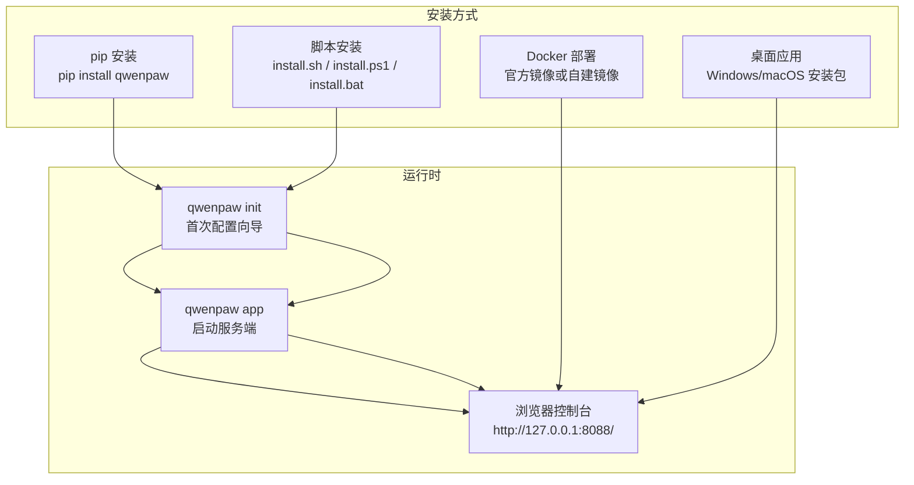
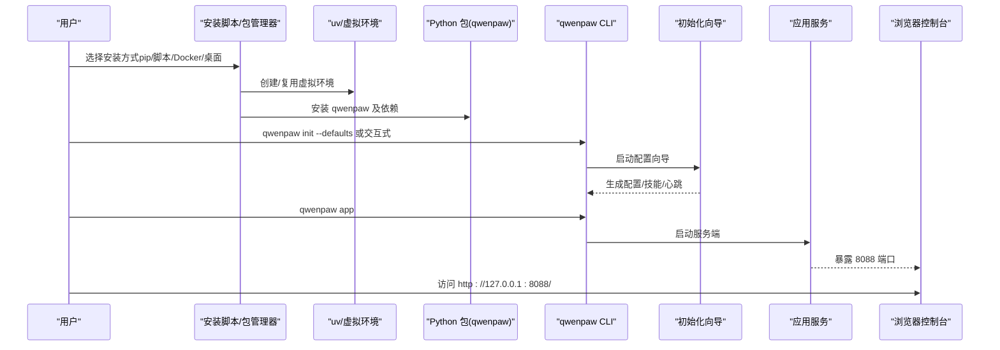
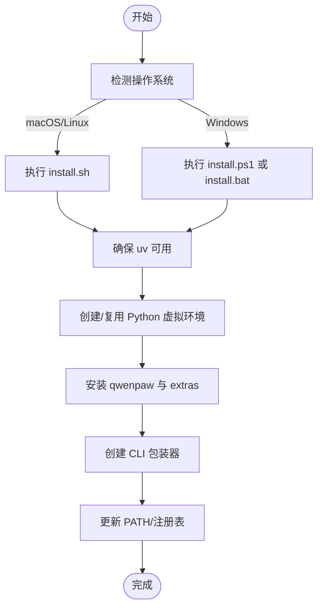
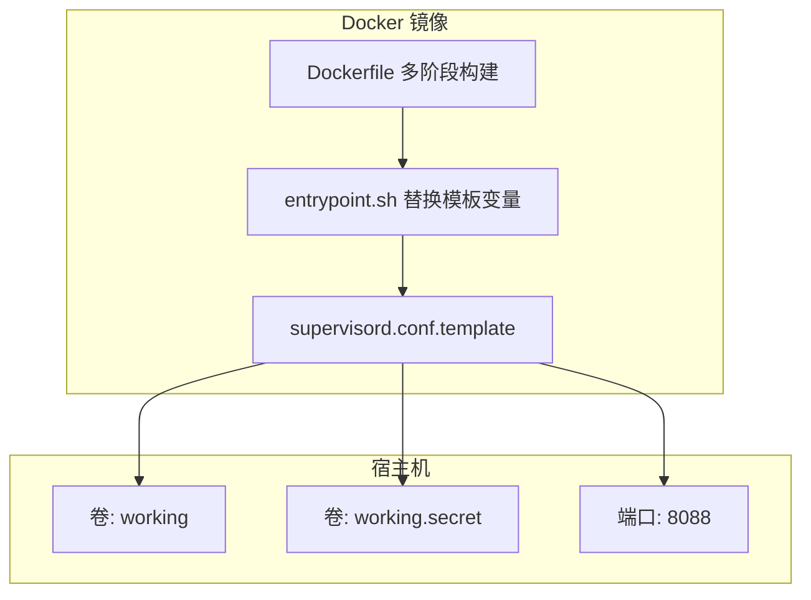
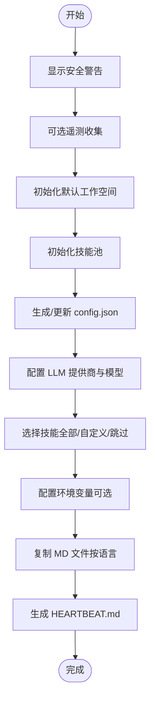
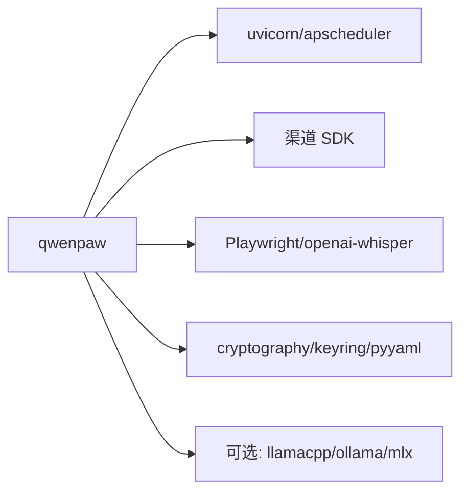

# 快速开始

<cite>
**本文引用的文件**   
- [README.md](file://README.md)
- [install.sh](file://scripts/install.sh)
- [install.ps1](file://scripts/install.ps1)
- [install.bat](file://scripts/install.bat)
- [Dockerfile](file://deploy/Dockerfile)
- [docker_build.sh](file://scripts/docker_build.sh)
- [entrypoint.sh](file://deploy/entrypoint.sh)
- [supervisord.conf.template](file://deploy/config/supervisord.conf.template)
- [pyproject.toml](file://pyproject.toml)
- [setup.py](file://setup.py)
- [main.py](file://src/qwenpaw/cli/main.py)
- [init_cmd.py](file://src/qwenpaw/cli/init_cmd.py)
- [__version__.py](file://src/qwenpaw/__version__.py)
- [desktop.nsi](file://scripts/pack/desktop.nsi)
</cite>

## 目录
1. [简介](#简介)
2. [项目结构](#项目结构)
3. [核心组件](#核心组件)
4. [架构总览](#架构总览)
5. [详细组件分析](#详细组件分析)
6. [依赖分析](#依赖分析)
7. [性能考虑](#性能考虑)
8. [故障排除指南](#故障排除指南)
9. [结论](#结论)
10. [附录](#附录)

## 简介
本指南面向首次接触 QwenPaw 的用户，帮助你在最短时间内完成安装与启动，并进行基础的聊天交互。文档覆盖多种安装方式：pip 安装、脚本安装（macOS/Linux/Windows）、Docker 部署、桌面应用（Beta）。同时提供首次配置向导的使用说明、API 密钥配置、模型设置与基本功能测试流程，并给出常见问题排查与性能优化建议。

## 项目结构
QwenPaw 提供多条安装路径，满足不同平台与使用场景的需求：
- 命令行安装：pip 安装或一键脚本安装（自动管理 uv、Python 虚拟环境与前端资源）
- 容器化部署：官方镜像或自建镜像（含多阶段构建前端与 Python 应用）
- 桌面应用：Windows/macOS 可直接下载安装包，开箱即用（Beta）

**图表来源**
- [README.md:104-330](file://README.md#L104-L330)
- [install.sh:1-340](file://scripts/install.sh#L1-L340)
- [install.ps1:1-477](file://scripts/install.ps1#L1-L477)
- [install.bat:1-557](file://scripts/install.bat#L1-L557)
- [Dockerfile:1-103](file://deploy/Dockerfile#L1-L103)
- [entrypoint.sh:1-10](file://deploy/entrypoint.sh#L1-L10)

**章节来源**
- [README.md:104-330](file://README.md#L104-L330)

## 核心组件
- CLI 入口与子命令分发：通过 Click Group 实现延迟加载，支持 app、init、models、skills、channels 等子命令
- 初始化向导：交互式生成工作目录、配置文件、心跳任务与技能池
- 容器运行时：Supervisord 管理 dbus、Xvfb、桌面环境与应用进程；入口脚本替换模板变量后启动

**章节来源**
- [main.py:58-171](file://src/qwenpaw/cli/main.py#L58-L171)
- [init_cmd.py:119-523](file://src/qwenpaw/cli/init_cmd.py#L119-L523)
- [entrypoint.sh:1-10](file://deploy/entrypoint.sh#L1-L10)
- [supervisord.conf.template:1-40](file://deploy/config/supervisord.conf.template#L1-L40)

## 架构总览
下图展示从安装到首次运行的关键流程与组件关系：

**图表来源**
- [install.sh:104-245](file://scripts/install.sh#L104-L245)
- [install.ps1:121-325](file://scripts/install.ps1#L121-L325)
- [install.bat:306-459](file://scripts/install.bat#L306-L459)
- [main.py:95-171](file://src/qwenpaw/cli/main.py#L95-L171)
- [init_cmd.py:138-523](file://src/qwenpaw/cli/init_cmd.py#L138-L523)
- [entrypoint.sh:1-10](file://deploy/entrypoint.sh#L1-L10)

## 详细组件分析

### 方案一：pip 安装
- 前置条件
  - 已安装 Python（版本要求见项目元数据）
  - 网络可访问 PyPI
- 安装步骤
  - 安装包：pip install qwenpaw
  - 初始化：qwenpaw init --defaults
  - 启动：qwenpaw app
- 验证方法
  - 浏览器打开 http://127.0.0.1:8088/，进入 Console
  - 在“设置 → 模型”中配置云模型 API Key 并启用
- 常见问题
  - 代理/网络受限：优先使用脚本安装（内置 uv 自动处理环境）
  - 权限不足：在用户命名空间安装或使用虚拟环境

**章节来源**
- [README.md:106-118](file://README.md#L106-L118)
- [pyproject.toml:6-6](file://pyproject.toml#L6-L6)
- [setup.py:1-5](file://setup.py#L1-L5)

### 方案二：脚本安装（macOS/Linux/Windows）
- 前置条件
  - macOS/Linux：系统为 Linux 或 macOS
  - Windows：PowerShell/命令提示符可用；必要时允许执行策略
- 安装步骤
  - macOS/Linux：curl -fsSL https://qwenpaw.agentscope.io/install.sh | bash
  - Windows（PowerShell）：irm https://qwenpaw.agentscope.io/install.ps1 | iex
  - Windows（CMD）：curl -fsSL https://qwenpaw.agentscope.io/install.bat -o install.bat && install.bat
  - 可选 extras：--extras ollama,local 等
- 验证方法
  - 新终端执行 qwenpaw init --defaults 与 qwenpaw app
  - 访问 http://127.0.0.1:8088/
- 常见问题
  - uv 未找到：脚本会尝试自动安装；若失败，请手动安装 uv 并重试
  - Windows 企业版 Constrained Language Mode：可能无法自动写入环境变量，需手动将安装目录加入 PATH

**图表来源**
- [install.sh:95-134](file://scripts/install.sh#L95-L134)
- [install.ps1:68-193](file://scripts/install.ps1#L68-L193)
- [install.bat:301-330](file://scripts/install.bat#L301-L330)

**章节来源**
- [README.md:122-186](file://README.md#L122-L186)
- [install.sh:1-340](file://scripts/install.sh#L1-L340)
- [install.ps1:1-477](file://scripts/install.ps1#L1-L477)
- [install.bat:1-557](file://scripts/install.bat#L1-L557)

### 方案三：Docker 部署
- 前置条件
  - 已安装 Docker
  - 需要持久化存储：工作目录与密钥目录
- 安装步骤
  - 拉取镜像：agentscope/qwenpaw:latest（或 pre 版本）
  - 运行容器：映射端口 8088，挂载工作目录与密钥目录
  - 传入 API Key：-e VAR=value 或 --env-file .env
- 连接宿主机服务（如 Ollama/LM Studio）
  - 使用 host.docker.internal 明确指向宿主机
  - 或 Linux 使用 --network=host
- 验证方法
  - 浏览器访问 http://127.0.0.1:8088/
  - 在 Console 设置模型 Base URL 为宿主机地址
- 常见问题
  - 端口冲突：修改映射端口或停止占用进程
  - 网络隔离：按上述两种方式连接宿主机服务

**图表来源**
- [Dockerfile:1-103](file://deploy/Dockerfile#L1-L103)
- [entrypoint.sh:1-10](file://deploy/entrypoint.sh#L1-L10)
- [supervisord.conf.template:1-40](file://deploy/config/supervisord.conf.template#L1-L40)

**章节来源**
- [README.md:230-272](file://README.md#L230-L272)
- [docker_build.sh:1-32](file://scripts/docker_build.sh#L1-L32)
- [Dockerfile:1-103](file://deploy/Dockerfile#L1-L103)
- [entrypoint.sh:1-10](file://deploy/entrypoint.sh#L1-L10)
- [supervisord.conf.template:1-40](file://deploy/config/supervisord.conf.template#L1-L40)

### 方案四：桌面应用（Beta）
- 前置条件
  - Windows 10+ 或 macOS 14+
- 安装步骤
  - 下载安装包：Windows QwenPaw-Setup-<version>.exe；macOS QwenPaw-<version>-macOS.zip
  - 双击安装，首次启动可能耗时 10-60 秒（初始化 Python 环境与依赖）
- 首次使用
  - 应用自动打开浏览器窗口至 http://127.0.0.1:8088/
  - 按 Console 引导完成模型与技能配置
- 常见问题
  - macOS 安全限制：右键打开或系统设置中允许不受信任开发者
  - 首次启动慢：等待应用完成环境初始化

**章节来源**
- [README.md:287-330](file://README.md#L287-L330)
- [desktop.nsi:1-57](file://scripts/pack/desktop.nsi#L1-L57)

### 首次配置向导（qwenpaw init）
- 功能概览
  - 安全提示确认（必须接受）
  - 可选匿名遥测收集
  - 默认工作空间与 QA Agent 初始化
  - 技能池初始化与同步
  - 配置 config.json（心跳间隔、目标、活跃时段等）
  - LLM 提供商与模型配置（必填）
  - 技能选择（全部/自定义/跳过）
  - 环境变量配置（可选）
  - MD 文件复制（按语言）
  - 生成 HEARTBEAT.md
- 使用建议
  - 首次运行推荐使用 --defaults 快速完成基础配置
  - 生产环境建议交互式配置，严格控制工具与通道权限

**图表来源**
- [init_cmd.py:157-523](file://src/qwenpaw/cli/init_cmd.py#L157-L523)

**章节来源**
- [init_cmd.py:1-523](file://src/qwenpaw/cli/init_cmd.py#L1-L523)

### API 密钥与模型设置
- 配置位置
  - Console 设置页（推荐）
  - qwenpaw init 交互式配置
  - 环境变量（如 DASHSCOPE_API_KEY）
- 本地模型
  - llama.cpp：无需额外安装，Web UI 点击下载后即可使用
  - Ollama/LM Studio：先启动对应服务，再在 Console 中将 Base URL 指向宿主机地址
- 验证方法
  - 在 Console 的“设置 → 模型”中启用并保存配置
  - 发送一条测试消息，观察响应是否来自所选模型

**章节来源**
- [README.md:332-345](file://README.md#L332-L345)
- [README.md:346-356](file://README.md#L346-L356)

### 基本功能测试
- 步骤
  - 启动 qwenpaw app
  - 打开 http://127.0.0.1:8088/
  - 在 Console 中配置模型与 API Key
  - 发送一条简单消息，确认响应正常
- 多通道测试（可选）
  - 完成 Quick Start 后，参考官方文档配置 DingTalk/Feishu/WeChat 等渠道

**章节来源**
- [README.md:83-86](file://README.md#L83-L86)

## 依赖分析
- Python 版本与包管理
  - Python 版本范围：>=3.10,<3.14
  - 包管理：setuptools + pip（uv 用于脚本安装）
- 关键依赖
  - Web 框架与调度：uvicorn、apscheduler
  - 渠道 SDK：钉钉、飞书、Discord、Telegram、Twilio、MQTT 等
  - 多模态与工具：Playwright、openai-whisper、pillow、transformers 等
  - 安全与加密：cryptography、keyring、pyyaml
- 可选特性
  - 本地模型：llamacpp、mlx（macOS）、ollama
  - 全量依赖：full（包含本地模型与语音相关）

**图表来源**
- [pyproject.toml:1-111](file://pyproject.toml#L1-L111)

**章节来源**
- [pyproject.toml:1-111](file://pyproject.toml#L1-L111)

## 性能考虑
- 本地模型
  - llama.cpp：跨平台，适合无额外服务依赖的场景
  - Ollama/LM Studio：利用本地 GPU 加速推理，降低网络延迟
- 容器运行
  - 使用 --network=host（Linux）可减少网络转发开销
  - 为容器分配足够内存与 CPU，避免页面渲染与自动化任务卡顿
- 首次启动优化
  - 桌面应用首次启动较慢属正常，等待其完成环境初始化
  - 脚本安装会预构建前端资源，减少后续启动时间

[本节为通用指导，无需特定文件引用]

## 故障排除指南
- 安装阶段
  - uv 未找到：脚本会尝试自动安装；若失败，手动安装后重试
  - Windows 执行策略限制：设置执行策略或使用推荐的安装方式
  - 企业版 Constrained Language Mode：无法自动更新 PATH，需手动添加安装目录
- 运行阶段
  - 端口占用：修改映射端口或释放 8088
  - 无法访问 Console：确认防火墙放行与代理设置
  - 本地模型不可用：确保 Ollama/LM Studio 已启动，Base URL 指向宿主机
- 配置阶段
  - API Key 未配置：在 Console 设置页或环境变量中补配
  - 技能未启用：在 Console 的“技能”中启用所需技能

**章节来源**
- [README.md:158-180](file://README.md#L158-L180)
- [install.sh:104-134](file://scripts/install.sh#L104-L134)
- [install.ps1:68-84](file://scripts/install.ps1#L68-L84)
- [install.bat:306-330](file://scripts/install.bat#L306-L330)
- [entrypoint.sh:1-10](file://deploy/entrypoint.sh#L1-L10)

## 结论
通过本指南，你可以根据自身平台与需求选择最适合的安装方式：追求便捷可选脚本安装；需要隔离与一致性可选 Docker；偏好图形界面可选桌面应用。完成首次配置向导后，即可在 Console 中完成模型与 API Key 的配置，并进行基础聊天测试。遇到问题时，可依据故障排除章节逐步定位与解决。

[本节为总结性内容，无需特定文件引用]

## 附录
- 版本信息
  - 当前版本：参见 __version__.py
- CLI 常用命令
  - qwenpaw init：首次配置向导
  - qwenpaw app：启动服务端
  - qwenpaw models：查看/配置模型提供商
  - qwenpaw skills：查看/管理技能
  - qwenpaw channels：配置多通道接入
- 官方文档与社区
  - 文档网站与多语言 README
  - 社区与讨论区链接

**章节来源**
- [__version__.py:1-3](file://src/qwenpaw/__version__.py#L1-L3)
- [main.py:95-171](file://src/qwenpaw/cli/main.py#L95-L171)
- [README.md:358-378](file://README.md#L358-L378)