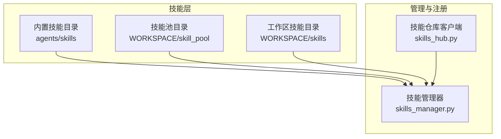
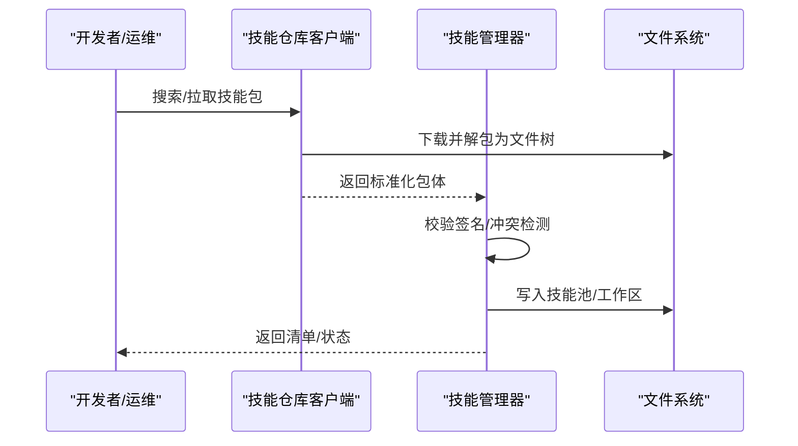
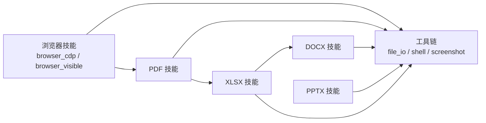

# 内置技能介绍

<cite>
**本文引用的文件**
- [skills_hub.py](file://src/qwenpaw/agents/skills_hub.py)
- [skills_manager.py](file://src/qwenpaw/agents/skills_manager.py)
- [browser_cdp/SKILL.md](file://src/qwenpaw/agents/skills/browser_cdp/SKILL.md)
- [browser_visible/SKILL.md](file://src/qwenpaw/agents/skills/browser_visible/SKILL.md)
- [docx/SKILL.md](file://src/qwenpaw/agents/skills/docx/SKILL.md)
- [pdf/SKILL.md](file://src/qwenpaw/agents/skills/pdf/SKILL.md)
- [pptx/SKILL.md](file://src/qwenpaw/agents/skills/pptx/SKILL.md)
- [xlsx/SKILL.md](file://src/qwenpaw/agents/skills/xlsx/SKILL.md)
- [tools/__init__.py](file://src/qwenpaw/agents/tools/__init__.py)
</cite>

## 目录
1. [简介](#简介)
2. [项目结构](#项目结构)
3. [核心组件](#核心组件)
4. [架构总览](#架构总览)
5. [详细组件分析](#详细组件分析)
6. [依赖分析](#依赖分析)
7. [性能考量](#性能考量)
8. [故障排查指南](#故障排查指南)
9. [结论](#结论)
10. [附录](#附录)

## 简介
本文件面向使用者与开发者，系统化介绍 QwenPaw 内置技能体系，覆盖浏览器自动化（browser_cdp、browser_visible）、文档处理（docx、pdf、pptx、xlsx）、文件操作与网络爬虫相关工具链等能力。文档重点阐述：
- 技能功能特性与适用场景
- 参数配置、返回值格式与错误处理机制
- 安全性考虑与权限控制
- 性能特点与最佳实践
- 技能间的依赖关系与组合使用方法

## 项目结构
QwenPaw 的技能系统由“技能池”“工作区技能”“内置技能”三层构成，并通过统一的技能注册与清单管理进行同步与冲突检测。技能元数据与脚本通过 SKILL.md 与 scripts 目录组织，形成可安装、可验证、可演进的技能包。

图示来源
- [skills_manager.py](file://src/qwenpaw/agents/skills_manager.py)
- [skills_hub.py](file://src/qwenpaw/agents/skills_hub.py)

章节来源
- [skills_manager.py](file://src/qwenpaw/agents/skills_manager.py)
- [skills_hub.py](file://src/qwenpaw/agents/skills_hub.py)

## 核心组件
- 技能管理器（skills_manager.py）
  - 负责内置技能签名计算、工作区与技能池的清单同步、冲突检测与重命名建议、环境变量注入、文件锁与原子写入等。
  - 提供技能导入候选、规范化目录名、安全路径解析、zip 解压校验等能力。
- 技能仓库客户端（skills_hub.py）
  - 提供从云端仓库搜索、拉取、解包、校验与回退策略，支持超时、重试、指数退避、速率限制与取消检查。
  - 将远端返回的“包体”标准化为本地可安装的文件树与元数据。

章节来源
- [skills_manager.py](file://src/qwenpaw/agents/skills_manager.py)
- [skills_hub.py](file://src/qwenpaw/agents/skills_hub.py)

## 架构总览
下图展示技能生命周期：从内置技能打包、工作区同步、云端仓库安装，到运行期的环境变量注入与冲突处理。

图示来源
- [skills_hub.py](file://src/qwenpaw/agents/skills_hub.py)
- [skills_manager.py](file://src/qwenpaw/agents/skills_manager.py)

## 详细组件分析

### 浏览器自动化技能

#### browser_cdp（CDP 远程调试）
- 功能要点
  - 支持扫描本地 CDP 端口、连接已有 Chrome、以暴露 CDP 端口启动浏览器。
  - 明确区分“默认模式”（Playwright 私有管理，不暴露）与“CDP 模式”（可被外部程序访问，存在隐私风险）。
  - 同一工作区同时仅允许一个浏览器实例运行或连接。
- 参数与行为
  - 列举目标：列出可连接的 CDP 目标，支持指定端口或端口范围。
  - 连接：通过 CDP URL 连接到已有 Chrome，断连时需重新连接。
  - 启动：可选择以暴露 CDP 端口的方式启动浏览器，便于多工具共享。
  - 停止：根据启动方式不同，行为不同（连接模式仅断开，启动模式会终止进程）。
  - 清理：支持清除浏览器缓存（运行中通过 CDP，停止后清理磁盘缓存）。
- 返回值与错误
  - 成功返回包含 ok 与消息；失败返回错误码与提示（如 CDP 连接丢失需重新 connect_cdp）。
- 安全与权限
  - CDP 模式会暴露历史、Cookies、页面内容等敏感信息，需用户知情同意。
  - 端口暴露仅限受信本地环境，避免公共网络与多用户服务器。
- 最佳实践
  - 优先使用默认模式；仅在用户明确共享或调试需求时启用 CDP。
  - 切换实例前先 stop，避免冲突。
  - 使用 headed 模式时确保有图形环境。

章节来源
- [browser_cdp/SKILL.md](file://src/qwenpaw/agents/skills/browser_cdp/SKILL.md)

#### browser_visible（可见浏览器）
- 功能要点
  - 在需要真实窗口、演示或人工交互的场景，以 headed 模式启动浏览器。
  - 与默认无头模式相比，弹出真实窗口，适合教学、演示与验证码等需要人工参与的流程。
- 参数与行为
  - 通过 browser_use 的 start 动作配合 headed=true 启动可见浏览器。
  - 后续 open/snapshot/click 等操作与无头模式一致。
- 返回值与错误
  - 成功返回窗口句柄与操作结果；失败返回错误提示（如需先 stop 切换）。
- 安全与权限
  - 可见模式依赖桌面环境，服务器或无图形环境不可用。
- 最佳实践
  - 明确用户意图后启用；完成后及时 stop 释放资源。

章节来源
- [browser_visible/SKILL.md](file://src/qwenpaw/agents/skills/browser_visible/SKILL.md)

### 文档处理技能

#### docx（Word 文档）
- 功能要点
  - 新建、读取、编辑、转换与导出 .doc/.docx 文件；提取文本与表格；接受修订；生成图片预览。
  - 依赖 docx-js（JavaScript）、LibreOffice、pandoc、pdftoppm 等工具链。
- 参数与行为
  - 创建：使用 docx-js 生成文档，随后验证与打包。
  - 编辑：解包 XML、修改后重新打包，遵循严格的样式与编号规则。
  - 转换：.doc 转 .docx、.docx 转 PDF、PDF 转图像等。
  - 修订：支持跟踪更改与评论，遵循规范的 XML 结构。
- 返回值与错误
  - 成功返回文件路径与摘要；失败返回错误原因（如依赖缺失、XML 格式错误）。
- 安全与权限
  - 严格校验 zip 内容与路径，防止路径穿越与符号链接。
- 最佳实践
  - 明确页面尺寸与方向，使用 DXA 单位；列表与表格务必设置双宽度；图片需指定类型与替代文本；TOC 使用内置标题样式并设置 outlineLevel。
  - 修改前先 unpack，修改后使用 validate/pack 流程，必要时启用 auto-repair。

章节来源
- [docx/SKILL.md](file://src/qwenpaw/agents/skills/docx/SKILL.md)

#### pdf（PDF 处理）
- 功能要点
  - 文本与表格提取、合并/拆分、旋转、加水印、创建 PDF、表单填写、加密/解密、提取图像、扫描版 OCR。
  - 依赖 pypdf、pdfplumber、reportlab、pdftotext、pdftoppm、qpdf 等。
- 参数与行为
  - 读取：pypdf 读取元数据与页数；pdfplumber 提取文本与表格。
  - 合并与拆分：pypdf 或 qpdf 实现。
  - 创建：reportlab 生成 PDF。
  - OCR：pdf2image + pytesseract 对扫描版 PDF 进行识别。
- 返回值与错误
  - 成功返回输出文件；失败返回错误（如权限错误、格式不支持）。
- 安全与权限
  - 严格校验 zip 与路径，避免危险内容。
- 最佳实践
  - 使用 reportlab 时避免 Unicode 下标/上标字符，改用 XML 标签；公式与图表尽量使用矢量格式；OCR 前先评估清晰度。

章节来源
- [pdf/SKILL.md](file://src/qwenpaw/agents/skills/pdf/SKILL.md)

#### pptx（PowerPoint 幻灯片）
- 功能要点
  - 读取/解析/提取文本、编辑/修改现有演示、从模板创建、合并/拆分、缩略图生成、设计建议与 QA 流程。
  - 依赖 markitdown、Pillow、pptxgenjs、LibreOffice、pdftoppm 等。
- 参数与行为
  - 读取：markitdown 提取文本与结构；thumbnail 生成缩略图；unpack 查看原始 XML。
  - 编辑：基于模板分析、解包、修改、清理、打包。
  - 创建：pptxgenjs 从零生成演示。
- 返回值与错误
  - 成功返回输出文件；失败返回错误（如模板占位符残留、布局不匹配）。
- 安全与权限
  - 严格校验 zip 与路径，防止恶意内容。
- 最佳实践
  - 设计上采用主题色与视觉动机，避免纯文本幻灯片；QA 采用子代理复核与图像对比；修复后重新渲染特定幻灯片以验证。

章节来源
- [pptx/SKILL.md](file://src/qwenpaw/agents/skills/pptx/SKILL.md)

#### xlsx（电子表格）
- 功能要点
  - 读取/分析、编辑/修复、新建、格式化、公式构建、图表、跨文件链接、公式重算与错误检查。
  - 依赖 openpyxl、pandas、LibreOffice、git（可选）。
- 参数与行为
  - 分析：pandas 读取与统计；openpyxl 读取与写入。
  - 编辑：保持公式与格式，插入/删除行列，新增工作表。
  - 创建：openpyxl 构建工作簿与格式。
  - 重算：scripts/recalc.py 调用 LibreOffice 重算并返回错误摘要。
- 返回值与错误
  - 成功返回输出文件；失败返回具体错误类型与位置（#REF!、#DIV/0! 等）。
- 安全与权限
  - 严格校验 zip 与路径，防止危险内容。
- 最佳实践
  - 全部使用公式而非硬编码数值；颜色与数字格式遵循行业标准；先小范围测试再全局应用；使用 scripts/recalc.py 逐轮修复并验证。

章节来源
- [xlsx/SKILL.md](file://src/qwenpaw/agents/skills/xlsx/SKILL.md)

### 文件操作与工具链
- 工具聚合入口（tools/__init__.py）
  - 汇聚文件读写、搜索、Shell 执行、截图、媒体查看、内存检索、时间与时区、令牌用量等常用工具。
  - 作为技能调用外部系统能力的统一出口，便于在技能中组合使用。
- 与技能的关系
  - 技能可通过工具链完成文件 IO、命令执行、屏幕截图等辅助动作，提升自动化闭环能力。

章节来源
- [tools/__init__.py](file://src/qwenpaw/agents/tools/__init__.py)

## 依赖分析
- 技能间依赖
  - 浏览器类技能（browser_cdp、browser_visible）依赖底层浏览器驱动与 Playwright；二者互斥于同一工作区。
  - 文档类技能（docx、pdf、pptx、xlsx）依赖各自生态的第三方工具链（docx-js、LibreOffice、pypdf、reportlab、markitdown、openpyxl 等）。
  - 工具链（tools）为技能提供通用能力补充（文件、Shell、截图、媒体等）。
- 管理与同步
  - 内置技能签名用于工作区与技能池的同步与冲突检测；云端仓库提供版本化包体与文件树标准化。
- 组合使用
  - 示例：先用 pdf 技能提取文本与表格，再用 xlsx 技能清洗与建模，最后用 docx 技能生成报告；或先用 browser_cdp 抓取网页，再用 pdf 技能转存为 PDF。

图示来源
- [browser_cdp/SKILL.md](file://src/qwenpaw/agents/skills/browser_cdp/SKILL.md)
- [browser_visible/SKILL.md](file://src/qwenpaw/agents/skills/browser_visible/SKILL.md)
- [pdf/SKILL.md](file://src/qwenpaw/agents/skills/pdf/SKILL.md)
- [docx/SKILL.md](file://src/qwenpaw/agents/skills/docx/SKILL.md)
- [pptx/SKILL.md](file://src/qwenpaw/agents/skills/pptx/SKILL.md)
- [xlsx/SKILL.md](file://src/qwenpaw/agents/skills/xlsx/SKILL.md)
- [tools/__init__.py](file://src/qwenpaw/agents/tools/__init__.py)

## 性能考量
- I/O 与压缩
  - 技能包解压与文件树构建采用流式读取与路径校验，限制最大解压体积与条目数量，避免内存与磁盘压力。
- 网络与重试
  - 云端仓库请求支持超时、重试与指数退避，针对 429/5xx 与 GitHub 速率限制进行专门处理。
- 浏览器与工具链
  - 浏览器操作涉及进程启动与网络请求，建议在稳定网络与充足资源环境下运行；CDP 模式仅限本地可信环境。
- 数据处理
  - 大型 PDF/表格处理建议分页或分表处理，避免一次性加载导致内存峰值过高。

## 故障排查指南
- 云端仓库安装失败
  - 检查网络与超时配置，确认 GITHUB_TOKEN 以提升 GitHub API 限额；关注 429/5xx 错误与速率限制提示。
- 技能包内容过大或异常
  - 解压包超过大小限制或包含路径穿越/符号链接时会触发错误；请重新下载或修正来源。
- 浏览器相关问题
  - CDP 连接中断：按提示重新 connect_cdp；确保同一工作区仅有一个浏览器实例。
  - 可见浏览器无法弹窗：确认有图形环境与权限。
- 文档类技能问题
  - docx：XML 格式错误或缺少必要属性时，使用 validate/pack 流程修复；注意 DXA 宽度与表格双宽度一致性。
  - pdf：OCR 前评估清晰度；使用 pdftoppm 或 pdf2image 生成中间图像。
  - pptx：检查模板占位符与布局；使用 thumbnail 与图像对比进行 QA。
  - xlsx：使用 scripts/recalc.py 重算并修复公式错误；避免硬编码数值。
- 工具链依赖缺失
  - 按各技能文档中的前置条件安装对应工具（如 npm、LibreOffice、poppler-utils 等），并在 PATH 中可用。

章节来源
- [skills_hub.py](file://src/qwenpaw/agents/skills_hub.py)
- [skills_manager.py](file://src/qwenpaw/agents/skills_manager.py)
- [browser_cdp/SKILL.md](file://src/qwenpaw/agents/skills/browser_cdp/SKILL.md)
- [browser_visible/SKILL.md](file://src/qwenpaw/agents/skills/browser_visible/SKILL.md)
- [docx/SKILL.md](file://src/qwenpaw/agents/skills/docx/SKILL.md)
- [pdf/SKILL.md](file://src/qwenpaw/agents/skills/pdf/SKILL.md)
- [pptx/SKILL.md](file://src/qwenpaw/agents/skills/pptx/SKILL.md)
- [xlsx/SKILL.md](file://src/qwenpaw/agents/skills/xlsx/SKILL.md)

## 结论
QwenPaw 的内置技能体系以“可安装、可验证、可演进”为目标，围绕浏览器自动化与文档处理构建了完善的工具链与最佳实践。通过严格的签名与冲突检测、云端仓库的版本化管理以及详尽的 SKILL.md 指南，用户可以在保证安全性与性能的前提下，灵活组合多种技能完成复杂任务。建议在生产环境中遵循“最小暴露面”原则（尤其是 CDP 模式）、优先使用公式与模板、并结合 QA 流程持续优化交付质量。

## 附录
- 环境变量与配置
  - 技能仓库客户端支持超时、重试、退避、缓存 TTL 等环境变量配置，便于在不同网络与资源条件下调优。
- 权限与安全
  - 技能管理器对 zip 内容与路径进行严格校验，防止路径穿越与符号链接；CDP 模式仅限本地可信环境。
- 版本与兼容
  - 内置技能通过签名与 frontmatter 版本字段进行版本管理，工作区与技能池同步时自动识别差异并提示升级或保留。