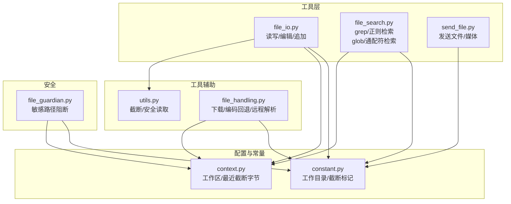
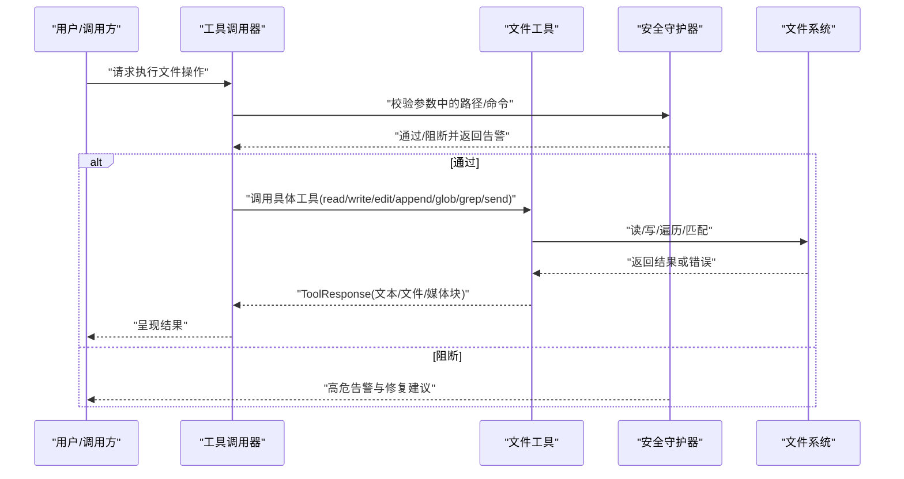
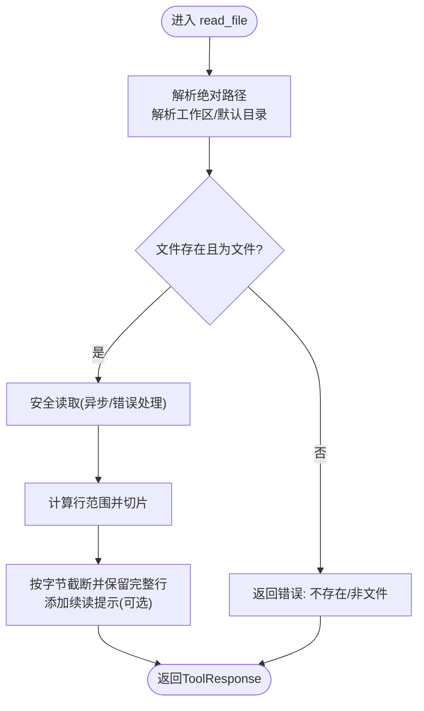
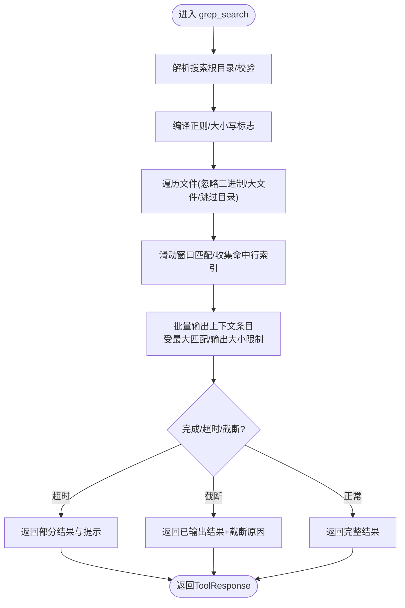
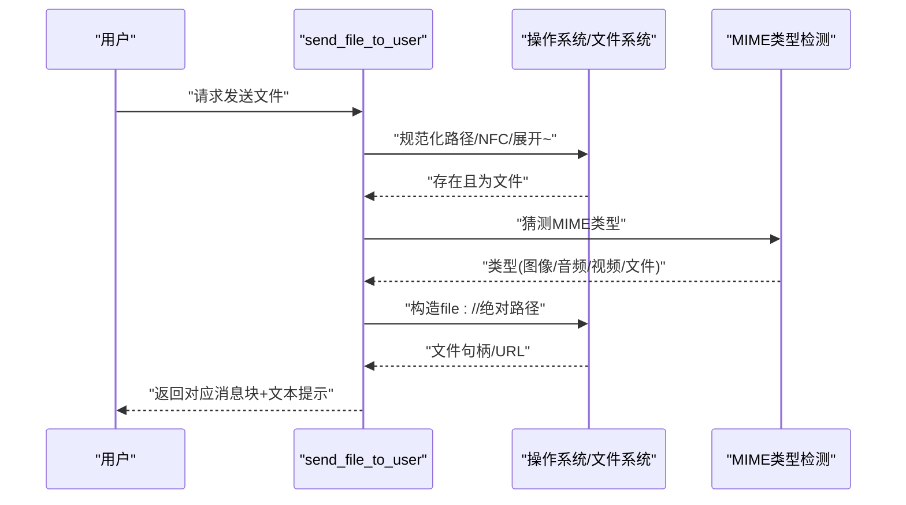
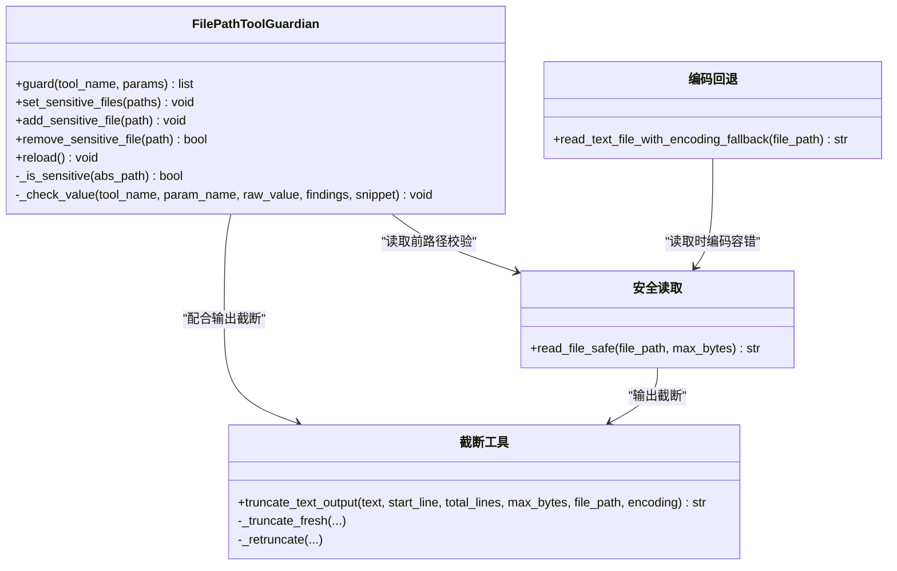
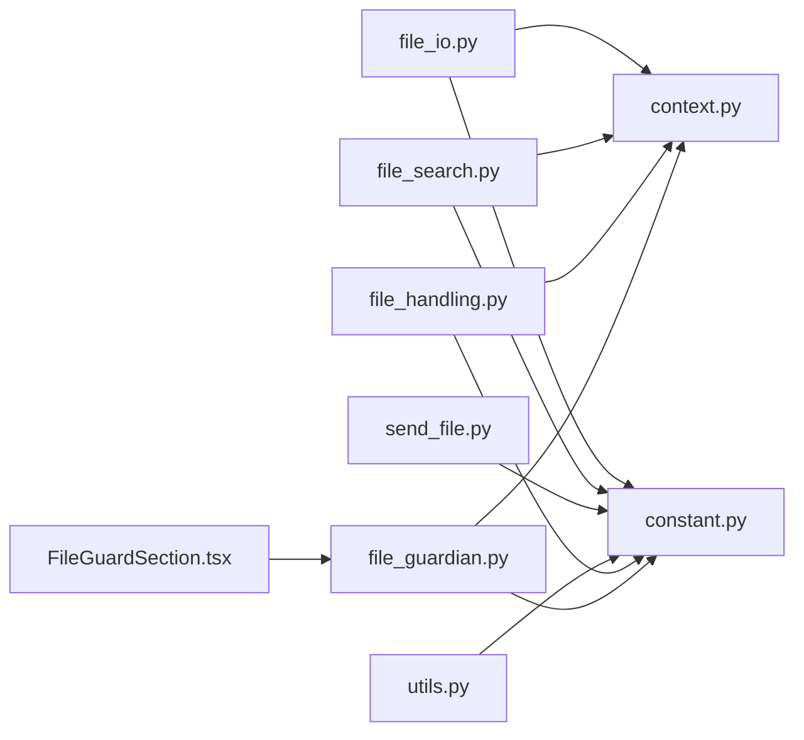

# 文件系统技能

<cite>
**本文引用的文件**
- [file_io.py](file://src/qwenpaw/agents/tools/file_io.py)
- [file_search.py](file://src/qwenpaw/agents/tools/file_search.py)
- [send_file.py](file://src/qwenpaw/agents/tools/send_file.py)
- [file_handling.py](file://src/qwenpaw/agents/utils/file_handling.py)
- [utils.py](file://src/qwenpaw/agents/tools/utils.py)
- [context.py](file://src/qwenpaw/config/context.py)
- [constant.py](file://src/qwenpaw/constant.py)
- [file_guardian.py](file://src/qwenpaw/security/tool_guard/guardians/file_guardian.py)
- [FileGuardSection.tsx](file://console/src/pages/Settings/Security/components/FileGuardSection.tsx)
- [test_file_search.py](file://tests/unit/agents/tools/test_file_search.py)
</cite>

## 目录
1. [简介](#简介)
2. [项目结构](#项目结构)
3. [核心组件](#核心组件)
4. [架构总览](#架构总览)
5. [详细组件分析](#详细组件分析)
6. [依赖分析](#依赖分析)
7. [性能考量](#性能考量)
8. [故障排查指南](#故障排查指南)
9. [结论](#结论)
10. [附录](#附录)

## 简介
本文件系统技能围绕三大能力展开：文件I/O（读写与编辑）、文件搜索（内容检索与路径匹配）、文件发送（多媒体与通用文件）。文档化了接口参数、权限与安全控制、错误处理机制，并对检索算法、过滤条件、结果排序、传输协议与格式支持、路径安全验证、异常处理策略、最佳实践与性能优化进行深入说明。同时覆盖文件监控、批量操作与跨平台兼容性处理。

## 项目结构
文件系统技能相关代码主要分布在以下模块：
- 工具层：文件I/O、文件搜索、文件发送
- 工具辅助：文本截断与安全读取、编码回退
- 配置上下文：工作区目录与输出截断字节限制
- 常量：工作目录、截断标记等
- 安全：文件路径守护（敏感路径阻断）
- 控制台：文件守护策略的可视化配置界面
- 测试：文件搜索行为与边界条件验证

图示来源
- [file_io.py:1-396](file://src/qwenpaw/agents/tools/file_io.py#L1-L396)
- [file_search.py:1-629](file://src/qwenpaw/agents/tools/file_search.py#L1-L629)
- [send_file.py:1-123](file://src/qwenpaw/agents/tools/send_file.py#L1-L123)
- [utils.py:1-238](file://src/qwenpaw/agents/tools/utils.py#L1-L238)
- [file_handling.py:1-357](file://src/qwenpaw/agents/utils/file_handling.py#L1-L357)
- [context.py:1-59](file://src/qwenpaw/config/context.py#L1-L59)
- [constant.py:1-307](file://src/qwenpaw/constant.py#L1-L307)
- [file_guardian.py:1-365](file://src/qwenpaw/security/tool_guard/guardians/file_guardian.py#L1-L365)

章节来源
- [file_io.py:1-396](file://src/qwenpaw/agents/tools/file_io.py#L1-L396)
- [file_search.py:1-629](file://src/qwenpaw/agents/tools/file_search.py#L1-L629)
- [send_file.py:1-123](file://src/qwenpaw/agents/tools/send_file.py#L1-L123)
- [utils.py:1-238](file://src/qwenpaw/agents/tools/utils.py#L1-L238)
- [file_handling.py:1-357](file://src/qwenpaw/agents/utils/file_handling.py#L1-L357)
- [context.py:1-59](file://src/qwenpaw/config/context.py#L1-L59)
- [constant.py:1-307](file://src/qwenpaw/constant.py#L1-L307)
- [file_guardian.py:1-365](file://src/qwenpaw/security/tool_guard/guardians/file_guardian.py#L1-L365)

## 核心组件
- 文件I/O工具集：提供读取、写入、编辑（全文替换）、追加等能力；支持行范围读取、智能截断与续读提示、跨平台编码适配。
- 文件搜索工具集：支持正则/字符串内容检索（grep）与通配符路径检索（glob），具备超时控制、最大匹配数与输出大小限制、上下文行展示。
- 文件发送工具：根据MIME类型自动识别并以图片/音频/视频/通用文件块发送，采用本地文件URL而非Base64，兼顾性能与安全性。
- 辅助与安全：文本截断与重截断、安全读取（异步与错误处理）、编码回退、路径规范化与敏感路径阻断、工作区上下文注入。

章节来源
- [file_io.py:66-396](file://src/qwenpaw/agents/tools/file_io.py#L66-L396)
- [file_search.py:478-629](file://src/qwenpaw/agents/tools/file_search.py#L478-L629)
- [send_file.py:29-123](file://src/qwenpaw/agents/tools/send_file.py#L29-L123)
- [utils.py:153-238](file://src/qwenpaw/agents/tools/utils.py#L153-L238)
- [file_handling.py:31-102](file://src/qwenpaw/agents/utils/file_handling.py#L31-L102)
- [file_guardian.py:184-365](file://src/qwenpaw/security/tool_guard/guardians/file_guardian.py#L184-L365)

## 架构总览
文件系统技能通过工具函数与消息块返回统一的工具响应，结合安全守护器在调用前进行路径合法性检查，确保操作在受控的工作区内执行。

图示来源
- [file_guardian.py:313-365](file://src/qwenpaw/security/tool_guard/guardians/file_guardian.py#L313-L365)
- [file_io.py:66-396](file://src/qwenpaw/agents/tools/file_io.py#L66-L396)
- [file_search.py:478-629](file://src/qwenpaw/agents/tools/file_search.py#L478-L629)
- [send_file.py:29-123](file://src/qwenpaw/agents/tools/send_file.py#L29-L123)

## 详细组件分析

### 文件I/O组件分析
- 路径解析与工作区上下文
  - 绝对路径直接使用；相对路径基于当前工作区目录解析，若未设置则回退至全局工作目录。
  - 输出截断字节上限可由上下文动态设置，用于近期输出的智能截断。
- 编码策略
  - 文本文件按扩展名选择“带BOM UTF-8”或“UTF-8”，提升跨平台（尤其是Windows）兼容性。
- 读取
  - 支持行范围读取（含起止行号校验与越界处理）。
  - 智能截断：超过上限时按字节切分并保留完整行，附加续读提示，便于分页拉取。
  - 部分读取且未截断时，追加提示信息指导下一次调用。
- 写入/追加
  - 自动选择合适编码写入；成功返回写入字节数。
- 编辑
  - 全文精确替换；若目标文本不存在则报错；替换后复用写入流程并继承其错误处理。

图示来源
- [file_io.py:66-206](file://src/qwenpaw/agents/tools/file_io.py#L66-L206)
- [utils.py:153-207](file://src/qwenpaw/agents/tools/utils.py#L153-L207)

章节来源
- [file_io.py:23-64](file://src/qwenpaw/agents/tools/file_io.py#L23-L64)
- [file_io.py:66-206](file://src/qwenpaw/agents/tools/file_io.py#L66-L206)
- [file_io.py:208-254](file://src/qwenpaw/agents/tools/file_io.py#L208-L254)
- [file_io.py:257-347](file://src/qwenpaw/agents/tools/file_io.py#L257-L347)
- [file_io.py:349-396](file://src/qwenpaw/agents/tools/file_io.py#L349-L396)
- [utils.py:153-238](file://src/qwenpaw/agents/tools/utils.py#L153-L238)
- [context.py:18-59](file://src/qwenpaw/config/context.py#L18-L59)
- [constant.py:89-101](file://src/qwenpaw/constant.py#L89-L101)
- [constant.py:295-307](file://src/qwenpaw/constant.py#L295-L307)

### 文件搜索组件分析
- 检索类型
  - grep_search：支持正则/字符串模式、大小写敏感、上下文行数、仅匹配特定文件名模式。
  - glob_search：支持通配符路径匹配，递归受限于最大匹配数与超时。
- 过滤与扫描
  - 忽略二进制与大文件（阈值可配置），跳过常见版本控制/缓存/构建目录。
  - 使用滑动窗口与缓冲队列高效处理匹配与上下文输出，避免一次性加载整文件。
- 结果与超时
  - 超时/截断时返回部分结果与提示；无匹配返回明确提示。
  - 上下文输出以“文件:行:内容”格式，命中行前缀“>”，上下文行前缀空格，命中行之间以分隔线分隔。
- 参数与限制
  - 最大匹配数、最大输出字符数、最大扫描文件数、单文件最大大小、上下文行上限、超时时间等均有明确阈值。

图示来源
- [file_search.py:478-577](file://src/qwenpaw/agents/tools/file_search.py#L478-L577)
- [file_search.py:274-436](file://src/qwenpaw/agents/tools/file_search.py#L274-L436)

章节来源
- [file_search.py:110-128](file://src/qwenpaw/agents/tools/file_search.py#L110-L128)
- [file_search.py:134-162](file://src/qwenpaw/agents/tools/file_search.py#L134-L162)
- [file_search.py:164-267](file://src/qwenpaw/agents/tools/file_search.py#L164-L267)
- [file_search.py:274-436](file://src/qwenpaw/agents/tools/file_search.py#L274-L436)
- [file_search.py:478-629](file://src/qwenpaw/agents/tools/file_search.py#L478-L629)
- [test_file_search.py:519-549](file://tests/unit/agents/tools/test_file_search.py#L519-L549)

### 文件发送组件分析
- 路径规范化与存在性校验
  - 使用Unicode NFC规范化与“~”展开，确保跨平台路径一致性。
  - 校验文件存在且为常规文件。
- MIME类型与块类型映射
  - 自动识别图像/音频/视频/通用文件，分别生成对应的消息块。
- 传输协议与格式支持
  - 采用本地文件URL（file://）传递，避免Base64带来的体积与性能问题。
  - 支持多种常见媒体格式（图片、音视频）与通用文件。
- 安全性考虑
  - 仅在本地可用时发送；未知类型默认为二进制流。
  - 与安全守护器配合，防止工作区外路径被访问。

图示来源
- [send_file.py:29-123](file://src/qwenpaw/agents/tools/send_file.py#L29-L123)

章节来源
- [send_file.py:29-123](file://src/qwenpaw/agents/tools/send_file.py#L29-L123)

### 辅助与安全组件分析
- 文本截断与重截断
  - 首次截断：按字节切分并保留完整行，附加续读提示；续读提示包含起始行、总行数、字节覆盖范围与下一次起始行。
  - 重截断：当已有截断标记时，解析旧提示并更新新字节限制与续读起点，保证连续对话中的一致体验。
- 安全读取
  - 异步读取并带错误处理；优先尝试带BOM的UTF-8解码，失败则忽略错误继续读取，避免因编码导致的失败。
- 编码回退
  - 多种编码尝试（UTF-8/UTF-8-BOM/GBK/CP936/CP1252/Latin-1），最后以UTF-8替换错误字符兜底。
- 路径规范化与敏感路径阻断
  - 将相对路径与用户输入统一规范化为绝对路径；敏感路径集合包括配置项与历史兼容的密钥目录。
  - 对已知文件工具参数与Shell命令进行路径提取与阻断，支持目录级阻断与文件级阻断。

图示来源
- [file_guardian.py:184-365](file://src/qwenpaw/security/tool_guard/guardians/file_guardian.py#L184-L365)
- [utils.py:153-238](file://src/qwenpaw/agents/tools/utils.py#L153-L238)
- [file_handling.py:31-102](file://src/qwenpaw/agents/utils/file_handling.py#L31-L102)

章节来源
- [utils.py:25-207](file://src/qwenpaw/agents/tools/utils.py#L25-L207)
- [file_handling.py:31-102](file://src/qwenpaw/agents/utils/file_handling.py#L31-L102)
- [file_handling.py:246-357](file://src/qwenpaw/agents/utils/file_handling.py#L246-L357)
- [file_guardian.py:184-365](file://src/qwenpaw/security/tool_guard/guardians/file_guardian.py#L184-L365)

## 依赖分析
- 工具层内部耦合度低，职责清晰：I/O负责文件读写编辑；搜索负责内容与路径检索；发送负责消息块输出。
- 工具层与配置上下文弱耦合：通过工作区上下文变量与常量注入路径与截断策略。
- 安全守护器独立于工具层，通过统一的工具签名与Shell命令解析进行阻断，避免硬编码路径白名单。
- 控制台界面提供文件守护策略的可视化配置入口，便于运维人员调整敏感路径列表。

图示来源
- [file_io.py:1-396](file://src/qwenpaw/agents/tools/file_io.py#L1-L396)
- [file_search.py:1-629](file://src/qwenpaw/agents/tools/file_search.py#L1-L629)
- [send_file.py:1-123](file://src/qwenpaw/agents/tools/send_file.py#L1-L123)
- [utils.py:1-238](file://src/qwenpaw/agents/tools/utils.py#L1-L238)
- [file_handling.py:1-357](file://src/qwenpaw/agents/utils/file_handling.py#L1-L357)
- [context.py:1-59](file://src/qwenpaw/config/context.py#L1-L59)
- [constant.py:1-307](file://src/qwenpaw/constant.py#L1-L307)
- [file_guardian.py:1-365](file://src/qwenpaw/security/tool_guard/guardians/file_guardian.py#L1-L365)
- [FileGuardSection.tsx:1-198](file://console/src/pages/Settings/Security/components/FileGuardSection.tsx#L1-L198)

章节来源
- [file_io.py:1-396](file://src/qwenpaw/agents/tools/file_io.py#L1-L396)
- [file_search.py:1-629](file://src/qwenpaw/agents/tools/file_search.py#L1-L629)
- [send_file.py:1-123](file://src/qwenpaw/agents/tools/send_file.py#L1-L123)
- [utils.py:1-238](file://src/qwenpaw/agents/tools/utils.py#L1-L238)
- [file_handling.py:1-357](file://src/qwenpaw/agents/utils/file_handling.py#L1-L357)
- [context.py:1-59](file://src/qwenpaw/config/context.py#L1-L59)
- [constant.py:1-307](file://src/qwenpaw/constant.py#L1-L307)
- [file_guardian.py:1-365](file://src/qwenpaw/security/tool_guard/guardians/file_guardian.py#L1-L365)
- [FileGuardSection.tsx:1-198](file://console/src/pages/Settings/Security/components/FileGuardSection.tsx#L1-L198)

## 性能考量
- I/O读取
  - 异步读取与内存保护（最大读取字节限制），避免大文件一次性载入内存。
  - 智能截断减少网络与渲染压力，支持分页续读。
- 搜索
  - 滑动窗口与缓冲队列降低内存占用；二进制/大文件快速跳过；最大匹配数与输出大小限制防止膨胀。
  - 超时控制与取消事件，保障长时间扫描的可控性。
- 发送
  - 采用本地文件URL而非Base64，显著降低传输体积与CPU开销。
- 编码回退
  - 多种编码尝试与最终兜底，提高跨平台兼容性，减少失败重试成本。

章节来源
- [utils.py:20-238](file://src/qwenpaw/agents/tools/utils.py#L20-L238)
- [file_search.py:274-436](file://src/qwenpaw/agents/tools/file_search.py#L274-L436)
- [send_file.py:75-123](file://src/qwenpaw/agents/tools/send_file.py#L75-L123)
- [file_handling.py:31-102](file://src/qwenpaw/agents/utils/file_handling.py#L31-L102)

## 故障排查指南
- 读取失败
  - 检查路径是否存在、是否为文件；确认工作区上下文是否正确设置；查看截断提示是否需要分页续读。
- 写入/追加失败
  - 检查目标路径可写权限与磁盘空间；确认编码选择是否合理。
- 编辑失败
  - 确认待替换文本存在于文件中；若替换后写入失败，查看写入错误信息。
- 搜索无结果/超时
  - 缩小搜索范围或使用更具体的模式；检查是否被二进制/大文件过滤；关注超时与截断提示。
- 发送失败
  - 确认文件存在且为常规文件；检查MIME类型识别与本地URL可达性。
- 安全阻断
  - 若被阻断，检查敏感路径列表与工作区外路径提示；必要时调整配置或在UI中更新文件守护策略。

章节来源
- [file_io.py:114-206](file://src/qwenpaw/agents/tools/file_io.py#L114-L206)
- [file_search.py:537-577](file://src/qwenpaw/agents/tools/file_search.py#L537-L577)
- [send_file.py:48-123](file://src/qwenpaw/agents/tools/send_file.py#L48-L123)
- [file_guardian.py:313-365](file://src/qwenpaw/security/tool_guard/guardians/file_guardian.py#L313-L365)
- [FileGuardSection.tsx:57-100](file://console/src/pages/Settings/Security/components/FileGuardSection.tsx#L57-L100)

## 结论
文件系统技能通过清晰的工具分层、完善的路径解析与工作区上下文、严格的截断与安全策略，实现了稳定、可扩展、跨平台的文件I/O、搜索与发送能力。结合安全守护器与可视化配置界面，可在保障安全的前提下满足多样化的文件操作需求。

## 附录
- 最佳实践
  - 优先使用工作区相对路径，避免硬编码绝对路径。
  - 大文件读取采用分页续读策略，避免一次性截断。
  - 搜索时尽量缩小范围与使用更精确的模式，减少扫描与输出压力。
  - 发送文件优先采用本地URL，避免Base64带来的体积与性能问题。
  - 定期维护敏感路径列表，确保关键目录与文件不被误操作。
- 跨平台兼容性
  - 路径规范化与Unicode NFC处理；编码回退策略覆盖多语言场景。
- 批量操作建议
  - 利用搜索结果作为批量操作的输入，结合工作区上下文与安全策略进行批量读取/写入/发送。