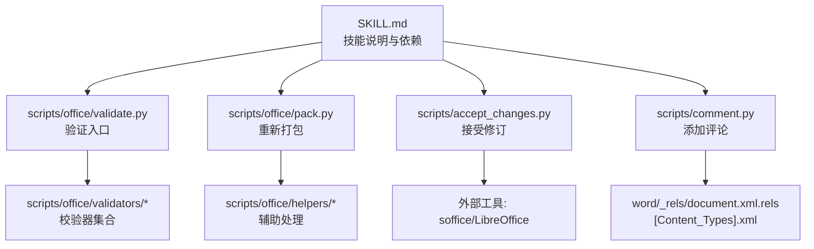
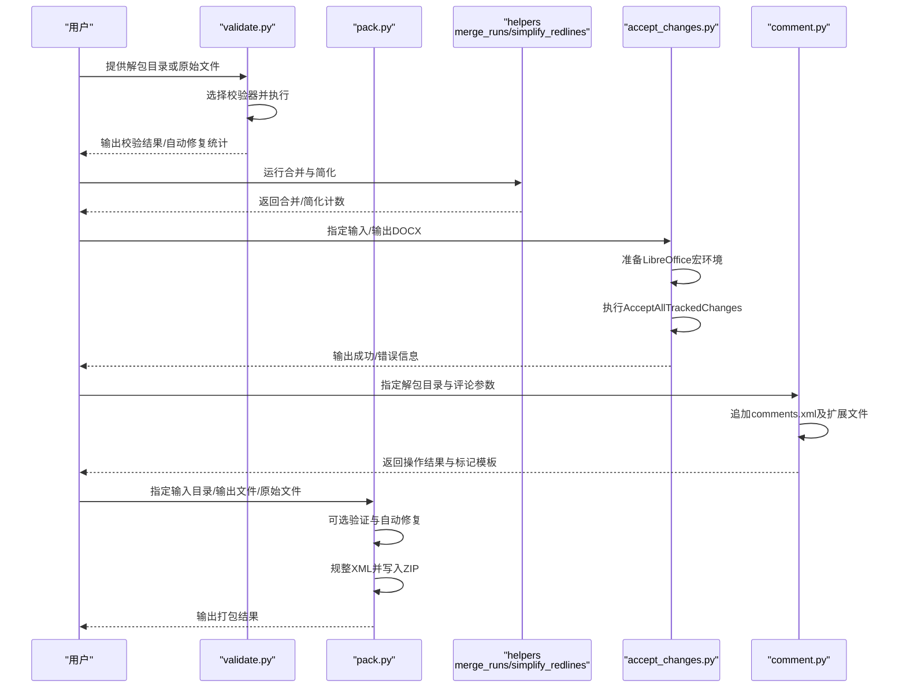
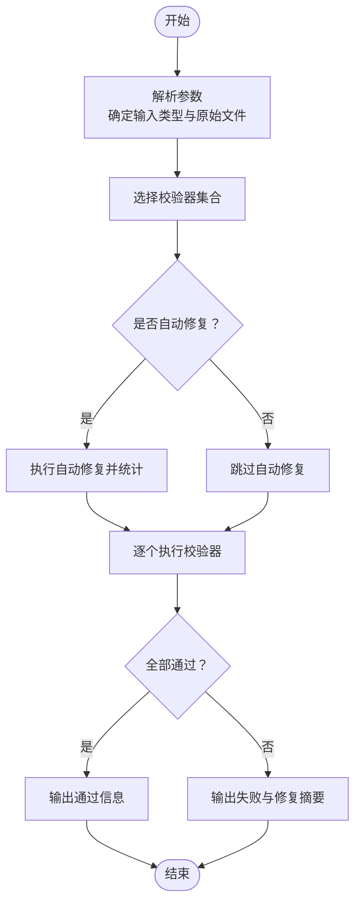
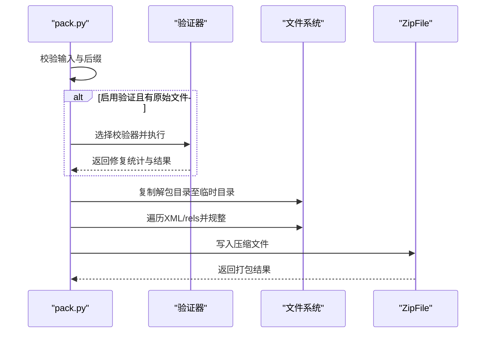
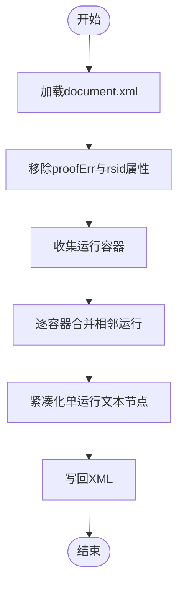
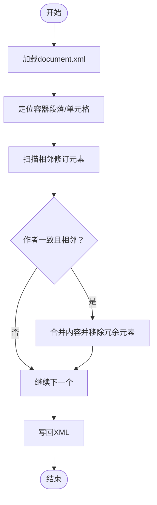
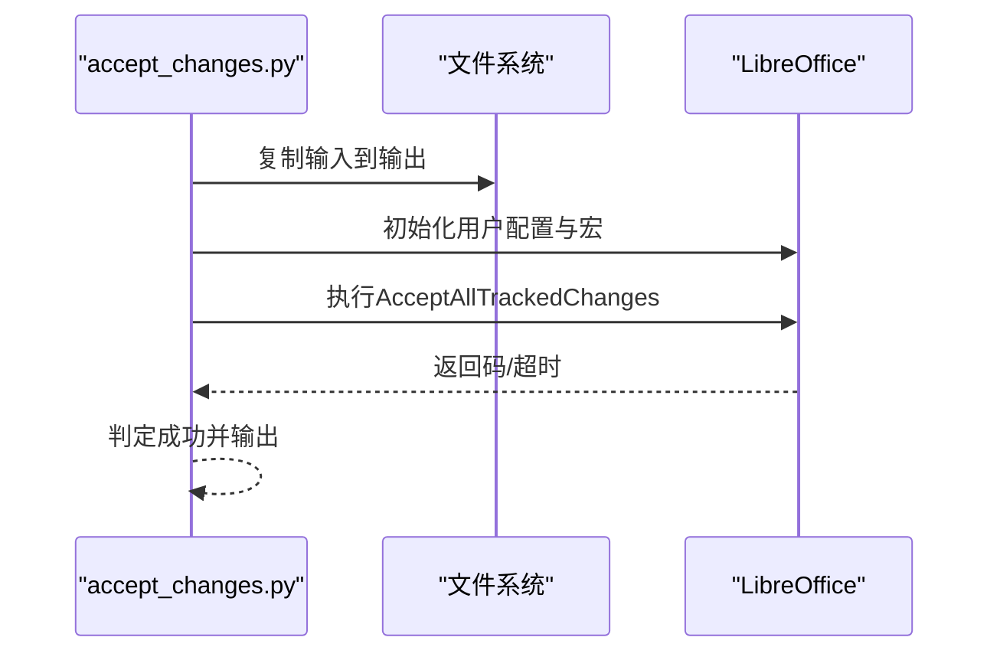
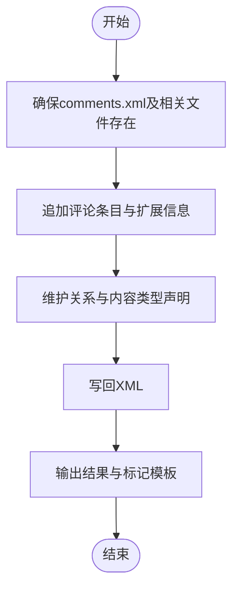
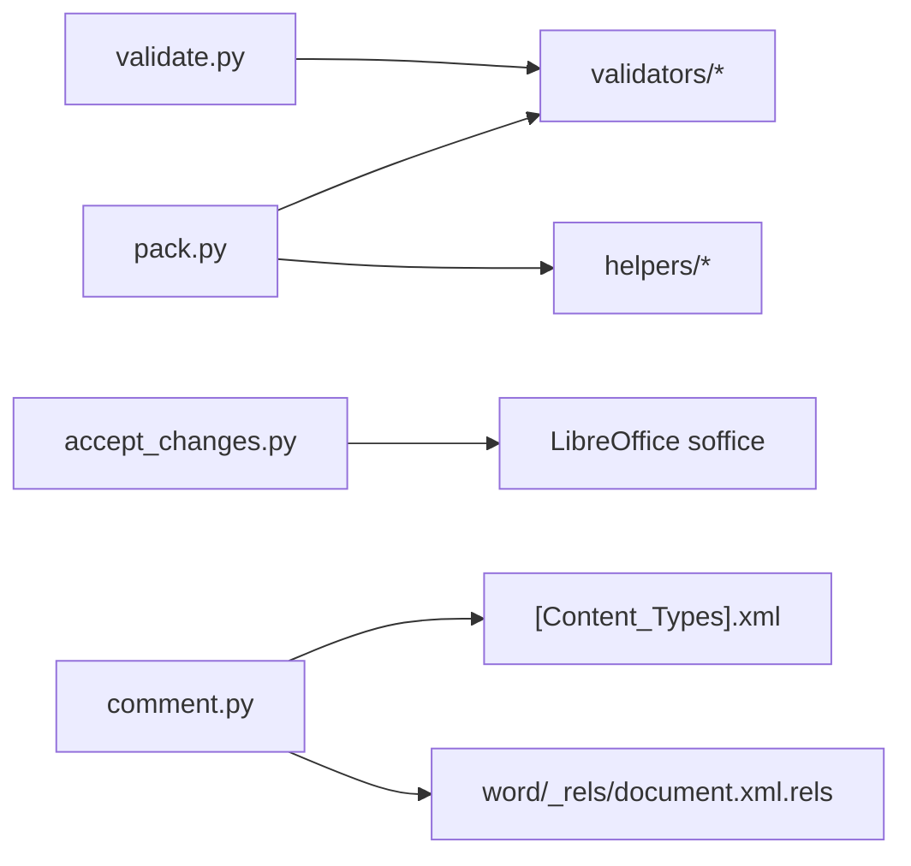

# DOCX文档处理

<cite>
**本文档引用的文件**
- [SKILL.md](file://src/qwenpaw/agents/skills/docx/SKILL.md)
- [pack.py](file://src/qwenpaw/agents/skills/docx/scripts/office/pack.py)
- [merge_runs.py](file://src/qwenpaw/agents/skills/docx/scripts/office/helpers/merge_runs.py)
- [simplify_redlines.py](file://src/qwenpaw/agents/skills/docx/scripts/office/helpers/simplify_redlines.py)
- [accept_changes.py](file://src/qwenpaw/agents/skills/docx/scripts/accept_changes.py)
- [comment.py](file://src/qwenpaw/agents/skills/docx/scripts/comment.py)
- [validate.py](file://src/qwenpaw/agents/skills/docx/scripts/office/validate.py)
- [redlining.py](file://src/qwenpaw/agents/skills/docx/scripts/office/validators/redlining.py)
- [__init__.py（validators）](file://src/qwenpaw/agents/skills/docx/scripts/office/validators/__init__.py)
</cite>

## 目录
1. [简介](#简介)
2. [项目结构](#项目结构)
3. [核心组件](#核心组件)
4. [架构总览](#架构总览)
5. [详细组件分析](#详细组件分析)
6. [依赖关系分析](#依赖关系分析)
7. [性能考量](#性能考量)
8. [故障排查指南](#故障排查指南)
9. [结论](#结论)
10. [附录](#附录)

## 简介
本文件面向QwenPaw的DOCX文档处理技能，系统化阐述基于Office Open XML（ISO/IEC 29500-4:2016）的解析与处理机制，覆盖以下能力：
- 文档内容提取：文本、表格、图片、注释与交叉引用的识别与抽取策略
- 验证流程：XSD模式校验、自动修复、修订线一致性校验
- 解包与重新打包：ZIP容器操作、XML压缩与格式规整
- 编辑与增强：合并相邻文本运行、简化修订线、添加评论标记
- 安全与兼容：XML解析安全、外部工具依赖、跨平台路径与权限
- 性能与大文件策略：内存与I/O优化、增量处理与并行化思路

## 项目结构
DOCX技能位于agents/skills/docx目录，核心由以下模块组成：
- 脚本入口与工具集：unpack/validate/pack等命令行工具
- 助手函数：合并运行、简化修订线
- 外部集成：LibreOffice接受修订、pandoc文本提取
- 校验器：XSD模式校验、修订线校验
- 注释与评论：在word/document.xml与相关关系/类型声明中插入评论实体

图表来源
- [SKILL.md:13-61](file://src/qwenpaw/agents/skills/docx/SKILL.md#L13-L61)
- [validate.py:22-64](file://src/qwenpaw/agents/skills/docx/scripts/office/validate.py#L22-L64)
- [pack.py:1-160](file://src/qwenpaw/agents/skills/docx/scripts/office/pack.py#L1-L160)
- [accept_changes.py:1-139](file://src/qwenpaw/agents/skills/docx/scripts/accept_changes.py#L1-L139)
- [comment.py:1-319](file://src/qwenpaw/agents/skills/docx/scripts/comment.py#L1-L319)

章节来源
- [SKILL.md:13-61](file://src/qwenpaw/agents/skills/docx/SKILL.md#L13-L61)

## 核心组件
- 文档验证与自动修复
  - 支持对已解包目录或已打包文件进行XSD模式校验，并可选择自动修复常见问题（如十六进制ID、空白保留）
  - 对于DOCX，支持修订线作者推断与一致性校验
- 重新打包与XML压缩
  - 将解包后的目录按ZIP规范写回，启用DEFLATE压缩；对XML进行格式规整（去除无意义空白与注释）
- 合并相邻运行与简化修订线
  - 在段落与单元格内合并具有相同格式的相邻文本运行，减少冗余包装
  - 合并同一作者的相邻插入/删除修订，降低修订嵌套复杂度
- 接受修订线
  - 通过LibreOffice宏接口批量接受修订，生成干净版本
- 添加评论
  - 在comments.xml及相关扩展文件中追加评论条目，并维护关系与内容类型声明

章节来源
- [validate.py:22-64](file://src/qwenpaw/agents/skills/docx/scripts/office/validate.py#L22-L64)
- [pack.py:24-66](file://src/qwenpaw/agents/skills/docx/scripts/office/pack.py#L24-L66)
- [merge_runs.py:16-40](file://src/qwenpaw/agents/skills/docx/scripts/office/helpers/merge_runs.py#L16-L40)
- [simplify_redlines.py:22-45](file://src/qwenpaw/agents/skills/docx/scripts/office/helpers/simplify_redlines.py#L22-L45)
- [accept_changes.py:37-91](file://src/qwenpaw/agents/skills/docx/scripts/accept_changes.py#L37-L91)
- [comment.py:218-291](file://src/qwenpaw/agents/skills/docx/scripts/comment.py#L218-L291)

## 架构总览
下图展示从输入到输出的关键交互路径，涵盖验证、编辑、打包与外部工具调用。

图表来源
- [validate.py:25-105](file://src/qwenpaw/agents/skills/docx/scripts/office/validate.py#L25-L105)
- [pack.py:24-105](file://src/qwenpaw/agents/skills/docx/scripts/office/pack.py#L24-L105)
- [merge_runs.py:16-36](file://src/qwenpaw/agents/skills/docx/scripts/office/helpers/merge_runs.py#L16-L36)
- [simplify_redlines.py:22-41](file://src/qwenpaw/agents/skills/docx/scripts/office/helpers/simplify_redlines.py#L22-L41)
- [accept_changes.py:37-91](file://src/qwenpaw/agents/skills/docx/scripts/accept_changes.py#L37-L91)
- [comment.py:218-291](file://src/qwenpaw/agents/skills/docx/scripts/comment.py#L218-L291)

## 详细组件分析

### 组件A：文档验证与自动修复（validate.py + validators）
- 输入
  - 解包目录或已打包的Office文件（.docx/.pptx/.xlsx）
  - 原始文件路径（用于修订线作者推断与对比）
  - 可选开关：详细输出、自动修复、作者名
- 处理逻辑
  - 根据后缀选择校验器组合（DOCX含XSD与修订线校验；PPTX含XSD校验）
  - 可选自动修复：统计并报告修复数量
  - 最终汇总校验结果
- 输出
  - 成功/失败状态与统计信息
  - 人类可读的修复摘要

图表来源
- [validate.py:25-105](file://src/qwenpaw/agents/skills/docx/scripts/office/validate.py#L25-L105)
- [__init__.py（validators）:1-15](file://src/qwenpaw/agents/skills/docx/scripts/office/validators/__init__.py#L1-L15)

章节来源
- [validate.py:22-64](file://src/qwenpaw/agents/skills/docx/scripts/office/validate.py#L22-L64)
- [__init__.py（validators）:1-15](file://src/qwenpaw/agents/skills/docx/scripts/office/validators/__init__.py#L1-L15)

### 组件B：重新打包与XML规整（pack.py）
- 输入
  - 解包目录、输出文件路径、可选原始文件、是否启用验证
  - 可选作者推断函数（用于修订线校验）
- 处理逻辑
  - 若启用验证且存在原始文件，则先执行验证与自动修复
  - 使用临时目录复制解包内容，遍历XML与rels文件进行格式规整（去除空白与注释）
  - 写入ZIP并启用DEFLATE压缩
- 输出
  - 成功/失败消息与目标文件路径

图表来源
- [pack.py:24-105](file://src/qwenpaw/agents/skills/docx/scripts/office/pack.py#L24-L105)

章节来源
- [pack.py:24-66](file://src/qwenpaw/agents/skills/docx/scripts/office/pack.py#L24-L66)
- [pack.py:108-128](file://src/qwenpaw/agents/skills/docx/scripts/office/pack.py#L108-L128)

### 组件C：合并相邻运行（merge_runs.py）
- 输入
  - 解包目录（需包含word/document.xml）
- 处理逻辑
  - 移除proofErr元素与rsid属性
  - 遍历容器（段落/修订容器），合并相邻且格式相同的运行
  - 合并后对单个运行内的文本节点进行紧凑化处理
- 输出
  - 合并计数与结果消息

图表来源
- [merge_runs.py:16-36](file://src/qwenpaw/agents/skills/docx/scripts/office/helpers/merge_runs.py#L16-L36)

章节来源
- [merge_runs.py:16-40](file://src/qwenpaw/agents/skills/docx/scripts/office/helpers/merge_runs.py#L16-L40)

### 组件D：简化修订线（simplify_redlines.py）
- 输入
  - 解包目录（需包含word/document.xml）
- 处理逻辑
  - 遍历段落与单元格，合并同一作者的相邻插入/删除修订
  - 仅当两者完全相邻且作者一致时才合并
- 输出
  - 简化计数与结果消息

图表来源
- [simplify_redlines.py:22-41](file://src/qwenpaw/agents/skills/docx/scripts/office/helpers/simplify_redlines.py#L22-L41)

章节来源
- [simplify_redlines.py:22-45](file://src/qwenpaw/agents/skills/docx/scripts/office/helpers/simplify_redlines.py#L22-L45)

### 组件E：接受修订线（accept_changes.py）
- 输入
  - 输入DOCX、输出DOCX路径
- 处理逻辑
  - 复制输入到输出位置
  - 初始化LibreOffice用户配置与宏，调用AcceptAllTrackedChanges
  - 超时视为成功（宏执行完成即认为接受修订）
- 输出
  - 成功/失败消息

图表来源
- [accept_changes.py:37-91](file://src/qwenpaw/agents/skills/docx/scripts/accept_changes.py#L37-L91)

章节来源
- [accept_changes.py:37-91](file://src/qwenpaw/agents/skills/docx/scripts/accept_changes.py#L37-L91)

### 组件F：添加评论（comment.py）
- 输入
  - 解包目录、评论ID、评论文本、作者、首字母、父评论ID（可选）
- 处理逻辑
  - 确保comments.xml及其扩展文件存在并维护关系与内容类型
  - 追加评论条目，生成paraId/durableId并写回
  - 输出操作结果与在document.xml中插入的标记模板
- 输出
  - 结果消息与参考标记模板

图表来源
- [comment.py:218-291](file://src/qwenpaw/agents/skills/docx/scripts/comment.py#L218-L291)

章节来源
- [comment.py:218-291](file://src/qwenpaw/agents/skills/docx/scripts/comment.py#L218-L291)

## 依赖关系分析
- 外部工具
  - LibreOffice（soffice）：接受修订线
  - pandoc：文本提取（含跟踪变更）
  - poppler-utils（pdftoppm）：文档转图像
- 内部模块
  - validators：XSD与修订线校验器
  - helpers：XML处理辅助函数
  - pack：重新打包与XML规整
  - accept_changes：修订接受
  - comment：评论添加

图表来源
- [pack.py:22-29](file://src/qwenpaw/agents/skills/docx/scripts/office/pack.py#L22-L29)
- [__init__.py（validators）:1-15](file://src/qwenpaw/agents/skills/docx/scripts/office/validators/__init__.py#L1-L15)
- [comment.py:137-216](file://src/qwenpaw/agents/skills/docx/scripts/comment.py#L137-L216)

章节来源
- [SKILL.md:13-61](file://src/qwenpaw/agents/skills/docx/SKILL.md#L13-L61)
- [pack.py:22-29](file://src/qwenpaw/agents/skills/docx/scripts/office/pack.py#L22-L29)
- [comment.py:137-216](file://src/qwenpaw/agents/skills/docx/scripts/comment.py#L137-L216)

## 性能考量
- I/O与压缩
  - 采用DEFLATE压缩与流式写入，减少磁盘占用与传输时间
  - XML规整阶段避免重复解析，一次性去除空白与注释
- 内存管理
  - 大型XML文件建议使用流式解析（当前实现为DOM解析），必要时可拆分为多步处理
  - 临时目录仅在打包期间使用，完成后自动清理
- 并发与批处理
  - 可对多个解包目录并行执行验证/规整，再统一打包
  - LibreOffice调用建议限制并发数量，避免资源争用
- 大文件策略
  - 分块处理：将大型文档拆分为若干段落/表格分别处理
  - 增量更新：仅对修改部分进行规整与重打包

## 故障排查指南
- 验证失败
  - 检查原始文件与目标文件类型匹配（.docx/.pptx/.xlsx）
  - 开启详细输出查看XSD错误与自动修复统计
  - 若修订线作者不明确，提供--author或使用作者推断功能
- 重新打包异常
  - 确认解包目录完整且包含必需XML与rels文件
  - 关闭验证后重试，定位具体XML语法问题
- 接受修订失败
  - 确认LibreOffice安装与PATH可用
  - 检查用户配置目录权限与宏文件写入
- 添加评论失败
  - 确认comments.xml及其扩展文件存在
  - 检查word/_rels/document.xml.rels与[Content_Types].xml的关系与类型声明
- 外部工具不可用
  - 按技能说明安装所需工具（docx、LibreOffice、pandoc、pdftoppm）

章节来源
- [validate.py:25-105](file://src/qwenpaw/agents/skills/docx/scripts/office/validate.py#L25-L105)
- [pack.py:35-50](file://src/qwenpaw/agents/skills/docx/scripts/office/pack.py#L35-L50)
- [accept_changes.py:44-58](file://src/qwenpaw/agents/skills/docx/scripts/accept_changes.py#L44-L58)
- [comment.py:137-216](file://src/qwenpaw/agents/skills/docx/scripts/comment.py#L137-L216)

## 结论
本技能围绕Office Open XML标准，提供了从验证、编辑到重新打包的完整链路。通过XSD校验与自动修复保障文档结构正确性，借助合并运行与简化修订线提升可读性与处理效率，结合LibreOffice与pandoc实现修订接受与文本提取。在安全与兼容方面，采用安全XML解析与严格的外部工具依赖检查，确保在不同平台上的稳定运行。

## 附录
- 配置选项与参数
  - 验证入口（validate.py）
    - 参数：输入路径、原始文件、详细输出、自动修复、作者名
  - 重新打包（pack.py）
    - 参数：输入目录、输出文件、原始文件、验证开关
  - 合并运行/简化修订线（helpers）
    - 输入：解包目录
  - 接受修订（accept_changes.py）
    - 参数：输入文件、输出文件
  - 添加评论（comment.py）
    - 参数：解包目录、评论ID、文本、作者、首字母、父评论ID
- 返回值格式
  - 多数组件返回二元组：（错误对象或空、消息字符串）
  - 命令行工具打印最终结果，错误时退出码非零