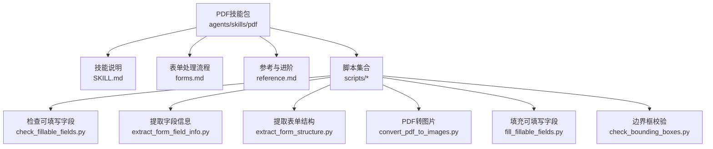
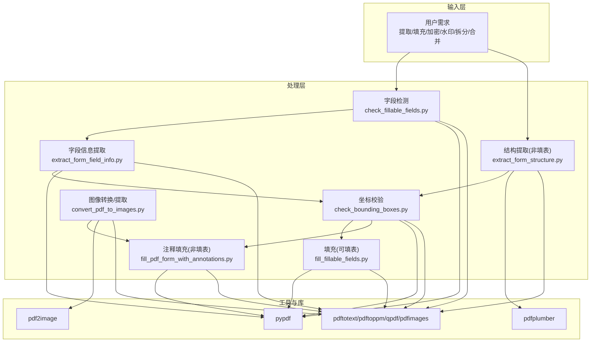
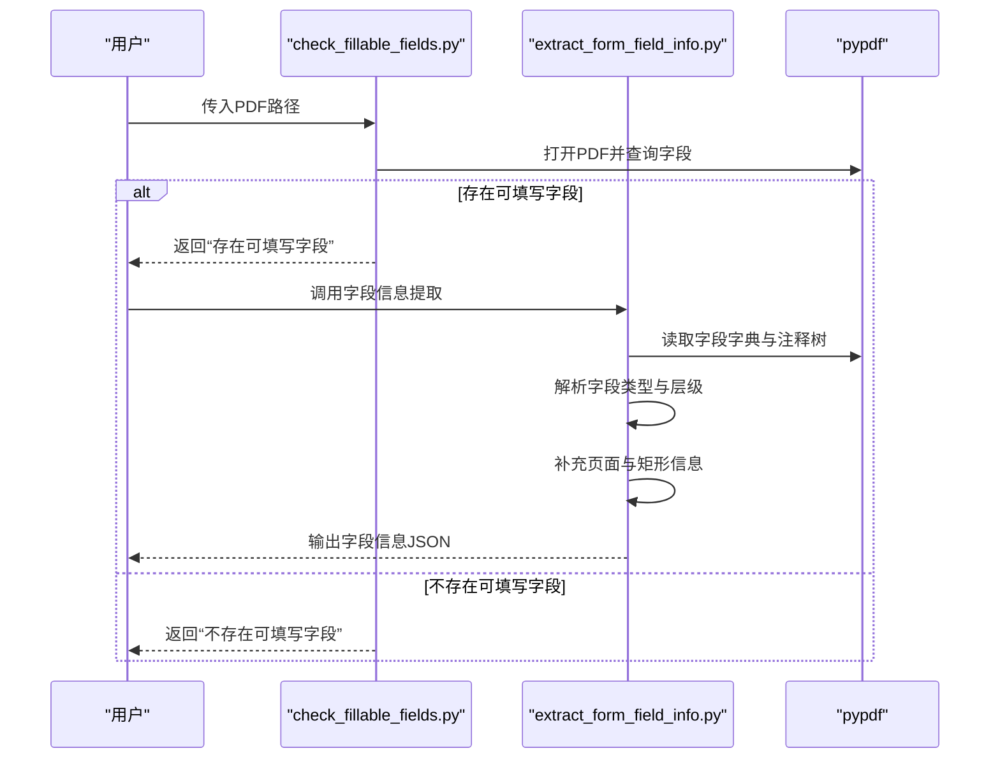
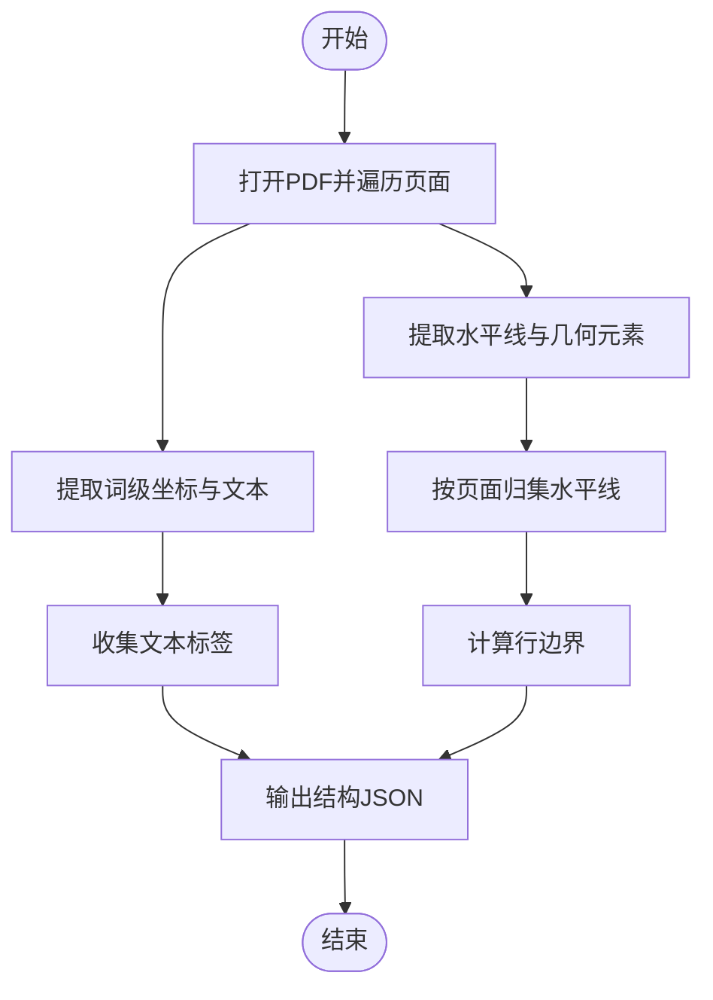
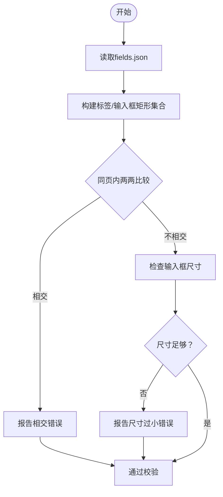
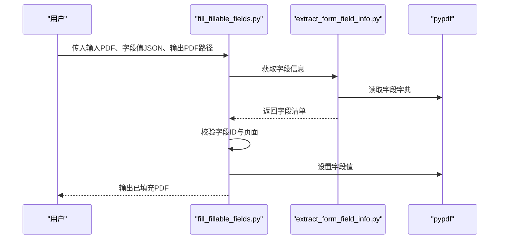
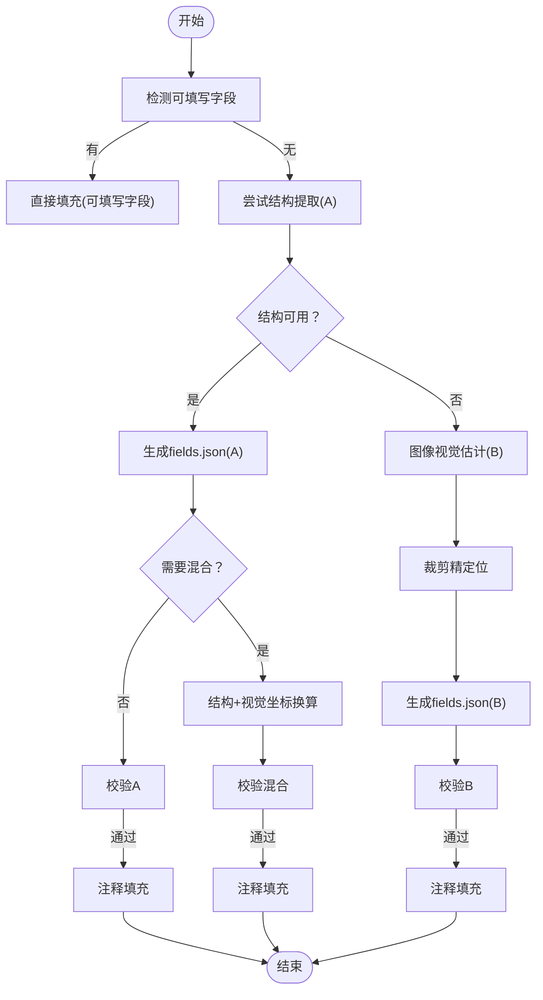
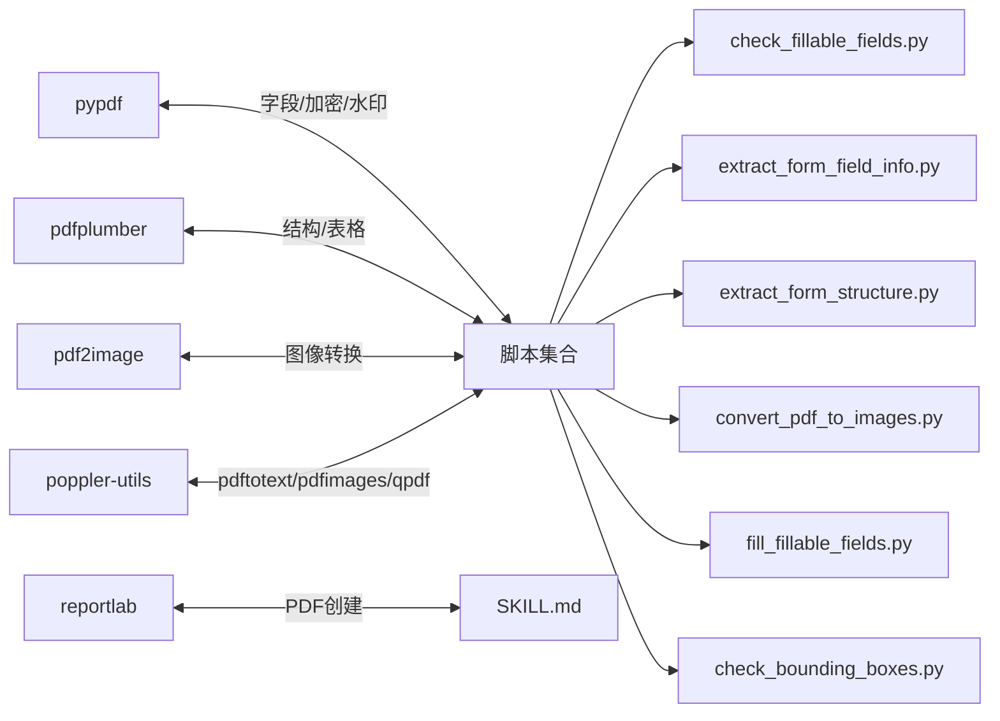

# PDF文档处理

<cite>
**本文引用的文件**
- [SKILL.md](file://src/qwenpaw/agents/skills/pdf/SKILL.md)
- [forms.md](file://src/qwenpaw/agents/skills/pdf/forms.md)
- [reference.md](file://src/qwenpaw/agents/skills/pdf/reference.md)
- [check_fillable_fields.py](file://src/qwenpaw/agents/skills/pdf/scripts/check_fillable_fields.py)
- [extract_form_field_info.py](file://src/qwenpaw/agents/skills/pdf/scripts/extract_form_field_info.py)
- [extract_form_structure.py](file://src/qwenpaw/agents/skills/pdf/scripts/extract_form_structure.py)
- [convert_pdf_to_images.py](file://src/qwenpaw/agents/skills/pdf/scripts/convert_pdf_to_images.py)
- [fill_fillable_fields.py](file://src/qwenpaw/agents/skills/pdf/scripts/fill_fillable_fields.py)
- [check_bounding_boxes.py](file://src/qwenpaw/agents/skills/pdf/scripts/check_bounding_boxes.py)
</cite>

## 目录
1. [简介](#简介)
2. [项目结构](#项目结构)
3. [核心组件](#核心组件)
4. [架构总览](#架构总览)
5. [详细组件分析](#详细组件分析)
6. [依赖分析](#依赖分析)
7. [性能考虑](#性能考虑)
8. [故障排查指南](#故障排查指南)
9. [结论](#结论)
10. [附录](#附录)

## 简介
本技术文档面向QwenPaw中的PDF文档处理技能，系统化阐述PDF格式解析与内容提取（文本、图像、表格）、表单结构分析与数据填充、安全与权限控制、加密与水印、元数据提取、以及性能优化与内存管理策略。文档以仓库中PDF技能包内的说明文档与配套脚本为依据，结合实际代码路径进行说明，帮助开发者与使用者在不同场景下高效、安全地完成PDF处理任务。

## 项目结构
PDF处理技能位于“agents/skills/pdf”目录，包含技能使用说明、表单处理流程说明与一组Python脚本，覆盖从表单字段发现、结构提取、坐标校验到最终填充的完整链路，并提供参考文档以扩展高级能力（如渲染、JavaScript库等）。

图表来源
- [SKILL.md](file://src/qwenpaw/agents/skills/pdf/SKILL.md)
- [forms.md](file://src/qwenpaw/agents/skills/pdf/forms.md)
- [reference.md](file://src/qwenpaw/agents/skills/pdf/reference.md)
- [check_fillable_fields.py](file://src/qwenpaw/agents/skills/pdf/scripts/check_fillable_fields.py)
- [extract_form_field_info.py](file://src/qwenpaw/agents/skills/pdf/scripts/extract_form_field_info.py)
- [extract_form_structure.py](file://src/qwenpaw/agents/skills/pdf/scripts/extract_form_structure.py)
- [convert_pdf_to_images.py](file://src/qwenpaw/agents/skills/pdf/scripts/convert_pdf_to_images.py)
- [fill_fillable_fields.py](file://src/qwenpaw/agents/skills/pdf/scripts/fill_fillable_fields.py)
- [check_bounding_boxes.py](file://src/qwenpaw/agents/skills/pdf/scripts/check_bounding_boxes.py)

章节来源
- [SKILL.md](file://src/qwenpaw/agents/skills/pdf/SKILL.md)
- [forms.md](file://src/qwenpaw/agents/skills/pdf/forms.md)
- [reference.md](file://src/qwenpaw/agents/skills/pdf/reference.md)

## 核心组件
- 文本与表格提取：基于pdfplumber进行布局文本与表格抽取；命令行工具pdftotext用于纯文本提取与布局保留。
- 图像提取与转换：命令行工具pdfimages用于提取嵌入图像；pdf2image将PDF页面转换为图像以便OCR或预览。
- 表单处理：通过pypdf发现可填写字段并提取字段信息；对非可填写表单，使用pdfplumber结构提取与人工估计相结合的方式生成标注坐标；最终通过注释方式在PDF上添加文本。
- 安全与权限：pypdf支持密码保护与加密；qpdf支持解密与合并拆分等操作；命令行工具提供额外的安全与权限控制能力。
- 元数据与水印：pypdf支持读取元数据与合并水印页；命令行工具qpdf支持旋转、裁剪等页面级操作。
- 性能与内存：参考文档提供分块处理、流式读取、选择合适工具等优化建议。

章节来源
- [SKILL.md](file://src/qwenpaw/agents/skills/pdf/SKILL.md)
- [reference.md](file://src/qwenpaw/agents/skills/pdf/reference.md)

## 架构总览
PDF处理技能采用“脚本驱动 + 工具链协同”的架构：以Python脚本为核心，调用pypdf、pdfplumber、pdf2image等库与poppler-utils等命令行工具，形成从字段发现、结构分析、坐标校验到最终填充的流水线。

图表来源
- [check_fillable_fields.py](file://src/qwenpaw/agents/skills/pdf/scripts/check_fillable_fields.py)
- [extract_form_field_info.py](file://src/qwenpaw/agents/skills/pdf/scripts/extract_form_field_info.py)
- [extract_form_structure.py](file://src/qwenpaw/agents/skills/pdf/scripts/extract_form_structure.py)
- [check_bounding_boxes.py](file://src/qwenpaw/agents/skills/pdf/scripts/check_bounding_boxes.py)
- [fill_fillable_fields.py](file://src/qwenpaw/agents/skills/pdf/scripts/fill_fillable_fields.py)
- [convert_pdf_to_images.py](file://src/qwenpaw/agents/skills/pdf/scripts/convert_pdf_to_images.py)
- [SKILL.md](file://src/qwenpaw/agents/skills/pdf/SKILL.md)
- [reference.md](file://src/qwenpaw/agents/skills/pdf/reference.md)

## 详细组件分析

### 组件A：可填写字段检测与信息提取
- 功能概述
  - 检测PDF是否包含可填写字段，决定后续处理路径。
  - 提取字段类型（文本框、复选框、单选组、下拉列表等）、页面、位置矩形、状态值等关键信息，输出为JSON供后续填充脚本使用。
- 关键流程
  - 使用pypdf读取字段字典，解析字段类型与层级关系。
  - 对注释型字段（如单选组）通过注释树回溯父字段ID，补充页面与矩形信息。
  - 按页面与位置排序，输出统一字段清单。
- 输出规范
  - 字段对象包含：field_id、page、rect、type、以及特定类型的附加属性（如复选框的checked_value/unchecked_value、单选组的radio_options、下拉列表的choice_options）。

图表来源
- [check_fillable_fields.py](file://src/qwenpaw/agents/skills/pdf/scripts/check_fillable_fields.py)
- [extract_form_field_info.py](file://src/qwenpaw/agents/skills/pdf/scripts/extract_form_field_info.py)

章节来源
- [check_fillable_fields.py](file://src/qwenpaw/agents/skills/pdf/scripts/check_fillable_fields.py)
- [extract_form_field_info.py](file://src/qwenpaw/agents/skills/pdf/scripts/extract_form_field_info.py)
- [SKILL.md](file://src/qwenpaw/agents/skills/pdf/SKILL.md)

### 组件B：非填表表单结构提取与坐标生成
- 功能概述
  - 针对无可填写字段的PDF，使用pdfplumber提取文本标签、水平线、小矩形（复选框）等结构元素，计算行边界，生成可用于注释填充的坐标体系。
- 关键流程
  - 遍历页面，提取词级坐标与几何元素。
  - 基于水平线聚类计算行边界，推导字段入口区域。
  - 将结构信息写入JSON，供人工或半自动分析确定字段用途与精确坐标。
- 输出规范
  - 包含pages（每页宽高）、labels（文本及其坐标）、lines（水平线）、checkboxes（复选框）、row_boundaries（行边界）等字段。

图表来源
- [extract_form_structure.py](file://src/qwenpaw/agents/skills/pdf/scripts/extract_form_structure.py)

章节来源
- [extract_form_structure.py](file://src/qwenpaw/agents/skills/pdf/scripts/extract_form_structure.py)
- [forms.md](file://src/qwenpaw/agents/skills/pdf/forms.md)

### 组件C：边界框校验与坐标一致性检查
- 功能概述
  - 在填充前对fields.json中的标签与输入框边界进行一致性检查，避免重叠与过小导致的显示问题。
- 关键流程
  - 读取fields.json，构建标签与输入框矩形集合。
  - 同页内两两比较矩形是否相交，检查输入框尺寸是否满足字体大小要求。
  - 输出错误列表，指导修正后再执行填充。

图表来源
- [check_bounding_boxes.py](file://src/qwenpaw/agents/skills/pdf/scripts/check_bounding_boxes.py)

章节来源
- [check_bounding_boxes.py](file://src/qwenpaw/agents/skills/pdf/scripts/check_bounding_boxes.py)
- [forms.md](file://src/qwenpaw/agents/skills/pdf/forms.md)

### 组件D：可填写字段填充（可填表）
- 功能概述
  - 基于字段信息JSON，对可填写字段进行值填充，同时进行字段ID与页面一致性校验，必要时修补字段字典以兼容某些特殊结构。
- 关键流程
  - 读取字段值映射，按页组织。
  - 读取PDF字段信息，建立字段ID到定义的映射。
  - 校验字段ID是否存在、页面号是否一致、值是否符合类型约束。
  - 写出填充后的PDF。

图表来源
- [fill_fillable_fields.py](file://src/qwenpaw/agents/skills/pdf/scripts/fill_fillable_fields.py)
- [extract_form_field_info.py](file://src/qwenpaw/agents/skills/pdf/scripts/extract_form_field_info.py)

章节来源
- [fill_fillable_fields.py](file://src/qwenpaw/agents/skills/pdf/scripts/fill_fillable_fields.py)
- [extract_form_field_info.py](file://src/qwenpaw/agents/skills/pdf/scripts/extract_form_field_info.py)
- [forms.md](file://src/qwenpaw/agents/skills/pdf/forms.md)

### 组件E：非填表表单注释填充（视觉估计/结构+视觉混合）
- 功能概述
  - 对无可填写字段的PDF，先尝试结构提取（Approach A），若不可行则采用图像视觉估计（Approach B），或两者结合（Hybrid）。
  - 通过注释方式在PDF上绘制文本，实现“填表”效果。
- 关键流程
  - 结构提取：使用结构JSON与行边界推导字段入口区域。
  - 视觉估计：将PDF转为图像，放大裁剪精确定位，再将像素坐标换算为PDF坐标。
  - 混合方案：结构+视觉，统一坐标系后一次性填充。
  - 坐标校验通过后，生成带注释的PDF。

图表来源
- [forms.md](file://src/qwenpaw/agents/skills/pdf/forms.md)
- [extract_form_structure.py](file://src/qwenpaw/agents/skills/pdf/scripts/extract_form_structure.py)
- [convert_pdf_to_images.py](file://src/qwenpaw/agents/skills/pdf/scripts/convert_pdf_to_images.py)
- [check_bounding_boxes.py](file://src/qwenpaw/agents/skills/pdf/scripts/check_bounding_boxes.py)

章节来源
- [forms.md](file://src/qwenpaw/agents/skills/pdf/forms.md)
- [convert_pdf_to_images.py](file://src/qwenpaw/agents/skills/pdf/scripts/convert_pdf_to_images.py)

### 组件F：图像转换与OCR（扫描版PDF）
- 功能概述
  - 将PDF页面转换为图像，便于OCR识别；或生成低分辨率预览图与高分辨率最终图。
- 关键流程
  - 使用pdf2image按指定DPI转换页面为图像。
  - 可选缩放至最大边限制，保存PNG序列。
  - OCR可在外部流程中结合tesseract使用。

章节来源
- [convert_pdf_to_images.py](file://src/qwenpaw/agents/skills/pdf/scripts/convert_pdf_to_images.py)
- [SKILL.md](file://src/qwenpaw/agents/skills/pdf/SKILL.md)

### 组件G：安全与权限控制
- 功能概述
  - 密码保护与加密：使用pypdf对PDF设置用户口令与所有者口令。
  - 解密与合并拆分：使用qpdf移除密码、合并/拆分/旋转/裁剪等。
  - 元数据读取：使用pypdf读取标题、作者、主题、创建者等元数据。
  - 水印叠加：使用pypdf将水印页与目标页合并。
- 实施要点
  - 加密策略需遵循合规要求，避免泄露敏感信息。
  - 页面级操作（旋转、裁剪）应与原始页面尺寸保持一致。

章节来源
- [SKILL.md](file://src/qwenpaw/agents/skills/pdf/SKILL.md)
- [reference.md](file://src/qwenpaw/agents/skills/pdf/reference.md)

## 依赖分析
- 库与工具依赖
  - pypdf：字段读取、加密/解密、水印合并、元数据读取。
  - pdfplumber：结构化文本与表格提取、几何元素识别。
  - pdf2image：PDF转图像，配合OCR使用。
  - poppler-utils：pdftotext、pdfimages、qpdf、pdftoppm等命令行工具。
  - reportlab：PDF创建（技能说明中提及）。
- 脚本间耦合
  - extract_form_field_info.py与fill_fillable_fields.py共享字段信息解析逻辑。
  - extract_form_structure.py与convert_pdf_to_images.py共同支撑非填表场景的坐标生成与验证。
  - check_bounding_boxes.py被多条路径复用，确保坐标质量。

图表来源
- [SKILL.md](file://src/qwenpaw/agents/skills/pdf/SKILL.md)
- [reference.md](file://src/qwenpaw/agents/skills/pdf/reference.md)
- [check_fillable_fields.py](file://src/qwenpaw/agents/skills/pdf/scripts/check_fillable_fields.py)
- [extract_form_field_info.py](file://src/qwenpaw/agents/skills/pdf/scripts/extract_form_field_info.py)
- [extract_form_structure.py](file://src/qwenpaw/agents/skills/pdf/scripts/extract_form_structure.py)
- [convert_pdf_to_images.py](file://src/qwenpaw/agents/skills/pdf/scripts/convert_pdf_to_images.py)
- [fill_fillable_fields.py](file://src/qwenpaw/agents/skills/pdf/scripts/fill_fillable_fields.py)
- [check_bounding_boxes.py](file://src/qwenpaw/agents/skills/pdf/scripts/check_bounding_boxes.py)

章节来源
- [SKILL.md](file://src/qwenpaw/agents/skills/pdf/SKILL.md)
- [reference.md](file://src/qwenpaw/agents/skills/pdf/reference.md)

## 性能考虑
- 大文件处理
  - 流式读取：优先使用pypdf的逐页读取，避免一次性加载整本PDF。
  - 分块处理：将长文档按页区间切分为多个临时PDF，分批处理后再合并。
  - 工具链选择：对超大文档，命令行工具（如qpdf分页、pdftotext布局提取）通常更高效。
- 文本与表格提取
  - 纯文本：pdftotext -bbox-layout适合快速提取布局文本。
  - 结构化数据：pdfplumber更适合表格与复杂布局。
  - 避免对超大文档使用pypdf的extract_text。
- 图像提取
  - 使用pdfimages比渲染页面更快。
  - 预览用低分辨率，最终输出用高分辨率。
- 表单填充
  - 优先保持原表单结构（pdf-lib在参考中被推荐），在可填写场景下直接填充字段。
  - 非填表场景下，注释填充前务必进行边界框校验，减少重试成本。
- 内存管理
  - 控制单次处理的页数规模，及时释放中间图像与PDF对象。
  - 使用上下文管理器（with语句）确保资源释放。

章节来源
- [reference.md](file://src/qwenpaw/agents/skills/pdf/reference.md)
- [SKILL.md](file://src/qwenpaw/agents/skills/pdf/SKILL.md)

## 故障排查指南
- 字段ID无效或页面不匹配
  - 现象：填充脚本报错提示字段ID不存在或页面号不符。
  - 排查：确认字段JSON中的field_id与extract_form_field_info.py输出一致，且page字段与实际页面对应。
- 输入框过小或坐标重叠
  - 现象：注释文本显示异常或重叠。
  - 排查：运行check_bounding_boxes.py，根据报告修正label/entry矩形或增大输入框尺寸。
- 扫描版PDF无法直接提取文本
  - 现象：文本呈现为乱码或CID字符。
  - 排查：先将PDF转图像，再进行OCR；或使用pdftotext的布局模式提取。
- 加密PDF无法读取
  - 现象：读取失败或字段为空。
  - 排查：使用qpdf移除密码后处理，或在pypdf中提供正确口令。
- 水印叠加错位
  - 现象：水印位置不正确。
  - 排查：确认水印页与目标页尺寸一致，合并时逐页对齐。

章节来源
- [fill_fillable_fields.py](file://src/qwenpaw/agents/skills/pdf/scripts/fill_fillable_fields.py)
- [check_bounding_boxes.py](file://src/qwenpaw/agents/skills/pdf/scripts/check_bounding_boxes.py)
- [SKILL.md](file://src/qwenpaw/agents/skills/pdf/SKILL.md)

## 结论
QwenPaw的PDF处理技能以脚本化与工具链协同的方式，覆盖了从基础文本/表格提取、图像处理、元数据读取，到表单结构分析与注释填充的完整工作流。对于可填写表单，优先采用字段直填；对于非填表场景，则通过结构提取与视觉估计相结合的方式生成高精度坐标。配合参考文档中的高级能力与性能优化建议，可在保证质量的同时提升处理效率与安全性。

## 附录
- 常用命令与示例
  - 文本提取：pdftotext -layout、pdfplumber逐页提取。
  - 图像提取：pdfimages -j。
  - 合并与拆分：qpdf --empty --pages、qpdf --pages。
  - 解密与旋转：qpdf --password=... --decrypt、qpdf ... --rotate=+90:1。
  - 水印叠加：pypdf合并水印页。
- 输出格式与质量控制
  - 文本：纯文本或保留布局的文本。
  - 图像：PNG/JPEG，可设置DPI与最大边限制。
  - PDF：可加密、加水印、裁剪、旋转、合并/拆分。
- 安全与合规
  - 加密策略需遵循组织政策，避免硬编码口令。
  - 处理完成后及时清理临时文件与中间图像。

章节来源
- [SKILL.md](file://src/qwenpaw/agents/skills/pdf/SKILL.md)
- [reference.md](file://src/qwenpaw/agents/skills/pdf/reference.md)