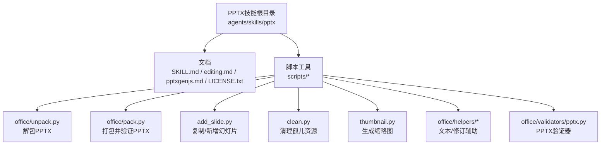
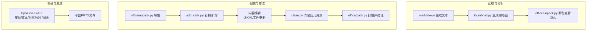
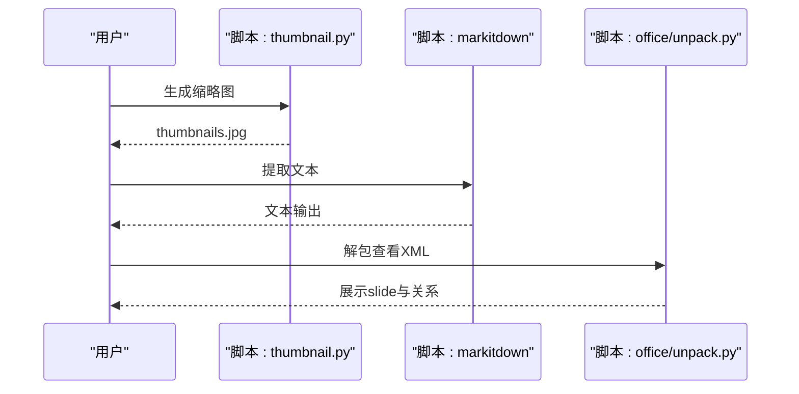
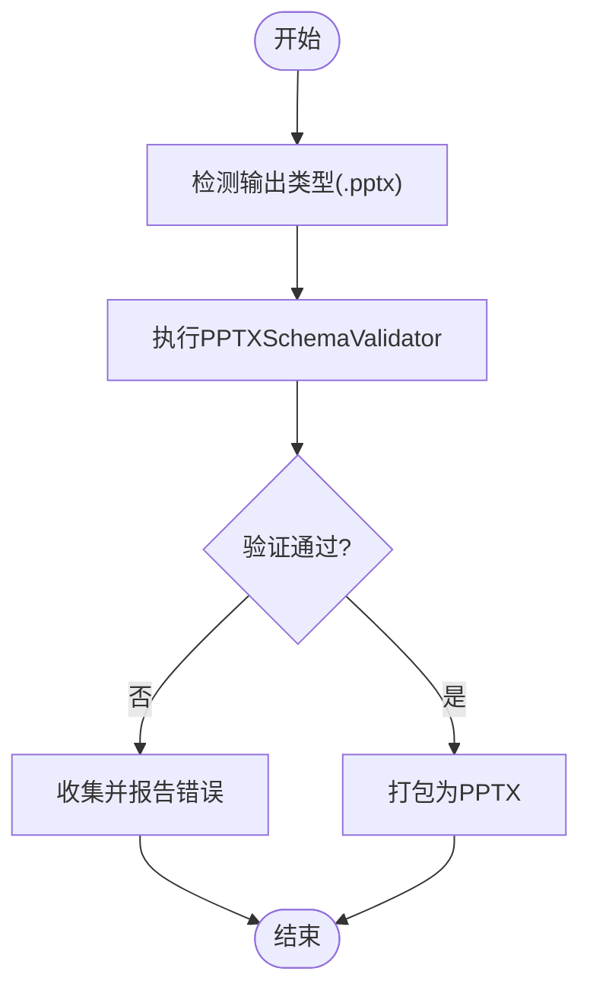
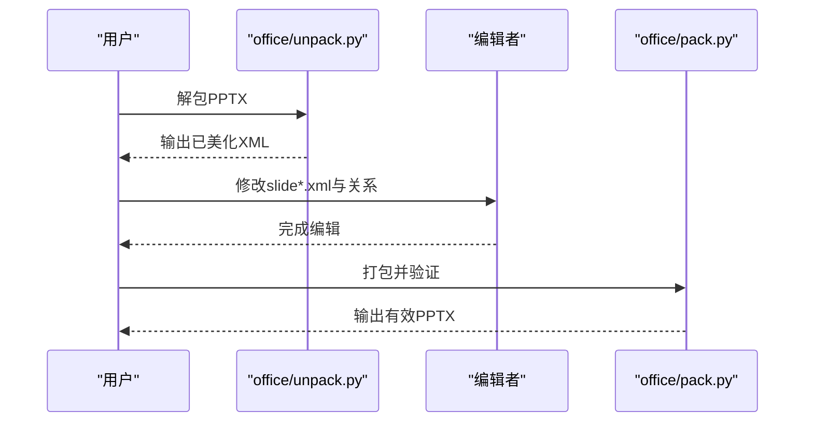
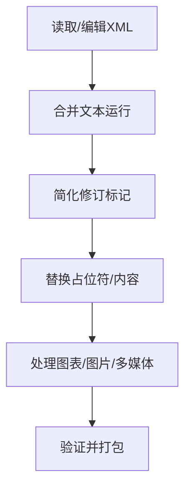
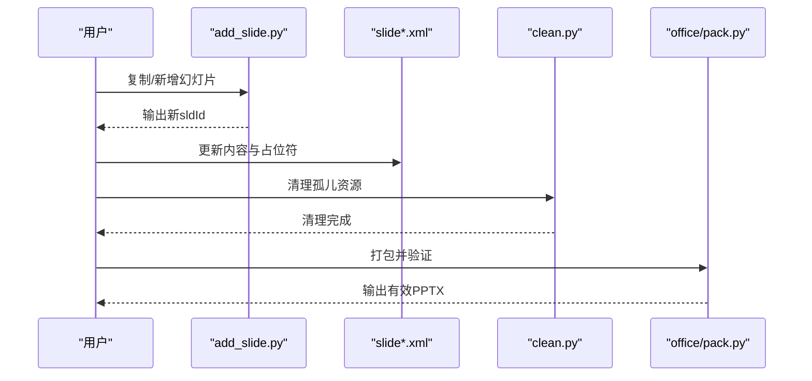
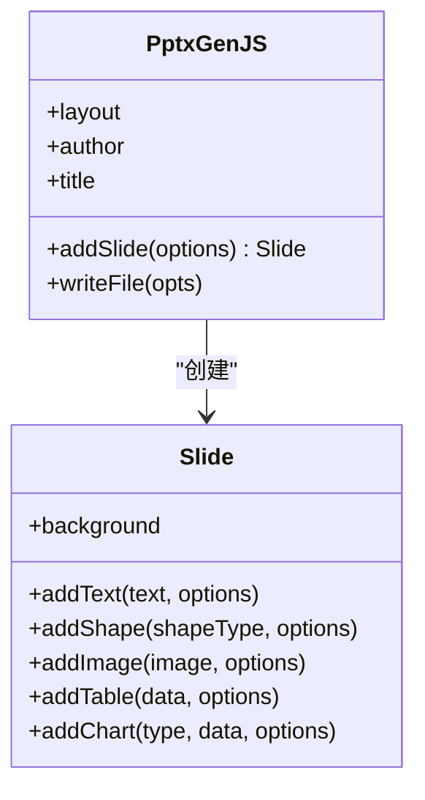
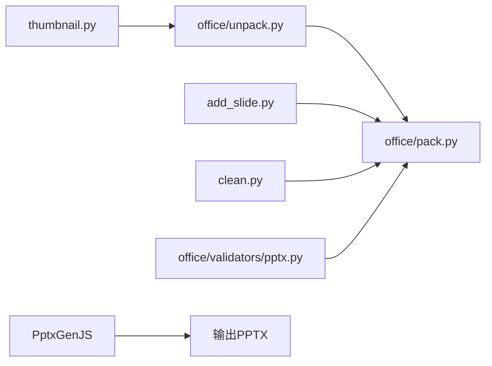

# PPTX演示文稿处理

<cite>
**本文引用的文件**
- [SKILL.md](file://src/qwenpaw/agents/skills/pptx/SKILL.md)
- [editing.md](file://src/qwenpaw/agents/skills/pptx/editing.md)
- [pptxgenjs.md](file://src/qwenpaw/agents/skills/pptx/pptxgenjs.md)
- [LICENSE.txt](file://src/qwenpaw/agents/skills/pptx/LICENSE.txt)
- [scripts/office/unpack.py](file://src/qwenpaw/agents/skills/pptx/scripts/office/unpack.py)
- [scripts/office/pack.py](file://src/qwenpaw/agents/skills/pptx/scripts/office/pack.py)
- [scripts/add_slide.py](file://src/qwenpaw/agents/skills/pptx/scripts/add_slide.py)
- [scripts/clean.py](file://src/qwenpaw/agents/skills/pptx/scripts/clean.py)
- [scripts/thumbnail.py](file://src/qwenpaw/agents/skills/pptx/scripts/thumbnail.py)
- [scripts/office/helpers/merge_runs.py](file://src/qwenpaw/agents/skills/pptx/scripts/office/helpers/merge_runs.py)
- [scripts/office/helpers/simplify_redlines.py](file://src/qwenpaw/agents/skills/pptx/scripts/office/helpers/simplify_redlines.py)
- [scripts/office/validators/pptx.py](file://src/qwenpaw/agents/skills/docx/scripts/office/validators/pptx.py)
</cite>

## 目录
1. [简介](#简介)
2. [项目结构](#项目结构)
3. [核心组件](#核心组件)
4. [架构总览](#架构总览)
5. [详细组件分析](#详细组件分析)
6. [依赖关系分析](#依赖关系分析)
7. [性能考量](#性能考量)
8. [故障排查指南](#故障排查指南)
9. [结论](#结论)
10. [附录](#附录)

## 简介
本技术文档面向QwenPaw中的PPTX演示文稿处理技能，系统阐述PowerPoint演示文稿的解析机制、验证流程、解包与重新打包算法、内容处理（文本、图表、图片、多媒体）、编辑能力（添加/删除/重排幻灯片、内容替换与样式调整），以及安全处理、权限控制与格式兼容性考虑，并提供性能优化与大文件处理策略。

## 项目结构
PPTX技能位于 agents/skills/pptx 目录，包含技能说明文档、创建与编辑指南、脚本工具与辅助模块，以及Office文件通用的解包/打包/验证工具链。关键文件如下：
- 技能说明与工作流：SKILL.md、editing.md、pptxgenjs.md
- 解包/打包/清理/缩略图等脚本：scripts/office/unpack.py、scripts/office/pack.py、scripts/clean.py、scripts/thumbnail.py
- 幻灯片操作：scripts/add_slide.py
- Office通用验证器：scripts/office/validators/pptx.py
- 辅助工具：scripts/office/helpers/merge_runs.py、scripts/office/helpers/simplify_redlines.py
- 许可证：LICENSE.txt

**图表来源**
- [SKILL.md](file://src/qwenpaw/agents/skills/pptx/SKILL.md)
- [editing.md](file://src/qwenpaw/agents/skills/pptx/editing.md)
- [pptxgenjs.md](file://src/qwenpaw/agents/skills/pptx/pptxgenjs.md)
- [scripts/office/unpack.py](file://src/qwenpaw/agents/skills/pptx/scripts/office/unpack.py)
- [scripts/office/pack.py](file://src/qwenpaw/agents/skills/pptx/scripts/office/pack.py)
- [scripts/add_slide.py](file://src/qwenpaw/agents/skills/pptx/scripts/add_slide.py)
- [scripts/clean.py](file://src/qwenpaw/agents/skills/pptx/scripts/clean.py)
- [scripts/thumbnail.py](file://src/qwenpaw/agents/skills/pptx/scripts/thumbnail.py)
- [scripts/office/helpers/merge_runs.py](file://src/qwenpaw/agents/skills/pptx/scripts/office/helpers/merge_runs.py)
- [scripts/office/helpers/simplify_redlines.py](file://src/qwenpaw/agents/skills/pptx/scripts/office/helpers/simplify_redlines.py)
- [scripts/office/validators/pptx.py](file://src/qwenpaw/agents/skills/docx/scripts/office/validators/pptx.py)

**章节来源**
- [SKILL.md](file://src/qwenpaw/agents/skills/pptx/SKILL.md)
- [editing.md](file://src/qwenpaw/agents/skills/pptx/editing.md)
- [pptxgenjs.md](file://src/qwenpaw/agents/skills/pptx/pptxgenjs.md)

## 核心组件
- 文档与工作流
  - SKILL.md：定义依赖、快速参考、读取/分析、编辑工作流、从零创建、设计建议、QA与图像转换流程。
  - editing.md：模板驱动编辑流程、脚本清单、幻灯片操作、内容编辑规则与常见陷阱。
  - pptxgenjs.md：使用PptxGenJS从零创建演示文稿，涵盖布局、文本/列表、形状、图片、图标、背景、表格、图表与常见错误。
- 脚本工具
  - office/unpack.py：解包PPTX，美化XML，转义智能引号。
  - office/pack.py：验证、修复、压缩XML、重新编码智能引号，打包回PPTX。
  - add_slide.py：基于现有slide或布局复制新增幻灯片，正确维护notes、Content_Types与关系ID。
  - clean.py：删除不在幻灯片列表中的幻灯片、未被引用的媒体、孤儿关系。
  - thumbnail.py：生成幻灯片网格缩略图，便于模板分析。
- 验证与辅助
  - office/validators/pptx.py：PPTX模式校验器。
  - helpers/merge_runs.py、simplify_redlines.py：文本合并与修订简化辅助。

**章节来源**
- [SKILL.md](file://src/qwenpaw/agents/skills/pptx/SKILL.md)
- [editing.md](file://src/qwenpaw/agents/skills/pptx/editing.md)
- [pptxgenjs.md](file://src/qwenpaw/agents/skills/pptx/pptxgenjs.md)
- [scripts/office/unpack.py](file://src/qwenpaw/agents/skills/pptx/scripts/office/unpack.py)
- [scripts/office/pack.py](file://src/qwenpaw/agents/skills/pptx/scripts/office/pack.py)
- [scripts/add_slide.py](file://src/qwenpaw/agents/skills/pptx/scripts/add_slide.py)
- [scripts/clean.py](file://src/qwenpaw/agents/skills/pptx/scripts/clean.py)
- [scripts/thumbnail.py](file://src/qwenpaw/agents/skills/pptx/scripts/thumbnail.py)
- [scripts/office/helpers/merge_runs.py](file://src/qwenpaw/agents/skills/pptx/scripts/office/helpers/merge_runs.py)
- [scripts/office/helpers/simplify_redlines.py](file://src/qwenpaw/agents/skills/pptx/scripts/office/helpers/simplify_redlines.py)
- [scripts/office/validators/pptx.py](file://src/qwenpaw/agents/skills/docx/scripts/office/validators/pptx.py)

## 架构总览
整体处理链路分为三类：读取/分析、编辑/修改、创建/生成。读取/分析侧重于内容抽取与可视化；编辑/修改围绕模板解包、结构与内容变更、清理与打包；创建/生成通过PptxGenJS直接构建。

**图表来源**
- [SKILL.md](file://src/qwenpaw/agents/skills/pptx/SKILL.md)
- [editing.md](file://src/qwenpaw/agents/skills/pptx/editing.md)
- [pptxgenjs.md](file://src/qwenpaw/agents/skills/pptx/pptxgenjs.md)
- [scripts/office/unpack.py](file://src/qwenpaw/agents/skills/pptx/scripts/office/unpack.py)
- [scripts/office/pack.py](file://src/qwenpaw/agents/skills/pptx/scripts/office/pack.py)
- [scripts/add_slide.py](file://src/qwenpaw/agents/skills/pptx/scripts/add_slide.py)
- [scripts/clean.py](file://src/qwenpaw/agents/skills/pptx/scripts/clean.py)
- [scripts/thumbnail.py](file://src/qwenpaw/agents/skills/pptx/scripts/thumbnail.py)

## 详细组件分析

### 组件A：PPTX读取与内容分析
- 文本抽取：使用markitdown对PPTX进行文本提取，支持后续QA与摘要生成。
- 可视化概览：通过thumbnail.py生成缩略图，辅助模板选择与布局判断。
- 原始XML查看：使用office/unpack.py解包后查看presentation.xml、slide*.xml等，定位占位符与结构。

**图表来源**
- [SKILL.md](file://src/qwenpaw/agents/skills/pptx/SKILL.md)
- [scripts/thumbnail.py](file://src/qwenpaw/agents/skills/pptx/scripts/thumbnail.py)
- [scripts/office/unpack.py](file://src/qwenpaw/agents/skills/pptx/scripts/office/unpack.py)

**章节来源**
- [SKILL.md](file://src/qwenpaw/agents/skills/pptx/SKILL.md)
- [scripts/thumbnail.py](file://src/qwenpaw/agents/skills/pptx/scripts/thumbnail.py)
- [scripts/office/unpack.py](file://src/qwenpaw/agents/skills/pptx/scripts/office/unpack.py)

### 组件B：PPTX验证流程
- 验证入口：office/pack.py在打包时调用PPTXSchemaValidator进行模式校验。
- 校验范围：针对解包后的目录结构与XML进行合规性检查，必要时结合原始文件进行对比与红线条验证。
- 错误处理：报告XSD错误与不合规项，避免生成损坏文件。

**图表来源**
- [scripts/office/pack.py](file://src/qwenpaw/agents/skills/pptx/scripts/office/pack.py)
- [scripts/office/validators/pptx.py](file://src/qwenpaw/agents/skills/docx/scripts/office/validators/pptx.py)

**章节来源**
- [scripts/office/pack.py](file://src/qwenpaw/agents/skills/pptx/scripts/office/pack.py)
- [scripts/office/validators/pptx.py](file://src/qwenpaw/agents/skills/docx/scripts/office/validators/pptx.py)

### 组件C：解包与重新打包算法
- 解包：office/unpack.py负责将PPTX解压为目录，美化XML，转义智能引号，便于人工编辑。
- 重新打包：office/pack.py在打包前执行验证、修复、压缩XML、重新编码智能引号，确保文件结构与内容一致。
- 关键点：严格遵循Office Open XML规范，保持关系表、媒体引用与Content_Types一致性。

**图表来源**
- [scripts/office/unpack.py](file://src/qwenpaw/agents/skills/pptx/scripts/office/unpack.py)
- [scripts/office/pack.py](file://src/qwenpaw/agents/skills/pptx/scripts/office/pack.py)

**章节来源**
- [scripts/office/unpack.py](file://src/qwenpaw/agents/skills/pptx/scripts/office/unpack.py)
- [scripts/office/pack.py](file://src/qwenpaw/agents/skills/pptx/scripts/office/pack.py)

### 组件D：内容处理（文本/图表/图片/多媒体）
- 文本处理
  - 使用helpers/merge_runs.py合并相邻文本运行，减少冗余标签。
  - 使用helpers/simplify_redlines.py简化修订标记，降低复杂度。
  - 编辑时注意：使用标准XML实体表示智能引号，避免Unicode直写导致双标点问题。
- 图表与图片
  - PptxGenJS支持多种图表类型与现代样式配置，建议与主题色板一致。
  - 图片支持本地路径、URL与base64，可设置旋转、翻转、透明度、超链接与替代文本。
- 多媒体
  - 通过pack.py自动维护媒体引用与关系，clean.py移除孤儿资源，避免文件膨胀。

**图表来源**
- [scripts/office/helpers/merge_runs.py](file://src/qwenpaw/agents/skills/pptx/scripts/office/helpers/merge_runs.py)
- [scripts/office/helpers/simplify_redlines.py](file://src/qwenpaw/agents/skills/pptx/scripts/office/helpers/simplify_redlines.py)
- [scripts/office/pack.py](file://src/qwenpaw/agents/skills/pptx/scripts/office/pack.py)
- [pptxgenjs.md](file://src/qwenpaw/agents/skills/pptx/pptxgenjs.md)

**章节来源**
- [scripts/office/helpers/merge_runs.py](file://src/qwenpaw/agents/skills/pptx/scripts/office/helpers/merge_runs.py)
- [scripts/office/helpers/simplify_redlines.py](file://src/qwenpaw/agents/skills/pptx/scripts/office/helpers/simplify_redlines.py)
- [pptxgenjs.md](file://src/qwenpaw/agents/skills/pptx/pptxgenjs.md)

### 组件E：编辑功能（添加/删除/重排/样式）
- 添加幻灯片：使用add_slide.py基于现有slide或布局复制，自动生成正确的sldId并维护关系。
- 删除与重排：在presentation.xml的<sldIdLst>中调整顺序或移除条目，随后执行clean.py清理。
- 内容修改：逐slide.xml编辑文本、占位符与元素，遵循编辑规则（如粗体、列表格式、行距）。
- 样式调整：通过PptxGenJS设置字体、颜色、阴影、边框、渐变背景等；或在XML中精确控制样式属性。

**图表来源**
- [scripts/add_slide.py](file://src/qwenpaw/agents/skills/pptx/scripts/add_slide.py)
- [scripts/clean.py](file://src/qwenpaw/agents/skills/pptx/scripts/clean.py)
- [scripts/office/pack.py](file://src/qwenpaw/agents/skills/pptx/scripts/office/pack.py)

**章节来源**
- [editing.md](file://src/qwenpaw/agents/skills/pptx/editing.md)
- [scripts/add_slide.py](file://src/qwenpaw/agents/skills/pptx/scripts/add_slide.py)
- [scripts/clean.py](file://src/qwenpaw/agents/skills/pptx/scripts/clean.py)
- [scripts/office/pack.py](file://src/qwenpaw/agents/skills/pptx/scripts/office/pack.py)

### 组件F：从零创建演示文稿（PptxGenJS）
- 基础结构：设置布局、作者、标题，添加幻灯片并写入文件。
- 文本与列表：支持富文本数组、多行文本、字符间距、断行标志。
- 形状与阴影：矩形、椭圆、直线等，阴影参数需符合规范（角度、偏移、透明度）。
- 图片与图标：支持文件路径、URL、base64；图标可通过React+Sharp生成PNG。
- 表格与图表：数据驱动，支持颜色、网格线、数据标签、图例位置等现代样式。
- 常见陷阱：禁止使用#前缀十六进制颜色、禁止在颜色字符串内嵌入透明度、禁止直接使用Unicode项目符号、禁止复用option对象等。

**图表来源**
- [pptxgenjs.md](file://src/qwenpaw/agents/skills/pptx/pptxgenjs.md)

**章节来源**
- [pptxgenjs.md](file://src/qwenpaw/agents/skills/pptx/pptxgenjs.md)

### 组件G：安全处理、权限控制与格式兼容
- 安全限制：技能材料受许可约束，禁止复制、衍生、分发、反向工程等行为。
- 权限控制：脚本运行需满足外部依赖（LibreOffice、pdftoppm/pdf2image、Pillow、markitdown[pptx]、pptxgenjs）可用且在PATH中。
- 格式兼容：优先使用Office Open XML标准；图片与图表尽量采用现代PowerPoint支持的格式；避免使用可能导致文件损坏的选项组合。

**章节来源**
- [LICENSE.txt](file://src/qwenpaw/agents/skills/pptx/LICENSE.txt)
- [SKILL.md](file://src/qwenpaw/agents/skills/pptx/SKILL.md)

## 依赖关系分析
- 组件耦合
  - 解包/打包紧密耦合：unpack.py与pack.py共享XML结构理解与验证逻辑。
  - 清理与打包：clean.py必须在pack.py之前执行，以保证关系与媒体引用一致。
  - 模板编辑：add_slide.py依赖pack.py的验证能力，确保新增幻灯片不会破坏结构。
- 外部依赖
  - Python生态：defusedxml（XML解析）、Pillow（缩略图）、markitdown[pptx]（文本抽取）。
  - 系统工具：LibreOffice（PDF转换）、pdftoppm/pdf2image（图像转换）。
  - JavaScript生态：PptxGenJS（创建）、react-icons/react-dom/sharp（图标生成）。

**图表来源**
- [scripts/office/unpack.py](file://src/qwenpaw/agents/skills/pptx/scripts/office/unpack.py)
- [scripts/office/pack.py](file://src/qwenpaw/agents/skills/pptx/scripts/office/pack.py)
- [scripts/add_slide.py](file://src/qwenpaw/agents/skills/pptx/scripts/add_slide.py)
- [scripts/clean.py](file://src/qwenpaw/agents/skills/pptx/scripts/clean.py)
- [scripts/thumbnail.py](file://src/qwenpaw/agents/skills/pptx/scripts/thumbnail.py)
- [scripts/office/validators/pptx.py](file://src/qwenpaw/agents/skills/docx/scripts/office/validators/pptx.py)
- [pptxgenjs.md](file://src/qwenpaw/agents/skills/pptx/pptxgenjs.md)

**章节来源**
- [scripts/office/unpack.py](file://src/qwenpaw/agents/skills/pptx/scripts/office/unpack.py)
- [scripts/office/pack.py](file://src/qwenpaw/agents/skills/pptx/scripts/office/pack.py)
- [scripts/add_slide.py](file://src/qwenpaw/agents/skills/pptx/scripts/add_slide.py)
- [scripts/clean.py](file://src/qwenpaw/agents/skills/pptx/scripts/clean.py)
- [scripts/thumbnail.py](file://src/qwenpaw/agents/skills/pptx/scripts/thumbnail.py)
- [scripts/office/validators/pptx.py](file://src/qwenpaw/agents/skills/docx/scripts/office/validators/pptx.py)
- [pptxgenjs.md](file://src/qwenpaw/agents/skills/pptx/pptxgenjs.md)

## 性能考量
- 大文件处理
  - 分步处理：先解包再编辑，最后打包，避免一次性加载全部XML。
  - 渐进式QA：使用thumbnail.py进行初步布局检查，再用soffice+pdftoppm生成高分辨率图像进行视觉验证。
  - 清理与压缩：clean.py移除孤儿资源，pack.py压缩XML，减少文件体积。
- I/O优化
  - 图像处理：优先使用pdftoppm，若不可用则使用pdf2image作为回退；控制分辨率与数量以平衡质量与速度。
  - 图标生成：通过React+Sharp生成PNG，避免重复I/O。
- 并行化
  - 子代理并行编辑不同slide.xml，提升大规模内容替换效率。

[本节为通用指导，无需列出具体文件来源]

## 故障排查指南
- 常见问题与对策
  - 智能引号与Unicode问题：使用XML实体或Edit工具，避免直接输入smart quotes。
  - 列表与项目符号：使用PptxGenJS的bullet选项或XML中的标准列表标记，避免Unicode符号导致双重标记。
  - 阴影与颜色：严格遵守十六进制颜色无#前缀、透明度使用独立属性、阴影偏移非负等规范。
  - 文件损坏风险：禁止复用option对象、避免在颜色字符串内嵌透明度、不要使用圆角矩形叠加矩形强调条。
- 验证与回溯
  - 使用office/validators/pptx.py进行XSD校验，定位结构错误。
  - 通过thumbnail.py与soffice+pdftoppm进行视觉回归检查。
  - 对比原始模板与输出，确保占位符替换完整且无残留。

**章节来源**
- [editing.md](file://src/qwenpaw/agents/skills/pptx/editing.md)
- [pptxgenjs.md](file://src/qwenpaw/agents/skills/pptx/pptxgenjs.md)
- [scripts/office/validators/pptx.py](file://src/qwenpaw/agents/skills/docx/scripts/office/validators/pptx.py)
- [SKILL.md](file://src/qwenpaw/agents/skills/pptx/SKILL.md)

## 结论
该PPTX技能通过“解包-编辑-清理-打包”的标准化流程，结合PptxGenJS的创建能力与Office Open XML规范，实现了对PowerPoint演示文稿的高效解析、安全编辑与高质量输出。配合严格的验证与视觉QA流程，能够显著降低文件损坏风险并提升交付质量。建议在团队协作中统一使用Edit工具与子代理并行策略，以进一步提高效率与一致性。

[本节为总结性内容，无需列出具体文件来源]

## 附录
- 快速参考
  - 读取/分析：markitdown、thumbnail.py、office/unpack.py
  - 编辑工作流：template分析 → 解包 → 结构变更 → 内容编辑 → 清理 → 打包
  - 从零创建：PptxGenJS API与现代样式配置
- 设计建议
  - 颜色与字体搭配、版式多样化、避免纯文本幻灯片、注重对比度与留白

**章节来源**
- [SKILL.md](file://src/qwenpaw/agents/skills/pptx/SKILL.md)
- [editing.md](file://src/qwenpaw/agents/skills/pptx/editing.md)
- [pptxgenjs.md](file://src/qwenpaw/agents/skills/pptx/pptxgenjs.md)