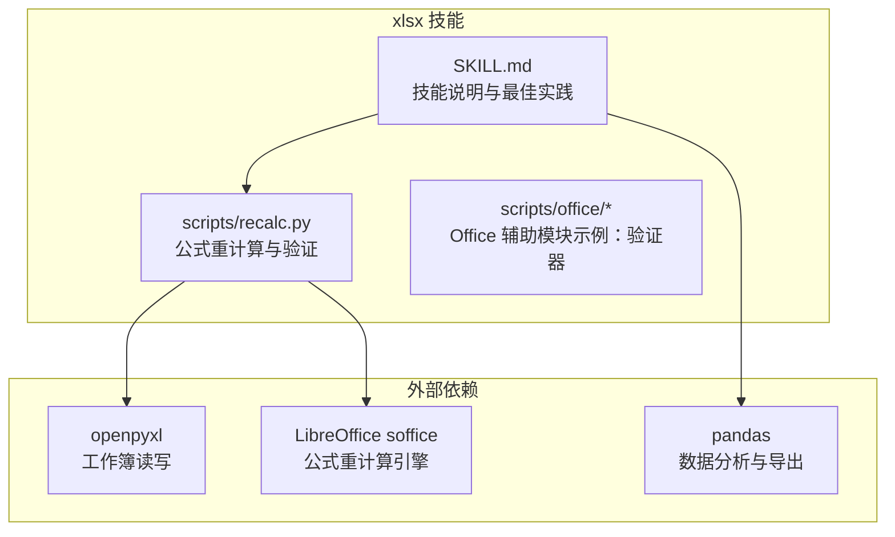
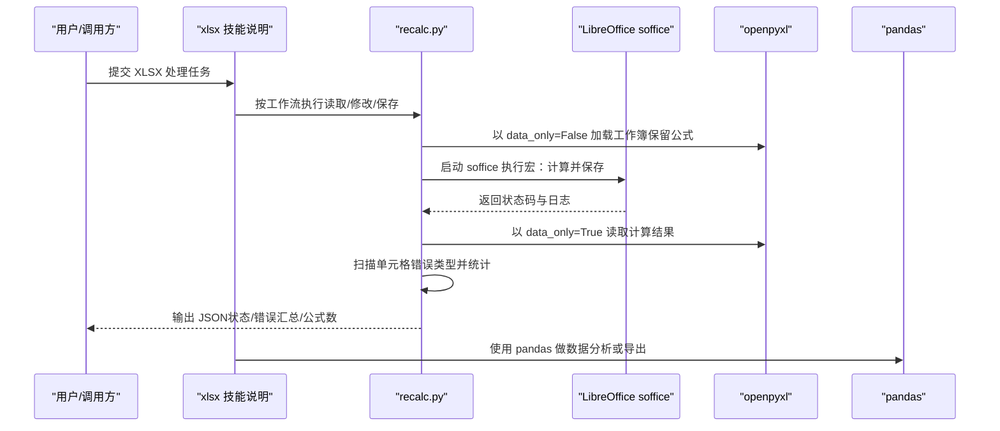
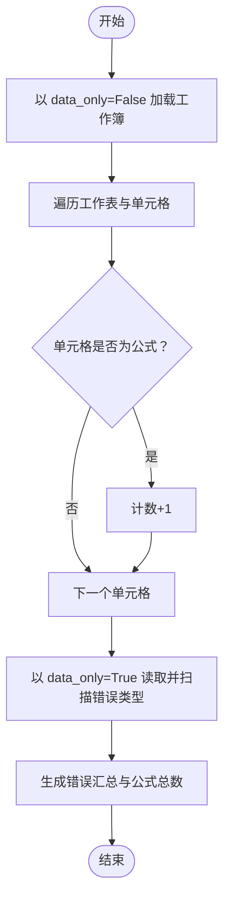
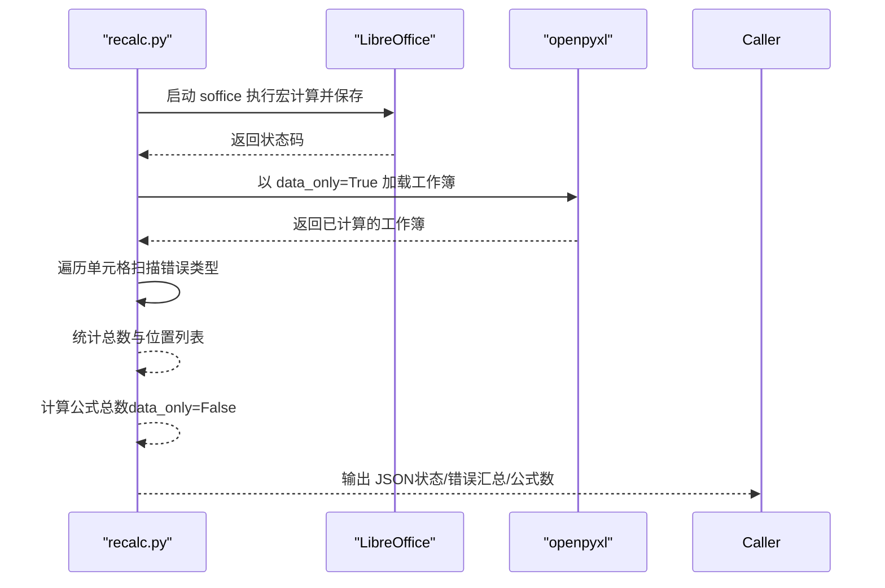
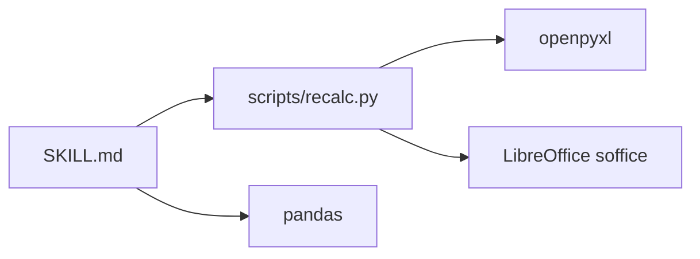

# XLSX电子表格处理

<cite>
**本文引用的文件**
- [xlsx 技能说明](file://src/qwenpaw/agents/skills/xlsx/SKILL.md)
- [公式重计算脚本](file://src/qwenpaw/agents/skills/xlsx/scripts/recalc.py)
- [xlsx 许可证](file://src/qwenpaw/agents/skills/xlsx/LICENSE.txt)
- [docx 技能中的 office 验证器（参考）](file://src/qwenpaw/agents/skills/docx/scripts/office/validate.py)
- [pptx 技能中的 office 验证器（参考）](file://src/qwenpaw/agents/skills/pptx/scripts/office/validate.py)
- [xlsx 技能中的 office 验证器（参考）](file://src/qwenpaw/agents/skills/xlsx/scripts/office/validate.py)
</cite>

## 目录
1. [简介](#简介)
2. [项目结构](#项目结构)
3. [核心组件](#核心组件)
4. [架构总览](#架构总览)
5. [详细组件分析](#详细组件分析)
6. [依赖分析](#依赖分析)
7. [性能考量](#性能考量)
8. [故障排查指南](#故障排查指南)
9. [结论](#结论)
10. [附录](#附录)

## 简介
本技术文档面向 QwenPaw 的 XLSX 电子表格处理技能，系统化阐述 Excel 工作簿解析机制、工作表结构与单元格数据处理、公式计算与验证流程、数据提取与格式转换、工作表读写与批量处理能力、安全与权限控制、格式兼容性以及性能优化策略。文档以“xlsx 技能说明”和“公式重计算脚本”为核心，结合仓库内其他 Office 文档类技能的验证器作为对比参考，帮助读者在实际工程中高效、安全地处理 XLSX 文件。

## 项目结构
XLSX 技能位于 agents/skills/xlsx 目录下，包含技能说明文档与一组 Python 脚本，其中关键流程由“公式重计算脚本”驱动，配合 openpyxl 进行文件读取与错误扫描，并通过 LibreOffice 完成公式重计算与保存。

图示来源
- [xlsx 技能说明:78-295](file://src/qwenpaw/agents/skills/xlsx/SKILL.md#L78-L295)
- [公式重计算脚本:1-210](file://src/qwenpaw/agents/skills/xlsx/scripts/recalc.py#L1-L210)

章节来源
- [xlsx 技能说明:1-306](file://src/qwenpaw/agents/skills/xlsx/SKILL.md#L1-L306)
- [公式重计算脚本:1-210](file://src/qwenpaw/agents/skills/xlsx/scripts/recalc.py#L1-L210)

## 核心组件
- 技能说明（SKILL.md）
  - 明确 XLSX 处理场景、前置依赖（openpyxl、pandas、LibreOffice）、工作流步骤、颜色与数字格式规范、公式构建规则、验证清单与最佳实践。
- 公式重计算脚本（scripts/recalc.py）
  - 自动配置 LibreOffice 宏环境，调用 soffice 执行公式重计算与保存；随后使用 openpyxl 以 data_only=True 读取并扫描单元格中的 Excel 错误类型，统计公式总数与错误分布，输出 JSON 结果。
- Office 验证器（scripts/office/validate.py）
  - 在 docx/pptx/xlsx 技能中提供通用的 Office 文件类型判定与校验逻辑，便于统一处理不同 Office 文档类型的输入。

章节来源
- [xlsx 技能说明:78-295](file://src/qwenpaw/agents/skills/xlsx/SKILL.md#L78-L295)
- [公式重计算脚本:80-186](file://src/qwenpaw/agents/skills/xlsx/scripts/recalc.py#L80-L186)
- [xlsx 技能中的 office 验证器（参考）:60-75](file://src/qwenpaw/agents/skills/xlsx/scripts/office/validate.py#L60-L75)
- [docx 技能中的 office 验证器（参考）:60-75](file://src/qwenpaw/agents/skills/docx/scripts/office/validate.py#L60-L75)
- [pptx 技能中的 office 验证器（参考）:60-75](file://src/qwenpaw/agents/skills/pptx/scripts/office/validate.py#L60-L75)

## 架构总览
XLSX 处理的整体流程分为“准备—读取—修改—保存—重算—验证—交付”。LibreOffice 作为外部引擎负责公式重计算，openpyxl 负责文件读写与错误扫描，pandas 提供数据分析与导出能力。

图示来源
- [xlsx 技能说明:146-239](file://src/qwenpaw/agents/skills/xlsx/SKILL.md#L146-L239)
- [公式重计算脚本:80-186](file://src/qwenpaw/agents/skills/xlsx/scripts/recalc.py#L80-L186)

## 详细组件分析

### 组件一：工作簿解析与数据提取（openpyxl）
- 解析机制
  - 以 data_only=False 打开工作簿，保留公式字符串；随后以 data_only=True 读取计算值，用于错误扫描与统计。
  - 支持遍历所有工作表与行列，定位包含特定错误标记的单元格坐标。
- 数据提取与格式转换
  - 使用 pandas 读取 Excel 时可指定 dtype、usecols、parse_dates 等参数，避免类型推断误差与提升大文件读取效率。
  - 将 DataFrame 导出为 Excel 时，可通过 to_excel 控制索引与列名呈现。
- 工作表操作
  - 读取：支持按名称或索引访问工作表；遍历多工作表。
  - 修改：插入/删除行列、新增工作表、设置列宽、应用样式等。
  - 写入：保存工作簿，注意 data_only=True 模式下保存会丢失公式，需谨慎选择模式。

图示来源
- [公式重计算脚本:167-186](file://src/qwenpaw/agents/skills/xlsx/scripts/recalc.py#L167-L186)
- [xlsx 技能说明:90-109](file://src/qwenpaw/agents/skills/xlsx/SKILL.md#L90-L109)

章节来源
- [xlsx 技能说明:90-109](file://src/qwenpaw/agents/skills/xlsx/SKILL.md#L90-L109)
- [xlsx 技能说明:146-219](file://src/qwenpaw/agents/skills/xlsx/SKILL.md#L146-L219)
- [xlsx 技能说明:285-295](file://src/qwenpaw/agents/skills/xlsx/SKILL.md#L285-L295)
- [公式重计算脚本:125-186](file://src/qwenpaw/agents/skills/xlsx/scripts/recalc.py#L125-L186)

### 组件二：公式计算与验证（LibreOffice + openpyxl）
- 计算引擎
  - 通过 soffice 启动 LibreOffice，执行预置宏进行“全部计算→保存→关闭”，确保公式结果被持久化。
- 错误检测
  - 以 data_only=True 读取后扫描单元格字符串，识别 #VALUE!、#DIV/0!、#REF!、#NAME?、#NULL!、#NUM!、#N/A 等错误标记。
  - 统计错误总数与各类型数量，并记录前若干个具体位置（Sheet!A1）。
- 输出规范
  - 返回 JSON 包含 status、total_errors、total_formulas、error_summary 等字段，便于上层流程判断与修复。

图示来源
- [公式重计算脚本:80-186](file://src/qwenpaw/agents/skills/xlsx/scripts/recalc.py#L80-L186)

章节来源
- [公式重计算脚本:80-186](file://src/qwenpaw/agents/skills/xlsx/scripts/recalc.py#L80-L186)
- [xlsx 技能说明:221-277](file://src/qwenpaw/agents/skills/xlsx/SKILL.md#L221-L277)

### 组件三：数据处理能力（数值/文本/日期/公式）
- 数值与文本
  - 使用 pandas 指定 dtype 避免整型/浮点推断偏差；对文本列保持字符串类型。
- 日期时间
  - 通过 parse_dates 参数正确解析日期列，避免后续计算与排序异常。
- 公式识别与转换
  - 优先使用 Excel 公式而非 Python 计算硬编码值，确保动态更新能力。
  - 对跨表引用使用 SheetName!A1 格式，避免 #REF! 错误。
- 批量处理
  - pandas 支持按列筛选（usecols）与分块读取，openpyxl 支持 write_only 模式写入大批量数据。

章节来源
- [xlsx 技能说明:279-295](file://src/qwenpaw/agents/skills/xlsx/SKILL.md#L279-L295)
- [xlsx 技能说明:113-144](file://src/qwenpaw/agents/skills/xlsx/SKILL.md#L113-L144)

### 组件四：安全处理、权限控制与格式兼容性
- 安全与权限
  - LibreOffice 宏首次运行时自动配置，避免手动干预带来的安全风险；脚本对返回码与错误消息进行严格判断，防止宏未正确安装导致的执行失败。
  - 在受限环境中（如沙箱），脚本通过平台差异化的超时控制（Linux/macOS 使用 gtimeout/timeout，Windows 使用 subprocess 超时）保障稳定性。
- 格式兼容性
  - 通过 openpyxl 读写 .xlsx/.xlsm 等格式；pandas 读取 .csv/.tsv 并导出为 Excel，满足多格式互转需求。
- 输入校验
  - 参考 docx/pptx/xlsx 技能中的 office 验证器，统一判定文件类型并提示必须为 .docx/.pptx/.xlsx 之一，避免误用。

章节来源
- [公式重计算脚本:33-124](file://src/qwenpaw/agents/skills/xlsx/scripts/recalc.py#L33-L124)
- [xlsx 技能说明:78-88](file://src/qwenpaw/agents/skills/xlsx/SKILL.md#L78-L88)
- [xlsx 技能中的 office 验证器（参考）:60-75](file://src/qwenpaw/agents/skills/xlsx/scripts/office/validate.py#L60-L75)
- [docx 技能中的 office 验证器（参考）:60-75](file://src/qwenpaw/agents/skills/docx/scripts/office/validate.py#L60-L75)
- [pptx 技能中的 office 验证器（参考）:60-75](file://src/qwenpaw/agents/skills/pptx/scripts/office/validate.py#L60-L75)

## 依赖分析
- 内部依赖
  - SKILL.md 依赖 scripts/recalc.py 的工作流与输出规范；recalc.py 依赖 openpyxl 与 soffice。
- 外部依赖
  - openpyxl：工作簿读写与迭代。
  - pandas：数据分析与导出。
  - LibreOffice：公式重计算与保存。
  - 平台工具：Linux/macOS 上的 timeout/gtimeout，Windows 上的 subprocess 超时。

图示来源
- [xlsx 技能说明:78-295](file://src/qwenpaw/agents/skills/xlsx/SKILL.md#L78-L295)
- [公式重计算脚本:1-210](file://src/qwenpaw/agents/skills/xlsx/scripts/recalc.py#L1-L210)

章节来源
- [xlsx 技能说明:78-88](file://src/qwenpaw/agents/skills/xlsx/SKILL.md#L78-L88)
- [公式重计算脚本:1-210](file://src/qwenpaw/agents/skills/xlsx/scripts/recalc.py#L1-L210)

## 性能考量
- 大文件读取
  - pandas：使用 usecols 指定列范围，减少内存占用；必要时分块读取。
  - openpyxl：读取时启用 read_only=True；写入时启用 write_only=True。
- 公式重计算
  - 合理设置超时时间（timeout_seconds），避免长时间阻塞；仅在需要时触发重算。
- 错误扫描
  - 仅对 data_only=True 的工作簿进行错误扫描，避免重复加载；限制 error_summary 中位置列表长度，降低输出体积。
- 格式转换
  - 优先使用 pandas 的 to_excel 直接导出，减少中间层转换成本。

章节来源
- [xlsx 技能说明:285-295](file://src/qwenpaw/agents/skills/xlsx/SKILL.md#L285-L295)
- [公式重计算脚本:80-124](file://src/qwenpaw/agents/skills/xlsx/scripts/recalc.py#L80-L124)

## 故障排查指南
- LibreOffice 宏未配置
  - 现象：返回“宏未正确配置”或 soffice 返回非零状态。
  - 排查：确认脚本已成功创建宏文件并具备执行权限；检查平台宏目录是否存在。
- 公式重计算超时
  - 现象：返回“超时”错误。
  - 排查：适当增大 timeout；检查系统资源；确认文件大小与公式复杂度。
- Excel 错误类型定位
  - 现象：error_summary 中出现 #REF!/#DIV/0!/#VALUE! 等。
  - 排查：核对跨表引用格式、除数不为零、单元格存在性；修正后重新重算。
- data_only=True 保存导致公式丢失
  - 现象：以 data_only=True 读取后再保存，公式被替换为值。
  - 排查：避免在 data_only=True 模式下保存；如需保存公式，请以 data_only=False 打开并计算后保存。

章节来源
- [公式重计算脚本:80-124](file://src/qwenpaw/agents/skills/xlsx/scripts/recalc.py#L80-L124)
- [公式重计算脚本:125-186](file://src/qwenpaw/agents/skills/xlsx/scripts/recalc.py#L125-L186)
- [xlsx 技能说明:285-290](file://src/qwenpaw/agents/skills/xlsx/SKILL.md#L285-L290)

## 结论
XLSX 技能通过“技能说明 + 公式重计算脚本 + 外部引擎”的组合，实现了从数据读取、公式计算到错误验证的完整闭环。openpyxl 与 pandas 分别承担工作簿操作与数据分析，LibreOffice 提供可靠的公式重计算能力。遵循技能说明中的最佳实践与验证清单，可在保证质量的前提下高效处理各类 XLSX 场景，并在大文件与复杂公式环境下保持稳定与可维护性。

## 附录
- 许可信息
  - xlsx 技能受许可约束，禁止复制、分发或逆向工程，使用需遵守服务协议。

章节来源
- [xlsx 许可证:1-31](file://src/qwenpaw/agents/skills/xlsx/LICENSE.txt#L1-L31)