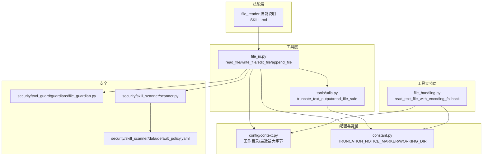
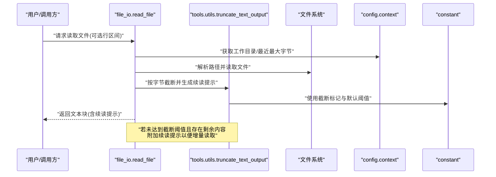
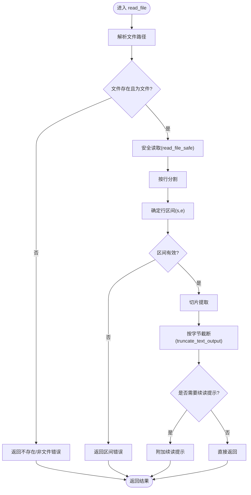
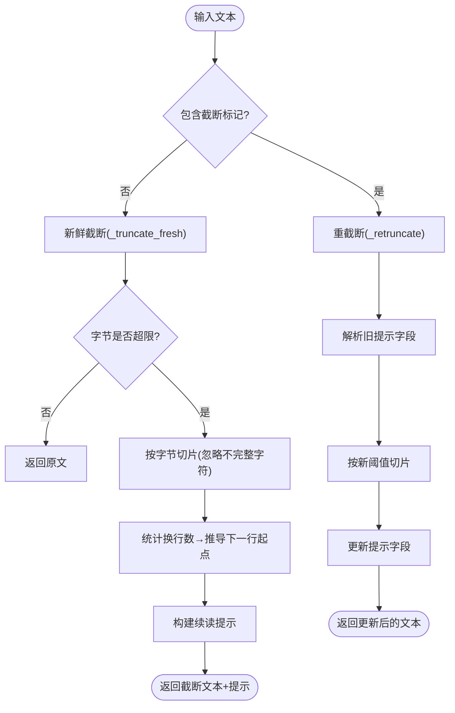
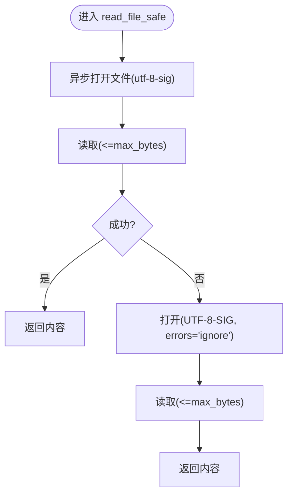
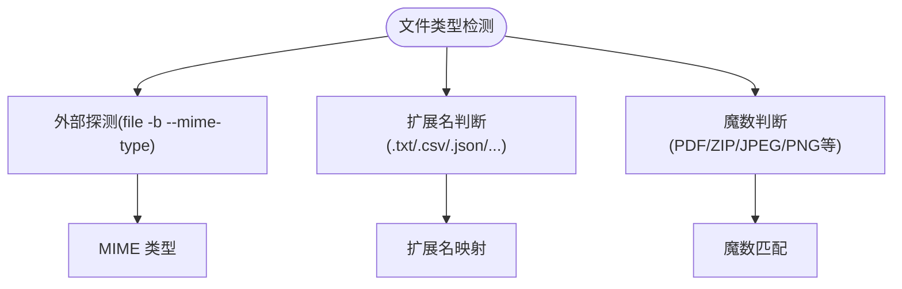
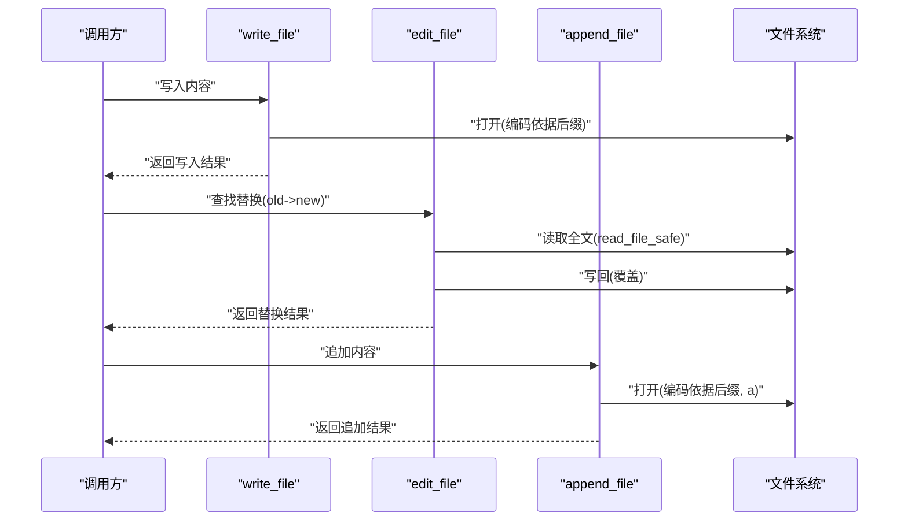
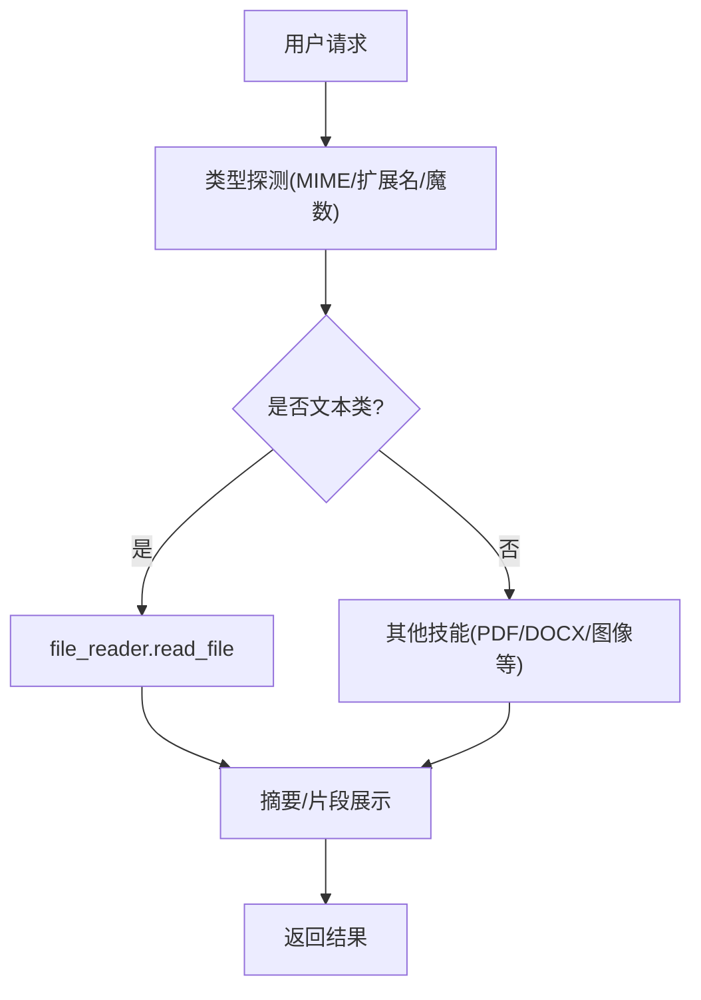
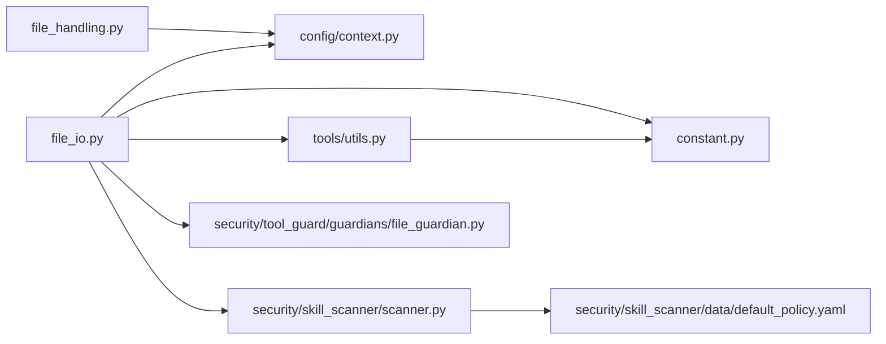

# 文件读取通用技能

<cite>
**本文引用的文件**
- [file_io.py](file://src/qwenpaw/agents/tools/file_io.py)
- [utils.py](file://src/qwenpaw/agents/tools/utils.py)
- [file_handling.py](file://src/qwenpaw/agents/utils/file_handling.py)
- [SKILL.md](file://src/qwenpaw/agents/skills/file_reader/SKILL.md)
- [context.py](file://src/qwenpaw/config/context.py)
- [constant.py](file://src/qwenpaw/constant.py)
- [file_search.py](file://src/qwenpaw/agents/tools/file_search.py)
- [security/tool_guard/guardians/file_guardian.py](file://src/qwenpaw/security/tool_guard/guardians/file_guardian.py)
- [security/skill_scanner/scanner.py](file://src/qwenpaw/security/skill_scanner/scanner.py)
- [security/skill_scanner/data/default_policy.yaml](file://src/qwenpaw/security/skill_scanner/data/default_policy.yaml)
</cite>

## 目录
1. [简介](#简介)
2. [项目结构](#项目结构)
3. [核心组件](#核心组件)
4. [架构总览](#架构总览)
5. [详细组件分析](#详细组件分析)
6. [依赖关系分析](#依赖关系分析)
7. [性能考虑](#性能考虑)
8. [故障排查指南](#故障排查指南)
9. [结论](#结论)
10. [附录](#附录)

## 简介
本文件面向“文件读取通用技能”，系统性阐述其基础架构与通用接口设计，覆盖文件类型检测、编码识别与内容预处理机制；深入解析配置项、参数设置与错误处理策略；提供性能优化与内存管理方案；说明访问控制、权限验证与安全处理机制；并说明与其他文档处理技能的集成方式与数据流转过程。目标是帮助开发者与使用者在理解整体设计的同时，高效、安全地使用该技能。

## 项目结构
文件读取通用技能由以下模块协同构成：
- 工具层：提供统一的文件读取、写入、编辑与追加能力，以及输出截断与安全读取封装
- 工具辅助层：提供截断算法、最大读取字节数限制、编码选择等
- 工具支持层：提供跨平台编码回退读取、下载与本地路径解析等
- 技能元数据：定义技能范围、行为约束与安全建议
- 配置与常量：工作目录、最近最大字节限制、截断标记等
- 安全与扫描：文件守护、策略扫描与默认策略

**图示来源**
- [SKILL.md:1-59](file://src/qwenpaw/agents/skills/file_reader/SKILL.md#L1-L59)
- [file_io.py:1-396](file://src/qwenpaw/agents/tools/file_io.py#L1-L396)
- [utils.py:1-238](file://src/qwenpaw/agents/tools/utils.py#L1-L238)
- [file_handling.py:1-357](file://src/qwenpaw/agents/utils/file_handling.py#L1-L357)
- [context.py:1-200](file://src/qwenpaw/config/context.py#L1-L200)
- [constant.py:1-200](file://src/qwenpaw/constant.py#L1-L200)
- [security/tool_guard/guardians/file_guardian.py:1-200](file://src/qwenpaw/security/tool_guard/guardians/file_guardian.py#L1-L200)
- [security/skill_scanner/scanner.py:1-200](file://src/qwenpaw/security/skill_scanner/scanner.py#L1-L200)
- [security/skill_scanner/data/default_policy.yaml:1-200](file://src/qwenpaw/security/skill_scanner/data/default_policy.yaml#L1-L200)

**章节来源**
- [SKILL.md:1-59](file://src/qwenpaw/agents/skills/file_reader/SKILL.md#L1-L59)
- [file_io.py:1-396](file://src/qwenpaw/agents/tools/file_io.py#L1-L396)
- [utils.py:1-238](file://src/qwenpaw/agents/tools/utils.py#L1-L238)
- [file_handling.py:1-357](file://src/qwenpaw/agents/utils/file_handling.py#L1-L357)
- [context.py:1-200](file://src/qwenpaw/config/context.py#L1-L200)
- [constant.py:1-200](file://src/qwenpaw/constant.py#L1-L200)

## 核心组件
- 统一读取接口：read_file 支持按行区间读取、自动路径解析、截断提示与错误响应
- 写入与编辑：write_file、edit_file（查找替换）、append_file 提供文件写入与变更
- 安全读取：read_file_safe 带内存上限与编码容错，避免大文件导致内存压力
- 输出截断：truncate_text_output 在字节边界进行截断，保留完整行，附加续读提示
- 编码策略：根据文件后缀选择 UTF-8 或带 BOM 的 UTF-8，兼顾 Windows 兼容性
- 路径解析：相对路径解析到当前工作空间或全局工作目录
- 跨平台编码回退：read_text_file_with_encoding_fallback 多编码尝试，提升兼容性
- 安全与策略：文件守护与技能扫描，确保不执行不受信任文件、遵循最小暴露原则

**章节来源**
- [file_io.py:66-206](file://src/qwenpaw/agents/tools/file_io.py#L66-L206)
- [file_io.py:208-396](file://src/qwenpaw/agents/tools/file_io.py#L208-L396)
- [utils.py:153-206](file://src/qwenpaw/agents/tools/utils.py#L153-L206)
- [utils.py:209-238](file://src/qwenpaw/agents/tools/utils.py#L209-L238)
- [file_handling.py:31-103](file://src/qwenpaw/agents/utils/file_handling.py#L31-L103)
- [SKILL.md:1-59](file://src/qwenpaw/agents/skills/file_reader/SKILL.md#L1-L59)

## 架构总览
文件读取通用技能以“工具层”为核心，向上提供统一接口，向下依赖“工具辅助层”与“工具支持层”。配置与常量模块提供运行时上下文与默认行为，安全模块贯穿工具调用前后，形成闭环。

**图示来源**
- [file_io.py:66-206](file://src/qwenpaw/agents/tools/file_io.py#L66-L206)
- [utils.py:153-206](file://src/qwenpaw/agents/tools/utils.py#L153-L206)
- [context.py:1-200](file://src/qwenpaw/config/context.py#L1-L200)
- [constant.py:1-200](file://src/qwenpaw/constant.py#L1-L200)

## 详细组件分析

### 组件A：统一读取接口 read_file
- 功能要点
  - 路径解析：支持绝对/相对路径，相对路径解析到当前工作目录
  - 行区间读取：start_line/end_line 可选，闭区间（1 基），包含行号
  - 截断策略：基于字节上限与行完整性，自动附加续读提示
  - 错误处理：参数校验、路径存在性与类型检查、异常捕获与友好提示
- 参数与配置
  - file_path：文件路径
  - start_line/end_line：起止行号（可选）
  - 最大字节：通过上下文获取，缺省值来自常量
- 数据流
  - 解析路径 → 读取内容 → 切片行区间 → 截断与续读提示 → 返回文本块

**图示来源**
- [file_io.py:66-206](file://src/qwenpaw/agents/tools/file_io.py#L66-L206)
- [utils.py:153-206](file://src/qwenpaw/agents/tools/utils.py#L153-L206)

**章节来源**
- [file_io.py:66-206](file://src/qwenpaw/agents/tools/file_io.py#L66-L206)

### 组件B：输出截断与续读机制
- 截断策略
  - 新鲜截断：首次截断在字节边界，保留完整行，计算下一次读取起点
  - 重截断：已含截断标记的内容按新阈值重新截断，更新提示信息
- 关键常量
  - 默认最大字节、截断标记、最大读取字节数（内存保护）
- 行完整性
  - 通过统计换行数估算完整行数量，避免在多字节字符中间截断

**图示来源**
- [utils.py:25-88](file://src/qwenpaw/agents/tools/utils.py#L25-L88)
- [utils.py:90-151](file://src/qwenpaw/agents/tools/utils.py#L90-L151)
- [utils.py:153-206](file://src/qwenpaw/agents/tools/utils.py#L153-L206)
- [constant.py:1-200](file://src/qwenpaw/constant.py#L1-L200)

**章节来源**
- [utils.py:153-206](file://src/qwenpaw/agents/tools/utils.py#L153-L206)

### 组件C：安全读取与内存保护
- 安全读取
  - 使用异步文件读取，限定最大读取字节数（默认 1GB），避免内存压力
  - 尝试 UTF-8-SIG，失败则忽略错误继续读取，保证可用性
- 跨平台编码回退
  - 优先尝试 UTF-8-SIG、UTF-8、GBK/CP936、CP1252/Latin-1
  - 最终回退到 UTF-8 错误替换，记录警告日志

**图示来源**
- [utils.py:209-238](file://src/qwenpaw/agents/tools/utils.py#L209-L238)
- [file_handling.py:31-103](file://src/qwenpaw/agents/utils/file_handling.py#L31-L103)

**章节来源**
- [utils.py:209-238](file://src/qwenpaw/agents/tools/utils.py#L209-L238)
- [file_handling.py:31-103](file://src/qwenpaw/agents/utils/file_handling.py#L31-L103)

### 组件D：编码识别与文件类型检测
- 编码策略
  - 文本/CSV/TSV/TAB/日志类：优先 UTF-8-SIG（Windows 兼容）
  - 其他文件：UTF-8（更安全）
- 类型检测
  - 技能说明中建议使用外部命令探测 MIME 类型
  - 下载与本地路径解析中包含基于 URL 与魔数的扩展名猜测逻辑

**图示来源**
- [SKILL.md:14-21](file://src/qwenpaw/agents/skills/file_reader/SKILL.md#L14-L21)
- [file_io.py:42-64](file://src/qwenpaw/agents/tools/file_io.py#L42-L64)
- [file_handling.py:216-244](file://src/qwenpaw/agents/utils/file_handling.py#L216-L244)

**章节来源**
- [SKILL.md:14-21](file://src/qwenpaw/agents/skills/file_reader/SKILL.md#L14-L21)
- [file_io.py:42-64](file://src/qwenpaw/agents/tools/file_io.py#L42-L64)
- [file_handling.py:216-244](file://src/qwenpaw/agents/utils/file_handling.py#L216-L244)

### 组件E：写入、编辑与追加
- 写入：根据文件类型选择编码，创建或覆盖文件
- 编辑：全文查找替换，先读取再写入，失败时透传错误
- 追加：以指定编码追加内容至文件末尾

**图示来源**
- [file_io.py:208-396](file://src/qwenpaw/agents/tools/file_io.py#L208-L396)

**章节来源**
- [file_io.py:208-396](file://src/qwenpaw/agents/tools/file_io.py#L208-L396)

### 组件F：与其他文档处理技能的集成与数据流转
- 适用场景
  - 文本类文件（纯文本、Markdown、JSON、YAML、CSV/TSV、日志、SQL、配置文件等）
- 不适用场景
  - PDF、Office（docx/xlsx/pptx）、图片、音视频等二进制/复合格式
- 集成建议
  - 在调用前先进行类型探测，非文本类交由专用技能处理
  - 对大文件采用分段读取与摘要策略，避免一次性加载

**图示来源**
- [SKILL.md:12-59](file://src/qwenpaw/agents/skills/file_reader/SKILL.md#L12-L59)

**章节来源**
- [SKILL.md:12-59](file://src/qwenpaw/agents/skills/file_reader/SKILL.md#L12-L59)

## 依赖关系分析
- 工具层依赖
  - 读取接口依赖上下文（工作目录/最近最大字节）与常量（截断标记）
  - 截断函数依赖常量与编码信息
  - 安全读取与编码回退独立于上下文，但受最大读取字节数限制
- 安全依赖
  - 文件守护与技能扫描在工具调用前后介入，确保最小权限与策略合规

**图示来源**
- [file_io.py:1-396](file://src/qwenpaw/agents/tools/file_io.py#L1-L396)
- [utils.py:1-238](file://src/qwenpaw/agents/tools/utils.py#L1-L238)
- [file_handling.py:1-357](file://src/qwenpaw/agents/utils/file_handling.py#L1-L357)
- [context.py:1-200](file://src/qwenpaw/config/context.py#L1-L200)
- [constant.py:1-200](file://src/qwenpaw/constant.py#L1-L200)
- [security/tool_guard/guardians/file_guardian.py:1-200](file://src/qwenpaw/security/tool_guard/guardians/file_guardian.py#L1-L200)
- [security/skill_scanner/scanner.py:1-200](file://src/qwenpaw/security/skill_scanner/scanner.py#L1-L200)
- [security/skill_scanner/data/default_policy.yaml:1-200](file://src/qwenpaw/security/skill_scanner/data/default_policy.yaml#L1-L200)

**章节来源**
- [file_io.py:1-396](file://src/qwenpaw/agents/tools/file_io.py#L1-L396)
- [utils.py:1-238](file://src/qwenpaw/agents/tools/utils.py#L1-L238)
- [file_handling.py:1-357](file://src/qwenpaw/agents/utils/file_handling.py#L1-L357)
- [context.py:1-200](file://src/qwenpaw/config/context.py#L1-L200)
- [constant.py:1-200](file://src/qwenpaw/constant.py#L1-L200)
- [security/tool_guard/guardians/file_guardian.py:1-200](file://src/qwenpaw/security/tool_guard/guardians/file_guardian.py#L1-L200)
- [security/skill_scanner/scanner.py:1-200](file://src/qwenpaw/security/skill_scanner/scanner.py#L1-L200)
- [security/skill_scanner/data/default_policy.yaml:1-200](file://src/qwenpaw/security/skill_scanner/data/default_policy.yaml#L1-L200)

## 性能考虑
- 异步读取与内存上限
  - 使用异步文件读取与最大读取字节数（默认 1GB），避免大文件导致内存峰值过高
- 字节级截断与行完整性
  - 在字节边界截断，统计换行数确保完整行，减少重复传输
- 编码选择与兼容性
  - 针对 CSV/TSV/TXT/日志使用带 BOM 的 UTF-8，提高 Windows 平台兼容性
- 分段读取与续读提示
  - 对大文件采用分段读取与续读提示，降低单次输出体积，提升交互效率

**章节来源**
- [utils.py:17-22](file://src/qwenpaw/agents/tools/utils.py#L17-L22)
- [utils.py:209-238](file://src/qwenpaw/agents/tools/utils.py#L209-L238)
- [file_io.py:42-64](file://src/qwenpaw/agents/tools/file_io.py#L42-L64)
- [file_io.py:166-191](file://src/qwenpaw/agents/tools/file_io.py#L166-L191)

## 故障排查指南
- 常见错误与处理
  - 路径不存在/非文件：返回明确错误提示，建议检查路径与权限
  - 行区间无效：start_line > end_line 或超出文件长度，返回区间错误
  - 编码问题：使用安全读取与编码回退，必要时转为二进制/专用技能
  - 大文件截断：启用续读提示，按提示分段读取
- 安全与权限
  - 严格遵循“最小权限”原则，避免执行不受信任文件
  - 使用文件守护与策略扫描，阻断高风险操作
- 日志与可观测性
  - 记录编码回退与最终回退情况，便于定位问题

**章节来源**
- [file_io.py:85-206](file://src/qwenpaw/agents/tools/file_io.py#L85-L206)
- [utils.py:209-238](file://src/qwenpaw/agents/tools/utils.py#L209-L238)
- [file_handling.py:31-103](file://src/qwenpaw/agents/utils/file_handling.py#L31-L103)
- [security/tool_guard/guardians/file_guardian.py:1-200](file://src/qwenpaw/security/tool_guard/guardians/file_guardian.py#L1-L200)
- [security/skill_scanner/scanner.py:1-200](file://src/qwenpaw/security/skill_scanner/scanner.py#L1-L200)

## 结论
文件读取通用技能通过统一接口、安全读取、智能截断与跨平台编码回退，实现了对文本类文件的高效、安全与易用处理。结合类型检测与续读提示，能够应对大文件与多样化环境。配合安全与策略模块，确保在复杂场景下的可控与合规。

## 附录
- 最佳实践
  - 优先进行类型探测，非文本类文件交由专用技能
  - 大文件采用分段读取与摘要策略，避免一次性加载
  - 明确行区间参数，减少无关内容传输
  - 使用续读提示进行增量获取，提升交互体验
- 常见问题
  - 文件编码异常：优先尝试 UTF-8-SIG，随后回退到其他编码
  - 路径解析失败：确认相对路径解析到正确工作目录
  - 续读提示未出现：检查是否达到截断阈值或是否已完整读取