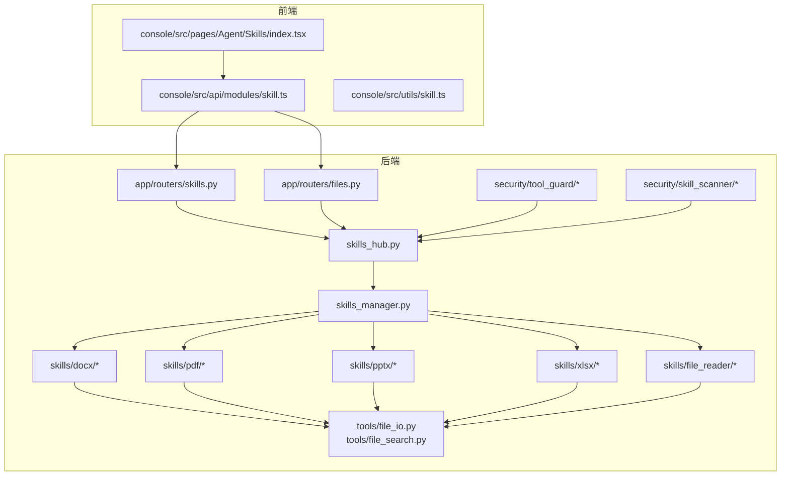
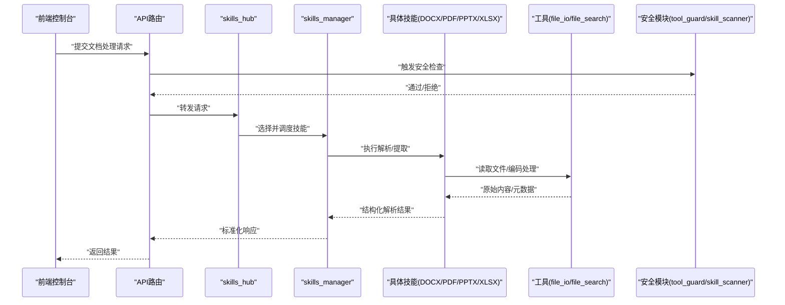
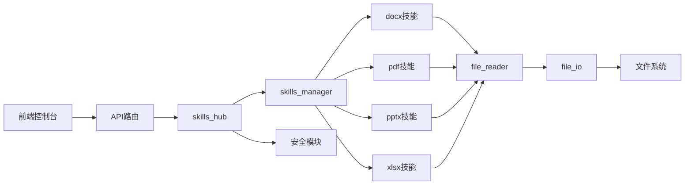

# 文档处理技能

<cite>
**本文引用的文件**
- [docx/SKILL.md](file://src/qwenpaw/agents/skills/docx/SKILL.md)
- [pdf/SKILL.md](file://src/qwenpaw/agents/skills/pdf/SILL.md)
- [pptx/SKILL.md](file://src/qwenpaw/agents/skills/pptx/SKILL.md)
- [xlsx/SKILL.md](file://src/qwenpaw/agents/skills/xlsx/SKILL.md)
- [file_reader/SKILL.md](file://src/qwenpaw/agents/skills/file_reader/SKILL.md)
- [docx/scripts](file://src/qwenpaw/agents/skills/docx/scripts)
- [pdf/scripts](file://src/qwenpaw/agents/skills/pdf/scripts)
- [pptx/scripts](file://src/qwenpaw/agents/skills/pptx/scripts)
- [xlsx/scripts](file://src/qwenpaw/agents/skills/xlsx/scripts)
- [tools/file_io.py](file://src/qwenpaw/tools/file_io.py)
- [tools/file_search.py](file://src/qwenpaw/tools/file_search.py)
- [security/tool_guard/approval.py](file://src/qwenpaw/security/tool_guard/approval.py)
- [security/tool_guard/engine.py](file://src/qwenpaw/security/tool_guard/engine.py)
- [security/skill_scanner/scanner.py](file://src/qwenpaw/security/skill_scanner/scanner.py)
- [security/skill_scanner/data/default_policy.yaml](file://src/qwenpaw/security/skill_scanner/data/default_policy.yaml)
- [security/tool_guard/guardians/file_guardian.py](file://src/qwenpaw/security/tool_guard/guardians/file_guardian.py)
- [security/tool_guard/rules/dangerous_shell_commands.yaml](file://src/qwenpaw/security/tool_guard/rules/dangerous_shell_commands.yaml)
- [agents/skills_hub.py](file://src/qwenpaw/agents/skills_hub.py)
- [agents/skills_manager.py](file://src/qwenpaw/agents/skills_manager.py)
- [app/routers/skills.py](file://src/qwenpaw/app/routers/skills.py)
- [app/routers/files.py](file://src/qwenpaw/app/routers/files.py)
- [console/src/api/modules/skill.ts](file://src/console/src/api/modules/skill.ts)
- [console/src/pages/Agent/Skills/index.tsx](file://src/console/src/pages/Agent/Skills/index.tsx)
- [console/src/utils/skill.ts](file://src/console/src/utils/skill.ts)
- [README_zh.md](file://README_zh.md)
</cite>

## 目录
1. [简介](#简介)
2. [项目结构](#项目结构)
3. [核心组件](#核心组件)
4. [架构总览](#架构总览)
5. [详细组件分析](#详细组件分析)
6. [依赖关系分析](#依赖关系分析)
7. [性能考量](#性能考量)
8. [故障排查指南](#故障排查指南)
9. [结论](#结论)
10. [附录](#附录)

## 简介
本文件面向QwenPaw的“文档处理技能”子系统，系统性梳理对DOCX、PDF、PPTX、XLSX等文档格式的处理能力与实现机制，覆盖文件读取通用接口、格式支持范围、解析算法与数据提取方法、格式转换逻辑、编码处理、元数据提取、内容清洗、安全与权限控制、格式兼容性、性能优化与常见问题等。读者可据此快速理解各技能模块的职责边界、调用方式与最佳实践。

## 项目结构
文档处理技能位于后端Python代码树的skills目录下，每个格式对应一个独立技能模块，并在前端控制台提供可视化管理入口。整体结构如下：

图示来源
- [agents/skills_hub.py](file://src/qwenpaw/agents/skills_hub.py)
- [agents/skills_manager.py](file://src/qwenpaw/agents/skills_manager.py)
- [app/routers/skills.py](file://src/qwenpaw/app/routers/skills.py)
- [app/routers/files.py](file://src/qwenpaw/app/routers/files.py)
- [tools/file_io.py](file://src/qwenpaw/tools/file_io.py)
- [tools/file_search.py](file://src/qwenpaw/tools/file_search.py)
- [security/tool_guard/engine.py](file://src/qwenpaw/security/tool_guard/engine.py)
- [security/skill_scanner/scanner.py](file://src/qwenpaw/security/skill_scanner/scanner.py)

章节来源
- [agents/skills_hub.py](file://src/qwenpaw/agents/skills_hub.py)
- [agents/skills_manager.py](file://src/qwenpaw/agents/skills_manager.py)
- [app/routers/skills.py](file://src/qwenpaw/app/routers/skills.py)
- [app/routers/files.py](file://src/qwenpaw/app/routers/files.py)

## 核心组件
- 文档读取通用接口：通过file_reader技能抽象统一的文件读取能力，其他格式技能在此基础上扩展具体解析器。
- DOCX/PDF/PPTX/XLSX技能：各自封装特定格式的解析、元数据提取、内容清洗与必要时的格式转换逻辑。
- 工具层：file_io负责文件IO与编码处理；file_search提供文件检索辅助。
- 安全与权限：tool_guard进行工具调用审批与规则校验；skill_scanner扫描技能脚本与策略。
- 前端控制台：提供技能注册、启用/禁用、参数配置与状态展示。

章节来源
- [file_reader/SKILL.md](file://src/qwenpaw/agents/skills/file_reader/SKILL.md)
- [docx/SKILL.md](file://src/qwenpaw/agents/skills/docx/SKILL.md)
- [pdf/SKILL.md](file://src/qwenpaw/agents/skills/pdf/SKILL.md)
- [pptx/SKILL.md](file://src/qwenpaw/agents/skills/pptx/SKILL.md)
- [xlsx/SKILL.md](file://src/qwenpaw/agents/skills/xlsx/SKILL.md)
- [tools/file_io.py](file://src/qwenpaw/tools/file_io.py)
- [tools/file_search.py](file://src/qwenpaw/tools/file_search.py)
- [security/tool_guard/approval.py](file://src/qwenpaw/security/tool_guard/approval.py)
- [security/tool_guard/engine.py](file://src/qwenpaw/security/tool_guard/engine.py)
- [security/skill_scanner/scanner.py](file://src/qwenpaw/security/skill_scanner/scanner.py)

## 架构总览
文档处理技能的调用链路从控制台发起，经API路由进入skills_hub，由skills_manager调度具体技能，技能内部调用工具层完成文件读取与解析，最终返回结构化结果。安全模块贯穿请求与执行阶段，确保合规与风险可控。

图示来源
- [console/src/api/modules/skill.ts](file://src/console/src/api/modules/skill.ts)
- [app/routers/skills.py](file://src/qwenpaw/app/routers/skills.py)
- [agents/skills_hub.py](file://src/qwenpaw/agents/skills_hub.py)
- [agents/skills_manager.py](file://src/qwenpaw/agents/skills_manager.py)
- [tools/file_io.py](file://src/qwenpaw/tools/file_io.py)
- [security/tool_guard/engine.py](file://src/qwenpaw/security/tool_guard/engine.py)
- [security/skill_scanner/scanner.py](file://src/qwenpaw/security/skill_scanner/scanner.py)

## 详细组件分析

### DOCX 技能
- 职责与能力
  - 解析DOCX文档，提取文本、表格、图片、样式与元数据。
  - 支持段落、标题层级、列表、超链接等富文本结构识别。
  - 可选输出纯文本或带结构标记的文本，便于后续大模型处理。
- 实现要点
  - 使用file_reader作为通用读取入口，结合docx解析库进行DOM式遍历与抽取。
  - 对图片进行内嵌/外部引用识别与路径规范化。
  - 元数据包括作者、标题、主题、创建时间、修订历史等。
- 参数与返回
  - 输入参数：文件路径/字节流、是否提取图片、是否保留格式标记、编码策略。
  - 返回结构：文本内容、表格数组、图片映射、元数据对象。
- 编码与清洗
  - 统一按UTF-8读取，异常字符替换或跳过。
  - 清洗HTML/XML标签、空白段落、冗余空格。
- 安全与兼容
  - 拒绝宏或可疑脚本元素；限制最大文件大小与图片数量。
  - 兼容不同版本的Office导出差异，优先采用标准字段。

章节来源
- [docx/SKILL.md](file://src/qwenpaw/agents/skills/docx/SKILL.md)
- [docx/scripts](file://src/qwenpaw/agents/skills/docx/scripts)
- [file_reader/SKILL.md](file://src/qwenpaw/agents/skills/file_reader/SKILL.md)
- [tools/file_io.py](file://src/qwenpaw/tools/file_io.py)

### PDF 技能
- 职责与能力
  - 提取PDF文本、图像、注释、书签与元数据。
  - 支持多页合并、区域裁剪、OCR（可选）增强。
  - 可输出纯文本、带页码/坐标标注的结构化文本。
- 实现要点
  - 使用file_reader读取二进制流，按页解析文本块与图像。
  - 处理旋转、倾斜、手写体等复杂排版。
  - OCR流程仅在文本不可用时启用，避免额外开销。
- 参数与返回
  - 输入参数：文件路径/字节流、是否OCR、页码范围、是否提取图像。
  - 返回结构：分页文本、图像列表、书签/注释、元数据。
- 编码与清洗
  - 统一解码为Unicode，处理乱码与缺失字符。
  - 合并断行、去除重复页眉页脚。
- 安全与兼容
  - 过滤加密PDF或受限权限文档；限制图像分辨率与体积。
  - 兼容Acrobat、LibreOffice等不同生成器的差异。

章节来源
- [pdf/SKILL.md](file://src/qwenpaw/agents/skills/pdf/SKILL.md)
- [pdf/scripts](file://src/qwenpaw/agents/skills/pdf/scripts)
- [file_reader/SKILL.md](file://src/qwenpaw/agents/skills/file_reader/SKILL.md)
- [tools/file_io.py](file://src/qwenpaw/tools/file_io.py)

### PPTX 技能
- 职责与能力
  - 解析幻灯片内容，提取文本、图表、形状、媒体与备注。
  - 支持主题、母版、切换效果等演示元信息。
- 实现要点
  - 遍历幻灯片与布局，识别占位符与自定义内容。
  - 图表数据导出为结构化表格，媒体转存为可访问资源。
- 参数与返回
  - 输入参数：文件路径/字节流、是否提取媒体、是否导出图表。
  - 返回结构：幻灯片数组（含文本/媒体/备注）、图表数据、主题信息。
- 编码与清洗
  - 规范化文本编码，清理隐藏动画标记。
- 安全与兼容
  - 拒绝含恶意宏的演示文稿；限制媒体体积与数量。

章节来源
- [pptx/SKILL.md](file://src/qwenpaw/agents/skills/pptx/SKILL.md)
- [pptx/scripts](file://src/qwenpaw/agents/skills/pptx/scripts)
- [file_reader/SKILL.md](file://src/qwenpaw/agents/skills/file_reader/SKILL.md)
- [tools/file_io.py](file://src/qwenpaw/tools/file_io.py)

### XLSX 技能
- 职责与能力
  - 读取电子表格，提取单元格数据、公式、批注与工作表元数据。
  - 支持多工作表合并与列类型推断。
- 实现要点
  - 逐表解析，识别日期/数字/文本等类型，保持精度。
  - 公式计算可选开启，避免复杂公式导致的性能问题。
- 参数与返回
  - 输入参数：文件路径/字节流、是否计算公式、工作表筛选。
  - 返回结构：工作表数组（含行列数据、类型、批注）、元数据。
- 编码与清洗
  - 统一日期/时间格式，去除空行与无意义空列。
- 安全与兼容
  - 拒绝含宏的工作簿；限制最大行列数与总单元格数。

章节来源
- [xlsx/SKILL.md](file://src/qwenpaw/agents/skills/xlsx/SKILL.md)
- [xlsx/scripts](file://src/qwenpaw/agents/skills/xlsx/scripts)
- [file_reader/SKILL.md](file://src/qwenpaw/agents/skills/file_reader/SKILL.md)
- [tools/file_io.py](file://src/qwenpaw/tools/file_io.py)

### 文件读取通用接口（file_reader）
- 职责与能力
  - 为上层格式技能提供统一的文件读取、编码检测与基础预处理。
  - 支持本地路径、HTTP下载、内存字节流等多种输入源。
- 实现要点
  - 自动检测BOM与编码，按需转换为UTF-8。
  - 提供超时、大小限制、白名单路径等安全策略。
- 参数与返回
  - 输入参数：source（路径/URL/字节流）、timeout、max_size、allowed_paths。
  - 返回：原始字节流、检测到的编码、文件头信息。
- 与各格式技能的关系
  - DOCX/PDF/PPTX/XLSX均通过file_reader获取原始内容，再进行格式特定解析。

章节来源
- [file_reader/SKILL.md](file://src/qwenpaw/agents/skills/file_reader/SKILL.md)
- [tools/file_io.py](file://src/qwenpaw/tools/file_io.py)

### 工具层（file_io 与 file_search）
- file_io
  - 负责文件系统IO、编码处理、临时文件管理与错误归一化。
- file_search
  - 提供文件名/路径匹配、递归扫描、过滤器配置等辅助能力。

章节来源
- [tools/file_io.py](file://src/qwenpaw/tools/file_io.py)
- [tools/file_search.py](file://src/qwenpaw/tools/file_search.py)

### 安全与权限控制
- tool_guard
  - 在技能执行前进行审批与规则校验，防止危险操作（如文件系统写入、命令注入）。
- skill_scanner
  - 扫描技能脚本与策略文件，识别潜在风险模式（如硬编码凭据、异常路径拼接）。
- 策略与规则
  - 默认策略文件提供基线规则集；危险命令规则用于拦截高危行为。

章节来源
- [security/tool_guard/approval.py](file://src/qwenpaw/security/tool_guard/approval.py)
- [security/tool_guard/engine.py](file://src/qwenpaw/security/tool_guard/engine.py)
- [security/skill_scanner/scanner.py](file://src/qwenpaw/security/skill_scanner/scanner.py)
- [security/skill_scanner/data/default_policy.yaml](file://src/qwenpaw/security/skill_scanner/data/default_policy.yaml)
- [security/tool_guard/guardians/file_guardian.py](file://src/qwenpaw/security/tool_guard/guardians/file_guardian.py)
- [security/tool_guard/rules/dangerous_shell_commands.yaml](file://src/qwenpaw/security/tool_guard/rules/dangerous_shell_commands.yaml)

### 前端控制台集成
- 控制台通过API模块与后端交互，提供技能启用/禁用、参数配置与状态查看。
- UI组件与工具函数负责技能卡片渲染、参数表单与批量操作。

章节来源
- [console/src/api/modules/skill.ts](file://src/console/src/api/modules/skill.ts)
- [console/src/pages/Agent/Skills/index.tsx](file://src/console/src/pages/Agent/Skills/index.tsx)
- [console/src/utils/skill.ts](file://src/console/src/utils/skill.ts)

## 依赖关系分析
- 组件耦合
  - skills_hub与skills_manager承担编排职责，向上提供统一入口，向下解耦具体格式解析。
  - file_reader是公共依赖，降低各格式技能的重复实现。
  - 安全模块横切所有技能，形成一致的风控策略。
- 外部依赖
  - DOCX/PDF/PPTX/XLSX分别依赖对应解析库（如python-docx、PyMuPDF、pptx、openpyxl），需注意版本兼容与许可证。
- 潜在环路
  - 当前设计为单向依赖（UI→API→Hub→Manager→Skill→Tools），未见循环。

图示来源
- [console/src/api/modules/skill.ts](file://src/console/src/api/modules/skill.ts)
- [app/routers/skills.py](file://src/qwenpaw/app/routers/skills.py)
- [agents/skills_hub.py](file://src/qwenpaw/agents/skills_hub.py)
- [agents/skills_manager.py](file://src/qwenpaw/agents/skills_manager.py)
- [file_reader/SKILL.md](file://src/qwenpaw/agents/skills/file_reader/SKILL.md)
- [tools/file_io.py](file://src/qwenpaw/tools/file_io.py)
- [security/tool_guard/engine.py](file://src/qwenpaw/security/tool_guard/engine.py)

## 性能考量
- I/O与内存
  - 优先使用流式读取与分页解析，避免一次性加载大文件至内存。
  - 设置合理的超时与大小上限，防止内存溢出。
- 并发与批处理
  - 对多文件任务采用并发队列，但需控制并发度以平衡吞吐与资源占用。
- 解析优化
  - PDF可先做页面裁剪与区域提取，减少无关内容处理。
  - DOCX/PPTX可跳过不必要元素（如水印、隐藏文本）。
- 缓存与去重
  - 对相同内容的重复解析结果进行缓存，减少重复计算。
- 编码与清洗
  - 统一编码处理与早期清洗，降低后续处理成本。

## 故障排查指南
- 常见问题与定位
  - 编码异常：确认file_reader的编码检测与转换逻辑是否生效。
  - 权限被拒：检查tool_guard审批与规则匹配情况。
  - 内存不足：调整并发度、分页解析与大小限制。
  - 格式不支持：确认对应解析库版本与许可证兼容性。
- 排查步骤
  - 从前端确认请求参数与状态。
  - 查看API路由日志与skills_hub调度记录。
  - 检查具体技能的日志与中间结果。
  - 核对安全模块的告警与阻断记录。
- 建议
  - 为关键路径增加超时与重试策略。
  - 对异常输入进行严格校验与降级处理。

## 结论
QwenPaw的文档处理技能体系以file_reader为核心接口，围绕DOCX、PDF、PPTX、XLSX构建了可扩展、可审计、可配置的解析框架。通过工具层与安全模块的协同，系统在保证功能完整性的同时，兼顾性能与安全性。建议在生产环境中结合业务场景进一步细化参数与策略，并持续监控与优化解析链路。

## 附录
- 快速参考
  - DOCX：适合长文档与富文本，注意图片与元数据提取。
  - PDF：适合规范文档与扫描件，建议配合OCR。
  - PPTX：适合演示文稿，关注媒体与图表导出。
  - XLSX：适合结构化数据，注意公式与类型推断。
- 最佳实践
  - 明确输入来源与白名单路径，避免任意文件读取。
  - 对大文件启用分页/分表解析与进度反馈。
  - 在安全策略允许范围内启用OCR与公式计算。
  - 对输出结果进行二次清洗与结构化整理，提升下游可用性。