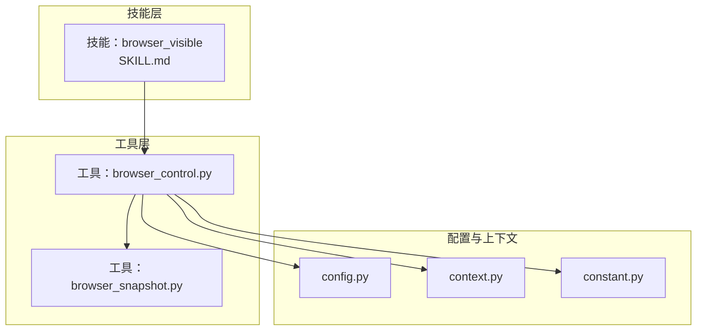
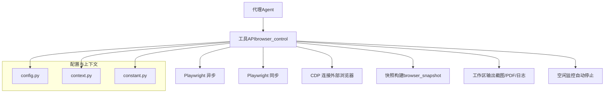
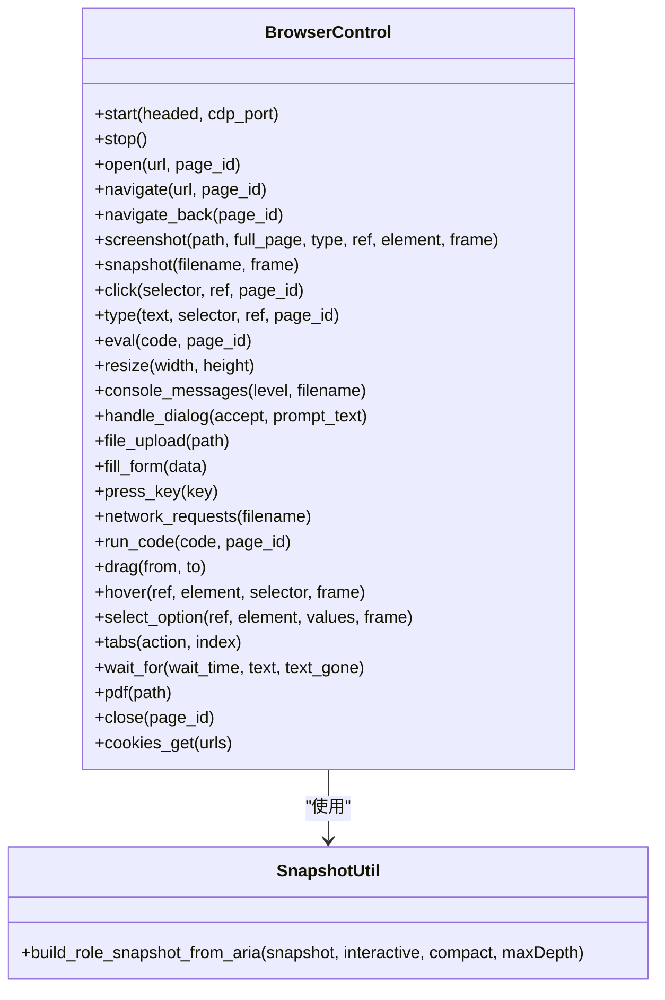
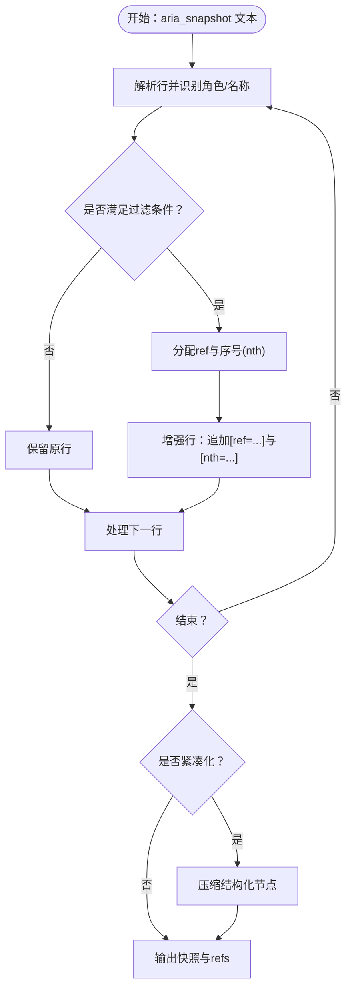
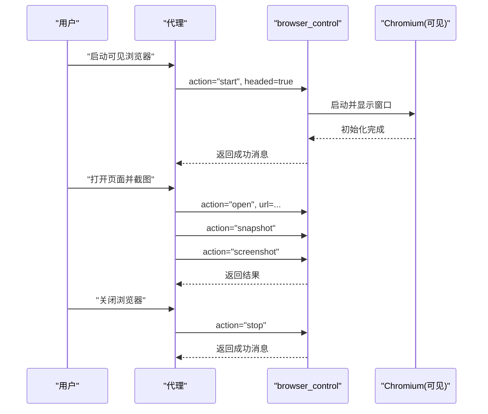
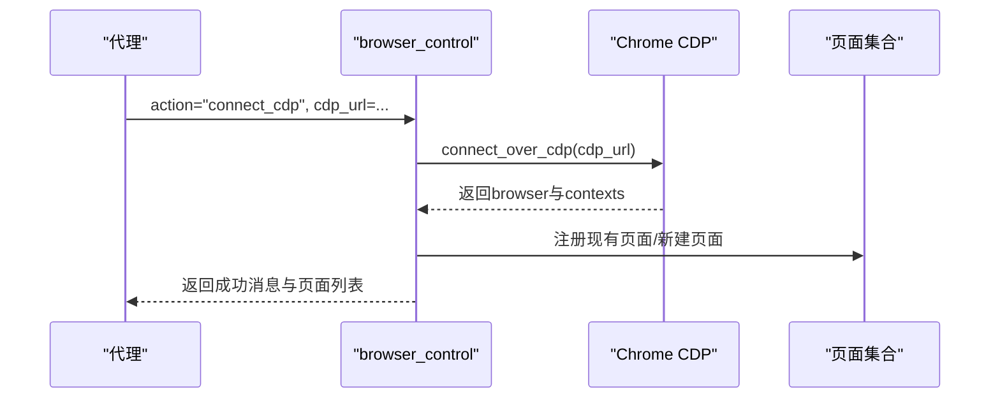
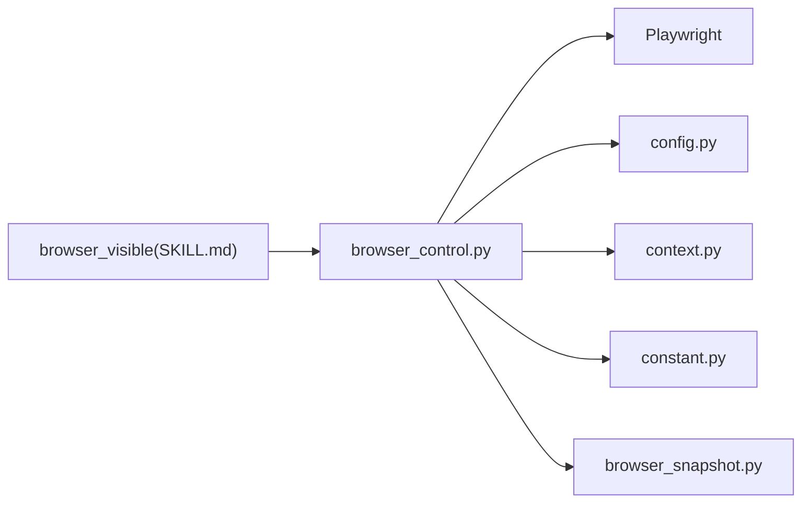

# 浏览器自动化技能

<cite>
**本文引用的文件**
- [browser_control.py](file://src/qwenpaw/agents/tools/browser_control.py)
- [browser_snapshot.py](file://src/qwenpaw/agents/tools/browser_snapshot.py)
- [SKILL.md（可见浏览器）](file://src/qwenpaw/agents/skills/browser_visible/SKILL.md)
- [config.py](file://src/qwenpaw/config/config.py)
- [context.py](file://src/qwenpaw/config/context.py)
- [constant.py](file://src/qwenpaw/constant.py)
- [__init__.py（tools）](file://src/qwenpaw/agents/tools/__init__.py)
- [__init__.py（skills）](file://src/qwenpaw/agents/skills/__init__.py)
- [README.md（项目根）](file://README.md)
</cite>

## 目录
1. [简介](#简介)
2. [项目结构](#项目结构)
3. [核心组件](#核心组件)
4. [架构总览](#架构总览)
5. [详细组件分析](#详细组件分析)
6. [依赖关系分析](#依赖关系分析)
7. [性能考量](#性能考量)
8. [故障排除指南](#故障排除指南)
9. [结论](#结论)
10. [附录](#附录)

## 简介
本文件面向在QwenPaw中集成与使用浏览器自动化技能的开发者与使用者，系统性阐述以下内容：
- CDP（Chrome DevTools Protocol）与“可见浏览器”两种自动化方式的实现原理、技术差异与适用场景
- 浏览器控制工具的API接口定义与行为规范（页面导航、元素操作、截图、PDF导出、标签页管理、等待与对话框处理等）
- 浏览器快照（Snapshot）的构建机制、引用体系与应用场景
- 在代理（Agent）中集成与使用这些技能的具体流程与最佳实践
- 安全考虑、性能优化与错误处理策略
- 兼容性说明与常见问题排查

## 项目结构
浏览器自动化技能由“工具层”和“技能层”共同构成：
- 工具层：提供统一的浏览器控制API与状态管理，封装Playwright异步/同步调用、上下文监听、空闲回收、CDP连接等
- 技能层：以技能形式对外暴露可被代理调用的语义化动作，如“可见浏览器”技能

图表来源
- [browser_control.py:1-120](file://src/qwenpaw/agents/tools/browser_control.py#L1-L120)
- [browser_snapshot.py:1-60](file://src/qwenpaw/agents/tools/browser_snapshot.py#L1-L60)
- [SKILL.md（可见浏览器）:1-50](file://src/qwenpaw/agents/skills/browser_visible/SKILL.md#L1-L50)

章节来源
- [browser_control.py:1-120](file://src/qwenpaw/agents/tools/browser_control.py#L1-L120)
- [browser_snapshot.py:1-60](file://src/qwenpaw/agents/tools/browser_snapshot.py#L1-L60)
- [SKILL.md（可见浏览器）:1-50](file://src/qwenpaw/agents/skills/browser_visible/SKILL.md#L1-L50)

## 核心组件
- 浏览器控制工具（browser_control.py）
  - 统一的action式API：start、stop、open、navigate、navigate_back、screenshot/take_screenshot、snapshot、click、type、eval/evaluate、resize、console_messages、handle_dialog、file_upload、fill_form、press_key、network_requests、run_code、drag、hover、select_option、tabs、wait_for、pdf、close、cookies_get等
  - 状态管理：工作区隔离、页面集合、引用映射、控制台日志、网络请求、待处理对话框与文件选择器
  - 多模式支持：异步Playwright（标准）、同步Playwright（Windows热重载兼容）、CDP连接（外部浏览器）
  - 空闲回收：后台定时清理长时间不活动的浏览器实例
- 快照工具（browser_snapshot.py）
  - 基于Playwright aria_snapshot输出，提取交互元素与内容节点，生成带ref/nth标记的结构化快照
  - 支持交互过滤、紧凑化、最大深度限制
- 技能（browser_visible）
  - 提供“可见浏览器”语义化入口，强调以headed模式启动浏览器，便于演示与调试

章节来源
- [browser_control.py:309-3487](file://src/qwenpaw/agents/tools/browser_control.py#L309-L3487)
- [browser_snapshot.py:185-249](file://src/qwenpaw/agents/tools/browser_snapshot.py#L185-L249)
- [SKILL.md（可见浏览器）:1-50](file://src/qwenpaw/agents/skills/browser_visible/SKILL.md#L1-L50)

## 架构总览
浏览器自动化在QwenPaw中的整体架构如下：

图表来源
- [browser_control.py:493-617](file://src/qwenpaw/agents/tools/browser_control.py#L493-L617)
- [browser_snapshot.py:185-249](file://src/qwenpaw/agents/tools/browser_snapshot.py#L185-L249)

## 详细组件分析

### 组件A：浏览器控制工具（browser_control）
- 设计要点
  - 动作路由：根据action参数分派至具体处理函数，集中返回ToolResponse
  - 多模式启动：优先使用系统默认浏览器（若可用），否则回退到Playwright自带Chromium；macOS在无Chromium时回退WebKit
  - 持久化上下文：在有工作区目录时启用持久化用户数据目录，提升会话连续性
  - 监听器注册：为每个页面绑定console、request/response、dialog、filechooser事件，统一收集日志与请求
  - 空闲回收：后台任务定期检查最后活动时间，超时则停止浏览器释放资源
  - CDP连接：支持连接到已存在的Chrome实例，复用现有页面与上下文
- 数据结构与复杂度
  - 页面字典：O(1)访问；标签页新增通过事件回调注册
  - 引用映射：基于角色与名称的计数器，ref唯一且nth去冗余，构建与查询均为O(1)
  - 日志与请求列表：线性增长，受页面生命周期影响
- 错误处理
  - 启动失败记录_last_browser_error，用于后续提示
  - CDP连接断开时要求显式reconnect
  - 端口占用检测，避免冲突
- 性能优化
  - Windows热重载模式下使用同步Playwright线程池，规避子进程创建异常
  - 容器/Windows平台自动添加必要启动参数，减少渲染问题
  - 空闲回收降低资源泄漏风险

图表来源
- [browser_control.py:3192-3349](file://src/qwenpaw/agents/tools/browser_control.py#L3192-L3349)
- [browser_snapshot.py:185-249](file://src/qwenpaw/agents/tools/browser_snapshot.py#L185-L249)

章节来源
- [browser_control.py:493-617](file://src/qwenpaw/agents/tools/browser_control.py#L493-L617)
- [browser_control.py:642-800](file://src/qwenpaw/agents/tools/browser_control.py#L642-L800)
- [browser_control.py:2927-2975](file://src/qwenpaw/agents/tools/browser_control.py#L2927-L2975)
- [browser_control.py:3192-3349](file://src/qwenpaw/agents/tools/browser_control.py#L3192-L3349)

### 组件B：浏览器快照（browser_snapshot）
- 实现原理
  - 输入：Playwright的aria_snapshot文本输出
  - 输出：增强后的树形快照文本 + 引用映射（ref -> {role, name, nth}）
  - 规则：
    - 交互元素（按钮、链接、输入框等）与带名称的内容元素生成ref
    - 同角色同名元素自动编号（nth），非重复项去除多余nth
    - 支持仅交互元素视图、紧凑化（省略无名称结构元素）、最大深度限制
- 应用场景
  - 以ref驱动的元素定位与操作，提高稳定性
  - 生成可读性强的页面结构描述，辅助推理与可视化
  - 与CDP连接模式配合，快速复用现有页面上下文

图表来源
- [browser_snapshot.py:135-249](file://src/qwenpaw/agents/tools/browser_snapshot.py#L135-L249)

章节来源
- [browser_snapshot.py:185-249](file://src/qwenpaw/agents/tools/browser_snapshot.py#L185-L249)

### 组件C：可见浏览器技能（browser_visible）
- 使用场景
  - 需要真实窗口观察页面加载、交互过程
  - 登录、验证码等需人工参与的流程
  - 演示、教学与调试
- 使用方式
  - 先以headed=true启动浏览器
  - 再执行open/snapshot/click等常规动作
  - 结束时调用stop关闭窗口

图表来源
- [SKILL.md（可见浏览器）:21-50](file://src/qwenpaw/agents/skills/browser_visible/SKILL.md#L21-L50)
- [browser_control.py:3192-3349](file://src/qwenpaw/agents/tools/browser_control.py#L3192-L3349)

章节来源
- [SKILL.md（可见浏览器）:1-50](file://src/qwenpaw/agents/skills/browser_visible/SKILL.md#L1-L50)

### 组件D：CDP连接与外部浏览器集成
- 连接流程
  - 通过connect_over_cdp建立到本地Chrome的连接
  - 注册现有页面为可操作对象，若无页面则新建
  - 标记connected_via_cdp，禁用自动重启，断连需手动reconnect
- 适用场景
  - 复用已有浏览器实例（如开发者工具已打开）
  - 与外部CI/远程桌面环境协作
- 端口占用与冲突
  - 启动前检查端口占用，避免冲突

图表来源
- [browser_control.py:2927-2975](file://src/qwenpaw/agents/tools/browser_control.py#L2927-L2975)
- [browser_control.py:695-714](file://src/qwenpaw/agents/tools/browser_control.py#L695-L714)

章节来源
- [browser_control.py:2927-2975](file://src/qwenpaw/agents/tools/browser_control.py#L2927-L2975)
- [browser_control.py:695-714](file://src/qwenpaw/agents/tools/browser_control.py#L695-L714)

## 依赖关系分析
- 工具层依赖
  - Playwright（异步/同步）：提供浏览器、上下文、页面、定位器与事件模型
  - 配置模块：读取系统默认浏览器路径、容器环境判断、工作区目录
  - 上下文与常量：工作区路径、工作目录、环境变量加载
- 技能层依赖
  - 通过工具API暴露统一动作，屏蔽底层差异

图表来源
- [browser_control.py:262-290](file://src/qwenpaw/agents/tools/browser_control.py#L262-L290)
- [browser_control.py:26-32](file://src/qwenpaw/agents/tools/browser_control.py#L26-L32)
- [config.py](file://src/qwenpaw/config/config.py)
- [context.py](file://src/qwenpaw/config/context.py)
- [constant.py](file://src/qwenpaw/constant.py)

章节来源
- [browser_control.py:262-290](file://src/qwenpaw/agents/tools/browser_control.py#L262-L290)
- [browser_control.py:26-32](file://src/qwenpaw/agents/tools/browser_control.py#L26-L32)

## 性能考量
- 平台与模式
  - Windows热重载模式强制使用同步Playwright线程池，避免子进程异常
  - 容器/Windows自动添加启动参数，减少渲染卡顿与崩溃
- 资源回收
  - 空闲监控每分钟检查一次，超过阈值自动停止浏览器，释放渲染进程
- I/O与输出
  - 输出路径统一解析到工作区下的browser目录，避免跨目录权限问题
- 并发与阻塞
  - 在异步模式下尽量使用异步API；必要时通过线程池执行同步调用

章节来源
- [browser_control.py:48-80](file://src/qwenpaw/agents/tools/browser_control.py#L48-L80)
- [browser_control.py:235-246](file://src/qwenpaw/agents/tools/browser_control.py#L235-L246)
- [browser_control.py:174-199](file://src/qwenpaw/agents/tools/browser_control.py#L174-L199)
- [browser_control.py:39-45](file://src/qwenpaw/agents/tools/browser_control.py#L39-L45)

## 故障排除指南
- Playwright未安装
  - 现象：导入失败并抛出异常
  - 处理：按照提示安装Playwright并执行浏览器安装脚本
- 端口占用（CDP）
  - 现象：启动时检测到端口被占用
  - 处理：更换cdp_port或停止占用进程
- CDP连接断开
  - 现象：连接丢失，提示需reconnect
  - 处理：调用connect_cdp重新建立连接
- 启动失败
  - 现象：记录_last_browser_error，后续动作失败
  - 处理：查看错误信息，确认环境、权限与依赖
- 可见浏览器不可用
  - 现象：服务器无图形环境
  - 处理：使用无头模式或在具备图形的环境中部署

章节来源
- [browser_control.py:262-290](file://src/qwenpaw/agents/tools/browser_control.py#L262-L290)
- [browser_control.py:695-714](file://src/qwenpaw/agents/tools/browser_control.py#L695-L714)
- [browser_control.py:497-508](file://src/qwenpaw/agents/tools/browser_control.py#L497-L508)
- [browser_control.py:614-616](file://src/qwenpaw/agents/tools/browser_control.py#L614-L616)
- [SKILL.md（可见浏览器）:46-50](file://src/qwenpaw/agents/skills/browser_visible/SKILL.md#L46-L50)

## 结论
QwenPaw的浏览器自动化技能以工具层为核心，提供统一的API与稳健的状态管理；快照工具增强了可读性与稳定性；技能层则以语义化方式对外暴露能力。CDP与可见浏览器两种模式覆盖了从自动化到演示调试的广泛场景。通过合理的配置、资源回收与错误处理，可在多平台环境下稳定运行。

## 附录

### API接口一览（节选）
- 启动/停止
  - start：headed可选，cdp_port可选
  - stop：关闭浏览器与上下文
- 导航与页面
  - open：打开URL
  - navigate/navigate_back：跳转与后退
  - close：关闭指定页面
- 截图与PDF
  - screenshot/take_screenshot：保存截图，支持full_page与类型
  - pdf：导出PDF
- 快照与元素操作
  - snapshot：生成结构化快照
  - click/type/eval/evaluate/run_code：元素交互与脚本执行
  - hover/drag/select_option/press_key：高级交互
  - fill_form：批量填充表单
- 辅助能力
  - resize：调整视口尺寸
  - console_messages/network_requests：导出日志与请求
  - handle_dialog：处理弹窗（确认/取消/输入）
  - file_upload：上传文件
  - tabs：标签页管理
  - wait_for：等待文本出现/消失
  - cookies_get：获取Cookie
- CDP相关
  - connect_cdp：连接外部Chrome实例
  - list_cdp_targets：列举可用目标

章节来源
- [browser_control.py:3192-3349](file://src/qwenpaw/agents/tools/browser_control.py#L3192-L3349)

### 在代理中集成与使用建议
- 明确模式
  - 自动化优先：使用默认无头模式
  - 演示/调试：使用browser_visible技能，headed=true
- 生命周期管理
  - 在任务开始时start，在任务结束时stop
  - 避免长时悬挂页面导致资源累积
- 输出归档
  - 统一使用工作区browser目录保存截图、PDF与日志
- 错误兜底
  - 捕获ToolResponse中的错误字段，必要时重试或降级

章节来源
- [SKILL.md（可见浏览器）:21-50](file://src/qwenpaw/agents/skills/browser_visible/SKILL.md#L21-L50)
- [browser_control.py:39-45](file://src/qwenpaw/agents/tools/browser_control.py#L39-L45)