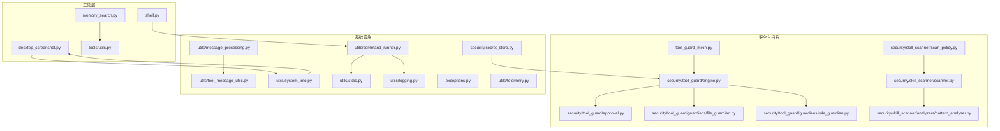
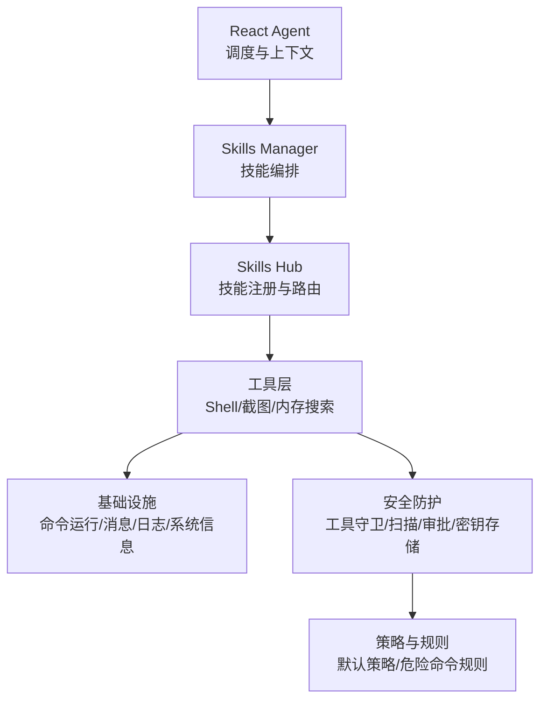
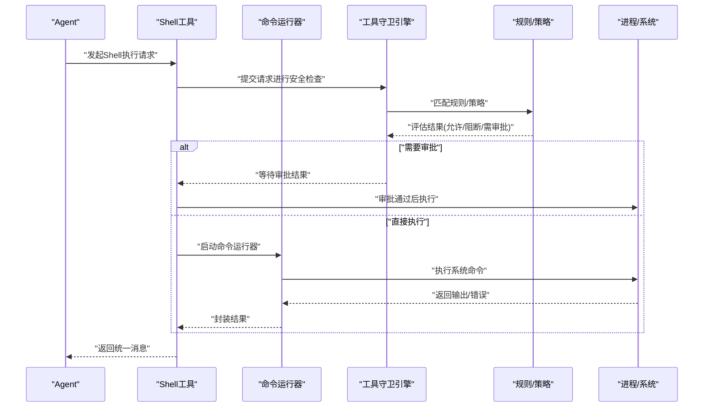
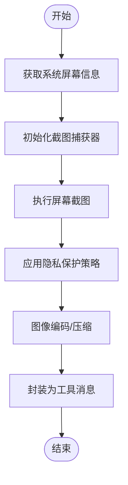
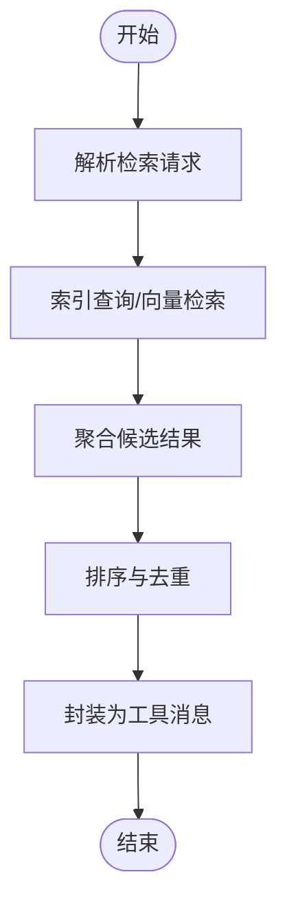
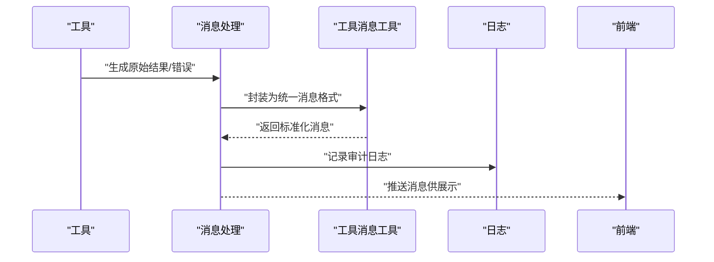
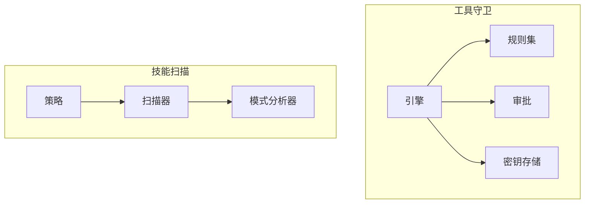
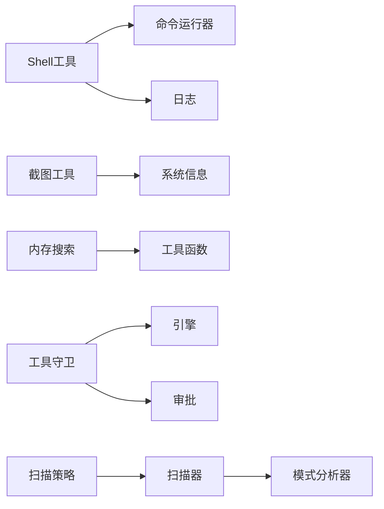

# 系统工具技能

<cite>
**本文引用的文件**
- [shell.py](file://src/qwenpaw/agents/tools/shell.py)
- [desktop_screenshot.py](file://src/qwenpaw/agents/tools/desktop_screenshot.py)
- [memory_search.py](file://src/qwenpaw/agents/tools/memory_search.py)
- [utils.py](file://src/qwenpaw/agents/tools/utils.py)
- [tool_guard_mixin.py](file://src/qwenpaw/tool_guard_mixin.py)
- [dangerous_shell_commands.yaml](file://src/qwenpaw/security/tool_guard/rules/dangerous_shell_commands.yaml)
- [command_runner.py](file://src/qwenpaw/utils/command_runner.py)
- [message_processing.py](file://src/qwenpaw/utils/message_processing.py)
- [tool_message_utils.py](file://src/qwenpaw/utils/tool_message_utils.py)
- [system_info.py](file://src/qwenpaw/utils/system_info.py)
- [stdio.py](file://src/qwenpaw/utils/stdio.py)
- [logging.py](file://src/qwenpaw/utils/logging.py)
- [exceptions.py](file://src/qwenpaw/exceptions.py)
- [security.py](file://src/qwenpaw/security/__init__.py)
- [engine.py](file://src/qwenpaw/security/tool_guard/engine.py)
- [approval.py](file://src/qwenpaw/security/tool_guard/approval.py)
- [file_guardian.py](file://src/qwenpaw/security/tool_guard/guardians/file_guardian.py)
- [rule_guardian.py](file://src/qwenpaw/security/tool_guard/guardians/rule_guardian.py)
- [scan_policy.py](file://src/qwenpaw/security/skill_scanner/scan_policy.py)
- [scanner.py](file://src/qwenpaw/security/skill_scanner/scanner.py)
- [pattern_analyzer.py](file://src/qwenpaw/security/skill_scanner/analyzers/pattern_analyzer.py)
- [default_policy.yaml](file://src/qwenpaw/security/skill_scanner/data/default_policy.yaml)
- [browser_control.py](file://src/qwenpaw/agents/tools/browser_control.py)
- [browser_snapshot.py](file://src/qwenpaw/agents/tools/browser_snapshot.py)
- [file_io.py](file://src/qwenpaw/agents/tools/file_io.py)
- [file_search.py](file://src/qwenpaw/agents/tools/file_search.py)
- [send_file.py](file://src/qwenpaw/agents/tools/send_file.py)
- [view_media.py](file://src/qwenpaw/agents/tools/view_media.py)
- [get_current_time.py](file://src/qwenpaw/agents/tools/get_current_time.py)
- [get_token_usage.py](file://src/qwenpaw/agents/tools/get_token_usage.py)
- [react_agent.py](file://src/qwenpaw/react_agent.py)
- [skills_manager.py](file://src/qwenpaw/skills_manager.py)
- [skills_hub.py](file://src/qwenpaw/skills_hub.py)
- [command_handler.py](file://src/qwenpaw/command_handler.py)
- [agent_context.py](file://src/qwenpaw/agent_context.py)
- [model_factory.py](file://src/qwenpaw/model_factory.py)
- [schema.py](file://src/qwenpaw/schema.py)
- [routing_chat_model.py](file://src/qwenpaw/routing_chat_model.py)
- [prompt.py](file://src/qwenpaw/prompt.py)
- [telemetry.py](file://src/qwenpaw/utils/telemetry.py)
- [secret_store.py](file://src/qwenpaw/security/secret_store.py)
</cite>

## 目录
1. [简介](#简介)
2. [项目结构](#项目结构)
3. [核心组件](#核心组件)
4. [架构总览](#架构总览)
5. [详细组件分析](#详细组件分析)
6. [依赖关系分析](#依赖关系分析)
7. [性能考量](#性能考量)
8. [故障排查指南](#故障排查指南)
9. [结论](#结论)
10. [附录](#附录)

## 简介
本文件面向QwenPaw系统的“系统工具技能”，聚焦三类关键能力：Shell命令执行、桌面截图与内存搜索。文档从实现原理、安全机制、数据流与处理逻辑、依赖关系、性能优化、兼容性与异常恢复、以及最佳实践与风险防范等方面进行系统化技术说明，并通过图示帮助读者快速建立对代码结构与运行流程的理解。

## 项目结构
系统工具技能位于后端Python模块src/qwenpaw/agents/tools下，围绕Shell执行、桌面截图、内存搜索三大工具展开；同时配合安全防护（工具守卫）、消息处理与日志记录、系统信息采集等基础设施模块协同工作。

图表来源
- [shell.py](file://src/qwenpaw/agents/tools/shell.py)
- [desktop_screenshot.py](file://src/qwenpaw/agents/tools/desktop_screenshot.py)
- [memory_search.py](file://src/qwenpaw/agents/tools/memory_search.py)
- [utils.py](file://src/qwenpaw/agents/tools/utils.py)
- [tool_guard_mixin.py](file://src/qwenpaw/tool_guard_mixin.py)
- [engine.py](file://src/qwenpaw/security/tool_guard/engine.py)
- [approval.py](file://src/qwenpaw/security/tool_guard/approval.py)
- [file_guardian.py](file://src/qwenpaw/security/tool_guard/guardians/file_guardian.py)
- [rule_guardian.py](file://src/qwenpaw/security/tool_guard/guardians/rule_guardian.py)
- [scan_policy.py](file://src/qwenpaw/security/skill_scanner/scan_policy.py)
- [scanner.py](file://src/qwenpaw/security/skill_scanner/scanner.py)
- [pattern_analyzer.py](file://src/qwenpaw/security/skill_scanner/analyzers/pattern_analyzer.py)
- [command_runner.py](file://src/qwenpaw/utils/command_runner.py)
- [message_processing.py](file://src/qwenpaw/utils/message_processing.py)
- [tool_message_utils.py](file://src/qwenpaw/utils/tool_message_utils.py)
- [system_info.py](file://src/qwenpaw/utils/system_info.py)
- [stdio.py](file://src/qwenpaw/utils/stdio.py)
- [logging.py](file://src/qwenpaw/utils/logging.py)
- [exceptions.py](file://src/qwenpaw/exceptions.py)
- [secret_store.py](file://src/qwenpaw/security/secret_store.py)

章节来源
- [shell.py](file://src/qwenpaw/agents/tools/shell.py)
- [desktop_screenshot.py](file://src/qwenpaw/agents/tools/desktop_screenshot.py)
- [memory_search.py](file://src/qwenpaw/agents/tools/memory_search.py)
- [utils.py](file://src/qwenpaw/agents/tools/utils.py)
- [command_runner.py](file://src/qwenpaw/utils/command_runner.py)
- [system_info.py](file://src/qwenpaw/utils/system_info.py)
- [message_processing.py](file://src/qwenpaw/utils/message_processing.py)
- [tool_message_utils.py](file://src/qwenpaw/utils/tool_message_utils.py)
- [tool_guard_mixin.py](file://src/qwenpaw/tool_guard_mixin.py)
- [engine.py](file://src/qwenpaw/security/tool_guard/engine.py)
- [approval.py](file://src/qwenpaw/security/tool_guard/approval.py)
- [file_guardian.py](file://src/qwenpaw/security/tool_guard/guardians/file_guardian.py)
- [rule_guardian.py](file://src/qwenpaw/security/tool_guard/guardians/rule_guardian.py)
- [scan_policy.py](file://src/qwenpaw/security/skill_scanner/scan_policy.py)
- [scanner.py](file://src/qwenpaw/security/skill_scanner/scanner.py)
- [pattern_analyzer.py](file://src/qwenpaw/security/skill_scanner/analyzers/pattern_analyzer.py)
- [secret_store.py](file://src/qwenpaw/security/secret_store.py)

## 核心组件
- Shell命令执行：封装命令运行器、标准输入输出处理、日志与异常管理，支持在受控环境中执行系统命令并返回结果。
- 桌面截图：基于系统信息采集与平台适配，完成屏幕捕获、图像处理与隐私保护（如遮蔽敏感区域）。
- 内存搜索：面向内存数据检索的算法与索引机制，结合工具消息处理与错误报告，保障查询稳定性与可追踪性。
- 工具消息处理：统一的工具调用消息格式与错误报告机制，便于前端展示与用户反馈。
- 安全与合规：工具守卫引擎、规则与策略扫描、审批流程与敏感信息存储，形成多层防护。

章节来源
- [shell.py](file://src/qwenpaw/agents/tools/shell.py)
- [desktop_screenshot.py](file://src/qwenpaw/agents/tools/desktop_screenshot.py)
- [memory_search.py](file://src/qwenpaw/agents/tools/memory_search.py)
- [utils.py](file://src/qwenpaw/agents/tools/utils.py)
- [command_runner.py](file://src/qwenpaw/utils/command_runner.py)
- [system_info.py](file://src/qwenpaw/utils/system_info.py)
- [message_processing.py](file://src/qwenpaw/utils/message_processing.py)
- [tool_message_utils.py](file://src/qwenpaw/utils/tool_message_utils.py)
- [tool_guard_mixin.py](file://src/qwenpaw/tool_guard_mixin.py)
- [engine.py](file://src/qwenpaw/security/tool_guard/engine.py)
- [approval.py](file://src/qwenpaw/security/tool_guard/approval.py)
- [secret_store.py](file://src/qwenpaw/security/secret_store.py)

## 架构总览
系统工具技能采用“工具实现 + 基础设施 + 安全防护”的分层设计。工具层负责具体能力实现；基础设施层提供运行时支撑（命令执行、消息处理、日志、系统信息等）；安全层通过工具守卫与技能扫描构建合规与风险控制闭环。

图表来源
- [react_agent.py](file://src/qwenpaw/react_agent.py)
- [skills_manager.py](file://src/qwenpaw/skills_manager.py)
- [skills_hub.py](file://src/qwenpaw/skills_hub.py)
- [shell.py](file://src/qwenpaw/agents/tools/shell.py)
- [desktop_screenshot.py](file://src/qwenpaw/agents/tools/desktop_screenshot.py)
- [memory_search.py](file://src/qwenpaw/agents/tools/memory_search.py)
- [command_runner.py](file://src/qwenpaw/utils/command_runner.py)
- [message_processing.py](file://src/qwenpaw/utils/message_processing.py)
- [logging.py](file://src/qwenpaw/utils/logging.py)
- [system_info.py](file://src/qwenpaw/utils/system_info.py)
- [tool_guard_mixin.py](file://src/qwenpaw/tool_guard_mixin.py)
- [engine.py](file://src/qwenpaw/security/tool_guard/engine.py)
- [scan_policy.py](file://src/qwenpaw/security/skill_scanner/scan_policy.py)
- [default_policy.yaml](file://src/qwenpaw/security/skill_scanner/data/default_policy.yaml)
- [dangerous_shell_commands.yaml](file://src/qwenpaw/security/tool_guard/rules/dangerous_shell_commands.yaml)
- [secret_store.py](file://src/qwenpaw/security/secret_store.py)

## 详细组件分析

### Shell命令执行
- 实现要点
  - 命令运行器：封装进程启动、超时控制、标准输入输出捕获与编码处理，确保跨平台一致性。
  - 日志与异常：统一记录命令执行过程与错误信息，便于审计与问题定位。
  - 错误报告：标准化错误响应格式，便于上层工具消息处理与前端展示。
- 安全机制
  - 工具守卫混合：通过工具守卫混入类集成到工具调用链路，实现规则匹配与审批流程。
  - 危险命令规则：内置规则集用于识别高危命令模式，触发阻断或审批。
  - 审批流程：对高风险命令请求进行人工或自动审批，降低误用风险。
- 数据流与处理逻辑
  - 输入参数校验 → 规则匹配与风险评估 → 可选审批 → 执行命令 → 输出结果与错误码 → 统一消息封装 → 返回调用方。
- 性能与兼容性
  - 超时与资源限制：避免长时间阻塞与资源耗尽。
  - 平台差异：通过系统信息模块适配不同操作系统行为。
- 最佳实践
  - 明确命令白名单与最小权限原则；对用户输入进行严格过滤与转义。
  - 使用沙箱或容器化执行环境进一步隔离风险。
  - 记录完整审计日志，保留可追溯性。

图表来源
- [shell.py](file://src/qwenpaw/agents/tools/shell.py)
- [command_runner.py](file://src/qwenpaw/utils/command_runner.py)
- [tool_guard_mixin.py](file://src/qwenpaw/tool_guard_mixin.py)
- [engine.py](file://src/qwenpaw/security/tool_guard/engine.py)
- [approval.py](file://src/qwenpaw/security/tool_guard/approval.py)
- [dangerous_shell_commands.yaml](file://src/qwenpaw/security/tool_guard/rules/dangerous_shell_commands.yaml)

章节来源
- [shell.py](file://src/qwenpaw/agents/tools/shell.py)
- [command_runner.py](file://src/qwenpaw/utils/command_runner.py)
- [tool_guard_mixin.py](file://src/qwenpaw/tool_guard_mixin.py)
- [engine.py](file://src/qwenpaw/security/tool_guard/engine.py)
- [approval.py](file://src/qwenpaw/security/tool_guard/approval.py)
- [dangerous_shell_commands.yaml](file://src/qwenpaw/security/tool_guard/rules/dangerous_shell_commands.yaml)

### 桌面截图
- 实现要点
  - 屏幕捕获：基于系统信息模块获取屏幕尺寸、DPI等参数，适配不同分辨率与缩放比例。
  - 图像处理：对截取图像进行压缩、格式转换与尺寸调整，平衡质量与体积。
  - 隐私保护：对敏感区域进行遮蔽或模糊处理，防止个人信息泄露。
- 数据流与处理逻辑
  - 获取屏幕参数 → 初始化捕获器 → 执行截图 → 应用隐私策略 → 编码与输出 → 统一消息封装。
- 性能与兼容性
  - 多显示器支持与焦点窗口选择；在高负载场景下控制帧率与分辨率。
  - 跨平台适配：针对Windows、macOS、Linux的差异进行行为收敛。
- 最佳实践
  - 仅在必要时进行截图，避免频繁捕获；对输出结果进行最小化暴露。
  - 结合访问控制与审计日志，确保使用合规。

图表来源
- [desktop_screenshot.py](file://src/qwenpaw/agents/tools/desktop_screenshot.py)
- [system_info.py](file://src/qwenpaw/utils/system_info.py)

章节来源
- [desktop_screenshot.py](file://src/qwenpaw/agents/tools/desktop_screenshot.py)
- [system_info.py](file://src/qwenpaw/utils/system_info.py)

### 内存搜索
- 实现要点
  - 数据检索算法：基于关键词/正则表达式/语义相似度等策略进行内存数据检索。
  - 索引机制：对常用检索字段建立倒排索引或向量索引，提升查询效率。
  - 结果排序与去重：根据相关性与时间戳进行排序，去除重复项。
- 数据流与处理逻辑
  - 输入解析 → 索引查询 → 结果聚合 → 排序与去重 → 统一消息封装 → 返回调用方。
- 性能优化
  - 分页与限流：避免一次性返回过多结果；对高频查询进行速率限制。
  - 缓存热点：对热门查询结果进行缓存，减少重复计算。
  - 异步处理：长耗时查询采用异步队列，避免阻塞主线程。
- 最佳实践
  - 对检索词进行预处理（大小写归一、标点清理、停用词过滤）。
  - 提供多种检索模式（精确/模糊/正则），满足不同场景需求。

图表来源
- [memory_search.py](file://src/qwenpaw/agents/tools/memory_search.py)
- [utils.py](file://src/qwenpaw/agents/tools/utils.py)

章节来源
- [memory_search.py](file://src/qwenpaw/agents/tools/memory_search.py)
- [utils.py](file://src/qwenpaw/agents/tools/utils.py)

### 工具消息处理与错误报告
- 统一接口
  - 工具消息格式：定义一致的消息结构（包含工具名、参数、状态、结果/错误等字段），便于前端渲染与用户理解。
  - 错误报告：标准化错误类型与错误码，提供可读性强的错误描述与建议修复步骤。
- 错误处理策略
  - 本地化错误：在工具内部捕获并转换为统一错误消息。
  - 上抛与回滚：对不可恢复错误进行回滚与清理，保证系统状态一致。
  - 重试与降级：对瞬时性错误进行有限次数重试，必要时降级为近似结果。
- 可观测性
  - 日志记录：关键路径打点，包含时间戳、工具名、参数摘要、耗时与状态。
  - 遥测指标：统计成功率、耗时分布、错误分类，辅助容量规划与问题定位。

图表来源
- [message_processing.py](file://src/qwenpaw/utils/message_processing.py)
- [tool_message_utils.py](file://src/qwenpaw/utils/tool_message_utils.py)
- [logging.py](file://src/qwenpaw/utils/logging.py)

章节来源
- [message_processing.py](file://src/qwenpaw/utils/message_processing.py)
- [tool_message_utils.py](file://src/qwenpaw/utils/tool_message_utils.py)
- [logging.py](file://src/qwenpaw/utils/logging.py)

### 安全与合规
- 工具守卫
  - 引擎：综合规则匹配、策略评估与审批流程，决定是否允许工具执行。
  - 规则：内置危险命令规则与自定义规则，覆盖注入、越权、敏感操作等场景。
  - 审批：对高风险请求进行人工或自动审批，形成人机协同的风控体系。
- 技能扫描
  - 策略：加载默认策略与自定义策略，定义扫描范围与优先级。
  - 扫描器：对技能脚本与配置进行静态分析，识别潜在风险模式。
  - 分析器：基于模式分析器提取特征，输出风险评分与处置建议。
- 敏感信息存储
  - 密钥存储：集中管理敏感凭据，提供加密存储与访问控制，避免明文泄露。

图表来源
- [engine.py](file://src/qwenpaw/security/tool_guard/engine.py)
- [approval.py](file://src/qwenpaw/security/tool_guard/approval.py)
- [dangerous_shell_commands.yaml](file://src/qwenpaw/security/tool_guard/rules/dangerous_shell_commands.yaml)
- [secret_store.py](file://src/qwenpaw/security/secret_store.py)
- [scan_policy.py](file://src/qwenpaw/security/skill_scanner/scan_policy.py)
- [scanner.py](file://src/qwenpaw/security/skill_scanner/scanner.py)
- [pattern_analyzer.py](file://src/qwenpaw/security/skill_scanner/analyzers/pattern_analyzer.py)
- [default_policy.yaml](file://src/qwenpaw/security/skill_scanner/data/default_policy.yaml)

章节来源
- [engine.py](file://src/qwenpaw/security/tool_guard/engine.py)
- [approval.py](file://src/qwenpaw/security/tool_guard/approval.py)
- [dangerous_shell_commands.yaml](file://src/qwenpaw/security/tool_guard/rules/dangerous_shell_commands.yaml)
- [secret_store.py](file://src/qwenpaw/security/secret_store.py)
- [scan_policy.py](file://src/qwenpaw/security/skill_scanner/scan_policy.py)
- [scanner.py](file://src/qwenpaw/security/skill_scanner/scanner.py)
- [pattern_analyzer.py](file://src/qwenpaw/security/skill_scanner/analyzers/pattern_analyzer.py)
- [default_policy.yaml](file://src/qwenpaw/security/skill_scanner/data/default_policy.yaml)

## 依赖关系分析
- 工具层与基础设施
  - Shell工具依赖命令运行器、标准输入输出处理与日志记录。
  - 截图工具依赖系统信息模块以适配多平台。
  - 内存搜索工具依赖通用工具函数与消息封装。
- 安全层与工具层
  - 工具守卫与技能扫描贯穿工具调用链，形成前置风控与持续监控。
- 上层编排
  - React Agent通过Skills Manager与Skills Hub进行技能编排与路由，工具作为原子能力被组合使用。

图表来源
- [shell.py](file://src/qwenpaw/agents/tools/shell.py)
- [command_runner.py](file://src/qwenpaw/utils/command_runner.py)
- [logging.py](file://src/qwenpaw/utils/logging.py)
- [desktop_screenshot.py](file://src/qwenpaw/agents/tools/desktop_screenshot.py)
- [system_info.py](file://src/qwenpaw/utils/system_info.py)
- [memory_search.py](file://src/qwenpaw/agents/tools/memory_search.py)
- [utils.py](file://src/qwenpaw/agents/tools/utils.py)
- [tool_guard_mixin.py](file://src/qwenpaw/tool_guard_mixin.py)
- [engine.py](file://src/qwenpaw/security/tool_guard/engine.py)
- [approval.py](file://src/qwenpaw/security/tool_guard/approval.py)
- [scan_policy.py](file://src/qwenpaw/security/skill_scanner/scan_policy.py)
- [scanner.py](file://src/qwenpaw/security/skill_scanner/scanner.py)
- [pattern_analyzer.py](file://src/qwenpaw/security/skill_scanner/analyzers/pattern_analyzer.py)

章节来源
- [shell.py](file://src/qwenpaw/agents/tools/shell.py)
- [command_runner.py](file://src/qwenpaw/utils/command_runner.py)
- [logging.py](file://src/qwenpaw/utils/logging.py)
- [desktop_screenshot.py](file://src/qwenpaw/agents/tools/desktop_screenshot.py)
- [system_info.py](file://src/qwenpaw/utils/system_info.py)
- [memory_search.py](file://src/qwenpaw/agents/tools/memory_search.py)
- [utils.py](file://src/qwenpaw/agents/tools/utils.py)
- [tool_guard_mixin.py](file://src/qwenpaw/tool_guard_mixin.py)
- [engine.py](file://src/qwenpaw/security/tool_guard/engine.py)
- [approval.py](file://src/qwenpaw/security/tool_guard/approval.py)
- [scan_policy.py](file://src/qwenpaw/security/skill_scanner/scan_policy.py)
- [scanner.py](file://src/qwenpaw/security/skill_scanner/scanner.py)
- [pattern_analyzer.py](file://src/qwenpaw/security/skill_scanner/analyzers/pattern_analyzer.py)

## 性能考量
- Shell执行
  - 超时与并发限制：避免长时间阻塞；对并发执行数量进行节流。
  - 输出截断与编码：对大输出进行分片与编码优化，减少内存占用。
- 桌面截图
  - 分辨率与帧率控制：根据场景动态调整，降低CPU/GPU压力。
  - 异步捕获：后台任务执行截图，避免阻塞主线程。
- 内存搜索
  - 索引预热与增量更新：在空闲时段构建索引，查询时只做增量检索。
  - 查询分页与缓存：对热点查询结果进行缓存，减少重复计算。
- 日志与遥测
  - 结构化日志：统一字段与采样策略，降低I/O开销。
  - 指标聚合：按分钟/小时聚合指标，减少上报频率。

## 故障排查指南
- 常见问题
  - Shell执行失败：检查命令是否存在、权限是否足够、环境变量是否正确。
  - 截图无输出：确认屏幕参数获取成功、驱动可用、隐私策略未过度遮蔽。
  - 内存搜索无结果：核对检索词是否命中索引、索引是否已构建、是否有权限访问目标数据。
- 审计与诊断
  - 查看工具消息中的错误码与描述，结合日志定位根因。
  - 启用调试模式，记录更详细的执行轨迹。
- 恢复策略
  - 对可重试错误进行指数退避重试；对不可恢复错误进行降级与提示。
  - 清理临时文件与会话状态，避免资源泄漏。

章节来源
- [exceptions.py](file://src/qwenpaw/exceptions.py)
- [logging.py](file://src/qwenpaw/utils/logging.py)
- [stdio.py](file://src/qwenpaw/utils/stdio.py)
- [telemetry.py](file://src/qwenpaw/utils/telemetry.py)

## 结论
QwenPaw系统工具技能通过清晰的分层设计与完善的安全机制，在提供强大系统级能力的同时，兼顾了安全性、可观测性与可维护性。Shell执行、桌面截图与内存搜索三大能力分别针对不同场景，配合统一的消息处理与错误报告，能够稳定支撑复杂任务编排与自动化流程。

## 附录
- 其他工具参考
  - 浏览器控制与快照、文件读写与搜索、媒体查看、发送文件、当前时间与令牌用量等工具亦可作为扩展能力使用，遵循相同的编排与安全策略。
- 最佳实践清单
  - 严格最小权限原则与命令白名单；
  - 对高风险操作进行审批与审计；
  - 使用缓存与分页优化查询性能；
  - 在跨平台环境下进行充分兼容性测试；
  - 建立完善的日志与遥测体系，持续改进工具稳定性与安全性。