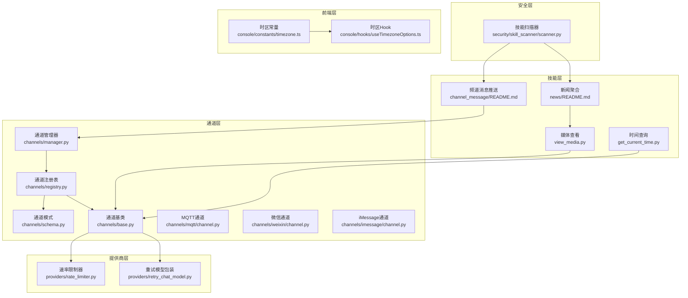
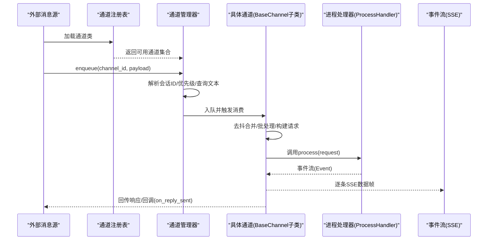
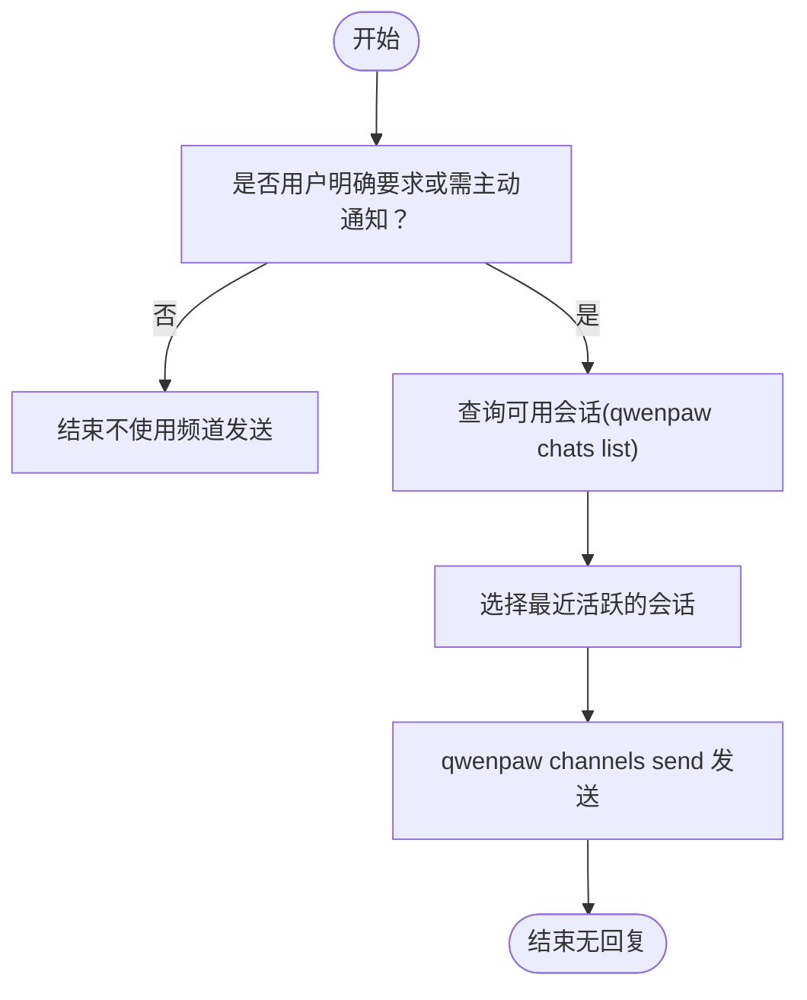
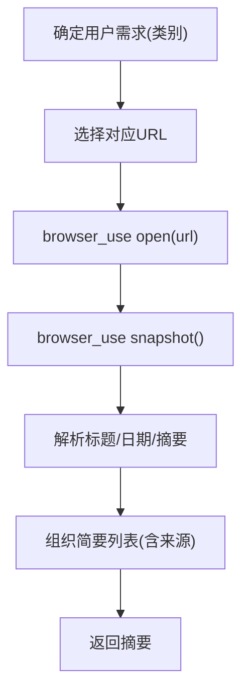
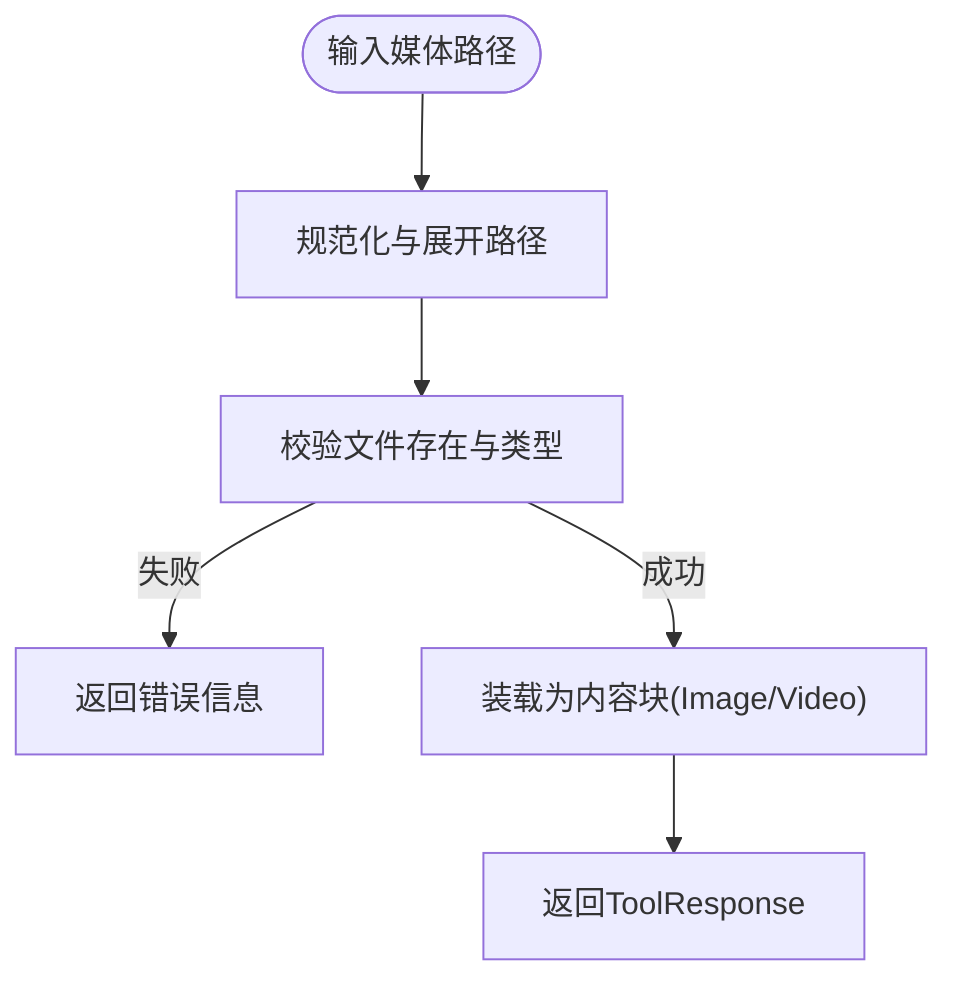
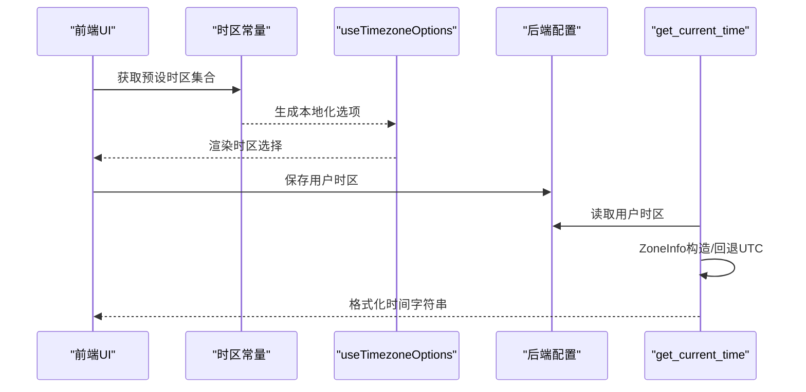
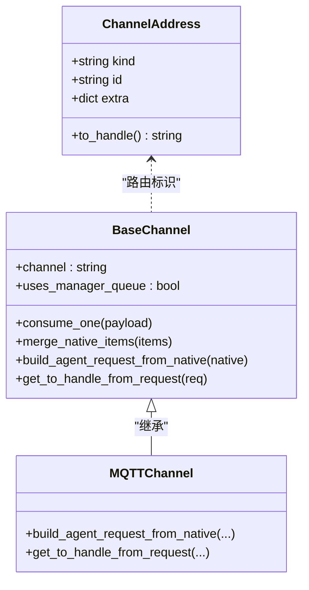
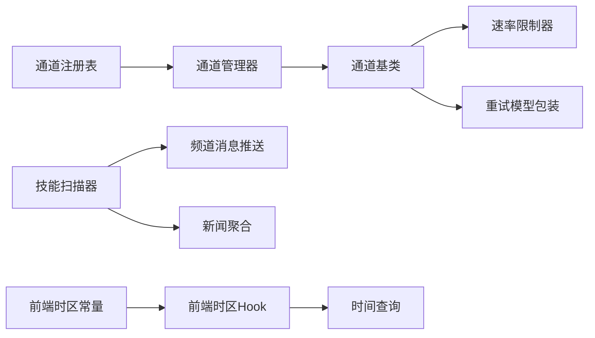

# 通信技能

<cite>
**本文引用的文件**
- [channel_message/README.md](file://src/qwenpaw/agents/skills/channel_message/README.md)
- [news/README.md](file://src/qwenpaw/agents/skills/news/README.md)
- [view_media.py](file://src/qwenpaw/agents/tools/view_media.py)
- [get_current_time.py](file://src/qwenpaw/agents/tools/get_current_time.py)
- [channels/schema.py](file://src/qwenpaw/app/channels/schema.py)
- [channels/base.py](file://src/qwenpaw/app/channels/base.py)
- [channels/manager.py](file://src/qwenpaw/app/channels/manager.py)
- [channels/registry.py](file://src/qwenpaw/app/channels/registry.py)
- [channels/mqtt/channel.py](file://src/qwenpaw/app/channels/mqtt/channel.py)
- [channels/weixin/channel.py](file://src/qwenpaw/app/channels/weixin/channel.py)
- [channels/imessage/channel.py](file://src/qwenpaw/app/channels/imessage/channel.py)
- [providers/rate_limiter.py](file://src/qwenpaw/providers/rate_limiter.py)
- [providers/retry_chat_model.py](file://src/qwenpaw/providers/retry_chat_model.py)
- [security/skill_scanner/scanner.py](file://src/qwenpaw/security/skill_scanner/scanner.py)
- [console/constants/timezone.ts](file://console/src/constants/timezone.ts)
- [console/hooks/useTimezoneOptions.ts](file://console/src/hooks/useTimezoneOptions.ts)
- [config/timezone.py](file://src/qwenpaw/config/timezone.py)
</cite>

## 目录
1. [简介](#简介)
2. [项目结构](#项目结构)
3. [核心组件](#核心组件)
4. [架构总览](#架构总览)
5. [详细组件分析](#详细组件分析)
6. [依赖关系分析](#依赖关系分析)
7. [性能考量](#性能考量)
8. [故障排查指南](#故障排查指南)
9. [结论](#结论)
10. [附录](#附录)

## 简介
本文件面向QwenPaw通信技能系统，围绕“频道消息处理、新闻获取、媒体查看、时间查询”等通信相关能力，系统化梳理消息路由与转发流程、消息格式转换与协议适配、新闻聚合的数据源接入与更新机制、媒体文件的格式支持与播放/下载处理、时间查询的时区处理与精度控制，并补充安全性、速率限制与错误恢复策略以及多平台兼容与协议标准化处理建议。

## 项目结构
通信技能涉及前后端与运行时的多层协作：
- 技能层：频道消息推送、新闻聚合、媒体查看、时间查询等技能与工具
- 通道层：统一的通道抽象与管理器，负责消息路由、去抖合并、队列与并发控制
- 提供商层：速率限制与重试封装，保障对外调用稳定性
- 安全层：技能包扫描与规则引擎，降低注入与滥用风险
- 前端层：时区选项与本地化展示，确保跨语言环境一致体验

图表来源
- [channels/registry.py:1-195](file://src/qwenpaw/app/channels/registry.py#L1-L195)
- [channels/schema.py:1-56](file://src/qwenpaw/app/channels/schema.py#L1-L56)
- [channels/base.py:1-800](file://src/qwenpaw/app/channels/base.py#L1-L800)
- [channels/manager.py:1-711](file://src/qwenpaw/app/channels/manager.py#L1-L711)
- [channels/mqtt/channel.py:438-470](file://src/qwenpaw/app/channels/mqtt/channel.py#L438-L470)
- [channels/weixin/channel.py:647-673](file://src/qwenpaw/app/channels/weixin/channel.py#L647-L673)
- [channels/imessage/channel.py:81-92](file://src/qwenpaw/app/channels/imessage/channel.py#L81-L92)
- [providers/rate_limiter.py:1-279](file://src/qwenpaw/providers/rate_limiter.py#L1-L279)
- [providers/retry_chat_model.py:243-285](file://src/qwenpaw/providers/retry_chat_model.py#L243-L285)
- [security/skill_scanner/scanner.py:1-319](file://src/qwenpaw/security/skill_scanner/scanner.py#L1-L319)
- [console/constants/timezone.ts:1-60](file://console/src/constants/timezone.ts#L1-L60)
- [console/hooks/useTimezoneOptions.ts:1-12](file://console/src/hooks/useTimezoneOptions.ts#L1-L12)

章节来源
- [channels/registry.py:1-195](file://src/qwenpaw/app/channels/registry.py#L1-L195)
- [channels/manager.py:1-711](file://src/qwenpaw/app/channels/manager.py#L1-L711)

## 核心组件
- 通道与消息路由
  - 通道注册表与动态加载，支持内置与自定义通道
  - 统一Schema定义通道类型、路由地址与消息转换协议
  - 通道基类提供消息构建、去抖合并、渲染样式与错误处理
  - 通道管理器负责队列、批处理合并、优先级与并发控制
- 技能与工具
  - 频道消息推送：基于会话查询与单向发送
  - 新闻聚合：浏览器工具打开指定站点、快照提取与摘要
  - 媒体查看：图片/视频文件校验与内容块装载
  - 时间查询：用户时区读取与格式化输出
- 安全与稳定性
  - 技能扫描器：文件发现、规则匹配与结果聚合
  - 速率限制与重试：并发与QPM窗口、全局429冷却与抖动
- 多平台与时区
  - 前端时区选项与本地化展示
  - 后端时区映射与Windows时区探测

章节来源
- [channels/schema.py:1-56](file://src/qwenpaw/app/channels/schema.py#L1-L56)
- [channels/base.py:1-800](file://src/qwenpaw/app/channels/base.py#L1-L800)
- [channels/manager.py:1-711](file://src/qwenpaw/app/channels/manager.py#L1-L711)
- [channel_message/README.md:1-251](file://src/qwenpaw/agents/skills/channel_message/README.md#L1-L251)
- [news/README.md:1-48](file://src/qwenpaw/agents/skills/news/README.md#L1-L48)
- [view_media.py:1-149](file://src/qwenpaw/agents/tools/view_media.py#L1-L149)
- [get_current_time.py:1-48](file://src/qwenpaw/agents/tools/get_current_time.py#L1-L48)
- [security/skill_scanner/scanner.py:1-319](file://src/qwenpaw/security/skill_scanner/scanner.py#L1-L319)
- [providers/rate_limiter.py:1-279](file://src/qwenpaw/providers/rate_limiter.py#L1-L279)
- [providers/retry_chat_model.py:243-285](file://src/qwenpaw/providers/retry_chat_model.py#L243-L285)
- [console/constants/timezone.ts:1-60](file://console/src/constants/timezone.ts#L1-L60)
- [console/hooks/useTimezoneOptions.ts:1-12](file://console/src/hooks/useTimezoneOptions.ts#L1-L12)
- [config/timezone.py:72-105](file://src/qwenpaw/config/timezone.py#L72-L105)

## 架构总览
下图展示从外部消息进入，经由通道管理器与通道基类，最终到达进程处理与事件流输出的完整路径，以及媒体与时间工具的集成点。

图表来源
- [channels/registry.py:1-195](file://src/qwenpaw/app/channels/registry.py#L1-L195)
- [channels/manager.py:1-711](file://src/qwenpaw/app/channels/manager.py#L1-L711)
- [channels/base.py:1-800](file://src/qwenpaw/app/channels/base.py#L1-L800)

## 详细组件分析

### 频道消息处理（单向推送）
- 使用场景
  - 用户明确要求向某频道/会话发送消息
  - 主动通知（任务完成、提醒、告警）
  - 异步结果回推至已有会话
- 工作流
  - 先查询可用会话，再根据user_id与session_id执行单向发送
  - 发送为单向，不等待回复
- 关键规则
  - 必填参数：agent-id、channel、target-user、target-session、text
  - 发送前必须先查询会话；若存在多个会话，优先最近活跃者
- 实现要点
  - 通道管理器将消息入队并按会话与优先级合并
  - 通道基类负责构建AgentRequest、渲染样式与错误回调

图表来源
- [channel_message/README.md:1-251](file://src/qwenpaw/agents/skills/channel_message/README.md#L1-L251)
- [channels/manager.py:1-711](file://src/qwenpaw/app/channels/manager.py#L1-L711)
- [channels/base.py:1-800](file://src/qwenpaw/app/channels/base.py#L1-L800)

章节来源
- [channel_message/README.md:1-251](file://src/qwenpaw/agents/skills/channel_message/README.md#L1-L251)
- [channels/manager.py:1-711](file://src/qwenpaw/app/channels/manager.py#L1-L711)
- [channels/base.py:1-800](file://src/qwenpaw/app/channels/base.py#L1-L800)

### 新闻获取（浏览器工具与聚合）
- 数据源接入
  - 提供权威站点URL清单（政治、经济、社会、世界、科技、体育、娱乐）
- 内容筛选与更新
  - 使用浏览器工具打开页面，快照后提取标题、日期与摘要
  - 多类别访问时需分步open与snapshot，避免混杂内容
- 输出组织
  - 按时间或重要性排序，包含来源链接以便用户进一步阅读

图表来源
- [news/README.md:1-48](file://src/qwenpaw/agents/skills/news/README.md#L1-L48)

章节来源
- [news/README.md:1-48](file://src/qwenpaw/agents/skills/news/README.md#L1-L48)

### 媒体查看（格式支持、播放控制与下载处理）
- 支持格式
  - 图片：PNG、JPG/JPEG、GIF、WEBP、BMP、TIFF等
  - 视频：MP4、WEBM、MPEG、MOV、AVI、MKV等
- 文件校验与装载
  - 校验路径存在性、扩展名与MIME类型
  - 成功后以ImageBlock/VideoBlock形式注入上下文
- 下载处理
  - 微信通道对加密视频提供AES密钥与加密参数下载流程
  - iMessage通道创建媒体目录并设置最大解码尺寸限制

图表来源
- [view_media.py:1-149](file://src/qwenpaw/agents/tools/view_media.py#L1-L149)
- [channels/weixin/channel.py:647-673](file://src/qwenpaw/app/channels/weixin/channel.py#L647-L673)
- [channels/imessage/channel.py:81-92](file://src/qwenpaw/app/channels/imessage/channel.py#L81-L92)

章节来源
- [view_media.py:1-149](file://src/qwenpaw/agents/tools/view_media.py#L1-L149)
- [channels/weixin/channel.py:647-673](file://src/qwenpaw/app/channels/weixin/channel.py#L647-L673)
- [channels/imessage/channel.py:81-92](file://src/qwenpaw/app/channels/imessage/channel.py#L81-L92)

### 时间查询（时区处理、格式转换与精度控制）
- 时区来源
  - 前端：多语言时区选项与本地化名称展示
  - 后端：Windows时区ID到IANA映射与探测
- 查询流程
  - 读取用户配置时区，尝试ZoneInfo构造
  - 失败回退至UTC并记录警告
- 输出格式
  - 年-月-日 时:分:秒 时区(星期)

图表来源
- [console/constants/timezone.ts:1-60](file://console/src/constants/timezone.ts#L1-L60)
- [console/hooks/useTimezoneOptions.ts:1-12](file://console/src/hooks/useTimezoneOptions.ts#L1-L12)
- [config/timezone.py:72-105](file://src/qwenpaw/config/timezone.py#L72-L105)
- [get_current_time.py:1-48](file://src/qwenpaw/agents/tools/get_current_time.py#L1-L48)

章节来源
- [console/constants/timezone.ts:1-60](file://console/src/constants/timezone.ts#L1-L60)
- [console/hooks/useTimezoneOptions.ts:1-12](file://console/src/hooks/useTimezoneOptions.ts#L1-L12)
- [config/timezone.py:72-105](file://src/qwenpaw/config/timezone.py#L72-L105)
- [get_current_time.py:1-48](file://src/qwenpaw/agents/tools/get_current_time.py#L1-L48)

### 消息路由与转发（协议适配与格式转换）
- 通道类型与路由
  - 内置通道类型集合（imessage、discord、dingtalk、feishu、qq、telegram、mqtt、console、voice、xiaoyi、weixin、onebot等）
  - ChannelAddress统一路由标识(kind/id/extra)，to_handle默认派生
- 协议适配
  - 各通道实现build_agent_request_from_native，将原生负载解析为运行时内容块
  - MQTT通道示例：从meta/client_id或sender_id解析user_id与session_id
- 去抖与批处理
  - 通道基类提供时间去抖与内容合并，避免零文本消息的碎片化
  - 管理器按会话与优先级合并批量消息

图表来源
- [channels/schema.py:1-56](file://src/qwenpaw/app/channels/schema.py#L1-L56)
- [channels/base.py:1-800](file://src/qwenpaw/app/channels/base.py#L1-L800)
- [channels/mqtt/channel.py:438-470](file://src/qwenpaw/app/channels/mqtt/channel.py#L438-L470)

章节来源
- [channels/schema.py:1-56](file://src/qwenpaw/app/channels/schema.py#L1-L56)
- [channels/base.py:1-800](file://src/qwenpaw/app/channels/base.py#L1-L800)
- [channels/mqtt/channel.py:438-470](file://src/qwenpaw/app/channels/mqtt/channel.py#L438-L470)

## 依赖关系分析
- 通道生态
  - 注册表统一加载内置与自定义通道，支持扩展
  - 管理器集中调度，通道基类提供通用行为
- 外部依赖
  - 速率限制器与重试模型包装用于稳定对外调用
  - 技能扫描器对技能包进行安全扫描
- 前后端协同
  - 前端时区选项与后端时区映射保持一致性

图表来源
- [channels/registry.py:1-195](file://src/qwenpaw/app/channels/registry.py#L1-L195)
- [channels/manager.py:1-711](file://src/qwenpaw/app/channels/manager.py#L1-L711)
- [channels/base.py:1-800](file://src/qwenpaw/app/channels/base.py#L1-L800)
- [providers/rate_limiter.py:1-279](file://src/qwenpaw/providers/rate_limiter.py#L1-L279)
- [providers/retry_chat_model.py:243-285](file://src/qwenpaw/providers/retry_chat_model.py#L243-L285)
- [security/skill_scanner/scanner.py:1-319](file://src/qwenpaw/security/skill_scanner/scanner.py#L1-L319)
- [console/constants/timezone.ts:1-60](file://console/src/constants/timezone.ts#L1-L60)
- [console/hooks/useTimezoneOptions.ts:1-12](file://console/src/hooks/useTimezoneOptions.ts#L1-L12)
- [get_current_time.py:1-48](file://src/qwenpaw/agents/tools/get_current_time.py#L1-L48)

章节来源
- [channels/registry.py:1-195](file://src/qwenpaw/app/channels/registry.py#L1-L195)
- [channels/manager.py:1-711](file://src/qwenpaw/app/channels/manager.py#L1-L711)
- [providers/rate_limiter.py:1-279](file://src/qwenpaw/providers/rate_limiter.py#L1-L279)
- [providers/retry_chat_model.py:243-285](file://src/qwenpaw/providers/retry_chat_model.py#L243-L285)
- [security/skill_scanner/scanner.py:1-319](file://src/qwenpaw/security/skill_scanner/scanner.py#L1-L319)
- [console/constants/timezone.ts:1-60](file://console/src/constants/timezone.ts#L1-L60)
- [console/hooks/useTimezoneOptions.ts:1-12](file://console/src/hooks/useTimezoneOptions.ts#L1-L12)
- [get_current_time.py:1-48](file://src/qwenpaw/agents/tools/get_current_time.py#L1-L48)

## 性能考量
- 去抖与批处理
  - 通道基类对无文本消息进行缓冲合并，减少重复渲染与网络开销
  - 管理器按会话与优先级合并批量消息，降低处理压力
- 并发与限速
  - 速率限制器通过QPM滑动窗口与并发信号量，防止突发与429
  - 重试模型在首次分片到达后释放并发槽位，避免长时间占用
- I/O优化
  - 媒体文件校验前置，避免无效请求
  - 微信视频下载采用AES参数与加密路径，提升成功率

章节来源
- [channels/base.py:1-800](file://src/qwenpaw/app/channels/base.py#L1-L800)
- [channels/manager.py:1-711](file://src/qwenpaw/app/channels/manager.py#L1-L711)
- [providers/rate_limiter.py:1-279](file://src/qwenpaw/providers/rate_limiter.py#L1-L279)
- [providers/retry_chat_model.py:243-285](file://src/qwenpaw/providers/retry_chat_model.py#L243-L285)
- [channels/weixin/channel.py:647-673](file://src/qwenpaw/app/channels/weixin/channel.py#L647-L673)

## 故障排查指南
- 通道初始化失败
  - 检查通道注册表是否正确加载内置/自定义通道
  - 确认通道from_config参数与签名匹配
- 消息未送达或延迟
  - 核对会话ID解析与去抖合并逻辑
  - 检查管理器队列容量与超时保护
- 媒体下载失败
  - 校验加密参数与AES密钥是否齐全
  - 检查媒体目录权限与大小限制
- 时间显示异常
  - 前端时区选项是否正确映射
  - 后端时区ID是否有效，必要时回退UTC
- 安全扫描阻断
  - 检查技能包文件数量与大小限制
  - 审核扫描策略与规则集，确认误报与漏报

章节来源
- [channels/registry.py:1-195](file://src/qwenpaw/app/channels/registry.py#L1-L195)
- [channels/manager.py:1-711](file://src/qwenpaw/app/channels/manager.py#L1-L711)
- [channels/weixin/channel.py:647-673](file://src/qwenpaw/app/channels/weixin/channel.py#L647-L673)
- [console/constants/timezone.ts:1-60](file://console/src/constants/timezone.ts#L1-L60)
- [config/timezone.py:72-105](file://src/qwenpaw/config/timezone.py#L72-L105)
- [security/skill_scanner/scanner.py:1-319](file://src/qwenpaw/security/skill_scanner/scanner.py#L1-L319)

## 结论
QwenPaw通信技能系统通过统一的通道抽象与管理器，实现了跨平台、多协议的消息路由与转发；结合去抖合并、批处理与速率限制，保障了高吞吐与稳定性；媒体与时间工具完善了多媒体与本地化体验；安全扫描器则为技能包提供了基础防护。整体设计兼顾易扩展与可维护性，适合在多场景下部署与演进。

## 附录
- 多平台兼容建议
  - 通道实现遵循统一Schema与消息转换协议
  - 自定义通道通过注册表动态加载，确保路由与渲染一致性
- 协议标准化
  - 统一使用运行时内容块类型，避免中间层封装
  - 明确错误回调与事件流格式，便于前端与监控系统对接