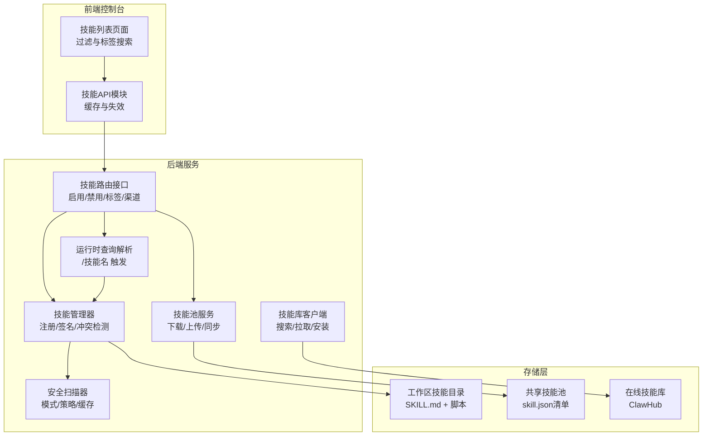
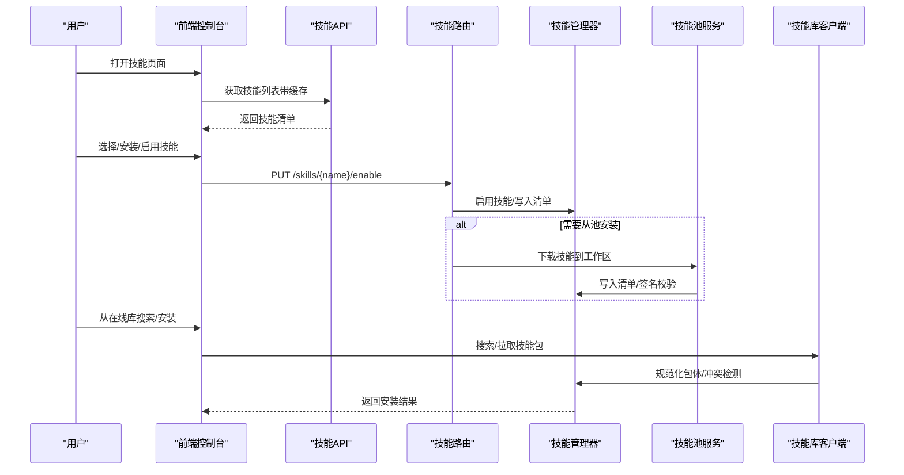
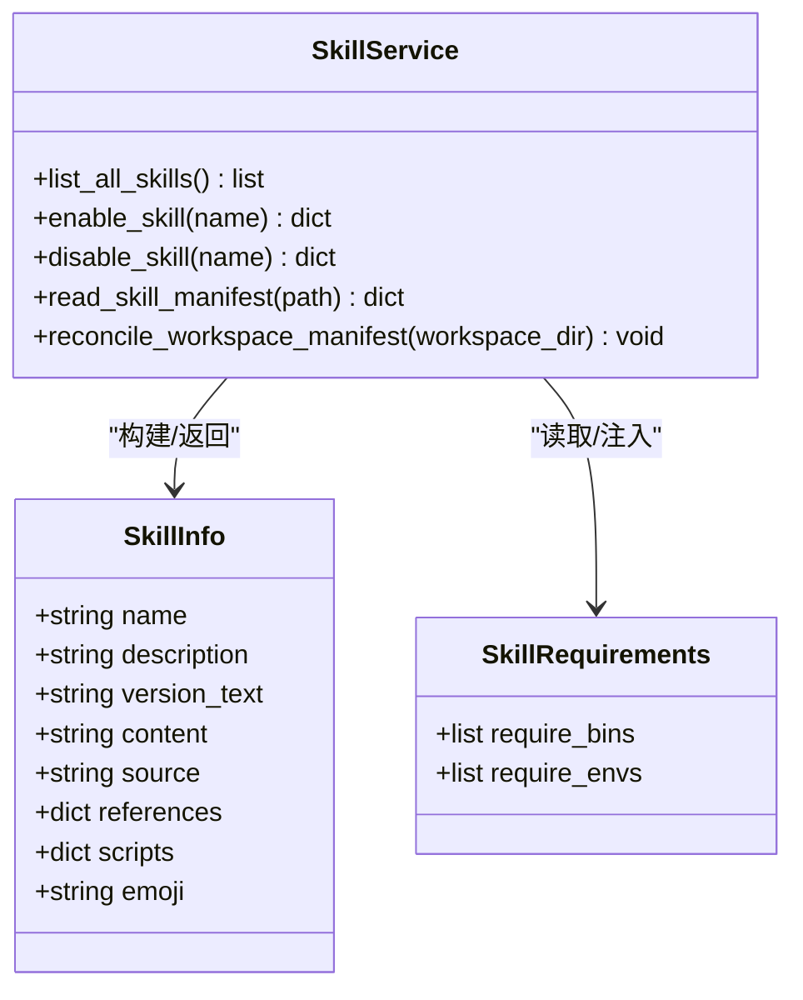
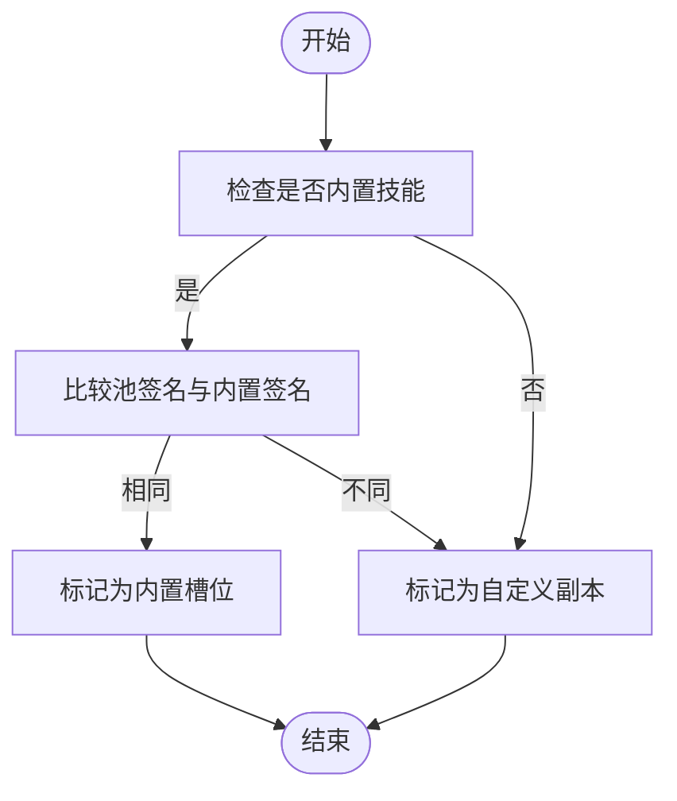
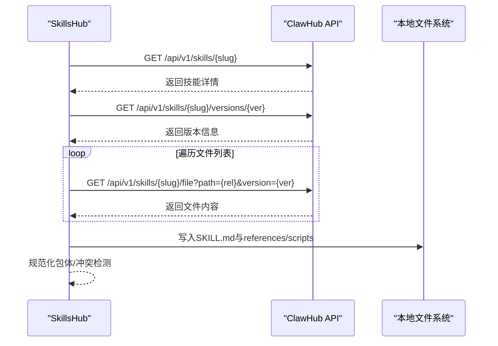
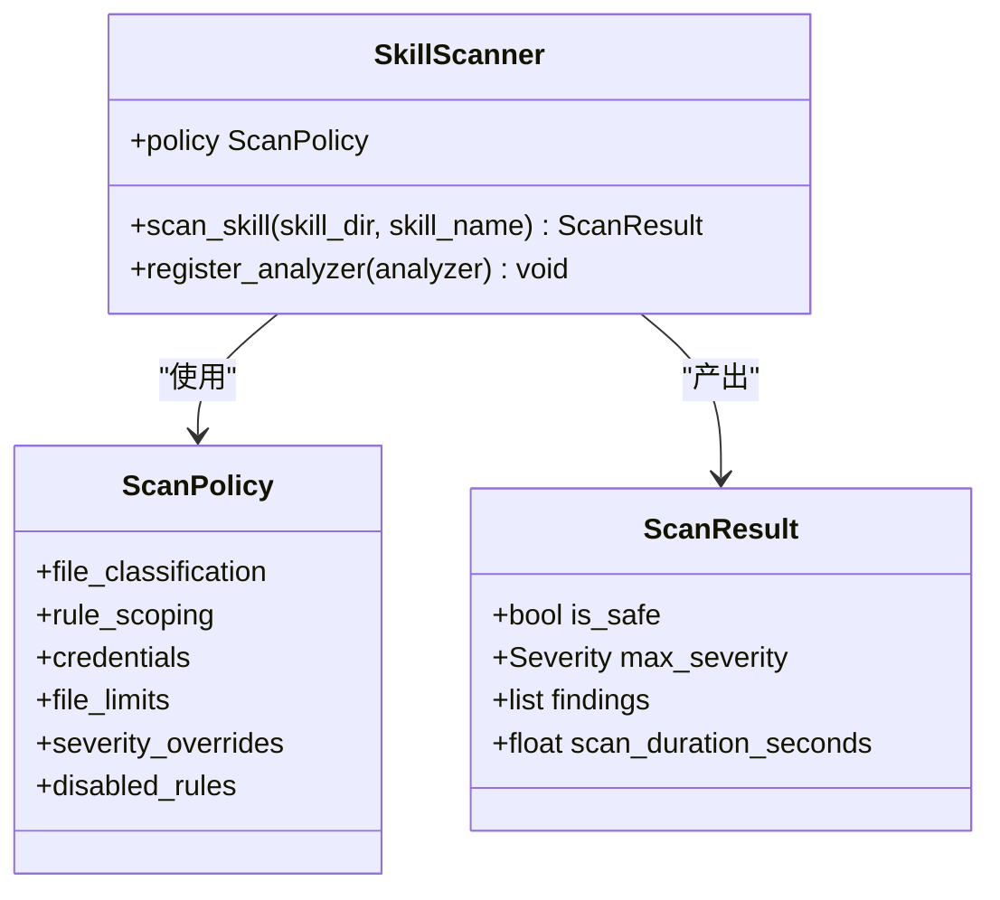
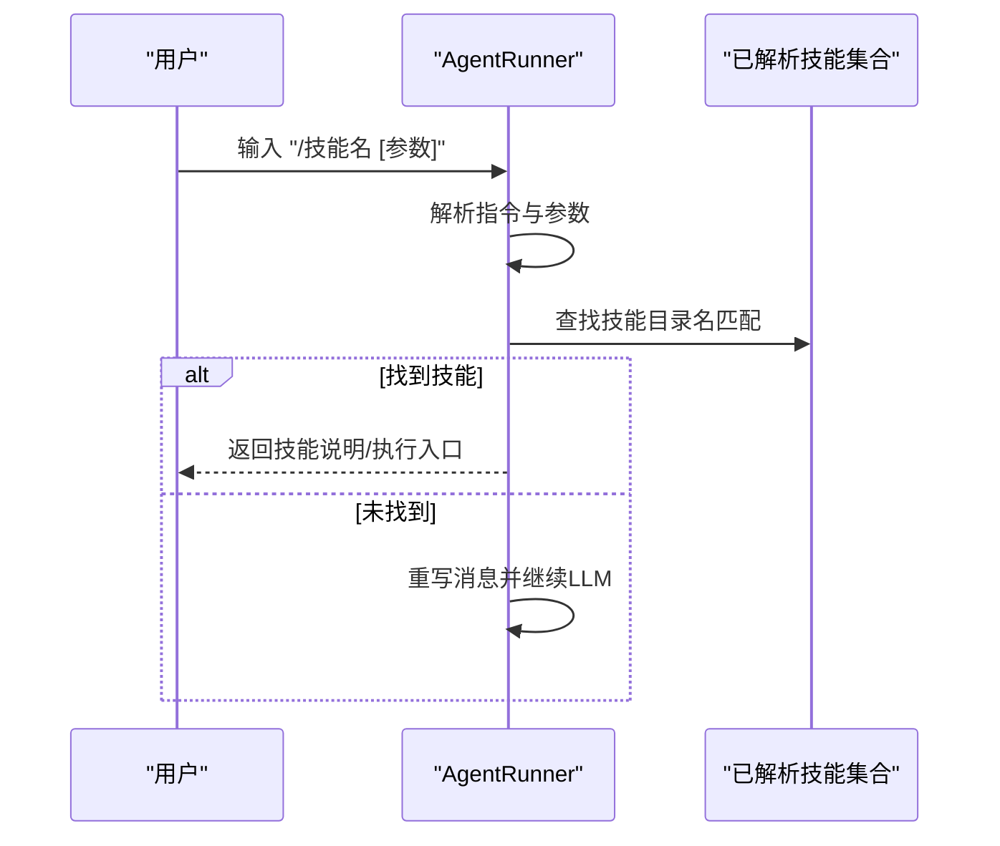
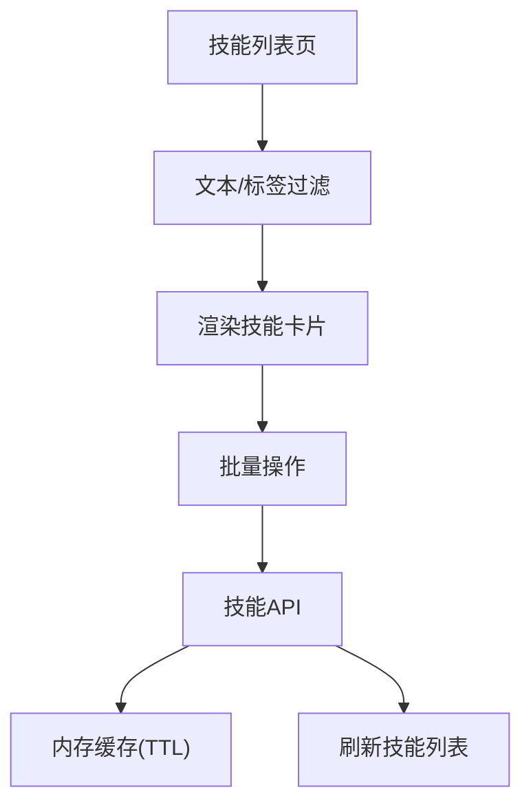
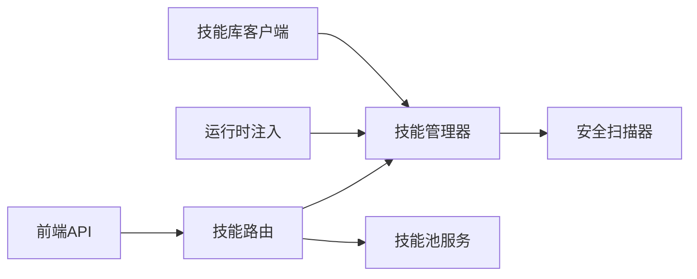

# 技能架构设计

<cite>
**本文档引用的文件**
- [skills_manager.py](file://src/qwenpaw/agents/skills_manager.py)
- [skills_hub.py](file://src/qwenpaw/agents/skills_hub.py)
- [skill.ts](file://console/src/api/modules/skill.ts)
- [useSkillFilter.ts](file://console/src/pages/Agent/Skills/useSkillFilter.ts)
- [skills.py](file://src/qwenpaw/app/routers/skills.py)
- [runner.py](file://src/qwenpaw/app/runner/runner.py)
- [skills_cmd.py](file://src/qwenpaw/cli/skills_cmd.py)
- [__init__.py](file://src/qwenpaw/agents/skills/__init__.py)
- [docx/SKILL.md](file://src/qwenpaw/agents/agents/skills/docx/SKILL.md)
- [pdf/SKILL.md](file://src/qwenpaw/agents/agents/skills/pdf/SKILL.md)
- [default_policy.yaml](file://src/qwenpaw/security/skill_scanner/data/default_policy.yaml)
- [scanner.py](file://src/qwenpaw/security/skill_scanner/scanner.py)
- [__init__.py](file://src/qwenpaw/security/skill_scanner/__init__.py)
- [multi_agent_report.html](file://multi_agent_report.html)
</cite>

## 目录
1. [引言](#引言)
2. [项目结构](#项目结构)
3. [核心组件](#核心组件)
4. [架构总览](#架构总览)
5. [详细组件分析](#详细组件分析)
6. [依赖分析](#依赖分析)
7. [性能考虑](#性能考虑)
8. [故障排除指南](#故障排除指南)
9. [结论](#结论)
10. [附录](#附录)

## 引言
本文件面向QwenPaw技能系统，提供从架构设计到实现细节的完整技术文档。内容覆盖技能注册机制、依赖管理、版本控制策略、元数据结构、签名验证与冲突检测、生命周期管理、缓存策略与性能优化、以及与代理、工具和模型的集成方式。通过多维度图表与代码级映射，帮助开发者快速理解并高效扩展技能系统。

## 项目结构
QwenPaw技能系统围绕“工作区技能目录 + 共享技能池 + 在线技能库”三层结构组织，结合安全扫描、版本与签名校验、渠道路由与运行时注入等能力，形成完整的技能全生命周期管理体系。

**图表来源**
- [skills.py:1330-1372](file://src/qwenpaw/app/routers/skills.py#L1330-L1372)
- [runner.py:139-185](file://src/qwenpaw/app/runner/runner.py#L139-L185)
- [skills_manager.py:65-170](file://src/qwenpaw/agents/skills_manager.py#L65-L170)
- [skills_hub.py:1-120](file://src/qwenpaw/agents/skills_hub.py#L1-L120)
- [__init__.py:1-120](file://src/qwenpaw/security/skill_scanner/__init__.py#L1-L120)

**章节来源**
- [skills_manager.py:120-170](file://src/qwenpaw/agents/skills_manager.py#L120-L170)
- [skills_hub.py:190-225](file://src/qwenpaw/agents/skills_hub.py#L190-L225)
- [skills.py:1330-1372](file://src/qwenpaw/app/routers/skills.py#L1330-L1372)
- [runner.py:139-185](file://src/qwenpaw/app/runner/runner.py#L139-L185)
- [__init__.py:1-120](file://src/qwenpaw/security/skill_scanner/__init__.py#L1-L120)

## 核心组件
- 技能管理器（SkillService）：负责工作区内技能的注册、启用/禁用、元数据构建、签名计算、冲突检测与环境变量注入。
- 技能池服务（SkillPoolService）：管理共享技能池，支持从池下载到工作区、上传工作区技能到池、池清单同步与内置/自定义分类。
- 技能库客户端（SkillsHub）：对接ClawHub，提供搜索、版本选择、文件拉取、包体规范化与导入冲突处理。
- 安全扫描器（SkillScanner）：基于规则策略进行威胁检测，支持白名单、缓存与阻断/告警模式。
- 运行时注入（AgentRunner）：解析用户输入中的“/技能名”指令，按渠道路由触发对应技能。
- 前端技能UI与API：提供技能列表、过滤、批量操作、缓存与刷新。

**章节来源**
- [skills_manager.py:65-170](file://src/qwenpaw/agents/skills_manager.py#L65-L170)
- [skills_hub.py:58-95](file://src/qwenpaw/agents/skills_hub.py#L58-L95)
- [scanner.py:76-147](file://src/qwenpaw/security/skill_scanner/scanner.py#L76-L147)
- [runner.py:139-185](file://src/qwenpaw/app/runner/runner.py#L139-L185)
- [skill.ts:16-47](file://console/src/api/modules/skill.ts#L16-L47)

## 架构总览
技能系统采用“工作区中心 + 池共享 + 在线库”的分层设计，结合清单式manifest与签名校验，确保技能来源可信、变更可追踪、冲突可化解。运行时通过渠道路由与指令解析，将技能无缝注入到代理工具集。

**图表来源**
- [skills.py:1330-1372](file://src/qwenpaw/app/routers/skills.py#L1330-L1372)
- [skills_manager.py:391-406](file://src/qwenpaw/agents/skills_manager.py#L391-L406)
- [skills_hub.py:556-703](file://src/qwenpaw/agents/skills_hub.py#L556-L703)

## 详细组件分析

### 组件A：技能管理器（SkillService）
职责与特性
- 清单与目录：读取/写入工作区与池的skill.json，支持版本号递增与原子写入。
- 元数据构建：从SKILL.md frontmatter提取名称、描述、版本、依赖等信息，并生成签名。
- 签名与冲突：基于目录树哈希进行内容身份识别，内置/自定义同名技能的分类与冲突建议。
- 环境注入：根据技能配置与声明的require_envs，动态注入环境变量，避免冲突。
- 并发安全：使用文件锁保护清单写入，保证多进程一致性。

**图表来源**
- [skills_manager.py:65-170](file://src/qwenpaw/agents/skills_manager.py#L65-L170)
- [skills_manager.py:720-750](file://src/qwenpaw/agents/skills_manager.py#L720-L750)
- [skills_manager.py:543-572](file://src/qwenpaw/agents/skills_manager.py#L543-L572)

**章节来源**
- [skills_manager.py:353-389](file://src/qwenpaw/agents/skills_manager.py#L353-L389)
- [skills_manager.py:720-750](file://src/qwenpaw/agents/skills_manager.py#L720-L750)
- [skills_manager.py:590-632](file://src/qwenpaw/agents/skills_manager.py#L590-L632)

### 组件B：技能池服务（SkillPoolService）
职责与特性
- 池清单管理：维护skill.json，记录内置/自定义槽位与版本信息。
- 同步策略：内置技能与池内签名一致则保留为builtin槽位；否则标记为customized。
- 导入导出：支持从池下载到工作区、从工作区上传到池，自动重命名冲突项。
- 线程安全：清单写入采用原子替换与文件锁。

**图表来源**
- [skills_manager.py:418-447](file://src/qwenpaw/agents/skills_manager.py#L418-L447)

**章节来源**
- [skills_manager.py:391-406](file://src/qwenpaw/agents/skills_manager.py#L391-L406)
- [skills_manager.py:418-447](file://src/qwenpaw/agents/skills_manager.py#L418-L447)

### 组件C：技能库客户端（SkillsHub）
职责与特性
- 多源适配：支持ClawHub与skills.sh等URL解析与slug提取。
- 包体规范化：从远端响应中提取或拼装SKILL.md与文件树，统一为包对象。
- 版本与文件拉取：根据请求版本或最新版本，逐个文件拉取并组装。
- 错误与超时：统一HTTP错误码处理、重试退避、速率限制提示。
- 导入冲突：提供冲突建议与重命名策略。

**图表来源**
- [skills_hub.py:556-703](file://src/qwenpaw/agents/skills_hub.py#L556-L703)
- [skills_hub.py:290-404](file://src/qwenpaw/agents/skills_hub.py#L290-L404)

**章节来源**
- [skills_hub.py:190-225](file://src/qwenpaw/agents/skills_hub.py#L190-L225)
- [skills_hub.py:556-703](file://src/qwenpaw/agents/skills_hub.py#L556-L703)

### 组件D：安全扫描器（SkillScanner）
职责与特性
- 扫描策略：基于默认策略文件与可插拔分析器，对技能包进行威胁检测。
- 缓存与白名单：按目录mtime缓存扫描结果，支持按内容哈希的白名单匹配。
- 模式控制：block/warn/off三种模式，支持环境变量覆盖。
- 结果记录：将阻断/警告记录持久化，便于审计与历史回溯。

**图表来源**
- [scanner.py:76-147](file://src/qwenpaw/security/skill_scanner/scanner.py#L76-L147)
- [__init__.py:86-115](file://src/qwenpaw/security/skill_scanner/__init__.py#L86-L115)
- [default_policy.yaml:1-243](file://src/qwenpaw/security/skill_scanner/data/default_policy.yaml#L1-L243)

**章节来源**
- [scanner.py:148-242](file://src/qwenpaw/security/skill_scanner/scanner.py#L148-L242)
- [__init__.py:424-514](file://src/qwenpaw/security/skill_scanner/__init__.py#L424-L514)
- [default_policy.yaml:1-243](file://src/qwenpaw/security/skill_scanner/data/default_policy.yaml#L1-L243)

### 组件E：运行时注入（AgentRunner）
职责与特性
- 指令解析：识别“/技能名 [输入]”形式的指令，按渠道路由查找对应技能。
- 快速短路：命中技能时直接返回技能说明或执行入口，避免LLM调用。
- 热重载安全：每次查询重建代理，确保技能变更即时生效。

**图表来源**
- [runner.py:139-185](file://src/qwenpaw/app/runner/runner.py#L139-L185)

**章节来源**
- [runner.py:139-185](file://src/qwenpaw/app/runner/runner.py#L139-L185)

### 组件F：前端技能UI与API
职责与特性
- 列表与过滤：支持按名称/描述/标签过滤，标签前缀用于渠道筛选。
- 缓存与失效：API层设置30秒TTL缓存，支持按agentId/workspaces/pool粒度失效。
- 批量操作：支持批量启用/禁用、删除、上传/下载到池。

**图表来源**
- [useSkillFilter.ts:10-49](file://console/src/pages/Agent/Skills/useSkillFilter.ts#L10-L49)
- [skill.ts:16-47](file://console/src/api/modules/skill.ts#L16-L47)

**章节来源**
- [useSkillFilter.ts:10-49](file://console/src/pages/Agent/Skills/useSkillFilter.ts#L10-L49)
- [skill.ts:16-47](file://console/src/api/modules/skill.ts#L16-L47)

## 依赖分析
- 组件耦合
  - Router依赖Manager与Pool，用于技能启停与池同步。
  - Runner依赖Manager提供的技能解析结果，实现指令到技能的映射。
  - Manager依赖Scanner进行安装/激活前的安全扫描。
  - Hub独立于Manager，但输出包体需经Manager规范化与冲突处理。
- 外部依赖
  - HTTP客户端与重试退避策略来自SkillsHub。
  - 文件系统与原子写入依赖临时文件与锁文件。
  - 前端API依赖Vite注入的基础URL与内存缓存。

**图表来源**
- [skills.py:1330-1372](file://src/qwenpaw/app/routers/skills.py#L1330-L1372)
- [runner.py:139-185](file://src/qwenpaw/app/runner/runner.py#L139-L185)
- [skills_manager.py:673-718](file://src/qwenpaw/agents/skills_manager.py#L673-L718)
- [skills_hub.py:290-404](file://src/qwenpaw/agents/skills_hub.py#L290-L404)
- [__init__.py:318-330](file://src/qwenpaw/security/skill_scanner/__init__.py#L318-L330)

**章节来源**
- [skills.py:1330-1372](file://src/qwenpaw/app/routers/skills.py#L1330-L1372)
- [runner.py:139-185](file://src/qwenpaw/app/runner/runner.py#L139-L185)
- [skills_manager.py:673-718](file://src/qwenpaw/agents/skills_manager.py#L673-L718)
- [skills_hub.py:290-404](file://src/qwenpaw/agents/skills_hub.py#L290-L404)
- [__init__.py:318-330](file://src/qwenpaw/security/skill_scanner/__init__.py#L318-L330)

## 性能考虑
- 扫描缓存：按目录mtime缓存扫描结果，避免重复扫描；LRU上限64条，减少内存占用。
- 清单写入：原子写入与文件锁，降低并发写入冲突与损坏风险。
- HTTP重试：指数退避与可配置超时/重试次数，提升远程依赖稳定性。
- 前端缓存：技能API设置30秒TTL，减少重复请求；支持按场景失效。
- 文件大小限制：ZIP解压与HTTP响应体大小限制，防止过大包导致内存压力。
- 签名计算：仅在需要时计算签名，避免不必要的I/O。

**章节来源**
- [__init__.py:356-390](file://src/qwenpaw/security/skill_scanner/__init__.py#L356-L390)
- [skills_manager.py:353-389](file://src/qwenpaw/agents/skills_manager.py#L353-L389)
- [skills_hub.py:130-160](file://src/qwenpaw/agents/skills_hub.py#L130-L160)
- [skill.ts:16-32](file://console/src/api/modules/skill.ts#L16-L32)

## 故障排除指南
- 安装失败（冲突）
  - 现象：同名技能已存在。
  - 处理：使用建议重命名或删除旧版本后重试。
  - 参考：冲突建议函数与错误封装。
- 安全扫描阻断
  - 现象：扫描发现高危问题，阻断安装。
  - 处理：调整策略或修复问题后重试；必要时加入白名单。
- HTTP错误与限流
  - 现象：429/5xx或GitHub速率限制。
  - 处理：设置认证令牌、等待退避时间或更换网络。
- 清单损坏
  - 现象：JSON解析失败或版本异常。
  - 处理：备份后重置为默认模板，重新同步。

**章节来源**
- [skills_manager.py:778-798](file://src/qwenpaw/agents/skills_manager.py#L778-L798)
- [__init__.py:402-422](file://src/qwenpaw/security/skill_scanner/__init__.py#L402-L422)
- [skills_hub.py:316-404](file://src/qwenpaw/agents/skills_hub.py#L316-L404)
- [skills_manager.py:338-351](file://src/qwenpaw/agents/skills_manager.py#L338-L351)

## 结论
QwenPaw技能系统通过“工作区 + 池 + 在线库”的分层架构，结合清单化管理、签名与冲突检测、安全扫描与缓存优化，实现了技能的可信安装、灵活启用与高效运行。运行时的指令解析与渠道路由进一步提升了技能的即取即用体验。该设计兼顾安全性、可扩展性与易用性，适合在多代理、多渠道场景下稳定演进。

## 附录

### 技能元数据与版本控制
- 元数据来源：SKILL.md frontmatter，包含名称、描述、版本、许可证、依赖声明等。
- 版本提取：优先从metadata.version或builtin_skill_version读取。
- 签名生成：对技能目录树（排除缓存/系统文件）进行哈希，作为内容身份标识。
- 清单字段：包含name、description、version_text、commit_text、signature、source、protected、requirements、updated_at等。

**章节来源**
- [docx/SKILL.md:1-10](file://src/qwenpaw/agents/agents/skills/docx/SKILL.md#L1-L10)
- [pdf/SKILL.md:1-10](file://src/qwenpaw/agents/agents/skills/pdf/SKILL.md#L1-L10)
- [skills_manager.py:249-259](file://src/qwenpaw/agents/skills_manager.py#L249-L259)
- [skills_manager.py:720-750](file://src/qwenpaw/agents/skills_manager.py#L720-L750)

### 技能生命周期管理
- 创建：从在线库或本地导入，规范化包体与frontmatter。
- 安装：写入工作区目录，生成清单条目，计算签名。
- 启用/禁用：更新清单enabled状态，热重载代理。
- 升级：比较版本与签名，按策略决定内置/自定义槽位。
- 删除：移除目录与清单条目，清理环境变量。

**章节来源**
- [skills_manager.py:391-406](file://src/qwenpaw/agents/skills_manager.py#L391-L406)
- [skills_manager.py:720-750](file://src/qwenpaw/agents/skills_manager.py#L720-L750)
- [skills.py:1330-1372](file://src/qwenpaw/app/routers/skills.py#L1330-L1372)

### 技能与代理、工具、模型的集成
- 渠道路由：支持console、discord、telegram、dingtalk、feishu、imessage、qq、mattermost、wecom、mqtt等。
- 运行时注入：用户输入“/技能名”触发，直接进入技能执行路径。
- 工具集：技能作为代理工具的一部分被调用，具备独立的脚本与依赖声明。
- 模型交互：技能可调用外部模型或工具链，具体行为由技能脚本定义。

**章节来源**
- [skills_manager.py:47-58](file://src/qwenpaw/agents/skills_manager.py#L47-L58)
- [runner.py:139-185](file://src/qwenpaw/app/runner/runner.py#L139-L185)
- [multi_agent_report.html:871-901](file://multi_agent_report.html#L871-L901)