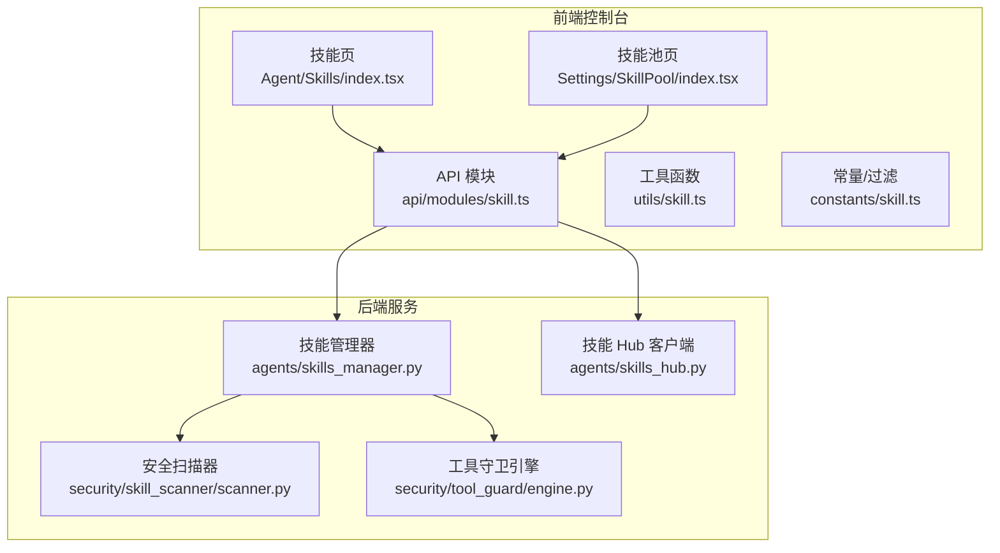
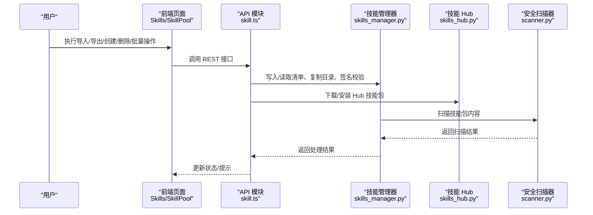
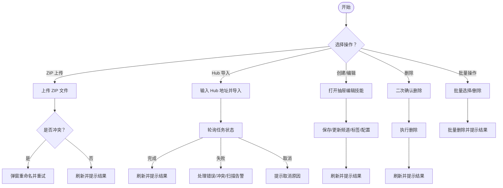
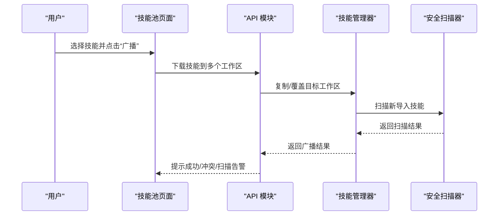
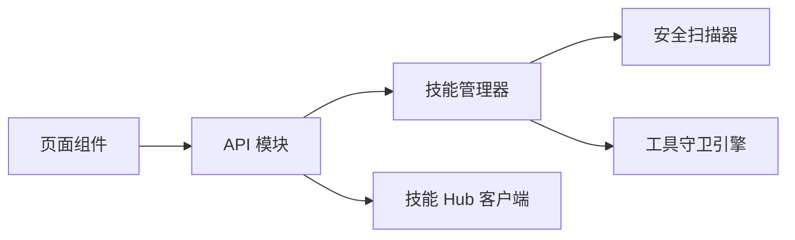

# 技能管理工具

<cite>
**本文引用的文件**
- [console/src/pages/Agent/Skills/index.tsx](file://console/src/pages/Agent/Skills/index.tsx)
- [console/src/pages/Agent/Skills/useSkills.ts](file://console/src/pages/Agent/Skills/useSkills.ts)
- [console/src/pages/Settings/SkillPool/index.tsx](file://console/src/pages/Settings/SkillPool/index.tsx)
- [console/src/pages/Settings/SkillPool/useSkillPool.tsx](file://console/src/pages/Settings/SkillPool/useSkillPool.tsx)
- [console/src/api/modules/skill.ts](file://console/src/api/modules/skill.ts)
- [console/src/utils/skill.ts](file://console/src/utils/skill.ts)
- [console/src/constants/skill.ts](file://console/src/constants/skill.ts)
- [console/src/api/types/skill.ts](file://console/src/api/types/skill.ts)
- [src/qwenpaw/agents/skills_manager.py](file://src/qwenpaw/agents/skills_manager.py)
- [src/qwenpaw/agents/skills_hub.py](file://src/qwenpaw/agents/skills_hub.py)
- [src/qwenpaw/security/skill_scanner/scanner.py](file://src/qwenpaw/security/skill_scanner/scanner.py)
- [src/qwenpaw/security/tool_guard/engine.py](file://src/qwenpaw/security/tool_guard/engine.py)
</cite>

## 目录
1. [简介](#简介)
2. [项目结构](#项目结构)
3. [核心组件](#核心组件)
4. [架构总览](#架构总览)
5. [详细组件分析](#详细组件分析)
6. [依赖分析](#依赖分析)
7. [性能考虑](#性能考虑)
8. [故障排查指南](#故障排查指南)
9. [结论](#结论)
10. [附录](#附录)

## 简介
本指南面向使用 QwenPaw 的用户与运维人员，系统讲解 Web 控制台中的“技能管理”能力，覆盖技能导入、导出、删除、配置、批量操作、迁移与备份恢复、搜索过滤排序、权限与访问控制、安全扫描、监控与统计等主题，并结合后端实现说明最佳实践与运维建议。

## 项目结构
- 前端控制台（React + TypeScript）：位于 console/，负责技能列表展示、编辑、导入导出、批量操作、技能池广播与内置技能导入等交互。
- 后端服务（Python）：位于 src/qwenpaw/，提供技能清单、上传/下载、导入 Hub、安全扫描、工具调用守卫、工作区与技能池同步等能力。
- 安全模块：技能扫描器与工具调用守卫，保障技能包内容安全与运行期工具调用风险控制。

图表来源
- [console/src/pages/Agent/Skills/index.tsx:1-876](file://console/src/pages/Agent/Skills/index.tsx#L1-L876)
- [console/src/pages/Settings/SkillPool/index.tsx:1-290](file://console/src/pages/Settings/SkillPool/index.tsx#L1-L290)
- [console/src/api/modules/skill.ts:1-551](file://console/src/api/modules/skill.ts#L1-L551)
- [src/qwenpaw/agents/skills_manager.py:1-800](file://src/qwenpaw/agents/skills_manager.py#L1-L800)
- [src/qwenpaw/agents/skills_hub.py:1-800](file://src/qwenpaw/agents/skills_hub.py#L1-L800)
- [src/qwenpaw/security/skill_scanner/scanner.py:1-319](file://src/qwenpaw/security/skill_scanner/scanner.py#L1-L319)
- [src/qwenpaw/security/tool_guard/engine.py:1-238](file://src/qwenpaw/security/tool_guard/engine.py#L1-L238)

章节来源
- [console/src/pages/Agent/Skills/index.tsx:1-876](file://console/src/pages/Agent/Skills/index.tsx#L1-L876)
- [console/src/pages/Settings/SkillPool/index.tsx:1-290](file://console/src/pages/Settings/SkillPool/index.tsx#L1-L290)
- [console/src/api/modules/skill.ts:1-551](file://console/src/api/modules/skill.ts#L1-L551)
- [src/qwenpaw/agents/skills_manager.py:1-800](file://src/qwenpaw/agents/skills_manager.py#L1-L800)
- [src/qwenpaw/agents/skills_hub.py:1-800](file://src/qwenpaw/agents/skills_hub.py#L1-L800)
- [src/qwenpaw/security/skill_scanner/scanner.py:1-319](file://src/qwenpaw/security/skill_scanner/scanner.py#L1-L319)
- [src/qwenpaw/security/tool_guard/engine.py:1-238](file://src/qwenpaw/security/tool_guard/engine.py#L1-L238)

## 核心组件
- 技能 API 模块：封装技能列表、刷新、创建/保存、启用/禁用、删除、上传/下载、Hub 导入、标签/频道更新、配置读写、AI 优化流式接口等。
- 技能管理 Hook：在技能页与技能池页中复用，负责加载数据、缓存失效、错误处理、冲突重命名、批量操作、扫描告警提示等。
- 技能 Hub 客户端：支持从多源 Hub 拉取技能包，带重试、超时、取消、冲突检测与重命名机制。
- 技能管理器：负责工作区与技能池目录结构、清单管理、签名计算、冲突建议、环境变量注入、内置技能识别与同步策略。
- 安全扫描器：对技能包进行文件发现、规则分析、重复去重、结果聚合，支持策略与扩展。
- 工具守卫引擎：对工具调用参数进行预检，支持规则与路径级守卫，可按配置启用/禁用。

章节来源
- [console/src/api/modules/skill.ts:112-551](file://console/src/api/modules/skill.ts#L112-L551)
- [console/src/pages/Agent/Skills/useSkills.ts:21-323](file://console/src/pages/Agent/Skills/useSkills.ts#L21-L323)
- [console/src/pages/Settings/SkillPool/useSkillPool.tsx:25-806](file://console/src/pages/Settings/SkillPool/useSkillPool.tsx#L25-L806)
- [src/qwenpaw/agents/skills_hub.py:290-404](file://src/qwenpaw/agents/skills_hub.py#L290-L404)
- [src/qwenpaw/agents/skills_manager.py:408-780](file://src/qwenpaw/agents/skills_manager.py#L408-L780)
- [src/qwenpaw/security/skill_scanner/scanner.py:76-319](file://src/qwenpaw/security/skill_scanner/scanner.py#L76-L319)
- [src/qwenpaw/security/tool_guard/engine.py:53-238](file://src/qwenpaw/security/tool_guard/engine.py#L53-L238)

## 架构总览
从前端到后端的数据流与职责划分如下：

图表来源
- [console/src/pages/Agent/Skills/index.tsx:151-241](file://console/src/pages/Agent/Skills/index.tsx#L151-L241)
- [console/src/pages/Settings/SkillPool/index.tsx:150-250](file://console/src/pages/Settings/SkillPool/index.tsx#L150-L250)
- [console/src/api/modules/skill.ts:112-551](file://console/src/api/modules/skill.ts#L112-L551)
- [src/qwenpaw/agents/skills_manager.py:274-312](file://src/qwenpaw/agents/skills_manager.py#L274-L312)
- [src/qwenpaw/agents/skills_hub.py:290-404](file://src/qwenpaw/agents/skills_hub.py#L290-L404)
- [src/qwenpaw/security/skill_scanner/scanner.py:148-242](file://src/qwenpaw/security/skill_scanner/scanner.py#L148-L242)

## 详细组件分析

### Web 控制台：技能管理（工作区）
- 功能概览
  - 列表视图：卡片/列表双模式，支持启用/禁用、编辑、删除、批量选择与批量删除。
  - 搜索/过滤/排序：按名称、标签、内置/自定义来源筛选；默认按启用状态优先、再按名称排序。
  - 创建/编辑：支持 Frontmatter 校验、频道与标签更新、配置读写。
  - 导入/导出：支持 ZIP 上传、Hub 导入、硬刷新缓存。
  - 技能池迁移：支持将选中技能上传至技能池或从技能池下载到当前工作区。
- 关键流程
  - ZIP 上传：限制大小、循环冲突重命名、逐个处理并提示结果。
  - Hub 导入：启动任务、轮询状态、失败/取消处理、超时自动取消。
  - 删除确认：二次确认弹窗，成功后刷新缓存并重新拉取。
  - 配置与标签：独立更新接口，避免不必要的全量保存。
- 错误与冲突
  - 冲突重命名：根据后端返回建议名，弹窗选择新名称并重试。
  - 安全扫描告警：导入/启用后触发扫描检查，异常时弹窗提示。

图表来源
- [console/src/pages/Agent/Skills/index.tsx:151-241](file://console/src/pages/Agent/Skills/index.tsx#L151-L241)
- [console/src/pages/Agent/Skills/useSkills.ts:111-240](file://console/src/pages/Agent/Skills/useSkills.ts#L111-L240)

章节来源
- [console/src/pages/Agent/Skills/index.tsx:1-876](file://console/src/pages/Agent/Skills/index.tsx#L1-L876)
- [console/src/pages/Agent/Skills/useSkills.ts:1-323](file://console/src/pages/Agent/Skills/useSkills.ts#L1-L323)
- [console/src/api/modules/skill.ts:112-551](file://console/src/api/modules/skill.ts#L112-L551)
- [console/src/utils/skill.ts:1-42](file://console/src/utils/skill.ts#L1-L42)
- [console/src/constants/skill.ts:1-21](file://console/src/constants/skill.ts#L1-L21)

### Web 控制台：技能池管理
- 功能概览
  - 技能池浏览：支持刷新、搜索、分类筛选、卡片/列表视图。
  - 广播分发：将技能广播到多个工作区，自动处理内置升级与重命名冲突。
  - 内置技能导入：列出可导入内置源，支持覆盖冲突。
  - ZIP 导入：限制大小、循环冲突重命名、扫描告警。
  - 批量操作：批量删除、清空选择、退出批量模式。
- 关键流程
  - 广播：逐目标工作区下载，内置升级需确认覆盖。
  - 内置导入：根据冲突情况提示版本差异，支持二次确认覆盖。
  - ZIP 导入：与工作区导入一致的冲突处理与扫描检查。

图表来源
- [console/src/pages/Settings/SkillPool/index.tsx:244-267](file://console/src/pages/Settings/SkillPool/index.tsx#L244-L267)
- [console/src/pages/Settings/SkillPool/useSkillPool.tsx:248-390](file://console/src/pages/Settings/SkillPool/useSkillPool.tsx#L248-L390)
- [src/qwenpaw/agents/skills_manager.py:294-312](file://src/qwenpaw/agents/skills_manager.py#L294-L312)
- [src/qwenpaw/security/skill_scanner/scanner.py:148-242](file://src/qwenpaw/security/skill_scanner/scanner.py#L148-L242)

章节来源
- [console/src/pages/Settings/SkillPool/index.tsx:1-290](file://console/src/pages/Settings/SkillPool/index.tsx#L1-L290)
- [console/src/pages/Settings/SkillPool/useSkillPool.tsx:1-806](file://console/src/pages/Settings/SkillPool/useSkillPool.tsx#L1-L806)
- [console/src/api/types/skill.ts:22-36](file://console/src/api/types/skill.ts#L22-L36)

### 技能搜索、过滤与排序
- 搜索与过滤
  - 支持按标签过滤（tag: 前缀）、按名称关键词过滤、下拉展开选择标签。
  - 技能来源区分：内置/自定义，内置技能有特定标识与状态显示。
- 排序规则
  - 工作区技能：启用优先、再按名称排序。
  - 技能池：按名称排序。
- 常量与工具
  - 支持的 Hub URL 前缀与标签过滤前缀常量，便于统一校验与解析。

章节来源
- [console/src/pages/Agent/Skills/index.tsx:86-102](file://console/src/pages/Agent/Skills/index.tsx#L86-L102)
- [console/src/pages/Settings/SkillPool/index.tsx:153-203](file://console/src/pages/Settings/SkillPool/index.tsx#L153-L203)
- [console/src/utils/skill.ts:6-42](file://console/src/utils/skill.ts#L6-L42)
- [console/src/constants/skill.ts:13-21](file://console/src/constants/skill.ts#L13-L21)

### 技能批量操作、迁移与备份恢复
- 批量操作
  - 工作区：批量删除、全选/清空、退出批量模式。
  - 技能池：批量删除、全选/清空、退出批量模式。
- 迁移与广播
  - 工作区 → 技能池：上传所选技能到技能池，循环冲突重命名。
  - 技能池 → 工作区：下载到指定工作区，内置升级需确认覆盖。
- 备份与恢复
  - ZIP 导入/导出：通过 API 的上传/下载接口实现技能包的备份与恢复。
  - 缓存控制：每次变更后主动失效缓存并刷新，确保前后端一致性。

章节来源
- [console/src/pages/Agent/Skills/index.tsx:480-524](file://console/src/pages/Agent/Skills/index.tsx#L480-L524)
- [console/src/pages/Settings/SkillPool/index.tsx:70-79](file://console/src/pages/Settings/SkillPool/index.tsx#L70-L79)
- [console/src/pages/Settings/SkillPool/useSkillPool.tsx:700-746](file://console/src/pages/Settings/SkillPool/useSkillPool.tsx#L700-L746)

### 权限管理、访问控制与安全扫描
- 权限与访问控制
  - 技能池中的受保护技能（protected）与内置来源（builtin/system）有特殊标识与状态。
  - 广播分发时对内置升级场景进行覆盖确认，避免意外替换。
- 安全扫描
  - 技能包扫描：文件发现、规则分析、重复去重、结果聚合，支持策略与扩展。
  - 工具调用守卫：对工具调用参数进行预检，支持规则与路径级守卫，可按配置启用/禁用。
  - 导入后扫描：创建/导入/广播后触发扫描检查，异常时弹窗提示并阻断后续流程。

章节来源
- [console/src/utils/skill.ts:16-42](file://console/src/utils/skill.ts#L16-L42)
- [console/src/pages/Agent/Skills/useSkills.ts:44-53](file://console/src/pages/Agent/Skills/useSkills.ts#L44-L53)
- [console/src/pages/Settings/SkillPool/useSkillPool.tsx:248-390](file://console/src/pages/Settings/SkillPool/useSkillPool.tsx#L248-L390)
- [src/qwenpaw/security/skill_scanner/scanner.py:76-319](file://src/qwenpaw/security/skill_scanner/scanner.py#L76-L319)
- [src/qwenpaw/security/tool_guard/engine.py:53-238](file://src/qwenpaw/security/tool_guard/engine.py#L53-L238)

### 监控、性能分析与使用统计
- 前端缓存与刷新
  - 技能列表与技能池列表均采用内存缓存（TTL），关键操作后主动失效并刷新，减少重复请求。
  - 支持硬刷新接口，强制从后端重建缓存。
- 性能特性
  - 渐进渲染：长列表采用渐进渲染以提升首屏与滚动性能。
  - 并行更新：保存技能时，频道/标签/配置等副作用并行更新，降低等待时间。
- 统计与可观测性
  - 后端提供令牌用量与会话统计等模块（非技能管理直接功能），可结合使用以评估技能使用情况。

章节来源
- [console/src/api/modules/skill.ts:16-61](file://console/src/api/modules/skill.ts#L16-L61)
- [console/src/pages/Agent/Skills/index.tsx:104-108](file://console/src/pages/Agent/Skills/index.tsx#L104-L108)
- [console/src/pages/Settings/SkillPool/index.tsx:37-37](file://console/src/pages/Settings/SkillPool/index.tsx#L37-L37)

## 依赖分析
- 前端依赖
  - 页面组件依赖 API 模块提供的接口，API 模块封装了缓存、错误处理与并发更新。
  - 技能管理 Hook 在不同页面间复用，保证行为一致性。
- 后端依赖
  - 技能管理器依赖安全扫描器与工具守卫引擎，确保导入与运行期安全。
  - 技能 Hub 客户端负责外部资源的稳定获取与冲突处理。

图表来源
- [console/src/api/modules/skill.ts:112-551](file://console/src/api/modules/skill.ts#L112-L551)
- [src/qwenpaw/agents/skills_manager.py:274-312](file://src/qwenpaw/agents/skills_manager.py#L274-L312)
- [src/qwenpaw/agents/skills_hub.py:290-404](file://src/qwenpaw/agents/skills_hub.py#L290-L404)
- [src/qwenpaw/security/skill_scanner/scanner.py:76-319](file://src/qwenpaw/security/skill_scanner/scanner.py#L76-L319)
- [src/qwenpaw/security/tool_guard/engine.py:53-238](file://src/qwenpaw/security/tool_guard/engine.py#L53-L238)

章节来源
- [console/src/api/modules/skill.ts:112-551](file://console/src/api/modules/skill.ts#L112-L551)
- [src/qwenpaw/agents/skills_manager.py:1-800](file://src/qwenpaw/agents/skills_manager.py#L1-L800)
- [src/qwenpaw/agents/skills_hub.py:1-800](file://src/qwenpaw/agents/skills_hub.py#L1-L800)
- [src/qwenpaw/security/skill_scanner/scanner.py:1-319](file://src/qwenpaw/security/skill_scanner/scanner.py#L1-L319)
- [src/qwenpaw/security/tool_guard/engine.py:1-238](file://src/qwenpaw/security/tool_guard/engine.py#L1-L238)

## 性能考虑
- 前端
  - 列表懒加载与渐进渲染：长列表滚动体验更佳。
  - 缓存策略：技能列表与技能池列表设置短 TTL，关键操作后主动失效，平衡一致性与性能。
  - 并行更新：保存技能时，频道/标签/配置等副作用并行更新，减少等待时间。
- 后端
  - 签名计算与目录复制：采用稳定的签名算法与受控忽略列表，确保跨平台一致性与可预测的 IO 行为。
  - 扫描限制：文件数量与单文件大小上限，防止大包导致扫描耗时过长。
  - Hub 请求：超时、重试、回退策略与速率限制处理，提升外部资源可用性。

## 故障排查指南
- 导入/保存冲突
  - 现象：提示技能已存在或冲突。
  - 处理：根据建议名弹窗重命名，或在 Hub 导入时选择覆盖内置升级。
- 安全扫描告警
  - 现象：导入/启用后弹窗提示扫描异常。
  - 处理：根据扫描结果修正技能包内容，或调整扫描策略后再试。
- Hub 导入失败/取消
  - 现象：任务失败、被取消或超时。
  - 处理：检查网络与 Hub 可达性，必要时设置认证凭据，重试或手动选择覆盖。
- ZIP 上传失败
  - 现象：文件过大、格式不合法或存在冲突。
  - 处理：压缩包大小限制、修正冲突、检查 ZIP 结构与路径合法性。

章节来源
- [console/src/pages/Agent/Skills/useSkills.ts:151-240](file://console/src/pages/Agent/Skills/useSkills.ts#L151-L240)
- [console/src/pages/Settings/SkillPool/useSkillPool.tsx:577-652](file://console/src/pages/Settings/SkillPool/useSkillPool.tsx#L577-L652)
- [src/qwenpaw/security/skill_scanner/scanner.py:76-319](file://src/qwenpaw/security/skill_scanner/scanner.py#L76-L319)

## 结论
QwenPaw 的技能管理工具在前端提供了完善的技能生命周期管理与技能池协作能力，在后端通过技能管理器、Hub 客户端与安全扫描/守卫体系保障了导入、运行与运维的安全与稳定性。配合缓存与并行更新等前端优化，整体具备良好的用户体验与可维护性。建议在生产环境中启用安全扫描与工具守卫，并建立定期的技能池同步与备份策略。

## 附录
- 最佳实践
  - 使用技能池集中管理公共技能，通过广播分发到各工作区。
  - 导入 Hub 技能前先检查版本与来源，必要时选择覆盖内置升级。
  - 对敏感技能启用安全扫描，定期审查扫描报告。
  - 使用批量操作提高效率，注意在批量删除前做好确认与备份。
- 运维建议
  - 监控 Hub 访问与速率限制，合理设置认证凭据。
  - 定期清理冲突与过期技能，保持技能池整洁。
  - 结合令牌用量与会话统计模块，评估技能使用情况并优化配置。