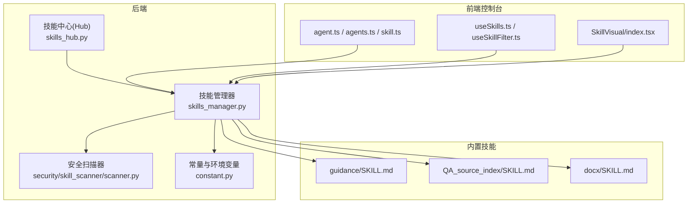
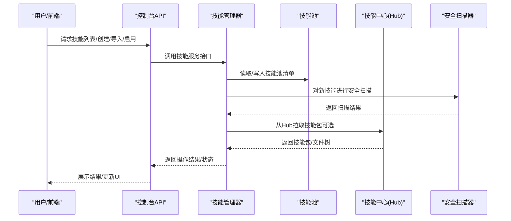
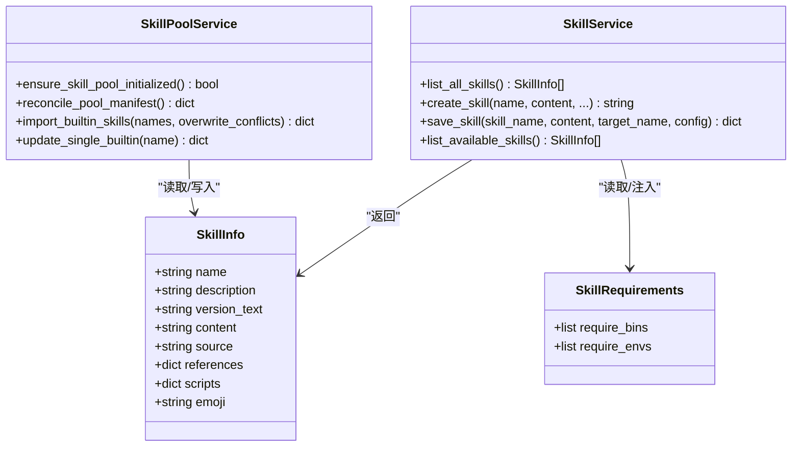
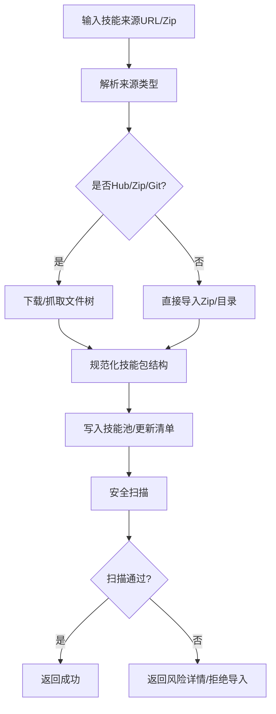
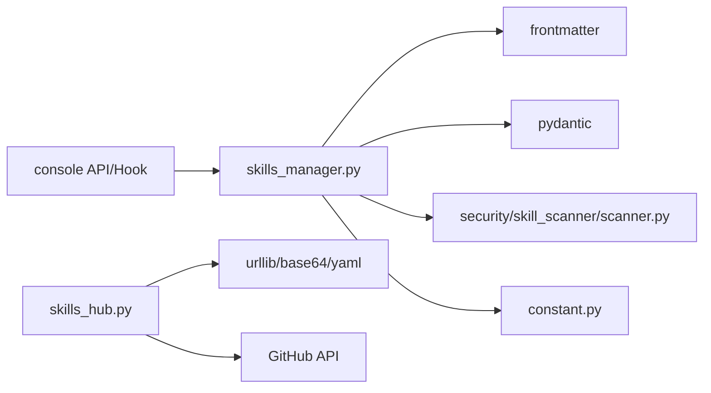

# 技能系统

<cite>
**本文引用的文件**
- [skills_manager.py](file://src/qwenpaw/agents/skills_manager.py)
- [skills_hub.py](file://src/qwenpaw/agents/skills_hub.py)
- [constant.py](file://src/qwenpaw/constant.py)
- [scanner.py](file://src/qwenpaw/security/skill_scanner/scanner.py)
- [guidance SKILL.md](file://src/qwenpaw/agents/agents/skills/guidance/SKILL.md)
- [QA_source_index SKILL.md](file://src/qwenpaw/agents/agents/skills/QA_source_index/SKILL.md)
- [docx SKILL.md](file://src/qwenpaw/agents/agents/skills/docx/SKILL.md)
- [agent.ts](file://console/src/api/modules/agent.ts)
- [agents.ts](file://console/src/api/modules/agents.ts)
- [skill.ts](file://console/src/api/modules/skill.ts)
- [useSkills.ts](file://console/src/pages/Agent/Skills/useSkills.ts)
- [useSkillFilter.ts](file://console/src/pages/Agent/Skills/useSkillFilter.ts)
- [SkillVisual/index.tsx](file://console/src/components/SkillVisual/index.tsx)
- [README.md](file://README.md)
</cite>

## 目录
1. [简介](#简介)
2. [项目结构](#项目结构)
3. [核心组件](#核心组件)
4. [架构总览](#架构总览)
5. [详细组件分析](#详细组件分析)
6. [依赖关系分析](#依赖关系分析)
7. [性能考量](#性能考量)
8. [故障排查指南](#故障排查指南)
9. [结论](#结论)
10. [附录](#附录)

## 简介
本文件面向开发者与使用者，系统性阐述 QwenPaw 技能系统的设计与使用方法。内容覆盖技能架构、内置技能概览、自定义技能开发流程、技能注册与依赖管理、版本控制策略、开发接口与参数规范、返回值约定、安全扫描与权限控制、性能优化建议、以及技能池管理与共享发现机制。文档同时提供前端控制台与后端服务的集成说明，帮助读者完成从开发、测试、调试到部署的全流程。

## 项目结构
技能系统由“后端技能管理器”“技能池与工作区”“技能中心（Hub）”“安全扫描器”“前端控制台”等部分组成，形成“代码/内置技能 → 技能池 → 工作区清单 → 运行时解析 → 执行”的闭环。

图示来源
- [skills_manager.py:1454-1576](file://src/qwenpaw/agents/skills_manager.py#L1454-L1576)
- [skills_hub.py:1593-1696](file://src/qwenpaw/agents/skills_hub.py#L1593-L1696)
- [scanner.py:76-242](file://src/qwenpaw/security/skill_scanner/scanner.py#L76-L242)
- [guidance SKILL.md:1-138](file://src/qwenpaw/agents/agents/skills/guidance/SKILL.md#L1-L138)
- [QA_source_index SKILL.md:1-51](file://src/qwenpaw/agents/agents/skills/QA_source_index/SKILL.md#L1-L51)
- [docx SKILL.md:1-488](file://src/qwenpaw/agents/agents/skills/docx/SKILL.md#L1-L488)
- [agent.ts](file://console/src/api/modules/agent.ts)
- [agents.ts](file://console/src/api/modules/agents.ts)
- [skill.ts](file://console/src/api/modules/skill.ts)
- [useSkills.ts](file://console/src/pages/Agent/Skills/useSkills.ts)
- [useSkillFilter.ts](file://console/src/pages/Agent/Skills/useSkillFilter.ts)
- [SkillVisual/index.tsx](file://console/src/components/SkillVisual/index.tsx)

章节来源
- [skills_manager.py:120-149](file://src/qwenpaw/agents/skills_manager.py#L120-L149)
- [skills_hub.py:191-224](file://src/qwenpaw/agents/skills_hub.py#L191-L224)
- [constant.py:89-121](file://src/qwenpaw/constant.py#L89-L121)

## 核心组件
- 技能管理器（SkillService/PoolService）：负责工作区技能的创建、导入、启用/禁用、渠道路由、配置注入、签名与冲突检测、清单同步与校验。
- 技能池（Skill Pool）：本地共享技能集合，支持内置技能与自定义技能混存，提供去重、签名比对与更新能力。
- 技能中心（Skills Hub）：统一的技能发现与安装入口，支持多种来源（ClawHub、GitHub、LobeHub、ModelScope、skills.sh 等）。
- 安全扫描器（SkillScanner）：对技能包进行模式匹配与规则扫描，支持策略化配置、文件大小/数量限制与跳过扩展名集。
- 前端控制台：提供技能列表、筛选、可视化展示与操作入口，调用后端 API 完成技能生命周期管理。

章节来源
- [skills_manager.py:1454-1576](file://src/qwenpaw/agents/skills_manager.py#L1454-L1576)
- [skills_hub.py:1593-1696](file://src/qwenpaw/agents/skills_hub.py#L1593-L1696)
- [scanner.py:76-242](file://src/qwenpaw/security/skill_scanner/scanner.py#L76-L242)

## 架构总览
技能系统采用“工作区驱动 + 技能池共享 + Hub 分发 + 安全扫描”的分层架构。运行时通过“渠道路由 + 清单解析”决定启用哪些技能，配置注入与环境变量桥接技能需求，安全扫描贯穿导入/创建/上传等关键节点。

图示来源
- [skills_manager.py:1454-1576](file://src/qwenpaw/agents/skills_manager.py#L1454-L1576)
- [skills_hub.py:1593-1696](file://src/qwenpaw/agents/skills_hub.py#L1593-L1696)
- [scanner.py:148-242](file://src/qwenpaw/security/skill_scanner/scanner.py#L148-L242)

## 详细组件分析

### 技能管理器（SkillService/PoolService）
- 角色与职责
  - 工作区技能生命周期：创建、保存、删除、重命名、启用/禁用、渠道路由。
  - 技能清单：维护每个技能的启用状态、渠道白名单、元数据、签名、更新时间、配置与依赖声明。
  - 技能池：内置技能与自定义技能的统一存储与同步，支持冲突检测与版本对比。
  - 环境变量注入：根据技能声明的 require_envs 将配置映射为环境变量，保障运行时隔离与并发安全。
- 关键流程
  - 创建/保存：校验 SKILL.md 前言字段，写入文件树，扫描安全，更新清单。
  - 导入：支持 Zip/Hub/GitHub 等来源，自动规范化名称与路径，冲突处理与重命名建议。
  - 启用/路由：按渠道过滤有效技能，确保目录存在且已启用。
  - 签名与冲突：构建技能树签名，用于池内内置/定制识别与更新提示。
- 数据结构
  - SkillInfo：对外展示的技能摘要（名称、描述、版本、内容、来源、引用与脚本树、表情）。
  - SkillRequirements：系统管理的依赖声明（二进制/环境变量）。
  - 清单结构：schema_version、version、skills（键为技能名，值含 enabled/channels/source/metadata/requirements/config 等）。

图示来源
- [skills_manager.py:65-95](file://src/qwenpaw/agents/skills_manager.py#L65-L95)
- [skills_manager.py:1454-1576](file://src/qwenpaw/agents/skills_manager.py#L1454-L1576)
- [skills_manager.py:1187-1272](file://src/qwenpaw/agents/skills_manager.py#L1187-L1272)

章节来源
- [skills_manager.py:1454-1576](file://src/qwenpaw/agents/skills_manager.py#L1454-L1576)
- [skills_manager.py:1164-1179](file://src/qwenpaw/agents/skills_manager.py#L1164-L1179)
- [skills_manager.py:274-292](file://src/qwenpaw/agents/skills_manager.py#L274-L292)

### 技能池与工作区清单
- 技能池（skill_pool）
  - 存放位置：WORKING_DIR/skill_pool
  - 作用：集中存放内置与自定义技能，支持批量导入、更新与内置版本同步状态查询。
  - 冲突与签名：内置技能与池内副本签名比对，区分“builtin/customized”，避免误覆盖。
- 工作区（workspaces/<id>/skills）
  - 存放位置：WORKING_DIR/workspaces/<id>/skills
  - 作用：编辑态技能目录，清单 skill.json 描述启用状态、渠道、配置与元数据。
  - 同步：reconcile 将磁盘上的 SKILL.md 发现与清单对齐，保留用户态配置与标签。
- 目录与清单路径
  - 技能池清单：WORKING_DIR/skill_pool/skill.json
  - 工作区清单：WORKING_DIR/workspaces/<id>/skill.json

章节来源
- [skills_manager.py:125-149](file://src/qwenpaw/agents/skills_manager.py#L125-L149)
- [skills_manager.py:955-1024](file://src/qwenpaw/agents/skills_manager.py#L955-L1024)
- [skills_manager.py:1027-1112](file://src/qwenpaw/agents/skills_manager.py#L1027-L1112)
- [constant.py:89-121](file://src/qwenpaw/constant.py#L89-L121)

### 技能中心（Skills Hub）与导入流程
- 支持来源
  - ClawHub、GitHub、LobeHub、ModelScope、skills.sh、skillsmp 等。
  - 支持 URL 解析与直链 JSON 包导入。
- 导入步骤
  - 解析 URL/Slug → 拉取元数据与文件树 → 规范化为技能包 → 写入技能池 → 更新清单 → 安全扫描 → 返回结果。
- 取消与重试
  - 支持取消检查器上下文，网络错误按状态码分类重试与退避。
- 体积与安全限制
  - Zip/Hub 文件大小上限、条目数限制、禁止软链接与危险路径。

图示来源
- [skills_hub.py:1565-1590](file://src/qwenpaw/agents/skills_hub.py#L1565-L1590)
- [skills_hub.py:1593-1696](file://src/qwenpaw/agents/skills_hub.py#L1593-L1696)
- [skills_manager.py:1394-1434](file://src/qwenpaw/agents/skills_manager.py#L1394-L1434)

章节来源
- [skills_hub.py:1593-1696](file://src/qwenpaw/agents/skills_hub.py#L1593-L1696)
- [skills_hub.py:291-403](file://src/qwenpaw/agents/skills_hub.py#L291-L403)

### 安全扫描器（SkillScanner）
- 扫描范围
  - 遍历技能目录，排除软链接、非文件、超出大小/数量限制与指定扩展名。
- 分析器
  - 默认使用 PatternAnalyzer（基于规则/签名）；支持注册自定义分析器。
- 结果
  - ScanResult 聚合所有 Finding，去重后输出 is_safe 判定与耗时统计。
- 策略
  - 通过 ScanPolicy 控制文件分类、最大文件数/大小、去重策略等。

章节来源
- [scanner.py:76-242](file://src/qwenpaw/security/skill_scanner/scanner.py#L76-L242)

### 前端控制台与集成
- API 模块
  - agent.ts、agents.ts、skill.ts 提供技能与代理相关接口。
- 页面与 Hook
  - useSkills.ts/useSkillFilter.ts 管理技能列表、筛选与状态。
  - SkillVisual/index.tsx 提供技能可视化展示。
- 交互流程
  - 用户在控制台选择技能，调用后端 API 完成创建/导入/启用/禁用，前端刷新列表与状态。

章节来源
- [agent.ts](file://console/src/api/modules/agent.ts)
- [agents.ts](file://console/src/api/modules/agents.ts)
- [skill.ts](file://console/src/api/modules/skill.ts)
- [useSkills.ts](file://console/src/pages/Agent/Skills/useSkills.ts)
- [useSkillFilter.ts](file://console/src/pages/Agent/Skills/useSkillFilter.ts)
- [SkillVisual/index.tsx](file://console/src/components/SkillVisual/index.tsx)

## 依赖关系分析
- 技能管理器依赖
  - frontmatter：解析 SKILL.md 前言。
  - pydantic：SkillInfo/SkillRequirements 等模型。
  - 安全扫描器：scan_skill_directory。
  - 常量与环境：WORKING_DIR、HTTP 超时/重试等。
- 技能中心依赖
  - urllib、base64、yaml/frontmatter：HTTP 请求、解包、解析。
  - GitHub API：缓存默认分支、树/内容读取、速率限制处理。
- 前端依赖
  - API 模块封装后端路由，页面 Hook 负责状态与筛选。

图示来源
- [skills_manager.py:23-28](file://src/qwenpaw/agents/skills_manager.py#L23-L28)
- [scanner.py:24-27](file://src/qwenpaw/security/skill_scanner/scanner.py#L24-L27)
- [skills_hub.py:17-26](file://src/qwenpaw/agents/skills_hub.py#L17-L26)

章节来源
- [skills_manager.py:1-45](file://src/qwenpaw/agents/skills_manager.py#L1-L45)
- [skills_hub.py:1-35](file://src/qwenpaw/agents/skills_hub.py#L1-L35)

## 性能考量
- 文件锁与并发
  - 清单写入采用原子替换与文件锁，避免并发写冲突。
- I/O 与遍历
  - 目录树扫描与清单重建按需触发；Zip/Hub 导入限制条目数与大小，防止资源滥用。
- 网络请求
  - Hub 请求支持超时、重试与指数退避；GitHub API 结果缓存默认 TTL，降低重复请求。
- 运行时注入
  - 环境变量注入采用计数与基线保护，避免重复设置与竞态。

章节来源
- [skills_manager.py:318-389](file://src/qwenpaw/agents/skills_manager.py#L318-L389)
- [skills_hub.py:93-166](file://src/qwenpaw/agents/skills_hub.py#L93-L166)

## 故障排查指南
- 常见错误与定位
  - 技能包无效：Zip 非法、路径越界、包含软链接、超过大小/条目限制。
  - SKILL.md 缺失或前言不合法：创建/导入失败，检查 name/description。
  - 冲突与重命名：导入同名技能时返回建议的新名称，按提示重试。
  - Hub 速率限制：GitHub API 403/429，设置 GITHUB_TOKEN 或稍后重试。
  - 安全扫描不通过：根据 ScanResult 查看风险项，修正后重新扫描。
- 日志与可观测性
  - 扫描器记录扫描耗时、使用分析器、失败分析器与跳过的文件。
  - Hub 导入记录重试次数、退避延迟与最终错误消息。
- 诊断建议
  - 优先检查 WORKING_DIR 权限与磁盘空间。
  - 使用 reconcile_pool_manifest/reconcile_workspace_manifest 强制对齐磁盘与清单。
  - 通过 resolve_effective_skills 验证渠道路由与启用状态。

章节来源
- [skills_manager.py:453-495](file://src/qwenpaw/agents/skills_manager.py#L453-L495)
- [skills_manager.py:1331-1343](file://src/qwenpaw/agents/skills_manager.py#L1331-L1343)
- [skills_hub.py:316-403](file://src/qwenpaw/agents/skills_hub.py#L316-L403)
- [scanner.py:148-242](file://src/qwenpaw/security/skill_scanner/scanner.py#L148-L242)

## 结论
QwenPaw 技能系统以“工作区 + 技能池 + Hub + 安全扫描”为核心，提供从开发、导入、启用到运行期的全生命周期管理。通过严格的签名与冲突检测、策略化的安全扫描、灵活的渠道路由与配置注入，系统在保证安全性的同时兼顾易用性与可扩展性。前端控制台与后端 API 协同，使技能管理与使用体验一致、直观。

## 附录

### 内置技能概览
- guidance：安装与配置问答指南，优先本地文档，必要时回退官网。
- QA_source_index：主题/关键词到官方文档与源码入口的索引，辅助快速定位。
- docx：Word 文档创建、编辑、转换与分析，包含大量脚本与依赖说明。

章节来源
- [guidance SKILL.md:1-138](file://src/qwenpaw/agents/agents/skills/guidance/SKILL.md#L1-L138)
- [QA_source_index SKILL.md:1-51](file://src/qwenpaw/agents/agents/skills/QA_source_index/SKILL.md#L1-L51)
- [docx SKILL.md:1-488](file://src/qwenpaw/agents/agents/skills/docx/SKILL.md#L1-L488)

### 自定义技能开发流程（步骤与规范）
- 目录与文件
  - 在工作区 skills 目录下创建技能目录，包含 SKILL.md（必需）与可选 references/scripts 子目录。
  - SKILL.md 前言必须包含 name 与 description 字段。
- 前言字段与元数据
  - name：技能唯一标识（建议稳定，避免频繁变更）。
  - description：技能用途简述。
  - metadata.qwenpaw.emoji：可选表情标识。
  - metadata.qwenpaw.requires：可选依赖声明（bins/env）。
- 依赖与环境
  - 通过 metadata.qwenpaw.requires 声明 require_bins 与 require_envs。
  - 运行时通过 apply_skill_config_env_overrides 注入环境变量，仅对匹配的 require_envs 键生效。
- 创建与导入
  - 通过前端或后端 API 创建/保存技能，或从 Zip/Hub/GitHub 导入。
  - 导入后自动进行安全扫描与清单更新。
- 渠道路由与启用
  - 在工作区清单中设置 enabled 与 channels（支持 all 或具体渠道名）。
  - 运行时通过 resolve_effective_skills 按渠道解析有效技能。

章节来源
- [skills_manager.py:1511-1576](file://src/qwenpaw/agents/skills_manager.py#L1511-L1576)
- [skills_manager.py:673-718](file://src/qwenpaw/agents/skills_manager.py#L673-L718)
- [skills_manager.py:1164-1179](file://src/qwenpaw/agents/skills_manager.py#L1164-L1179)

### 开发接口与参数规范（后端）
- 技能服务（SkillService）
  - list_all_skills：返回工作区全部技能摘要。
  - create_skill：创建新技能（content、references、scripts、extra_files、config、enable）。
  - save_skill：保存现有技能（支持重命名与配置更新）。
  - list_available_skills：返回当前渠道可用技能。
- 技能池服务（SkillPoolService）
  - ensure_skill_pool_initialized：确保技能池存在并导入内置技能。
  - reconcile_pool_manifest：对齐磁盘与池清单。
  - import_builtin_skills：批量导入内置技能，支持冲突覆盖。
  - update_single_builtin：更新单个内置技能至最新版本。
- 清单与解析
  - read_skill_manifest/read_skill_pool_manifest：读取清单。
  - reconcile_workspace_manifest：工作区清单对齐。
  - resolve_effective_skills：按渠道解析有效技能。

章节来源
- [skills_manager.py:1454-1576](file://src/qwenpaw/agents/skills_manager.py#L1454-L1576)
- [skills_manager.py:937-952](file://src/qwenpaw/agents/skills_manager.py#L937-L952)
- [skills_manager.py:955-1024](file://src/qwenpaw/agents/skills_manager.py#L955-L1024)
- [skills_manager.py:1027-1112](file://src/qwenpaw/agents/skills_manager.py#L1027-L1112)
- [skills_manager.py:1164-1179](file://src/qwenpaw/agents/skills_manager.py#L1164-L1179)

### 返回值约定
- create_skill/save_skill：返回技能名或保存结果字典（包含 success/reason）。
- import_builtin_skills：返回导入/更新/未变更/冲突统计。
- reconcile_pool_manifest/workspace_manifest：返回更新后的清单。
- resolve_effective_skills：返回按渠道解析的有效技能名列表。
- scan_skill：返回 ScanResult（包含 findings、is_safe、耗时等）。

章节来源
- [skills_manager.py:1511-1576](file://src/qwenpaw/agents/skills_manager.py#L1511-L1576)
- [skills_manager.py:839-934](file://src/qwenpaw/agents/skills_manager.py#L839-L934)
- [skills_manager.py:1164-1179](file://src/qwenpaw/agents/skills_manager.py#L1164-L1179)
- [scanner.py:148-242](file://src/qwenpaw/security/skill_scanner/scanner.py#L148-L242)

### 技能与代理、工具、模型的集成
- 代理侧
  - 通过工作区清单启用技能，渠道路由决定技能可见性。
- 工具侧
  - 技能内部可调用工具（如文件读取、浏览器控制、桌面截图等），由工具守卫与审批机制保障安全。
- 模型侧
  - 技能内容与依赖通过环境变量注入，避免硬编码；运行时按需加载。

章节来源
- [skills_manager.py:673-718](file://src/qwenpaw/agents/skills_manager.py#L673-L718)
- [README.md](file://README.md)

### 技能安全扫描、权限控制与合规
- 安全扫描
  - 默认 PatternAnalyzer，支持策略化配置、文件大小/数量限制与扩展名跳过。
- 权限控制
  - 环境变量注入仅对 require_envs 中的键生效，缺失键发出警告。
  - 文件系统层面禁止软链接与越界路径，Zip 严格校验。
- 合规建议
  - 优先使用受控依赖与最小权限原则；对敏感配置使用 require_envs 并在运行时注入。

章节来源
- [scanner.py:76-242](file://src/qwenpaw/security/skill_scanner/scanner.py#L76-L242)
- [skills_manager.py:589-631](file://src/qwenpaw/agents/skills_manager.py#L589-L631)
- [skills_manager.py:476-495](file://src/qwenpaw/agents/skills_manager.py#L476-L495)

### 技能池管理、共享与发现
- 技能池
  - 内置技能与自定义技能共存，内置签名用于同步状态与更新提示。
- 共享与发现
  - 通过 Skills Hub 支持多来源分享与安装；支持搜索、版本选择与直链导入。
- 版本控制
  - 内置技能版本号与池内版本对比，提供 outdated/synced 状态；支持单个内置更新。

章节来源
- [skills_manager.py:1187-1225](file://src/qwenpaw/agents/skills_manager.py#L1187-L1225)
- [skills_manager.py:1228-1272](file://src/qwenpaw/agents/skills_manager.py#L1228-L1272)
- [skills_hub.py:1539-1562](file://src/qwenpaw/agents/skills_hub.py#L1539-L1562)