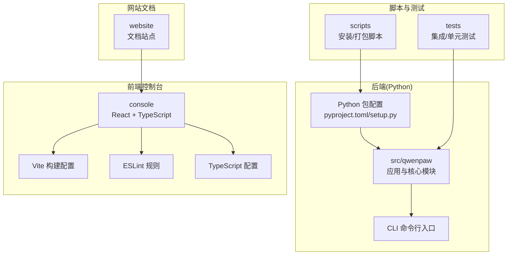
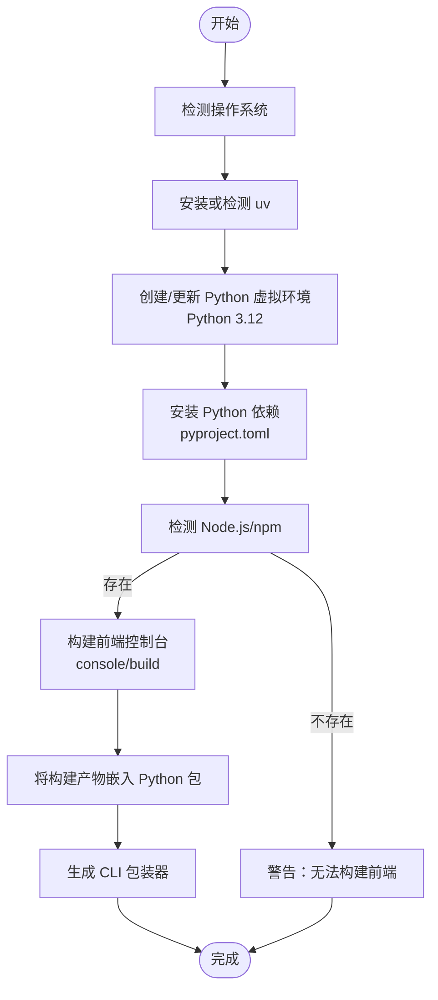
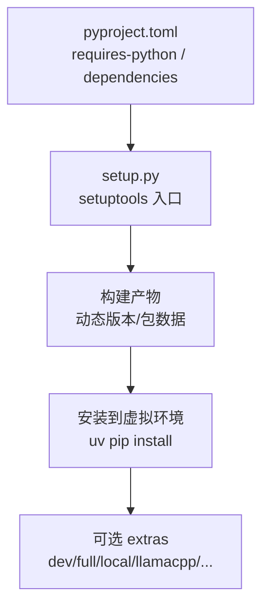
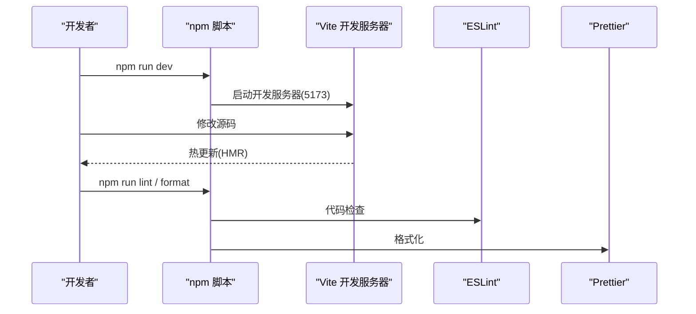
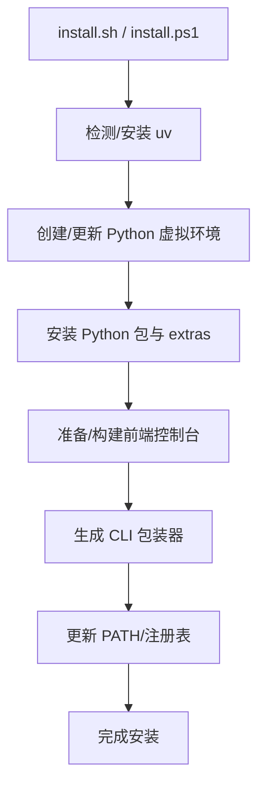
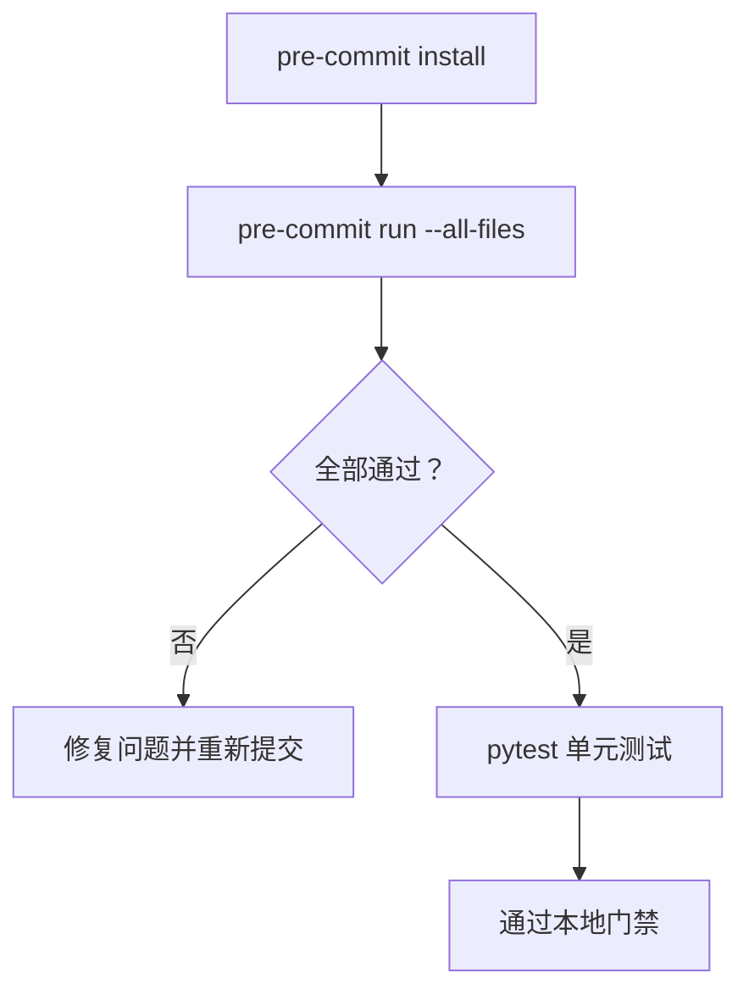
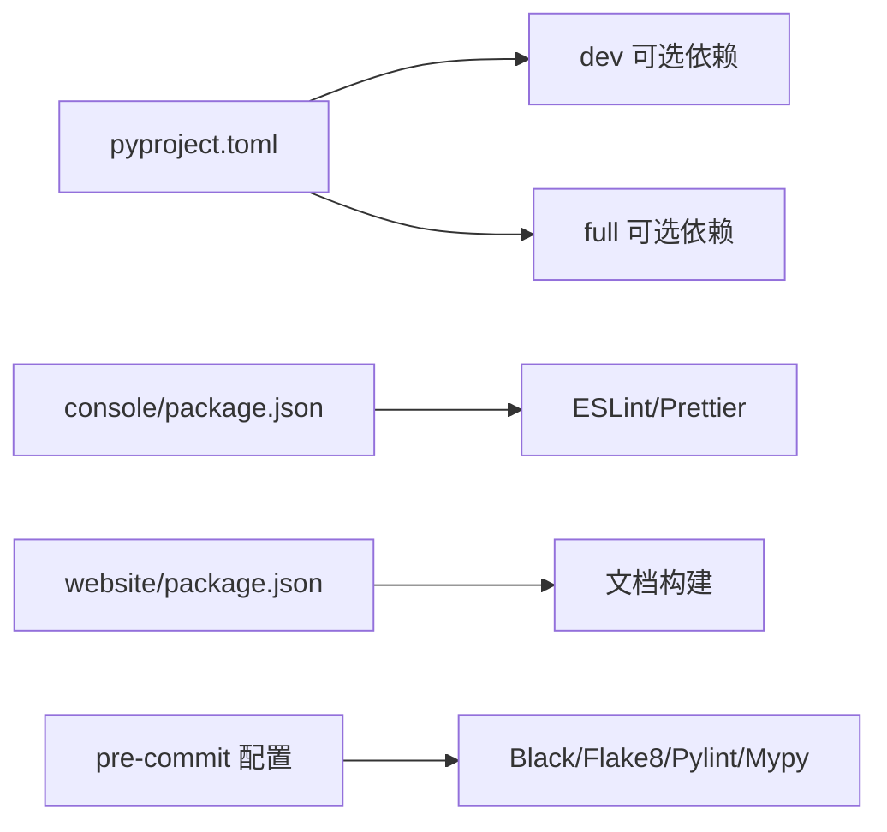

# 开发环境搭建

<cite>
**本文引用的文件**
- [pyproject.toml](file://pyproject.toml)
- [setup.py](file://setup.py)
- [console/package.json](file://console/package.json)
- [website/package.json](file://website/package.json)
- [console/eslint.config.js](file://console/eslint.config.js)
- [console/tsconfig.json](file://console/tsconfig.json)
- [console/vite.config.ts](file://console/vite.config.ts)
- [.flake8](file://.flake8)
- [.pre-commit-config.yaml](file://.pre-commit-config.yaml)
- [scripts/install.sh](file://scripts/install.sh)
- [scripts/install.ps1](file://scripts/install.ps1)
- [README.md](file://README.md)
- [CONTRIBUTING.md](file://CONTRIBUTING.md)
- [src/qwenpaw/__version__.py](file://src/qwenpaw/__version__.py)
- [src/qwenpaw/__main__.py](file://src/qwenpaw/__main__.py)
</cite>

## 目录
1. [简介](#简介)
2. [项目结构](#项目结构)
3. [核心组件](#核心组件)
4. [架构总览](#架构总览)
5. [详细组件分析](#详细组件分析)
6. [依赖关系分析](#依赖关系分析)
7. [性能考虑](#性能考虑)
8. [故障排除指南](#故障排除指南)
9. [结论](#结论)
10. [附录](#附录)

## 简介
本指南面向希望在本地开发与扩展 QwenPaw 技能的开发者，覆盖系统要求、Python 版本兼容性、依赖安装、IDE 配置、代码格式化与调试环境、虚拟环境管理、开发工具链配置、环境验证与常见问题排查，并解释技能开发的目录结构、文件组织规范与命名约定。文档同时提供开发工具推荐、插件配置与工作流优化建议，帮助你快速建立稳定高效的开发环境。

## 项目结构
QwenPaw 采用“后端 Python 包 + 前端控制台 + 网站文档”的多模块布局：
- 后端 Python 包位于 src/qwenpaw，包含应用、CLI、通道、技能、安全扫描、本地模型等子系统。
- 前端控制台位于 console，基于 Vite + React + TypeScript，构建产物嵌入到 Python 包中供运行时使用。
- 网站文档位于 website，用于发布官方文档与示例。
- 脚本目录 scripts 提供跨平台安装脚本与打包脚本。
- 测试位于 tests，包含集成与单元测试。

图表来源
- [pyproject.toml:1-111](file://pyproject.toml#L1-L111)
- [console/vite.config.ts:1-109](file://console/vite.config.ts#L1-L109)
- [console/eslint.config.js:1-29](file://console/eslint.config.js#L1-L29)
- [console/tsconfig.json:1-8](file://console/tsconfig.json#L1-L8)
- [scripts/install.sh:1-340](file://scripts/install.sh#L1-L340)
- [scripts/install.ps1:1-477](file://scripts/install.ps1#L1-L477)

章节来源
- [README.md:1-522](file://README.md#L1-L522)
- [pyproject.toml:1-111](file://pyproject.toml#L1-L111)

## 核心组件
- Python 包与版本要求
  - Python 版本范围：>=3.10,<3.14；推荐 3.12。
  - 使用 setuptools 构建，动态版本由 __version__.py 提供。
- 前端控制台
  - 使用 Vite + React + TypeScript，支持开发、构建、预览与格式化脚本。
  - ESLint + Prettier + TypeScript ESLint 组合进行代码质量与风格约束。
- 安装与运行
  - 提供 install.sh（macOS/Linux）与 install.ps1（Windows）自动安装 uv、创建虚拟环境、安装依赖并生成 CLI 包装器。
- 质量与提交规范
  - pre-commit 集成 Black、flake8、pylint、mypy、Prettier 等工具，统一代码风格与静态检查。
  - 贡献指南定义了提交信息格式与 PR 规范。

章节来源
- [pyproject.toml:6-6](file://pyproject.toml#L6-L6)
- [src/qwenpaw/__version__.py:1-3](file://src/qwenpaw/__version__.py#L1-L3)
- [console/package.json:1-62](file://console/package.json#L1-L62)
- [console/eslint.config.js:1-29](file://console/eslint.config.js#L1-L29)
- [console/tsconfig.json:1-8](file://console/tsconfig.json#L1-L8)
- [scripts/install.sh:30-31](file://scripts/install.sh#L30-L31)
- [scripts/install.ps1:33-34](file://scripts/install.ps1#L33-L34)
- [.pre-commit-config.yaml:1-121](file://.pre-commit-config.yaml#L1-L121)
- [CONTRIBUTING.md:23-67](file://CONTRIBUTING.md#L23-L67)

## 架构总览
下图展示从安装到开发与运行的关键流程，涵盖 Python 与 Node.js 工具链、包管理与构建过程：

图表来源
- [scripts/install.sh:95-134](file://scripts/install.sh#L95-L134)
- [scripts/install.ps1:85-193](file://scripts/install.ps1#L85-L193)
- [console/vite.config.ts:41-48](file://console/vite.config.ts#L41-L48)
- [pyproject.toml:55-65](file://pyproject.toml#L55-L65)

章节来源
- [scripts/install.sh:1-340](file://scripts/install.sh#L1-L340)
- [scripts/install.ps1:1-477](file://scripts/install.ps1#L1-L477)
- [console/vite.config.ts:1-109](file://console/vite.config.ts#L1-L109)

## 详细组件分析

### Python 环境与依赖管理
- Python 版本与兼容性
  - requires-python 指定 >=3.10,<3.14；安装脚本默认使用 3.12。
- 依赖安装方式
  - 推荐使用 uv（自动安装/检测），通过 pip 安装可选 extras（如 llamacpp、mlx、ollama、whisper、full）。
  - 开发模式可安装 dev 与 full 可选依赖集。
- 包构建与分发
  - 使用 setuptools 动态版本与包数据，将 console、agents/skills、tokenizer、security 规则等资源打包进发行包。

图表来源
- [pyproject.toml:6-65](file://pyproject.toml#L6-L65)
- [setup.py:1-5](file://setup.py#L1-L5)
- [src/qwenpaw/__version__.py:1-3](file://src/qwenpaw/__version__.py#L1-L3)

章节来源
- [pyproject.toml:6-111](file://pyproject.toml#L6-L111)
- [setup.py:1-5](file://setup.py#L1-L5)
- [scripts/install.sh:143-241](file://scripts/install.sh#L143-L241)
- [scripts/install.ps1:202-320](file://scripts/install.ps1#L202-L320)

### 前端控制台开发环境
- 构建与开发
  - 支持 dev/build/lint/format 等脚本；Vite 服务器端口 5173，支持别名 @ 指向 src。
  - TypeScript 配置通过引用 app 与 node 两份配置文件组合。
- 代码质量
  - ESLint 使用 TypeScript ESLint 配置，启用 React Hooks 与刷新规则；Prettier 作为统一格式化工具。
- 打包优化
  - Rollup 分包策略按库类别拆分 vendor chunk，便于缓存与加载优化。

图表来源
- [console/package.json:6-16](file://console/package.json#L6-L16)
- [console/vite.config.ts:34-37](file://console/vite.config.ts#L34-L37)
- [console/eslint.config.js:1-29](file://console/eslint.config.js#L1-L29)

章节来源
- [console/package.json:1-62](file://console/package.json#L1-L62)
- [console/tsconfig.json:1-8](file://console/tsconfig.json#L1-L8)
- [console/vite.config.ts:1-109](file://console/vite.config.ts#L1-L109)
- [console/eslint.config.js:1-29](file://console/eslint.config.js#L1-L29)

### 安装脚本与环境初始化
- 自动化安装流程
  - 自动检测/安装 uv；创建 Python 3.12 虚拟环境；安装可选 extras；准备/复制前端构建产物；生成 CLI 包装器；更新 PATH。
- Windows 特性
  - 支持从 astral.sh 或 GitHub Releases 下载 uv；注册表更新 PATH；提供 .ps1 与 .cmd 包装器。
- 验证与提示
  - 检查 CLI 是否就绪；根据是否包含 console 资源提示 Web UI 可用性。

图表来源
- [scripts/install.sh:104-134](file://scripts/install.sh#L104-L134)
- [scripts/install.ps1:121-193](file://scripts/install.ps1#L121-L193)
- [scripts/install.sh:256-277](file://scripts/install.sh#L256-L277)
- [scripts/install.ps1:333-373](file://scripts/install.ps1#L333-L373)

章节来源
- [scripts/install.sh:1-340](file://scripts/install.sh#L1-L340)
- [scripts/install.ps1:1-477](file://scripts/install.ps1#L1-L477)

### 质量门禁与提交规范
- pre-commit 钩子
  - AST 检查、YAML/JSON/XML/TOML 校验、编码与换行处理、私钥检测、尾随空白清理、添加尾随逗号、mypy 类型检查、Black/Flake8/Pylint 静态检查、Prettier 格式化。
- 贡献规范
  - Conventional Commits 提交信息格式；PR 标题格式；本地门禁命令（安装 dev/full、安装 pre-commit、全量检查、pytest）。

图表来源
- [.pre-commit-config.yaml:1-121](file://.pre-commit-config.yaml#L1-L121)
- [CONTRIBUTING.md:70-85](file://CONTRIBUTING.md#L70-L85)

章节来源
- [.pre-commit-config.yaml:1-121](file://.pre-commit-config.yaml#L1-L121)
- [CONTRIBUTING.md:23-67](file://CONTRIBUTING.md#L23-L67)
- [CONTRIBUTING.md:70-85](file://CONTRIBUTING.md#L70-L85)

### 技能开发目录结构与命名约定
- 技能目录
  - built-in 技能位于 src/qwenpaw/agents/skills/<skill_name>/，每个技能以目录形式组织，包含 SKILL.md、references/、scripts/ 等。
- 文档与参考
  - 贡献指南对技能描述的 YAML front matter、触发关键词、最佳实践有明确建议。
- 命名与触发
  - SKILL.md 的 name/description/metadata 等字段用于 Console 识别与触发。

章节来源
- [CONTRIBUTING.md:134-184](file://CONTRIBUTING.md#L134-L184)

## 依赖关系分析
- Python 依赖来源
  - 核心依赖集中在 pyproject.toml 的 dependencies 与 optional-dependencies（dev、local、llamacpp、mlx、ollama、whisper、full）。
- 前端依赖来源
  - console 与 website 的 package.json 定义各自依赖与脚本。
- 质量工具链
  - .pre-commit-config.yaml 统一管理各类静态检查与格式化工具。

图表来源
- [pyproject.toml:75-103](file://pyproject.toml#L75-L103)
- [console/package.json:18-59](file://console/package.json#L18-L59)
- [website/package.json:12-49](file://website/package.json#L12-L49)
- [.pre-commit-config.yaml:54-121](file://.pre-commit-config.yaml#L54-L121)

章节来源
- [pyproject.toml:75-103](file://pyproject.toml#L75-L103)
- [console/package.json:1-62](file://console/package.json#L1-L62)
- [website/package.json:1-51](file://website/package.json#L1-L51)
- [.pre-commit-config.yaml:1-121](file://.pre-commit-config.yaml#L1-L121)

## 性能考虑
- 前端打包分包
  - Vite 配置按库类别拆分 vendor chunk，减少重复下载与提升缓存命中率。
- 依赖版本范围
  - 对部分依赖设置了上限（如 anyio），避免已知问题版本导致的性能退化或异常循环。
- 本地模型支持
  - 提供 llama.cpp、Ollama、LM Studio 等本地推理后端，降低网络延迟与带宽占用。

章节来源
- [console/vite.config.ts:51-102](file://console/vite.config.ts#L51-L102)
- [pyproject.toml:44-46](file://pyproject.toml#L44-L46)

## 故障排除指南
- 安装相关
  - uv 未找到：脚本会尝试自动安装或从 GitHub Releases 下载；Windows 可能因受限语言模式导致注册表写入失败，需手动配置 PATH。
  - 前端构建失败：确认 Node.js/npm 可用；若缺失，安装后重新执行 console 构建。
- Python 环境
  - Python 版本不匹配：确保使用 3.10~3.13；安装脚本默认 3.12。
  - extras 安装失败：检查网络镜像与 extras 名称拼写。
- 质量门禁
  - pre-commit 失败：按提示修复 Black/Flake8/Pylint/mypy/Prettier 问题；必要时先运行格式化脚本。
- 运行与调试
  - 控制台不可用：确认前端构建产物已嵌入包内或手动构建；检查 Vite 开发服务器端口占用。
  - CLI 不可用：确认包装器路径已加入 PATH 并在新终端生效。

章节来源
- [scripts/install.sh:104-134](file://scripts/install.sh#L104-L134)
- [scripts/install.ps1:121-193](file://scripts/install.ps1#L121-L193)
- [scripts/install.sh:187-206](file://scripts/install.sh#L187-L206)
- [scripts/install.ps1:244-271](file://scripts/install.ps1#L244-L271)
- [.pre-commit-config.yaml:54-121](file://.pre-commit-config.yaml#L54-L121)
- [console/vite.config.ts:34-37](file://console/vite.config.ts#L34-L37)

## 结论
通过本指南，你可以基于 uv 与 Python 3.12 快速搭建 QwenPaw 开发环境，完成前端与后端依赖安装、质量门禁配置与本地运行验证。遵循贡献规范与技能开发约定，结合分包优化与本地模型支持，可获得稳定高效的开发体验。

## 附录

### A. 系统要求与兼容性
- 操作系统
  - macOS/Linux：install.sh 支持。
  - Windows：install.ps1 支持，受限语言模式下需手动配置 PATH。
- Python
  - 版本范围：>=3.10,<3.14；默认 3.12。
- Node.js
  - 建议安装 LTS 版本以保证前端构建稳定性。

章节来源
- [scripts/install.sh:95-100](file://scripts/install.sh#L95-L100)
- [scripts/install.ps1:68-83](file://scripts/install.ps1#L68-L83)
- [scripts/install.sh:30-31](file://scripts/install.sh#L30-L31)
- [scripts/install.ps1:33-34](file://scripts/install.ps1#L33-L34)

### B. 依赖安装步骤（推荐）
- macOS/Linux
  - 使用 install.sh 安装 uv、创建虚拟环境、安装包与 extras（如需要），并生成包装器。
- Windows
  - 使用 install.ps1 安装 uv、创建虚拟环境、安装包与 extras，并生成 .ps1/.cmd 包装器。
- 开发模式
  - 安装 dev 与 full 可选依赖，启用完整质量门禁与测试套件。

章节来源
- [scripts/install.sh:233-241](file://scripts/install.sh#L233-L241)
- [scripts/install.ps1:313-320](file://scripts/install.ps1#L313-L320)
- [pyproject.toml:75-103](file://pyproject.toml#L75-L103)

### C. IDE 配置与调试环境
- Python
  - 使用 Python 3.12 解释器；启用虚拟环境；安装并配置 lint/format 工具（Black、flake8、pylint、mypy）。
- 前端
  - VS Code 推荐插件：ESLint、Prettier、TypeScript TSServer、Bracket Pair Colorizer。
  - 在项目根目录打开，确保 Vite 开发服务器端口 5173 可用。
- 调试
  - Python：通过 CLI 命令启动应用；可在 IDE 中附加调试器。
  - 前端：使用浏览器开发者工具调试 React 组件与状态。

章节来源
- [console/eslint.config.js:1-29](file://console/eslint.config.js#L1-L29)
- [console/tsconfig.json:1-8](file://console/tsconfig.json#L1-L8)
- [console/vite.config.ts:34-37](file://console/vite.config.ts#L34-L37)

### D. 开发工具链与工作流
- 本地门禁
  - 安装 dev/full 依赖后，执行：pre-commit install；pre-commit run --all-files；pytest。
- 前端格式化
  - 在 console 与 website 目录分别执行格式化脚本。
- 提交信息
  - 遵循 Conventional Commits；PR 标题格式与内容清晰简洁。

章节来源
- [CONTRIBUTING.md:70-85](file://CONTRIBUTING.md#L70-L85)
- [CONTRIBUTING.md:23-67](file://CONTRIBUTING.md#L23-L67)

### E. 环境验证方法
- Python
  - 验证版本与包安装：python --version；qwenpaw --help。
- 前端
  - 验证控制台可用：npm run dev 后访问 http://127.0.0.1:5173；或构建后检查 console 输出目录。
- 质量
  - 运行 pre-commit 与 pytest，确保无告警。

章节来源
- [scripts/install.sh:243-245](file://scripts/install.sh#L243-L245)
- [scripts/install.ps1:322-324](file://scripts/install.ps1#L322-L324)
- [console/vite.config.ts:34-37](file://console/vite.config.ts#L34-L37)
- [.pre-commit-config.yaml:54-121](file://.pre-commit-config.yaml#L54-L121)