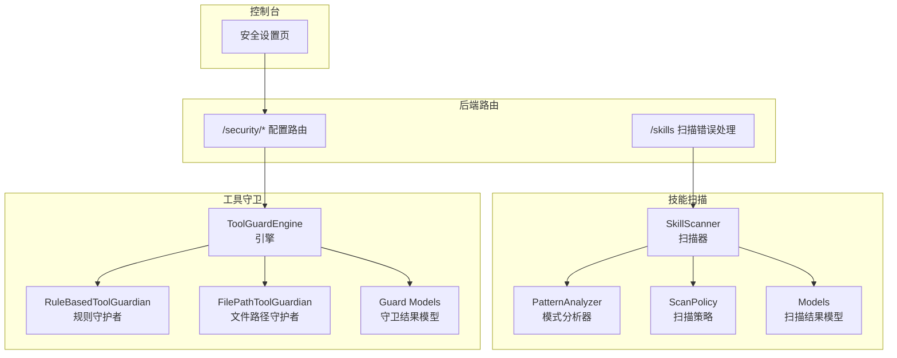
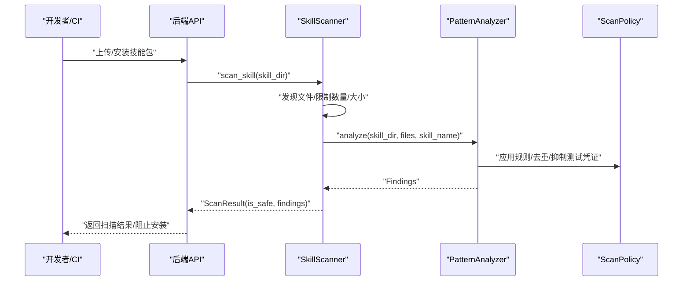
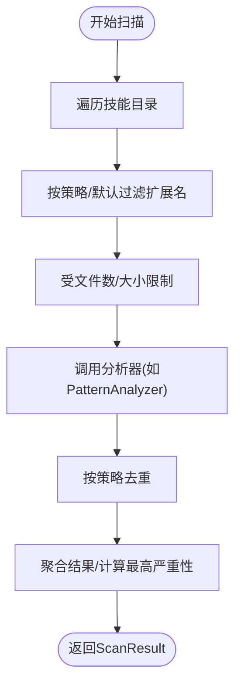
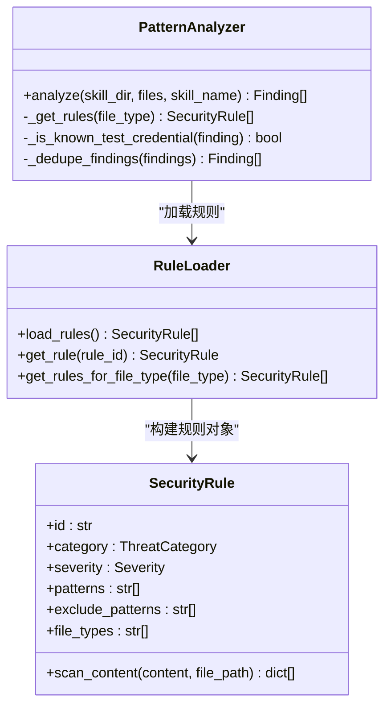
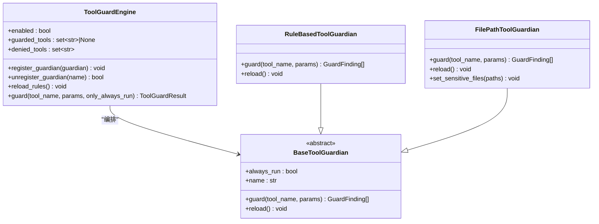
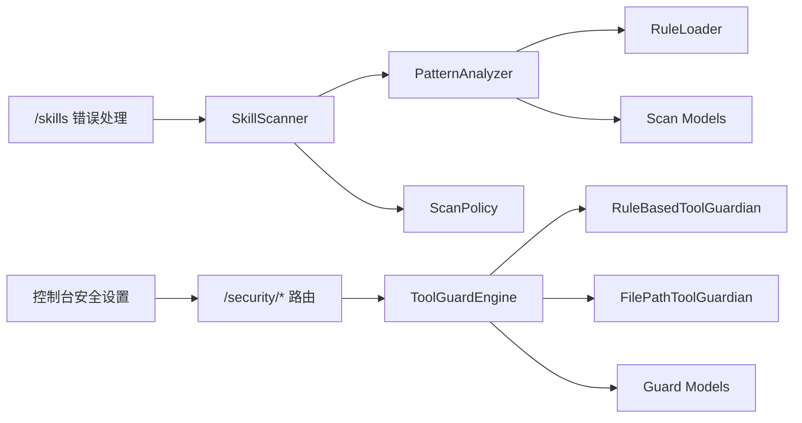

# 安全扫描

<cite>
**本文引用的文件**
- [src/qwenpaw/security/skill_scanner/__init__.py](file://src/qwenpaw/security/skill_scanner/__init__.py)
- [src/qwenpaw/security/skill_scanner/scanner.py](file://src/qwenpaw/security/skill_scanner/scanner.py)
- [src/qwenpaw/security/skill_scanner/models.py](file://src/qwenpaw/security/skill_scanner/models.py)
- [src/qwenpaw/security/skill_scanner/scan_policy.py](file://src/qwenpaw/security/skill_scanner/scan_policy.py)
- [src/qwenpaw/security/skill_scanner/data/default_policy.yaml](file://src/qwenpaw/security/skill_scanner/data/default_policy.yaml)
- [src/qwenpaw/security/skill_scanner/analyzers/pattern_analyzer.py](file://src/qwenpaw/security/skill_scanner/analyzers/pattern_analyzer.py)
- [src/qwenpaw/security/tool_guard/engine.py](file://src/qwenpaw/security/tool_guard/engine.py)
- [src/qwenpaw/security/tool_guard/guardians/rule_guardian.py](file://src/qwenpaw/security/tool_guard/guardians/rule_guardian.py)
- [src/qwenpaw/security/tool_guard/guardians/file_guardian.py](file://src/qwenpaw/security/tool_guard/guardians/file_guardian.py)
- [src/qwenpaw/security/tool_guard/models.py](file://src/qwenpaw/security/tool_guard/models.py)
- [src/qwenpaw/security/tool_guard/rules/dangerous_shell_commands.yaml](file://src/qwenpaw/security/tool_guard/rules/dangerous_shell_commands.yaml)
- [src/qwenpaw/app/routers/config.py](file://src/qwenpaw/app/routers/config.py)
- [src/qwenpaw/app/routers/skills.py](file://src/qwenpaw/app/routers/skills.py)
- [console/src/pages/Settings/Security/index.tsx](file://console/src/pages/Settings/Security/index.tsx)
- [website/public/docs/security.en.md](file://website/public/docs/security.en.md)
</cite>

## 目录
1. [简介](#简介)
2. [项目结构](#项目结构)
3. [核心组件](#核心组件)
4. [架构总览](#架构总览)
5. [组件详解](#组件详解)
6. [依赖关系分析](#依赖关系分析)
7. [性能与可扩展性](#性能与可扩展性)
8. [故障排查与异常处理](#故障排查与异常处理)
9. [结论](#结论)
10. [附录](#附录)

## 简介
本指南面向QwenPaw技能安全扫描系统，覆盖技能扫描器与工具守卫两大子系统。技能扫描器用于在技能安装前进行静态规则扫描，识别潜在威胁；工具守卫则在运行时对工具调用参数进行实时防护，阻断高危行为。本文将从工作原理、规则配置、威胁检测算法、工具守卫机制、文件访问控制策略、危险命令识别规则、扫描策略配置、自定义规则添加、扫描结果解读、安全策略管理、权限验证流程、异常处理机制、安全审计日志分析、漏洞修复建议、安全合规检查清单、CI/CD安全集成与自动化安全测试等方面进行全面说明。

## 项目结构
安全相关代码主要分布在以下模块：
- 技能安全扫描：security/skill_scanner（扫描器、策略、规则加载、模型）
- 工具守卫：security/tool_guard（引擎、规则守护者、文件守护者、模型）
- 控制台安全设置页面：console/pages/Settings/Security
- 后端配置路由：app/routers/config.py、app/routers/skills.py
- 官方文档：website/public/docs/security.en.md

图示来源
- [src/qwenpaw/security/skill_scanner/scanner.py:76-242](file://src/qwenpaw/security/skill_scanner/scanner.py#L76-L242)
- [src/qwenpaw/security/skill_scanner/analyzers/pattern_analyzer.py:236-347](file://src/qwenpaw/security/skill_scanner/analyzers/pattern_analyzer.py#L236-L347)
- [src/qwenpaw/security/skill_scanner/scan_policy.py:156-178](file://src/qwenpaw/security/skill_scanner/scan_policy.py#L156-L178)
- [src/qwenpaw/security/skill_scanner/models.py:168-235](file://src/qwenpaw/security/skill_scanner/models.py#L168-L235)
- [src/qwenpaw/security/tool_guard/engine.py:53-227](file://src/qwenpaw/security/tool_guard/engine.py#L53-L227)
- [src/qwenpaw/security/tool_guard/guardians/rule_guardian.py:559-758](file://src/qwenpaw/security/tool_guard/guardians/rule_guardian.py#L559-L758)
- [src/qwenpaw/security/tool_guard/guardians/file_guardian.py:184-365](file://src/qwenpaw/security/tool_guard/guardians/file_guardian.py#L184-L365)
- [src/qwenpaw/security/tool_guard/models.py:103-185](file://src/qwenpaw/security/tool_guard/models.py#L103-L185)
- [src/qwenpaw/app/routers/config.py:400-599](file://src/qwenpaw/app/routers/config.py#L400-L599)
- [src/qwenpaw/app/routers/skills.py:68-108](file://src/qwenpaw/app/routers/skills.py#L68-L108)
- [console/src/pages/Settings/Security/index.tsx:360-438](file://console/src/pages/Settings/Security/index.tsx#L360-L438)

章节来源
- [src/qwenpaw/security/skill_scanner/__init__.py:1-513](file://src/qwenpaw/security/skill_scanner/__init__.py#L1-L513)
- [src/qwenpaw/security/tool_guard/engine.py:1-238](file://src/qwenpaw/security/tool_guard/engine.py#L1-L238)
- [src/qwenpaw/app/routers/config.py:400-599](file://src/qwenpaw/app/routers/config.py#L400-L599)
- [console/src/pages/Settings/Security/index.tsx:360-438](file://console/src/pages/Settings/Security/index.tsx#L360-L438)

## 核心组件
- 技能扫描器（SkillScanner）：遍历技能目录，发现文件并交由注册的分析器扫描，聚合结果生成ScanResult。
- 模式分析器（PatternAnalyzer）：基于YAML签名规则进行正则匹配，支持行级与多行匹配，并按策略过滤与去重。
- 扫描策略（ScanPolicy）：组织隐藏文件、规则作用域、凭证抑制、文件分类、阈值、严重性覆盖与禁用规则等。
- 工具守卫引擎（ToolGuardEngine）：统一编排规则守护者与文件守护者，对工具调用参数进行实时检查。
- 规则守护者（RuleBasedToolGuardian）：加载YAML规则，对execute_shell_command等工具参数执行正则匹配与增强提示。
- 文件守护者（FilePathToolGuardian）：基于敏感路径白名单/黑名单，拦截对敏感文件/目录的访问。
- 守卫模型（GuardFinding/ToolGuardResult）：描述发现项与守卫结果，含严重性、类别、修复建议等。
- 扫描模型（Finding/ScanResult）：描述扫描发现项与扫描结果，含最高严重性、分析器使用情况等。

章节来源
- [src/qwenpaw/security/skill_scanner/scanner.py:76-242](file://src/qwenpaw/security/skill_scanner/scanner.py#L76-L242)
- [src/qwenpaw/security/skill_scanner/analyzers/pattern_analyzer.py:236-347](file://src/qwenpaw/security/skill_scanner/analyzers/pattern_analyzer.py#L236-L347)
- [src/qwenpaw/security/skill_scanner/scan_policy.py:156-178](file://src/qwenpaw/security/skill_scanner/scan_policy.py#L156-L178)
- [src/qwenpaw/security/skill_scanner/models.py:168-235](file://src/qwenpaw/security/skill_scanner/models.py#L168-L235)
- [src/qwenpaw/security/tool_guard/engine.py:53-227](file://src/qwenpaw/security/tool_guard/engine.py#L53-L227)
- [src/qwenpaw/security/tool_guard/guardians/rule_guardian.py:559-758](file://src/qwenpaw/security/tool_guard/guardians/rule_guardian.py#L559-L758)
- [src/qwenpaw/security/tool_guard/guardians/file_guardian.py:184-365](file://src/qwenpaw/security/tool_guard/guardians/file_guardian.py#L184-L365)
- [src/qwenpaw/security/tool_guard/models.py:103-185](file://src/qwenpaw/security/tool_guard/models.py#L103-L185)

## 架构总览
技能扫描与工具守卫分别在“安装前”和“运行时”两个阶段提供安全保障。扫描器负责静态规则扫描，工具守卫负责动态参数校验与路径拦截。

图示来源
- [src/qwenpaw/security/skill_scanner/scanner.py:148-242](file://src/qwenpaw/security/skill_scanner/scanner.py#L148-L242)
- [src/qwenpaw/security/skill_scanner/analyzers/pattern_analyzer.py:265-347](file://src/qwenpaw/security/skill_scanner/analyzers/pattern_analyzer.py#L265-L347)
- [src/qwenpaw/security/skill_scanner/scan_policy.py:183-231](file://src/qwenpaw/security/skill_scanner/scan_policy.py#L183-L231)

章节来源
- [src/qwenpaw/security/skill_scanner/__init__.py:1-513](file://src/qwenpaw/security/skill_scanner/__init__.py#L1-L513)
- [src/qwenpaw/app/routers/skills.py:68-108](file://src/qwenpaw/app/routers/skills.py#L68-L108)

## 组件详解

### 技能扫描器（SkillScanner）
- 文件发现：递归遍历技能目录，跳过符号链接与越界文件，按策略与默认集合过滤扩展名，受最大文件数与单文件大小限制。
- 分析器执行：依次调用已注册分析器（默认仅PatternAnalyzer），捕获失败并记录。
- 结果聚合：去重（可配置）、统计最高严重性、记录分析器使用与失败信息。

图示来源
- [src/qwenpaw/security/skill_scanner/scanner.py:248-299](file://src/qwenpaw/security/skill_scanner/scanner.py#L248-L299)
- [src/qwenpaw/security/skill_scanner/scanner.py:194-242](file://src/qwenpaw/security/skill_scanner/scanner.py#L194-L242)

章节来源
- [src/qwenpaw/security/skill_scanner/scanner.py:76-242](file://src/qwenpaw/security/skill_scanner/scanner.py#L76-L242)

### 模式分析器（PatternAnalyzer）
- 规则加载：从rules/signatures目录加载YAML规则，预编译正则与排除正则。
- 内容扫描：先逐行匹配，再对包含换行的模式进行全文匹配；支持按文件类型筛选规则。
- 策略集成：应用策略中的禁用规则、严重性覆盖、文档路径跳过、代码类规则限制、测试凭证抑制与去重。

图示来源
- [src/qwenpaw/security/skill_scanner/analyzers/pattern_analyzer.py:236-347](file://src/qwenpaw/security/skill_scanner/analyzers/pattern_analyzer.py#L236-L347)
- [src/qwenpaw/security/skill_scanner/analyzers/pattern_analyzer.py:38-84](file://src/qwenpaw/security/skill_scanner/analyzers/pattern_analyzer.py#L38-L84)
- [src/qwenpaw/security/skill_scanner/analyzers/pattern_analyzer.py:163-229](file://src/qwenpaw/security/skill_scanner/analyzers/pattern_analyzer.py#L163-L229)

章节来源
- [src/qwenpaw/security/skill_scanner/analyzers/pattern_analyzer.py:1-393](file://src/qwenpaw/security/skill_scanner/analyzers/pattern_analyzer.py#L1-L393)

### 扫描策略（ScanPolicy）
- 隐藏文件：定义可视为无害的点文件/点目录。
- 规则作用域：文档路径跳过、仅代码文件触发、规则去重开关等。
- 凭证抑制：已知测试值与占位符标记，自动抑制误报。
- 文件分类：惰性文件、结构化文件、归档文件、代码文件扩展名集合。
- 阈值与限制：最大文件数、单文件大小、参考深度、名称/描述长度范围。
- 严重性覆盖与禁用规则：按规则ID覆盖严重性，或完全禁用规则。

章节来源
- [src/qwenpaw/security/skill_scanner/scan_policy.py:74-178](file://src/qwenpaw/security/skill_scanner/scan_policy.py#L74-L178)
- [src/qwenpaw/security/skill_scanner/data/default_policy.yaml:1-243](file://src/qwenpaw/security/skill_scanner/data/default_policy.yaml#L1-L243)

### 工具守卫引擎（ToolGuardEngine）
- 默认守护者：文件路径守护者（始终运行）、规则守护者（按需运行）。
- 运行控制：支持通过环境变量与配置控制启用状态，动态重载规则与工具集。
- 结果聚合：收集各守护者发现项，记录使用与失败的守护者列表。

图示来源
- [src/qwenpaw/security/tool_guard/engine.py:53-227](file://src/qwenpaw/security/tool_guard/engine.py#L53-L227)
- [src/qwenpaw/security/tool_guard/guardians/rule_guardian.py:559-758](file://src/qwenpaw/security/tool_guard/guardians/rule_guardian.py#L559-L758)
- [src/qwenpaw/security/tool_guard/guardians/file_guardian.py:184-365](file://src/qwenpaw/security/tool_guard/guardians/file_guardian.py#L184-L365)

章节来源
- [src/qwenpaw/security/tool_guard/engine.py:1-238](file://src/qwenpaw/security/tool_guard/engine.py#L1-L238)

### 规则守护者（RuleBasedToolGuardian）
- 规则来源：内置YAML规则目录与配置中自定义规则，支持禁用规则ID。
- 匹配逻辑：将参数值转字符串后按规则匹配，支持排除正则；对特定规则（如rm命令）进行增强提示与工作区外路径检测。
- 输出：生成带严重性、类别、修复建议与元数据的守卫发现项。

章节来源
- [src/qwenpaw/security/tool_guard/guardians/rule_guardian.py:1-758](file://src/qwenpaw/security/tool_guard/guardians/rule_guardian.py#L1-L758)
- [src/qwenpaw/security/tool_guard/rules/dangerous_shell_commands.yaml:1-187](file://src/qwenpaw/security/tool_guard/rules/dangerous_shell_commands.yaml#L1-L187)

### 文件守护者（FilePathToolGuardian）
- 敏感路径：从配置加载敏感文件/目录列表，支持兼容历史路径。
- 路径提取：针对execute_shell_command提取重定向目标与路径令牌；对其他工具扫描字符串参数。
- 拦截策略：命中即生成高危发现项，提供修复建议与解析后的绝对路径。

章节来源
- [src/qwenpaw/security/tool_guard/guardians/file_guardian.py:1-365](file://src/qwenpaw/security/tool_guard/guardians/file_guardian.py#L1-L365)

### 扫描结果与守卫结果模型
- 扫描结果（ScanResult）：包含技能名、目录、发现项、耗时、分析器使用/失败、时间戳等；提供最高严重性与按严重性/类别的查询。
- 守卫结果（ToolGuardResult）：包含工具名、参数、发现项、耗时、守护者使用/失败、时间戳等；提供最高严重性与计数。

章节来源
- [src/qwenpaw/security/skill_scanner/models.py:168-235](file://src/qwenpaw/security/skill_scanner/models.py#L168-L235)
- [src/qwenpaw/security/tool_guard/models.py:103-185](file://src/qwenpaw/security/tool_guard/models.py#L103-L185)

## 依赖关系分析
- 技能扫描器依赖扫描策略与模式分析器；模式分析器依赖规则加载器与威胁类别枚举。
- 工具守卫引擎依赖规则守护者与文件守护者；两者均依赖守卫模型与威胁类别枚举。
- 后端路由提供安全配置接口与技能扫描错误标准化输出。
- 控制台安全设置页提供UI入口以更新安全配置。

图示来源
- [src/qwenpaw/security/skill_scanner/scanner.py:100-134](file://src/qwenpaw/security/skill_scanner/scanner.py#L100-L134)
- [src/qwenpaw/security/skill_scanner/analyzers/pattern_analyzer.py:249-258](file://src/qwenpaw/security/skill_scanner/analyzers/pattern_analyzer.py#L249-L258)
- [src/qwenpaw/security/tool_guard/engine.py:65-78](file://src/qwenpaw/security/tool_guard/engine.py#L65-L78)
- [src/qwenpaw/app/routers/config.py:400-599](file://src/qwenpaw/app/routers/config.py#L400-L599)
- [src/qwenpaw/app/routers/skills.py:68-108](file://src/qwenpaw/app/routers/skills.py#L68-L108)
- [console/src/pages/Settings/Security/index.tsx:360-438](file://console/src/pages/Settings/Security/index.tsx#L360-L438)

章节来源
- [src/qwenpaw/security/skill_scanner/__init__.py:1-513](file://src/qwenpaw/security/skill_scanner/__init__.py#L1-L513)
- [src/qwenpaw/security/tool_guard/engine.py:1-238](file://src/qwenpaw/security/tool_guard/engine.py#L1-L238)

## 性能与可扩展性
- 并发与超时：技能扫描采用线程池并发执行，支持超时控制，避免长时间阻塞。
- 去重与抑制：策略支持去重与测试凭证抑制，减少重复与噪声。
- 规则编译：规则与排除正则预编译，提升匹配效率。
- 可扩展点：扫描器与引擎均支持注册新的分析器/守护者，便于引入LLM分析器或新类型的守护者。

章节来源
- [src/qwenpaw/security/skill_scanner/__init__.py:474-513](file://src/qwenpaw/security/skill_scanner/__init__.py#L474-L513)
- [src/qwenpaw/security/skill_scanner/analyzers/pattern_analyzer.py:67-83](file://src/qwenpaw/security/skill_scanner/analyzers/pattern_analyzer.py#L67-L83)
- [src/qwenpaw/security/tool_guard/engine.py:108-117](file://src/qwenpaw/security/tool_guard/engine.py#L108-L117)

## 故障排查与异常处理
- 技能扫描异常：当扫描结果不安全且启用阻断时抛出SkillScanError，包含最高严重性与前N条发现摘要；未阻断时记录警告并继续。
- 扫描错误API：将扫描异常标准化为稳定的API响应体，包含类型、详情、技能名、最高严重性与发现列表。
- 守卫失败：引擎记录守护者失败信息并继续执行其他守护者，保证整体可用性。
- 路径边界：扫描器严格处理符号链接与越界文件，防止路径穿越攻击。

章节来源
- [src/qwenpaw/security/skill_scanner/__init__.py:402-422](file://src/qwenpaw/security/skill_scanner/__init__.py#L402-L422)
- [src/qwenpaw/app/routers/skills.py:68-108](file://src/qwenpaw/app/routers/skills.py#L68-L108)
- [src/qwenpaw/security/skill_scanner/scanner.py:257-278](file://src/qwenpaw/security/skill_scanner/scanner.py#L257-L278)
- [src/qwenpaw/security/tool_guard/engine.py:214-223](file://src/qwenpaw/security/tool_guard/engine.py#L214-L223)

## 结论
QwenPaw安全扫描系统通过“安装前静态扫描”与“运行时动态守卫”的双层防护，有效降低技能引入与工具调用带来的安全风险。扫描策略与规则体系具备良好的可定制性与可扩展性，结合控制台与API的配置能力，能够满足不同组织的安全基线要求。

## 附录

### 扫描策略配置与自定义规则添加
- 扫描策略（ScanPolicy）
  - 隐藏文件：配置可视为无害的点文件/点目录。
  - 规则作用域：控制规则在文档路径、仅代码文件等场景下的触发行为。
  - 凭证抑制：配置测试值与占位符标记，自动抑制误报。
  - 文件分类：定义惰性/结构化/归档/代码扩展名集合。
  - 阈值与限制：设置最大文件数、单文件大小、名称/描述长度等。
  - 严重性覆盖与禁用规则：按规则ID覆盖严重性或禁用规则。
- 自定义规则（技能扫描）
  - 在rules/signatures目录新增YAML规则文件，遵循SecurityRule格式（ID、类别、严重性、正则、排除正则、文件类型等）。
  - 使用策略中的disabled_rules与severity_overrides进行全局控制。
- 自定义规则（工具守卫）
  - 在rules/dangerous_shell_commands.yaml中新增规则，或通过配置中的custom_rules注入。
  - 支持禁用规则ID（disabled_rules）与立即生效的重载（reload_rules）。

章节来源
- [src/qwenpaw/security/skill_scanner/scan_policy.py:156-178](file://src/qwenpaw/security/skill_scanner/scan_policy.py#L156-L178)
- [src/qwenpaw/security/skill_scanner/data/default_policy.yaml:1-243](file://src/qwenpaw/security/skill_scanner/data/default_policy.yaml#L1-L243)
- [src/qwenpaw/security/skill_scanner/analyzers/pattern_analyzer.py:163-229](file://src/qwenpaw/security/skill_scanner/analyzers/pattern_analyzer.py#L163-L229)
- [src/qwenpaw/security/tool_guard/guardians/rule_guardian.py:518-551](file://src/qwenpaw/security/tool_guard/guardians/rule_guardian.py#L518-L551)
- [src/qwenpaw/security/tool_guard/rules/dangerous_shell_commands.yaml:1-187](file://src/qwenpaw/security/tool_guard/rules/dangerous_shell_commands.yaml#L1-L187)

### 危险命令识别规则（工具守卫）
- rm/mv：文件/目录删除与移动，可能造成数据丢失。
- 系统破坏：mkfs/dd、重定向到块设备等低层破坏命令。
- 拒绝服务与炸弹：经典fork炸弹与mass process termination。
- 下载并执行：curl/wget管道至shell。
- 反向连接与隧道：nc/ncat/socat反连与exec隧道。
- 权限篡改与提权：chmod/chattr、sudo/su/doas/pkexec/runas。
- 隐蔽与规避：base64编码后直接执行。
- 系统重启/关机/服务管理：reboot/shutdown/systemctl等。
- 进程终止：pkill/killall/kill/taskkill/Stop-Process等。

章节来源
- [src/qwenpaw/security/tool_guard/rules/dangerous_shell_commands.yaml:1-187](file://src/qwenpaw/security/tool_guard/rules/dangerous_shell_commands.yaml#L1-L187)

### 文件访问控制策略（文件守护者）
- 敏感路径：从配置加载敏感文件/目录列表，默认保护秘密目录。
- 路径提取：针对execute_shell_command提取重定向目标与路径令牌；对其他工具扫描字符串参数。
- 递归保护：以斜杠结尾的路径作为目录，递归阻断其下所有文件。
- 强制阻断：命中即生成高危发现项，提供修复建议与解析后的绝对路径。

章节来源
- [src/qwenpaw/security/tool_guard/guardians/file_guardian.py:184-365](file://src/qwenpaw/security/tool_guard/guardians/file_guardian.py#L184-L365)

### 扫描结果解读方法
- 最高严重性：根据CRITICAL/HIGH/MEDIUM/LOW/INFO排序，取最高级别。
- 发现项字段：包含规则ID、类别、严重性、标题、描述、文件路径、行号、片段、修复建议、分析器与元数据。
- 去重与抑制：策略可去重相同规则/文件/行的重复发现，并抑制测试凭证误报。

章节来源
- [src/qwenpaw/security/skill_scanner/models.py:186-219](file://src/qwenpaw/security/skill_scanner/models.py#L186-L219)
- [src/qwenpaw/security/skill_scanner/analyzers/pattern_analyzer.py:338-346](file://src/qwenpaw/security/skill_scanner/analyzers/pattern_analyzer.py#L338-L346)

### 安全策略管理与权限验证流程
- 策略管理：通过后端路由获取/更新工具守卫与文件守卫配置，支持内置规则列表、敏感路径列表、启用状态切换与规则重载。
- 权限验证：控制台安全设置页提供保存/重置按钮，变更即时生效（无需重启）。
- 白名单与阻断历史：支持技能扫描白名单增删与阻断历史查看/清理。

章节来源
- [src/qwenpaw/app/routers/config.py:400-599](file://src/qwenpaw/app/routers/config.py#L400-L599)
- [console/src/pages/Settings/Security/index.tsx:360-438](file://console/src/pages/Settings/Security/index.tsx#L360-L438)

### 安全审计日志分析
- 日志记录：扫描器与引擎均记录关键事件（发现、失败、超时、阻断）。
- 审计字段：守卫结果包含工具名、参数快照、发现项、耗时、守护者使用/失败、时间戳；扫描结果包含分析器使用/失败、耗时、时间戳。
- 历史管理：技能扫描阻断历史可查询与清理。

章节来源
- [src/qwenpaw/security/skill_scanner/scanner.py:204-213](file://src/qwenpaw/security/skill_scanner/scanner.py#L204-L213)
- [src/qwenpaw/security/tool_guard/engine.py:214-223](file://src/qwenpaw/security/tool_guard/engine.py#L214-L223)
- [src/qwenpaw/app/routers/config.py:549-583](file://src/qwenpaw/app/routers/config.py#L549-L583)

### 漏洞修复建议
- 静态扫描
  - 移除硬编码凭据，使用受控密钥存储。
  - 重构易被命令注入的脚本，避免拼接用户输入。
  - 限制文件/目录操作权限，避免全局权限修改。
- 运行时防护
  - 对execute_shell_command增加参数校验与沙箱隔离。
  - 将敏感文件/目录加入文件守护者黑名单。
  - 针对高危规则（如rm、chmod 777、sudo）建立审批流程。

章节来源
- [src/qwenpaw/security/skill_scanner/analyzers/pattern_analyzer.py:338-346](file://src/qwenpaw/security/skill_scanner/analyzers/pattern_analyzer.py#L338-L346)
- [src/qwenpaw/security/tool_guard/rules/dangerous_shell_commands.yaml:1-187](file://src/qwenpaw/security/tool_guard/rules/dangerous_shell_commands.yaml#L1-L187)
- [website/public/docs/security.en.md:38-231](file://website/public/docs/security.en.md#L38-L231)

### 安全合规检查清单
- 配置层面
  - 工具守卫启用状态与规则集完整（内置+自定义）。
  - 文件守护者启用并配置敏感路径列表。
  - 扫描策略符合组织基线（隐藏文件、规则作用域、阈值、严重性覆盖）。
- 行为层面
  - 未在代码中出现硬编码凭据、特权命令、系统破坏命令。
  - 未使用隐晦编码或管道下载执行模式。
  - 未对系统关键文件/目录进行删除/修改操作。
- 流程层面
  - 新增/变更规则后及时重载并验证效果。
  - 定期审查阻断历史与告警趋势，优化规则与阈值。

章节来源
- [src/qwenpaw/app/routers/config.py:400-599](file://src/qwenpaw/app/routers/config.py#L400-L599)
- [src/qwenpaw/security/skill_scanner/data/default_policy.yaml:1-243](file://src/qwenpaw/security/skill_scanner/data/default_policy.yaml#L1-L243)
- [website/public/docs/security.en.md:38-231](file://website/public/docs/security.en.md#L38-L231)

### CI/CD安全集成与自动化安全测试
- CI集成
  - 在构建流水线中调用技能扫描API，阻断高危/严重发现。
  - 将扫描结果与报告上传至制品库或安全平台。
- 自动化测试
  - 编写单元测试覆盖关键规则与策略场景。
  - 使用模拟输入验证工具守卫对危险命令的拦截效果。
- 安全事件响应
  - 建立阻断告警通知与处置流程。
  - 对高危规则发现进行人工复核与修复闭环。

章节来源
- [src/qwenpaw/app/routers/skills.py:68-108](file://src/qwenpaw/app/routers/skills.py#L68-L108)
- [website/public/docs/security.en.md:38-231](file://website/public/docs/security.en.md#L38-L231)