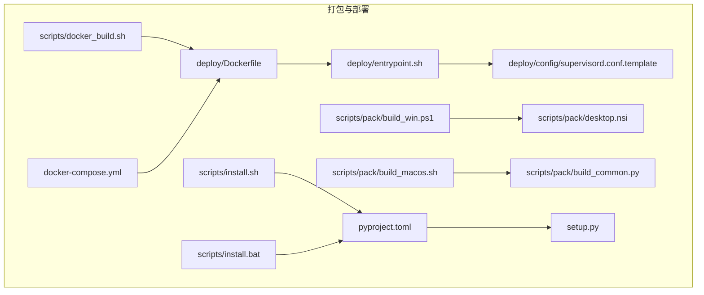
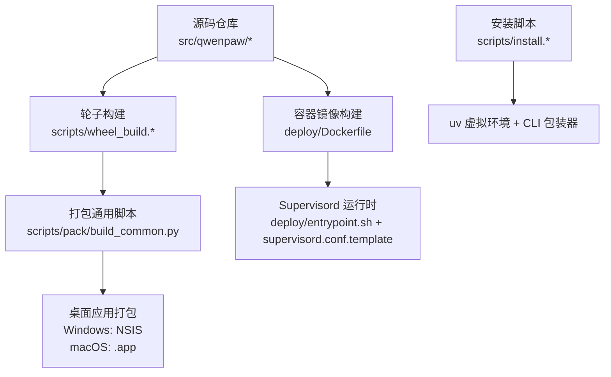
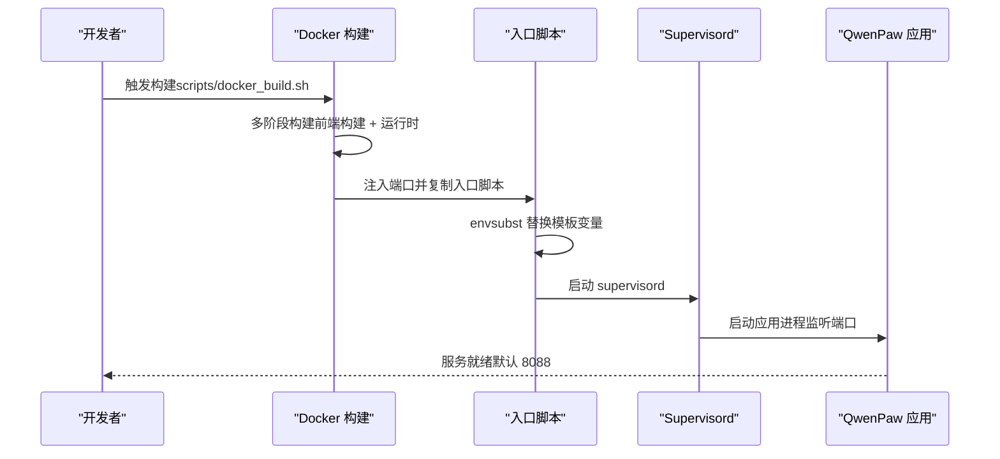
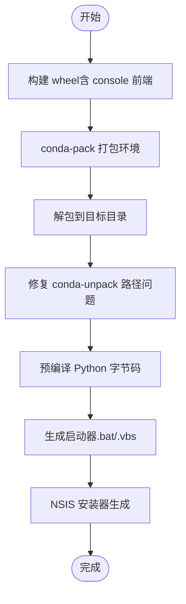
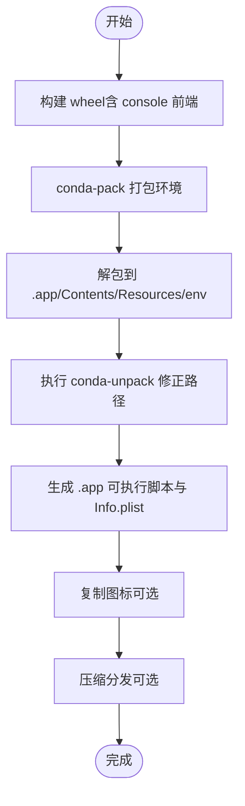
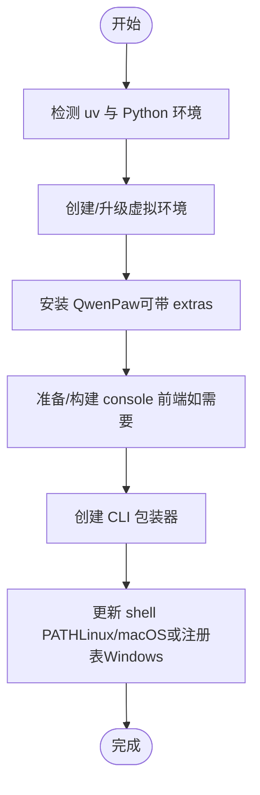
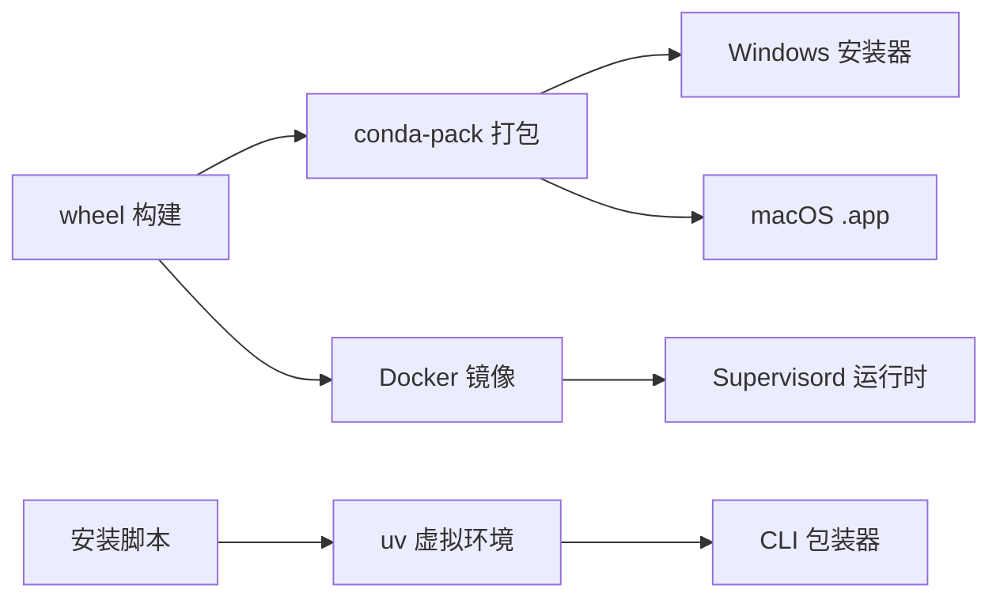

# 打包部署

<cite>
**本文引用的文件**
- [Dockerfile](file://deploy/Dockerfile)
- [入口脚本](file://deploy/entrypoint.sh)
- [Supervisord 配置模板](file://deploy/config/supervisord.conf.template)
- [Windows 安装器脚本](file://scripts/pack/desktop.nsi)
- [Docker 构建脚本](file://scripts/docker_build.sh)
- [Windows 一键构建脚本](file://scripts/pack/build_win.ps1)
- [macOS 一键构建脚本](file://scripts/pack/build_macos.sh)
- [Linux 安装脚本](file://scripts/install.sh)
- [Windows 安装脚本](file://scripts/install.bat)
- [Compose 编排文件](file://docker-compose.yml)
- [打包通用脚本](file://scripts/pack/build_common.py)
- [轮子构建脚本（Linux）](file://scripts/wheel_build.sh)
- [轮子构建脚本（Windows）](file://scripts/wheel_build.ps1)
- [项目配置](file://pyproject.toml)
- [设置脚本](file://setup.py)
</cite>

## 目录
1. [简介](#简介)
2. [项目结构](#项目结构)
3. [核心组件](#核心组件)
4. [架构总览](#架构总览)
5. [详细组件分析](#详细组件分析)
6. [依赖关系分析](#依赖关系分析)
7. [性能考虑](#性能考虑)
8. [故障排查指南](#故障排查指南)
9. [结论](#结论)
10. [附录](#附录)

## 简介
本指南面向 QwenPaw 的打包与部署，覆盖以下主题：
- 技能打包规范与依赖管理策略
- 版本控制与发布管理
- 桌面应用打包流程与跨平台构建脚本
- 容器化与编排（Docker、Supervisord）
- Kubernetes 部署清单（概念性说明）
- 自动化部署流水线与 CI/CD 集成
- 部署环境准备、配置文件管理、服务启动验证
- 故障恢复、回滚策略、监控告警与性能优化

## 项目结构
QwenPaw 的打包与部署相关目录与文件：
- deploy：容器镜像与运行时配置
- scripts/pack：桌面应用打包与跨平台构建
- scripts：安装脚本与工具脚本
- docker-compose.yml：本地编排示例
- pyproject.toml：项目元数据、依赖与可选特性
- setup.py：打包入口

**图表来源**
- [Dockerfile:1-103](file://deploy/Dockerfile#L1-L103)
- [入口脚本:1-10](file://deploy/entrypoint.sh#L1-L10)
- [Supervisord 配置模板:1-40](file://deploy/config/supervisord.conf.template#L1-L40)
- [Windows 一键构建脚本:1-325](file://scripts/pack/build_win.ps1#L1-L325)
- [macOS 一键构建脚本:1-184](file://scripts/pack/build_macos.sh#L1-L184)
- [Windows 安装器脚本:1-57](file://scripts/pack/desktop.nsi#L1-L57)
- [打包通用脚本:1-321](file://scripts/pack/build_common.py#L1-L321)
- [Docker 构建脚本:1-32](file://scripts/docker_build.sh#L1-L32)
- [Linux 安装脚本:1-340](file://scripts/install.sh#L1-L340)
- [Windows 安装脚本:1-557](file://scripts/install.bat#L1-L557)
- [Compose 编排文件:1-23](file://docker-compose.yml#L1-L23)
- [项目配置:1-111](file://pyproject.toml#L1-L111)
- [设置脚本:1-5](file://setup.py#L1-L5)

**章节来源**
- [Dockerfile:1-103](file://deploy/Dockerfile#L1-L103)
- [Compose 编排文件:1-23](file://docker-compose.yml#L1-L23)

## 核心组件
- 容器镜像与运行时
  - 多阶段构建：前端构建与应用打包分离；运行时镜像包含 Python、Chromium、Supervisord 等
  - 环境变量：端口、工作目录、通道过滤、容器运行标记等
  - 入口脚本：通过 envsubst 注入端口后启动 Supervisord
  - Supervisord：守护 dbus、Xvfb、XFCE 与应用进程
- 桌面应用打包
  - Windows：wheel + conda-pack + NSIS 安装器
  - macOS：wheel + conda-pack + .app 捆绑
  - 通用逻辑由 build_common.py 提供
- 安装脚本
  - Linux/macOS：uv 虚拟环境 + 包安装 + CLI 包装器
  - Windows：PowerShell/cmd 双包装 + uv 安装 + PATH 注册
- 依赖与可选特性
  - pyproject.toml 定义主依赖与可选 extras（llamacpp、mlx、ollama、whisper、full 等）

**章节来源**
- [Dockerfile:1-103](file://deploy/Dockerfile#L1-L103)
- [入口脚本:1-10](file://deploy/entrypoint.sh#L1-L10)
- [Supervisord 配置模板:1-40](file://deploy/config/supervisord.conf.template#L1-L40)
- [Windows 一键构建脚本:1-325](file://scripts/pack/build_win.ps1#L1-L325)
- [macOS 一键构建脚本:1-184](file://scripts/pack/build_macos.sh#L1-L184)
- [打包通用脚本:1-321](file://scripts/pack/build_common.py#L1-L321)
- [Linux 安装脚本:1-340](file://scripts/install.sh#L1-L340)
- [Windows 安装脚本:1-557](file://scripts/install.bat#L1-L557)
- [项目配置:1-111](file://pyproject.toml#L1-L111)

## 架构总览
下图展示从源码到可运行镜像/安装包的关键路径。

**图表来源**
- [轮子构建脚本（Linux）:1-28](file://scripts/wheel_build.sh#L1-L28)
- [轮子构建脚本（Windows）:1-41](file://scripts/wheel_build.ps1#L1-L41)
- [打包通用脚本:1-321](file://scripts/pack/build_common.py#L1-L321)
- [Windows 安装器脚本:1-57](file://scripts/pack/desktop.nsi#L1-L57)
- [Dockerfile:1-103](file://deploy/Dockerfile#L1-L103)
- [入口脚本:1-10](file://deploy/entrypoint.sh#L1-L10)
- [Supervisord 配置模板:1-40](file://deploy/config/supervisord.conf.template#L1-L40)
- [Linux 安装脚本:1-340](file://scripts/install.sh#L1-L340)
- [Windows 安装脚本:1-557](file://scripts/install.bat#L1-L557)

## 详细组件分析

### 容器化与运行时
- 多阶段构建
  - 前端构建阶段：基于 NodeSlim 镜像构建 console 前端，并将产物注入最终镜像
  - 运行时阶段：安装 Python、Chromium、Supervisord、系统字体与依赖，启用无沙箱模式以适配容器
- 环境变量与端口
  - 默认端口 8088，可通过环境变量覆盖
  - 通道过滤：支持白名单与黑名单两种方式
- 入口与进程管理
  - 入口脚本通过 envsubst 将端口注入模板，再启动 Supervisord
  - Supervisord 启动 dbus、Xvfb、XFCE 与应用进程，统一输出日志

**图表来源**
- [Docker 构建脚本:1-32](file://scripts/docker_build.sh#L1-L32)
- [Dockerfile:1-103](file://deploy/Dockerfile#L1-L103)
- [入口脚本:1-10](file://deploy/entrypoint.sh#L1-L10)
- [Supervisord 配置模板:1-40](file://deploy/config/supervisord.conf.template#L1-L40)

**章节来源**
- [Dockerfile:1-103](file://deploy/Dockerfile#L1-L103)
- [入口脚本:1-10](file://deploy/entrypoint.sh#L1-L10)
- [Supervisord 配置模板:1-40](file://deploy/config/supervisord.conf.template#L1-L40)
- [Docker 构建脚本:1-32](file://scripts/docker_build.sh#L1-L32)

### 桌面应用打包（Windows）
- 流程概览
  - 生成 wheel（包含最新 console 前端）
  - 使用 conda-pack 打包环境
  - 解包并修复 conda-unpack 引起的路径问题（Windows 特有）
  - 预编译 Python 字节码加速启动
  - 生成批处理与 VBScript 启动器
  - 使用 NSIS 生成安装器
- 关键点
  - 通过 build_common.py 统一 conda 环境创建、依赖安装与打包
  - 修复受影响包（如 huggingface_hub）以避免路径转义错误
  - 生成调试与非调试双启动器，便于问题定位

**图表来源**
- [轮子构建脚本（Windows）:1-41](file://scripts/wheel_build.ps1#L1-L41)
- [打包通用脚本:1-321](file://scripts/pack/build_common.py#L1-L321)
- [Windows 一键构建脚本:1-325](file://scripts/pack/build_win.ps1#L1-L325)
- [Windows 安装器脚本:1-57](file://scripts/pack/desktop.nsi#L1-L57)

**章节来源**
- [Windows 一键构建脚本:1-325](file://scripts/pack/build_win.ps1#L1-L325)
- [打包通用脚本:1-321](file://scripts/pack/build_common.py#L1-L321)
- [Windows 安装器脚本:1-57](file://scripts/pack/desktop.nsi#L1-L57)

### 桌面应用打包（macOS）
- 流程概览
  - 生成 wheel（含 console 前端）
  - 使用 conda-pack 打包环境并解包至 .app/Contents/Resources/env
  - 执行 conda-unpack 以修正可执行路径
  - 生成 .app 可执行脚本与 Info.plist（含图标）
  - 可选：对 .app 进行压缩分发
- 关键点
  - 严格设置 SSL 证书路径，确保 HTTPS 请求可用
  - 在无 TTY 环境下重定向日志至用户目录，便于排障

**图表来源**
- [轮子构建脚本（Linux）:1-28](file://scripts/wheel_build.sh#L1-L28)
- [打包通用脚本:1-321](file://scripts/pack/build_common.py#L1-L321)
- [macOS 一键构建脚本:1-184](file://scripts/pack/build_macos.sh#L1-L184)

**章节来源**
- [macOS 一键构建脚本:1-184](file://scripts/pack/build_macos.sh#L1-L184)
- [打包通用脚本:1-321](file://scripts/pack/build_common.py#L1-L321)

### 安装脚本与环境准备
- Linux/macOS（install.sh）
  - 自动检测并安装 uv，创建 Python 3.12 虚拟环境
  - 支持从 PyPI 或源码安装，可选择 extras（如 llamacpp、mlx、ollama）
  - 自动注入 CLI 包装器并更新 shell PATH
- Windows（install.bat）
  - 支持多种安装路径（PyPI、GitHub、本地源码），自动处理 uv 安装与 PATH 注册
  - 提供 PowerShell 与 CMD 双包装器，增强兼容性
  - 对输入进行安全校验，防止命令注入

**图表来源**
- [Linux 安装脚本:1-340](file://scripts/install.sh#L1-L340)
- [Windows 安装脚本:1-557](file://scripts/install.bat#L1-L557)

**章节来源**
- [Linux 安装脚本:1-340](file://scripts/install.sh#L1-L340)
- [Windows 安装脚本:1-557](file://scripts/install.bat#L1-L557)

### 依赖管理与版本控制
- 依赖声明
  - 主依赖：HTTP、调度、消息通道、浏览器自动化、加密、YAML 等
  - 可选特性：llamacpp、mlx、ollama、whisper、full 等
- 版本控制
  - 使用动态版本字段，版本号来自模块版本文件
  - wheel 构建前先构建 console 前端并复制到包内资源
- 发布策略
  - 通过构建脚本生成 wheel，配合安装脚本进行分发
  - Docker 镜像包含默认初始化与工作目录结构

**章节来源**
- [项目配置:1-111](file://pyproject.toml#L1-L111)
- [轮子构建脚本（Linux）:1-28](file://scripts/wheel_build.sh#L1-L28)
- [轮子构建脚本（Windows）:1-41](file://scripts/wheel_build.ps1#L1-L41)
- [设置脚本:1-5](file://setup.py#L1-L5)

## 依赖关系分析
- 组件耦合
  - 容器镜像依赖 Dockerfile 中的多阶段构建与运行时依赖
  - 桌面应用打包依赖 wheel 与 conda-pack，且受 build_common.py 统一调度
  - 安装脚本依赖 uv 与 Python 环境，同时维护 CLI 包装器与 PATH
- 外部依赖
  - Playwright 与 Chromium 用于桌面截图与自动化
  - 各类即时通讯 SDK 用于多通道接入
- 循环依赖
  - 未发现直接循环依赖；打包脚本通过明确的输入输出串联各阶段

**图表来源**
- [轮子构建脚本（Linux）:1-28](file://scripts/wheel_build.sh#L1-L28)
- [轮子构建脚本（Windows）:1-41](file://scripts/wheel_build.ps1#L1-L41)
- [打包通用脚本:1-321](file://scripts/pack/build_common.py#L1-L321)
- [Windows 安装器脚本:1-57](file://scripts/pack/desktop.nsi#L1-L57)
- [Dockerfile:1-103](file://deploy/Dockerfile#L1-L103)
- [入口脚本:1-10](file://deploy/entrypoint.sh#L1-L10)
- [Supervisord 配置模板:1-40](file://deploy/config/supervisord.conf.template#L1-L40)
- [Linux 安装脚本:1-340](file://scripts/install.sh#L1-L340)
- [Windows 安装脚本:1-557](file://scripts/install.bat#L1-L557)

**章节来源**
- [项目配置:1-111](file://pyproject.toml#L1-L111)
- [Dockerfile:1-103](file://deploy/Dockerfile#L1-L103)

## 性能考虑
- 启动性能
  - 预编译 Python 字节码可减少首次启动时间（桌面打包脚本已实现）
  - 使用 uv 与缓存索引可提升安装速度（安装脚本已内置）
- 运行性能
  - 容器中启用无沙箱模式以降低 Chromium 启动开销（需注意安全边界）
  - Supervisord 管理多进程，确保 dbus、Xvfb、XFCE 与应用稳定运行
- 资源占用
  - 仅在需要时启用桌面功能（如 Playwright、Chromium），避免不必要的资源消耗

[本节为通用指导，无需特定文件来源]

## 故障排查指南
- 容器启动失败
  - 检查端口占用与映射（默认 8088），确认环境变量是否正确注入
  - 查看 Supervisord 日志（/var/log/app.out.log、/var/log/supervisord.log）
- 桌面应用无法启动
  - Windows：确认修复受影响包步骤是否执行；查看调试启动器输出
  - macOS：检查 SSL 证书路径与 .app 可执行权限
- 安装脚本异常
  - Linux/macOS：确认 uv 是否成功安装与 PATH 更新
  - Windows：检查 PowerShell 执行策略与安全校验结果
- 通道不可用
  - 通过环境变量配置通道白名单/黑名单，按需启用或禁用

**章节来源**
- [Supervisord 配置模板:1-40](file://deploy/config/supervisord.conf.template#L1-L40)
- [Windows 一键构建脚本:1-325](file://scripts/pack/build_win.ps1#L1-L325)
- [macOS 一键构建脚本:1-184](file://scripts/pack/build_macos.sh#L1-L184)
- [Linux 安装脚本:1-340](file://scripts/install.sh#L1-L340)
- [Windows 安装脚本:1-557](file://scripts/install.bat#L1-L557)

## 结论
本指南梳理了 QwenPaw 的打包与部署全链路：从源码到 wheel、从 wheel 到桌面安装包、再到容器镜像与运行时。通过统一的构建脚本与安装脚本，实现了跨平台一致性与可重复性。结合容器化与 Supervisord 的进程管理，可快速在本地与生产环境中部署与运维。

[本节为总结，无需特定文件来源]

## 附录

### A. 容器化部署清单（概念性）
- 服务定义
  - 镜像：使用官方或自建镜像
  - 端口：映射 8088 至宿主机
  - 卷：挂载工作目录与密钥目录
  - 环境变量：认证开关、用户名、密码、通道过滤等
- 示例参考
  - 参考 docker-compose.yml 中的服务与卷定义

**章节来源**
- [Compose 编排文件:1-23](file://docker-compose.yml#L1-L23)

### B. 自动化部署流水线设计（建议）
- 触发条件
  - 推送标签或合并到主分支
- 步骤建议
  - 构建 wheel（Linux/macOS/Windows）
  - 构建 Docker 镜像
  - 运行单元测试与集成测试
  - 推送镜像与 wheel 至制品库
  - 触发编排部署（可选）
- 工具建议
  - 使用 CI 平台的任务编排能力与缓存策略

[本节为通用指导，无需特定文件来源]

### C. 发布管理策略（建议）
- 版本号
  - 采用语义化版本，变更记录于发布说明
- 分发渠道
  - PyPI（wheel）、Docker Hub（镜像）、NSIS 安装器（Windows）、.app（macOS）
- 回滚策略
  - 保留最近 N 个版本的镜像与 wheel
  - 通过编排文件切换镜像标签或回退到上一个版本

[本节为通用指导，无需特定文件来源]