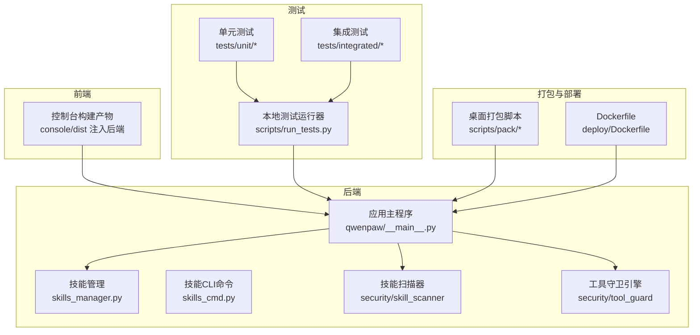
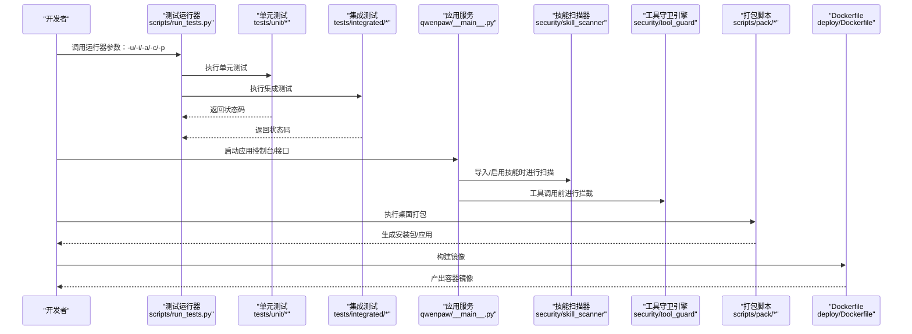
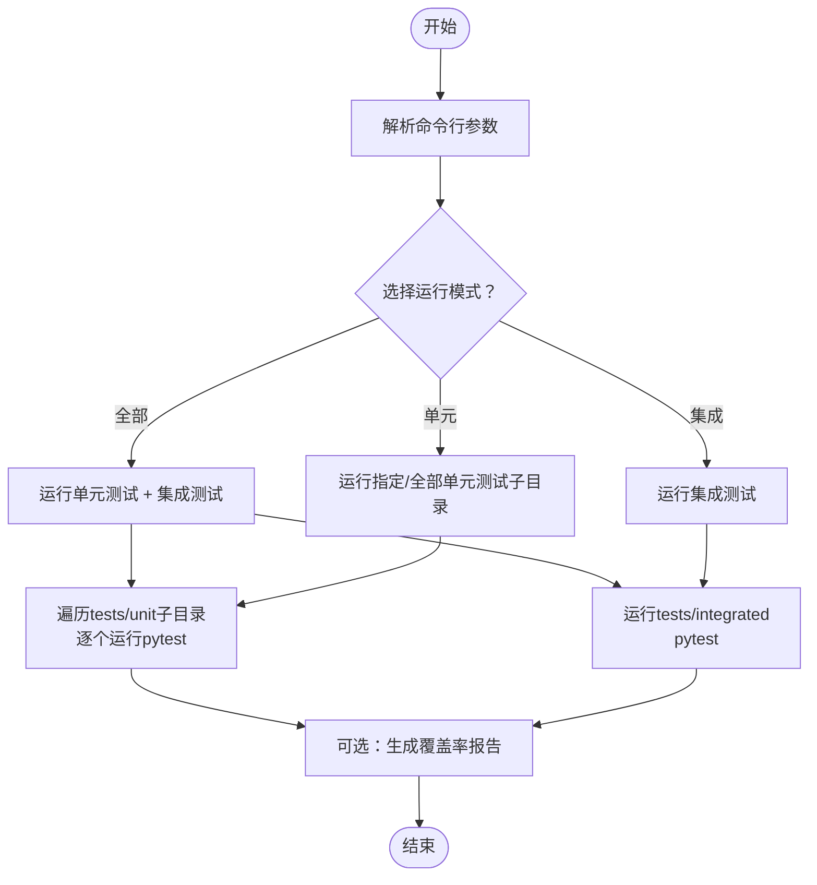
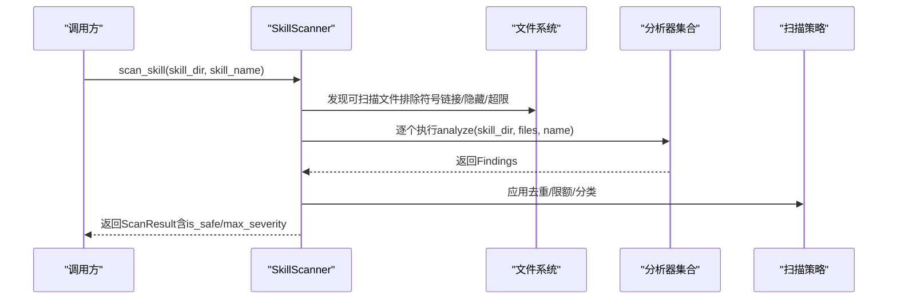
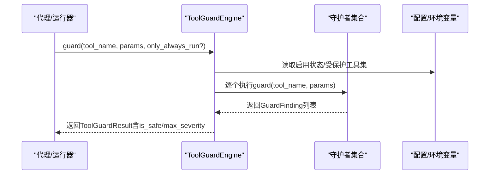
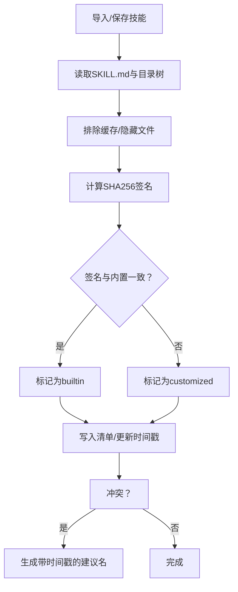
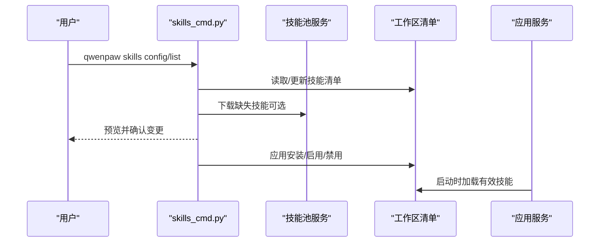
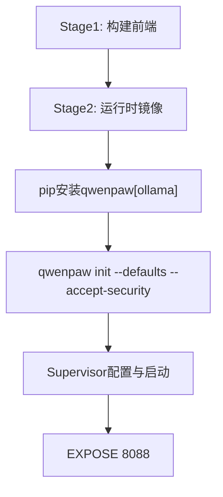
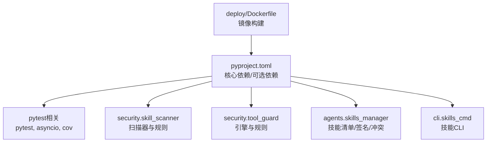

# 测试与部署

<cite>
**本文引用的文件**
- [README.md](file://README.md)
- [CONTRIBUTING.md](file://CONTRIBUTING.md)
- [scripts/run_tests.py](file://scripts/run_tests.py)
- [src/qwenpaw/agents/skills_manager.py](file://src/qwenpaw/agents/skills_manager.py)
- [src/qwenpaw/cli/skills_cmd.py](file://src/qwenpaw/cli/skills_cmd.py)
- [src/qwenpaw/security/skill_scanner/scanner.py](file://src/qwenpaw/security/skill_scanner/scanner.py)
- [src/qwenpaw/security/skill_scanner/models.py](file://src/qwenpaw/security/skill_scanner/models.py)
- [src/qwenpaw/security/tool_guard/engine.py](file://src/qwenpaw/security/tool_guard/engine.py)
- [src/qwenpaw/security/tool_guard/models.py](file://src/qwenpaw/security/tool_guard/models.py)
- [tests/unit/workspace/test_workspace.py](file://tests/unit/workspace/test_workspace.py)
- [tests/integrated/test_app_startup.py](file://tests/integrated/test_app_startup.py)
- [scripts/pack/README.md](file://scripts/pack/README.md)
- [deploy/Dockerfile](file://deploy/Dockerfile)
- [pyproject.toml](file://pyproject.toml)
</cite>

## 目录
1. [简介](#简介)
2. [项目结构](#项目结构)
3. [核心组件](#核心组件)
4. [架构总览](#架构总览)
5. [详细组件分析](#详细组件分析)
6. [依赖关系分析](#依赖关系分析)
7. [性能考虑](#性能考虑)
8. [故障排查指南](#故障排查指南)
9. [结论](#结论)
10. [附录](#附录)

## 简介
本指南面向QwenPaw技能测试与部署，覆盖以下目标：
- 技能测试框架使用：单元测试与集成测试的组织方式、运行脚本与参数。
- 单元测试编写：测试用例组织、异步测试、断言策略。
- 集成测试执行：应用启动与控制台可用性验证。
- 技能安全扫描：扫描器API、规则与策略、结果模型。
- 权限验证与资源限制：工具守卫引擎、规则与环境开关。
- 技能打包规范：内置技能签名、冲突检测与重命名建议。
- 版本发布与依赖管理：包与可选依赖、构建系统与分发。
- 部署到工作空间：CLI技能配置、工作区清单与启用流程。
- 运行时监控：容器日志、Supervisor进程管理、端口暴露。
- 冲突检测、签名验证与完整性校验：基于内容哈希的签名、路径安全校验。
- CI/CD集成：桌面打包流水线、Docker镜像构建与入口脚本。

## 项目结构
QwenPaw采用“前端控制台 + 后端服务 + 安全子系统 + 测试套件 + 打包与部署”的分层组织：
- 前端控制台：console目录，构建产物注入至后端包内。
- 后端服务：src/qwenpaw，包含技能管理、通道、定时任务、MCP、运行器等。
- 安全子系统：技能扫描与工具守卫，分别在security子模块下。
- 测试：tests/unit与tests/integrated，配合scripts/run_tests.py统一运行。
- 打包与部署：scripts/pack用于桌面打包；deploy/Dockerfile用于容器镜像构建。

图示来源
- [deploy/Dockerfile:1-103](file://deploy/Dockerfile#L1-L103)
- [scripts/run_tests.py:1-282](file://scripts/run_tests.py#L1-L282)
- [src/qwenpaw/agents/skills_manager.py:1-800](file://src/qwenpaw/agents/skills_manager.py#L1-L800)
- [src/qwenpaw/cli/skills_cmd.py:1-275](file://src/qwenpaw/cli/skills_cmd.py#L1-L275)
- [src/qwenpaw/security/skill_scanner/scanner.py:1-319](file://src/qwenpaw/security/skill_scanner/scanner.py#L1-L319)
- [src/qwenpaw/security/tool_guard/engine.py:1-238](file://src/qwenpaw/security/tool_guard/engine.py#L1-L238)
- [scripts/pack/README.md:1-93](file://scripts/pack/README.md#L1-L93)

章节来源
- [README.md:1-522](file://README.md#L1-L522)
- [pyproject.toml:1-111](file://pyproject.toml#L1-L111)

## 核心组件
- 测试运行器：scripts/run_tests.py提供统一入口，支持按子目录运行单元测试、运行集成测试、覆盖率生成、并行执行。
- 技能管理：src/qwenpaw/agents/skills_manager.py负责技能清单、签名计算、冲突检测、导入与启用。
- 技能扫描器：src/qwenpaw/security/skill_scanner实现文件发现、分析器注册、聚合结果与策略控制。
- 工具守卫引擎：src/qwenpaw/security/tool_guard提供工具调用前的安全拦截与规则匹配。
- CLI技能命令：src/qwenpaw/cli/skills_cmd.py提供技能列表、交互式配置与批量启用/禁用。
- 应用启动与控制台：tests/integrated/test_app_startup.py验证后台服务与控制台页面可用性。
- 桌面打包：scripts/pack/README.md描述Windows/macOS打包流程与CI触发。
- 容器镜像：deploy/Dockerfile定义多阶段构建、Supervisor进程管理与运行时环境。

章节来源
- [scripts/run_tests.py:1-282](file://scripts/run_tests.py#L1-L282)
- [src/qwenpaw/agents/skills_manager.py:1-800](file://src/qwenpaw/agents/skills_manager.py#L1-L800)
- [src/qwenpaw/security/skill_scanner/scanner.py:1-319](file://src/qwenpaw/security/skill_scanner/scanner.py#L1-L319)
- [src/qwenpaw/security/tool_guard/engine.py:1-238](file://src/qwenpaw/security/tool_guard/engine.py#L1-L238)
- [src/qwenpaw/cli/skills_cmd.py:1-275](file://src/qwenpaw/cli/skills_cmd.py#L1-L275)
- [tests/integrated/test_app_startup.py:1-133](file://tests/integrated/test_app_startup.py#L1-L133)
- [scripts/pack/README.md:1-93](file://scripts/pack/README.md#L1-L93)
- [deploy/Dockerfile:1-103](file://deploy/Dockerfile#L1-L103)

## 架构总览
下图展示从测试到部署的关键流程：测试运行器调度测试，技能管理与安全子系统贯穿技能生命周期，打包与容器化支撑发布与运维。

图示来源
- [scripts/run_tests.py:175-282](file://scripts/run_tests.py#L175-L282)
- [tests/integrated/test_app_startup.py:33-133](file://tests/integrated/test_app_startup.py#L33-L133)
- [src/qwenpaw/security/skill_scanner/scanner.py:148-242](file://src/qwenpaw/security/skill_scanner/scanner.py#L148-L242)
- [src/qwenpaw/security/tool_guard/engine.py:169-226](file://src/qwenpaw/security/tool_guard/engine.py#L169-L226)
- [scripts/pack/README.md:23-93](file://scripts/pack/README.md#L23-L93)
- [deploy/Dockerfile:80-103](file://deploy/Dockerfile#L80-L103)

## 详细组件分析

### 测试框架与运行器
- 统一入口：scripts/run_tests.py解析参数，支持运行全部、仅单元或仅集成测试，支持覆盖率与并行执行。
- 单元测试：按子目录组织，如providers、agents、channels等；通过pytest运行。
- 集成测试：验证应用启动、后台API可用与控制台HTML返回。
- 并行与覆盖率：通过pytest-xdist与pytest-cov实现；覆盖率报告输出至htmlcov。

图示来源
- [scripts/run_tests.py:175-282](file://scripts/run_tests.py#L175-L282)

章节来源
- [scripts/run_tests.py:1-282](file://scripts/run_tests.py#L1-L282)
- [tests/integrated/test_app_startup.py:1-133](file://tests/integrated/test_app_startup.py#L1-L133)

### 技能安全扫描流程
- 文件发现：递归扫描技能目录，跳过符号链接、隐藏文件与超大文件，确保边界内安全。
- 分析器注册：默认加载PatternAnalyzer，支持动态注册其他分析器。
- 结果聚合：去重、统计最高严重级别、记录失败分析器。
- 策略与限制：最大文件数、单文件大小、跳过扩展名集由策略控制。

图示来源
- [src/qwenpaw/security/skill_scanner/scanner.py:148-242](file://src/qwenpaw/security/skill_scanner/scanner.py#L148-L242)
- [src/qwenpaw/security/skill_scanner/models.py:168-235](file://src/qwenpaw/security/skill_scanner/models.py#L168-L235)

章节来源
- [src/qwenpaw/security/skill_scanner/scanner.py:1-319](file://src/qwenpaw/security/skill_scanner/scanner.py#L1-L319)
- [src/qwenpaw/security/skill_scanner/models.py:1-235](file://src/qwenpaw/security/skill_scanner/models.py#L1-L235)

### 工具守卫与权限验证
- 引擎初始化：根据环境变量与配置决定是否启用，默认启用；注册默认守护者（路径与规则）。
- 工具拦截：在工具调用前执行所有守护者，收集Findings，记录失败守护者。
- 规则与威胁类别：涵盖命令注入、路径穿越、敏感文件访问、资源滥用等。
- 禁止与受保护工具：支持白名单/黑名单与强制运行守护者。

图示来源
- [src/qwenpaw/security/tool_guard/engine.py:169-226](file://src/qwenpaw/security/tool_guard/engine.py#L169-L226)
- [src/qwenpaw/security/tool_guard/models.py:103-185](file://src/qwenpaw/security/tool_guard/models.py#L103-L185)

章节来源
- [src/qwenpaw/security/tool_guard/engine.py:1-238](file://src/qwenpaw/security/tool_guard/engine.py#L1-L238)
- [src/qwenpaw/security/tool_guard/models.py:1-185](file://src/qwenpaw/security/tool_guard/models.py#L1-L185)

### 技能打包规范与冲突检测
- 内置技能签名：对技能树进行SHA256哈希，排除缓存与隐藏文件，作为内容身份标识。
- 冲突检测：同名技能若签名不同，视为定制化副本；提供时间戳后缀的重命名建议。
- 路径安全：解压与写入时拒绝绝对路径、越界路径与符号链接。
- 清单与环境注入：技能清单包含名称、描述、版本、签名、来源、需求与更新时间；支持按需注入环境变量。

图示来源
- [src/qwenpaw/agents/skills_manager.py:274-312](file://src/qwenpaw/agents/skills_manager.py#L274-L312)
- [src/qwenpaw/agents/skills_manager.py:755-776](file://src/qwenpaw/agents/skills_manager.py#L755-L776)

章节来源
- [src/qwenpaw/agents/skills_manager.py:1-800](file://src/qwenpaw/agents/skills_manager.py#L1-L800)

### 部署到工作空间与配置验证
- CLI技能配置：支持列出技能、交互式启用/禁用、从技能池下载到工作区。
- 工作区清单：原子化写入、文件锁保证并发一致性；变更版本号与时间戳。
- 控制台可用性：集成测试通过HTTP请求验证后台API与控制台HTML响应。

图示来源
- [src/qwenpaw/cli/skills_cmd.py:120-211](file://src/qwenpaw/cli/skills_cmd.py#L120-L211)
- [src/qwenpaw/agents/skills_manager.py:378-389](file://src/qwenpaw/agents/skills_manager.py#L378-L389)
- [tests/integrated/test_app_startup.py:33-133](file://tests/integrated/test_app_startup.py#L33-L133)

章节来源
- [src/qwenpaw/cli/skills_cmd.py:1-275](file://src/qwenpaw/cli/skills_cmd.py#L1-L275)
- [src/qwenpaw/agents/skills_manager.py:338-389](file://src/qwenpaw/agents/skills_manager.py#L338-L389)
- [tests/integrated/test_app_startup.py:1-133](file://tests/integrated/test_app_startup.py#L1-L133)

### 运行时监控与容器化
- 容器镜像：多阶段构建，复制前端构建产物，安装qwenpaw[ollama]，初始化默认配置，Supervisor管理进程，暴露端口8088。
- 日志与调试：容器内stdout/stderr输出，Playwright使用系统Chromium避免重复下载。
- 入口脚本：/entrypoint.sh由Dockerfile指定为CMD，Supervisor模板通过环境变量控制通道启停。

图示来源
- [deploy/Dockerfile:1-103](file://deploy/Dockerfile#L1-L103)

章节来源
- [deploy/Dockerfile:1-103](file://deploy/Dockerfile#L1-L103)

### CI/CD集成方案
- 桌面打包：Windows/macOS流水线通过临时conda环境与conda-pack打包，上传安装包/应用。
- 触发条件：发布或手动workflow_dispatch。
- 脚本参考：build_macos.sh、build_win.ps1、desktop.nsi与assets图标资源。

章节来源
- [scripts/pack/README.md:74-93](file://scripts/pack/README.md#L74-L93)

## 依赖关系分析

图示来源
- [pyproject.toml:1-111](file://pyproject.toml#L1-L111)
- [deploy/Dockerfile:80-93](file://deploy/Dockerfile#L80-L93)

章节来源
- [pyproject.toml:1-111](file://pyproject.toml#L1-L111)

## 性能考虑
- 测试并行：通过pytest-xdist并行执行，缩短CI时间；注意测试间共享资源的隔离。
- 扫描限制：设置最大文件数与单文件大小，避免大规模技能扫描导致内存与CPU压力。
- 工具守卫延迟：仅在必要时执行守护者，避免对高频工具调用造成明显延迟。
- 容器浏览器：使用系统Chromium避免Playwright下载，减少首次启动开销。

## 故障排查指南
- 测试运行失败
  - 确认已安装开发依赖并可通过pytest版本检测。
  - 使用覆盖率与并行参数定位慢用例或资源竞争。
- 应用启动失败
  - 集成测试会捕获早期退出与依赖错误日志，优先查看最后4000字符日志。
  - 确认端口未被占用，后台API与控制台HTML响应正常。
- 技能扫描异常
  - 检查策略文件与跳过扩展名配置，确认文件未被符号链接或越界路径影响。
  - 关注扫描器失败的分析器列表，定位具体规则问题。
- 工具守卫误报/漏报
  - 检查守护者启用状态与受保护工具集，必要时调整规则或添加always_run守护者。
- 容器启动问题
  - 查看Supervisor日志与端口映射，确认Chromium沙箱参数与PLAYWRIGHT配置。

章节来源
- [scripts/run_tests.py:63-74](file://scripts/run_tests.py#L63-L74)
- [tests/integrated/test_app_startup.py:73-104](file://tests/integrated/test_app_startup.py#L73-L104)
- [src/qwenpaw/security/skill_scanner/scanner.py:203-213](file://src/qwenpaw/security/skill_scanner/scanner.py#L203-L213)
- [src/qwenpaw/security/tool_guard/engine.py:194-196](file://src/qwenpaw/security/tool_guard/engine.py#L194-L196)
- [deploy/Dockerfile:71-78](file://deploy/Dockerfile#L71-L78)

## 结论
本指南提供了QwenPaw技能测试与部署的完整操作路径：从测试运行器、单元与集成测试，到技能安全扫描与工具守卫，再到技能打包、版本发布与容器化部署。结合冲突检测与签名验证机制，可确保技能在工作空间中的安全性与稳定性；通过CI/CD流水线与容器镜像，实现可复现的自动化交付。

## 附录
- 测试覆盖率要求：建议在合并前达到一定阈值（可在CI中配置），并结合慢测试标记进行选择性执行。
- 性能基准测试：建议对关键路径（扫描、守卫、应用启动）建立回归基线，纳入CI。
- 故障恢复策略：容器内日志采集、Supervisor自动重启、健康检查端点与控制台页面回退页。