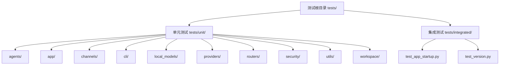
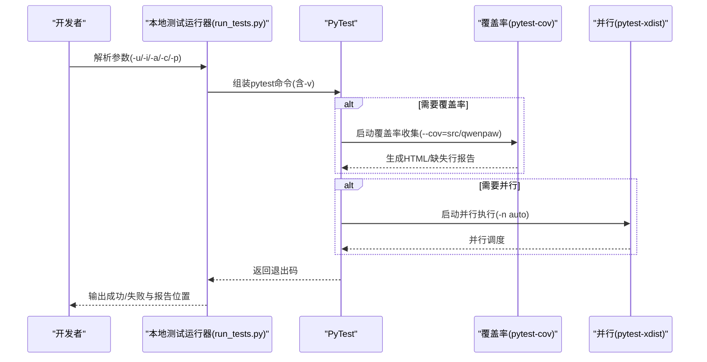
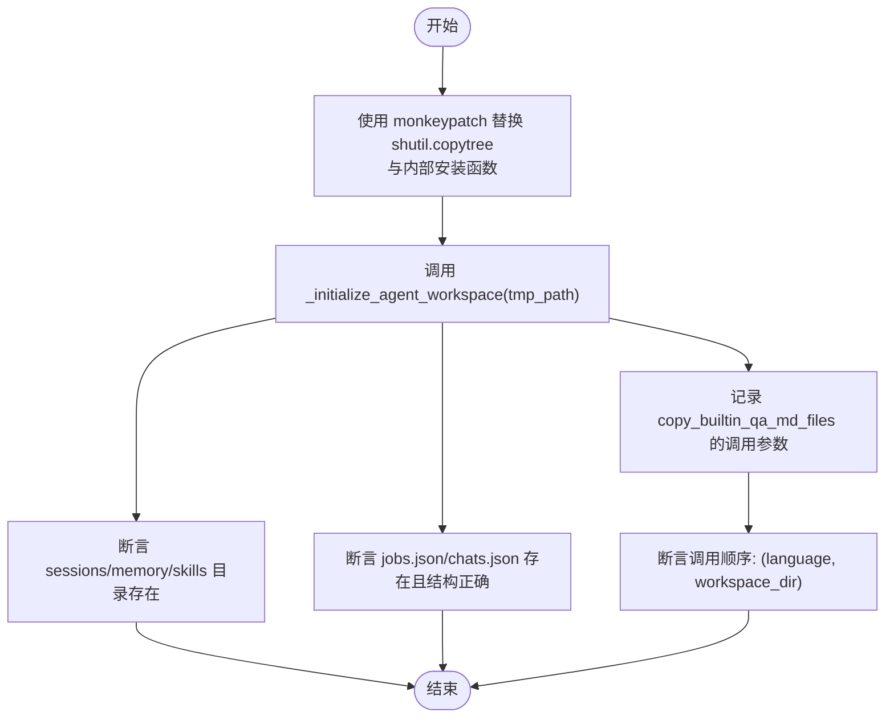
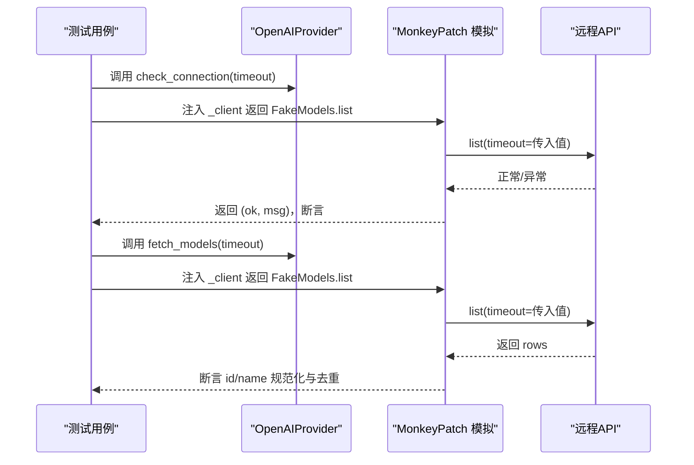
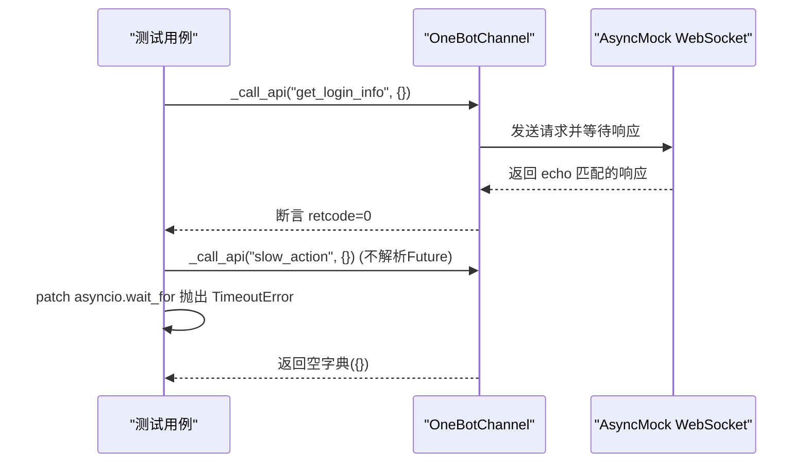
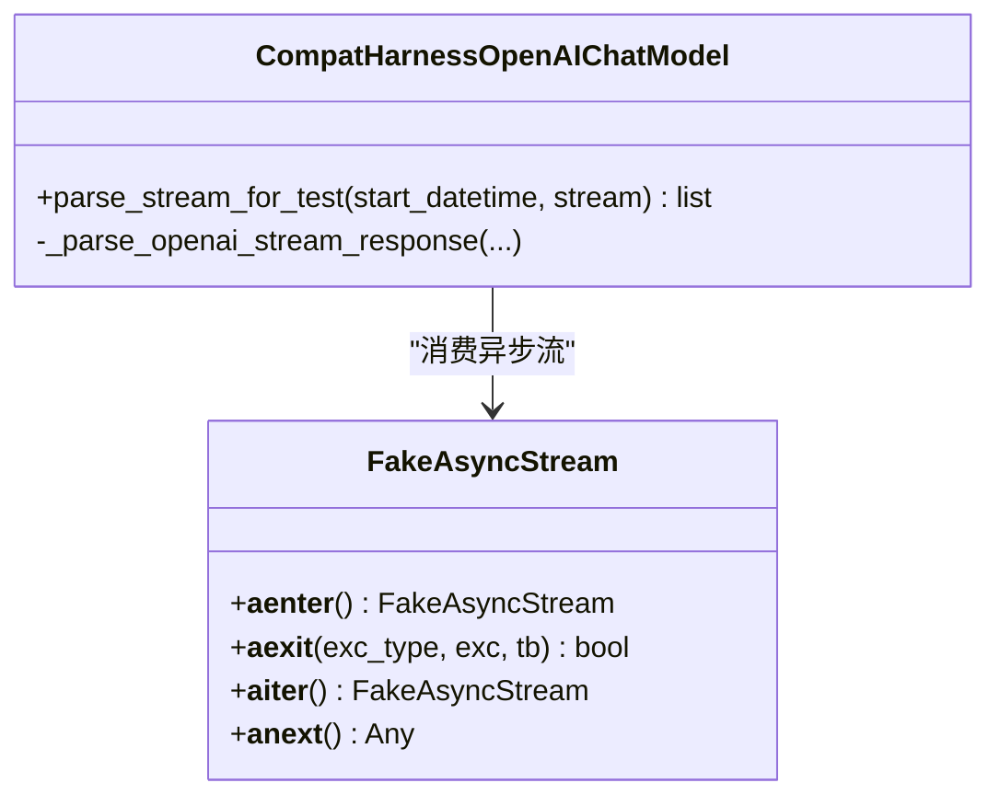
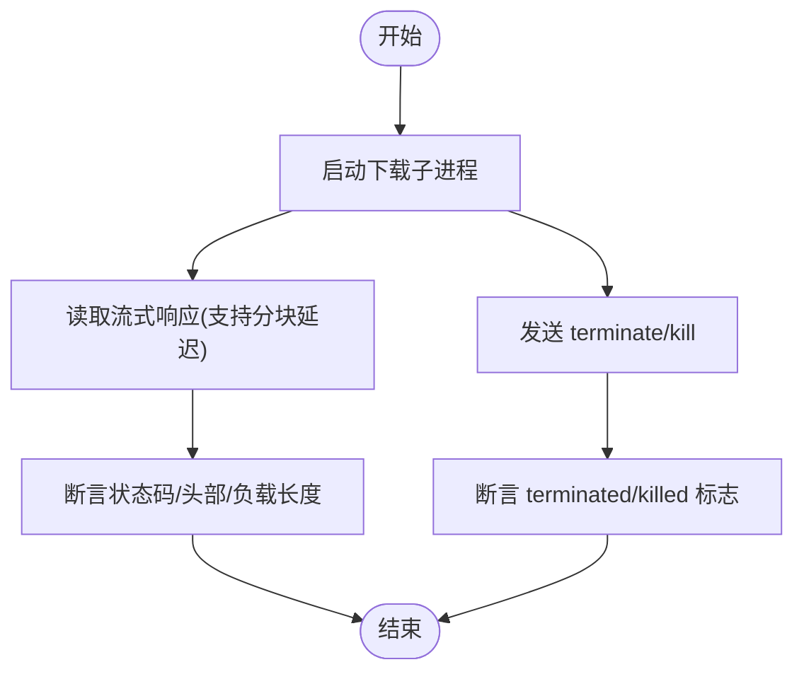
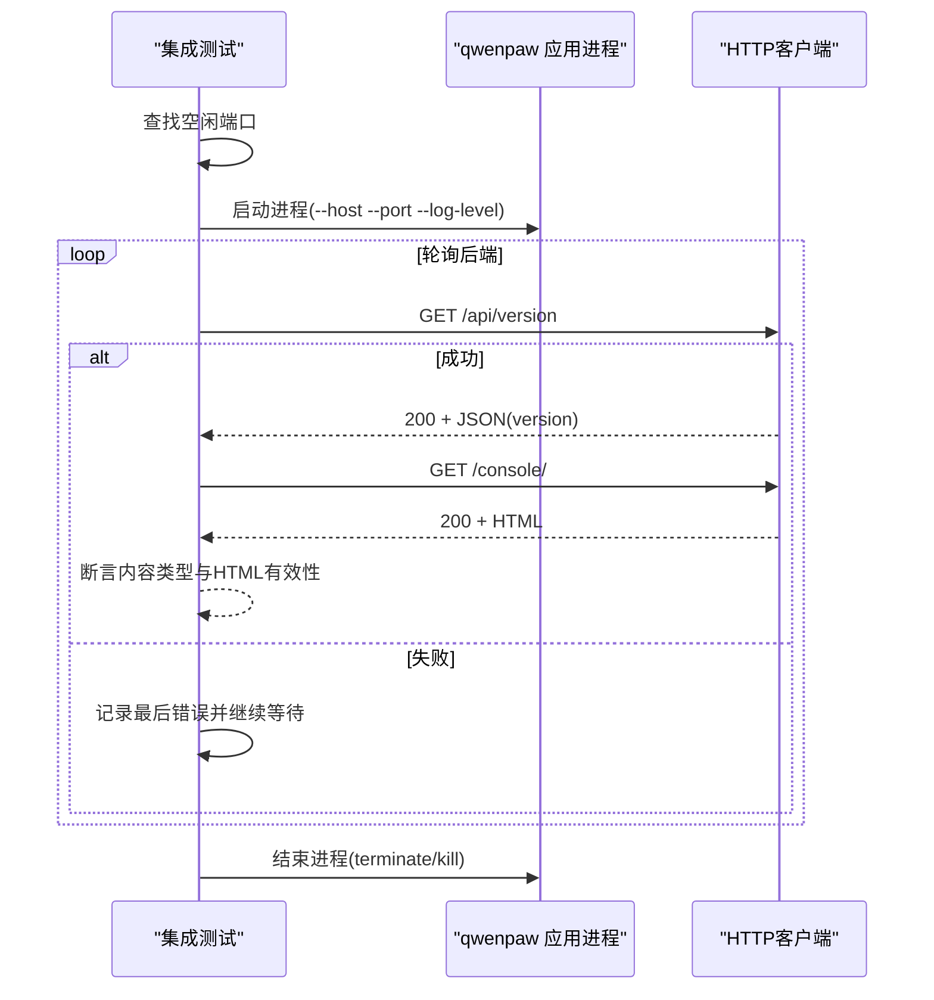
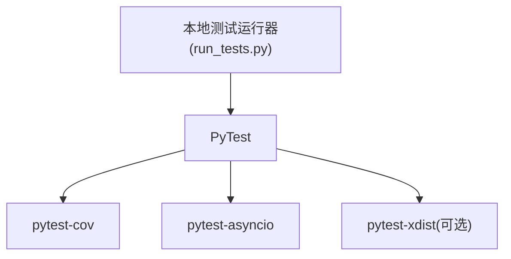

# 测试框架

<cite>
**本文引用的文件**
- [pyproject.toml](file://pyproject.toml)
- [scripts/run_tests.py](file://scripts/run_tests.py)
- [tests/integrated/test_app_startup.py](file://tests/integrated/test_app_startup.py)
- [tests/unit/app/test_agents_workspace_initialization.py](file://tests/unit/app/test_agents_workspace_initialization.py)
- [tests/unit/providers/test_openai_provider.py](file://tests/unit/providers/test_openai_provider.py)
- [tests/unit/channels/test_onebot_channel.py](file://tests/unit/channels/test_onebot_channel.py)
- [tests/unit/providers/test_openai_stream_toolcall_compat.py](file://tests/unit/providers/test_openai_stream_toolcall_compat.py)
- [tests/unit/local_models/test_llamacpp_backend.py](file://tests/unit/local_models/test_llamacpp_backend.py)
</cite>

## 目录
1. [简介](#简介)
2. [项目结构](#项目结构)
3. [核心组件](#核心组件)
4. [架构总览](#架构总览)
5. [详细组件分析](#详细组件分析)
6. [依赖分析](#依赖分析)
7. [性能考虑](#性能考虑)
8. [故障排查指南](#故障排查指南)
9. [结论](#结论)
10. [附录](#附录)

## 简介
本指南面向QwenPaw项目的测试使用者与维护者，系统讲解如何基于PyTest进行测试配置与使用，覆盖测试文件组织、fixture与参数化、异步测试、模拟对象、断言与错误处理、覆盖率统计、并行执行、以及在持续集成中的执行策略。文中结合仓库内现有测试样例，帮助读者快速上手并建立高质量的测试体系。

## 项目结构
- 测试目录采用分层组织：tests/unit 与 tests/integrated 分别承载单元测试与集成测试。
- 单元测试按功能模块细分（如 providers、channels、local_models、workspace 等），便于定位与并行执行。
- 集成测试聚焦端到端启动与外部交互（如HTTP服务、外部进程等）。

图表来源
- [tests/integrated/test_app_startup.py:1-133](file://tests/integrated/test_app_startup.py#L1-L133)
- [tests/unit/app/test_agents_workspace_initialization.py:1-109](file://tests/unit/app/test_agents_workspace_initialization.py#L1-L109)

章节来源
- [pyproject.toml:105-111](file://pyproject.toml#L105-L111)
- [scripts/run_tests.py:76-146](file://scripts/run_tests.py#L76-L146)

## 核心组件
- PyTest配置与标记
  - 异步模式：通过配置启用自动异步模式与默认fixture循环作用域。
  - 自定义标记：定义“slow”标记用于区分耗时测试。
- 本地测试运行器
  - 支持按模块运行单元测试、运行集成测试、全量执行、覆盖率统计、并行执行。
  - 命令行选项：-u/--unit、-i/--integrated、-a/--all、-c/--coverage、-p/--parallel。
- 覆盖率与并行
  - 使用pytest-cov生成HTML与缺失行报告；并行执行需pytest-xdist支持。

章节来源
- [pyproject.toml:105-111](file://pyproject.toml#L105-L111)
- [scripts/run_tests.py:148-173](file://scripts/run_tests.py#L148-L173)
- [scripts/run_tests.py:175-277](file://scripts/run_tests.py#L175-L277)

## 架构总览
下图展示测试执行的整体流程：命令行入口调用本地测试运行器，运行器根据参数选择单元或集成测试路径，并可选开启覆盖率与并行执行；最终输出测试结果与覆盖率报告。

图表来源
- [scripts/run_tests.py:148-173](file://scripts/run_tests.py#L148-L173)
- [scripts/run_tests.py:175-277](file://scripts/run_tests.py#L175-L277)

## 详细组件分析

### 单元测试：工作空间初始化
- 目标：验证代理工作空间初始化过程中的目录创建、文件生成与QA种子语言传递顺序。
- 关键点：
  - 使用monkeypatch替换shutil.copytree与内部函数，确保不实际写盘。
  - 断言生成的JSON结构版本与字段完整性。
  - 验证QA种子函数被调用且参数顺序正确（先语言后工作空间路径）。

图表来源
- [tests/unit/app/test_agents_workspace_initialization.py:18-109](file://tests/unit/app/test_agents_workspace_initialization.py#L18-L109)

章节来源
- [tests/unit/app/test_agents_workspace_initialization.py:18-109](file://tests/unit/app/test_agents_workspace_initialization.py#L18-L109)

### 单元测试：OpenAI Provider 异步连接与模型列表
- 目标：验证Provider的连接检查、模型列表拉取、模型连通性检查、配置更新与冻结URL等行为。
- 关键点：
  - 使用monkeypatch注入异步客户端与异常类型，模拟API错误。
  - 断言超时参数透传、返回值规范化与去重、错误消息格式。
  - 验证配置更新对非None字段生效、chat_model仅在自定义Provider时允许变更、freeze_url时禁止变更base_url。

图表来源
- [tests/unit/providers/test_openai_provider.py:21-95](file://tests/unit/providers/test_openai_provider.py#L21-L95)

章节来源
- [tests/unit/providers/test_openai_provider.py:21-95](file://tests/unit/providers/test_openai_provider.py#L21-L95)

### 单元测试：OneBot通道异步通信与超时处理
- 目标：验证WebSocket API调用、响应回显匹配、未知回显忽略、超时返回空字典等行为。
- 关键点：
  - 使用AsyncMock与unittest.mock.patch模拟等待超时。
  - 断言Future完成与结果、未知echo不引发异常。

图表来源
- [tests/unit/channels/test_onebot_channel.py:574-594](file://tests/unit/channels/test_onebot_channel.py#L574-L594)

章节来源
- [tests/unit/channels/test_onebot_channel.py:574-594](file://tests/unit/channels/test_onebot_channel.py#L574-L594)

### 单元测试：OpenAI流式工具调用兼容解析
- 目标：验证OpenAI流式响应解析、工具调用片段清理与时间戳处理。
- 关键点：
  - 自定义FakeAsyncStream模拟异步流。
  - 通过Harness类逐条消费流并断言解析产物。

图表来源
- [tests/unit/providers/test_openai_stream_toolcall_compat.py:15-50](file://tests/unit/providers/test_openai_stream_toolcall_compat.py#L15-L50)

章节来源
- [tests/unit/providers/test_openai_stream_toolcall_compat.py:15-50](file://tests/unit/providers/test_openai_stream_toolcall_compat.py#L15-L50)

### 单元测试：Llama.cpp后端下载与流式响应
- 目标：验证下载任务生命周期、终止/杀死信号、流式响应读取与分块延迟。
- 关键点：
  - 自定义Fake子进程与FakeResponse/FakeStreamResponse模拟网络与进程。
  - 断言状态码、头部、分块延迟与读取行为。

图表来源
- [tests/unit/local_models/test_llamacpp_backend.py:64-116](file://tests/unit/local_models/test_llamacpp_backend.py#L64-L116)

章节来源
- [tests/unit/local_models/test_llamacpp_backend.py:64-116](file://tests/unit/local_models/test_llamacpp_backend.py#L64-L116)

### 集成测试：应用启动与控制台访问
- 目标：验证应用启动后后端API可用、控制台页面可访问且返回有效HTML。
- 关键点：
  - 动态寻找空闲端口、启动子进程、实时读取日志。
  - 使用HTTP客户端轮询/重试直到后端就绪，随后校验控制台响应头与内容类型。

图表来源
- [tests/integrated/test_app_startup.py:33-133](file://tests/integrated/test_app_startup.py#L33-L133)

章节来源
- [tests/integrated/test_app_startup.py:33-133](file://tests/integrated/test_app_startup.py#L33-L133)

## 依赖分析
- 测试运行器依赖PyTest及其插件（pytest-cov、pytest-asyncio、pytest-xdist）。
- 运行器通过子进程调用pytest，支持在不同测试路径间复用同一套配置。

图表来源
- [pyproject.toml:76-82](file://pyproject.toml#L76-L82)
- [scripts/run_tests.py:148-173](file://scripts/run_tests.py#L148-L173)

章节来源
- [pyproject.toml:76-82](file://pyproject.toml#L76-L82)
- [scripts/run_tests.py:148-173](file://scripts/run_tests.py#L148-L173)

## 性能考虑
- 异步测试
  - 使用自动异步模式与function级fixture循环作用域，减少上下文切换开销。
- 并行执行
  - 在CI或本地具备多核资源时，启用并行可显著缩短总耗时；注意测试间无共享状态或正确隔离。
- 覆盖率
  - 仅对src/qwenpaw采集覆盖率，避免第三方库干扰；缺失行报告有助于识别未覆盖路径。

章节来源
- [pyproject.toml:105-111](file://pyproject.toml#L105-L111)
- [scripts/run_tests.py:156-166](file://scripts/run_tests.py#L156-L166)

## 故障排查指南
- 安装与依赖
  - 若提示pytest未安装，请安装开发依赖后再运行。
- 超时与并发
  - 对于OneBot通道等网络相关测试，若出现超时，检查mock与patch是否正确设置；必要时放宽超时阈值。
- 日志与诊断
  - 集成测试会捕获子进程日志并在失败时输出最近日志片段，便于定位导入错误或依赖问题。
- 覆盖率报告
  - 覆盖率报告生成在htmlcov/index.html，打开浏览器查看缺失行与未覆盖文件。

章节来源
- [scripts/run_tests.py:222-227](file://scripts/run_tests.py#L222-L227)
- [tests/integrated/test_app_startup.py:76-84](file://tests/integrated/test_app_startup.py#L76-L84)
- [scripts/run_tests.py:269-275](file://scripts/run_tests.py#L269-L275)

## 结论
QwenPaw的测试体系以PyTest为核心，配合本地运行器实现灵活的单元与集成测试执行。通过合理的模块化组织、异步支持、覆盖率与并行能力，能够在保证质量的同时提升测试效率。建议在新增功能时同步补充单元与集成测试，并利用覆盖率报告持续完善测试矩阵。

## 附录

### 测试文件组织与命名规范
- 单元测试：tests/unit/<模块>/<test_*.py>，按功能域细分。
- 集成测试：tests/integrated/<test_*.py>，关注端到端场景。
- 建议：每个测试文件聚焦单一职责，使用清晰的函数命名表达意图。

### fixture与参数化
- 常用fixture
  - monkeypatch：替换属性、方法或模块对象，常用于模拟外部依赖。
  - tmp_path：提供临时目录，适合需要写入但不希望污染环境的场景。
- 参数化
  - 使用pytest.mark.parametrize为单测提供多组输入与期望，提高覆盖面。

### 断言与错误处理
- 断言
  - 使用标准断言表达业务期望；对异步逻辑断言协程行为与副作用。
- 错误处理
  - 对API异常、超时、网络错误等进行分类断言，确保错误消息可读且一致。

### 测试数据与模拟对象
- 模拟对象
  - 使用AsyncMock、unittest.mock.patch或SimpleNamespace构造轻量模拟。
- 测试数据
  - 将真实数据替换为最小可验证集合，避免外部依赖。

### 异步测试
- 使用async def定义测试函数，确保被测对象与依赖均为异步实现。
- 注意事件循环作用域与超时设置，避免阻塞导致的不稳定。

### 覆盖率统计
- 命令行：启用覆盖率开关后，生成HTML与缺失行报告。
- CI：建议将覆盖率阈值纳入门禁，逐步提升整体覆盖率。

### 性能基准测试
- 可使用pytest-benchmark或timeit对关键路径进行基准对比，形成回归基线。

### 测试报告生成
- 使用pytest-html或内置报告格式，结合CI平台归档测试结果与覆盖率。

### 调试技巧
- 逐步缩小范围：优先运行特定模块或文件，定位问题所在。
- 打印中间状态：在关键节点输出变量快照，辅助判断分支与异常路径。
- 回滚变更：当引入新特性导致测试失败，优先检查最近修改。

### 常见陷阱与规避
- 共享状态：避免跨测试共享全局状态，必要时使用隔离fixture。
- 外部依赖：尽量使用模拟对象，避免真实网络或磁盘IO。
- 时间敏感：对涉及等待与超时的逻辑，使用可控的mock时钟或固定延迟。

### 持续集成中的测试执行策略
- 分层执行：先跑单元测试，再跑集成测试；慢测试可单独标记并可选择性跳过。
- 并行化：在CI中启用并行，缩短流水线时长。
- 报告与覆盖率：上传覆盖率与测试报告，作为质量门禁依据。