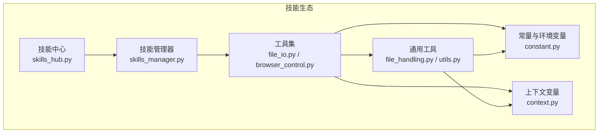
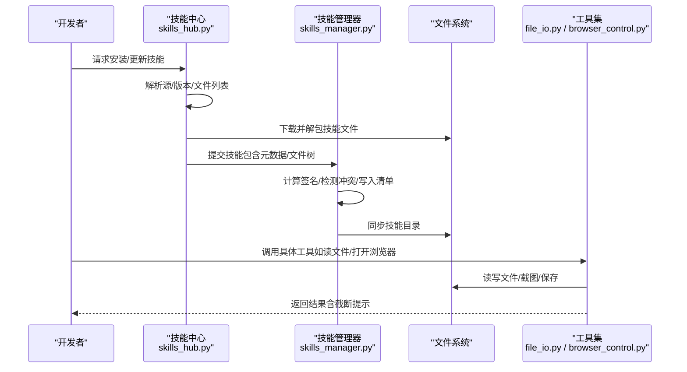
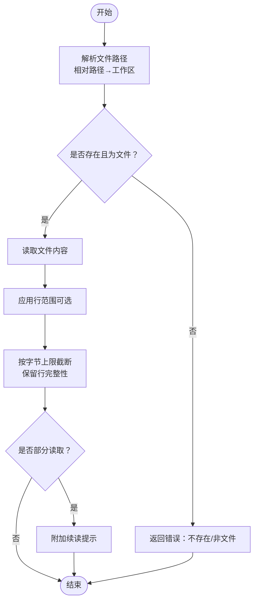
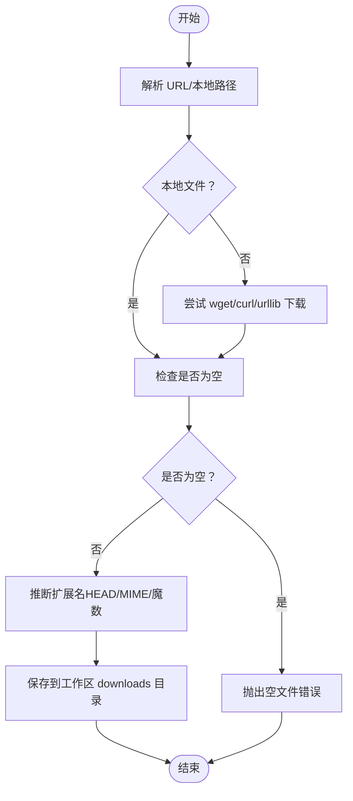
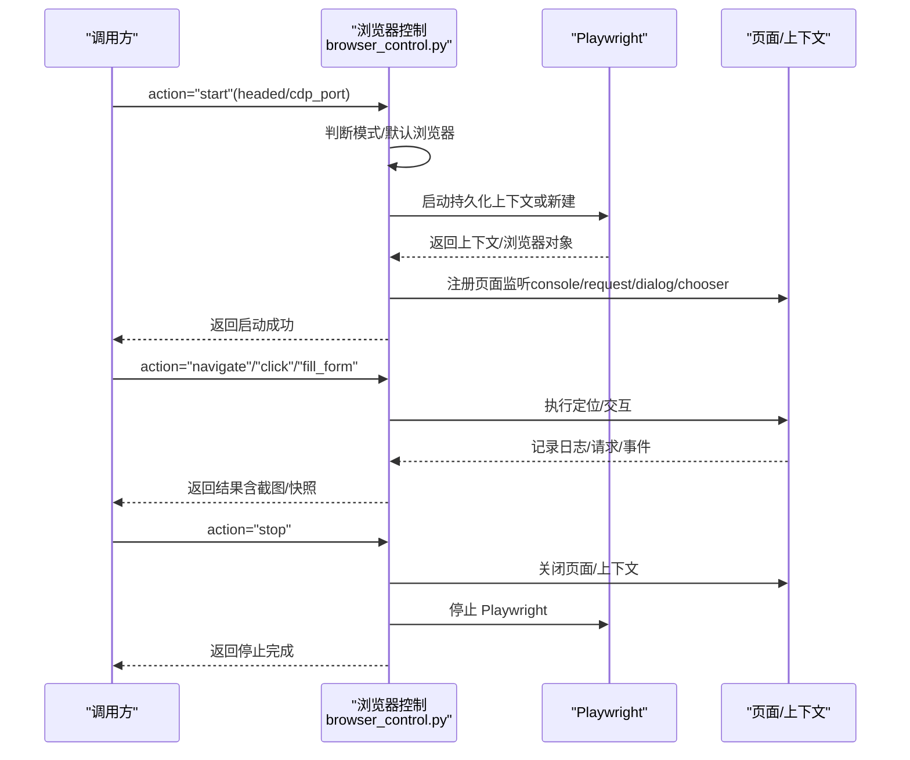
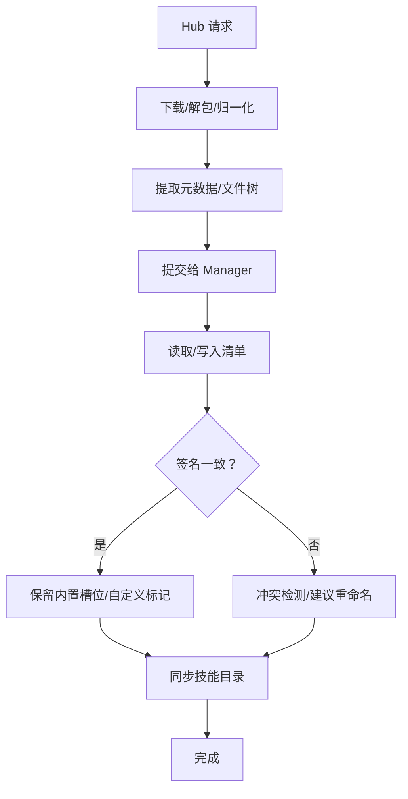
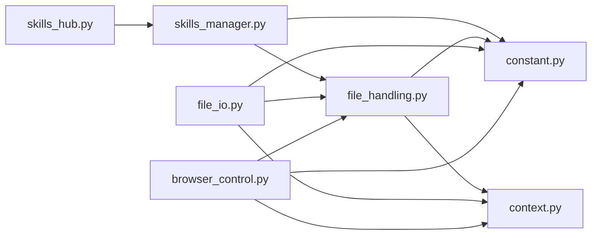

# 示例与模板

<cite>
**本文引用的文件**
- [skills_hub.py](file://src/qwenpaw/agents/skills_hub.py)
- [skills_manager.py](file://src/qwenpaw/agents/skills_manager.py)
- [file_io.py](file://src/qwenpaw/agents/tools/file_io.py)
- [browser_control.py](file://src/qwenpaw/agents/tools/browser_control.py)
- [file_handling.py](file://src/qwenpaw/agents/utils/file_handling.py)
- [utils.py](file://src/qwenpaw/agents/tools/utils.py)
- [constant.py](file://src/qwenpaw/constant.py)
- [context.py](file://src/qwenpaw/config/context.py)
</cite>

## 目录
1. [简介](#简介)
2. [项目结构](#项目结构)
3. [核心组件](#核心组件)
4. [架构总览](#架构总览)
5. [详细组件分析](#详细组件分析)
6. [依赖分析](#依赖分析)
7. [性能考虑](#性能考虑)
8. [故障排查指南](#故障排查指南)
9. [结论](#结论)
10. [附录](#附录)

## 简介
本文件面向“QwenPaw 技能开发”，提供从零到一的示例与模板资源，覆盖文件操作、网络请求、数据处理、浏览器自动化等典型场景。内容包括：
- 完整技能实现案例（以代码路径与流程图形式呈现）
- 技能开发模板文件、代码片段库与最佳实践范例
- 复杂技能的分步实现教程、调试技巧与常见问题解决方案
- 内置技能设计思路、架构模式与扩展方法
- 技能开发工具集、辅助脚本与自动化生成器
- 性能优化实例、内存管理技巧与并发处理模式
- 技能文档编写规范、测试用例模板与发布准备清单

## 项目结构
QwenPaw 的技能体系由“技能中心（Hub）”“技能管理器（Manager）”“工具集（Tools）”“通用工具（Utils）”“常量与上下文（Constant/Context）”构成，形成可插拔、可扩展、可安全运行的技能生态。

图表来源
- [skills_hub.py](file://src/qwenpaw/agents/skills_hub.py)
- [skills_manager.py](file://src/qwenpaw/agents/skills_manager.py)
- [file_io.py](file://src/qwenpaw/agents/tools/file_io.py)
- [browser_control.py](file://src/qwenpaw/agents/tools/browser_control.py)
- [file_handling.py](file://src/qwenpaw/agents/utils/file_handling.py)
- [utils.py](file://src/qwenpaw/agents/tools/utils.py)
- [constant.py](file://src/qwenpaw/constant.py)
- [context.py](file://src/qwenpaw/config/context.py)

章节来源
- [skills_hub.py](file://src/qwenpaw/agents/skills_hub.py)
- [skills_manager.py](file://src/qwenpaw/agents/skills_manager.py)
- [file_io.py](file://src/qwenpaw/agents/tools/file_io.py)
- [browser_control.py](file://src/qwenpaw/agents/tools/browser_control.py)
- [file_handling.py](file://src/qwenpaw/agents/utils/file_handling.py)
- [utils.py](file://src/qwenpaw/agents/tools/utils.py)
- [constant.py](file://src/qwenpaw/constant.py)
- [context.py](file://src/qwenpaw/config/context.py)

## 核心组件
- 技能中心（SkillsHub）
  - 负责从 Hub 源拉取技能包、解析元数据、校验冲突、下载与解包、注入工作区
  - 支持重试、超时、速率限制、取消检查、缓存等工程化能力
- 技能管理器（SkillsManager）
  - 负责技能清单（manifest）读写、签名计算、冲突检测、目录同步、环境变量注入
  - 提供工作区与共享池（skill_pool）双层管理
- 工具集（Tools）
  - 文件工具：读/写/追加/编辑文件；智能截断与编码兼容
  - 浏览器工具：Playwright 驱动的自动化（启动/停止、导航、截图、表单填写、CDP 连接等）
- 通用工具（Utils）
  - 文件下载（URL/base64）、编码回退、魔数推断、文本截断与重截断
- 常量与上下文（Constant/Context）
  - 统一环境变量加载、工作目录、媒体目录、日志级别、并发与限流配置
  - 上下文变量传递当前工作区与输出截断上限

章节来源
- [skills_hub.py](file://src/qwenpaw/agents/skills_hub.py)
- [skills_manager.py](file://src/qwenpaw/agents/skills_manager.py)
- [file_io.py](file://src/qwenpaw/agents/tools/file_io.py)
- [browser_control.py](file://src/qwenpaw/agents/tools/browser_control.py)
- [file_handling.py](file://src/qwenpaw/agents/utils/file_handling.py)
- [utils.py](file://src/qwenpaw/agents/tools/utils.py)
- [constant.py](file://src/qwenpaw/constant.py)
- [context.py](file://src/qwenpaw/config/context.py)

## 架构总览
技能从 Hub 下载到工作区后，由管理器进行签名比对与冲突处理，最终注册到运行时。工具通过统一的上下文与常量进行路径解析、编码选择与输出截断。

图表来源
- [skills_hub.py](file://src/qwenpaw/agents/skills_hub.py)
- [skills_manager.py](file://src/qwenpaw/agents/skills_manager.py)
- [file_io.py](file://src/qwenpaw/agents/tools/file_io.py)
- [browser_control.py](file://src/qwenpaw/agents/tools/browser_control.py)

## 详细组件分析

### 文件操作技能模板（读/写/追加/编辑）
- 典型场景
  - 读取配置文件/日志/表格片段，按行范围输出并自动截断
  - 在工作区中创建/覆盖/追加文本
  - 替换配置中的敏感字段或占位符
- 关键实现点
  - 路径解析：相对路径基于当前工作区目录
  - 编码策略：CSV/TSV/TXT 使用带 BOM 的 UTF-8，其他默认 UTF-8
  - 截断策略：按字节上限截断，保留行完整性，并附加续读提示
  - 错误处理：文件不存在、非文件、越界、异常等均返回结构化错误
- 参考路径
  - [路径解析与编码选择](file://src/qwenpaw/agents/tools/file_io.py)
  - [读取/写入/追加/替换实现](file://src/qwenpaw/agents/tools/file_io.py)
  - [截断与重截断逻辑](file://src/qwenpaw/agents/tools/utils.py)
  - [跨平台编码回退与下载工具](file://src/qwenpaw/agents/utils/file_handling.py)
  - [工作区与输出上限上下文](file://src/qwenpaw/config/context.py)
  - [工作目录与常量](file://src/qwenpaw/constant.py)

图表来源
- [file_io.py](file://src/qwenpaw/agents/tools/file_io.py)
- [utils.py](file://src/qwenpaw/agents/tools/utils.py)

章节来源
- [file_io.py](file://src/qwenpaw/agents/tools/file_io.py)
- [utils.py](file://src/qwenpaw/agents/tools/utils.py)
- [file_handling.py](file://src/qwenpaw/agents/utils/file_handling.py)
- [context.py](file://src/qwenpaw/config/context.py)
- [constant.py](file://src/qwenpaw/constant.py)

### 网络请求与文件下载模板（URL/Base64）
- 典型场景
  - 从 URL 或 Base64 数据下载文件，自动推断扩展名，支持空文件检测与多工具回退
- 关键实现点
  - 本地路径优先解析；远程 URL 通过 wget/curl/urllib 顺序尝试
  - 无法 HEAD 时使用 MIME 推断或魔数推断真实扩展名
  - 下载目录默认在工作区下的 downloads 子目录
- 参考路径
  - [URL 下载与扩展名推断](file://src/qwenpaw/agents/utils/file_handling.py)
  - [Base64 解码与落盘](file://src/qwenpaw/agents/utils/file_handling.py)
  - [工作区上下文与默认目录](file://src/qwenpaw/agents/utils/file_handling.py)
  - [工作区与输出上限上下文](file://src/qwenpaw/config/context.py)
  - [工作目录与常量](file://src/qwenpaw/constant.py)

图表来源
- [file_handling.py](file://src/qwenpaw/agents/utils/file_handling.py)
- [context.py](file://src/qwenpaw/config/context.py)
- [constant.py](file://src/qwenpaw/constant.py)

章节来源
- [file_handling.py](file://src/qwenpaw/agents/utils/file_handling.py)
- [context.py](file://src/qwenpaw/config/context.py)
- [constant.py](file://src/qwenpaw/constant.py)

### 浏览器自动化技能模板（Playwright）
- 典型场景
  - 自动打开浏览器、访问页面、截图、填写表单、等待元素、处理弹窗与文件选择器
  - 支持持久化上下文（用户数据目录）、CDP 连接、空闲回收
- 关键实现点
  - 模式切换：异步 Playwright（推荐）与同步 Playwright（Windows/Uvicorn 热重载）
  - 默认浏览器优先：系统默认（Chrome/Safari/WebKit），否则 Playwright 内置
  - 状态管理：每工作区独立状态机，包含页面、引用映射、控制台日志、网络请求、对话框、文件选择器
  - 空闲回收：超过阈值秒未活动则自动停止，释放渲染进程
- 参考路径
  - [浏览器状态与启动参数](file://src/qwenpaw/agents/tools/browser_control.py)
  - [持久化上下文与默认浏览器选择](file://src/qwenpaw/agents/tools/browser_control.py)
  - [页面监听与事件收集](file://src/qwenpaw/agents/tools/browser_control.py)
  - [空闲看门狗与退出清理](file://src/qwenpaw/agents/tools/browser_control.py)
  - [工作区输出路径解析](file://src/qwenpaw/agents/tools/browser_control.py)
  - [工作区与输出上限上下文](file://src/qwenpaw/config/context.py)
  - [工作目录与常量](file://src/qwenpaw/constant.py)

图表来源
- [browser_control.py](file://src/qwenpaw/agents/tools/browser_control.py)
- [context.py](file://src/qwenpaw/config/context.py)
- [constant.py](file://src/qwenpaw/constant.py)

章节来源
- [browser_control.py](file://src/qwenpaw/agents/tools/browser_control.py)
- [context.py](file://src/qwenpaw/config/context.py)
- [constant.py](file://src/qwenpaw/constant.py)

### 技能导入与安装流程（Hub → Manager）
- 典型场景
  - 从 Hub 拉取技能包，解析元数据与文件树，注入工作区，处理冲突与签名
- 关键实现点
  - Hub 层：构建请求、重试/超时/背压、取消检查、缓存、响应体大小限制
  - Manager 层：清单读写、原子写入、锁文件、签名计算、冲突建议命名
- 参考路径
  - [Hub 请求与解析](file://src/qwenpaw/agents/skills_hub.py)
  - [Hub 与 Manager 协作](file://src/qwenpaw/agents/skills_hub.py)
  - [清单读写与签名](file://src/qwenpaw/agents/skills_manager.py)
  - [冲突检测与建议命名](file://src/qwenpaw/agents/skills_manager.py)
  - [工作区与输出上限上下文](file://src/qwenpaw/config/context.py)
  - [工作目录与常量](file://src/qwenpaw/constant.py)

图表来源
- [skills_hub.py](file://src/qwenpaw/agents/skills_hub.py)
- [skills_manager.py](file://src/qwenpaw/agents/skills_manager.py)

章节来源
- [skills_hub.py](file://src/qwenpaw/agents/skills_hub.py)
- [skills_manager.py](file://src/qwenpaw/agents/skills_manager.py)
- [context.py](file://src/qwenpaw/config/context.py)
- [constant.py](file://src/qwenpaw/constant.py)

## 依赖分析
- 组件耦合
  - Tools 依赖 Context 与 Constant，确保路径解析与输出截断一致性
  - Utils 依赖 Constant 与 Context，提供下载、编码回退与截断能力
  - Manager 依赖 SkillsHub 的归一化产物与 Utils 的文件工具
- 外部依赖
  - Playwright（浏览器自动化）
  - aiofiles（异步文件读取）
  - frontmatter/yaml（SKILL.md 解析）
  - urllib/requests（HTTP 请求与下载）
- 循环依赖
  - 未发现循环依赖；各模块职责清晰，接口稳定

图表来源
- [browser_control.py](file://src/qwenpaw/agents/tools/browser_control.py)
- [file_io.py](file://src/qwenpaw/agents/tools/file_io.py)
- [file_handling.py](file://src/qwenpaw/agents/utils/file_handling.py)
- [utils.py](file://src/qwenpaw/agents/tools/utils.py)
- [skills_hub.py](file://src/qwenpaw/agents/skills_hub.py)
- [skills_manager.py](file://src/qwenpaw/agents/skills_manager.py)
- [constant.py](file://src/qwenpaw/constant.py)
- [context.py](file://src/qwenpaw/config/context.py)

章节来源
- [browser_control.py](file://src/qwenpaw/agents/tools/browser_control.py)
- [file_io.py](file://src/qwenpaw/agents/tools/file_io.py)
- [file_handling.py](file://src/qwenpaw/agents/utils/file_handling.py)
- [utils.py](file://src/qwenpaw/agents/tools/utils.py)
- [skills_hub.py](file://src/qwenpaw/agents/skills_hub.py)
- [skills_manager.py](file://src/qwenpaw/agents/skills_manager.py)
- [constant.py](file://src/qwenpaw/constant.py)
- [context.py](file://src/qwenpaw/config/context.py)

## 性能考虑
- I/O 与内存
  - 文件读取采用异步与最大字节数限制，避免大文件阻塞
  - 文本截断按字节边界切分，保留行完整性，减少重复传输
- 并发与限流
  - LLM 并发与 QPM 限流配置，避免 429
  - 工具调用前可设置输出截断上限，降低消息体积
- 资源回收
  - 浏览器空闲回收（默认 10 分钟），释放渲染进程
  - 退出清理，确保 Playwright 子进程被正确关闭
- 环境适配
  - 容器/Windows/macOS 下的启动参数差异，自动选择 WebKit 或系统 Chromium

章节来源
- [utils.py](file://src/qwenpaw/agents/tools/utils.py)
- [file_handling.py](file://src/qwenpaw/agents/utils/file_handling.py)
- [browser_control.py](file://src/qwenpaw/agents/tools/browser_control.py)
- [constant.py](file://src/qwenpaw/constant.py)

## 故障排查指南
- 浏览器相关
  - 启动失败：检查 Playwright 是否安装、可执行路径、容器沙箱参数
  - CDP 断开：需先断开再重新连接；端口占用需更换或停止占用进程
  - 空闲回收：确认是否长时间无活动导致自动停止
- 文件相关
  - 读取失败：检查编码（GBK/CP936/CP1252 回退）、路径是否绝对或相对解析正确
  - 截断异常：确认截断标记与续读参数是否匹配
- Hub/安装相关
  - 429/超时：调整重试次数与退避；设置 GITHUB_TOKEN 提升速率
  - 冲突：根据建议重命名或保留内置槽位
- 环境变量
  - 工作区目录、日志级别、并发与限流参数需按部署环境正确设置

章节来源
- [browser_control.py](file://src/qwenpaw/agents/tools/browser_control.py)
- [file_io.py](file://src/qwenpaw/agents/tools/file_io.py)
- [utils.py](file://src/qwenpaw/agents/tools/utils.py)
- [file_handling.py](file://src/qwenpaw/agents/utils/file_handling.py)
- [skills_hub.py](file://src/qwenpaw/agents/skills_hub.py)
- [skills_manager.py](file://src/qwenpaw/agents/skills_manager.py)
- [constant.py](file://src/qwenpaw/constant.py)

## 结论
通过本指南，开发者可以快速掌握 QwenPaw 技能开发的“从零到一”路径：以 Hub/Manager 为入口，以 Tools/Utils 为手段，以 Context/Constant 为保障，构建稳定、可扩展、可维护的技能生态。建议在实际项目中遵循“最小可用 + 渐进增强”的策略，逐步引入并发、限流与资源回收机制，确保生产级稳定性。

## 附录
- 技能开发模板清单
  - 文件操作：读取/写入/追加/编辑（参考路径）
  - 网络请求：URL 下载/Base64 解码（参考路径）
  - 浏览器自动化：启动/导航/截图/表单/CDP（参考路径）
- 最佳实践范例
  - 明确错误类型与返回格式，便于上层统一处理
  - 对大文件与长文本启用截断与续读
  - 在容器/Windows/macOS 环境下分别配置启动参数
- 文档编写规范
  - SKILL.md 包含 name/description/version/metadata.requires 等字段
  - references/scripts 目录用于组织依赖与脚本
- 测试用例模板
  - 覆盖正常路径、异常路径（文件不存在/空文件/权限不足）、边界条件（最大字节、最后一行）
- 发布准备清单
  - 签名一致性校验、冲突检测、清单更新、环境变量注入、安全扫描

章节来源
- [file_io.py](file://src/qwenpaw/agents/tools/file_io.py)
- [file_handling.py](file://src/qwenpaw/agents/utils/file_handling.py)
- [browser_control.py](file://src/qwenpaw/agents/tools/browser_control.py)
- [skills_hub.py](file://src/qwenpaw/agents/skills_hub.py)
- [skills_manager.py](file://src/qwenpaw/agents/skills_manager.py)
- [constant.py](file://src/qwenpaw/constant.py)
- [context.py](file://src/qwenpaw/config/context.py)