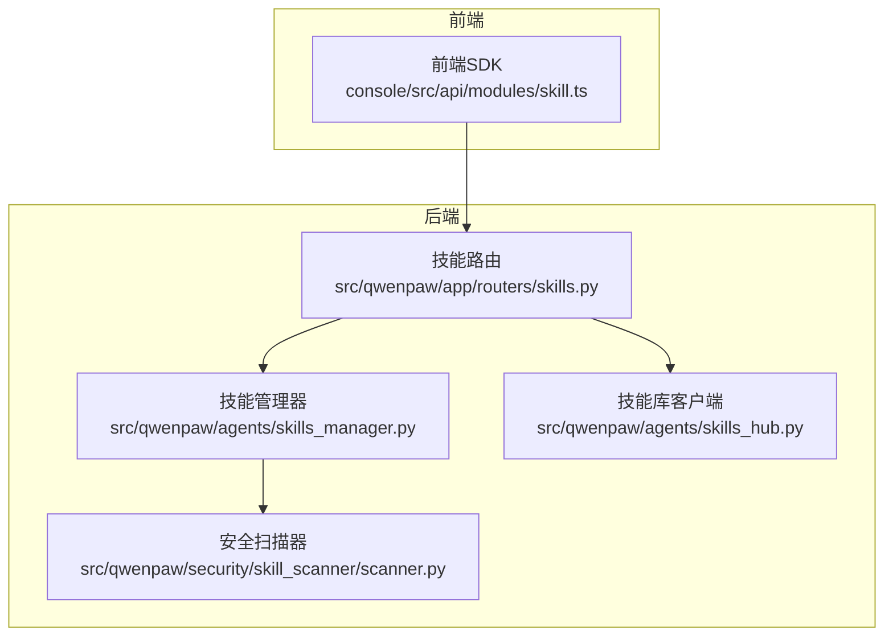
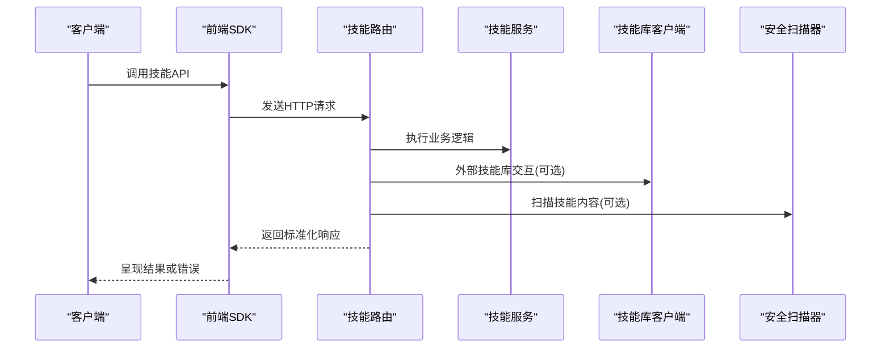
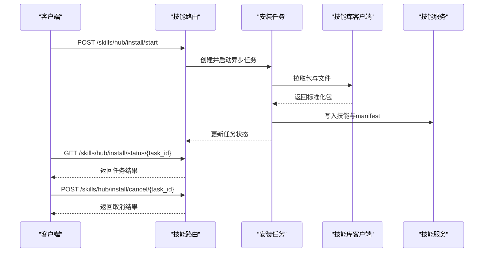
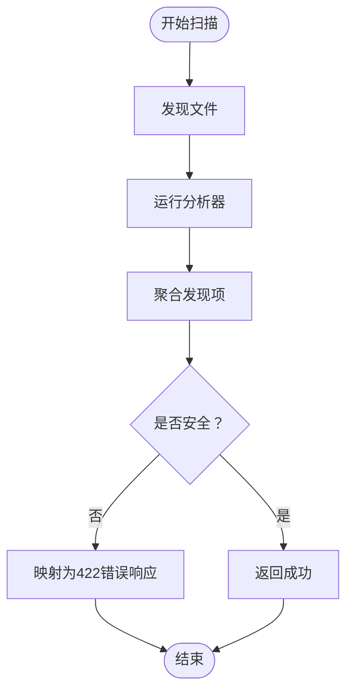
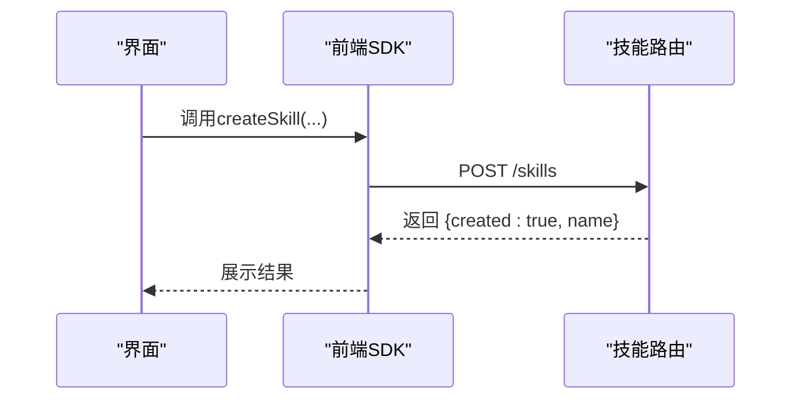
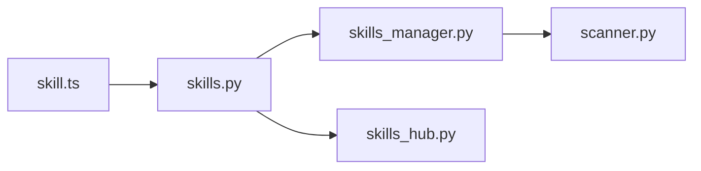

# API接口参考

<cite>
**本文档引用的文件**
- [skills.py](file://src/qwenpaw/app/routers/skills.py)
- [skills_manager.py](file://src/qwenpaw/agents/skills_manager.py)
- [skills_hub.py](file://src/qwenpaw/agents/skills_hub.py)
- [skill.ts](file://console/src/api/modules/skill.ts)
- [skill.ts](file://console/src/api/types/skill.ts)
- [scanner.py](file://src/qwenpaw/security/skill_scanner/scanner.py)
- [exceptions.py](file://src/qwenpaw/exceptions.py)
</cite>

## 目录
1. [简介](#简介)
2. [项目结构](#项目结构)
3. [核心组件](#核心组件)
4. [架构总览](#架构总览)
5. [详细组件分析](#详细组件分析)
6. [依赖分析](#依赖分析)
7. [性能考虑](#性能考虑)
8. [故障排除指南](#故障排除指南)
9. [结论](#结论)
10. [附录](#附录)

## 简介
本文件为 QwenPaw 技能API的完整接口参考，涵盖技能管理的注册、注销、查询、更新等全生命周期操作；技能配置管理、依赖解析、冲突检测；与外部技能库的集成、事件回调与异步任务支持；以及版本兼容性与迁移建议。文档同时提供前端SDK封装与后端实现的对应关系，便于前后端协同开发。

## 项目结构
技能API主要由三层构成：
- 后端FastAPI路由层：提供REST接口，负责请求校验、异步任务调度与安全扫描结果转换。
- 技能服务层：封装工作区技能与共享技能池的业务逻辑，包括创建、导入、启用/禁用、标签与渠道设置、配置持久化等。
- 技能库集成层：对接ClawHub等外部技能源，支持搜索、安装、版本选择与取消。

**图表来源**
- [skills.py](file://src/qwenpaw/app/routers/skills.py)
- [skills_manager.py](file://src/qwenpaw/agents/skills_manager.py)
- [skills_hub.py](file://src/qwenpaw/agents/skills_hub.py)
- [scanner.py](file://src/qwenpaw/security/skill_scanner/scanner.py)

**章节来源**
- [skills.py](file://src/qwenpaw/app/routers/skills.py)
- [skills_manager.py](file://src/qwenpaw/agents/skills_manager.py)
- [skills_hub.py](file://src/qwenpaw/agents/skills_hub.py)
- [scanner.py](file://src/qwenpaw/security/skill_scanner/scanner.py)

## 核心组件
- 技能路由模块：提供技能列表、刷新、搜索、导入、保存、启用/禁用、批量删除、配置读写、标签与渠道设置、AI优化流式接口等REST端点。
- 技能服务类：封装工作区技能（SkillService）与共享技能池（SkillPoolService）的CRUD、导入导出、冲突检测、内置包同步、下载/上传等能力。
- 技能库客户端：提供ClawHub等外部技能源的搜索、版本解析、文件拉取、包标准化、取消检查与重试机制。
- 安全扫描器：对技能目录进行模式匹配与规则扫描，生成统一的扫描结果模型，供路由层转换为稳定的API响应。

**章节来源**
- [skills.py](file://src/qwenpaw/app/routers/skills.py)
- [skills_manager.py](file://src/qwenpaw/agents/skills_manager.py)
- [skills_hub.py](file://src/qwenpaw/agents/skills_hub.py)
- [scanner.py](file://src/qwenpaw/security/skill_scanner/scanner.py)

## 架构总览
技能API采用分层设计，前端通过SDK发起请求，后端路由层统一处理输入输出与异常，业务逻辑集中在技能管理器中，安全扫描贯穿导入与创建流程，技能库客户端负责外部资源的获取与标准化。

**图表来源**
- [skills.py](file://src/qwenpaw/app/routers/skills.py)
- [skills_manager.py](file://src/qwenpaw/agents/skills_manager.py)
- [skills_hub.py](file://src/qwenpaw/agents/skills_hub.py)
- [scanner.py](file://src/qwenpaw/security/skill_scanner/scanner.py)

## 详细组件分析

### 技能路由与端点规范
- 基础路径：/skills
- 主要端点：
  - GET /skills：列出当前工作区技能
  - POST /skills/refresh：强制重新协调并返回技能列表
  - GET /skills/hub/search：搜索技能库
  - POST /skills/hub/install/start：开始从技能库安装任务（异步）
  - GET /skills/hub/install/status/{task_id}：查询安装任务状态
  - POST /skills/hub/install/cancel/{task_id}：取消安装任务
  - GET /skills/pool：列出共享技能池技能
  - POST /skills/pool/refresh：刷新共享技能池
  - GET /skills/pool/builtin-sources：列出内置包候选
  - POST /skills：创建工作区技能
  - POST /skills/upload：上传ZIP导入工作区技能
  - POST /skills/pool/create：创建工作区技能（共享池）
  - PUT /skills/pool/save：保存共享池技能（编辑/重命名）
  - POST /skills/pool/upload-zip：上传ZIP导入共享池
  - POST /skills/pool/import：从技能库导入到共享池
  - POST /skills/pool/download：从共享池下载到工作区
  - PUT /skills/{name}/channels：设置技能生效渠道
  - PUT /skills/{name}/tags：设置工作区技能标签
  - PUT /skills/pool/{name}/tags：设置共享池技能标签
  - GET /skills/{name}/config：获取技能配置
  - PUT /skills/{name}/config：更新技能配置
  - DELETE /skills/{name}/config：清空技能配置
  - GET /skills/pool/{name}/config：获取共享池技能配置
  - PUT /skills/pool/{name}/config：更新共享池技能配置
  - DELETE /skills/pool/{name}/config：清空共享池技能配置
  - POST /skills/ai/optimize/stream：AI优化流式接口

请求与响应模型：
- 请求体模型：CreateSkillRequest、SaveSkillRequest、SavePoolSkillRequest、UploadToPoolRequest、DownloadFromPoolRequest、HubInstallRequest、SkillConfigRequest、ImportBuiltinRequest 等。
- 响应体模型：SkillSpec、PoolSkillSpec、WorkspaceSkillSummary、HubSkillSpec、BuiltinImportSpec、HubInstallTask 等。

错误处理：
- 安全扫描失败：返回422，携带标准化错误载荷（type、skill_name、max_severity、findings）。
- 冲突与重名：返回409，携带冲突详情与建议名称。
- 参数错误：返回400，携带错误消息。
- 任务不存在：返回404。

**章节来源**
- [skills.py](file://src/qwenpaw/app/routers/skills.py)
- [skill.ts](file://console/src/api/types/skill.ts)

### 技能服务与生命周期
- 工作区技能（SkillService）
  - 创建：校验SKILL.md元数据，写入文件与manifest，执行安全扫描。
  - 导入ZIP：解压校验，逐个技能扫描，冲突检测，可选择启用。
  - 启用/禁用：仅更新manifest中的enabled字段，再次启用前会重新扫描。
  - 渠道与标签：设置channels与tags，支持“all”通配。
  - 配置管理：读取/更新/删除技能配置，支持按需注入环境变量。
  - 删除：仅允许删除未启用且存在磁盘目录的技能。
  - 文件访问：安全读取references/scripts子树文件。
- 共享技能池（SkillPoolService）
  - 创建/导入：与工作区类似，但不涉及启用。
  - 下载：从池复制到指定工作区，内置包冲突检测与升级提示。
  - 上传：从工作区复制到池，保留配置与标签。
  - 同步：内置包签名对比，标记同步状态。
  - 更新单个内置包：将池内内置包更新至最新打包版本。

冲突检测与重命名：
- 当目标名称已存在时，返回建议名称（时间戳后缀），避免覆盖。
- 内置包与自定义包区分：内置包签名变化时视为需要更新。

环境变量注入：
- 将配置中匹配metadata.requires.env的键注入为环境变量，未声明的键仅通过JSON变量可用。
- 保持宿主进程已有同名变量不变。

**章节来源**
- [skills_manager.py](file://src/qwenpaw/agents/skills_manager.py)

### 技能库集成与异步任务
- 搜索与版本解析：支持ClawHub与skills.sh等源，自动解析版本与文件列表。
- 包标准化：提取SKILL.md、references、scripts与额外文件，构建统一包结构。
- 异步安装任务：
  - 开始安装：创建任务并启动后台任务，支持取消事件。
  - 状态轮询：返回任务状态、错误与结果。
  - 取消安装：设置取消事件，清理临时导入。
- 重试与超时：基于环境变量配置HTTP重试次数、退避时间与超时。

**图表来源**
- [skills.py](file://src/qwenpaw/app/routers/skills.py)
- [skills_hub.py](file://src/qwenpaw/agents/skills_hub.py)
- [skills_manager.py](file://src/qwenpaw/agents/skills_manager.py)

**章节来源**
- [skills_hub.py](file://src/qwenpaw/agents/skills_hub.py)
- [skills.py](file://src/qwenpaw/app/routers/skills.py)

### 安全扫描与错误码
- 扫描器：遍历技能文件，运行分析器，聚合发现项，生成扫描结果。
- 错误映射：扫描失败时，路由层将异常转换为稳定的422响应，包含type、skill_name、max_severity与findings数组。
- 异常类型：SkillsError用于技能相关错误；SkillScanError用于扫描失败；其他通用异常映射为400/404。

**图表来源**
- [scanner.py](file://src/qwenpaw/security/skill_scanner/scanner.py)
- [skills.py](file://src/qwenpaw/app/routers/skills.py)
- [exceptions.py](file://src/qwenpaw/exceptions.py)

**章节来源**
- [scanner.py](file://src/qwenpaw/security/skill_scanner/scanner.py)
- [skills.py](file://src/qwenpaw/app/routers/skills.py)
- [exceptions.py](file://src/qwenpaw/exceptions.py)

### 前端SDK与使用示例
- 列表与刷新：listSkills、listSkillPoolSkills、refreshSkills、refreshSkillPool。
- 搜索与安装：searchHubSkills、startHubSkillInstall、getHubSkillInstallStatus、cancelHubSkillInstall。
- 创建与保存：createSkill、saveSkill、createSkillPoolSkill、saveSkillPoolSkill。
- 批量操作：batchEnableSkills、batchDeleteSkills、batchDeletePoolSkills。
- 配置与标签：updateSkillConfig、deleteSkillConfig、updateSkillTags、updatePoolSkillTags。
- 上传与下载：uploadSkill、uploadSkillPoolZip、uploadWorkspaceSkillToPool、downloadSkillPoolSkill。
- AI优化：streamOptimizeSkill（SSE流式）。

**图表来源**
- [skill.ts](file://console/src/api/modules/skill.ts)
- [skills.py](file://src/qwenpaw/app/routers/skills.py)

**章节来源**
- [skill.ts](file://console/src/api/modules/skill.ts)
- [skill.ts](file://console/src/api/types/skill.ts)

## 依赖分析
- 路由依赖：skills.py依赖技能管理器与技能库客户端，同时引入安全扫描异常类型。
- 管理器依赖：skills_manager.py依赖文件处理工具、frontmatter解析、安全扫描器与异常类型。
- 客户端依赖：skills_hub.py依赖HTTP请求、URL解析、缓存与重试策略。
- 前端依赖：前端SDK封装了所有后端端点，提供类型安全的调用接口。

**图表来源**
- [skills.py](file://src/qwenpaw/app/routers/skills.py)
- [skills_manager.py](file://src/qwenpaw/agents/skills_manager.py)
- [skills_hub.py](file://src/qwenpaw/agents/skills_hub.py)
- [scanner.py](file://src/qwenpaw/security/skill_scanner/scanner.py)
- [skill.ts](file://console/src/api/modules/skill.ts)

**章节来源**
- [skills.py](file://src/qwenpaw/app/routers/skills.py)
- [skills_manager.py](file://src/qwenpaw/agents/skills_manager.py)
- [skills_hub.py](file://src/qwenpaw/agents/skills_hub.py)
- [scanner.py](file://src/qwenpaw/security/skill_scanner/scanner.py)
- [skill.ts](file://console/src/api/modules/skill.ts)

## 性能考虑
- ZIP大小限制：上传ZIP最大100MB（路由层），解压后压缩包总大小不超过200MB（管理器层）。
- 并发与锁：manifest写入采用原子写入与文件锁，避免并发冲突。
- 缓存：前端SDK对技能列表与池列表提供短时缓存（默认30秒），支持按需失效。
- 异步任务：安装任务在后台线程执行，支持取消与状态轮询，避免阻塞主线程。
- 扫描限制：扫描器支持文件数量与单文件大小上限，防止大体积技能导致扫描耗时过长。

[本节为通用指导，无需特定文件引用]

## 故障排除指南
- 安全扫描失败（422）：检查findings中的严重级别与规则ID，修复后重试。
- 冲突与重名（409）：根据返回的suggested_name重命名目标名称。
- 参数错误（400）：核对请求体字段类型与长度限制（如标签数量、标签长度）。
- 任务不存在（404）：确认task_id正确，或重新发起安装任务。
- GitHub限流（429）：设置GITHUB_TOKEN以提升配额，或稍后重试。
- 环境变量注入问题：确保配置键与metadata.requires.env一致，缺失键会记录警告。

**章节来源**
- [skills.py](file://src/qwenpaw/app/routers/skills.py)
- [skills_manager.py](file://src/qwenpaw/agents/skills_manager.py)
- [skills_hub.py](file://src/qwenpaw/agents/skills_hub.py)

## 结论
QwenPaw技能API提供了完整的技能生命周期管理能力，结合安全扫描、冲突检测与异步任务机制，既满足本地开发场景，也支持与外部技能库的集成。前端SDK封装了丰富的操作接口，便于快速接入与扩展。

[本节为总结，无需特定文件引用]

## 附录

### 版本兼容性与废弃策略
- 语义化版本：技能清单采用schema_version字段标识版本，变更时需向后兼容。
- 迁移建议：当schema变更时，先执行reconcile_*接口重建清单，再逐步迁移旧字段。
- 废弃端点：如需下线旧端点，保留过渡期并在响应头中提示。

[本节为通用指导，无需特定文件引用]

### API调用示例（路径引用）
- 创建工作区技能：[POST /skills](file://src/qwenpaw/app/routers/skills.py)
- 上传ZIP导入：[POST /skills/upload](file://src/qwenpaw/app/routers/skills.py)
- 从技能库安装：[POST /skills/hub/install/start](file://src/qwenpaw/app/routers/skills.py)
- 获取安装状态：[GET /skills/hub/install/status/{task_id}](file://src/qwenpaw/app/routers/skills.py)
- 取消安装：[POST /skills/hub/install/cancel/{task_id}](file://src/qwenpaw/app/routers/skills.py)
- 更新技能配置：[PUT /skills/{name}/config](file://src/qwenpaw/app/routers/skills.py)
- AI优化流式接口：[POST /skills/ai/optimize/stream](file://src/qwenpaw/app/routers/skills.py)

**章节来源**
- [skills.py](file://src/qwenpaw/app/routers/skills.py)