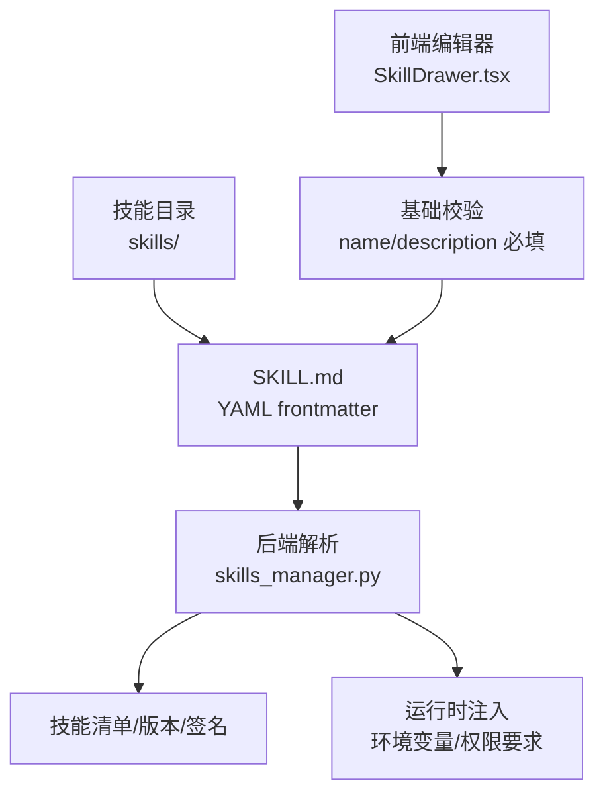
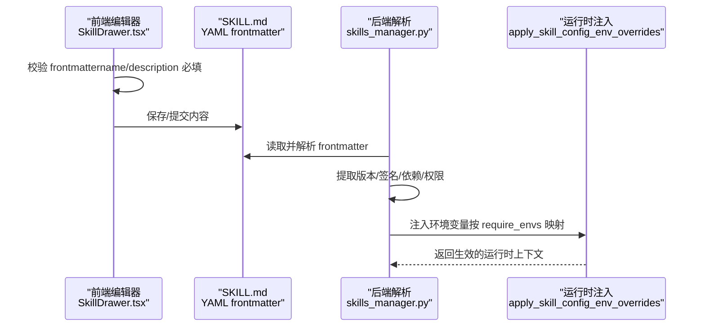
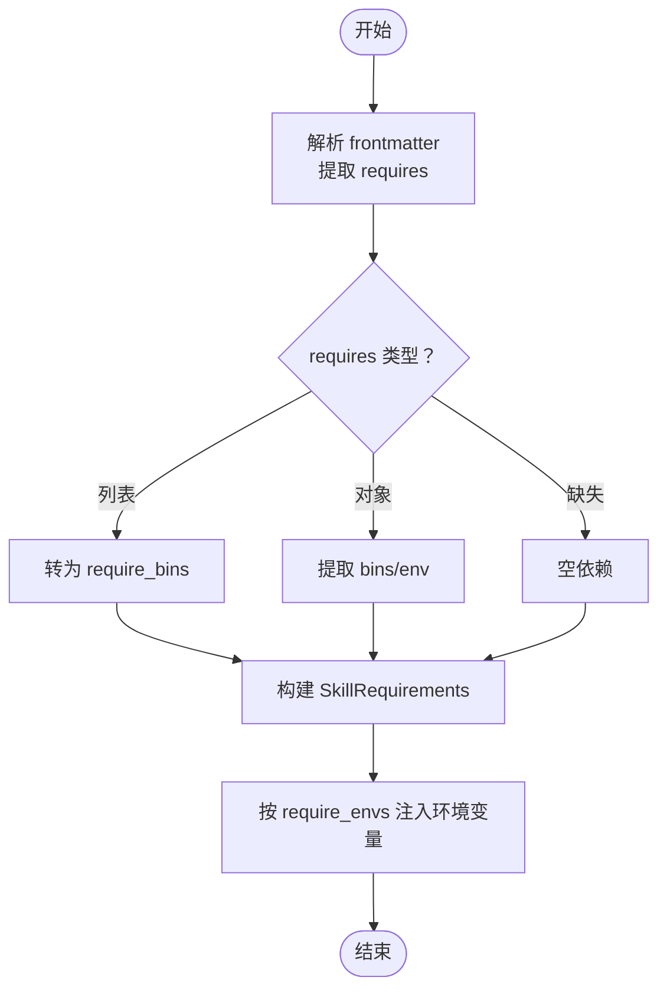
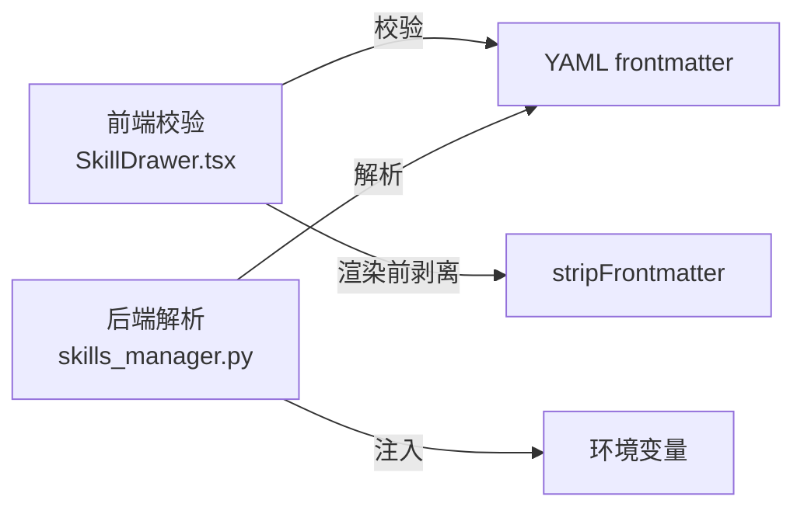

# 元数据配置规范

<cite>
**本文引用的文件**
- [SKILL.md（QA_source_index）](file://src/qwenpaw/agents/skills/QA_source_index/SKILL.md)
- [SKILL.md（browser_visible）](file://src/qwenpaw/agents/skills/browser_visible/SKILL.md)
- [SKILL.md（docx）](file://src/qwenpaw/agents/skills/docx/SKILL.md)
- [SKILL.md（file_reader）](file://src/qwenpaw/agents/skills/file_reader/SKILL.md)
- [SKILL.md（guidance）](file://src/qwenpaw/agents/skills/guidance/SKILL.md)
- [skills_manager.py](file://src/qwenpaw/agents/skills_manager.py)
- [skills_hub.py](file://src/qwenpaw/agents/skills_hub.py)
- [SkillDrawer.tsx](file://console/src/pages/Agent/Skills/components/SkillDrawer.tsx)
- [PoolSkillDrawer.tsx](file://console/src/pages/Settings/SkillPool/components/PoolSkillDrawer.tsx)
- [markdown.ts](file://console/src/utils/markdown.ts)
</cite>

## 目录
1. [简介](#简介)
2. [项目结构](#项目结构)
3. [核心组件](#核心组件)
4. [架构总览](#架构总览)
5. [详细组件分析](#详细组件分析)
6. [依赖分析](#依赖分析)
7. [性能考虑](#性能考虑)
8. [故障排查指南](#故障排查指南)
9. [结论](#结论)
10. [附录](#附录)

## 简介
本规范面向 QwenPaw 技能（Skill）的元数据配置，聚焦 SKILL.md 文件的 frontmatter 结构与解析规则，明确必需字段与可选字段、版本与作者信息、分类标签与关键词、图标标识、依赖声明、运行时要求、权限配置、配置项类型约束与默认值、国际化与多语言描述、以及常见错误与最佳实践。本文同时梳理了前端校验与后端解析的关键实现点，帮助开发者编写高质量、可被系统正确识别与使用的技能元数据。

## 项目结构
- 技能元数据位于各技能目录下的 SKILL.md 文件，采用 YAML frontmatter（由三短横线包裹）承载元数据。
- 后端通过 frontmatter 解析与自定义规则构建技能清单、版本与签名、运行时注入等。
- 前端在编辑器侧进行基础校验，确保 name、description 等关键字段存在。

图表来源
- [skills_manager.py:207-247](file://src/qwenpaw/agents/skills_manager.py#L207-L247)
- [SkillDrawer.tsx:91-112](file://console/src/pages/Agent/Skills/components/SkillDrawer.tsx#L91-L112)

章节来源
- [skills_manager.py:207-247](file://src/qwenpaw/agents/skills_manager.py#L207-L247)
- [SkillDrawer.tsx:91-112](file://console/src/pages/Agent/Skills/components/SkillDrawer.tsx#L91-L112)

## 核心组件
- 前端校验组件：在编辑器中对 SKILL.md 的 frontmatter 进行基础校验，要求存在 name 与 description。
- 后端解析组件：读取 SKILL.md，解析 frontmatter，提取版本、依赖、运行时要求、签名等。
- 技能池与 Hub：支持从 Hub 导入技能，解析 bundle 并生成本地 SKILL.md 与资源树。

章节来源
- [SkillDrawer.tsx:91-112](file://console/src/pages/Agent/Skills/components/SkillDrawer.tsx#L91-L112)
- [skills_manager.py:207-247](file://src/qwenpaw/agents/skills_manager.py#L207-L247)
- [skills_hub.py:643-702](file://src/qwenpaw/agents/skills_hub.py#L643-L702)

## 架构总览
下图展示从前端编辑到后端解析与运行时注入的端到端流程。

图表来源
- [SkillDrawer.tsx:91-112](file://console/src/pages/Agent/Skills/components/SkillDrawer.tsx#L91-L112)
- [skills_manager.py:207-247](file://src/qwenpaw/agents/skills_manager.py#L207-L247)
- [skills_manager.py:674-718](file://src/qwenpaw/agents/skills_manager.py#L674-L718)

## 详细组件分析

### 1) SKILL.md frontmatter 字段规范
- 必需字段
  - name：技能稳定标识，建议与目录名一致，用于路由与同步。
  - description：技能简述，用于 UI 展示与检索。
- 可选字段
  - metadata：命名空间对象，支持多厂商/生态扩展。
    - metadata.qwenpaw：QwenPaw 生态专属元数据
      - emoji：图标标识，便于 UI 渲染。
      - requires：运行时依赖声明，详见“依赖与权限”。
    - metadata.builtin_skill_version：内置技能版本号，用于版本比较与更新提示。
  - license：许可证声明（示例：docx 技能包含许可证文本）。
- 解析与回退
  - 后端使用 frontmatter 解析 SKILL.md；若解析失败或缺失，将回退至使用目录名为 name，description 为空字符串。

章节来源
- [SKILL.md（QA_source_index）:1-9](file://src/qwenpaw/agents/skills/QA_source_index/SKILL.md#L1-L9)
- [SKILL.md（browser_visible）:1-9](file://src/qwenpaw/agents/skills/browser_visible/SKILL.md#L1-L9)
- [SKILL.md（docx）:1-7](file://src/qwenpaw/agents/skills/docx/SKILL.md#L1-L7)
- [SKILL.md（file_reader）:1-9](file://src/qwenpaw/agents/skills/file_reader/SKILL.md#L1-L9)
- [SKILL.md（guidance）:1-9](file://src/qwenpaw/agents/skills/guidance/SKILL.md#L1-L9)
- [skills_manager.py:207-247](file://src/qwenpaw/agents/skills_manager.py#L207-L247)

### 2) 版本与作者信息
- 版本号
  - 优先级：metadata.builtin_skill_version > metadata.version > version > 空字符串。
  - 用于 UI 展示与更新提示，建议遵循语义化版本。
- 作者信息
  - frontmatter 中未强制要求作者字段；可在正文或外部文档中补充。

章节来源
- [skills_manager.py:249-258](file://src/qwenpaw/agents/skills_manager.py#L249-L258)

### 3) 分类标签、关键词与图标标识
- 分类标签与关键词
  - frontmatter 中未强制要求 tags/keywords 字段；可在前端编辑器中通过独立字段维护。
- 图标标识
  - metadata.qwenpaw.emoji：用于 UI 渲染，建议使用语义清晰的表情符号。

章节来源
- [PoolSkillDrawer.tsx:107-131](file://console/src/pages/Settings/SkillPool/components/PoolSkillDrawer.tsx#L107-L131)
- [SKILL.md（browser_visible）:6-8](file://src/qwenpaw/agents/skills/browser_visible/SKILL.md#L6-L8)

### 4) 依赖声明、运行时要求与权限配置
- 依赖声明
  - metadata.qwenpaw.requires 支持两种形式：
    - 列表：["bin1","bin2"]，等价于 require_bins。
    - 对象：{"bins":["bin1"],"env":["VAR1"]}，等价于 require_bins 与 require_envs。
  - 后端解析会规范化为 SkillRequirements 模型。
- 权限与环境变量注入
  - 当配置中存在与 require_envs 匹配的键时，将以环境变量形式注入运行时。
  - 全量配置可通过 QWENPAW_SKILL_CONFIG_<NAME> 注入（NAME 为技能名大写并替换非字母字符为下划线）。
  - 未提供的必填项会记录警告。

图表来源
- [skills_manager.py:543-572](file://src/qwenpaw/agents/skills_manager.py#L543-L572)
- [skills_manager.py:590-631](file://src/qwenpaw/agents/skills_manager.py#L590-L631)

章节来源
- [skills_manager.py:543-572](file://src/qwenpaw/agents/skills_manager.py#L543-L572)
- [skills_manager.py:590-631](file://src/qwenpaw/agents/skills_manager.py#L590-L631)

### 5) 配置项类型约束、默认值与验证规则
- 类型约束
  - requires.bins：字符串数组，表示系统二进制依赖。
  - requires.env：字符串数组，表示需要注入的环境变量名。
- 默认值
  - 若 frontmatter 缺失或格式异常，后端回退：name=目录名，description=""。
- 前端验证
  - 必须存在 name 与 description；否则拒绝提交。
  - 标签长度限制与数量上限（前端侧）。

章节来源
- [skills_manager.py:221-247](file://src/qwenpaw/agents/skills_manager.py#L221-L247)
- [SkillDrawer.tsx:91-112](file://console/src/pages/Agent/Skills/components/SkillDrawer.tsx#L91-L112)
- [PoolSkillDrawer.tsx:112-131](file://console/src/pages/Settings/SkillPool/components/PoolSkillDrawer.tsx#L112-L131)

### 6) 国际化与多语言描述
- frontmatter 本身不包含多语言字段；多语言内容通常放置于正文或外部文档。
- 前端渲染前会剥离 frontmatter，避免 YAML 被误渲染为 HTML。
- 建议在网站文档中按语言维护独立的文档文件（如 config.zh.md、config.en.md），以便技能在回答时按用户语言选择对应文档。

章节来源
- [markdown.ts:1-9](file://console/src/utils/markdown.ts#L1-L9)
- [guidance 技能:93-95](file://src/qwenpaw/agents/skills/guidance/SKILL.md#L93-L95)

### 7) 示例与最佳实践
- 示例来源
  - browser_visible：展示了 name、description、metadata.qwenpaw.emoji、metadata.qwenpaw.requires 的典型用法。
  - QA_source_index：展示了最小化 frontmatter 的用法。
  - file_reader：强调了 text-based 文件处理范围与安全行为。
  - docx：包含 license 字段与丰富的正文内容，适合参考多字段组合。
- 最佳实践
  - 保持 name 与目录名一致，避免运行时冲突。
  - 严格声明 require_bins 与 require_envs，确保运行时可发现性。
  - 使用 metadata.builtin_skill_version 统一版本管理。
  - 使用 metadata.qwenpaw.emoji 提升 UI 可读性。
  - 将多语言文档与正文分离，frontmatter 仅保留结构化元数据。

章节来源
- [SKILL.md（browser_visible）:1-9](file://src/qwenpaw/agents/skills/browser_visible/SKILL.md#L1-L9)
- [SKILL.md（QA_source_index）:1-9](file://src/qwenpaw/agents/skills/QA_source_index/SKILL.md#L1-L9)
- [SKILL.md（file_reader）:1-9](file://src/qwenpaw/agents/skills/file_reader/SKILL.md#L1-L9)
- [SKILL.md（docx）:1-7](file://src/qwenpaw/agents/skills/docx/SKILL.md#L1-L7)

## 依赖分析
- 前端依赖
  - 前端编辑器依赖 YAML frontmatter 校验逻辑，确保 name/description 存在。
  - 前端渲染依赖 stripFrontmatter 工具，避免 frontmatter 被错误渲染。
- 后端依赖
  - 后端依赖 frontmatter 库解析 SKILL.md。
  - 后端依赖自定义规则提取版本、签名、依赖与权限，并注入运行时环境变量。

图表来源
- [SkillDrawer.tsx:91-112](file://console/src/pages/Agent/Skills/components/SkillDrawer.tsx#L91-L112)
- [markdown.ts:1-9](file://console/src/utils/markdown.ts#L1-L9)
- [skills_manager.py:207-247](file://src/qwenpaw/agents/skills_manager.py#L207-L247)

章节来源
- [SkillDrawer.tsx:91-112](file://console/src/pages/Agent/Skills/components/SkillDrawer.tsx#L91-L112)
- [markdown.ts:1-9](file://console/src/utils/markdown.ts#L1-L9)
- [skills_manager.py:207-247](file://src/qwenpaw/agents/skills_manager.py#L207-L247)

## 性能考虑
- frontmatter 解析与文件读取
  - 后端在解析 SKILL.md 时采用编码回退策略，提升跨平台兼容性，但会增加 IO 成本。建议控制 SKILL.md 体积与复杂度。
- 签名计算
  - 签名基于技能目录树与内容，变更任一文件都会导致签名变化。频繁变更会影响同步与冲突检测效率，建议合理组织资源与版本控制。
- 运行时注入
  - 环境变量注入按需进行，仅对匹配的键生效。建议精简 require_envs，避免不必要的注入。

章节来源
- [skills_manager.py:274-291](file://src/qwenpaw/agents/skills_manager.py#L274-L291)
- [skills_manager.py:674-718](file://src/qwenpaw/agents/skills_manager.py#L674-L718)

## 故障排查指南
- 常见错误
  - frontmatter 缺失或格式错误：后端将回退为 name=目录名、description=空字符串；前端会阻止提交。
  - 缺少 name 或 description：前端校验失败，需补齐。
  - require_envs 未提供：运行时会记录警告，建议完善配置。
- 排查步骤
  - 检查 SKILL.md 是否以 YAML frontmatter 包裹，字段是否拼写正确。
  - 使用后端解析函数确认返回的版本、签名与依赖是否符合预期。
  - 在运行时检查环境变量注入情况，确认 require_envs 与配置键一致。

章节来源
- [skills_manager.py:221-247](file://src/qwenpaw/agents/skills_manager.py#L221-L247)
- [SkillDrawer.tsx:91-112](file://console/src/pages/Agent/Skills/components/SkillDrawer.tsx#L91-L112)
- [skills_manager.py:618-626](file://src/qwenpaw/agents/skills_manager.py#L618-L626)

## 结论
QwenPaw 的技能元数据以 SKILL.md 的 YAML frontmatter 为核心，结合前后端解析与注入机制，实现了稳定的技能识别、版本管理与运行时配置。遵循本文规范，可确保技能在导入、展示、运行与更新全链路的可靠性与一致性。

## 附录

### A. 字段对照表
- 必需字段
  - name：技能稳定标识
  - description：技能简述
- 可选字段
  - metadata：命名空间对象
    - metadata.builtin_skill_version：内置技能版本号
    - metadata.qwenpaw.emoji：图标标识
    - metadata.qwenpaw.requires：运行时依赖声明
  - license：许可证声明

章节来源
- [SKILL.md（browser_visible）:1-9](file://src/qwenpaw/agents/skills/browser_visible/SKILL.md#L1-L9)
- [SKILL.md（docx）:1-7](file://src/qwenpaw/agents/skills/docx/SKILL.md#L1-L7)
- [skills_manager.py:249-258](file://src/qwenpaw/agents/skills_manager.py#L249-L258)

### B. 前端校验规则
- 必须存在 name 与 description。
- 标签长度与数量限制（前端侧）。

章节来源
- [SkillDrawer.tsx:91-112](file://console/src/pages/Agent/Skills/components/SkillDrawer.tsx#L91-L112)
- [PoolSkillDrawer.tsx:112-131](file://console/src/pages/Settings/SkillPool/components/PoolSkillDrawer.tsx#L112-L131)

### C. Hub 导入与解析要点
- 支持从 Hub 导入技能，解析 bundle 生成本地 SKILL.md 与资源树。
- 若 bundle 缺失 SKILL.md，将抛出错误。

章节来源
- [skills_hub.py:643-702](file://src/qwenpaw/agents/skills_hub.py#L643-L702)
- [skills_hub.py:628-634](file://src/qwenpaw/agents/skills_hub.py#L628-L634)