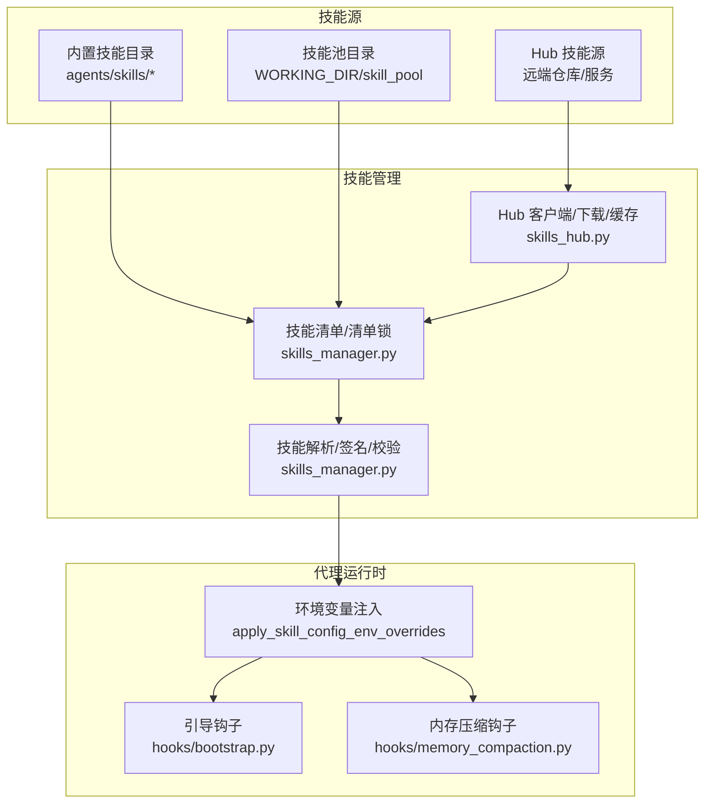
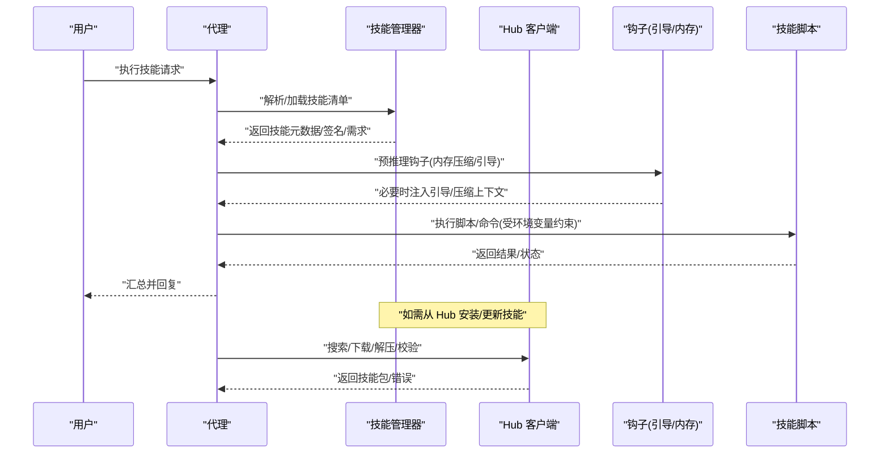
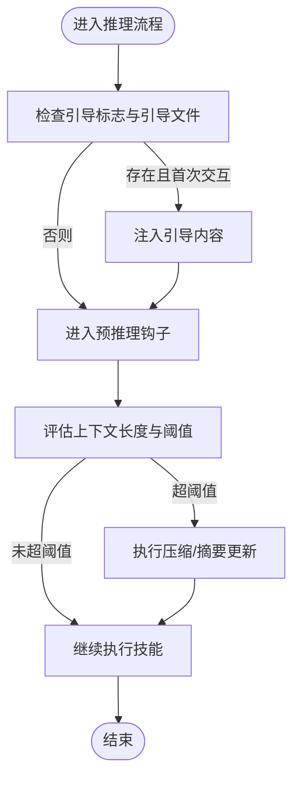
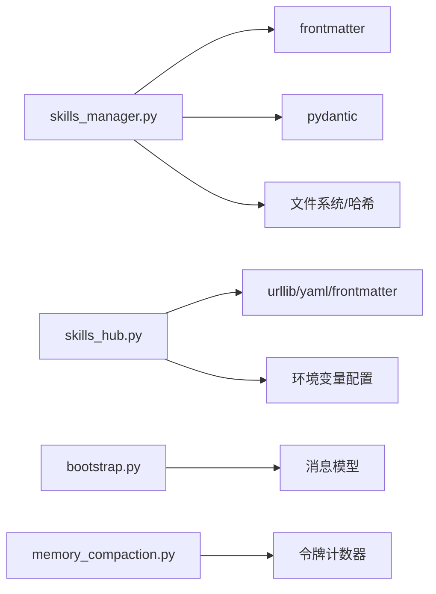

# 技能函数定义规范

<cite>
**本文引用的文件**
- [skills_hub.py](file://src/qwenpaw/agents/skills_hub.py)
- [skills_manager.py](file://src/qwenpaw/agents/skills_manager.py)
- [bootstrap.py](file://src/qwenpaw/agents/hooks/bootstrap.py)
- [memory_compaction.py](file://src/qwenpaw/agents/hooks/memory_compaction.py)
- [browser_cdp/SKILL.md](file://src/qwenpaw/agents/skills/browser_cdp/SKILL.md)
- [file_reader/SKILL.md](file://src/qwenpaw/agents/skills/file_reader/SKILL.md)
- [news/SKILL.md](file://src/qwenpaw/agents/skills/news/SKILL.md)
- [pdf/SKILL.md](file://src/qwenpaw/agents/skills/pdf/SKILL.md)
- [docx/SKILL.md](file://src/qwenpaw/agents/skills/docx/SKILL.md)
</cite>

## 目录
1. [简介](#简介)
2. [项目结构](#项目结构)
3. [核心组件](#核心组件)
4. [架构总览](#架构总览)
5. [详细组件分析](#详细组件分析)
6. [依赖分析](#依赖分析)
7. [性能考虑](#性能考虑)
8. [故障排查指南](#故障排查指南)
9. [结论](#结论)
10. [附录](#附录)

## 简介
本规范面向 QwenPaw 的“技能函数”（Skill Function）定义与实现，系统性阐述技能函数的语法结构、参数与返回值约定、生命周期钩子、错误处理与日志记录、与代理系统的交互协议与状态管理，并结合内置技能示例给出正确与常见错误的对比与修正建议。目标是帮助开发者编写安全、可维护、可扩展的技能函数。

## 项目结构
QwenPaw 将技能以“技能包”形式组织，每个技能包包含描述文件（SKILL.md）与可选脚本/资源。技能的安装、解析、校验与注册由技能管理模块负责；代理在运行期通过钩子与环境变量注入等方式与技能协作。

图示来源
- [skills_manager.py:120-170](file://src/qwenpaw/agents/skills_manager.py#L120-L170)
- [skills_hub.py:191-223](file://src/qwenpaw/agents/skills_hub.py#L191-L223)
- [bootstrap.py:20-104](file://src/qwenpaw/agents/hooks/bootstrap.py#L20-L104)
- [memory_compaction.py:27-214](file://src/qwenpaw/agents/hooks/memory_compaction.py#L27-L214)

章节来源
- [skills_manager.py:120-170](file://src/qwenpaw/agents/skills_manager.py#L120-L170)
- [skills_hub.py:191-223](file://src/qwenpaw/agents/skills_hub.py#L191-L223)
- [bootstrap.py:20-104](file://src/qwenpaw/agents/hooks/bootstrap.py#L20-L104)
- [memory_compaction.py:27-214](file://src/qwenpaw/agents/hooks/memory_compaction.py#L27-L214)

## 核心组件
- 技能清单与元数据
  - 技能名称、描述、版本、更新时间、签名、来源、保护标记、需求声明等，均来自 SKILL.md frontmatter 与技能目录内容摘要。
- 技能解析与校验
  - 解析 frontmatter、提取版本与需求、构建内容签名、过滤无关文件、校验 zip 安全性、路径合法性。
- 技能池与工作区同步
  - 维护技能池与工作区的 manifest，支持内置/自定义区分、冲突检测与重命名建议。
- Hub 客户端
  - 支持从远端 Hub 搜索、拉取、解压、缓存、错误重试与速率限制处理。
- 运行时钩子
  - 引导钩子：首次交互时注入引导内容。
  - 内存压缩钩子：根据上下文长度阈值进行压缩与摘要更新。

章节来源
- [skills_manager.py:65-82](file://src/qwenpaw/agents/skills_manager.py#L65-L82)
- [skills_manager.py:207-247](file://src/qwenpaw/agents/skills_manager.py#L207-L247)
- [skills_manager.py:274-291](file://src/qwenpaw/agents/skills_manager.py#L274-L291)
- [skills_manager.py:453-474](file://src/qwenpaw/agents/skills_manager.py#L453-L474)
- [skills_manager.py:528-541](file://src/qwenpaw/agents/skills_manager.py#L528-L541)
- [skills_hub.py:58-72](file://src/qwenpaw/agents/skills_hub.py#L58-L72)
- [skills_hub.py:291-403](file://src/qwenpaw/agents/skills_hub.py#L291-L403)
- [bootstrap.py:20-104](file://src/qwenpaw/agents/hooks/bootstrap.py#L20-L104)
- [memory_compaction.py:27-214](file://src/qwenpaw/agents/hooks/memory_compaction.py#L27-L214)

## 架构总览
技能函数并非单一函数，而是由“技能包 + 运行时钩子 + 环境注入 + 安全扫描”共同构成的运行体系。技能包内通常包含：
- SKILL.md：技能元数据与使用说明
- scripts/*：可选的执行脚本
- references/*：可选的引用资源

运行时通过 apply_skill_config_env_overrides 将技能配置映射为环境变量，供脚本/命令使用；钩子在推理前后进行上下文管理与引导注入。

图示来源
- [skills_manager.py:673-718](file://src/qwenpaw/agents/skills_manager.py#L673-L718)
- [skills_hub.py:291-403](file://src/qwenpaw/agents/skills_hub.py#L291-L403)
- [bootstrap.py:42-104](file://src/qwenpaw/agents/hooks/bootstrap.py#L42-L104)
- [memory_compaction.py:62-214](file://src/qwenpaw/agents/hooks/memory_compaction.py#L62-L214)

## 详细组件分析

### 技能函数基本语法与结构
- 文件与目录
  - 每个技能以目录形式存在，根目录包含 SKILL.md；可选 scripts/ 与 references/ 子目录。
- 描述文件（SKILL.md）
  - 必须包含 YAML frontmatter，至少包含 name、description 字段；metadata 中可包含版本、emoji、requires 等。
  - 内容主体用于指导如何调用技能、参数示例与注意事项。
- 脚本与命令
  - 通过 execute_shell_command 或内部脚本执行，遵循 cwd 与相对路径约定。
- 类型注解与返回值
  - 由于技能以脚本/命令形式执行，推荐在 SKILL.md 中以 JSON 示例明确 action 与字段含义；返回值建议统一为 JSON 结构，包含 ok、message、error 等字段以便上层解析。

章节来源
- [browser_cdp/SKILL.md:1-28](file://src/qwenpaw/agents/skills/browser_cdp/SKILL.md#L1-L28)
- [file_reader/SKILL.md:1-9](file://src/qwenpaw/agents/skills/file_reader/SKILL.md#L1-L9)
- [news/SKILL.md:1-9](file://src/qwenpaw/agents/skills/news/SKILL.md#L1-L9)
- [pdf/SKILL.md:1-7](file://src/qwenpaw/agents/skills/pdf/SKILL.md#L1-L7)
- [docx/SKILL.md:1-7](file://src/qwenpaw/agents/skills/docx/SKILL.md#L1-L7)

### 参数定义规则与类型注解
- 参数来源
  - 通过环境变量注入：apply_skill_config_env_overrides 会将技能配置映射为环境变量，键名规则为 QWENPAW_SKILL_CONFIG_<NAME>（大写、非字母替换为下划线）。
  - 也可通过 require_envs 声明所需环境变量，仅匹配项会被注入。
- 参数校验
  - 路径与文件名规范化：禁止空名、NUL 字节、绝对路径、路径穿越；zip 安全性检查（大小上限、不允许符号链接）。
- 类型注解
  - 建议在 SKILL.md 中以 JSON Schema 形式描述参数字段类型与必填性；返回值统一为对象结构，便于上层解析。

章节来源
- [skills_manager.py:580-587](file://src/qwenpaw/agents/skills_manager.py#L580-L587)
- [skills_manager.py:590-631](file://src/qwenpaw/agents/skills_manager.py#L590-L631)
- [skills_manager.py:476-494](file://src/qwenpaw/agents/skills_manager.py#L476-L494)
- [skills_manager.py:453-474](file://src/qwenpaw/agents/skills_manager.py#L453-L474)

### 返回值格式要求
- 统一结构
  - 建议返回包含 ok、message、error 等字段的对象；ok 为布尔值表示成功与否；error 用于承载错误详情；message 用于承载成功信息或摘要。
- 上下文与摘要
  - 在内存压缩钩子中，压缩后的摘要会作为系统提示的一部分参与 token 计算，避免上下文溢出。

章节来源
- [memory_compaction.py:167-204](file://src/qwenpaw/agents/hooks/memory_compaction.py#L167-L204)

### 生命周期钩子与执行顺序
- 引导钩子（BootstrapHook）
  - 作用：首次用户交互时，读取 BOOTSTRAP.md 并将其内容前置到第一条用户消息之前，帮助建立代理身份与偏好。
  - 触发条件：工作目录存在 BOOTSTRAP.md 且为首次用户交互；完成后写入 .bootstrap_completed 标记防止重复触发。
- 内存压缩钩子（MemoryCompactionHook）
  - 作用：在推理前检查上下文长度，超过阈值时进行压缩与摘要更新，保留系统提示与近期消息。
  - 触发条件：上下文估计超过阈值；支持可选的摘要生成与状态输出。

图示来源
- [bootstrap.py:42-104](file://src/qwenpaw/agents/hooks/bootstrap.py#L42-L104)
- [memory_compaction.py:62-214](file://src/qwenpaw/agents/hooks/memory_compaction.py#L62-L214)

章节来源
- [bootstrap.py:20-104](file://src/qwenpaw/agents/hooks/bootstrap.py#L20-L104)
- [memory_compaction.py:27-214](file://src/qwenpaw/agents/hooks/memory_compaction.py#L27-L214)

### 初始化、执行与清理函数
- 初始化
  - 通过 apply_skill_config_env_overrides 注入环境变量，确保脚本/命令在受控环境下运行；失败时记录警告并跳过覆盖。
- 执行
  - 代理根据 SKILL.md 的使用说明构造参数（JSON/命令行），调用脚本或工具；返回值统一为结构化对象。
- 清理
  - 释放环境变量占用计数，避免残留污染；内存钩子在压缩后更新压缩摘要，减少后续计算负担。

章节来源
- [skills_manager.py:673-718](file://src/qwenpaw/agents/skills_manager.py#L673-L718)
- [memory_compaction.py:199-204](file://src/qwenpaw/agents/hooks/memory_compaction.py#L199-L204)

### 错误处理机制与异常抛出规范
- 技能导入/安装
  - Hub 请求失败时，按状态码分类处理（429/5xx 等）并重试；速率限制与取消检查通过上下文变量与异常类型处理。
- 文件与路径
  - 路径非法、zip 不安全、超出大小限制时抛出 SkillsError；前端警告并记录原因。
- 环境注入
  - 当同名键已被占用或值不一致时，跳过注入并记录警告，避免并发冲突。

章节来源
- [skills_hub.py:316-368](file://src/qwenpaw/agents/skills_hub.py#L316-L368)
- [skills_hub.py:168-180](file://src/qwenpaw/agents/skills_hub.py#L168-L180)
- [skills_manager.py:453-474](file://src/qwenpaw/agents/skills_manager.py#L453-L474)
- [skills_manager.py:634-671](file://src/qwenpaw/agents/skills_manager.py#L634-L671)

### 日志记录标准
- 日志级别
  - 警告：路径不合法、注入冲突、上下文阈值过低、无效消息等。
  - 异常：内存压缩失败、Hub 请求异常、速率限制等。
- 日志内容
  - 包含具体错误信息、尝试次数、URL、文件路径等上下文，便于定位问题。

章节来源
- [skills_hub.py:337-347](file://src/qwenpaw/agents/skills_hub.py#L337-L347)
- [skills_manager.py:600-626](file://src/qwenpaw/agents/skills_manager.py#L600-L626)
- [memory_compaction.py:104-113](file://src/qwenpaw/agents/hooks/memory_compaction.py#L104-L113)

### 与代理系统的交互方式与参数传递协议
- 参数传递
  - 优先通过环境变量注入（apply_skill_config_env_overrides），键名规则与 require_envs 对齐；同时保留 JSON/命令行参数作为补充。
- 状态管理
  - 内存钩子维护压缩摘要与标记，避免重复压缩；引导钩子通过标志文件避免重复注入。
- 安全扫描
  - 技能目录在导入/更新时进行安全扫描，避免危险模式与敏感内容。

章节来源
- [skills_manager.py:673-718](file://src/qwenpaw/agents/skills_manager.py#L673-L718)
- [bootstrap.py:56-94](file://src/qwenpaw/agents/hooks/bootstrap.py#L56-L94)
- [memory_compaction.py:167-204](file://src/qwenpaw/agents/hooks/memory_compaction.py#L167-L204)

### 具体示例与常见错误用法

- 正确示例（浏览器 CDP）
  - 使用 SKILL.md 明确 action 与参数，返回结构化 JSON；在 CDP 模式下强调隐私与单实例限制。
  - 参考路径：[browser_cdp/SKILL.md:53-113](file://src/qwenpaw/agents/skills/browser_cdp/SKILL.md#L53-L113)

- 正确示例（文件读取）
  - 仅处理文本类文件，提供类型探测与大文件切片策略；明确不在范围内的格式。
  - 参考路径：[file_reader/SKILL.md:14-59](file://src/qwenpaw/agents/skills/file_reader/SKILL.md#L14-L59)

- 正确示例（新闻抓取）
  - 列举分类与来源，给出 open/snapshot 的使用步骤与注意事项。
  - 参考路径：[news/SKILL.md:15-47](file://src/qwenpaw/agents/skills/news/SKILL.md#L15-L47)

- 正确示例（PDF 处理）
  - 提供库与命令行工具清单、常用任务与代码片段，强调路径与依赖要求。
  - 参考路径：[pdf/SKILL.md:15-330](file://src/qwenpaw/agents/skills/pdf/SKILL.md#L15-L330)

- 正确示例（DOCX 文档）
  - 详述依赖、创建/编辑流程、XML 注意事项与常见陷阱，强调 DXA 单位与表格宽度双重设置。
  - 参考路径：[docx/SKILL.md:15-488](file://src/qwenpaw/agents/skills/docx/SKILL.md#L15-L488)

- 常见错误与修正
  - 错误：在 SKILL.md 中未声明 action 与参数字段，导致上层解析困难。
    - 修正：在示例中明确 action 与字段，并标注必填/可选。
  - 错误：路径包含绝对路径或路径穿越，导致导入失败。
    - 修正：使用 _safe_child_path 规范化路径，拒绝绝对路径与越界。
  - 错误：zip 包含符号链接或超过大小限制，引发安全与性能问题。
    - 修正：启用 _extract_and_validate_zip 校验与大小限制。
  - 错误：未设置 require_envs 导致环境变量缺失，脚本执行失败。
    - 修正：在 metadata.requires.env 中声明所需变量，并通过 apply_skill_config_env_overrides 注入。

章节来源
- [browser_cdp/SKILL.md:53-113](file://src/qwenpaw/agents/skills/browser_cdp/SKILL.md#L53-L113)
- [file_reader/SKILL.md:14-59](file://src/qwenpaw/agents/skills/file_reader/SKILL.md#L14-L59)
- [news/SKILL.md:15-47](file://src/qwenpaw/agents/skills/news/SKILL.md#L15-L47)
- [pdf/SKILL.md:15-330](file://src/qwenpaw/agents/skills/pdf/SKILL.md#L15-L330)
- [docx/SKILL.md:15-488](file://src/qwenpaw/agents/skills/docx/SKILL.md#L15-L488)
- [skills_manager.py:476-494](file://src/qwenpaw/agents/skills_manager.py#L476-L494)
- [skills_manager.py:453-474](file://src/qwenpaw/agents/skills_manager.py#L453-L474)
- [skills_manager.py:673-718](file://src/qwenpaw/agents/skills_manager.py#L673-L718)

## 依赖分析
- 技能管理器依赖
  - frontmatter：解析 SKILL.md frontmatter。
  - pydantic：模型化技能清单与需求。
  - 文件系统与哈希：构建签名、复制目录、忽略无关文件。
- Hub 客户端依赖
  - urllib、yaml、frontmatter：HTTP 请求、响应解析、Markdown 解析。
  - 缓存与重试：基于环境变量的超时、重试与退避策略。
- 钩子依赖
  - 代理消息模型与令牌计数器：用于上下文长度评估与压缩决策。

图示来源
- [skills_manager.py:23-24](file://src/qwenpaw/agents/skills_manager.py#L23-L24)
- [skills_hub.py:22-23](file://src/qwenpaw/agents/skills_hub.py#L22-L23)
- [bootstrap.py:11-15](file://src/qwenpaw/agents/hooks/bootstrap.py#L11-L15)
- [memory_compaction.py:11-18](file://src/qwenpaw/agents/hooks/memory_compaction.py#L11-L18)

章节来源
- [skills_manager.py:23-24](file://src/qwenpaw/agents/skills_manager.py#L23-L24)
- [skills_hub.py:22-23](file://src/qwenpaw/agents/skills_hub.py#L22-L23)
- [bootstrap.py:11-15](file://src/qwenpaw/agents/hooks/bootstrap.py#L11-L15)
- [memory_compaction.py:11-18](file://src/qwenpaw/agents/hooks/memory_compaction.py#L11-L18)

## 性能考虑
- 上下文压缩
  - 通过内存压缩钩子降低 token 使用，避免超限；合理设置阈值与保留窗口。
- Hub 下载优化
  - 使用缓存与 TTL、分块读取、最大字节数限制，减少网络与内存压力。
- 文件与路径校验
  - 在导入阶段尽早发现非法路径与过大 zip，避免后续失败重试带来的开销。

章节来源
- [memory_compaction.py:100-138](file://src/qwenpaw/agents/hooks/memory_compaction.py#L100-L138)
- [skills_hub.py:94-128](file://src/qwenpaw/agents/skills_hub.py#L94-L128)
- [skills_hub.py:246-288](file://src/qwenpaw/agents/skills_hub.py#L246-L288)
- [skills_manager.py:453-474](file://src/qwenpaw/agents/skills_manager.py#L453-L474)

## 故障排查指南
- Hub 请求失败
  - 检查网络与认证（GITHUB_TOKEN）、重试次数与退避策略；关注 429/5xx 状态码与速率限制提示。
- 技能导入失败
  - 查看路径合法性、zip 安全性与大小限制；确认 SKILL.md frontmatter 完整。
- 环境变量冲突
  - 检查是否已有同名键占用；查看注入日志中的警告信息。
- 上下文超限
  - 调整阈值与保留窗口；必要时使用 /clear 清理上下文。

章节来源
- [skills_hub.py:316-368](file://src/qwenpaw/agents/skills_hub.py#L316-L368)
- [skills_manager.py:476-494](file://src/qwenpaw/agents/skills_manager.py#L476-L494)
- [skills_manager.py:634-671](file://src/qwenpaw/agents/skills_manager.py#L634-L671)
- [memory_compaction.py:100-138](file://src/qwenpaw/agents/hooks/memory_compaction.py#L100-L138)

## 结论
QwenPaw 的技能函数以“技能包 + 运行时钩子 + 环境注入 + 安全扫描”为核心，通过 SKILL.md 明确语义与参数，借助环境变量与统一返回结构实现跨语言/跨平台的可移植性。遵循本规范可显著提升技能的稳定性、安全性与可维护性。

## 附录
- 命名约定
  - 技能目录名：仅允许字母数字、连字符与下划线，不含路径分隔符。
  - 环境变量名：QWENPAW_SKILL_CONFIG_<NAME>（NAME 为技能名大写并替换非字母字符为下划线）。
- 函数签名规范
  - 推荐在 SKILL.md 中以 JSON Schema 描述 action 与参数字段；返回值包含 ok、message、error 字段。
- 类型注解要求
  - 在 SKILL.md 中明确字段类型与必填性；脚本内部遵循强类型语言的类型注解最佳实践。

章节来源
- [skills_manager.py:497-510](file://src/qwenpaw/agents/skills_manager.py#L497-L510)
- [skills_manager.py:580-587](file://src/qwenpaw/agents/skills_manager.py#L580-L587)
- [skills_manager.py:590-631](file://src/qwenpaw/agents/skills_manager.py#L590-L631)