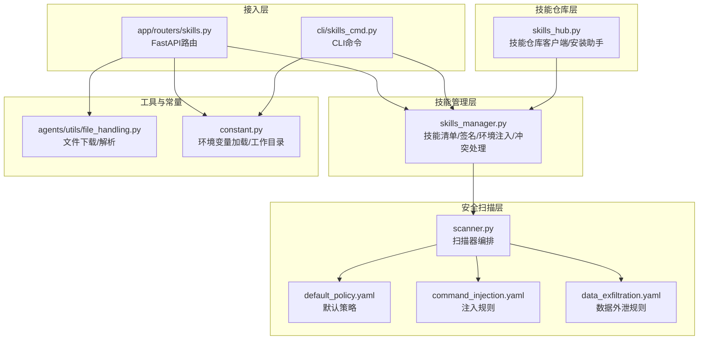
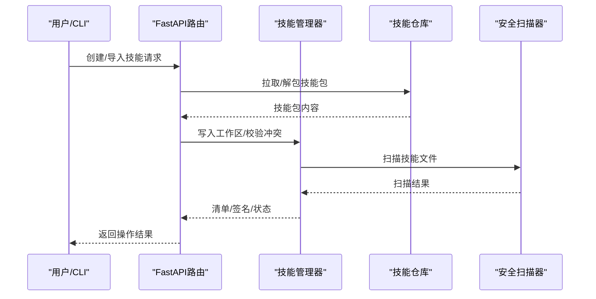
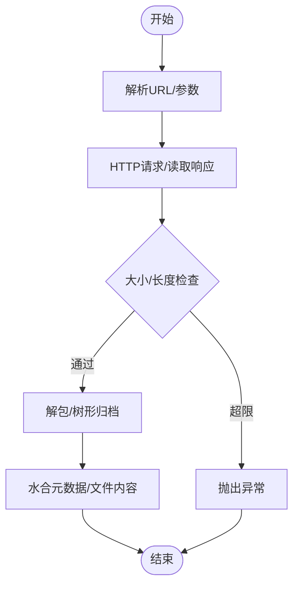
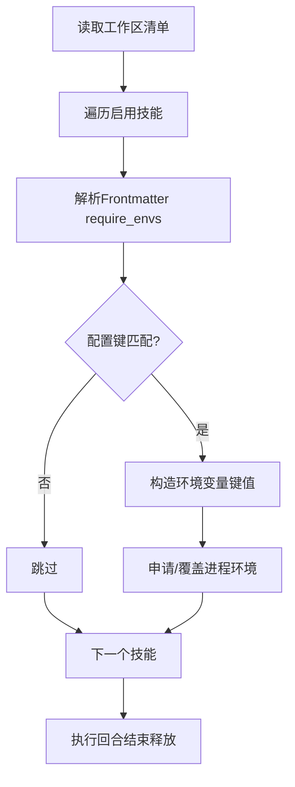
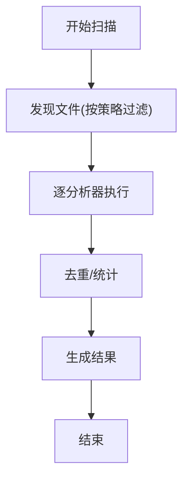
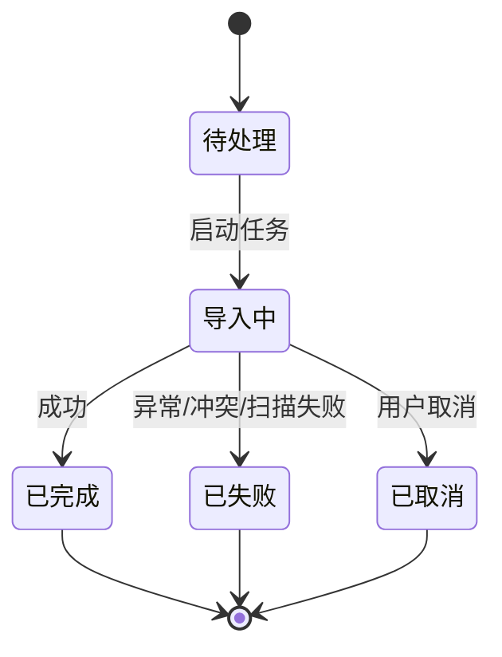
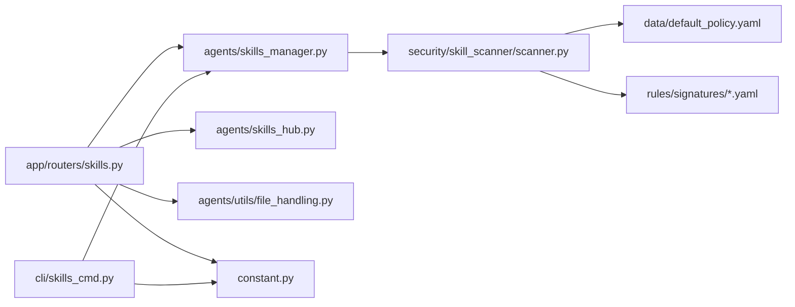

# 接口实现规范

<cite>
**本文引用的文件**
- [skills_hub.py](file://src/qwenpaw/agents/skills_hub.py)
- [skills_manager.py](file://src/qwenpaw/agents/skills_manager.py)
- [skills.py](file://src/qwenpaw/app/routers/skills.py)
- [skills_cmd.py](file://src/qwenpaw/cli/skills_cmd.py)
- [scanner.py](file://src/qwenpaw/security/skill_scanner/scanner.py)
- [default_policy.yaml](file://src/qwenpaw/security/skill_scanner/data/default_policy.yaml)
- [command_injection.yaml](file://src/qwenpaw/security/skill_scanner/rules/signatures/command_injection.yaml)
- [data_exfiltration.yaml](file://src/qwenpaw/security/skill_scanner/rules/signatures/data_exfiltration.yaml)
- [file_handling.py](file://src/qwenpaw/agents/utils/file_handling.py)
- [constant.py](file://src/qwenpaw/constant.py)
- [guidance SKILL.md](file://src/qwenpaw/agents/skills/guidance/SKILL.md)
- [docx SKILL.md](file://src/qwenpaw/agents/skills/docx/SKILL.md)
- [pdf SKILL.md](file://src/qwenpaw/agents/skills/pdf/SKILL.md)
- [xlsx SKILL.md](file://src/qwenpaw/agents/skills/xlsx/SKILL.md)
</cite>

## 目录
1. [引言](#引言)
2. [项目结构](#项目结构)
3. [核心组件](#核心组件)
4. [架构总览](#架构总览)
5. [详细组件分析](#详细组件分析)
6. [依赖分析](#依赖分析)
7. [性能考虑](#性能考虑)
8. [故障排查指南](#故障排查指南)
9. [结论](#结论)
10. [附录](#附录)

## 引言
本规范面向QwenPaw技能接口实现，系统性阐述技能类的继承关系、抽象基类定义、接口方法实现要求；文档化技能注册机制、动态加载流程、生命周期管理；说明技能与代理系统的交互接口、消息传递协议、状态同步机制；提供技能配置注入、环境变量管理、资源管理的最佳实践；解释技能的安全边界、权限控制、沙箱隔离实现；包含性能监控、错误恢复、优雅降级的设计模式；并提供完整的接口实现示例与调试技巧。

## 项目结构
QwenPaw技能系统由“技能仓库”“技能管理器”“安全扫描器”“API路由”“CLI命令”等模块协同组成，形成从技能发现、导入、校验、启用、运行到卸载的完整闭环。

**图表来源**
- [skills_hub.py:1-200](file://src/qwenpaw/agents/skills_hub.py#L1-L200)
- [skills_manager.py:1-200](file://src/qwenpaw/agents/skills_manager.py#L1-L200)
- [scanner.py:1-120](file://src/qwenpaw/security/skill_scanner/scanner.py#L1-L120)
- [default_policy.yaml:1-120](file://src/qwenpaw/security/skill_scanner/data/default_policy.yaml#L1-L120)
- [command_injection.yaml:1-120](file://src/qwenpaw/security/skill_scanner/rules/signatures/command_injection.yaml#L1-L120)
- [data_exfiltration.yaml:1-120](file://src/qwenpaw/security/skill_scanner/rules/signatures/data_exfiltration.yaml#L1-L120)
- [skills.py:1-120](file://src/qwenpaw/app/routers/skills.py#L1-L120)
- [skills_cmd.py:1-120](file://src/qwenpaw/cli/skills_cmd.py#L1-L120)
- [file_handling.py:1-120](file://src/qwenpaw/agents/utils/file_handling.py#L1-L120)
- [constant.py:1-120](file://src/qwenpaw/constant.py#L1-L120)

**章节来源**
- [skills_hub.py:1-200](file://src/qwenpaw/agents/skills_hub.py#L1-L200)
- [skills_manager.py:1-200](file://src/qwenpaw/agents/skills_manager.py#L1-L200)
- [scanner.py:1-120](file://src/qwenpaw/security/skill_scanner/scanner.py#L1-L120)
- [skills.py:1-120](file://src/qwenpaw/app/routers/skills.py#L1-L120)
- [skills_cmd.py:1-120](file://src/qwenpaw/cli/skills_cmd.py#L1-L120)
- [file_handling.py:1-120](file://src/qwenpaw/agents/utils/file_handling.py#L1-L120)
- [constant.py:1-120](file://src/qwenpaw/constant.py#L1-L120)

## 核心组件
- 技能仓库客户端：负责从外部仓库搜索、拉取、解包技能包，支持取消、重试、限流与大小限制。
- 技能管理器：负责技能清单构建、签名计算、冲突建议、环境变量注入、工作区/共享池同步。
- 安全扫描器：按策略扫描技能文件，识别注入、数据外泄等高危模式，输出聚合结果。
- 接入层（API/CLI）：提供REST接口与命令行能力，驱动技能的创建、导入、启用、禁用、删除。
- 工具与常量：统一的环境变量加载、工作目录解析、文件下载与编码兼容处理。

**章节来源**
- [skills_hub.py:1-200](file://src/qwenpaw/agents/skills_hub.py#L1-L200)
- [skills_manager.py:1-200](file://src/qwenpaw/agents/skills_manager.py#L1-L200)
- [scanner.py:1-120](file://src/qwenpaw/security/skill_scanner/scanner.py#L1-L120)
- [skills.py:1-120](file://src/qwenpaw/app/routers/skills.py#L1-L120)
- [skills_cmd.py:1-120](file://src/qwenpaw/cli/skills_cmd.py#L1-L120)
- [file_handling.py:1-120](file://src/qwenpaw/agents/utils/file_handling.py#L1-L120)
- [constant.py:1-120](file://src/qwenpaw/constant.py#L1-L120)

## 架构总览
技能接口实现遵循“声明式清单 + 动态校验 + 可观测性”的设计原则。技能通过Frontmatter声明元数据，管理器据此生成技能信息并进行签名与冲突检测；安全扫描器在导入/保存阶段拦截高危行为；运行期通过环境变量注入与通道路由实现与代理系统的交互。

**图表来源**
- [skills.py:580-760](file://src/qwenpaw/app/routers/skills.py#L580-L760)
- [skills_hub.py:550-700](file://src/qwenpaw/agents/skills_hub.py#L550-L700)
- [skills_manager.py:670-720](file://src/qwenpaw/agents/skills_manager.py#L670-L720)
- [scanner.py:140-240](file://src/qwenpaw/security/skill_scanner/scanner.py#L140-L240)

## 详细组件分析

### 技能仓库客户端（skills_hub.py）
职责与特性
- 外部仓库搜索与详情查询：支持自定义基础URL、搜索路径、版本路径、文件路径。
- 下载与解包：支持ZIP/文件流下载，带大小限制、超时与重试退避。
- 取消与进度：通过上下文变量与事件实现导入任务取消。
- 缓存与速率：对GitHub API响应做TTL缓存，避免频繁请求。
- 错误处理：区分网络错误、超时、配额限制与响应体过大，给出明确提示。

关键流程（安装/导入）

**图表来源**
- [skills_hub.py:290-430](file://src/qwenpaw/agents/skills_hub.py#L290-L430)
- [skills_hub.py:550-700](file://src/qwenpaw/agents/skills_hub.py#L550-L700)

**章节来源**
- [skills_hub.py:1-200](file://src/qwenpaw/agents/skills_hub.py#L1-L200)
- [skills_hub.py:200-450](file://src/qwenpaw/agents/skills_hub.py#L200-L450)
- [skills_hub.py:450-700](file://src/qwenpaw/agents/skills_hub.py#L450-L700)

### 技能管理器（skills_manager.py）
职责与特性
- 清单模型：SkillInfo封装名称、描述、版本、内容、来源、引用与脚本树。
- 签名与冲突：基于文件树哈希的签名计算，冲突时提供时间戳后缀建议。
- 环境注入：将技能配置映射为环境变量，限定作用域，避免竞态。
- 路径与锁：原子写入清单，文件级互斥锁保证并发一致性。
- 要求声明：从Frontmatter解析metadata.requires，支持bin/env需求。
- 工作区/共享池：统一技能目录布局，支持内置技能与定制化并存。

运行期配置注入流程

**图表来源**
- [skills_manager.py:670-720](file://src/qwenpaw/agents/skills_manager.py#L670-L720)
- [skills_manager.py:720-780](file://src/qwenpaw/agents/skills_manager.py#L720-L780)

**章节来源**
- [skills_manager.py:60-120](file://src/qwenpaw/agents/skills_manager.py#L60-L120)
- [skills_manager.py:270-340](file://src/qwenpaw/agents/skills_manager.py#L270-L340)
- [skills_manager.py:570-640](file://src/qwenpaw/agents/skills_manager.py#L570-L640)
- [skills_manager.py:670-720](file://src/qwenpaw/agents/skills_manager.py#L670-L720)

### 安全扫描器（scanner.py）
职责与特性
- 扫描编排：遍历技能目录，按策略过滤扩展名与大小，调用各分析器。
- 分析器注册：默认PatternAnalyzer，支持运行时扩展。
- 结果聚合：去重、统计、耗时记录，输出ScanResult。
- 规则体系：内置注入、数据外泄等规则集，支持组织策略覆盖。

扫描流程

**图表来源**
- [scanner.py:140-240](file://src/qwenpaw/security/skill_scanner/scanner.py#L140-L240)
- [default_policy.yaml:1-120](file://src/qwenpaw/security/skill_scanner/data/default_policy.yaml#L1-L120)

**章节来源**
- [scanner.py:1-120](file://src/qwenpaw/security/skill_scanner/scanner.py#L1-L120)
- [default_policy.yaml:1-120](file://src/qwenpaw/security/skill_scanner/data/default_policy.yaml#L1-L120)
- [command_injection.yaml:1-120](file://src/qwenpaw/security/skill_scanner/rules/signatures/command_injection.yaml#L1-L120)
- [data_exfiltration.yaml:1-120](file://src/qwenpaw/security/skill_scanner/rules/signatures/data_exfiltration.yaml#L1-L120)

### 接入层（API/CLI）
- FastAPI路由：提供技能列表、刷新、搜索、安装、上传、启用/禁用、保存等接口；支持任务状态轮询与取消。
- CLI命令：交互式选择、批量安装、启用/禁用、预览变更、应用变更。

安装任务生命周期

**图表来源**
- [skills.py:580-640](file://src/qwenpaw/app/routers/skills.py#L580-L640)
- [skills.py:640-700](file://src/qwenpaw/app/routers/skills.py#L640-L700)

**章节来源**
- [skills.py:530-700](file://src/qwenpaw/app/routers/skills.py#L530-L700)
- [skills_cmd.py:120-210](file://src/qwenpaw/cli/skills_cmd.py#L120-L210)

### 文件与环境工具
- 文件下载：支持base64、URL、本地路径，自动探测真实扩展名，超时与错误处理。
- 环境变量：统一加载与类型转换，兼容历史前缀，提供工作目录解析。

**章节来源**
- [file_handling.py:240-357](file://src/qwenpaw/agents/utils/file_handling.py#L240-L357)
- [constant.py:28-120](file://src/qwenpaw/constant.py#L28-L120)

## 依赖分析
组件耦合与协作
- API/CLI依赖技能管理器与仓库客户端，后者依赖常量与工具模块。
- 安全扫描器独立于业务流程，但被管理器在导入/保存阶段调用。
- 环境变量与工作目录贯穿导入、运行与扫描全过程。

**图表来源**
- [skills.py:1-120](file://src/qwenpaw/app/routers/skills.py#L1-L120)
- [skills_cmd.py:1-120](file://src/qwenpaw/cli/skills_cmd.py#L1-L120)
- [skills_manager.py:1-120](file://src/qwenpaw/agents/skills_manager.py#L1-L120)
- [skills_hub.py:1-120](file://src/qwenpaw/agents/skills_hub.py#L1-L120)
- [scanner.py:1-120](file://src/qwenpaw/security/skill_scanner/scanner.py#L1-L120)
- [default_policy.yaml:1-120](file://src/qwenpaw/security/skill_scanner/data/default_policy.yaml#L1-L120)
- [command_injection.yaml:1-120](file://src/qwenpaw/security/skill_scanner/rules/signatures/command_injection.yaml#L1-L120)
- [data_exfiltration.yaml:1-120](file://src/qwenpaw/security/skill_scanner/rules/signatures/data_exfiltration.yaml#L1-L120)
- [file_handling.py:1-120](file://src/qwenpaw/agents/utils/file_handling.py#L1-L120)
- [constant.py:1-120](file://src/qwenpaw/constant.py#L1-L120)

**章节来源**
- [skills.py:1-120](file://src/qwenpaw/app/routers/skills.py#L1-L120)
- [skills_cmd.py:1-120](file://src/qwenpaw/cli/skills_cmd.py#L1-L120)
- [skills_manager.py:1-120](file://src/qwenpaw/agents/skills_manager.py#L1-L120)
- [skills_hub.py:1-120](file://src/qwenpaw/agents/skills_hub.py#L1-L120)
- [scanner.py:1-120](file://src/qwenpaw/security/skill_scanner/scanner.py#L1-L120)

## 性能考虑
- 并发与锁：清单写入采用文件级互斥锁，避免竞态；扫描器限制文件数量与大小，防止内存压力。
- 重试与退避：HTTP请求采用指数退避与最大重试次数，降低瞬时错误影响。
- 缓存：对GitHub API响应设置TTL缓存，减少重复请求。
- 运行期注入：环境变量按回合注入与释放，避免长期驻留造成污染。

[本节为通用指导，无需特定文件引用]

## 故障排查指南
常见问题与处理
- 扫描失败（422）：检查扫描器返回的严重级别与具体发现，按规则修复后再导入。
- 冲突重名：使用建议名称或手动改名后重试。
- 导入取消：检查取消事件是否触发，清理临时状态后重试。
- 网络错误/配额限制：设置认证令牌或调整重试参数，等待配额恢复。
- ZIP过大/路径不安全：压缩包需小于阈值，禁止符号链接与越界路径。

**章节来源**
- [skills.py:680-740](file://src/qwenpaw/app/routers/skills.py#L680-L740)
- [skills_manager.py:770-800](file://src/qwenpaw/agents/skills_manager.py#L770-L800)
- [skills_hub.py:300-400](file://src/qwenpaw/agents/skills_hub.py#L300-L400)

## 结论
QwenPaw技能接口实现以“清单驱动 + 安全前置 + 可观测性”为核心，通过仓库客户端、管理器、扫描器与接入层的协同，实现了从技能发现、导入、校验、启用到运行期的全生命周期管理。配合严格的环境变量注入与安全规则，确保技能在代理系统中的安全、可控与可观测。

[本节为总结性内容，无需特定文件引用]

## 附录

### 技能清单与Frontmatter约定
- 必填字段：name、description（可从SKILL.md Frontmatter提取）。
- 版本与元数据：metadata包含版本与平台相关声明。
- 引用与脚本：references/scripts树形结构，支持相对路径与内容注入。

参考示例
- [guidance SKILL.md:1-40](file://src/qwenpaw/agents/skills/guidance/SKILL.md#L1-L40)
- [docx SKILL.md:1-40](file://src/qwenpaw/agents/skills/docx/SKILL.md#L1-L40)
- [pdf SKILL.md:1-40](file://src/qwenpaw/agents/skills/pdf/SKILL.md#L1-L40)
- [xlsx SKILL.md:1-40](file://src/qwenpaw/agents/skills/xlsx/SKILL.md#L1-L40)

**章节来源**
- [guidance SKILL.md:1-40](file://src/qwenpaw/agents/skills/guidance/SKILL.md#L1-L40)
- [docx SKILL.md:1-40](file://src/qwenpaw/agents/skills/docx/SKILL.md#L1-L40)
- [pdf SKILL.md:1-40](file://src/qwenpaw/agents/skills/pdf/SKILL.md#L1-L40)
- [xlsx SKILL.md:1-40](file://src/qwenpaw/agents/skills/xlsx/SKILL.md#L1-L40)

### 接口实现要点清单
- 抽象基类与接口：以SkillInfo为统一数据载体，Frontmatter解析与签名计算为核心契约。
- 注册与动态加载：通过工作区/共享池目录与清单文件实现动态发现与加载。
- 生命周期：导入/启用/禁用/删除/回滚，支持原子写入与快照备份。
- 交互协议：API/CLI双入口，任务状态轮询与取消，错误码与扫描结果标准化。
- 安全边界：扫描器前置拦截、规则集可配置、最小权限注入、路径与ZIP安全校验。
- 性能与可靠性：互斥锁、重试退避、缓存、文件大小与数量限制、运行期环境变量回收。

[本节为概要性内容，无需特定文件引用]