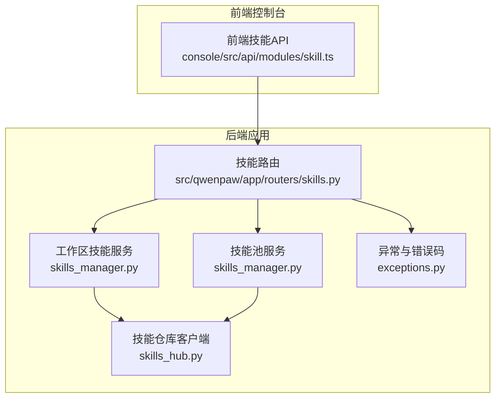
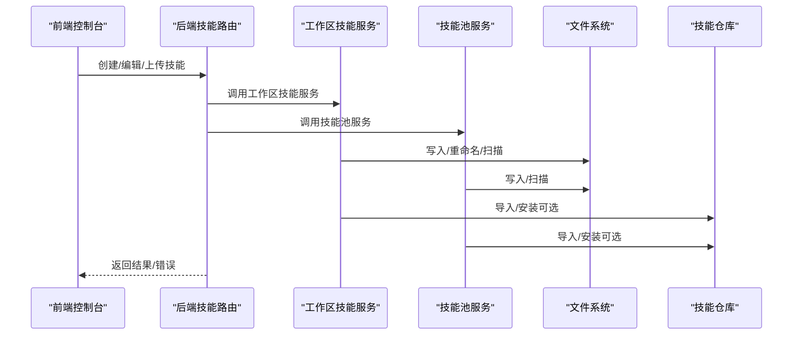
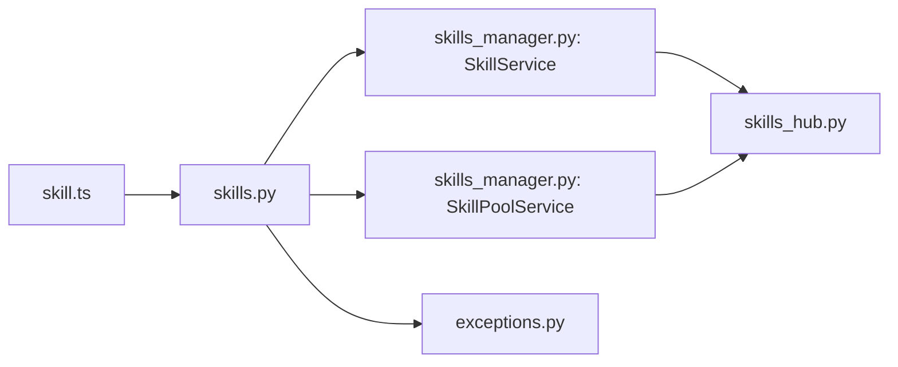

# 编程接口规范

<cite>
**本文引用的文件**
- [skills.py](file://src/qwenpaw/app/routers/skills.py)
- [skills_manager.py](file://src/qwenpaw/agents/skills_manager.py)
- [skills_hub.py](file://src/qwenpaw/agents/skills_hub.py)
- [exceptions.py](file://src/qwenpaw/exceptions.py)
- [skill.ts](file://console/src/api/modules/skill.ts)
- [skills.en.md](file://website/public/docs/skills.en.md)
- [SKILL.md（browser_cdp）](file://src/qwenpaw/agents/skills/browser_cdp/SKILL.md)
- [SKILL.md（file_reader）](file://src/qwenpaw/agents/skills/file_reader/SKILL.md)
- [SKILL.md（docx）](file://src/qwenpaw/agents/skills/docx/SKILL.md)
- [SKILL.md（news）](file://src/qwenpaw/agents/skills/news/SKILL.md)
</cite>

## 目录
1. [简介](#简介)
2. [项目结构](#项目结构)
3. [核心组件](#核心组件)
4. [架构总览](#架构总览)
5. [详细组件分析](#详细组件分析)
6. [依赖分析](#依赖分析)
7. [性能考虑](#性能考虑)
8. [故障排查指南](#故障排查指南)
9. [结论](#结论)
10. [附录](#附录)

## 简介
本规范面向为 QwenPaw 开发“技能”的工程师，系统性地定义技能编程接口、前端元数据与配置结构、版本与签名管理、安全扫描与冲突处理、以及技能与代理系统的交互协议与状态管理。文档同时覆盖 API 接口、参数校验、异常与错误码、生命周期钩子与最佳实践，帮助开发者在保证安全性与一致性的前提下高效扩展技能生态。

## 项目结构
围绕技能编程接口的关键模块与文件如下：
- 后端路由与服务
  - 技能工作区与技能池 API：[skills.py](file://src/qwenpaw/app/routers/skills.py)
  - 技能服务与清单管理：[skills_manager.py](file://src/qwenpaw/agents/skills_manager.py)
  - 技能仓库与导入流程：[skills_hub.py](file://src/qwenpaw/agents/skills_hub.py)
  - 异常与错误码：[exceptions.py](file://src/qwenpaw/exceptions.py)
- 前端 API 客户端
  - 技能相关请求封装：[skill.ts](file://console/src/api/modules/skill.ts)
- 文档与示例
  - 技能元数据与配置说明：[skills.en.md](file://website/public/docs/skills.en.md)
  - 示例技能元数据：[SKILL.md（browser_cdp）](file://src/qwenpaw/agents/skills/browser_cdp/SKILL.md)、[SKILL.md（file_reader）](file://src/qwenpaw/agents/skills/file_reader/SKILL.md)、[SKILL.md（docx）](file://src/qwenpaw/agents/skills/docx/SKILL.md)、[SKILL.md（news）](file://src/qwenpaw/agents/skills/news/SKILL.md)

图表来源
- [skills.py:62-120](file://src/qwenpaw/app/routers/skills.py#L62-L120)
- [skills_manager.py:65-120](file://src/qwenpaw/agents/skills_manager.py#L65-L120)
- [skills_hub.py:1-60](file://src/qwenpaw/agents/skills_hub.py#L1-L60)
- [exceptions.py:93-102](file://src/qwenpaw/exceptions.py#L93-L102)
- [skill.ts:1-60](file://console/src/api/modules/skill.ts#L1-L60)

章节来源
- [skills.py:62-120](file://src/qwenpaw/app/routers/skills.py#L62-L120)
- [skills_manager.py:65-120](file://src/qwenpaw/agents/skills_manager.py#L65-L120)
- [skills_hub.py:1-60](file://src/qwenpaw/agents/skills_hub.py#L1-L60)
- [exceptions.py:93-102](file://src/qwenpaw/exceptions.py#L93-L102)
- [skill.ts:1-60](file://console/src/api/modules/skill.ts#L1-L60)

## 核心组件
- 技能元数据与版本
  - 元数据来源于 SKILL.md 的 YAML frontmatter，支持 name、description、metadata.requires.env、metadata.builtin_skill_version 等字段。
  - 版本文本 version_text 来源于 frontmatter 的 version/metadata.version/metadata.builtin_skill_version。
  - 内容签名 signature 基于技能目录树与文件内容计算，用于冲突检测与同步一致性。
- 技能清单与来源
  - 源头 source 支持 "builtin"、"customized"、"system" 等，用于区分内置、工作区定制与系统来源。
  - 要求 requirements.require_bins 与 requirements.require_envs 由 frontmatter 的 metadata.qwenpaw.requires 或 metadata.requires 解析而来。
- 配置注入与环境变量
  - 配置 config 中与 metadata.requires.env 匹配的键会被注入为环境变量；未匹配的键仅通过 QWENPAW_SKILL_CONFIG_<NAME> 的 JSON 字符串形式提供。
- 生命周期与状态
  - 工作区技能启用/禁用、通道过滤 channels、标签 tags、配置 config、更新时间 updated_at。
  - 技能池支持保护标记 protected、同步状态 sync_status、最新版本 latest_version_text。

章节来源
- [skills_manager.py:720-750](file://src/qwenpaw/agents/skills_manager.py#L720-L750)
- [skills_manager.py:543-572](file://src/qwenpaw/agents/skills_manager.py#L543-L572)
- [skills_manager.py:274-292](file://src/qwenpaw/agents/skills_manager.py#L274-L292)
- [skills_manager.py:674-718](file://src/qwenpaw/agents/skills_manager.py#L674-L718)
- [skills.en.md:308-366](file://website/public/docs/skills.en.md#L308-L366)

## 架构总览
技能编程接口贯穿“前端控制台 → 后端路由 → 技能服务 → 文件系统/仓库”的链路，并在关键节点进行安全扫描与冲突处理。

图表来源
- [skills.py:662-744](file://src/qwenpaw/app/routers/skills.py#L662-L744)
- [skills_manager.py:1735-1825](file://src/qwenpaw/agents/skills_manager.py#L1735-L1825)
- [skills_manager.py:2048-2094](file://src/qwenpaw/agents/skills_manager.py#L2048-L2094)
- [skills_hub.py:556-703](file://src/qwenpaw/agents/skills_hub.py#L556-L703)

## 详细组件分析

### 1) 技能元数据与 frontmatter 规范
- 必填字段
  - name：技能稳定标识，用于 API、同步与路由。
  - description：技能描述。
- 可选字段
  - metadata.requires.env：声明需要注入为环境变量的配置键集合。
  - metadata.builtin_skill_version：内置技能版本号。
  - metadata.qwenpaw.emoji：展示表情符号。
- 版本解析优先级
  - frontmatter.version → metadata.version → metadata.builtin_skill_version。
- 示例参考
  - [SKILL.md（browser_cdp）:1-28](file://src/qwenpaw/agents/skills/browser_cdp/SKILL.md#L1-L28)
  - [SKILL.md（file_reader）:1-9](file://src/qwenpaw/agents/skills/file_reader/SKILL.md#L1-L9)
  - [SKILL.md（docx）:1-11](file://src/qwenpaw/agents/skills/docx/SKILL.md#L1-L11)
  - [SKILL.md（news）:1-9](file://src/qwenpaw/agents/skills/news/SKILL.md#L1-L9)

章节来源
- [skills_manager.py:249-259](file://src/qwenpaw/agents/skills_manager.py#L249-L259)
- [skills_manager.py:543-572](file://src/qwenpaw/agents/skills_manager.py#L543-L572)
- [SKILL.md（browser_cdp）:1-28](file://src/qwenpaw/agents/skills/browser_cdp/SKILL.md#L1-L28)
- [SKILL.md（file_reader）:1-9](file://src/qwenpaw/agents/skills/file_reader/SKILL.md#L1-L9)
- [SKILL.md（docx）:1-11](file://src/qwenpaw/agents/skills/docx/SKILL.md#L1-L11)
- [SKILL.md（news）:1-9](file://src/qwenpaw/agents/skills/news/SKILL.md#L1-L9)

### 2) 技能配置与环境变量注入
- 注入规则
  - 仅将 config 中与 metadata.requires.env 匹配的键注入为环境变量。
  - 未匹配的键仅通过 QWENPAW_SKILL_CONFIG_<NAME> 的 JSON 字符串提供。
  - 缺失 required 键会记录警告日志。
- 环境变量生命周期
  - 在一次代理回合内临时注入，结束后释放，避免全局污染。
- 示例参考
  - [skills.en.md:308-366](file://website/public/docs/skills.en.md#L308-L366)

章节来源
- [skills_manager.py:590-632](file://src/qwenpaw/agents/skills_manager.py#L590-L632)
- [skills_manager.py:674-718](file://src/qwenpaw/agents/skills_manager.py#L674-L718)

### 3) 技能清单与来源分类
- 来源分类
  - builtin：来自打包内置技能，受版本与签名管控。
  - customized：工作区/技能池中的自定义技能。
  - system：系统来源。
- 签名与版本
  - signature 基于技能目录树与文件内容计算，用于冲突检测与同步一致性。
  - version_text 从 frontmatter 解析，支持内置版本管理。
- 更新时间
  - updated_at 基于技能目录与 SKILL.md 的最后修改时间。

章节来源
- [skills_manager.py:418-447](file://src/qwenpaw/agents/skills_manager.py#L418-L447)
- [skills_manager.py:274-292](file://src/qwenpaw/agents/skills_manager.py#L274-L292)
- [skills_manager.py:172-189](file://src/qwenpaw/agents/skills_manager.py#L172-L189)

### 4) 技能服务与生命周期
- 工作区技能服务（SkillService）
  - 创建/编辑/重命名/导入 ZIP/启用/禁用/删除/设置通道/设置标签/读取文件。
  - 所有写操作均进行安全扫描，冲突检测与回滚支持。
- 技能池服务（SkillPoolService）
  - 创建/导入 ZIP/删除/设置标签/获取编辑目标名称/保存技能（含重命名）。
  - 支持内置技能槽位保护与同名冲突建议。
- 关键流程
  - 写入前 staged 目录预检与扫描，失败则回滚。
  - 清理与原子写入清单文件，确保并发安全。

章节来源
- [skills_manager.py:1600-1734](file://src/qwenpaw/agents/skills_manager.py#L1600-L1734)
- [skills_manager.py:1735-1825](file://src/qwenpaw/agents/skills_manager.py#L1735-L1825)
- [skills_manager.py:1826-1911](file://src/qwenpaw/agents/skills_manager.py#L1826-L1911)
- [skills_manager.py:1912-1960](file://src/qwenpaw/agents/skills_manager.py#L1912-L1960)
- [skills_manager.py:1961-2008](file://src/qwenpaw/agents/skills_manager.py#L1961-L2008)
- [skills_manager.py:2010-2094](file://src/qwenpaw/agents/skills_manager.py#L2010-L2094)
- [skills_manager.py:2095-2205](file://src/qwenpaw/agents/skills_manager.py#L2095-L2205)
- [skills_manager.py:2227-2248](file://src/qwenpaw/agents/skills_manager.py#L2227-L2248)
- [skills_manager.py:2249-2399](file://src/qwenpaw/agents/skills_manager.py#L2249-L2399)

### 5) 技能仓库与导入流程
- 支持从技能仓库搜索、安装、取消任务。
- 支持 ZIP 导入与批量导入，自动去重与冲突建议。
- 支持 GitHub/GitLab 等源的认证与速率限制处理。
- 取消导入时清理临时产物。

章节来源
- [skills_hub.py:556-703](file://src/qwenpaw/agents/skills_hub.py#L556-L703)
- [skills_hub.py:291-404](file://src/qwenpaw/agents/skills_hub.py#L291-L404)
- [skills_hub.py:168-189](file://src/qwenpaw/agents/skills_hub.py#L168-L189)

### 6) 前端 API 与控制台集成
- 前端提供技能列表、创建、上传、启用/禁用、批量操作、配置读写、标签与通道设置等方法。
- 缓存与失效策略：基于路径与 TTL 的简单内存缓存，支持按 agentId、workspaces、pool 粒度失效。
- 错误处理：冲突建议、扫描失败、权限/配额/超时等统一转换。

章节来源
- [skill.ts:16-61](file://console/src/api/modules/skill.ts#L16-L61)
- [skill.ts:68-282](file://console/src/api/modules/skill.ts#L68-L282)

### 7) API 定义与参数校验
- 路由与端点
  - 工作区技能：GET/POST/PUT/DELETE /skills、/skills/{skill_name}/channels、/skills/{skill_name}/tags、/skills/{skill_name}/config 等。
  - 技能池：GET/POST/PUT/DELETE /skills/pool、/skills/pool/{skill_name}/tags、/skills/pool/save 等。
  - 仓库：GET /skills/hub/search、POST /skills/hub/install/start、GET /skills/hub/install/status/{task_id}、POST /skills/hub/install/cancel/{task_id}。
- 参数校验
  - 标签数量上限与长度限制。
  - ZIP 类型与大小限制。
  - 冲突检测与建议重命名。
- 返回值
  - 成功：标准字段如 created/name/updated 等。
  - 失败：HTTP 状态码与错误详情，扫描失败返回标准化 payload。

章节来源
- [skills.py:1107-1133](file://src/qwenpaw/app/routers/skills.py#L1107-L1133)
- [skills.py:352-372](file://src/qwenpaw/app/routers/skills.py#L352-L372)
- [skills.py:533-545](file://src/qwenpaw/app/routers/skills.py#L533-L545)
- [skills.py:662-744](file://src/qwenpaw/app/routers/skills.py#L662-L744)
- [skills.py:746-798](file://src/qwenpaw/app/routers/skills.py#L746-L798)
- [skills.py:1322-1398](file://src/qwenpaw/app/routers/skills.py#L1322-L1398)

### 8) 异常处理与错误码
- 业务异常
  - SkillsError：技能管理相关错误。
  - ProviderError、ModelFormatterError、SystemCommandException、ChannelError、AgentStateError 等。
- 模型异常转换
  - 将模型相关异常映射为统一的运行时异常，保留原始错误类型与消息。
- 错误响应
  - 扫描失败：返回 type、skill_name、max_severity、findings 等字段。
  - 参数错误：400。
  - 冲突：409。
  - 未找到：404。

章节来源
- [exceptions.py:93-102](file://src/qwenpaw/exceptions.py#L93-L102)
- [exceptions.py:165-254](file://src/qwenpaw/exceptions.py#L165-L254)
- [skills.py:68-109](file://src/qwenpaw/app/routers/skills.py#L68-L109)

### 9) 生命周期钩子与状态管理
- 生命周期
  - 创建/导入：写入 SKILL.md 与相关资源，扫描通过后落盘。
  - 编辑/重命名：staged 预检，失败回滚；成功后更新清单与签名。
  - 启用/禁用：仅更新清单状态，再次启用时会重新扫描。
  - 删除：仅允许删除未启用且不存在的技能。
- 状态字段
  - enabled、channels、tags、config、updated_at、source、requirements、signature、version_text 等。
- 并发与一致性
  - 清单文件采用原子写入与锁文件，避免竞态。

章节来源
- [skills_manager.py:1600-1734](file://src/qwenpaw/agents/skills_manager.py#L1600-L1734)
- [skills_manager.py:1826-1911](file://src/qwenpaw/agents/skills_manager.py#L1826-L1911)
- [skills_manager.py:1961-2008](file://src/qwenpaw/agents/skills_manager.py#L1961-L2008)

### 10) 与代理系统的交互与消息协议
- 代理回合内注入配置环境变量，确保技能在调用时可见所需参数。
- 通道过滤 channels 控制技能在特定渠道可见与触发。
- 代理上下文通过工作区目录与清单驱动技能加载与路由。

章节来源
- [skills_manager.py:674-718](file://src/qwenpaw/agents/skills_manager.py#L674-L718)
- [skills_manager.py:1912-1935](file://src/qwenpaw/agents/skills_manager.py#L1912-L1935)

## 依赖分析
- 组件耦合
  - 路由层依赖技能服务与仓库客户端，服务层依赖文件系统与扫描器。
  - 前端 API 仅依赖后端路由，不直接访问文件系统。
- 外部依赖
  - ZIP 解压、HTTP 请求、文件锁、扫描器。
- 循环依赖
  - 未发现循环依赖。

图表来源
- [skills.py:32-57](file://src/qwenpaw/app/routers/skills.py#L32-L57)
- [skills_manager.py:2010-2030](file://src/qwenpaw/agents/skills_manager.py#L2010-L2030)
- [skills_hub.py:1-35](file://src/qwenpaw/agents/skills_hub.py#L1-L35)
- [exceptions.py:1-20](file://src/qwenpaw/exceptions.py#L1-L20)
- [skill.ts:1-15](file://console/src/api/modules/skill.ts#L1-L15)

章节来源
- [skills.py:32-57](file://src/qwenpaw/app/routers/skills.py#L32-L57)
- [skills_manager.py:2010-2030](file://src/qwenpaw/agents/skills_manager.py#L2010-L2030)
- [skills_hub.py:1-35](file://src/qwenpaw/agents/skills_hub.py#L1-L35)
- [exceptions.py:1-20](file://src/qwenpaw/exceptions.py#L1-L20)
- [skill.ts:1-15](file://console/src/api/modules/skill.ts#L1-L15)

## 性能考虑
- 扫描与校验
  - ZIP 解压与扫描限制（最大条目数、解压体积、路径合法性）。
  - 清单文件原子写入与锁文件，避免频繁 IO 争用。
- 环境变量注入
  - 仅在代理回合内注入，减少全局污染与重复初始化。
- 缓存
  - 前端短 TTL 缓存，按需失效，平衡一致性与性能。

章节来源
- [skills_hub.py:89-91](file://src/qwenpaw/agents/skills_hub.py#L89-L91)
- [skills_manager.py:353-376](file://src/qwenpaw/agents/skills_manager.py#L353-L376)
- [skill.ts:16-32](file://console/src/api/modules/skill.ts#L16-L32)

## 故障排查指南
- 扫描失败
  - 检查返回的 findings 列表，定位高危规则与文件路径。
  - 参考：[scan_error_payload:68-96](file://src/qwenpaw/app/routers/skills.py#L68-L96)
- 冲突与重命名
  - 依据返回的 suggested_name 进行重命名；批量导入时检查 conflicts 数组。
  - 参考：[suggest_conflict_name:755-776](file://src/qwenpaw/agents/skills_manager.py#L755-L776)、[import_from_zip:1735-1825](file://src/qwenpaw/agents/skills_manager.py#L1735-L1825)
- 权限/配额/超时
  - 使用统一异常转换，查看 details 中原始错误类型与消息。
  - 参考：[convert_model_exception:165-254](file://src/qwenpaw/exceptions.py#L165-L254)
- 未找到/404
  - 检查技能名称与工作区/技能池路径是否存在。
  - 参考：[update_skill_config_endpoint:1375-1398](file://src/qwenpaw/app/routers/skills.py#L1375-L1398)

章节来源
- [skills.py:68-109](file://src/qwenpaw/app/routers/skills.py#L68-L109)
- [skills_manager.py:755-776](file://src/qwenpaw/agents/skills_manager.py#L755-L776)
- [skills_manager.py:1735-1825](file://src/qwenpaw/agents/skills_manager.py#L1735-L1825)
- [exceptions.py:165-254](file://src/qwenpaw/exceptions.py#L165-L254)
- [skills.py:1375-1398](file://src/qwenpaw/app/routers/skills.py#L1375-L1398)

## 结论
本规范明确了 QwenPaw 技能编程接口的定义、元数据与配置结构、版本与签名管理、安全扫描与冲突处理、以及与代理系统的交互协议。遵循本文档可确保技能在功能正确性、安全性与一致性方面达到预期，同时提升开发效率与维护性。

## 附录

### A. 技能元数据字段定义
- name：技能稳定标识（字符串，必填）
- description：技能描述（字符串，必填）
- metadata.requires.env：需要注入为环境变量的配置键集合（数组，可选）
- metadata.builtin_skill_version：内置技能版本号（字符串，可选）
- metadata.qwenpaw.emoji：展示表情符号（字符串，可选）

章节来源
- [skills_manager.py:543-572](file://src/qwenpaw/agents/skills_manager.py#L543-L572)
- [SKILL.md（browser_cdp）:4-8](file://src/qwenpaw/agents/skills/browser_cdp/SKILL.md#L4-L8)
- [SKILL.md（file_reader）:4-8](file://src/qwenpaw/agents/skills/file_reader/SKILL.md#L4-L8)
- [SKILL.md（docx）:5-6](file://src/qwenpaw/agents/skills/docx/SKILL.md#L5-L6)
- [SKILL.md（news）:4-8](file://src/qwenpaw/agents/skills/news/SKILL.md#L4-L8)

### B. 配置注入与环境变量
- 注入规则
  - 仅注入与 metadata.requires.env 匹配的键。
  - 未匹配键通过 QWENPAW_SKILL_CONFIG_<NAME> 提供。
- 生命周期
  - 代理回合内注入，结束后释放。

章节来源
- [skills_manager.py:590-632](file://src/qwenpaw/agents/skills_manager.py#L590-L632)
- [skills_manager.py:674-718](file://src/qwenpaw/agents/skills_manager.py#L674-L718)
- [skills.en.md:308-366](file://website/public/docs/skills.en.md#L308-L366)

### C. API 端点与返回值
- 工作区技能
  - GET /skills：返回技能列表（含 enabled、channels、tags、config、updated_at）。
  - POST /skills：创建技能，返回 created/name。
  - PUT /skills/pool/save：保存/重命名技能池技能，返回 mode/name。
  - DELETE /skills/{skill_name}：删除技能，返回 deleted。
  - PUT /skills/{skill_name}/channels：设置通道，返回 updated/channels。
  - PUT /skills/{skill_name}/tags：设置标签，返回 updated/tags。
  - GET /skills/{skill_name}/config：返回 config。
  - PUT /skills/{skill_name}/config：更新配置，返回 updated。
  - DELETE /skills/{skill_name}/config：清除配置，返回 cleared。
- 技能池
  - GET /skills/pool：返回技能池列表（含 protected、sync_status、latest_version_text、config）。
  - POST /skills/pool/create：创建池技能，返回 created/name。
  - POST /skills/pool/upload-zip：上传 ZIP，返回 imported/count/conflicts。
  - PUT /skills/pool/{skill_name}/tags：设置标签，返回 updated/tags。
- 仓库
  - GET /skills/hub/search：搜索技能，返回列表。
  - POST /skills/hub/install/start：开始安装，返回任务对象。
  - GET /skills/hub/install/status/{task_id}：查询状态。
  - POST /skills/hub/install/cancel/{task_id}：取消安装。

章节来源
- [skills.py:533-545](file://src/qwenpaw/app/routers/skills.py#L533-L545)
- [skills.py:662-696](file://src/qwenpaw/app/routers/skills.py#L662-L696)
- [skills.py:746-798](file://src/qwenpaw/app/routers/skills.py#L746-L798)
- [skills.py:1322-1398](file://src/qwenpaw/app/routers/skills.py#L1322-L1398)
- [skills.py:547-563](file://src/qwenpaw/app/routers/skills.py#L547-L563)
- [skills.py:582-641](file://src/qwenpaw/app/routers/skills.py#L582-L641)

### D. 最佳实践与代码风格
- 元数据
  - 明确填写 name、description、metadata.requires.env、metadata.builtin_skill_version。
- 配置
  - 仅在 metadata.requires.env 中声明需要注入的键，避免污染全局环境。
- 安全
  - 严格遵守扫描规则，避免高危模式与敏感路径。
- 性能
  - 避免大体积 ZIP，合理使用缓存与批量操作。
- 可维护性
  - 使用稳定的 name 作为标识，避免频繁重命名。
  - 通过 tags 与 channels 精准控制可见性与分发。

章节来源
- [skills.en.md:308-366](file://website/public/docs/skills.en.md#L308-L366)
- [skills_manager.py:453-475](file://src/qwenpaw/agents/skills_manager.py#L453-L475)
- [skill.ts:16-32](file://console/src/api/modules/skill.ts#L16-L32)