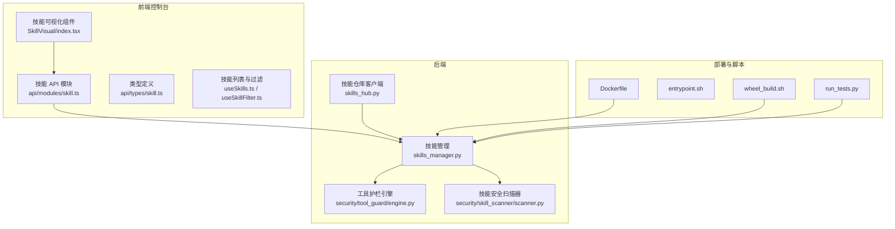
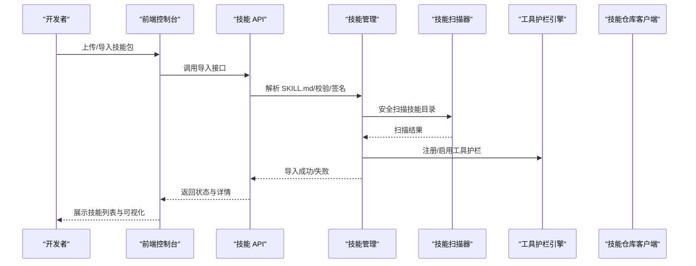
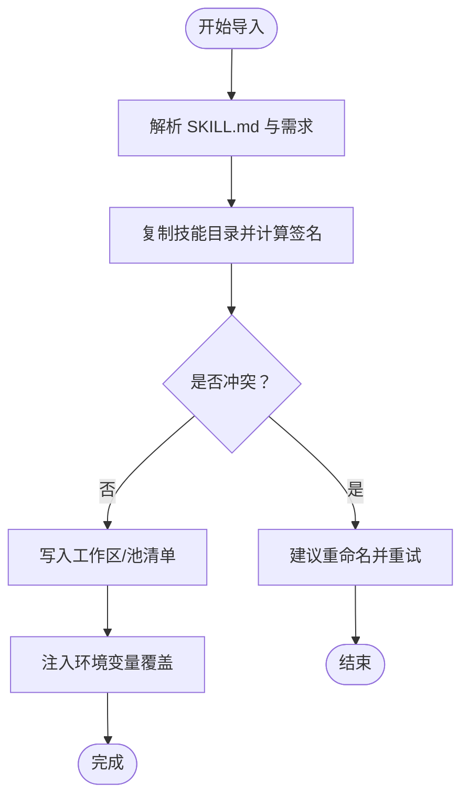
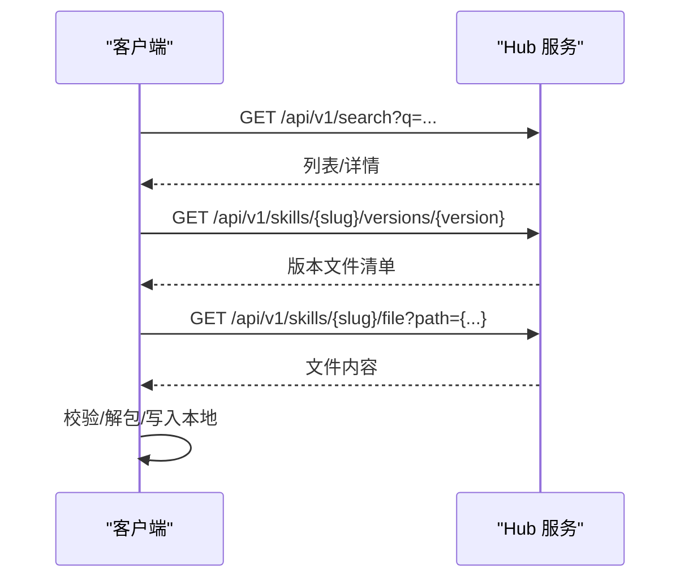
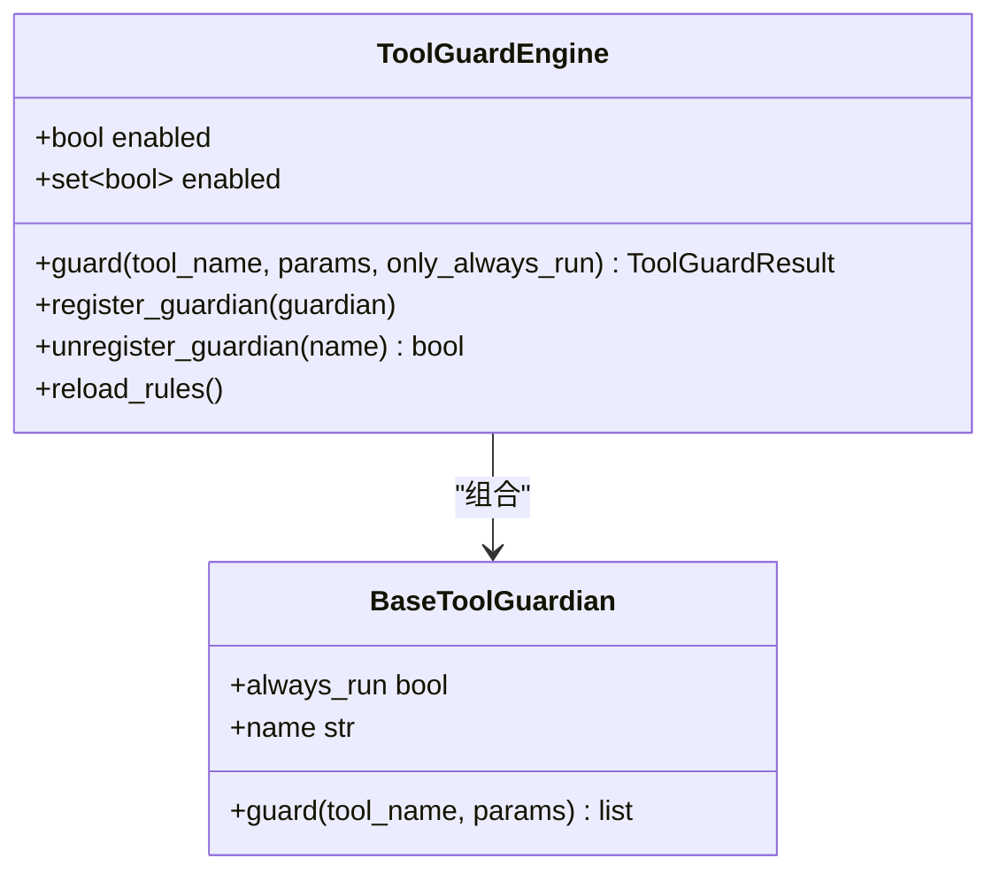
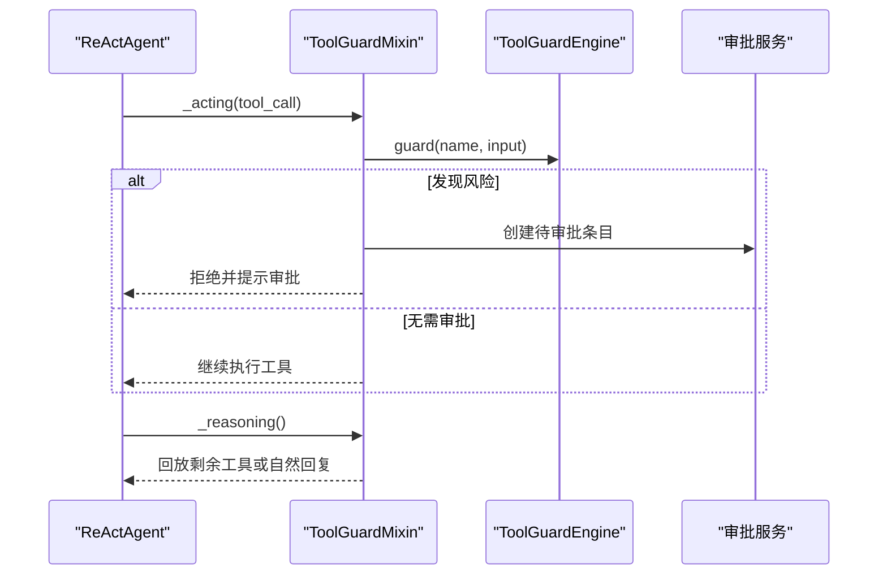
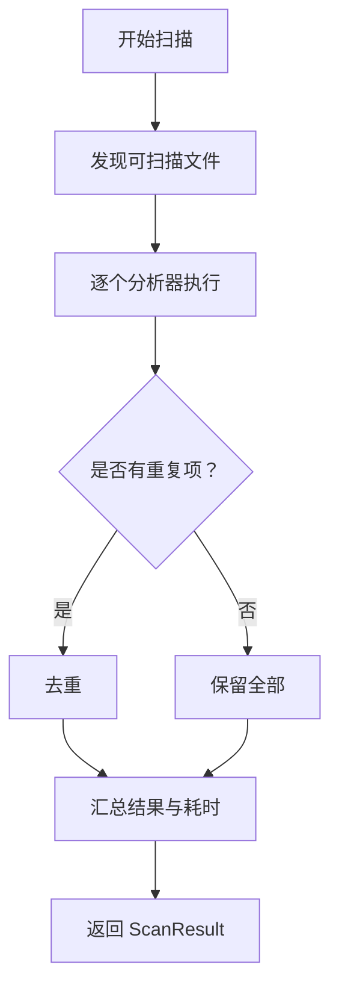
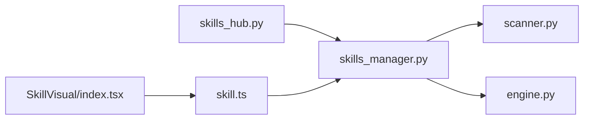

# 自定义技能开发

<cite>
**本文引用的文件**
- [skills_hub.py](file://src/qwenpaw/agents/skills_hub.py)
- [skills_manager.py](file://src/qwenpaw/agents/skills_manager.py)
- [tool_guard_mixin.py](file://src/qwenpaw/agents/tool_guard_mixin.py)
- [engine.py](file://src/qwenpaw/security/tool_guard/engine.py)
- [scanner.py](file://src/qwenpaw/security/skill_scanner/scanner.py)
- [SKILL.md（示例技能目录）](file://src/qwenpaw/agents/skills/QA_source_index/SKILL.md)
- [SKILL.md（浏览器可见技能）](file://src/qwenpaw/agents/skills/browser_visible/SKILL.md)
- [SKILL.md（DOCX 技能）](file://src/qwenpaw/agents/skills/docx/SKILL.md)
- [SKILL.md（文件读取技能）](file://src/qwenpaw/agents/skills/file_reader/SKILL.md)
- [SKILL.md（Guidance 技能）](file://src/qwenpaw/agents/skills/guidance/SKILL.md)
- [package.json（前端控制台）](file://console/package.json)
- [index.tsx（技能可视化组件）](file://console/src/components/SkillVisual/index.tsx)
- [useSkills.ts（技能列表与过滤）](file://console/src/pages/Agent/Skills/useSkills.ts)
- [useSkillFilter.ts（技能过滤器）](file://console/src/pages/Agent/Skills/useSkillFilter.ts)
- [skill.ts（API 模块：技能）](file://console/src/api/modules/skill.ts)
- [skill.ts（类型定义）](file://console/src/api/types/skill.ts)
- [README.md（项目根）](file://README.md)
- [SECURITY.md（安全策略）](file://SECURITY.md)
- [CONTRIBUTING.md（贡献指南）](file://CONTRIBUTING.md)
- [pyproject.toml（后端构建）](file://pyproject.toml)
- [setup.py（后端安装）](file://setup.py)
- [Dockerfile（部署）](file://deploy/Dockerfile)
- [entrypoint.sh（部署入口）](file://deploy/entrypoint.sh)
- [install.sh（安装脚本）](file://scripts/install.sh)
- [wheel_build.sh（轮子构建）](file://scripts/wheel_build.sh)
- [run_tests.py（测试运行）](file://scripts/run_tests.py)
</cite>

## 目录
1. [简介](#简介)
2. [项目结构](#项目结构)
3. [核心组件](#核心组件)
4. [架构总览](#架构总览)
5. [详细组件分析](#详细组件分析)
6. [依赖分析](#依赖分析)
7. [性能考虑](#性能考虑)
8. [故障排除指南](#故障排除指南)
9. [结论](#结论)
10. [附录](#附录)

## 简介
本指南面向希望基于 QwenPaw 开发自定义技能的开发者，系统讲解技能开发接口、编程规范、最佳实践、元数据配置、参数与返回值约定、开发与调试环境、测试方法、打包发布与版本管理、安全与权限控制、性能优化、错误处理与日志记录，并提供技能模板与示例路径、常见问题与排错建议。

## 项目结构
QwenPaw 的技能体系由“后端技能管理与安全扫描”“前端技能可视化与管理”“部署与打包脚本”三部分组成。后端负责技能导入、解析、签名、冲突检测、安全扫描；前端提供技能列表、过滤、可视化展示；部署脚本支持容器化与分发。

图示来源
- [skills_manager.py](file://src/qwenpaw/agents/skills_manager.py)
- [skills_hub.py](file://src/qwenpaw/agents/skills_hub.py)
- [engine.py](file://src/qwenpaw/security/tool_guard/engine.py)
- [scanner.py](file://src/qwenpaw/security/skill_scanner/scanner.py)
- [index.tsx（技能可视化组件）](file://console/src/components/SkillVisual/index.tsx)
- [skill.ts（API 模块：技能）](file://console/src/api/modules/skill.ts)
- [useSkills.ts（技能列表与过滤）](file://console/src/pages/Agent/Skills/useSkills.ts)
- [useSkillFilter.ts（技能过滤器）](file://console/src/pages/Agent/Skills/useSkillFilter.ts)
- [Dockerfile（部署）](file://deploy/Dockerfile)
- [entrypoint.sh（部署入口）](file://deploy/entrypoint.sh)
- [wheel_build.sh（轮子构建）](file://scripts/wheel_build.sh)
- [run_tests.py（测试运行）](file://scripts/run_tests.py)

章节来源
- [README.md（项目根）](file://README.md)
- [SECURITY.md（安全策略）](file://SECURITY.md)
- [CONTRIBUTING.md（贡献指南）](file://CONTRIBUTING.md)

## 核心组件
- 技能管理与工作区同步：负责技能目录复制、签名计算、冲突检测、清单写入、环境变量注入、需求声明与校验等。
- 技能仓库客户端：支持从远程仓库搜索、拉取、解包、校验与导入技能，含重试、超时、速率限制与取消机制。
- 工具护栏引擎：在工具调用前进行规则检查与风险评估，支持预批准、审批队列与回放。
- 技能安全扫描器：对技能包进行文件发现、模式匹配扫描、重复项去重、结果聚合与安全判定。
- 前端技能可视化与管理：提供技能列表、过滤、详情展示与交互。
- 部署与打包：Dockerfile、入口脚本、轮子构建脚本、测试脚本。

章节来源
- [skills_manager.py](file://src/qwenpaw/agents/skills_manager.py)
- [skills_hub.py](file://src/qwenpaw/agents/skills_hub.py)
- [engine.py](file://src/qwenpaw/security/tool_guard/engine.py)
- [scanner.py](file://src/qwenpaw/security/skill_scanner/scanner.py)
- [index.tsx（技能可视化组件）](file://console/src/components/SkillVisual/index.tsx)
- [skill.ts（API 模块：技能）](file://console/src/api/modules/skill.ts)
- [useSkills.ts（技能列表与过滤）](file://console/src/pages/Agent/Skills/useSkills.ts)
- [useSkillFilter.ts（技能过滤器）](file://console/src/pages/Agent/Skills/useSkillFilter.ts)
- [Dockerfile（部署）](file://deploy/Dockerfile)
- [entrypoint.sh（部署入口）](file://deploy/entrypoint.sh)
- [wheel_build.sh（轮子构建）](file://scripts/wheel_build.sh)
- [run_tests.py（测试运行）](file://scripts/run_tests.py)

## 架构总览
技能开发与运行的关键流程包括：技能元数据解析（SKILL.md）、技能导入与校验、安全扫描、工具护栏拦截、运行期参数注入与回放、结果聚合与可视化展示。

图示来源
- [skills_manager.py](file://src/qwenpaw/agents/skills_manager.py)
- [scanner.py](file://src/qwenpaw/security/skill_scanner/scanner.py)
- [engine.py](file://src/qwenpaw/security/tool_guard/engine.py)
- [skills_hub.py](file://src/qwenpaw/agents/skills_hub.py)
- [skill.ts（API 模块：技能）](file://console/src/api/modules/skill.ts)

## 详细组件分析

### 技能元数据与配置（SKILL.md）
- 元数据字段：名称、描述、版本、提交信息、签名、来源、是否受保护、需求声明（二进制/环境变量）、更新时间等。
- 建议字段：name、description、version、metadata.requires（bins/env）、emoji、references/scripts 等。
- 示例参考：
  - [SKILL.md（QA 源索引）](file://src/qwenpaw/agents/skills/QA_source_index/SKILL.md)
  - [SKILL.md（浏览器可见）](file://src/qwenpaw/agents/skills/browser_visible/SKILL.md)
  - [SKILL.md（DOCX）](file://src/qwenpaw/agents/skills/docx/SKILL.md)
  - [SKILL.md（文件读取）](file://src/qwenpaw/agents/skills/file_reader/SKILL.md)
  - [SKILL.md（Guidance）](file://src/qwenpaw/agents/skills/guidance/SKILL.md)

章节来源
- [skills_manager.py](file://src/qwenpaw/agents/skills_manager.py)
- [SKILL.md（示例技能目录）](file://src/qwenpaw/agents/skills/QA_source_index/SKILL.md)
- [SKILL.md（浏览器可见技能）](file://src/qwenpaw/agents/skills/browser_visible/SKILL.md)
- [SKILL.md（DOCX 技能）](file://src/qwenpaw/agents/skills/docx/SKILL.md)
- [SKILL.md（文件读取技能）](file://src/qwenpaw/agents/skills/file_reader/SKILL.md)
- [SKILL.md（Guidance 技能）](file://src/qwenpaw/agents/skills/guidance/SKILL.md)

### 技能导入与管理（skills_manager.py）
- 目录复制与签名：复制技能目录并计算内容签名，用于池同步与冲突检测。
- 清单与冲突：读取/写入工作区与共享池清单，生成冲突建议名。
- 环境变量注入：按需将配置映射为环境变量，支持并发锁与释放。
- 需求声明与校验：从元数据提取 require_bins、require_envs 并校验缺失项。
- ZIP 安全校验：限制大小、禁止符号链接与路径穿越。
- 工作区与池目录：统一管理工作区 skills 与共享 skill_pool。

图示来源
- [skills_manager.py](file://src/qwenpaw/agents/skills_manager.py)

章节来源
- [skills_manager.py](file://src/qwenpaw/agents/skills_manager.py)

### 技能仓库客户端（skills_hub.py）
- 远程搜索与详情：支持通过 Hub 基础 URL、搜索路径、版本路径、文件路径等配置访问。
- HTTP 请求与重试：带指数退避、超时、重试与速率限制处理，支持取消检查。
- 内容解包：将远程返回的技能内容转换为本地树形文件结构，提取 references/scripts 与额外文件。
- 安全限制：ZIP 最大体积、禁止符号链接、路径穿越校验；响应体大小限制。
- GitHub 缓存与凭据：支持 GITHUB_TOKEN/GH_TOKEN，缓存 TTL 可配置。

图示来源
- [skills_hub.py](file://src/qwenpaw/agents/skills_hub.py)

章节来源
- [skills_hub.py](file://src/qwenpaw/agents/skills_hub.py)

### 工具护栏引擎（security/tool_guard/engine.py）
- 引擎职责：在工具调用前进行规则检查，支持“无条件拒绝”“受保护范围”“仅总是运行守护者”等策略。
- 守护者注册：默认包含文件路径与规则基守护者，可动态注册/注销。
- 结果聚合：收集各守护者发现，输出 ToolGuardResult，包含严重性、计数与使用过的守护者列表。
- 启用开关：支持环境变量与配置双重开关。

图示来源
- [engine.py](file://src/qwenpaw/security/tool_guard/engine.py)

章节来源
- [engine.py](file://src/qwenpaw/security/tool_guard/engine.py)

### 工具护栏混合类（agents/tool_guard_mixin.py）
- 生命周期拦截：在 _acting/_reasoning 中插入护栏决策，支持自动拒绝、预批准、审批队列与回放。
- 记忆清理：移除被拒绝的工具护栏消息，避免对话历史污染。
- 强制回放：在审批完成后继续执行剩余工具队列，保持并行执行能力。

图示来源
- [tool_guard_mixin.py](file://src/qwenpaw/agents/tool_guard_mixin.py)
- [engine.py](file://src/qwenpaw/security/tool_guard/engine.py)

章节来源
- [tool_guard_mixin.py](file://src/qwenpaw/agents/tool_guard_mixin.py)
- [engine.py](file://src/qwenpaw/security/tool_guard/engine.py)

### 技能安全扫描器（security/skill_scanner/scanner.py）
- 文件发现：递归遍历技能目录，跳过符号链接、非文件、超出限额的文件与扩展名白名单外的文件。
- 分析器集合：默认使用模式分析器（正则签名），可扩展其他分析器。
- 结果聚合：去重、统计耗时、记录使用的分析器与失败项，输出 ScanResult。

图示来源
- [scanner.py](file://src/qwenpaw/security/skill_scanner/scanner.py)

章节来源
- [scanner.py](file://src/qwenpaw/security/skill_scanner/scanner.py)

### 前端技能可视化与管理（console）
- 技能可视化组件：展示技能树、元数据与状态。
- 技能 API：封装技能列表、详情、导入、删除等接口。
- 技能列表与过滤：支持按关键词、分类、状态过滤与排序。
- 类型定义：统一技能数据结构与返回值约定。

章节来源
- [index.tsx（技能可视化组件）](file://console/src/components/SkillVisual/index.tsx)
- [useSkills.ts（技能列表与过滤）](file://console/src/pages/Agent/Skills/useSkills.ts)
- [useSkillFilter.ts（技能过滤器）](file://console/src/pages/Agent/Skills/useSkillFilter.ts)
- [skill.ts（API 模块：技能）](file://console/src/api/modules/skill.ts)
- [skill.ts（类型定义）](file://console/src/api/types/skill.ts)

## 依赖分析
- 技能管理依赖安全扫描器与工具护栏引擎，确保导入与运行期安全。
- 技能仓库客户端与技能管理配合，实现远程导入与本地落盘。
- 前端通过 API 与后端交互，展示技能状态与操作。

图示来源
- [skills_manager.py](file://src/qwenpaw/agents/skills_manager.py)
- [scanner.py](file://src/qwenpaw/security/skill_scanner/scanner.py)
- [engine.py](file://src/qwenpaw/security/tool_guard/engine.py)
- [skills_hub.py](file://src/qwenpaw/agents/skills_hub.py)
- [index.tsx（技能可视化组件）](file://console/src/components/SkillVisual/index.tsx)
- [skill.ts（API 模块：技能）](file://console/src/api/modules/skill.ts)

章节来源
- [skills_manager.py](file://src/qwenpaw/agents/skills_manager.py)
- [scanner.py](file://src/qwenpaw/security/skill_scanner/scanner.py)
- [engine.py](file://src/qwenpaw/security/tool_guard/engine.py)
- [skills_hub.py](file://src/qwenpaw/agents/skills_hub.py)
- [index.tsx（技能可视化组件）](file://console/src/components/SkillVisual/index.tsx)
- [skill.ts（API 模块：技能）](file://console/src/api/modules/skill.ts)

## 性能考虑
- 文件扫描限额：最大文件数量与单文件大小限制，防止内存与 I/O 泄漏。
- ZIP 安全与大小限制：压缩包总大小上限与路径校验，避免路径穿越与异常膨胀。
- 并发与锁：清单写入采用文件锁，环境变量注入采用线程锁，避免竞态。
- HTTP 重试与退避：指数退避与超时控制，降低外部依赖抖动影响。
- 工具护栏短路：在审批等待阶段短路推理，减少无效循环。

章节来源
- [scanner.py](file://src/qwenpaw/security/skill_scanner/scanner.py)
- [skills_manager.py](file://src/qwenpaw/agents/skills_manager.py)
- [skills_hub.py](file://src/qwenpaw/agents/skills_hub.py)
- [tool_guard_mixin.py](file://src/qwenpaw/agents/tool_guard_mixin.py)

## 故障排除指南
- 导入失败（冲突）：检查技能名是否与现有冲突，使用建议重命名后再试。
- ZIP 安全错误：确认未包含符号链接与路径穿越，压缩包大小不超过限制。
- 环境变量缺失：核对 metadata.requires.env 是否在配置中提供，查看警告日志。
- 工具护栏拦截：根据提示进行审批或调整规则；必要时临时关闭护栏进行定位。
- 远程导入失败：检查网络、超时与速率限制，设置 GITHUB_TOKEN 提高配额。
- 前端显示异常：确认 API 返回结构与类型定义一致，检查过滤与排序逻辑。

章节来源
- [skills_manager.py](file://src/qwenpaw/agents/skills_manager.py)
- [engine.py](file://src/qwenpaw/security/tool_guard/engine.py)
- [tool_guard_mixin.py](file://src/qwenpaw/agents/tool_guard_mixin.py)
- [skills_hub.py](file://src/qwenpaw/agents/skills_hub.py)
- [skill.ts（类型定义）](file://console/src/api/types/skill.ts)

## 结论
QwenPaw 的技能体系以“安全优先、可扩展、可观测”为核心设计原则。开发者应严格遵循元数据规范、参数与返回值约定，结合工具护栏与安全扫描器保障运行安全，利用前端可视化与 API 快速迭代与发布。通过合理的性能与错误处理策略，可获得稳定可靠的技能生态。

## 附录

### 技能开发接口与规范
- 元数据字段：name、description、version、metadata.requires（bins/env）、emoji、references/scripts、updated_at 等。
- 参数与返回值：遵循前端类型定义，确保字段一致性与可序列化。
- 环境变量注入：按需声明 require_envs，系统会自动注入对应环境变量。
- 工具护栏：在工具调用前进行拦截与审批，避免高危操作。

章节来源
- [skills_manager.py](file://src/qwenpaw/agents/skills_manager.py)
- [engine.py](file://src/qwenpaw/security/tool_guard/engine.py)
- [tool_guard_mixin.py](file://src/qwenpaw/agents/tool_guard_mixin.py)
- [skill.ts（类型定义）](file://console/src/api/types/skill.ts)

### 开发环境搭建与调试
- 后端依赖：Python 环境、依赖安装（参考后端构建与安装脚本）。
- 前端依赖：Node.js 与包管理器，安装依赖后启动控制台。
- 调试建议：开启日志、使用最小化示例技能、逐步验证护栏与扫描器行为。

章节来源
- [pyproject.toml（后端构建）](file://pyproject.toml)
- [setup.py（后端安装）](file://setup.py)
- [package.json（前端控制台）](file://console/package.json)
- [install.sh（安装脚本）](file://scripts/install.sh)

### 测试方法
- 单元测试：后端单元测试与集成测试脚本。
- 行为验证：使用前端控制台导入与运行技能，观察护栏与扫描器反馈。

章节来源
- [run_tests.py（测试运行）](file://scripts/run_tests.py)

### 打包、发布与版本管理
- 轮子构建：使用轮子构建脚本生成可分发包。
- 容器化：使用 Dockerfile 与入口脚本进行镜像构建与运行。
- 版本号：遵循语义化版本，技能清单与元数据中记录版本信息。

章节来源
- [wheel_build.sh（轮子构建）](file://scripts/wheel_build.sh)
- [Dockerfile（部署）](file://deploy/Dockerfile)
- [entrypoint.sh（部署入口）](file://deploy/entrypoint.sh)

### 安全性评估、权限控制与资源限制
- 技能安全扫描：默认启用模式分析器，可扩展自定义分析器。
- 工具护栏：支持拒绝列表、受保护工具集、规则与文件路径检查。
- 资源限制：ZIP 大小、文件数量、单文件大小、HTTP 超时与重试。
- 权限控制：环境变量注入与文件系统访问受控，避免越权。

章节来源
- [scanner.py](file://src/qwenpaw/security/skill_scanner/scanner.py)
- [engine.py](file://src/qwenpaw/security/tool_guard/engine.py)
- [skills_manager.py](file://src/qwenpaw/agents/skills_manager.py)
- [skills_hub.py](file://src/qwenpaw/agents/skills_hub.py)

### 错误处理与日志记录建议
- 统一日志：关键路径记录耗时、错误与告警，便于定位问题。
- 失败回滚：导入失败时清理临时状态，保持一致性。
- 用户提示：前端与后端均给出明确错误信息与修复建议。

章节来源
- [scanner.py](file://src/qwenpaw/security/skill_scanner/scanner.py)
- [skills_manager.py](file://src/qwenpaw/agents/skills_manager.py)
- [skills_hub.py](file://src/qwenpaw/agents/skills_hub.py)

### 技能模板与示例
- 示例技能目录：参考内置技能的 SKILL.md 结构与字段组织。
- 模板建议：包含元数据、需求声明、引用与脚本目录、简要说明与版本信息。

章节来源
- [SKILL.md（示例技能目录）](file://src/qwenpaw/agents/skills/QA_source_index/SKILL.md)
- [SKILL.md（浏览器可见技能）](file://src/qwenpaw/agents/skills/browser_visible/SKILL.md)
- [SKILL.md（DOCX 技能）](file://src/qwenpaw/agents/skills/docx/SKILL.md)
- [SKILL.md（文件读取技能）](file://src/qwenpaw/agents/skills/file_reader/SKILL.md)
- [SKILL.md（Guidance 技能）](file://src/qwenpaw/agents/skills/guidance/SKILL.md)