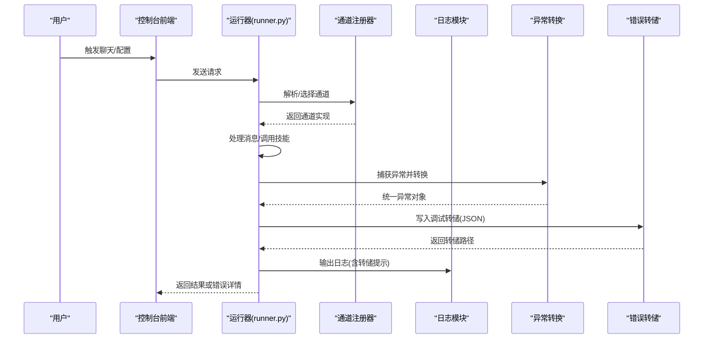
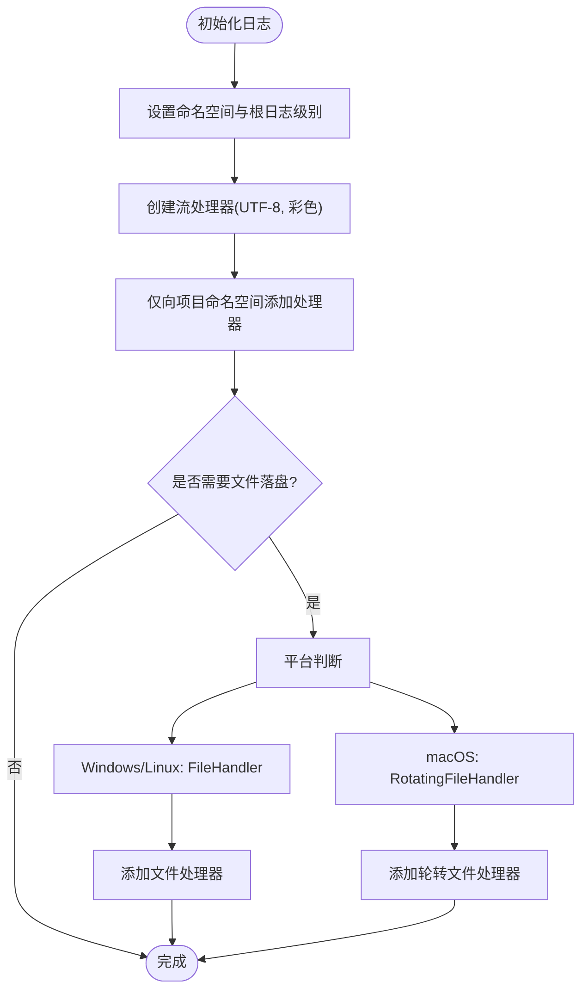
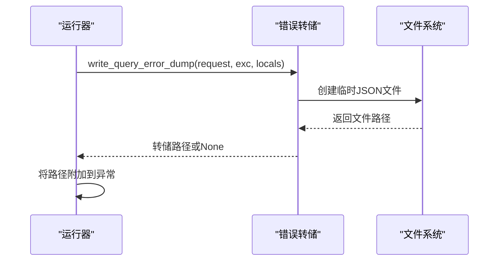
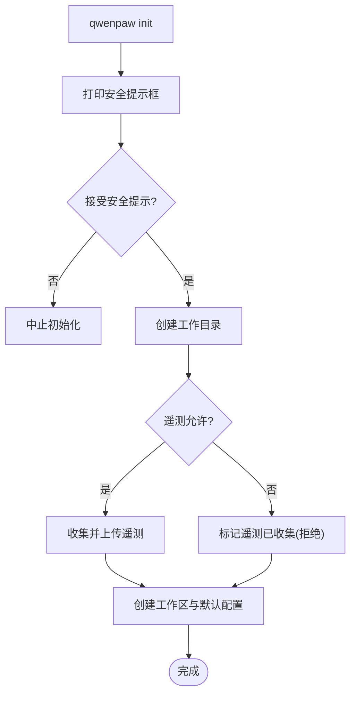
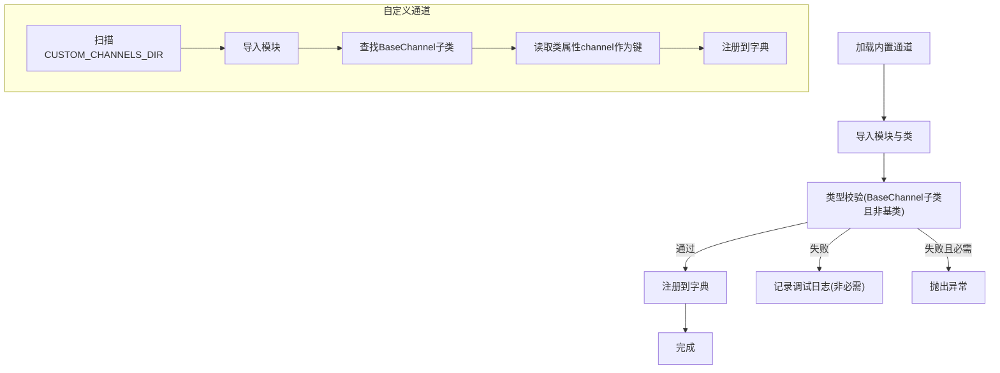
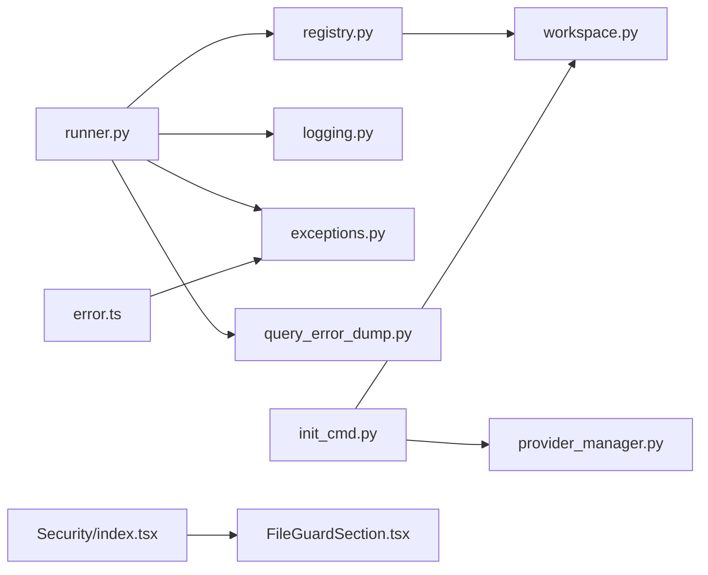

# 故障排除

<cite>
**本文引用的文件**
- [README.md](file://README.md)
- [CONTRIBUTING.md](file://CONTRIBUTING.md)
- [SECURITY.md](file://SECURITY.md)
- [src/qwenpaw/exceptions.py](file://src/qwenpaw/exceptions.py)
- [src/qwenpaw/utils/logging.py](file://src/qwenpaw/utils/logging.py)
- [src/qwenpaw/app/runner/query_error_dump.py](file://src/qwenpaw/app/runner/query_error_dump.py)
- [src/qwenpaw/app/runner/runner.py](file://src/qwenpaw/app/runner/runner.py)
- [src/qwenpaw/cli/init_cmd.py](file://src/qwenpaw/cli/init_cmd.py)
- [src/qwenpaw/app/channels/registry.py](file://src/qwenpaw/app/channels/registry.py)
- [src/qwenpaw/local_models/manager.py](file://src/qwenpaw/local_models/manager.py)
- [src/qwenpaw/providers/provider_manager.py](file://src/qwenpaw/providers/provider_manager.py)
- [src/qwenpaw/app/workspace/workspace.py](file://src/qwenpaw/app/workspace/workspace.py)
- [src/qwenpaw/utils/system_info.py](file://src/qwenpaw/utils/system_info.py)
- [src/qwenpaw/agents/memory/reme_light_memory_manager.py](file://src/qwenpaw/agents/memory/reme_light_memory_manager.py)
- [console/src/pages/Settings/Security/index.tsx](file://console/src/pages/Settings/Security/index.tsx)
- [console/src/pages/Settings/Security/components/FileGuardSection.tsx](file://console/src/pages/Settings/Security/components/FileGuardSection.tsx)
- [console/src/utils/error.ts](file://console/src/utils/error.ts)
- [scripts/install.sh](file://scripts/install.sh)
- [scripts/install.ps1](file://scripts/install.ps1)
- [tests/unit/local_models/test_local_model_manager.py](file://tests/unit/local_models/test_local_model_manager.py)
- [tests/unit/providers/test_provider_manager.py](file://tests/unit/providers/test_provider_manager.py)
- [tests/unit/channels/test_onebot_channel.py](file://tests/unit/channels/test_onebot_channel.py)
- [tests/unit/channels/test_qq_channel.py](file://tests/unit/channels/test_qq_channel.py)
</cite>

## 目录
1. [简介](#简介)
2. [项目结构](#项目结构)
3. [核心组件](#核心组件)
4. [架构总览](#架构总览)
5. [详细组件分析](#详细组件分析)
6. [依赖分析](#依赖分析)
7. [性能考虑](#性能考虑)
8. [故障排除指南](#故障排除指南)
9. [结论](#结论)
10. [附录](#附录)

## 简介
本指南面向运维与开发者，聚焦于QwenPaw在安装、配置、运行时异常、网络连接、模型加载、通道集成、系统资源与并发、性能瓶颈、安全与权限、兼容性冲突等方面的故障诊断与解决。文档同时提供日志分析、错误追踪、调试转储、监控指标与优化建议，并给出社区支持与紧急响应流程。

## 项目结构
QwenPaw由Python后端、TypeScript前端控制台、本地模型与提供商管理、通道适配器、工作区与运行器等模块组成。安装脚本负责构建前端静态资源并完成环境准备；初始化命令负责生成工作目录、配置文件与安全提示；运行器负责消息处理、异常转换与调试转储；日志模块统一输出格式与文件落盘；通道注册器负责内置与自定义通道发现与加载。

```mermaid
graph TB
subgraph "安装与初始化"
INSTALL["安装脚本<br/>scripts/install.sh / install.ps1"]
INIT["初始化命令<br/>cli/init_cmd.py"]
end
subgraph "后端服务"
RUNNER["运行器<br/>app/runner/runner.py"]
REGISTRY["通道注册器<br/>app/channels/registry.py"]
WS["工作区服务<br/>app/workspace/workspace.py"]
LOG["日志模块<br/>utils/logging.py"]
EXC["异常定义与转换<br/>exceptions.py"]
ERRDUMP["错误转储<br/>app/runner/query_error_dump.py"]
end
subgraph "模型与提供商"
LM["本地模型管理<br/>local_models/manager.py"]
PM["提供商管理<br/>providers/provider_manager.py"]
end
subgraph "前端控制台"
CONSOLE["控制台页面<br/>console/src/pages/..."]
SECUI["安全设置页<br/>console/src/pages/Settings/Security/index.tsx"]
FILEGUARD["文件守卫组件<br/>console/src/pages/Settings/Security/components/FileGuardSection.tsx"]
ERRUTIL["错误解析工具<br/>console/src/utils/error.ts"]
end
INSTALL --> INIT
INIT --> WS
WS --> RUNNER
RUNNER --> REGISTRY
RUNNER --> LOG
RUNNER --> EXC
RUNNER --> ERRDUMP
RUNNER --> LM
RUNNER --> PM
CONSOLE --> SECUI
SECUI --> FILEGUARD
ERRUTIL --> EXC
```

**图表来源**
- [scripts/install.sh:165-206](file://scripts/install.sh#L165-L206)
- [scripts/install.ps1:237-271](file://scripts/install.ps1#L237-L271)
- [src/qwenpaw/cli/init_cmd.py:138-200](file://src/qwenpaw/cli/init_cmd.py#L138-L200)
- [src/qwenpaw/app/workspace/workspace.py:215-239](file://src/qwenpaw/app/workspace/workspace.py#L215-L239)
- [src/qwenpaw/app/runner/runner.py:559-594](file://src/qwenpaw/app/runner/runner.py#L559-L594)
- [src/qwenpaw/app/channels/registry.py:45-160](file://src/qwenpaw/app/channels/registry.py#L45-L160)
- [src/qwenpaw/utils/logging.py:121-202](file://src/qwenpaw/utils/logging.py#L121-L202)
- [src/qwenpaw/exceptions.py:165-254](file://src/qwenpaw/exceptions.py#L165-L254)
- [src/qwenpaw/app/runner/query_error_dump.py:48-105](file://src/qwenpaw/app/runner/query_error_dump.py#L48-L105)
- [src/qwenpaw/local_models/manager.py](file://src/qwenpaw/local_models/manager.py)
- [src/qwenpaw/providers/provider_manager.py](file://src/qwenpaw/providers/provider_manager.py)
- [console/src/pages/Settings/Security/index.tsx:296-437](file://console/src/pages/Settings/Security/index.tsx#L296-L437)
- [console/src/pages/Settings/Security/components/FileGuardSection.tsx:1-55](file://console/src/pages/Settings/Security/components/FileGuardSection.tsx#L1-L55)
- [console/src/utils/error.ts:1-11](file://console/src/utils/error.ts#L1-L11)

**章节来源**
- [README.md:104-186](file://README.md#L104-L186)
- [CONTRIBUTING.md:11-236](file://CONTRIBUTING.md#L11-L236)

## 核心组件
- 异常体系与转换：定义业务异常类型，并对LLM相关异常进行分类转换，便于统一处理与上报。
- 日志系统：统一命名空间、彩色终端输出、可选文件落盘与访问日志过滤。
- 错误转储：在查询处理器异常时写入临时JSON，包含请求上下文、异常栈、代理状态等，辅助定位。
- 初始化流程：打印安全提示、可选遥测收集、创建工作目录与默认配置。
- 通道注册：内置通道安全加载、自定义通道扫描注册、路由优先级与限制。
- 运行器：消息处理主循环、异常转换、会话状态保存、调试转储路径附加。
- 安全设置：工具黑名单、文件访问守卫、规则编辑与预览。
- 本地模型与提供商：模型下载与管理、提供商列表与能力标签。

**章节来源**
- [src/qwenpaw/exceptions.py:18-254](file://src/qwenpaw/exceptions.py#L18-L254)
- [src/qwenpaw/utils/logging.py:121-202](file://src/qwenpaw/utils/logging.py#L121-L202)
- [src/qwenpaw/app/runner/query_error_dump.py:48-105](file://src/qwenpaw/app/runner/query_error_dump.py#L48-L105)
- [src/qwenpaw/cli/init_cmd.py:138-200](file://src/qwenpaw/cli/init_cmd.py#L138-L200)
- [src/qwenpaw/app/channels/registry.py:45-160](file://src/qwenpaw/app/channels/registry.py#L45-L160)
- [src/qwenpaw/app/runner/runner.py:559-594](file://src/qwenpaw/app/runner/runner.py#L559-L594)
- [console/src/pages/Settings/Security/index.tsx:296-437](file://console/src/pages/Settings/Security/index.tsx#L296-L437)
- [console/src/pages/Settings/Security/components/FileGuardSection.tsx:1-55](file://console/src/pages/Settings/Security/components/FileGuardSection.tsx#L1-L55)

## 架构总览
下图展示从用户操作到后端处理、异常转换与调试转储的关键交互路径。

**图表来源**
- [src/qwenpaw/app/runner/runner.py:559-594](file://src/qwenpaw/app/runner/runner.py#L559-L594)
- [src/qwenpaw/app/channels/registry.py:45-160](file://src/qwenpaw/app/channels/registry.py#L45-L160)
- [src/qwenpaw/exceptions.py:165-254](file://src/qwenpaw/exceptions.py#L165-L254)
- [src/qwenpaw/app/runner/query_error_dump.py:48-105](file://src/qwenpaw/app/runner/query_error_dump.py#L48-L105)
- [src/qwenpaw/utils/logging.py:121-202](file://src/qwenpaw/utils/logging.py#L121-L202)

## 详细组件分析

### 组件A：异常体系与转换
- 业务异常类型：提供者错误、模型格式化错误、系统命令执行错误、通道通信错误、代理状态错误、技能管理错误。
- LLM异常转换：根据状态码与关键字映射到未授权、配额超限、超时、上下文长度超限等；非模型类异常包装为未知异常。
- 转换后的异常携带原始类型、消息、模型名、HTTP状态码等信息，便于前端解析与用户提示。

```mermaid
classDiagram
class AgentRuntimeErrorException
class ModelExecutionException
class ModelTimeoutException
class UnauthorizedModelAccessException
class ModelQuotaExceededException
class ModelContextLengthExceededException
class UnknownAgentException
class ExternalServiceException
class ProviderError
class ModelFormatterError
class SystemCommandException
class ChannelError
class AgentStateError
class SkillsError
ProviderError --> AgentRuntimeErrorException
ModelFormatterError --> AgentRuntimeErrorException
SystemCommandException --> AgentRuntimeErrorException
ChannelError --> ExternalServiceException
AgentStateError --> AgentRuntimeErrorException
SkillsError --> AgentRuntimeErrorException
class ExceptionConverter {
+convert_model_exception(exc, model_name) AgentRuntimeErrorException
+_is_model_related_error(exc) bool
}
```

**图表来源**
- [src/qwenpaw/exceptions.py:21-254](file://src/qwenpaw/exceptions.py#L21-L254)

**章节来源**
- [src/qwenpaw/exceptions.py:18-254](file://src/qwenpaw/exceptions.py#L18-L254)

### 组件B：日志与文件落盘
- 命名空间隔离：仅输出项目包内日志，避免第三方库噪声。
- 彩色终端输出：按级别着色，相对路径显示文件与行号。
- 文件落盘：Windows/Linux使用简单文件句柄，macOS使用轮转文件处理器；重复添加幂等，避免句柄泄露。
- 访问日志过滤：可抑制特定路径的uvicorn访问日志，降低噪音。

**图表来源**
- [src/qwenpaw/utils/logging.py:121-202](file://src/qwenpaw/utils/logging.py#L121-L202)

**章节来源**
- [src/qwenpaw/utils/logging.py:18-202](file://src/qwenpaw/utils/logging.py#L18-L202)

### 组件C：错误转储与调试
- 转储内容：异常栈、异常类型与消息、请求信息（会话ID、用户ID、通道）、完整请求体、代理状态快照、UTC时间戳。
- 生成位置：临时目录，文件名前缀固定，后缀为JSON；失败时记录警告并返回None。
- 运行器集成：捕获异常后写入转储，附加转储路径到异常note/message中，便于前端展示。

**图表来源**
- [src/qwenpaw/app/runner/runner.py:559-594](file://src/qwenpaw/app/runner/runner.py#L559-L594)
- [src/qwenpaw/app/runner/query_error_dump.py:48-105](file://src/qwenpaw/app/runner/query_error_dump.py#L48-L105)

**章节来源**
- [src/qwenpaw/app/runner/query_error_dump.py:1-105](file://src/qwenpaw/app/runner/query_error_dump.py#L1-L105)
- [src/qwenpaw/app/runner/runner.py:559-594](file://src/qwenpaw/app/runner/runner.py#L559-L594)

### 组件D：初始化与安全提示
- 安全提示：单操作员边界、共享实例的委托授权、最小权限与沙箱、密钥隔离、定期审查。
- 遥测：可选匿名采集，版本、安装方式、系统、Python版本、架构、GPU可用性。
- 工作区：确保默认代理工作区存在，创建工作目录与配置文件。

**图表来源**
- [src/qwenpaw/cli/init_cmd.py:138-200](file://src/qwenpaw/cli/init_cmd.py#L138-L200)
- [SECURITY.md:30-56](file://SECURITY.md#L30-L56)

**章节来源**
- [src/qwenpaw/cli/init_cmd.py:138-200](file://src/qwenpaw/cli/init_cmd.py#L138-L200)
- [SECURITY.md:30-56](file://SECURITY.md#L30-L56)

### 组件E：通道注册与加载
- 内置通道：按规范导入模块与类，类型校验，失败时对必需通道抛出异常，非必需通道仅记录调试日志。
- 自定义通道：扫描自定义目录，动态导入模块，查找继承基类的子类，注册为自定义通道。
- 路由注册：自定义通道可挂载API路由，要求以/api/开头，避免被SPA兜底路由吞没。

**图表来源**
- [src/qwenpaw/app/channels/registry.py:45-160](file://src/qwenpaw/app/channels/registry.py#L45-L160)

**章节来源**
- [src/qwenpaw/app/channels/registry.py:45-160](file://src/qwenpaw/app/channels/registry.py#L45-L160)

### 组件F：本地模型与提供商
- 本地模型：下载管理、后端选择（llama.cpp/Ollama/LM Studio），无需API Key即可运行。
- 提供商管理：统一注册与发现，支持自动模型列表获取，增强用户体验。

**章节来源**
- [README.md:346-355](file://README.md#L346-L355)
- [src/qwenpaw/local_models/manager.py](file://src/qwenpaw/local_models/manager.py)
- [src/qwenpaw/providers/provider_manager.py](file://src/qwenpaw/providers/provider_manager.py)

### 组件G：安全设置与工具/文件守卫
- 工具黑名单：在控制台安全页配置，禁用高危工具。
- 文件访问守卫：可配置允许/禁止路径，防止敏感文件被读取。
- 规则编辑：支持新增、编辑、删除与预览规则，便于精细化控制。

**章节来源**
- [console/src/pages/Settings/Security/index.tsx:296-437](file://console/src/pages/Settings/Security/index.tsx#L296-L437)
- [console/src/pages/Settings/Security/components/FileGuardSection.tsx:1-55](file://console/src/pages/Settings/Security/components/FileGuardSection.tsx#L1-L55)

## 依赖分析
- 运行器依赖通道注册器、日志模块、异常转换与错误转储；通道注册器依赖工作区服务与自定义通道目录。
- 初始化命令依赖配置读写、提供商与技能交互配置、工作区迁移。
- 前端安全页与文件守卫组件通过API与后端交互，错误解析工具用于提取后端返回的详细信息。

**图表来源**
- [src/qwenpaw/app/runner/runner.py:559-594](file://src/qwenpaw/app/runner/runner.py#L559-L594)
- [src/qwenpaw/app/channels/registry.py:45-160](file://src/qwenpaw/app/channels/registry.py#L45-L160)
- [src/qwenpaw/utils/logging.py:121-202](file://src/qwenpaw/utils/logging.py#L121-L202)
- [src/qwenpaw/exceptions.py:165-254](file://src/qwenpaw/exceptions.py#L165-L254)
- [src/qwenpaw/app/runner/query_error_dump.py:48-105](file://src/qwenpaw/app/runner/query_error_dump.py#L48-L105)
- [src/qwenpaw/app/workspace/workspace.py:215-239](file://src/qwenpaw/app/workspace/workspace.py#L215-L239)
- [src/qwenpaw/cli/init_cmd.py:138-200](file://src/qwenpaw/cli/init_cmd.py#L138-L200)
- [src/qwenpaw/providers/provider_manager.py](file://src/qwenpaw/providers/provider_manager.py)
- [console/src/pages/Settings/Security/index.tsx:296-437](file://console/src/pages/Settings/Security/index.tsx#L296-L437)
- [console/src/pages/Settings/Security/components/FileGuardSection.tsx:1-55](file://console/src/pages/Settings/Security/components/FileGuardSection.tsx#L1-L55)
- [console/src/utils/error.ts:1-11](file://console/src/utils/error.ts#L1-L11)

**章节来源**
- [src/qwenpaw/app/workspace/workspace.py:215-239](file://src/qwenpaw/app/workspace/workspace.py#L215-L239)
- [src/qwenpaw/cli/init_cmd.py:138-200](file://src/qwenpaw/cli/init_cmd.py#L138-L200)

## 性能考虑
- 日志级别与输出：生产环境建议INFO以上，避免DEBUG噪声；必要时开启文件落盘但注意磁盘IO。
- 通道并发：通道管理器按优先级启动，避免阻塞；自定义通道应避免长时间阻塞请求处理。
- 代理与会话：懒加载与预热策略减少冷启动；会话状态保存在finally阶段，确保一致性。
- 内存与上下文：ReMe轻量记忆管理支持上下文检查与压缩，避免超长上下文导致性能下降。
- 系统资源：通过系统信息模块获取内存总量，结合容器/主机资源限制合理分配。

**章节来源**
- [src/qwenpaw/utils/logging.py:121-202](file://src/qwenpaw/utils/logging.py#L121-L202)
- [src/qwenpaw/app/workspace/workspace.py:215-239](file://src/qwenpaw/app/workspace/workspace.py#L215-L239)
- [src/qwenpaw/agents/memory/reme_light_memory_manager.py:263-301](file://src/qwenpaw/agents/memory/reme_light_memory_manager.py#L263-L301)
- [src/qwenpaw/utils/system_info.py:207-228](file://src/qwenpaw/utils/system_info.py#L207-L228)

## 故障排除指南

### 1. 安装与启动问题
- 现象：安装脚本无法找到npm或构建失败，Web界面不可用。
- 诊断：
  - 检查Node.js与npm是否安装，脚本会尝试构建console前端。
  - 若未找到console源或构建产物缺失，将提示Web UI不可用。
- 处理：
  - 手动安装Node.js并执行console前端构建，再重新运行安装脚本。
  - 在受限网络环境下，参考脚本注释与README说明，使用替代安装方式。
- 预防：
  - 开发环境提前安装Node.js与包管理器；CI中固定Node版本。

**章节来源**
- [scripts/install.sh:165-206](file://scripts/install.sh#L165-L206)
- [scripts/install.ps1:237-271](file://scripts/install.ps1#L237-L271)
- [README.md:122-186](file://README.md#L122-L186)

### 2. 配置错误
- 现象：初始化后仍提示缺少API Key或提供商未启用。
- 诊断：
  - 检查工作目录下的配置文件与提供商配置。
  - 使用初始化命令交互式配置提供商与API Key。
- 处理：
  - 在控制台设置页配置提供商与密钥；或通过环境变量注入。
  - 对于本地模型，确认下载与后端服务已正确启动。
- 预防：
  - 使用--defaults配合--accept-security自动化初始化；定期备份配置。

**章节来源**
- [src/qwenpaw/cli/init_cmd.py:138-200](file://src/qwenpaw/cli/init_cmd.py#L138-L200)
- [README.md:332-344](file://README.md#L332-L344)

### 3. 运行时异常与错误追踪
- 现象：聊天无响应、报错或出现调试转储提示。
- 诊断：
  - 查看终端日志，关注异常类型与消息；若包含“详情路径”，即触发了调试转储。
  - 前端错误解析工具可从错误消息中提取detail字段。
- 处理：
  - 打开调试转储文件，核对请求上下文、异常栈与代理状态。
  - 根据异常转换结果（如未授权、配额超限、超时、上下文长度超限）采取相应措施。
- 预防：
  - 启用文件日志落盘，定期轮转；在生产环境设置合适的日志级别。

**章节来源**
- [src/qwenpaw/app/runner/runner.py:559-594](file://src/qwenpaw/app/runner/runner.py#L559-L594)
- [src/qwenpaw/app/runner/query_error_dump.py:48-105](file://src/qwenpaw/app/runner/query_error_dump.py#L48-L105)
- [src/qwenpaw/exceptions.py:165-254](file://src/qwenpaw/exceptions.py#L165-L254)
- [console/src/utils/error.ts:1-11](file://console/src/utils/error.ts#L1-L11)

### 4. 网络连接问题
- 现象：通道无法接收/发送消息、回调地址不可达。
- 诊断：
  - 检查通道配置（如Webhook、鉴权参数）与防火墙设置。
  - 对Docker部署，确认容器网络模式与宿主机端口映射。
- 处理：
  - 使用host.docker.internal指向宿主机（容器内localhost不等于宿主机）。
  - 在Linux使用host网络模式时注意端口冲突。
- 预防：
  - 生产环境使用反向代理与域名；通道回调URL保持稳定。

**章节来源**
- [README.md:246-271](file://README.md#L246-L271)
- [src/qwenpaw/app/channels/registry.py:45-160](file://src/qwenpaw/app/channels/registry.py#L45-L160)

### 5. 模型加载与提供商问题
- 现象：模型列表为空、调用超时、配额不足或认证失败。
- 诊断：
  - 检查提供商配置与API Key；确认网络可达与速率限制。
  - 使用异常转换逻辑区分未授权、配额超限、超时与上下文长度超限。
- 处理：
  - 更换有效Key或提升配额；调整请求超时与上下文长度。
  - 对本地模型，确认llama.cpp/Ollama/LM Studio服务正常运行。
- 预防：
  - 提供商管理中预设能力标签，减少手动验证成本。

**章节来源**
- [src/qwenpaw/exceptions.py:165-254](file://src/qwenpaw/exceptions.py#L165-L254)
- [src/qwenpaw/providers/provider_manager.py](file://src/qwenpaw/providers/provider_manager.py)
- [README.md:346-355](file://README.md#L346-L355)

### 6. 通道集成问题
- 现象：自定义通道无法注册、路由被SPA兜底、消息丢失。
- 诊断：
  - 确认自定义通道模块位于自定义目录，类具备唯一channel键。
  - 检查是否以/api/前缀注册路由。
- 处理：
  - 修正模块导入路径与类定义；确保注册函数在模块级调用。
- 预防：
  - 遵循通道基类接口与注册约定；单元测试覆盖典型场景。

**章节来源**
- [src/qwenpaw/app/channels/registry.py:97-160](file://src/qwenpaw/app/channels/registry.py#L97-L160)
- [tests/unit/channels/test_onebot_channel.py](file://tests/unit/channels/test_onebot_channel.py)
- [tests/unit/channels/test_qq_channel.py](file://tests/unit/channels/test_qq_channel.py)

### 7. 系统资源与并发问题
- 现象：内存占用过高、CPU飙升、启动缓慢。
- 诊断：
  - 通过系统信息模块获取物理内存总量，评估容器/主机资源限制。
  - 检查通道并发与代理预热策略，避免同时大量启动。
- 处理：
  - 调整容器资源限制与节点亲和；启用ReMe上下文压缩。
- 预防：
  - 生产环境使用资源配额与HPA；定期压测与容量规划。

**章节来源**
- [src/qwenpaw/utils/system_info.py:207-228](file://src/qwenpaw/utils/system_info.py#L207-L228)
- [src/qwenpaw/agents/memory/reme_light_memory_manager.py:263-301](file://src/qwenpaw/agents/memory/reme_light_memory_manager.py#L263-L301)
- [src/qwenpaw/app/workspace/workspace.py:215-239](file://src/qwenpaw/app/workspace/workspace.py#L215-L239)

### 8. 安全事件与权限问题
- 现象：工具被滥用、文件被读取、规则误判。
- 诊断：
  - 检查工具黑名单与文件守卫配置；核对规则ID与生效范围。
  - 参考安全策略与信任模型，避免跨边界访问。
- 处理：
  - 调整规则与路径白名单；启用最小权限与沙箱。
- 预防：
  - 定期审查配置与技能；遵循单操作员边界与多租户隔离原则。

**章节来源**
- [SECURITY.md:65-158](file://SECURITY.md#L65-L158)
- [console/src/pages/Settings/Security/index.tsx:296-437](file://console/src/pages/Settings/Security/index.tsx#L296-L437)
- [console/src/pages/Settings/Security/components/FileGuardSection.tsx:1-55](file://console/src/pages/Settings/Security/components/FileGuardSection.tsx#L1-L55)

### 9. 兼容性冲突
- 现象：不同平台路径差异、Shell命令不一致、依赖版本冲突。
- 诊断：
  - 检查平台特定代码（如Windows ANSI支持、路径分隔符）。
  - 单元测试覆盖关键场景，如本地模型管理与提供商管理。
- 处理：
  - 使用条件分支与可选依赖；在CI中覆盖主流平台。
- 预防：
  - 固定依赖版本；平台差异通过运行时检测与降级处理。

**章节来源**
- [src/qwenpaw/utils/logging.py:30-48](file://src/qwenpaw/utils/logging.py#L30-L48)
- [tests/unit/local_models/test_local_model_manager.py](file://tests/unit/local_models/test_local_model_manager.py)
- [tests/unit/providers/test_provider_manager.py](file://tests/unit/providers/test_provider_manager.py)

### 10. 性能瓶颈与优化
- 现象：响应延迟大、吞吐低、上下文过长。
- 诊断：
  - 结合日志与转储定位热点；检查通道并发与代理生命周期。
  - 使用ReMe上下文检查与压缩，避免超长上下文。
- 处理：
  - 调整并发度与批处理大小；优化模型参数与上下文长度。
- 监控指标建议：
  - 请求延迟、错误率、并发数、内存占用、上下文长度分布、通道队列长度。

**章节来源**
- [src/qwenpaw/agents/memory/reme_light_memory_manager.py:263-301](file://src/qwenpaw/agents/memory/reme_light_memory_manager.py#L263-L301)
- [src/qwenpaw/utils/logging.py:121-202](file://src/qwenpaw/utils/logging.py#L121-L202)

### 11. 社区支持与紧急响应
- 报告安全漏洞：通过阿里安全响应中心私有渠道提交，包含复现步骤、影响面与修复建议。
- 一般问题：在GitHub Discussions与Issues中搜索与提问；提供环境信息与最小复现。
- 紧急响应：优先处理未授权访问、凭证泄露与高危工具滥用；按安全策略快速隔离与修复。

**章节来源**
- [SECURITY.md:5-64](file://SECURITY.md#L5-L64)
- [CONTRIBUTING.md:229-236](file://CONTRIBUTING.md#L229-L236)

## 结论
本指南围绕QwenPaw的安装、配置、运行时异常、网络与模型、通道集成、资源与并发、安全与权限、兼容性与性能等方面提供了系统化的诊断与处置流程。通过统一的日志与异常转换、完善的错误转储与前端解析工具、严格的通道注册与安全策略，以及持续的监控与优化，可显著提升系统的稳定性与可维护性。

## 附录
- 常用命令与入口
  - 安装与初始化：pip安装、脚本安装、Docker运行、桌面应用。
  - 启动服务：qwenpaw init、qwenpaw app。
- 关键文件路径
  - 控制台前端构建：console目录与package.json。
  - 工作目录与配置：工作目录下config.json与HEARTBEAT.md。
  - 通道自定义目录：自定义通道模块放置于自定义目录并符合基类约定。

**章节来源**
- [README.md:104-186](file://README.md#L104-L186)
- [src/qwenpaw/cli/init_cmd.py:138-200](file://src/qwenpaw/cli/init_cmd.py#L138-L200)