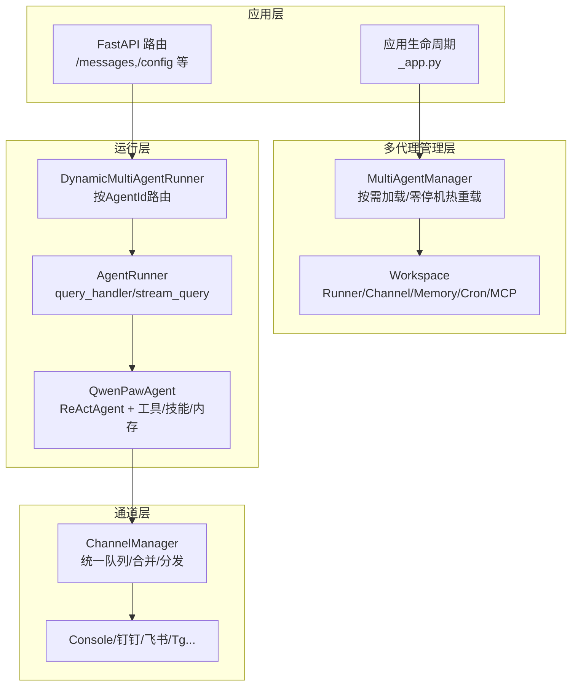
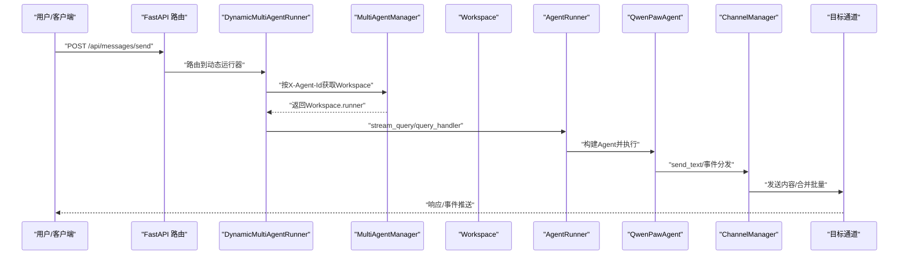
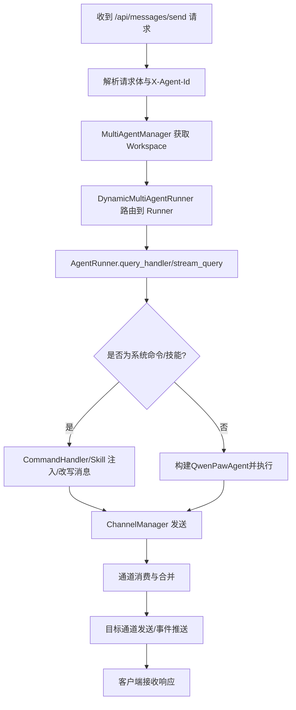
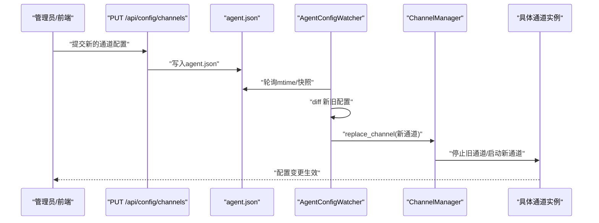
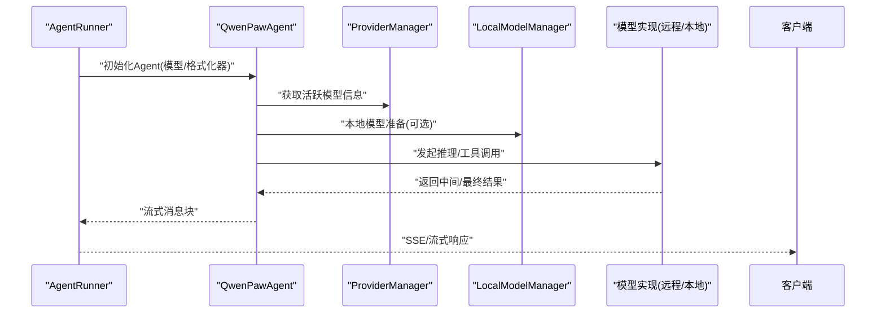
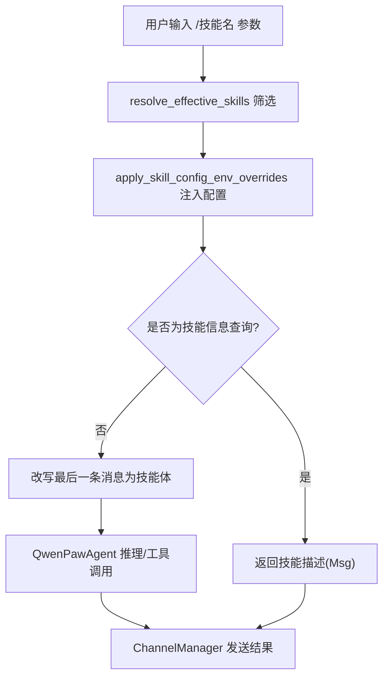
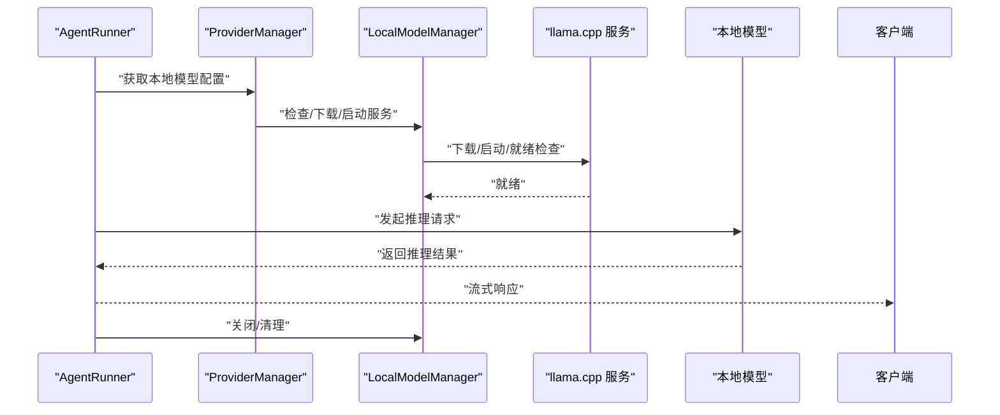
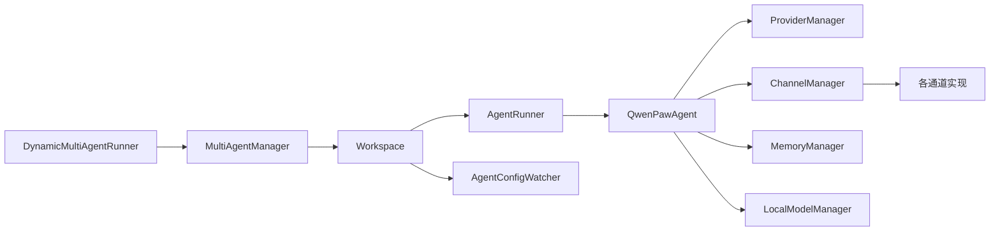

# 数据流分析

<cite>
**本文档引用的文件**
- [messages.py](file://src/qwenpaw/app/routers/messages.py)
- [command_handler.py](file://src/qwenpaw/agents/command_handler.py)
- [manager.py](file://src/qwenpaw/local_models/manager.py)
- [provider_manager.py](file://src/qwenpaw/providers/provider_manager.py)
- [skills_manager.py](file://src/qwenpaw/agents/skills_manager.py)
- [multi_agent_manager.py](file://src/qwenpaw/app/multi_agent_manager.py)
- [_app.py](file://src/qwenpaw/app/_app.py)
- [runner.py](file://src/qwenpaw/app/runner/runner.py)
- [manager.py](file://src/qwenpaw/app/channels/manager.py)
- [agent_config_watcher.py](file://src/qwenpaw/app/agent_config_watcher.py)
- [workspace.py](file://src/qwenpaw/app/workspace/workspace.py)
- [config.py](file://src/qwenpaw/app/routers/config.py)
- [react_agent.py](file://src/qwenpaw/agents/react_agent.py)
</cite>

## 目录
1. [简介](#简介)
2. [项目结构](#项目结构)
3. [核心组件](#核心组件)
4. [架构总览](#架构总览)
5. [详细组件分析](#详细组件分析)
6. [依赖分析](#依赖分析)
7. [性能考虑](#性能考虑)
8. [故障排查指南](#故障排查指南)
9. [结论](#结论)

## 简介
本文件面向QwenPaw系统，围绕“数据流”这一主题，系统梳理从用户输入到响应输出的完整数据路径，覆盖消息路由、处理流程与状态转换；同时深入分析代理配置变更的热重载数据流、模型调用链路、技能执行链路以及本地模型推理链路，并提供性能优化建议与瓶颈分析方法。

## 项目结构
QwenPaw采用多代理架构：应用层通过FastAPI提供REST接口，运行器根据请求动态路由至对应Workspace中的AgentRunner，再由AgentRunner驱动QwenPawAgent完成对话、工具/技能调用、内存管理与通道发送等全流程。通道层负责对接多种外部渠道（如控制台、钉钉、飞书、Telegram等），统一排队与合并策略保障高并发稳定性。

**图表来源**
- [_app.py:156-235](file://src/qwenpaw/app/_app.py#L156-L235)
- [multi_agent_manager.py:21-90](file://src/qwenpaw/app/multi_agent_manager.py#L21-L90)
- [workspace.py:47-120](file://src/qwenpaw/app/workspace/workspace.py#L47-L120)
- [runner.py:70-140](file://src/qwenpaw/app/runner/runner.py#L70-L140)
- [react_agent.py:69-180](file://src/qwenpaw/agents/react_agent.py#L69-L180)
- [manager.py:68-120](file://src/qwenpaw/app/channels/manager.py#L68-L120)

**章节来源**
- [_app.py:156-235](file://src/qwenpaw/app/_app.py#L156-L235)
- [multi_agent_manager.py:21-90](file://src/qwenpaw/app/multi_agent_manager.py#L21-L90)
- [workspace.py:47-120](file://src/qwenpaw/app/workspace/workspace.py#L47-L120)

## 核心组件
- 多代理管理器：负责按需加载、零停机热重载、任务跟踪与清理。
- 工作空间：封装Runner、ChannelManager、MemoryManager、CronManager、MCPClientManager等服务。
- 动态运行器：根据请求头X-Agent-Id选择具体Workspace的Runner。
- AgentRunner：统一处理查询、命令、工具守卫审批、会话状态加载/保存。
- QwenPawAgent：ReActAgent扩展，集成工具、技能、内存与安全拦截。
- 通道管理器：统一队列、优先级、批量合并与分发。
- 配置观察器：监控agent.json变化并热重载通道/心跳等配置。
- 本地模型管理器：本地llama.cpp服务的下载、启动、配置持久化。
- 提供商管理器：统一管理内置/自定义提供商与密钥存储。

**章节来源**
- [multi_agent_manager.py:21-90](file://src/qwenpaw/app/multi_agent_manager.py#L21-L90)
- [workspace.py:47-120](file://src/qwenpaw/app/workspace/workspace.py#L47-L120)
- [runner.py:70-140](file://src/qwenpaw/app/runner/runner.py#L70-L140)
- [react_agent.py:69-180](file://src/qwenpaw/agents/react_agent.py#L69-L180)
- [manager.py:68-120](file://src/qwenpaw/app/channels/manager.py#L68-L120)
- [agent_config_watcher.py:35-95](file://src/qwenpaw/app/agent_config_watcher.py#L35-L95)
- [manager.py:33-110](file://src/qwenpaw/local_models/manager.py#L33-L110)
- [provider_manager.py:670-732](file://src/qwenpaw/providers/provider_manager.py#L670-L732)

## 架构总览
下图展示从HTTP请求到通道发送的端到端数据流，涵盖多代理路由、运行器处理、Agent执行、通道分发与持久化。

**图表来源**
- [messages.py:78-187](file://src/qwenpaw/app/routers/messages.py#L78-L187)
- [_app.py:79-140](file://src/qwenpaw/app/_app.py#L79-L140)
- [multi_agent_manager.py:38-90](file://src/qwenpaw/app/multi_agent_manager.py#L38-L90)
- [runner.py:349-595](file://src/qwenpaw/app/runner/runner.py#L349-L595)
- [manager.py:659-711](file://src/qwenpaw/app/channels/manager.py#L659-L711)

## 详细组件分析

### 用户输入到响应输出的完整数据路径
- 请求入口：/api/messages/send接收文本消息，解析通道、用户、会话与文本。
- 多代理路由：DynamicMultiAgentRunner依据X-Agent-Id从MultiAgentManager获取Workspace。
- 运行器处理：AgentRunner.query_handler/stream_query负责命令识别、工具守卫审批、会话状态加载/保存、MCP客户端注入与Agent执行。
- Agent执行：QwenPawAgent基于系统提示、工具/技能、内存与模型进行推理与工具/技能调用。
- 通道分发：ChannelManager统一排队、合并批量、按优先级与会话键消费，最终发送到目标通道。
- 响应输出：通道返回结果或事件，客户端接收。

**图表来源**
- [messages.py:78-187](file://src/qwenpaw/app/routers/messages.py#L78-L187)
- [runner.py:349-595](file://src/qwenpaw/app/runner/runner.py#L349-L595)
- [react_agent.py:306-341](file://src/qwenpaw/agents/react_agent.py#L306-L341)
- [manager.py:39-66](file://src/qwenpaw/app/channels/manager.py#L39-L66)

**章节来源**
- [messages.py:78-187](file://src/qwenpaw/app/routers/messages.py#L78-L187)
- [runner.py:349-595](file://src/qwenpaw/app/runner/runner.py#L349-L595)
- [react_agent.py:306-341](file://src/qwenpaw/agents/react_agent.py#L306-L341)
- [manager.py:39-66](file://src/qwenpaw/app/channels/manager.py#L39-L66)

### 代理配置变更的数据流（热重载）
- 配置写入：/api/config/channels PUT更新agent.json。
- 观察器触发：AgentConfigWatcher轮询agent.json mtime，检测channels/heartbeat变更。
- 渠道替换：逐个对比新旧配置，使用Channel.clone与ChannelManager.replace_channel热替换。
- 心跳重调度：若心跳配置变更，CronManager重新调度心跳任务。
- 持久化：配置落盘后立即生效，无需重启。

**图表来源**
- [config.py:122-141](file://src/qwenpaw/app/routers/config.py#L122-L141)
- [agent_config_watcher.py:149-217](file://src/qwenpaw/app/agent_config_watcher.py#L149-L217)
- [manager.py:571-630](file://src/qwenpaw/app/channels/manager.py#L571-L630)

**章节来源**
- [config.py:122-141](file://src/qwenpaw/app/routers/config.py#L122-L141)
- [agent_config_watcher.py:149-217](file://src/qwenpaw/app/agent_config_watcher.py#L149-L217)
- [manager.py:571-630](file://src/qwenpaw/app/channels/manager.py#L571-L630)

### 模型调用的数据流（从请求生成到API调用再到结果返回）
- 请求生成：AgentRunner在query_handler中设置当前agent/session上下文，构建QwenPawAgent。
- 模型工厂：create_model_and_formatter根据agent_id选择活跃模型与格式化器。
- 推理执行：QwenPawAgent继承ReActAgent，按迭代次数与工具/技能决策逐步推理。
- 工具守卫：ToolGuardMixin拦截潜在风险工具调用，必要时进入审批流程。
- 结果返回：stream_printing_messages逐块输出，支持SSE/流式传输。

**图表来源**
- [runner.py:446-470](file://src/qwenpaw/app/runner/runner.py#L446-L470)
- [react_agent.py:143-153](file://src/qwenpaw/agents/react_agent.py#L143-L153)
- [provider_manager.py:670-732](file://src/qwenpaw/providers/provider_manager.py#L670-L732)
- [manager.py:200-220](file://src/qwenpaw/local_models/manager.py#L200-L220)

**章节来源**
- [runner.py:446-470](file://src/qwenpaw/app/runner/runner.py#L446-L470)
- [react_agent.py:143-153](file://src/qwenpaw/agents/react_agent.py#L143-L153)
- [provider_manager.py:670-732](file://src/qwenpaw/providers/provider_manager.py#L670-L732)
- [manager.py:200-220](file://src/qwenpaw/local_models/manager.py#L200-L220)

### 技能执行的数据流（参数传递、执行过程与结果回传）
- 技能发现：resolve_effective_skills按通道筛选有效技能集合。
- 环境注入：apply_skill_config_env_overrides将技能配置映射为环境变量，仅在本次会话生效。
- 执行注入：若用户输入以“/技能名 输入”形式，_maybe_inject_skill改写最后一条用户消息为技能体，避免重复记录到记忆。
- 执行过程：QwenPawAgent在推理阶段调用Toolkit注册的技能函数，支持异步后台任务管理工具。
- 结果回传：技能输出经AgentRunner封装为Msg，通过ChannelManager发送到目标通道。

**图表来源**
- [runner.py:114-223](file://src/qwenpaw/app/runner/runner.py#L114-L223)
- [skills_manager.py:674-718](file://src/qwenpaw/agents/skills_manager.py#L674-L718)
- [react_agent.py:306-341](file://src/qwenpaw/agents/react_agent.py#L306-L341)
- [manager.py:659-711](file://src/qwenpaw/app/channels/manager.py#L659-L711)

**章节来源**
- [runner.py:114-223](file://src/qwenpaw/app/runner/runner.py#L114-L223)
- [skills_manager.py:674-718](file://src/qwenpaw/agents/skills_manager.py#L674-L718)
- [react_agent.py:306-341](file://src/qwenpaw/agents/react_agent.py#L306-L341)
- [manager.py:659-711](file://src/qwenpaw/app/channels/manager.py#L659-L711)

### 本地模型推理的数据流（从模型加载到推理执行再到结果处理）
- 配置持久化：LocalModelManager维护最大上下文长度等运行时配置，写入磁盘并限制权限。
- 下载与安装：检查/下载llama.cpp二进制，必要时先停止现有服务器。
- 服务器启动：setup_server绑定模型路径与上下文长度，等待就绪。
- 推理调用：AgentRunner通过ProviderManager与本地模型交互，返回结果。
- 关闭与清理：优雅关闭或同步强制关闭，确保进程退出不遗留。

**图表来源**
- [manager.py:57-110](file://src/qwenpaw/local_models/manager.py#L57-L110)
- [manager.py:119-165](file://src/qwenpaw/local_models/manager.py#L119-L165)
- [manager.py:200-220](file://src/qwenpaw/local_models/manager.py#L200-L220)
- [provider_manager.py:623-631](file://src/qwenpaw/providers/provider_manager.py#L623-L631)
- [_app.py:213-236](file://src/qwenpaw/app/_app.py#L213-L236)

**章节来源**
- [manager.py:57-110](file://src/qwenpaw/local_models/manager.py#L57-L110)
- [manager.py:119-165](file://src/qwenpaw/local_models/manager.py#L119-L165)
- [manager.py:200-220](file://src/qwenpaw/local_models/manager.py#L200-L220)
- [provider_manager.py:623-631](file://src/qwenpaw/providers/provider_manager.py#L623-L631)
- [_app.py:213-236](file://src/qwenpaw/app/_app.py#L213-L236)

## 依赖分析
- 组件耦合
  - DynamicMultiAgentRunner与MultiAgentManager强耦合，用于按AgentId路由。
  - Workspace通过ServiceManager统一管理Runner、ChannelManager、MemoryManager、CronManager、MCPClientManager。
  - AgentRunner依赖AgentContext（agent_id/session_id）与TaskTracker。
  - QwenPawAgent依赖Toolkit（工具/技能）、MemoryManager、ProviderManager与ChannelManager。
  - ChannelManager依赖统一队列与各通道实现，支持批量合并与优先级。
- 外部依赖
  - ProviderManager管理多家模型提供商，支持加密存储与插件提供商注册。
  - LocalModelManager管理本地llama.cpp服务生命周期。
  - AgentConfigWatcher监听agent.json变化，热重载通道与心跳。

**图表来源**
- [_app.py:79-140](file://src/qwenpaw/app/_app.py#L79-L140)
- [multi_agent_manager.py:21-90](file://src/qwenpaw/app/multi_agent_manager.py#L21-L90)
- [workspace.py:142-290](file://src/qwenpaw/app/workspace/workspace.py#L142-L290)
- [runner.py:70-140](file://src/qwenpaw/app/runner/runner.py#L70-L140)
- [react_agent.py:69-180](file://src/qwenpaw/agents/react_agent.py#L69-L180)
- [manager.py:68-120](file://src/qwenpaw/app/channels/manager.py#L68-L120)
- [agent_config_watcher.py:35-95](file://src/qwenpaw/app/agent_config_watcher.py#L35-L95)
- [manager.py:33-110](file://src/qwenpaw/local_models/manager.py#L33-L110)
- [provider_manager.py:670-732](file://src/qwenpaw/providers/provider_manager.py#L670-L732)

**章节来源**
- [_app.py:79-140](file://src/qwenpaw/app/_app.py#L79-L140)
- [multi_agent_manager.py:21-90](file://src/qwenpaw/app/multi_agent_manager.py#L21-L90)
- [workspace.py:142-290](file://src/qwenpaw/app/workspace/workspace.py#L142-L290)
- [runner.py:70-140](file://src/qwenpaw/app/runner/runner.py#L70-L140)
- [react_agent.py:69-180](file://src/qwenpaw/agents/react_agent.py#L69-L180)
- [manager.py:68-120](file://src/qwenpaw/app/channels/manager.py#L68-L120)
- [agent_config_watcher.py:35-95](file://src/qwenpaw/app/agent_config_watcher.py#L35-L95)
- [manager.py:33-110](file://src/qwenpaw/local_models/manager.py#L33-L110)
- [provider_manager.py:670-732](file://src/qwenpaw/providers/provider_manager.py#L670-L732)

## 性能考虑
- 并发与队列
  - ChannelManager使用UnifiedQueueManager对同会话键进行批量合并，减少通道压力与网络往返。
  - MultiAgentManager在热重载时最小化锁持有时间，原子替换实例，降低阻塞。
- 内存与上下文
  - CommandHandler提供/compact、/new、/clear等命令，结合MemoryManager自动压缩与清理，避免上下文过长导致延迟与失败。
  - QwenPawAgent在推理前主动剥离媒体块，减少模型拒绝与重试成本。
- I/O与持久化
  - LocalModelManager将配置写入磁盘时使用线程池，避免阻塞事件循环。
  - AgentRunner在会话状态加载/保存前后进行一致性校验，防止损坏状态影响后续请求。
- 热重载与可观测性
  - AgentConfigWatcher采用快照哈希与增量diff，仅对变更项执行替换，降低开销。
  - ProviderManager与LocalModelManager在启动时进行恢复与就绪检查，提升可用性。

[本节为通用指导，无需特定文件引用]

## 故障排查指南
- 通道发送失败
  - 检查ChannelManager.get_channel是否存在目标通道；确认通道启用状态与配置。
  - 查看日志中“channel not found”或“Failed to send message”错误，定位具体通道实现问题。
- 配置未生效
  - 确认AgentConfigWatcher轮询间隔与agent.json写入时机；检查diff逻辑是否命中变更。
  - 若通道替换失败，查看旧通道停止与新通道启动的日志，确认异常堆栈。
- 工具/技能调用被拒
  - 检查Tool Guard规则与审批队列；确认审批超时与拒绝路径是否正确清理会话记忆。
- 本地模型无法启动
  - 使用LocalModelManager的检查接口确认下载进度与服务器状态；必要时取消下载/关闭服务后重试。
- 多代理路由异常
  - 确认X-Agent-Id是否正确传递；检查MultiAgentManager.get_agent是否抛出配置异常。

**章节来源**
- [manager.py:639-657](file://src/qwenpaw/app/channels/manager.py#L639-L657)
- [agent_config_watcher.py:149-217](file://src/qwenpaw/app/agent_config_watcher.py#L149-L217)
- [runner.py:251-347](file://src/qwenpaw/app/runner/runner.py#L251-L347)
- [manager.py:119-165](file://src/qwenpaw/local_models/manager.py#L119-L165)
- [multi_agent_manager.py:38-90](file://src/qwenpaw/app/multi_agent_manager.py#L38-L90)

## 结论
QwenPaw通过多代理架构实现了高并发、可热重载与可观测的智能体平台。数据流贯穿从HTTP请求到通道发送的全链路，配合统一的运行器、Agent与通道层，形成清晰的职责边界与稳定的处理管线。针对性能与可靠性，系统在队列合并、内存压缩、配置热重载与本地模型服务方面提供了完善的机制与优化点，便于在生产环境中持续演进与调优。