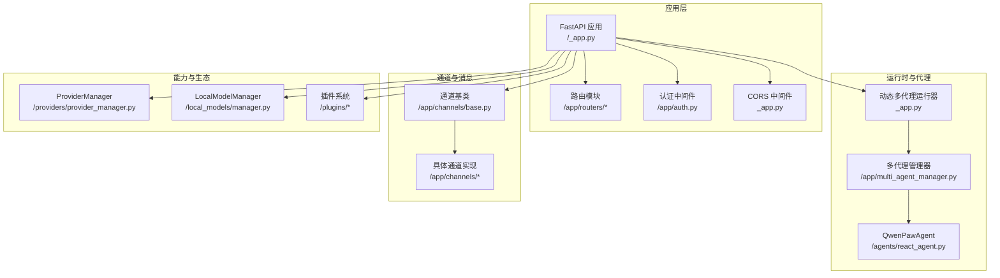
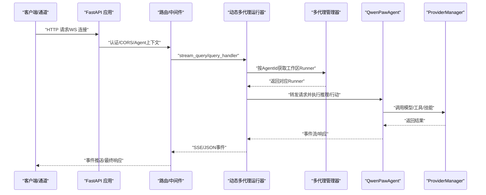
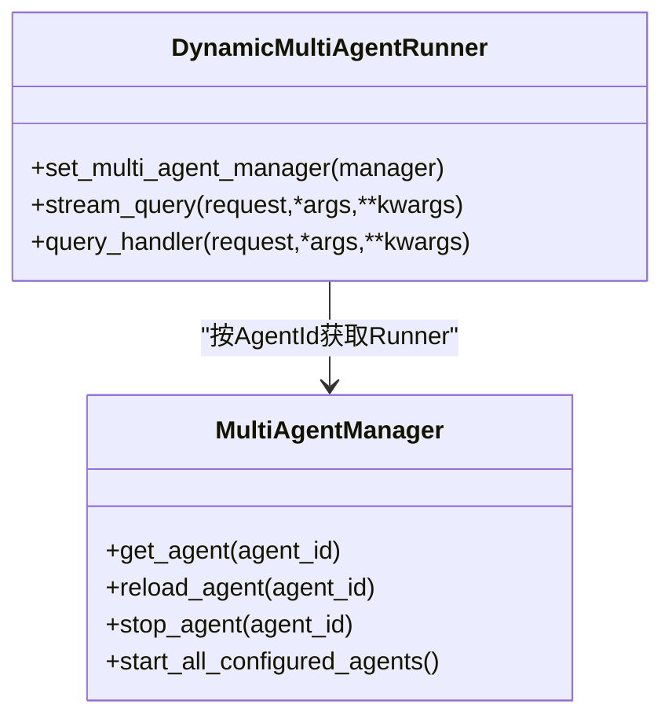
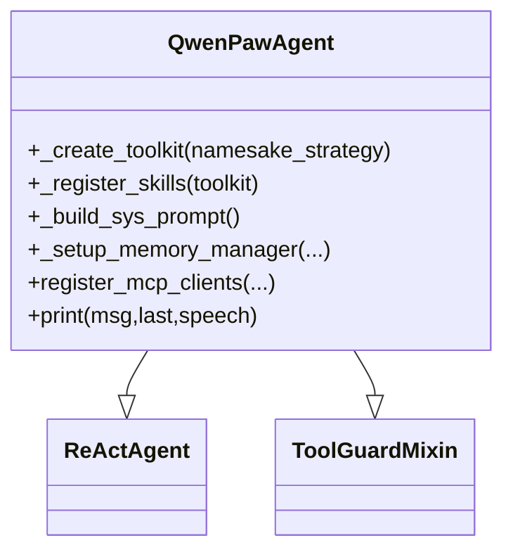
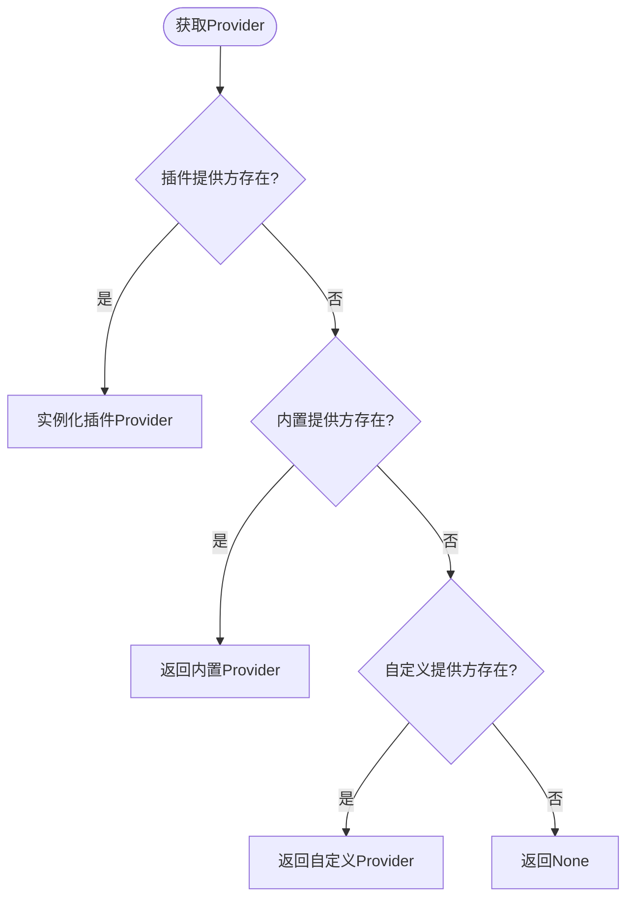
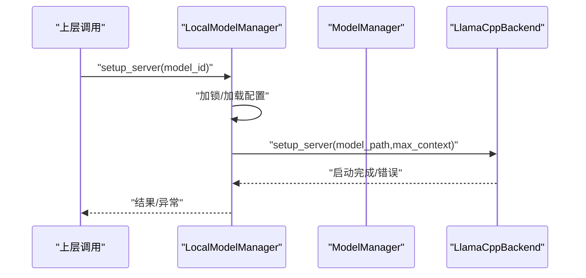
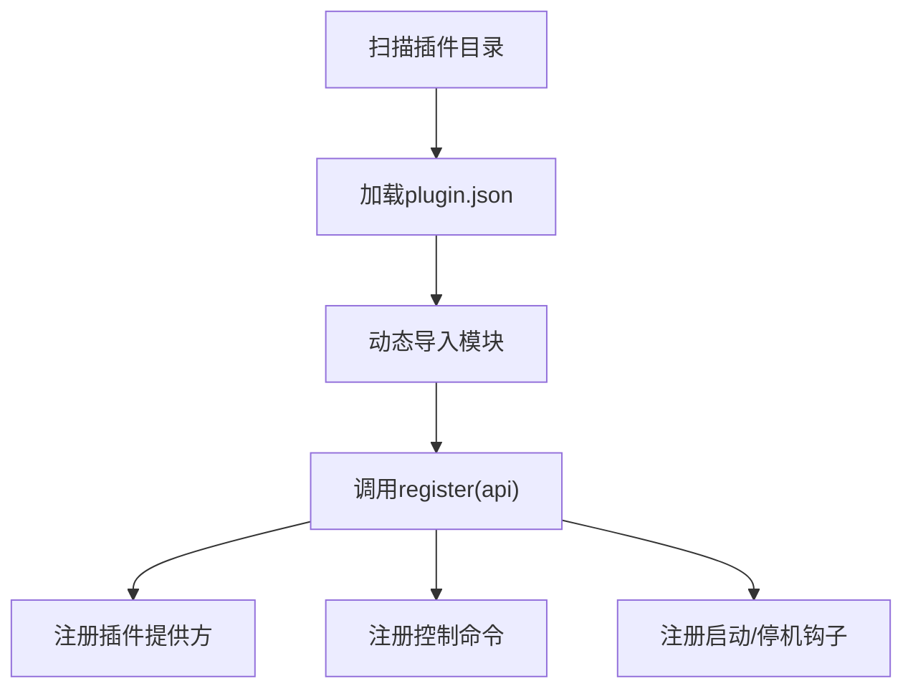
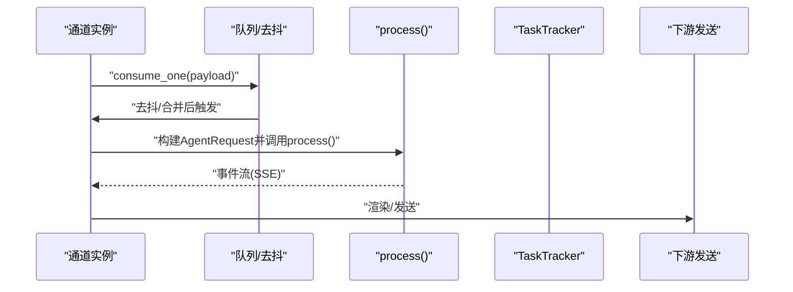
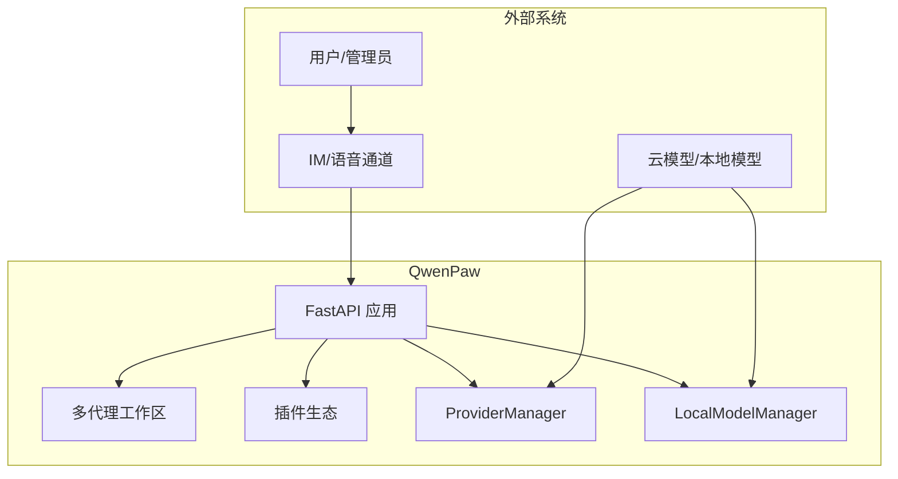

# 核心架构

<cite>
**本文引用的文件**
- [src\qwenpaw\app\_app.py](file://src\qwenpaw\app\_app.py)
- [src\qwenpaw\agents\react_agent.py](file://src\qwenpaw\agents\react_agent.py)
- [src\qwenpaw\app\multi_agent_manager.py](file://src\qwenpaw\app\multi_agent_manager.py)
- [src\qwenpaw\app\routers\agent.py](file://src\qwenpaw\app\routers\agent.py)
- [src\qwenpaw\providers\provider_manager.py](file://src\qwenpaw\providers\provider_manager.py)
- [src\qwenpaw\local_models\manager.py](file://src\qwenpaw\local_models\manager.py)
- [src\qwenpaw\plugins\architecture.py](file://src\qwenpaw\plugins\architecture.py)
- [src\qwenpaw\plugins\loader.py](file://src\qwenpaw\plugins\loader.py)
- [src\qwenpaw\constant.py](file://src\qwenpaw\constant.py)
- [src\qwenpaw\app\channels\base.py](file://src\qwenpaw\app\channels\base.py)
- [pyproject.toml](file://pyproject.toml)
- [README.md](file://README.md)
</cite>

## 目录
1. [引言](#引言)
2. [项目结构](#项目结构)
3. [核心组件](#核心组件)
4. [架构总览](#架构总览)
5. [详细组件分析](#详细组件分析)
6. [依赖分析](#依赖分析)
7. [性能考量](#性能考量)
8. [故障排查指南](#故障排查指南)
9. [结论](#结论)
10. [附录](#附录)

## 引言
本文件面向QwenPaw项目的架构与实现，聚焦于高层设计与架构模式，包括分层架构、微服务化（以多代理为中心）、插件化扩展、ReAct推理范式、事件驱动与中介者模式的应用。文档还涵盖数据流、控制流、安全与可观测性、部署拓扑与可扩展性建议，并给出系统上下文与组件分解图示。

## 项目结构
QwenPaw采用“后端服务 + 多代理工作区 + 插件生态”的整体布局：
- 后端服务：基于FastAPI，统一暴露REST与SSE接口，承载认证、路由、通道接入、任务跟踪与生命周期管理。
- 多代理工作区：每个Agent拥有独立的工作空间（配置、技能、内存、会话），通过多代理管理器集中编排。
- 插件系统：动态加载插件，注册提供方、控制命令与启动/停机钩子，实现能力扩展与即插即用。
- 通道体系：抽象统一的消息通道基类，支持多平台渠道（DingTalk、Feishu、Discord、Telegram等）。
- 提供方与本地模型：统一的ProviderManager与LocalModelManager，支撑云模型与本地模型（llama.cpp/Ollama/LM Studio）。

图表来源
- [src\qwenpaw\app\_app.py:424-569](file://src\qwenpaw\app\_app.py#L424-L569)
- [src\qwenpaw\app\multi_agent_manager.py:21-470](file://src\qwenpaw\app\multi_agent_manager.py#L21-L470)
- [src\qwenpaw\agents\react_agent.py:69-182](file://src\qwenpaw\agents\react_agent.py#L69-L182)
- [src\qwenpaw\app\channels\base.py:70-120](file://src\qwenpaw\app\channels\base.py#L70-L120)
- [src\qwenpaw\providers\provider_manager.py:670-800](file://src\qwenpaw\providers\provider_manager.py#L670-L800)
- [src\qwenpaw\local_models\manager.py:33-229](file://src\qwenpaw\local_models\manager.py#L33-L229)
- [src\qwenpaw\plugins\loader.py:19-241](file://src\qwenpaw\plugins\loader.py#L19-L241)

章节来源
- [src\qwenpaw\app\_app.py:424-569](file://src\qwenpaw\app\_app.py#L424-L569)
- [src\qwenpaw\constant.py:89-218](file://src\qwenpaw\constant.py#L89-L218)

## 核心组件
- 动态多代理运行器：根据请求中的Agent标识动态路由到对应工作区的Runner，实现多代理共享同一进程内的隔离执行。
- 多代理管理器：负责工作区的懒加载、零停机热重载、并发安全与资源回收。
- QwenPawAgent：基于ReActAgent的智能体，内置工具集、技能注册、记忆管理与引导钩子。
- ProviderManager：统一管理内置/自定义/插件提供方，屏蔽底层差异，支持并发查询与信息缓存。
- LocalModelManager：封装本地模型下载、服务器生命周期与配置持久化。
- 插件系统：发现/加载插件，注册提供方、控制命令与启动/停机钩子。
- 通道基类与具体通道：统一消息格式与处理流程，支持去抖、合并、策略过滤与渲染。
- 路由与控制：Agent相关文件/语言/音频模式等配置的读写接口。

章节来源
- [src\qwenpaw\app\_app.py:64-151](file://src\qwenpaw\app\_app.py#L64-L151)
- [src\qwenpaw\app\multi_agent_manager.py:21-120](file://src\qwenpaw\app\multi_agent_manager.py#L21-L120)
- [src\qwenpaw\agents\react_agent.py:69-182](file://src\qwenpaw\agents\react_agent.py#L69-L182)
- [src\qwenpaw\providers\provider_manager.py:670-800](file://src\qwenpaw\providers\provider_manager.py#L670-L800)
- [src\qwenpaw\local_models\manager.py:33-120](file://src\qwenpaw\local_models\manager.py#L33-L120)
- [src\qwenpaw\plugins\loader.py:19-120](file://src\qwenpaw\plugins\loader.py#L19-L120)
- [src\qwenpaw\app\channels\base.py:70-120](file://src\qwenpaw\app\channels\base.py#L70-L120)
- [src\qwenpaw\app\routers\agent.py:22-120](file://src\qwenpaw\app\routers\agent.py#L22-L120)

## 架构总览
QwenPaw采用“单体后端 + 多代理工作区 + 插件生态”的混合架构：
- 分层架构：表现层（FastAPI）、业务层（多代理/通道/提供方）、基础设施层（本地模型/密钥存储/日志）。
- 微服务化思路：以“多代理”为服务边界，共享同一进程，通过动态路由与工作区隔离实现近似微服务的弹性与隔离。
- 插件化：在启动阶段扫描用户插件目录，加载插件并注册提供方与控制命令，实现能力即插即用。
- ReAct与事件驱动：智能体遵循ReAct范式进行推理与行动；通道与任务跟踪采用事件驱动与SSE推送。
- 中介者模式：认证、CORS、Agent上下文中间件作为横切关注点，集中处理跨域、鉴权与代理上下文注入。

图表来源
- [src\qwenpaw\app\_app.py:64-151](file://src\qwenpaw\app\_app.py#L64-L151)
- [src\qwenpaw\app\multi_agent_manager.py:38-90](file://src\qwenpaw\app\multi_agent_manager.py#L38-L90)
- [src\qwenpaw\agents\react_agent.py:69-182](file://src\qwenpaw\agents\react_agent.py#L69-L182)
- [src\qwenpaw\providers\provider_manager.py:736-751](file://src\qwenpaw\providers\provider_manager.py#L736-L751)

## 详细组件分析

### 组件A：动态多代理运行器与多代理管理器
- 动态多代理运行器：根据请求头或上下文解析当前AgentId，从多代理管理器中获取对应工作区Runner，再将请求委派给该Runner，实现按需路由与隔离。
- 多代理管理器：支持懒加载、零停机热重载（新实例预热后原子替换旧实例，后台优雅清理）、并发安全与资源回收；提供批量启动已启用代理的能力。

图表来源
- [src\qwenpaw\app\_app.py:64-151](file://src\qwenpaw\app\_app.py#L64-L151)
- [src\qwenpaw\app\multi_agent_manager.py:21-120](file://src\qwenpaw\app\multi_agent_manager.py#L21-L120)

章节来源
- [src\qwenpaw\app\_app.py:64-151](file://src\qwenpaw\app\_app.py#L64-L151)
- [src\qwenpaw\app\multi_agent_manager.py:21-120](file://src\qwenpaw\app\multi_agent_manager.py#L21-L120)

### 组件B：QwenPawAgent（ReAct智能体）
- 基于ReActAgent，集成工具集（文件、终端、浏览器、截图、媒体查看等）、动态技能加载、记忆管理与引导钩子。
- 支持MCP客户端注册与恢复，具备多模态能力感知与媒体块主动/被动过滤机制，保障与不同模型的兼容性。
- 工具守卫与命令处理：通过混入类拦截危险工具调用，内置/system命令处理（如compact、new等）。

图表来源
- [src\qwenpaw\agents\react_agent.py:69-182](file://src\qwenpaw\agents\react_agent.py#L69-L182)

章节来源
- [src\qwenpaw\agents\react_agent.py:69-182](file://src\qwenpaw\agents\react_agent.py#L69-L182)

### 组件C：ProviderManager（模型提供方管理）
- 管理内置/自定义/插件提供方，统一信息查询与实例化；支持并发获取信息、默认注解与历史迁移。
- 提供标准化的ProviderInfo输出，便于前端展示与选择。

图表来源
- [src\qwenpaw\providers\provider_manager.py:770-786](file://src\qwenpaw\providers\provider_manager.py#L770-L786)

章节来源
- [src\qwenpaw\providers\provider_manager.py:770-786](file://src\qwenpaw\providers\provider_manager.py#L770-L786)

### 组件D：LocalModelManager（本地模型）
- 封装llama.cpp下载、服务器生命周期与配置持久化；提供推荐模型列表、下载进度与状态查询。
- 通过锁保证服务器启停的原子性与线程安全。

图表来源
- [src\qwenpaw\local_models\manager.py:200-229](file://src\qwenpaw\local_models\manager.py#L200-L229)

章节来源
- [src\qwenpaw\local_models\manager.py:33-120](file://src\qwenpaw\local_models\manager.py#L33-L120)

### 组件E：插件系统（发现/加载/注册）
- 发现：扫描用户插件目录，读取plugin.json生成清单。
- 加载：动态导入插件模块，调用register(api)，支持同步/异步回调。
- 注册：向插件注册表登记提供方、控制命令与钩子；设置运行时助手，注入ProviderManager。

图表来源
- [src\qwenpaw\plugins\loader.py:32-120](file://src\qwenpaw\plugins\loader.py#L32-L120)
- [src\qwenpaw\plugins\architecture.py:9-55](file://src\qwenpaw\plugins\architecture.py#L9-L55)

章节来源
- [src\qwenpaw\plugins\loader.py:19-120](file://src\qwenpaw\plugins\loader.py#L19-L120)
- [src\qwenpaw\plugins\architecture.py:9-55](file://src\qwenpaw\plugins\architecture.py#L9-L55)

### 组件F：通道基类与消息处理
- 统一内容类型与消息渲染风格，支持去抖、合并、策略过滤与渲染样式。
- 通过队列与任务跟踪实现并发控制与取消；支持会话级隔离与命令检测。

图表来源
- [src\qwenpaw\app\channels\base.py:659-800](file://src\qwenpaw\app\channels\base.py#L659-L800)

章节来源
- [src\qwenpaw\app\channels\base.py:70-120](file://src\qwenpaw\app\channels\base.py#L70-L120)

### 组件G：Agent相关API（文件/语言/音频模式）
- 提供Agent工作区文件读写、内存文件管理、语言切换、音频模式与转录提供方配置等接口。
- 支持热重载配置并触发Agent内部刷新。

章节来源
- [src\qwenpaw\app\routers\agent.py:22-120](file://src\qwenpaw\app\routers\agent.py#L22-L120)

## 依赖分析
- 技术栈与版本约束：后端基于FastAPI与uvicorn；通道SDK覆盖主流IM平台；本地模型支持llama.cpp/Ollama/LM Studio；依赖版本在pyproject.toml中声明。
- 关键外部依赖：agentscope、agentscope-runtime、playwright、discord-py、python-telegram-bot、twilio、paho-mqtt、google-genai、transformers、onnxruntime等。
- 可选依赖：llamacpp、mlx、ollama、whisper等，按需安装。

章节来源
- [pyproject.toml:1-111](file://pyproject.toml#L1-L111)
- [README.md:332-344](file://README.md#L332-L344)

## 性能考量
- 并发与限流：通过环境变量控制最大并发、QPM与退避参数，避免上游限流导致的阻塞风暴。
- 零停机热重载：新实例预热完成后原子替换旧实例，后台清理旧实例，确保服务连续性。
- 本地模型优化：服务器启停加锁、下载进度与状态查询、上下文长度配置持久化，减少冷启动与IO开销。
- 通道去抖与合并：对无文本消息进行缓冲合并，降低下游压力与重复渲染成本。

章节来源
- [src\qwenpaw\constant.py:220-282](file://src\qwenpaw\constant.py#L220-L282)
- [src\qwenpaw\app\multi_agent_manager.py:208-320](file://src\qwenpaw\app\multi_agent_manager.py#L208-L320)
- [src\qwenpaw\local_models\manager.py:105-120](file://src\qwenpaw\local_models\manager.py#L105-L120)
- [src\qwenpaw\app\channels\base.py:250-282](file://src\qwenpaw\app\channels\base.py#L250-L282)

## 故障排查指南
- 启动失败：检查日志级别与工作目录权限；确认.env与配置文件路径；查看ProviderManager初始化与本地模型服务器状态。
- 多代理问题：核对AgentId是否存在于配置；使用reload_agent进行零停机重载；检查TaskTracker是否有活跃任务导致延迟清理。
- 通道异常：确认去抖/合并逻辑是否正确；检查会话ID解析与命令检测；验证渲染样式与过滤策略。
- 插件问题：检查plugin.json完整性与入口模块导出；查看注册过程中的异常堆栈；确认控制命令优先级与冲突。
- 安全与合规：工具守卫拦截危险命令；文件访问限制；技能扫描规则库更新；Web认证开关。

章节来源
- [src\qwenpaw\app\_app.py:166-422](file://src\qwenpaw\app\_app.py#L166-L422)
- [src\qwenpaw\app\multi_agent_manager.py:321-370](file://src\qwenpaw\app\multi_agent_manager.py#L321-L370)
- [src\qwenpaw\plugins\loader.py:120-241](file://src\qwenpaw\plugins\loader.py#L120-L241)

## 结论
QwenPaw通过“单体后端 + 多代理工作区 + 插件生态”的架构，在保持部署简洁的同时实现了高度可扩展与可演进。ReAct范式与事件驱动结合，使智能体与通道协同高效；ProviderManager与LocalModelManager统一了模型能力；插件系统则提供了开放的扩展面。在安全、可观测性与可运维性方面，项目提供了完善的中间件、日志与遥测机制，适合在本地或云端稳定运行。

## 附录
- 系统上下文图（概念性）

- 部署拓扑建议
  - 单机部署：容器内运行，挂载工作目录与密钥目录；通过反向代理暴露Console与API。
  - 多实例部署：以多代理为单位拆分（若需要强隔离），共享ProviderManager与本地模型服务。
  - 本地模型：优先使用Ollama/LM Studio；llama.cpp用于轻量场景；注意端口映射与宿主机网络可达性。
  - 安全加固：启用Web认证、最小权限原则、密钥加密存储、技能扫描与工具守卫。

- 横切关注点
  - 安全：工具守卫、文件访问控制、技能扫描、密钥存储加密。
  - 监控：日志分级、SSE事件追踪、任务跟踪、遥测上报。
  - 灾难恢复：零停机热重载、后台清理任务、优雅关闭流程、备份工作目录与密钥目录。