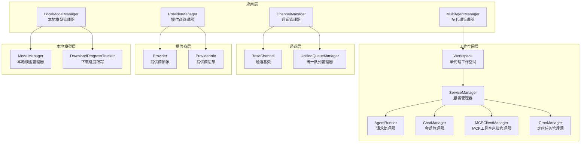
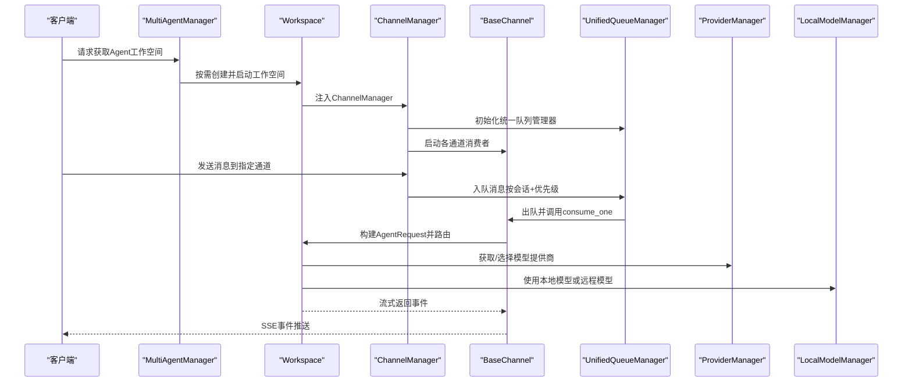
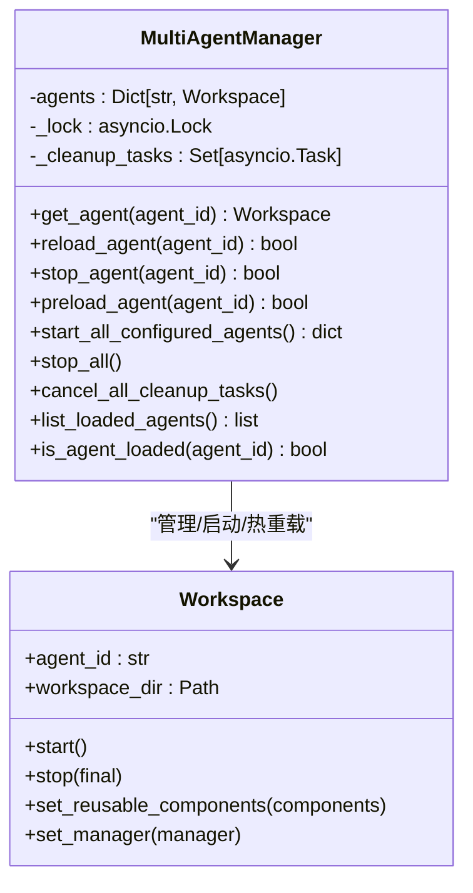
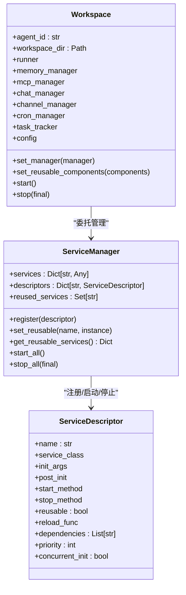
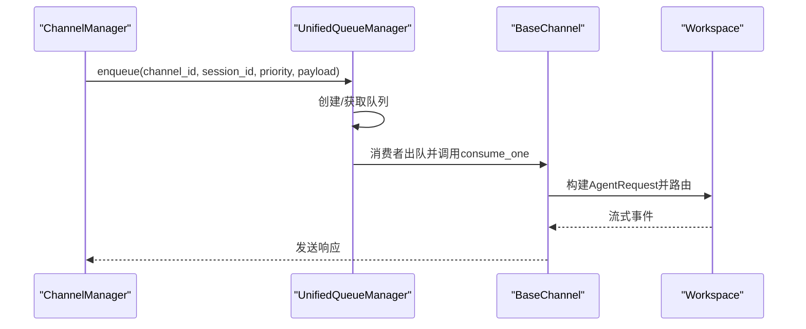
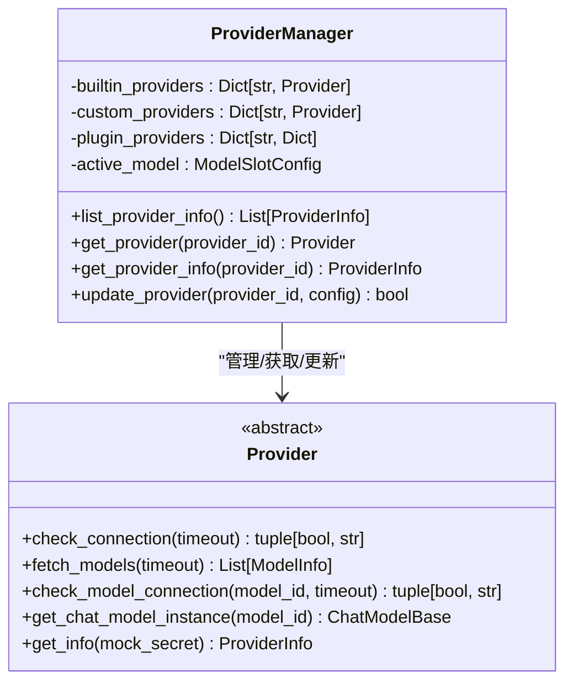
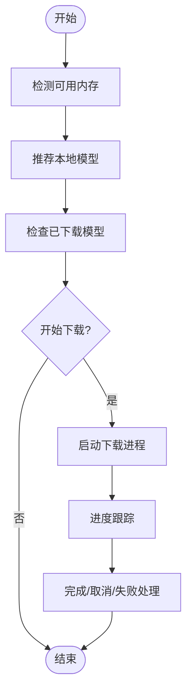
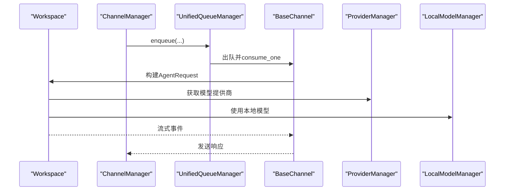
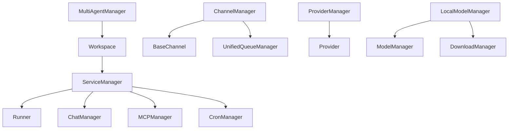

# 核心组件关系

<cite>
**本文档引用的文件**
- [multi_agent_manager.py](file://src/qwenpaw/app/multi_agent_manager.py)
- [workspace.py](file://src/qwenpaw/app/workspace/workspace.py)
- [service_manager.py](file://src/qwenpaw/app/workspace/service_manager.py)
- [service_factories.py](file://src/qwenpaw/app/workspace/service_factories.py)
- [provider_manager.py](file://src/qwenpaw/providers/provider_manager.py)
- [provider.py](file://src/qwenpaw/providers/provider.py)
- [model_manager.py](file://src/qwenpaw/local_models/model_manager.py)
- [download_manager.py](file://src/qwenpaw/local_models/download_manager.py)
- [manager.py](file://src/qwenpaw/app/channels/manager.py)
- [base.py](file://src/qwenpaw/app/channels/base.py)
- [unified_queue_manager.py](file://src/qwenpaw/app/channels/unified_queue_manager.py)
- [agent_context.py](file://src/qwenpaw/app/agent_context.py)
</cite>

## 目录
1. [引言](#引言)
2. [项目结构](#项目结构)
3. [核心组件](#核心组件)
4. [架构总览](#架构总览)
5. [详细组件分析](#详细组件分析)
6. [依赖关系分析](#依赖关系分析)
7. [性能考虑](#性能考虑)
8. [故障排除指南](#故障排除指南)
9. [结论](#结论)

## 引言
本文件聚焦于QwenPaw的核心组件关系，深入解析MultiAgentManager、ProviderManager、LocalModelManager与ChannelManager之间的交互机制。内容涵盖依赖注入、事件传递、状态同步、生命周期管理、资源共享与协调机制，并给出组件接口设计、消息传递协议与错误处理策略。同时提供组件关系图、交互时序图与数据流向图，说明解耦设计、扩展点与插件化支持，并通过具体代码路径示例展示协作模式与最佳实践。

## 项目结构
QwenPaw采用“工作空间（Workspace）+ 多代理管理（MultiAgentManager）+ 通道管理（ChannelManager）+ 提供商管理（ProviderManager）+ 本地模型管理（LocalModelManager）”的分层架构。每个Agent在独立的Workspace中运行，内部通过ServiceManager统一注册与生命周期管理各子系统；ChannelManager负责多渠道消息入队与消费；ProviderManager负责模型提供商的统一接入与配置；LocalModelManager负责本地模型下载与运行时管理。

**图表来源**
- [multi_agent_manager.py:21-470](file://src/qwenpaw/app/multi_agent_manager.py#L21-L470)
- [workspace.py:47-389](file://src/qwenpaw/app/workspace/workspace.py#L47-L389)
- [service_manager.py:74-421](file://src/qwenpaw/app/workspace/service_manager.py#L74-L421)
- [manager.py:68-711](file://src/qwenpaw/app/channels/manager.py#L68-L711)
- [provider_manager.py:670-800](file://src/qwenpaw/providers/provider_manager.py#L670-L800)
- [model_manager.py:63-654](file://src/qwenpaw/local_models/model_manager.py#L63-L654)

**章节来源**
- [multi_agent_manager.py:21-470](file://src/qwenpaw/app/multi_agent_manager.py#L21-L470)
- [workspace.py:47-389](file://src/qwenpaw/app/workspace/workspace.py#L47-L389)
- [service_manager.py:74-421](file://src/qwenpaw/app/workspace/service_manager.py#L74-L421)
- [manager.py:68-711](file://src/qwenpaw/app/channels/manager.py#L68-L711)
- [provider_manager.py:670-800](file://src/qwenpaw/providers/provider_manager.py#L670-L800)
- [model_manager.py:63-654](file://src/qwenpaw/local_models/model_manager.py#L63-L654)

## 核心组件
- MultiAgentManager：集中管理多个Agent的工作空间，支持延迟加载、生命周期管理、零停机热重载与后台清理任务。
- Workspace：单个Agent的完整运行时环境，包含Runner、ChannelManager、MemoryManager、MCPClientManager、CronManager等，通过ServiceManager统一注册与启动。
- ChannelManager：统一的通道入口，基于UnifiedQueueManager实现按会话与优先级隔离的消息队列，支持批量合并与去抖动。
- ProviderManager：统一管理内置与自定义提供商，提供提供商列表、连接性检查、模型发现与配置更新能力。
- LocalModelManager：负责本地模型的推荐、下载、进度跟踪与运行时服务器管理。

**章节来源**
- [multi_agent_manager.py:21-470](file://src/qwenpaw/app/multi_agent_manager.py#L21-L470)
- [workspace.py:47-389](file://src/qwenpaw/app/workspace/workspace.py#L47-L389)
- [manager.py:68-711](file://src/qwenpaw/app/channels/manager.py#L68-L711)
- [provider_manager.py:670-800](file://src/qwenpaw/providers/provider_manager.py#L670-L800)
- [model_manager.py:63-654](file://src/qwenpaw/local_models/model_manager.py#L63-L654)

## 架构总览
下图展示了MultiAgentManager、Workspace、ChannelManager、ProviderManager与LocalModelManager之间的高层交互关系与数据流。

**图表来源**
- [multi_agent_manager.py:38-90](file://src/qwenpaw/app/multi_agent_manager.py#L38-L90)
- [workspace.py:322-380](file://src/qwenpaw/app/workspace/workspace.py#L322-L380)
- [manager.py:447-526](file://src/qwenpaw/app/channels/manager.py#L447-L526)
- [base.py:759-800](file://src/qwenpaw/app/channels/base.py#L759-L800)
- [unified_queue_manager.py:119-170](file://src/qwenpaw/app/channels/unified_queue_manager.py#L119-L170)
- [provider_manager.py:770-790](file://src/qwenpaw/providers/provider_manager.py#L770-L790)
- [model_manager.py:181-263](file://src/qwenpaw/local_models/model_manager.py#L181-L263)

## 详细组件分析

### MultiAgentManager 分析
MultiAgentManager负责多Agent工作空间的集中管理，具备以下关键特性：
- 延迟加载：首次访问时才创建并启动Workspace。
- 生命周期管理：支持停止、重启与零停机热重载。
- 零停机热重载：新实例先启动，再原子替换旧实例，后台异步清理旧实例。
- 资源共享：在reload过程中可将可复用组件（如MemoryManager、ChatManager）从旧实例转移到新实例。
- 并发启动：根据配置并发启动已启用的Agent。

**图表来源**
- [multi_agent_manager.py:21-470](file://src/qwenpaw/app/multi_agent_manager.py#L21-L470)
- [workspace.py:47-389](file://src/qwenpaw/app/workspace/workspace.py#L47-L389)

**章节来源**
- [multi_agent_manager.py:21-470](file://src/qwenpaw/app/multi_agent_manager.py#L21-L470)
- [workspace.py:290-380](file://src/qwenpaw/app/workspace/workspace.py#L290-L380)

### Workspace 与 ServiceManager 分析
Workspace是单Agent的完整运行时容器，通过ServiceManager进行服务注册与生命周期管理：
- 服务注册：使用ServiceDescriptor声明式注册Runner、MemoryManager、MCPClientManager、ChatManager、ChannelManager、CronManager等。
- 启动顺序：按优先级分组并发启动，部分服务串行启动以满足依赖。
- 可复用组件：支持在热重载时保留MemoryManager、ChatManager等可复用组件。
- 统一停止：根据是否final决定是否停止可复用组件。

**图表来源**
- [workspace.py:47-389](file://src/qwenpaw/app/workspace/workspace.py#L47-L389)
- [service_manager.py:74-421](file://src/qwenpaw/app/workspace/service_manager.py#L74-L421)

**章节来源**
- [workspace.py:142-389](file://src/qwenpaw/app/workspace/workspace.py#L142-L389)
- [service_manager.py:92-421](file://src/qwenpaw/app/workspace/service_manager.py#L92-L421)

### ChannelManager 与 UnifiedQueueManager 分析
ChannelManager负责通道的统一入口与消息路由，结合UnifiedQueueManager实现：
- 统一队列：按(channel_id, session_id, priority_level)隔离队列，动态创建消费者。
- 批量合并：同队列内消息进行批量合并与去抖动处理。
- 优先级控制：通过CommandRegistry提取查询文本进行命令识别与优先级分类。
- 空闲清理：定期清理空闲队列，避免资源泄露。

**图表来源**
- [manager.py:255-446](file://src/qwenpaw/app/channels/manager.py#L255-L446)
- [unified_queue_manager.py:119-170](file://src/qwenpaw/app/channels/unified_queue_manager.py#L119-L170)
- [base.py:759-800](file://src/qwenpaw/app/channels/base.py#L759-L800)

**章节来源**
- [manager.py:68-711](file://src/qwenpaw/app/channels/manager.py#L68-L711)
- [unified_queue_manager.py:60-170](file://src/qwenpaw/app/channels/unified_queue_manager.py#L60-L170)
- [base.py:759-800](file://src/qwenpaw/app/channels/base.py#L759-L800)

### ProviderManager 分析
ProviderManager统一管理内置与自定义提供商，提供：
- 提供商注册：内置提供商初始化与迁移。
- 动态获取：根据ID获取Provider实例，支持插件提供商直接返回ProviderInfo。
- 连接性与模型发现：支持连接检查与模型列表获取。
- 配置更新：支持更新提供商配置并持久化。

**图表来源**
- [provider_manager.py:670-800](file://src/qwenpaw/providers/provider_manager.py#L670-L800)
- [provider.py:111-314](file://src/qwenpaw/providers/provider.py#L111-L314)

**章节来源**
- [provider_manager.py:670-800](file://src/qwenpaw/providers/provider_manager.py#L670-L800)
- [provider.py:111-314](file://src/qwenpaw/providers/provider.py#L111-L314)

### LocalModelManager 分析
LocalModelManager负责本地模型的下载与运行时管理：
- 推荐模型：根据机器内存容量推荐适合的模型。
- 下载管理：使用进程隔离的下载控制器，支持进度跟踪、取消与完成回调。
- 本地存储：模型文件按仓库目录结构存放，支持检测与清理。
- 运行时集成：与ProviderManager配合，为本地模型提供运行时支持。

**图表来源**
- [model_manager.py:78-135](file://src/qwenpaw/local_models/model_manager.py#L78-L135)
- [download_manager.py:368-599](file://src/qwenpaw/local_models/download_manager.py#L368-L599)

**章节来源**
- [model_manager.py:63-654](file://src/qwenpaw/local_models/model_manager.py#L63-L654)
- [download_manager.py:198-599](file://src/qwenpaw/local_models/download_manager.py#L198-L599)

### 组件间依赖注入与事件传递
- 依赖注入：Workspace通过ServiceManager注入Runner、ChatManager、ChannelManager等；ChannelManager通过set_workspace注入Workspace与CommandRegistry；MultiAgentManager通过set_manager注入自身。
- 事件传递：ChannelManager通过UnifiedQueueManager将消息路由至BaseChannel，BaseChannel构建AgentRequest后交由Workspace的Runner处理，Runner再与ProviderManager、LocalModelManager协作，最终通过SSE事件回传给客户端。

**图表来源**
- [workspace.py:131-141](file://src/qwenpaw/app/workspace/workspace.py#L131-L141)
- [manager.py:534-545](file://src/qwenpaw/app/channels/manager.py#L534-L545)
- [base.py:431-536](file://src/qwenpaw/app/channels/base.py#L431-L536)
- [provider_manager.py:770-790](file://src/qwenpaw/providers/provider_manager.py#L770-L790)
- [model_manager.py:181-263](file://src/qwenpaw/local_models/model_manager.py#L181-L263)

**章节来源**
- [workspace.py:131-141](file://src/qwenpaw/app/workspace/workspace.py#L131-L141)
- [manager.py:534-545](file://src/qwenpaw/app/channels/manager.py#L534-L545)
- [base.py:431-536](file://src/qwenpaw/app/channels/base.py#L431-L536)

### 生命周期管理与状态同步
- 生命周期：MultiAgentManager负责Agent实例的创建、启动、停止与热重载；Workspace负责内部服务的启动与停止；ChannelManager负责通道的启动与停止；ProviderManager与LocalModelManager分别负责提供商与本地模型的生命周期。
- 状态同步：MultiAgentManager在reload过程中通过原子交换与后台清理任务确保状态一致性；ChannelManager通过队列与消费者任务实现消息状态的同步；Workspace通过ServiceManager在热重载时转移可复用组件的状态。

**章节来源**
- [multi_agent_manager.py:91-187](file://src/qwenpaw/app/multi_agent_manager.py#L91-L187)
- [workspace.py:322-380](file://src/qwenpaw/app/workspace/workspace.py#L322-L380)
- [service_manager.py:330-421](file://src/qwenpaw/app/workspace/service_manager.py#L330-L421)

### 接口设计、消息协议与错误处理
- 接口设计：ProviderManager提供统一的Provider接口；ChannelManager通过BaseChannel抽象不同通道；Workspace通过ServiceDescriptor声明式注册服务。
- 消息协议：BaseChannel定义消息内容类型（文本、图片、音频、视频、文件、拒绝），并通过SSE事件流返回结果。
- 错误处理：MultiAgentManager在热重载失败时记录警告并保持新实例可用；ChannelManager在enqueue超时时记录日志；ProviderManager在连接检查失败时返回错误信息；LocalModelManager在下载失败时清理临时目录并记录异常。

**章节来源**
- [provider.py:111-314](file://src/qwenpaw/providers/provider.py#L111-L314)
- [base.py:24-67](file://src/qwenpaw/app/channels/base.py#L24-L67)
- [manager.py:302-348](file://src/qwenpaw/app/channels/manager.py#L302-L348)
- [multi_agent_manager.py:87-90](file://src/qwenpaw/app/multi_agent_manager.py#L87-L90)
- [download_manager.py:449-537](file://src/qwenpaw/local_models/download_manager.py#L449-L537)

### 解耦设计、扩展点与插件化支持
- 解耦设计：MultiAgentManager与Workspace通过接口解耦；ChannelManager与BaseChannel通过统一队列解耦；ProviderManager与Provider通过抽象接口解耦；LocalModelManager与下载控制器通过进程隔离解耦。
- 扩展点：ProviderManager支持自定义提供商与插件提供商；ChannelManager支持动态替换通道；Workspace支持可复用服务与后置初始化钩子；ServiceManager支持声明式服务注册与依赖管理。
- 插件化支持：ProviderManager支持插件提供商直接返回ProviderInfo；ChannelManager支持动态通道替换；ServiceManager支持条件服务注册（如Agent Config Watcher、MCP Config Watcher）。

**章节来源**
- [provider_manager.py:770-800](file://src/qwenpaw/providers/provider_manager.py#L770-L800)
- [manager.py:571-630](file://src/qwenpaw/app/channels/manager.py#L571-L630)
- [service_manager.py:92-105](file://src/qwenpaw/app/workspace/service_manager.py#L92-L105)
- [workspace.py:264-288](file://src/qwenpaw/app/workspace/workspace.py#L264-L288)

### 协作模式与最佳实践
- 多Agent协作：通过MultiAgentManager集中管理，按需延迟加载，支持零停机热重载。
- 通道消息处理：通过ChannelManager与UnifiedQueueManager实现高吞吐、低延迟的消息处理与去抖动。
- 提供商与模型：通过ProviderManager统一管理提供商，结合LocalModelManager实现本地模型的高效下载与运行。
- 最佳实践：在热重载前预置可复用组件；在ChannelManager中合理设置优先级与去抖动参数；在Workspace中按优先级分组启动服务；在ProviderManager中定期检查连接与模型可用性。

**章节来源**
- [multi_agent_manager.py:208-320](file://src/qwenpaw/app/multi_agent_manager.py#L208-L320)
- [manager.py:255-446](file://src/qwenpaw/app/channels/manager.py#L255-L446)
- [provider_manager.py:770-790](file://src/qwenpaw/providers/provider_manager.py#L770-L790)
- [workspace.py:142-288](file://src/qwenpaw/app/workspace/workspace.py#L142-L288)

## 依赖关系分析
MultiAgentManager、Workspace、ChannelManager、ProviderManager与LocalModelManager之间存在清晰的依赖关系：
- MultiAgentManager依赖Workspace进行Agent实例管理。
- Workspace依赖ServiceManager进行服务注册与生命周期管理。
- ChannelManager依赖BaseChannel与UnifiedQueueManager进行消息路由与消费。
- ProviderManager依赖Provider抽象进行提供商管理。
- LocalModelManager依赖ModelManager与DownloadManager进行模型下载与进度跟踪。

**图表来源**
- [multi_agent_manager.py:21-470](file://src/qwenpaw/app/multi_agent_manager.py#L21-L470)
- [workspace.py:47-389](file://src/qwenpaw/app/workspace/workspace.py#L47-L389)
- [service_manager.py:74-421](file://src/qwenpaw/app/workspace/service_manager.py#L74-L421)
- [manager.py:68-711](file://src/qwenpaw/app/channels/manager.py#L68-L711)
- [provider_manager.py:670-800](file://src/qwenpaw/providers/provider_manager.py#L670-L800)
- [model_manager.py:63-654](file://src/qwenpaw/local_models/model_manager.py#L63-L654)

**章节来源**
- [multi_agent_manager.py:21-470](file://src/qwenpaw/app/multi_agent_manager.py#L21-L470)
- [workspace.py:47-389](file://src/qwenpaw/app/workspace/workspace.py#L47-L389)
- [service_manager.py:74-421](file://src/qwenpaw/app/workspace/service_manager.py#L74-L421)
- [manager.py:68-711](file://src/qwenpaw/app/channels/manager.py#L68-L711)
- [provider_manager.py:670-800](file://src/qwenpaw/providers/provider_manager.py#L670-L800)
- [model_manager.py:63-654](file://src/qwenpaw/local_models/model_manager.py#L63-L654)

## 性能考虑
- 并发与异步：MultiAgentManager与ChannelManager广泛使用asyncio锁与并发任务，减少阻塞时间。
- 零停机热重载：通过新旧实例并行启动与原子替换，最小化服务中断时间。
- 队列隔离与批处理：UnifiedQueueManager按会话与优先级隔离队列，减少上下文切换；批量合并降低网络与CPU开销。
- 进程隔离下载：LocalModelManager使用独立进程执行下载，避免阻塞主事件循环。
- 资源清理：MultiAgentManager在关闭时取消后台清理任务并等待完成，防止资源泄露。

[本节为通用指导，无需特定文件引用]

## 故障排除指南
- Agent未找到或禁用：通过agent_context获取当前Agent时，若Agent不存在或被禁用，将抛出HTTP 404/403错误。请检查配置中的agents.profiles与enabled字段。
- MultiAgentManager未初始化：当请求中未找到MultiAgentManager实例时，将返回HTTP 500错误。请确认应用状态中已正确初始化MultiAgentManager。
- ChannelManager队列未初始化：enqueue时若未初始化队列管理器，将记录警告并忽略消息。请确保在start_all后调用enqueue。
- ProviderManager连接检查失败：ProviderManager在连接检查失败时返回错误信息，请检查API密钥与网络连通性。
- LocalModelManager下载失败：下载失败时会清理临时目录并记录异常。请检查磁盘空间与网络连通性。

**章节来源**
- [agent_context.py:86-113](file://src/qwenpaw/app/agent_context.py#L86-L113)
- [manager.py:261-267](file://src/qwenpaw/app/channels/manager.py#L261-L267)
- [provider_manager.py:114-128](file://src/qwenpaw/providers/provider_manager.py#L114-L128)
- [download_manager.py:514-537](file://src/qwenpaw/local_models/download_manager.py#L514-L537)

## 结论
QwenPaw通过MultiAgentManager、Workspace、ChannelManager、ProviderManager与LocalModelManager的协同，实现了高可用、可扩展、可热重载的多Agent平台。组件间通过清晰的接口与抽象实现了解耦，借助ServiceManager与UnifiedQueueManager提供了可靠的生命周期管理与消息处理能力。该架构既满足了现有功能需求，也为未来扩展与插件化提供了坚实基础。