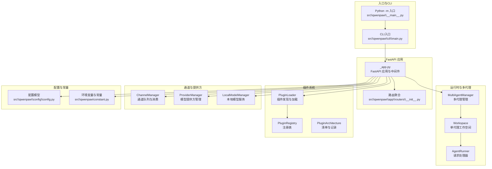
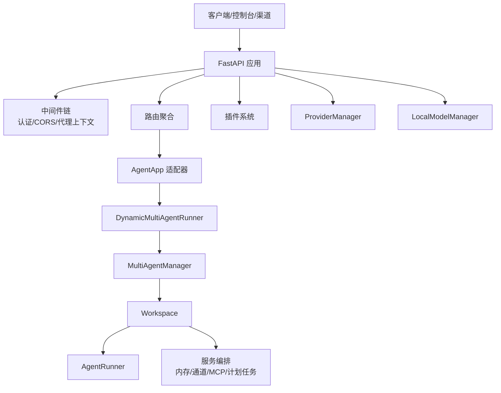
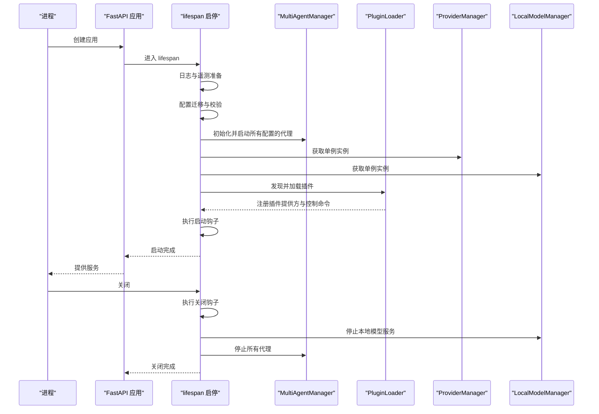
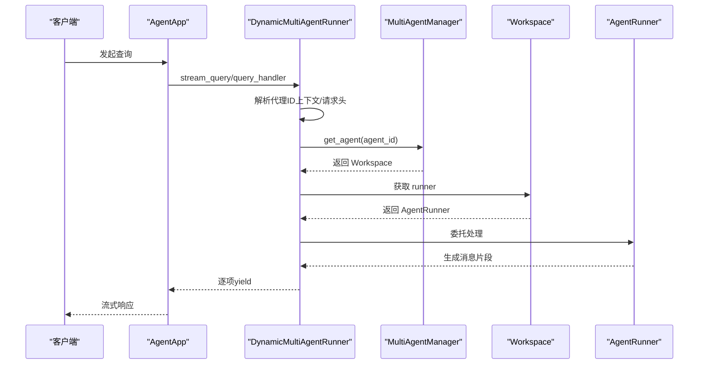
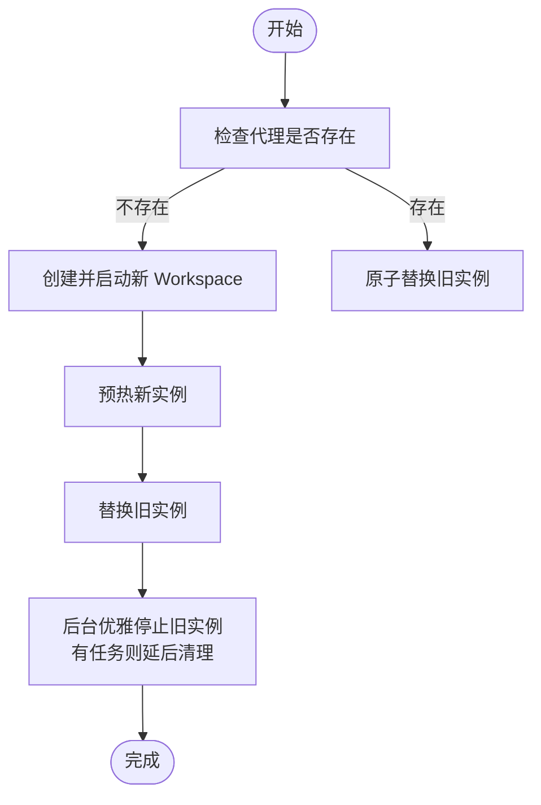
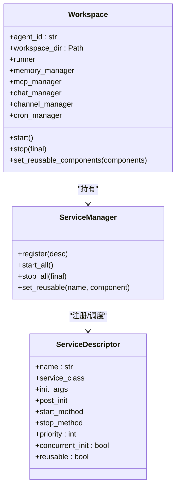
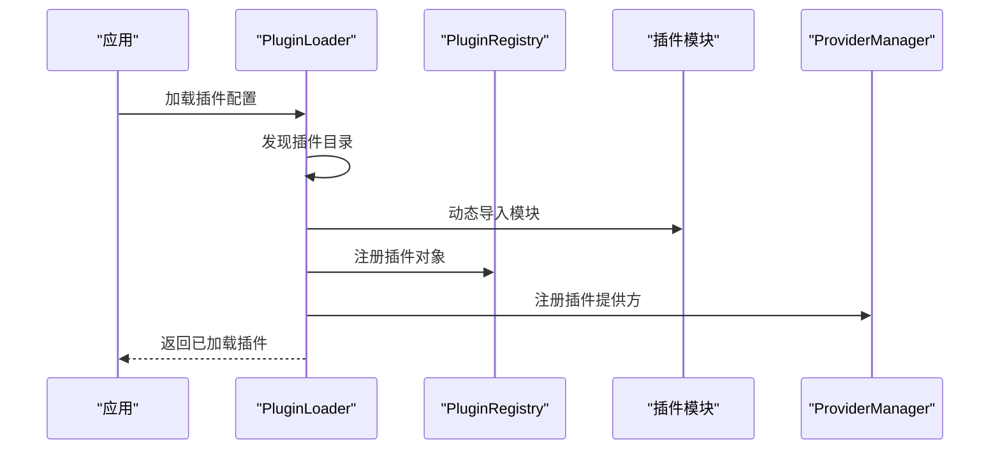
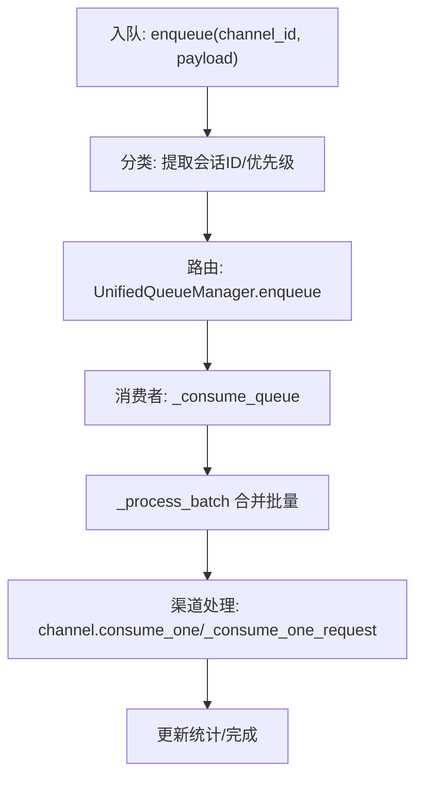
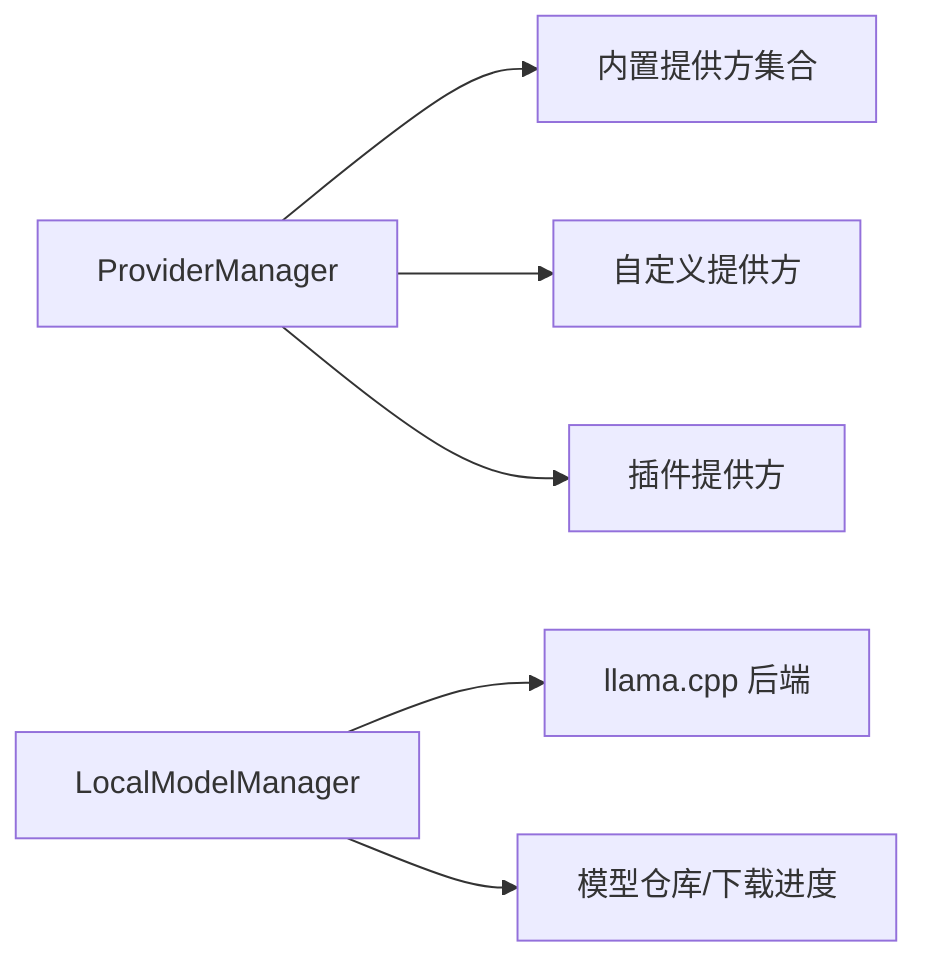
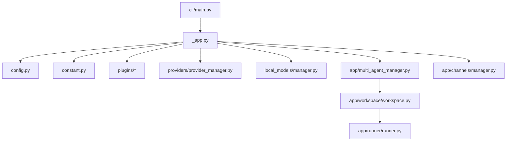

# 系统架构设计

<cite>
**本文引用的文件**
- [src\qwenpaw\__main__.py](file://src\qwenpaw\__main__.py)
- [src\qwenpaw\app\_app.py](file://src\qwenpaw\app\_app.py)
- [src\qwenpaw\config\config.py](file://src\qwenpaw\config\config.py)
- [src\qwenpaw\plugins\architecture.py](file://src\qwenpaw\plugins\architecture.py)
- [src\qwenpaw\plugins\loader.py](file://src\qwenpaw\plugins\loader.py)
- [src\qwenpaw\app\runner\runner.py](file://src\qwenpaw\app\runner\runner.py)
- [src\qwenpaw\app\multi_agent_manager.py](file://src\qwenpaw\app\multi_agent_manager.py)
- [src\qwenpaw\cli\main.py](file://src\qwenpaw\cli\main.py)
- [src\qwenpaw\constant.py](file://src\qwenpaw\constant.py)
- [src\qwenpaw\app\routers\__init__.py](file://src\qwenpaw\app\routers\__init__.py)
- [src\qwenpaw\app\workspace\workspace.py](file://src\qwenpaw\app\workspace\workspace.py)
- [src\qwenpaw\app\channels\manager.py](file://src\qwenpaw\app\channels\manager.py)
- [src\qwenpaw\providers\provider_manager.py](file://src\qwenpaw\providers\provider_manager.py)
- [src\qwenpaw\local_models\manager.py](file://src\qwenpaw\local_models\manager.py)
- [pyproject.toml](file://pyproject.toml)
</cite>

## 目录
1. [引言](#引言)
2. [项目结构](#项目结构)
3. [核心组件](#核心组件)
4. [架构总览](#架构总览)
5. [详细组件分析](#详细组件分析)
6. [依赖分析](#依赖分析)
7. [性能考虑](#性能考虑)
8. [故障排查指南](#故障排查指南)
9. [结论](#结论)
10. [附录](#附录)

## 引言
本文件面向QwenPaw系统的架构设计与实现，聚焦于整体分层架构、微服务化与插件化设计理念，以及FastAPI应用主入口、生命周期管理与中间件体系。文档还深入解析动态多代理运行器（DynamicMultiAgentRunner）的工作原理，并梳理应用启动流程、配置加载机制与环境变量处理策略。最后给出系统边界、组件职责划分与架构决策的技术考量，并通过多种图示展示组件交互与数据流。

## 项目结构
QwenPaw采用模块化与分层组织方式：CLI入口负责命令行与启动参数；FastAPI应用作为统一HTTP入口，承载路由与中间件；应用内部以“工作空间（Workspace）”为单位封装独立代理实例，支持多代理并发与零停机热重载；插件系统提供扩展能力；通道（Channel）抽象连接多平台消息渠道；模型提供方（Provider）与本地模型管理器（LocalModelManager）支撑推理与本地模型服务。

**图示来源**
- [src\qwenpaw\cli\main.py:1-171](file://src\qwenpaw\cli\main.py#L1-L171)
- [src\qwenpaw\__main__.py:1-7](file://src\qwenpaw\__main__.py#L1-L7)
- [src\qwenpaw\app\_app.py:1-569](file://src\qwenpaw\app\_app.py#L1-L569)
- [src\qwenpaw\app\routers\__init__.py:1-60](file://src\qwenpaw\app\routers\__init__.py#L1-L60)
- [src\qwenpaw\app\multi_agent_manager.py:1-470](file://src\qwenpaw\app\multi_agent_manager.py#L1-L470)
- [src\qwenpaw\app\workspace\workspace.py:1-389](file://src\qwenpaw\app\workspace\workspace.py#L1-L389)
- [src\qwenpaw\app\runner\runner.py:1-735](file://src\qwenpaw\app\runner\runner.py#L1-L735)
- [src\qwenpaw\plugins\loader.py:1-241](file://src\qwenpaw\plugins\loader.py#L1-L241)
- [src\qwenpaw\plugins\architecture.py:1-55](file://src\qwenpaw\plugins\architecture.py#L1-L55)
- [src\qwenpaw\app\channels\manager.py:1-711](file://src\qwenpaw\app\channels\manager.py#L1-L711)
- [src\qwenpaw\providers\provider_manager.py:1-800](file://src\qwenpaw\providers\provider_manager.py#L1-L800)
- [src\qwenpaw\local_models\manager.py:1-229](file://src\qwenpaw\local_models\manager.py#L1-L229)
- [src\qwenpaw\config\config.py:1-800](file://src\qwenpaw\config\config.py#L1-L800)
- [src\qwenpaw\constant.py:1-307](file://src\qwenpaw\constant.py#L1-L307)

**章节来源**
- [src\qwenpaw\__main__.py:1-7](file://src\qwenpaw\__main__.py#L1-L7)
- [src\qwenpaw\cli\main.py:1-171](file://src\qwenpaw\cli\main.py#L1-L171)
- [src\qwenpaw\app\_app.py:1-569](file://src\qwenpaw\app\_app.py#L1-L569)
- [src\qwenpaw\app\routers\__init__.py:1-60](file://src\qwenpaw\app\routers\__init__.py#L1-L60)
- [src\qwenpaw\constant.py:1-307](file://src\qwenpaw\constant.py#L1-L307)

## 核心组件
- FastAPI应用与生命周期：在应用启动阶段完成管理员工、插件系统初始化、全局管理器注入与关闭钩子注册；提供静态资源、控制台SPA回退与API路由挂载。
- 多代理管理（MultiAgentManager）：按需懒加载、线程安全、零停机热重载、任务追踪与清理。
- 工作空间（Workspace）：统一的服务编排容器，包含Runner、内存管理、MCP客户端、聊天与计划任务等。
- 动态多代理运行器（DynamicMultiAgentRunner）：根据请求中的代理标识动态路由到对应工作空间的Runner。
- 插件系统（PluginLoader/Registry）：发现、加载与注册插件，支持插件提供方注册与控制命令注册。
- 通道系统（ChannelManager）：统一队列与消费者模型，按会话与优先级合并批量消息，支持替换与优雅停止。
- 模型提供方与本地模型（ProviderManager/LocalModelManager）：内置/自定义/插件提供方统一管理，本地模型下载与服务器启停。
- 配置与常量：集中式环境变量读取、类型安全解析与默认值处理。

**章节来源**
- [src\qwenpaw\app\_app.py:64-151](file://src\qwenpaw\app\_app.py#L64-L151)
- [src\qwenpaw\app\multi_agent_manager.py:21-90](file://src\qwenpaw\app\multi_agent_manager.py#L21-L90)
- [src\qwenpaw\app\workspace\workspace.py:47-123](file://src\qwenpaw\app\workspace\workspace.py#L47-L123)
- [src\qwenpaw\plugins\loader.py:19-66](file://src\qwenpaw\plugins\loader.py#L19-L66)
- [src\qwenpaw\app\channels\manager.py:68-120](file://src\qwenpaw\app\channels\manager.py#L68-L120)
- [src\qwenpaw\providers\provider_manager.py:670-790](file://src\qwenpaw\providers\provider_manager.py#L670-L790)
- [src\qwenpaw\local_models\manager.py:33-120](file://src\qwenpaw\local_models\manager.py#L33-L120)
- [src\qwenpaw\config\config.py:1-800](file://src\qwenpaw\config\config.py#L1-L800)
- [src\qwenpaw\constant.py:28-120](file://src\qwenpaw\constant.py#L28-L120)

## 架构总览
系统采用三层架构与微服务化思想：
- 表现层：FastAPI应用与静态资源、控制台SPA。
- 控制层：路由聚合、中间件（认证、CORS）、AgentApp适配器与动态运行器。
- 数据/服务层：多代理工作空间、通道、提供方与本地模型服务。

**图示来源**
- [src\qwenpaw\app\_app.py:424-569](file://src\qwenpaw\app\_app.py#L424-L569)
- [src\qwenpaw\app\_app.py:64-151](file://src\qwenpaw\app\_app.py#L64-L151)
- [src\qwenpaw\app\routers\__init__.py:25-60](file://src\qwenpaw\app\routers\__init__.py#L25-L60)
- [src\qwenpaw\app\multi_agent_manager.py:21-90](file://src\qwenpaw\app\multi_agent_manager.py#L21-L90)
- [src\qwenpaw\app\workspace\workspace.py:47-123](file://src\qwenpaw\app\workspace\workspace.py#L47-L123)
- [src\qwenpaw\app\runner\runner.py:70-120](file://src\qwenpaw\app\runner\runner.py#L70-L120)
- [src\qwenpaw\providers\provider_manager.py:670-790](file://src\qwenpaw\providers\provider_manager.py#L670-L790)
- [src\qwenpaw\local_models\manager.py:33-120](file://src\qwenpaw\local_models\manager.py#L33-L120)

## 详细组件分析

### FastAPI应用主入口与生命周期
- 应用创建：基于FastAPI构造，启用可选的OpenAPI文档端点；根据环境变量决定是否暴露文档。
- 中间件：认证中间件、CORS中间件（可选）、代理上下文中间件用于从请求中提取当前代理标识。
- 生命周期：使用lifespan钩子进行启动与关闭流程控制，包括迁移、多代理管理器初始化、全局管理器注入、插件系统初始化与注册、启动钩子执行、关闭钩子执行与资源回收。
- 路由挂载：聚合路由、代理作用域路由、AgentApp路由、语音通道路由、自定义通道路由与控制台静态资源与SPA回退。
- 静态资源：根据环境变量解析控制台静态目录，支持多级回退策略，确保开发与部署一致性。

**图示来源**
- [src\qwenpaw\app\_app.py:166-422](file://src\qwenpaw\app\_app.py#L166-L422)
- [src\qwenpaw\app\multi_agent_manager.py:407-464](file://src\qwenpaw\app\multi_agent_manager.py#L407-L464)
- [src\qwenpaw\plugins\loader.py:199-221](file://src\qwenpaw\plugins\loader.py#L199-L221)
- [src\qwenpaw\providers\provider_manager.py:670-790](file://src\qwenpaw\providers\provider_manager.py#L670-L790)
- [src\qwenpaw\local_models\manager.py:222-229](file://src\qwenpaw\local_models\manager.py#L222-L229)

**章节来源**
- [src\qwenpaw\app\_app.py:424-569](file://src\qwenpaw\app\_app.py#L424-L569)
- [src\qwenpaw\app\_app.py:166-422](file://src\qwenpaw\app\_app.py#L166-L422)

### 动态多代理运行器（DynamicMultiAgentRunner）
- 设计目标：根据请求中的代理标识动态选择对应工作空间的Runner，实现多代理共享同一AgentApp实例。
- 关键流程：
  - 从上下文或请求头（如X-Agent-Id）获取当前代理ID。
  - 通过MultiAgentManager获取对应Workspace并取得其Runner。
  - 将AgentApp的stream_query/query_handler委托给该Runner，逐项yield结果。
  - 异常处理：捕获错误并返回错误消息，避免中断客户端流式响应。
- 生命周期：作为AgentApp的runner，实现异步上下文管理接口，但不直接管理Runner生命周期，交由MultiAgentManager与Workspace负责。

**图示来源**
- [src\qwenpaw\app\_app.py:64-151](file://src\qwenpaw\app\_app.py#L64-L151)
- [src\qwenpaw\app\multi_agent_manager.py:38-90](file://src\qwenpaw\app\multi_agent_manager.py#L38-L90)
- [src\qwenpaw\app\runner\runner.py:349-595](file://src\qwenpaw\app\runner\runner.py#L349-L595)

**章节来源**
- [src\qwenpaw\app\_app.py:64-151](file://src\qwenpaw\app\_app.py#L64-L151)

### 多代理管理器（MultiAgentManager）
- 懒加载：首次访问才创建并启动Workspace。
- 线程安全：使用异步锁保护并发访问。
- 零停机热重载：先创建新实例，原子替换旧实例，再在后台优雅停止旧实例，保证请求不中断。
- 统一停止：支持取消待完成清理任务、停止所有代理并清理状态。
- 启动策略：并发启动所有启用的代理，过滤禁用代理以节省资源。

**图示来源**
- [src\qwenpaw\app\multi_agent_manager.py:208-320](file://src\qwenpaw\app\multi_agent_manager.py#L208-L320)
- [src\qwenpaw\app\multi_agent_manager.py:346-370](file://src\qwenpaw\app\multi_agent_manager.py#L346-L370)

**章节来源**
- [src\qwenpaw\app\multi_agent_manager.py:21-90](file://src\qwenpaw\app\multi_agent_manager.py#L21-L90)
- [src\qwenpaw\app\multi_agent_manager.py:208-320](file://src\qwenpaw\app\multi_agent_manager.py#L208-L320)
- [src\qwenpaw\app\multi_agent_manager.py:346-370](file://src\qwenpaw\app\multi_agent_manager.py#L346-L370)

### 工作空间（Workspace）与服务编排
- 服务描述符（ServiceDescriptor）声明式注册：Runner、内存管理、MCP、聊天、计划任务、配置监视器等，按优先级与并发策略启动。
- 可复用组件：支持在热重载时保留内存与聊天服务实例，减少重启成本。
- 统一停止：通过ServiceManager统一停止与清理，区分可复用与不可复用组件。

**图示来源**
- [src\qwenpaw\app\workspace\workspace.py:47-123](file://src\qwenpaw\app\workspace\workspace.py#L47-L123)
- [src\qwenpaw\app\workspace\workspace.py:142-290](file://src\qwenpaw\app\workspace\workspace.py#L142-L290)

**章节来源**
- [src\qwenpaw\app\workspace\workspace.py:47-123](file://src\qwenpaw\app\workspace\workspace.py#L47-L123)
- [src\qwenpaw\app\workspace\workspace.py:290-389](file://src\qwenpaw\app\workspace\workspace.py#L290-L389)

### 插件系统（PluginLoader/Registry）
- 清单与记录：通过PluginManifest与PluginRecord描述插件元信息与加载状态。
- 发现与加载：扫描插件目录，读取plugin.json，动态导入插件模块，调用register方法，支持同步/异步。
- 注册表：维护插件提供方、控制命令与启动/关闭钩子，支持运行时注册与优先级管理。
- 运行时助手：向插件注入ProviderManager等运行时依赖。

**图示来源**
- [src\qwenpaw\plugins\loader.py:32-66](file://src\qwenpaw\plugins\loader.py#L32-L66)
- [src\qwenpaw\plugins\loader.py:84-198](file://src\qwenpaw\plugins\loader.py#L84-L198)
- [src\qwenpaw\plugins\architecture.py:9-55](file://src\qwenpaw\plugins\architecture.py#L9-L55)

**章节来源**
- [src\qwenpaw\plugins\loader.py:19-66](file://src\qwenpaw\plugins\loader.py#L19-L66)
- [src\qwenpaw\plugins\loader.py:84-198](file://src\qwenpaw\plugins\loader.py#L84-L198)
- [src\qwenpaw\plugins\architecture.py:9-55](file://src\qwenpaw\plugins\architecture.py#L9-L55)

### 通道系统（ChannelManager）
- 统一队列与消费者：每个（渠道, 会话, 优先级）拥有独立队列，支持批量合并与去抖键一致。
- 优先级与控制命令：通过CommandRegistry根据查询内容判定优先级，影响队列调度。
- 替换与优雅停止：支持在不中断其他渠道的情况下替换单个渠道，停止时取消待处理enqueue任务并等待清理循环结束。

**图示来源**
- [src\qwenpaw\app\channels\manager.py:350-470](file://src\qwenpaw\app\channels\manager.py#L350-L470)
- [src\qwenpaw\app\channels\manager.py:39-66](file://src\qwenpaw\app\channels\manager.py#L39-L66)

**章节来源**
- [src\qwenpaw\app\channels\manager.py:68-120](file://src\qwenpaw\app\channels\manager.py#L68-L120)
- [src\qwenpaw\app\channels\manager.py:350-470](file://src\qwenpaw\app\channels\manager.py#L350-L470)

### 模型提供方与本地模型
- ProviderManager：内置/自定义/插件提供方统一管理，支持信息查询、活跃模型获取与持久化存储。
- LocalModelManager：封装llama.cpp下载、服务器启停与配置持久化，提供最大上下文长度设置与推荐模型查询。

**图示来源**
- [src\qwenpaw\providers\provider_manager.py:670-790](file://src\qwenpaw\providers\provider_manager.py#L670-L790)
- [src\qwenpaw\local_models\manager.py:33-120](file://src\qwenpaw\local_models\manager.py#L33-L120)

**章节来源**
- [src\qwenpaw\providers\provider_manager.py:670-790](file://src\qwenpaw\providers\provider_manager.py#L670-L790)
- [src\qwenpaw\local_models\manager.py:33-120](file://src\qwenpaw\local_models\manager.py#L33-L120)

### 配置加载与环境变量处理
- 环境变量：统一通过EnvVarLoader读取，支持QWENPAW_与历史COPAW_前缀兼容；提供布尔、整数、浮点与字符串解析与边界校验。
- 配置模型：集中定义代理、通道、运行时、嵌入、记忆压缩、工具结果压缩、令牌用量等配置结构。
- 控制台静态目录解析：优先读取环境变量，其次查找打包资源，再次回退到仓库构建产物，最后回退到当前工作目录。

**章节来源**
- [src\qwenpaw\constant.py:28-120](file://src\qwenpaw\constant.py#L28-L120)
- [src\qwenpaw\config\config.py:1-800](file://src\qwenpaw\config\config.py#L1-L800)
- [src\qwenpaw\app\_app.py:452-482](file://src\qwenpaw\app\_app.py#L452-L482)

## 依赖分析
- 外部依赖：基于pyproject.toml定义，包含agentscope-runtime、uvicorn、apscheduler、各类渠道SDK、本地模型与推理库等。
- 内部模块耦合：
  - app/_app.py 依赖 config、constant、plugins、providers、local_models、multi_agent_manager、channels 等。
  - multi_agent_manager 依赖 workspace 与 config。
  - workspace 依赖 runner、mcp、crons、config 等。
  - plugins 与 channels 通过注册表与工厂函数解耦。
  - CLI入口仅在启动时被调用，后续通过应用生命周期管理。

**图示来源**
- [src\qwenpaw\app\_app.py:1-569](file://src\qwenpaw\app\_app.py#L1-L569)
- [src\qwenpaw\app\multi_agent_manager.py:1-470](file://src\qwenpaw\app\multi_agent_manager.py#L1-L470)
- [src\qwenpaw\app\workspace\workspace.py:1-389](file://src\qwenpaw\app\workspace\workspace.py#L1-L389)
- [src\qwenpaw\app\runner\runner.py:1-735](file://src\qwenpaw\app\runner\runner.py#L1-L735)
- [src\qwenpaw\app\channels\manager.py:1-711](file://src\qwenpaw\app\channels\manager.py#L1-L711)
- [src\qwenpaw\cli\main.py:1-171](file://src\qwenpaw\cli\main.py#L1-L171)
- [pyproject.toml:1-111](file://pyproject.toml#L1-L111)

**章节来源**
- [pyproject.toml:1-111](file://pyproject.toml#L1-L111)

## 性能考虑
- 并发与限流：全局LLM并发与QPM限制、指数退避与抖动，避免突发流量导致429。
- 零停机热重载：通过新旧实例原子替换与后台清理，降低维护窗口。
- 批量合并与队列：通道统一队列按会话与优先级合并快速消息，减少重复处理。
- 本地模型缓存：本地模型下载与服务器状态持久化，避免重复启动开销。
- 启动优化：延迟初始化与并发启动已启用代理，缩短冷启动时间。

[本节为通用指导，无需特定文件引用]

## 故障排查指南
- 启动失败：检查lifespan钩子日志，关注迁移、插件加载、ProviderManager与LocalModelManager初始化异常。
- 多代理问题：确认代理ID是否存在于配置，检查MultiAgentManager的get_agent与reload逻辑。
- 插件问题：查看PluginLoader的发现与加载日志，确认plugin.json与入口点正确。
- 通道积压：检查ChannelManager队列清理循环与消费者状态，确认enqueue回调与超时处理。
- 本地模型：检查下载进度、服务器状态与最大上下文长度配置，必要时强制停止并重新启动。

**章节来源**
- [src\qwenpaw\app\_app.py:166-422](file://src\qwenpaw\app\_app.py#L166-L422)
- [src\qwenpaw\app\multi_agent_manager.py:208-320](file://src\qwenpaw\app\multi_agent_manager.py#L208-L320)
- [src\qwenpaw\plugins\loader.py:199-221](file://src\qwenpaw\plugins\loader.py#L199-L221)
- [src\qwenpaw\app\channels\manager.py:447-526](file://src\qwenpaw\app\channels\manager.py#L447-L526)
- [src\qwenpaw\local_models\manager.py:101-120](file://src\qwenpaw\local_models\manager.py#L101-L120)

## 结论
QwenPaw通过FastAPI统一入口、多代理工作空间与动态运行器实现了高可用、可扩展的个人助理平台。插件化与通道抽象进一步增强了生态开放性与跨平台能力。生命周期管理与资源回收策略确保了生产环境的稳定性与可观测性。建议在生产环境中开启严格的日志与遥测，合理配置并发与限流参数，并定期验证插件与通道的可用性。

[本节为总结，无需特定文件引用]

## 附录
- 系统边界：应用边界以内为QwenPaw核心；外部依赖包括各渠道SDK、模型提供方API与本地模型二进制。
- 组件职责：
  - FastAPI应用：统一入口、中间件与路由。
  - MultiAgentManager：多代理生命周期与热重载。
  - Workspace：服务编排与状态管理。
  - PluginLoader：插件发现与注册。
  - ChannelManager：消息队列与渠道处理。
  - ProviderManager/LocalModelManager：推理与本地模型服务。

[本节为概要，无需特定文件引用]