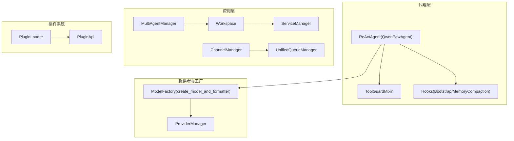
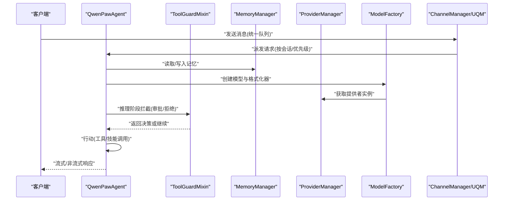
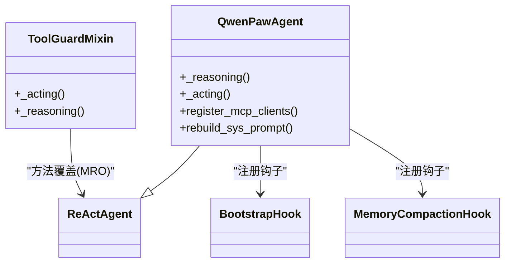
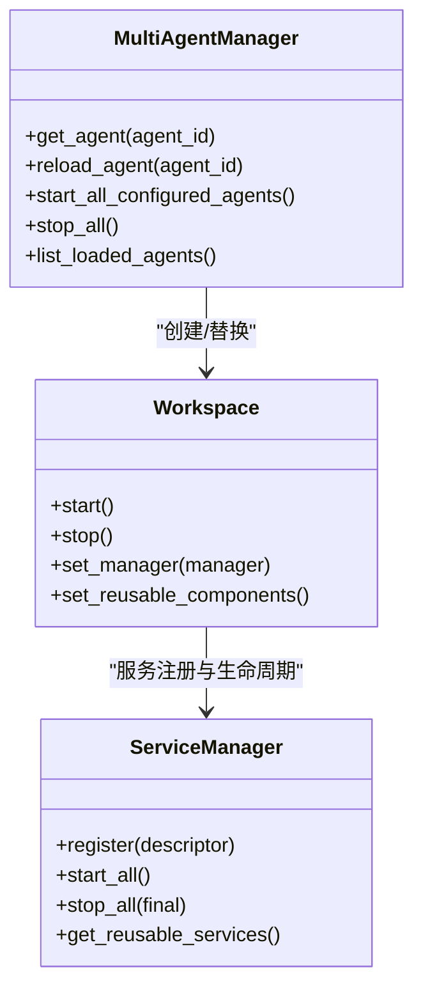
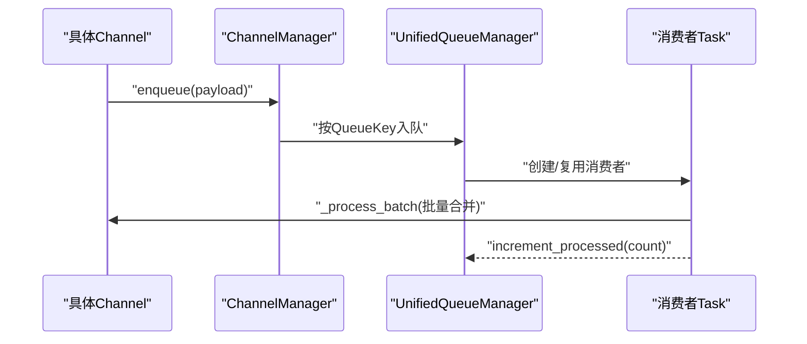
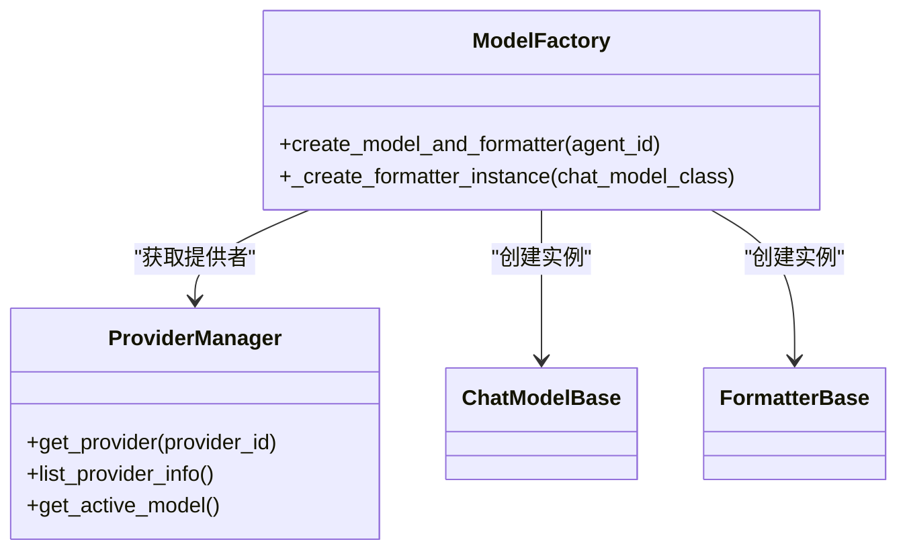
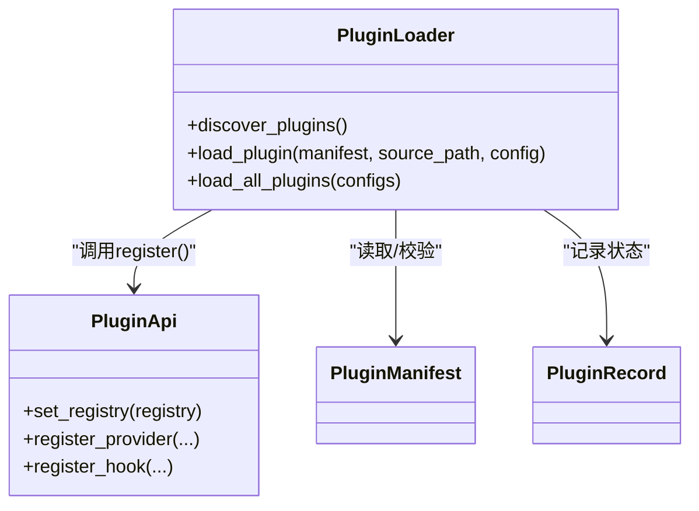
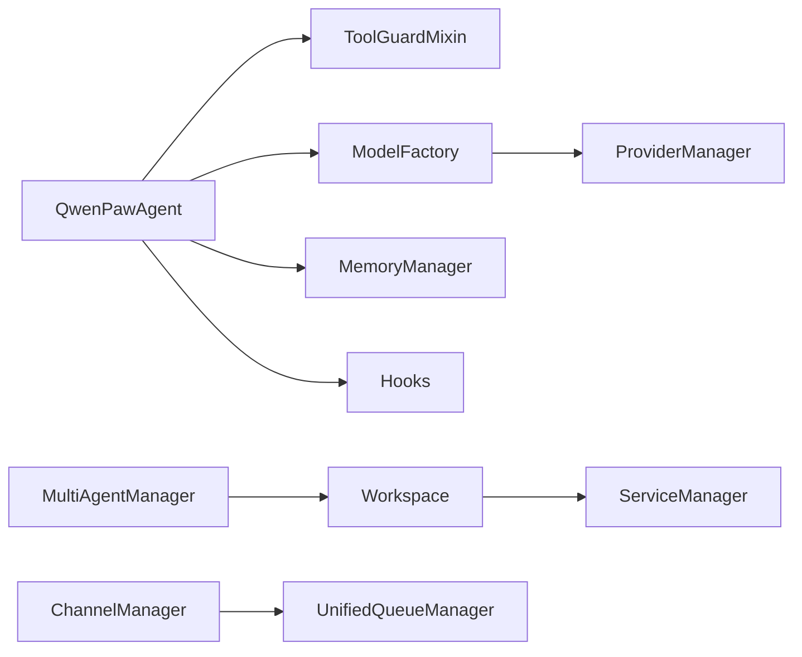

# 设计模式应用

<cite>
**本文引用的文件**
- [react_agent.py](file://src/qwenpaw/agents/react_agent.py)
- [tool_guard_mixin.py](file://src/qwenpaw/agents/tool_guard_mixin.py)
- [hooks/memory_compaction.py](file://src/qwenpaw/agents/hooks/memory_compaction.py)
- [multi_agent_manager.py](file://src/qwenpaw/app/multi_agent_manager.py)
- [workspace/workspace.py](file://src/qwenpaw/app/workspace/workspace.py)
- [workspace/service_manager.py](file://src/qwenpaw/app/workspace/service_manager.py)
- [channels/base.py](file://src/qwenpaw/app/channels/base.py)
- [channels/manager.py](file://src/qwenpaw/app/channels/manager.py)
- [channels/unified_queue_manager.py](file://src/qwenpaw/app/channels/unified_queue_manager.py)
- [model_factory.py](file://src/qwenpaw/agents/model_factory.py)
- [providers/provider_manager.py](file://src/qwenpaw/providers/provider_manager.py)
- [plugins/architecture.py](file://src/qwenpaw/plugins/architecture.py)
- [plugins/loader.py](file://src/qwenpaw/plugins/loader.py)
- [agent_context.py](file://src/qwenpaw/app/agent_context.py)
- [multi_agent_report.html](file://multi_agent_report.html)
- [channels.en.md](file://website/public/docs/channels.en.md)
</cite>

## 目录
1. [引言](#引言)
2. [项目结构](#项目结构)
3. [核心组件](#核心组件)
4. [架构总览](#架构总览)
5. [详细组件分析](#详细组件分析)
6. [依赖分析](#依赖分析)
7. [性能考虑](#性能考虑)
8. [故障排查指南](#故障排查指南)
9. [结论](#结论)
10. [附录](#附录)

## 引言
本文件围绕 QwenPaw 在代理系统中的设计模式应用展开，重点分析以下模式在代码中的落地与价值：
- ReAct 架构模式：推理-行动循环与状态管理
- 中介者模式：MultiAgentManager 作为多智能体协调中心
- 观察者模式：事件驱动与消息路由（通道与统一队列）
- 工厂模式：模型提供者与格式化器工厂
- 插件化架构中的策略与适配器模式

通过对关键实现文件的逐层剖析，结合 UML 类图与交互图，帮助读者理解这些模式如何协同构建高内聚、低耦合且可扩展的系统。

## 项目结构
QwenPaw 的核心代码位于 src/qwenpaw 下，按领域划分模块：
- agents：代理与工具、技能、记忆管理
- app：应用运行时（多智能体、通道、工作区、路由器等）
- providers：模型提供者与管理
- plugins：插件架构与加载
- 其他：工具、本地模型、安全、令牌统计等

图表来源
- [react_agent.py](file://src/qwenpaw/agents/react_agent.py)
- [tool_guard_mixin.py](file://src/qwenpaw/agents/tool_guard_mixin.py)
- [multi_agent_manager.py](file://src/qwenpaw/app/multi_agent_manager.py)
- [workspace/workspace.py](file://src/qwenpaw/app/workspace/workspace.py)
- [workspace/service_manager.py](file://src/qwenpaw/app/workspace/service_manager.py)
- [channels/manager.py](file://src/qwenpaw/app/channels/manager.py)
- [channels/unified_queue_manager.py](file://src/qwenpaw/app/channels/unified_queue_manager.py)
- [model_factory.py](file://src/qwenpaw/agents/model_factory.py)
- [providers/provider_manager.py](file://src/qwenpaw/providers/provider_manager.py)
- [plugins/loader.py](file://src/qwenpaw/plugins/loader.py)

章节来源
- [multi_agent_report.html](file://multi_agent_report.html)
- [channels.en.md](file://website/public/docs/channels.en.md)

## 核心组件
- ReActAgent/QwenPawAgent：基于 ReAct 的推理-行动循环，集成工具、技能与记忆管理；通过 ToolGuardMixin 实现安全拦截与审批流。
- MultiAgentManager：多智能体工作区的中央协调者，负责懒加载、零停机热重载、生命周期管理与并发控制。
- ChannelManager + UnifiedQueueManager：统一消息队列与通道消费者，实现跨渠道的有序处理与优先级调度。
- ProviderManager + ModelFactory：提供者与模型工厂，统一创建聊天模型与格式化器，支持重试与限流包装。
- PluginLoader + PluginApi：插件发现、动态加载与注册，支持插件对核心能力的扩展。

章节来源
- [react_agent.py](file://src/qwenpaw/agents/react_agent.py)
- [tool_guard_mixin.py](file://src/qwenpaw/agents/tool_guard_mixin.py)
- [multi_agent_manager.py](file://src/qwenpaw/app/multi_agent_manager.py)
- [channels/manager.py](file://src/qwenpaw/app/channels/manager.py)
- [channels/unified_queue_manager.py](file://src/qwenpaw/app/channels/unified_queue_manager.py)
- [model_factory.py](file://src/qwenpaw/agents/model_factory.py)
- [providers/provider_manager.py](file://src/qwenpaw/providers/provider_manager.py)
- [plugins/loader.py](file://src/qwenpaw/plugins/loader.py)

## 架构总览
下图展示 ReAct 推理循环、工具调用与安全拦截的交互流程，以及多智能体协调与通道消息路由的整体视图。

图表来源
- [react_agent.py](file://src/qwenpaw/agents/react_agent.py)
- [tool_guard_mixin.py](file://src/qwenpaw/agents/tool_guard_mixin.py)
- [model_factory.py](file://src/qwenpaw/agents/model_factory.py)
- [providers/provider_manager.py](file://src/qwenpaw/providers/provider_manager.py)
- [channels/manager.py](file://src/qwenpaw/app/channels/manager.py)
- [channels/unified_queue_manager.py](file://src/qwenpaw/app/channels/unified_queue_manager.py)

## 详细组件分析

### ReAct 架构模式：推理-行动循环与状态管理
- 推理阶段：QwenPawAgent 继承 ReActAgent 并在 _reasoning 中实现主动/被动媒体块过滤，确保多模态能力不匹配时的健壮性。
- 行动阶段：通过 Toolkit/技能注册，将工具与技能统一纳入行动清单；ToolGuardMixin 在 _acting/_reasoning 中插入审批拦截，形成“推理-行动-审批”的闭环。
- 状态管理：记忆管理器与钩子（Bootstrap/MemoryCompaction）在推理前执行，保证上下文长度与引导信息的正确性。

图表来源
- [react_agent.py](file://src/qwenpaw/agents/react_agent.py)
- [tool_guard_mixin.py](file://src/qwenpaw/agents/tool_guard_mixin.py)
- [hooks/memory_compaction.py](file://src/qwenpaw/agents/hooks/memory_compaction.py)

章节来源
- [react_agent.py](file://src/qwenpaw/agents/react_agent.py)
- [tool_guard_mixin.py](file://src/qwenpaw/agents/tool_guard_mixin.py)
- [hooks/memory_compaction.py](file://src/qwenpaw/agents/hooks/memory_compaction.py)

### 中介者模式：MultiAgentManager 作为多智能体协调者
- 职责边界：集中管理多个 Workspace，提供懒加载、零停机热重载、并发安全与资源回收。
- 关键实现：
  - get_agent：按需创建并启动 Workspace，设置管理器引用。
  - reload_agent：原子替换旧实例，优雅停止旧实例（后台延迟清理）。
  - start_all_configured_agents：并发启动启用的智能体。
  - stop_all：优雅关闭所有实例与清理任务。

图表来源
- [multi_agent_manager.py](file://src/qwenpaw/app/multi_agent_manager.py)
- [workspace/workspace.py](file://src/qwenpaw/app/workspace/workspace.py)
- [workspace/service_manager.py](file://src/qwenpaw/app/workspace/service_manager.py)

章节来源
- [multi_agent_manager.py](file://src/qwenpaw/app/multi_agent_manager.py)
- [workspace/workspace.py](file://src/qwenpaw/app/workspace/workspace.py)
- [workspace/service_manager.py](file://src/qwenpaw/app/workspace/service_manager.py)

### 观察者模式：事件驱动与消息路由
- 事件驱动：ChannelManager 将来自不同渠道的消息统一注入到 UnifiedQueueManager 的队列中，按 (channel_id, session_id, priority) 分组，消费者按序处理。
- 路由与合并：_process_batch 对原生负载进行合并与去抖，确保高并发下的有序与一致性。
- 通知机制：消费者完成处理后回调增量计数，便于监控与可观测性。

图表来源
- [channels/manager.py](file://src/qwenpaw/app/channels/manager.py)
- [channels/unified_queue_manager.py](file://src/qwenpaw/app/channels/unified_queue_manager.py)
- [channels/base.py](file://src/qwenpaw/app/channels/base.py)

章节来源
- [channels/manager.py](file://src/qwenpaw/app/channels/manager.py)
- [channels/unified_queue_manager.py](file://src/qwenpaw/app/channels/unified_queue_manager.py)
- [channels/base.py](file://src/qwenpaw/app/channels/base.py)

### 工厂模式：模型提供者与格式化器工厂
- ProviderManager：统一管理内置/自定义/插件提供者，按 ID 获取实例，支持信息查询与迁移。
- ModelFactory：根据配置创建 ChatModelBase 与 FormatterBase，支持重试与限流包装，兼容多提供者格式化差异。

图表来源
- [providers/provider_manager.py](file://src/qwenpaw/providers/provider_manager.py)
- [model_factory.py](file://src/qwenpaw/agents/model_factory.py)

章节来源
- [providers/provider_manager.py](file://src/qwenpaw/providers/provider_manager.py)
- [model_factory.py](file://src/qwenpaw/agents/model_factory.py)

### 插件化架构：策略与适配器模式
- 策略模式：插件通过 PluginApi 注册提供者、钩子与运行时辅助，形成可插拔的能力扩展点。
- 适配器模式：PluginLoader 动态导入插件模块，屏蔽相对导入与入口约定差异，统一注册接口。

图表来源
- [plugins/loader.py](file://src/qwenpaw/plugins/loader.py)
- [plugins/architecture.py](file://src/qwenpaw/plugins/architecture.py)

章节来源
- [plugins/loader.py](file://src/qwenpaw/plugins/loader.py)
- [plugins/architecture.py](file://src/qwenpaw/plugins/architecture.py)

## 依赖分析
- 组件耦合：
  - QwenPawAgent 依赖 ToolGuardMixin、ModelFactory、ProviderManager、MemoryManager 与 Hooks。
  - MultiAgentManager 依赖 Workspace 与 ServiceManager，实现零停机热重载。
  - ChannelManager 依赖 UnifiedQueueManager，实现跨渠道统一队列与优先级调度。
- 外部依赖：
  - 提供者生态：OpenAI、Anthropic、Gemini、Ollama 等，通过 ProviderManager 抽象统一。
  - 插件生态：通过 PluginLoader 动态加载，遵循 Manifest 与 API 约定。

图表来源
- [react_agent.py](file://src/qwenpaw/agents/react_agent.py)
- [tool_guard_mixin.py](file://src/qwenpaw/agents/tool_guard_mixin.py)
- [model_factory.py](file://src/qwenpaw/agents/model_factory.py)
- [providers/provider_manager.py](file://src/qwenpaw/providers/provider_manager.py)
- [multi_agent_manager.py](file://src/qwenpaw/app/multi_agent_manager.py)
- [workspace/workspace.py](file://src/qwenpaw/app/workspace/workspace.py)
- [workspace/service_manager.py](file://src/qwenpaw/app/workspace/service_manager.py)
- [channels/manager.py](file://src/qwenpaw/app/channels/manager.py)
- [channels/unified_queue_manager.py](file://src/qwenpaw/app/channels/unified_queue_manager.py)

## 性能考虑
- 并发与隔离：
  - UnifiedQueueManager 使用 QueueKey 实现会话与优先级隔离，避免全局阻塞。
  - MultiAgentManager 并发启动智能体，减少冷启动时间。
- 资源回收：
  - 旧实例在 reload 后延迟清理，避免中断正在进行的任务。
  - ChannelManager 在停止时取消待处理 enqueue 任务，防止悬挂。
- 上下文优化：
  - MemoryCompactionHook 在推理前自动压缩历史消息，降低上下文开销。
- 可观测性：
  - UnifiedQueueManager 提供队列指标（总数、大小、处理计数），便于容量规划。

## 故障排查指南
- ReAct 推理失败（媒体块错误）：
  - 主动/被动过滤：当模型不支持多模态时，先剥离媒体块；若仍失败则二次剥离并重试。
  - 参考路径：[react_agent.py](file://src/qwenpaw/agents/react_agent.py)
- 工具调用被拦截（需要审批）：
  - ToolGuardMixin 在推理/行动阶段插入审批流，需等待 /approve 命令放行。
  - 参考路径：[tool_guard_mixin.py](file://src/qwenpaw/agents/tool_guard_mixin.py)
- 通道消息积压或乱序：
  - 检查 UnifiedQueueManager 的队列指标与清理任务是否正常运行。
  - 参考路径：[channels/unified_queue_manager.py](file://src/qwenpaw/app/channels/unified_queue_manager.py)
- 多智能体热重载失败：
  - 查看旧实例延迟清理任务状态与新实例启动日志，确认原子替换是否成功。
  - 参考路径：[multi_agent_manager.py](file://src/qwenpaw/app/multi_agent_manager.py)
- 提供者不可用或配置错误：
  - 使用 ProviderManager 的信息查询接口核对提供者状态与模型列表。
  - 参考路径：[providers/provider_manager.py](file://src/qwenpaw/providers/provider_manager.py)

章节来源
- [react_agent.py](file://src/qwenpaw/agents/react_agent.py)
- [tool_guard_mixin.py](file://src/qwenpaw/agents/tool_guard_mixin.py)
- [channels/unified_queue_manager.py](file://src/qwenpaw/app/channels/unified_queue_manager.py)
- [multi_agent_manager.py](file://src/qwenpaw/app/multi_agent_manager.py)
- [providers/provider_manager.py](file://src/qwenpaw/providers/provider_manager.py)

## 结论
QwenPaw 在代理系统中系统性地应用了多种设计模式：
- ReAct 架构模式确保推理-行动的清晰边界与可扩展性；
- 中介者模式通过 MultiAgentManager 实现多智能体的统一协调；
- 观察者模式体现在通道与队列的事件驱动与消息路由；
- 工厂模式简化了模型与提供者的创建与封装；
- 插件化架构通过策略与适配器模式实现生态扩展。

这些模式共同提升了系统的可维护性、可扩展性与运行稳定性。

## 附录
- 实际应用场景举例：
  - ReAct 循环：在复杂问答与多步骤任务中，通过推理-行动-审批闭环提升安全性与可控性。
  - 多智能体：在多租户或多角色场景下，通过 MultiAgentManager 实现独立工作区与零停机升级。
  - 事件驱动：在高并发渠道接入场景下，通过 UnifiedQueueManager 实现有序与高效的消息处理。
  - 插件扩展：在提供者生态与工具生态快速演进时，通过插件系统实现即插即用的能力扩展。