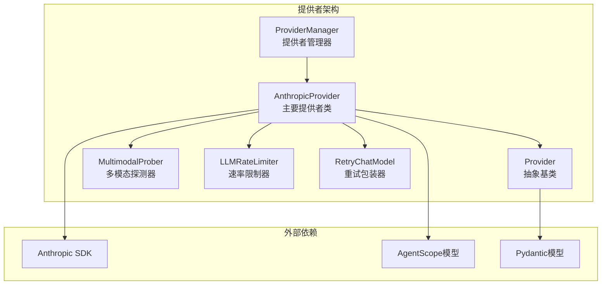
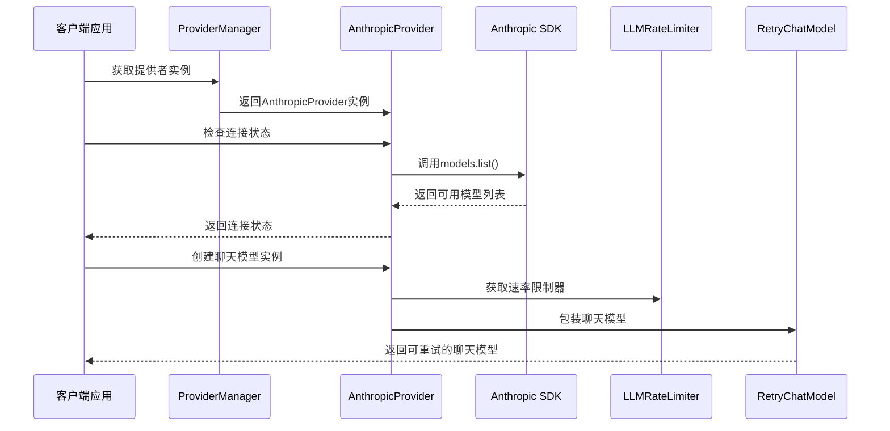
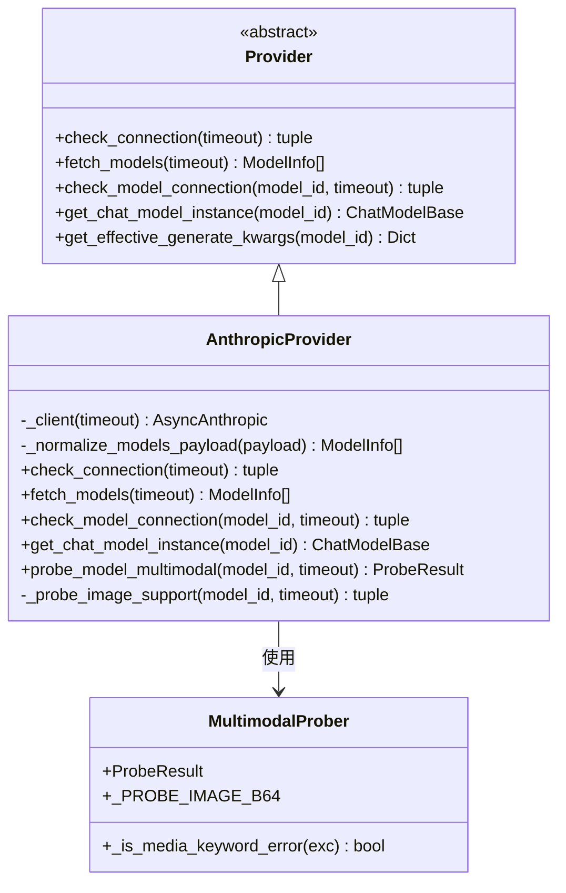
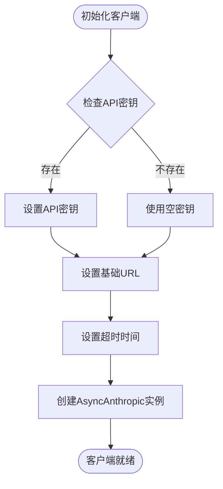
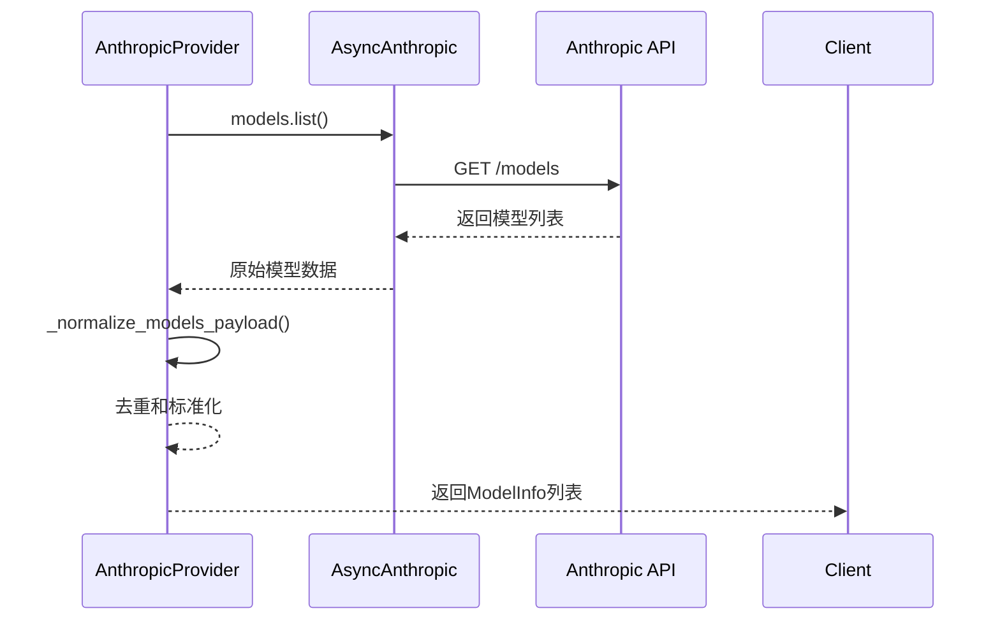
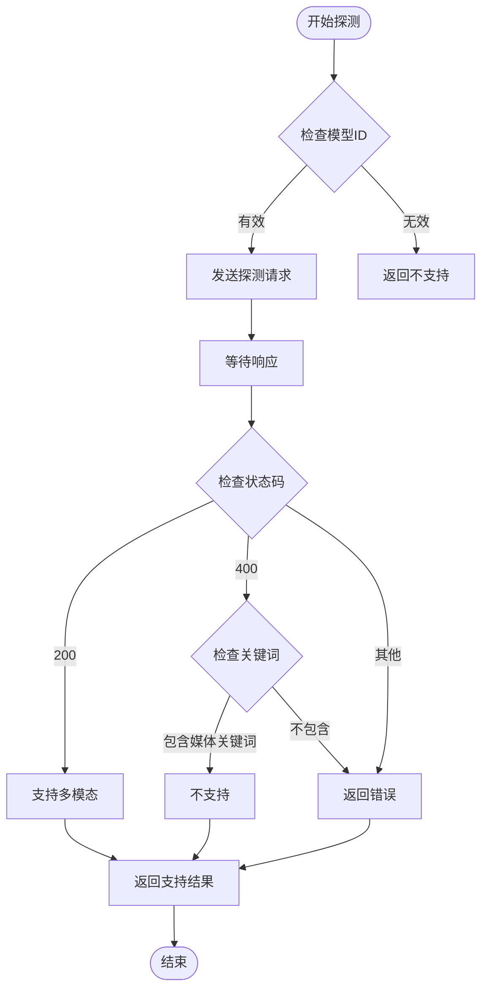
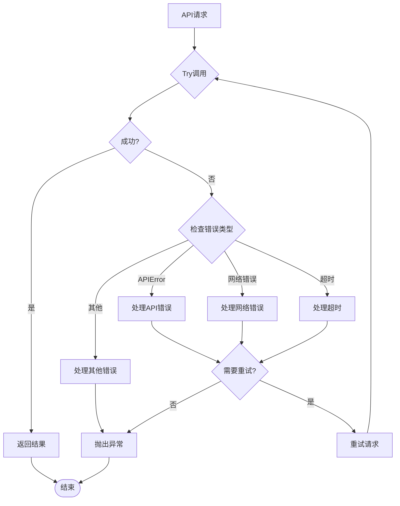
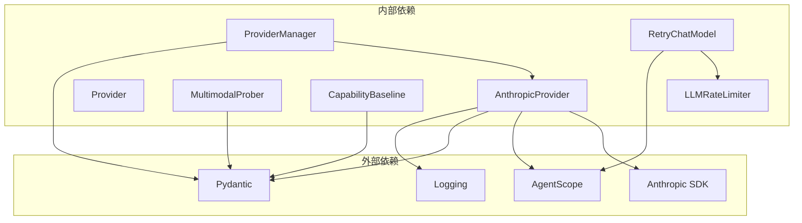
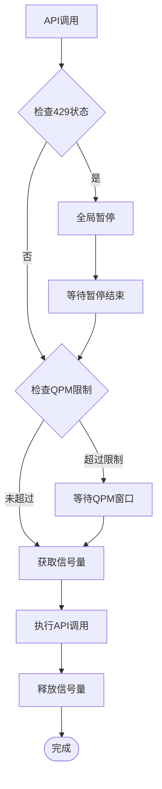

# Anthropic提供者

<cite>
**本文档引用的文件**
- [anthropic_provider.py](file://src/qwenpaw/providers/anthropic_provider.py)
- [provider.py](file://src/qwenpaw/providers/provider.py)
- [provider_manager.py](file://src/qwenpaw/providers/provider_manager.py)
- [multimodal_prober.py](file://src/qwenpaw/providers/multimodal_prober.py)
- [capability_baseline.py](file://src/qwenpaw/providers/capability_baseline.py)
- [rate_limiter.py](file://src/qwenpaw/providers/rate_limiter.py)
- [retry_chat_model.py](file://src/qwenpaw/providers/retry_chat_model.py)
- [test_anthropic_provider.py](file://tests/unit/providers/test_anthropic_provider.py)
</cite>

## 目录
1. [简介](#简介)
2. [项目结构](#项目结构)
3. [核心组件](#核心组件)
4. [架构概览](#架构概览)
5. [详细组件分析](#详细组件分析)
6. [依赖关系分析](#依赖关系分析)
7. [性能考虑](#性能考虑)
8. [故障排除指南](#故障排除指南)
9. [结论](#结论)
10. [附录](#附录)

## 简介
本文档为Anthropic提供者创建全面的技术文档，详细介绍AnthropicProvider类的实现架构，包括Claude API的客户端配置和认证机制。文档化了模型发现流程、连接测试方法和错误处理策略，解释了与Claude模型的兼容性适配和参数映射关系，并提供了具体的API配置示例、速率限制处理和故障恢复机制。

## 项目结构
Anthropic提供者位于QwenPaw项目的提供者模块中，采用分层架构设计，包含以下关键组件：

**图表来源**
- [anthropic_provider.py:27-256](file://src/qwenpaw/providers/anthropic_provider.py#L27-L256)
- [provider.py:111-314](file://src/qwenpaw/providers/provider.py#L111-L314)
- [provider_manager.py:602-621](file://src/qwenpaw/providers/provider_manager.py#L602-L621)

**章节来源**
- [anthropic_provider.py:1-256](file://src/qwenpaw/providers/anthropic_provider.py#L1-L256)
- [provider.py:1-314](file://src/qwenpaw/providers/provider.py#L1-L314)
- [provider_manager.py:1-800](file://src/qwenpaw/providers/provider_manager.py#L1-L800)

## 核心组件
Anthropic提供者的核心组件包括：

### 主要提供者类
- **AnthropicProvider**: 继承自Provider抽象基类，实现Anthropic API的具体功能
- **Provider**: 抽象基类，定义提供者的基本接口和通用功能
- **ProviderManager**: 管理所有内置和自定义提供者实例

### 关键数据模型
- **ModelInfo**: 模型信息的数据结构，包含模型标识符、名称和多模态支持状态
- **ProviderInfo**: 提供者配置信息的数据结构
- **ProbeResult**: 多模态探测结果的数据结构

**章节来源**
- [anthropic_provider.py:27-256](file://src/qwenpaw/providers/anthropic_provider.py#L27-L256)
- [provider.py:17-47](file://src/qwenpaw/providers/provider.py#L17-L47)
- [provider_manager.py:602-621](file://src/qwenpaw/providers/provider_manager.py#L602-L621)

## 架构概览
Anthropic提供者的整体架构采用分层设计，实现了清晰的关注点分离：

**图表来源**
- [provider_manager.py:770-790](file://src/qwenpaw/providers/provider_manager.py#L770-L790)
- [anthropic_provider.py:66-85](file://src/qwenpaw/providers/anthropic_provider.py#L66-L85)
- [anthropic_provider.py:128-164](file://src/qwenpaw/providers/anthropic_provider.py#L128-L164)

## 详细组件分析

### AnthropicProvider类分析
AnthropicProvider是提供者架构的核心实现，负责与Anthropic Claude API的交互。

#### 类关系图

**图表来源**
- [provider.py:111-273](file://src/qwenpaw/providers/provider.py#L111-L273)
- [anthropic_provider.py:27-256](file://src/qwenpaw/providers/anthropic_provider.py#L27-L256)
- [multimodal_prober.py:75-102](file://src/qwenpaw/providers/multimodal_prober.py#L75-L102)

#### 客户端配置和认证机制
AnthropicProvider使用AsyncAnthropic客户端进行API调用，支持多种认证方式：

**图表来源**
- [anthropic_provider.py:30-35](file://src/qwenpaw/providers/anthropic_provider.py#L30-L35)

#### 模型发现流程
模型发现通过调用Anthropic API的models.list()端点实现：

**图表来源**
- [anthropic_provider.py:80-85](file://src/qwenpaw/providers/anthropic_provider.py#L80-L85)
- [anthropic_provider.py:38-64](file://src/qwenpaw/providers/anthropic_provider.py#L38-L64)

#### 连接测试方法
提供两种连接测试方法：

1. **全局连接测试**: 验证API可达性
2. **模型连接测试**: 验证特定模型的可用性

**章节来源**
- [anthropic_provider.py:66-126](file://src/qwenpaw/providers/anthropic_provider.py#L66-L126)

### 多模态支持探测
Anthropic提供者实现了完整的多模态支持探测机制：

**图表来源**
- [anthropic_provider.py:166-256](file://src/qwenpaw/providers/anthropic_provider.py#L166-L256)
- [multimodal_prober.py:89-102](file://src/qwenpaw/providers/multimodal_prober.py#L89-L102)

#### 参数映射和兼容性适配
Anthropic提供者与AgentScope模型的参数映射关系：

| Anthropic参数 | AgentScope参数 | 默认值 | 说明 |
|---------------|----------------|--------|------|
| model | model_name | - | 模型标识符 |
| max_tokens | max_tokens | - | 最大生成令牌数 |
| messages | messages | - | 对话消息数组 |
| stream | stream | True | 是否启用流式输出 |
| temperature | temperature | - | 采样温度 |
| top_p | top_p | - | 核采样概率 |

**章节来源**
- [anthropic_provider.py:97-126](file://src/qwenpaw/providers/anthropic_provider.py#L97-L126)
- [anthropic_provider.py:128-164](file://src/qwenpaw/providers/anthropic_provider.py#L128-L164)

### 错误处理策略
Anthropic提供者实现了多层次的错误处理机制：

**图表来源**
- [anthropic_provider.py:120-126](file://src/qwenpaw/providers/anthropic_provider.py#L120-L126)
- [retry_chat_model.py:124-160](file://src/qwenpaw/providers/retry_chat_model.py#L124-L160)

**章节来源**
- [anthropic_provider.py:66-126](file://src/qwenpaw/providers/anthropic_provider.py#L66-L126)
- [retry_chat_model.py:1-477](file://src/qwenpaw/providers/retry_chat_model.py#L1-L477)

## 依赖关系分析

### 外部依赖关系

**图表来源**
- [anthropic_provider.py:11-19](file://src/qwenpaw/providers/anthropic_provider.py#L11-L19)
- [provider_manager.py:21-36](file://src/qwenpaw/providers/provider_manager.py#L21-L36)

### 内部组件耦合度
- **低耦合**: AnthropicProvider与具体实现解耦，通过Provider抽象基类实现
- **高内聚**: 每个组件职责明确，功能集中
- **可扩展性**: 支持添加新的提供者类型而无需修改现有代码

**章节来源**
- [provider.py:111-273](file://src/qwenpaw/providers/provider.py#L111-L273)
- [provider_manager.py:602-621](file://src/qwenpaw/providers/provider_manager.py#L602-L621)

## 性能考虑

### 速率限制处理
系统实现了智能的速率限制机制：

**图表来源**
- [rate_limiter.py:70-151](file://src/qwenpaw/providers/rate_limiter.py#L70-L151)

### 故障恢复机制
系统提供了多层次的故障恢复策略：

1. **指数退避重试**: 对瞬时错误进行指数退避重试
2. **并发控制**: 通过信号量限制并发请求数量
3. **全局暂停**: 当收到429时，所有请求暂停指定时间
4. **Jitter随机化**: 在暂停期间添加随机抖动避免同时唤醒

**章节来源**
- [rate_limiter.py:1-279](file://src/qwenpaw/providers/rate_limiter.py#L1-L279)
- [retry_chat_model.py:1-477](file://src/qwenpaw/providers/retry_chat_model.py#L1-L477)

## 故障排除指南

### 常见问题诊断
1. **API密钥认证失败**
   - 检查API密钥格式是否正确
   - 验证API密钥权限是否足够
   - 确认API密钥未过期

2. **模型不可用**
   - 验证模型ID是否正确
   - 检查模型是否在该地区可用
   - 确认模型是否被禁用或限制

3. **网络连接问题**
   - 检查防火墙设置
   - 验证代理配置
   - 确认DNS解析正常

### 调试建议
- 启用详细的日志记录
- 使用单元测试验证功能
- 监控API使用情况和错误率
- 实施适当的超时设置

**章节来源**
- [test_anthropic_provider.py:1-189](file://tests/unit/providers/test_anthropic_provider.py#L1-L189)

## 结论
Anthropic提供者实现了完整的Claude API集成，具有以下特点：

1. **架构清晰**: 采用分层设计，职责分离明确
2. **功能完整**: 支持模型发现、连接测试、多模态探测等核心功能
3. **错误处理**: 实现了多层次的错误处理和故障恢复机制
4. **性能优化**: 集成了智能的速率限制和重试机制
5. **可扩展性**: 设计支持未来功能扩展和新提供者集成

该实现为QwenPaw项目提供了可靠的Anthropic Claude API集成，满足了生产环境的性能和稳定性要求。

## 附录

### API配置示例
以下是一些常见的配置场景：

1. **标准Anthropic配置**
   - base_url: https://api.anthropic.com
   - api_key_prefix: sk-ant-
   - chat_model: AnthropicChatModel

2. **DashScope兼容模式配置**
   - base_url: https://dashscope.aliyuncs.com/compatible-mode/v1
   - api_key_prefix: sk-
   - chat_model: AnthropicChatModel

3. **阿里云Coding计划配置**
   - base_url: https://coding.dashscope.aliyuncs.com/v1
   - api_key_prefix: sk-sp
   - chat_model: AnthropicChatModel

### 最佳实践建议
1. **性能监控**: 实施详细的API使用统计和性能指标
2. **安全配置**: 使用加密存储API密钥，定期轮换密钥
3. **错误处理**: 实现完善的错误分类和处理策略
4. **测试覆盖**: 编写全面的单元测试和集成测试
5. **文档维护**: 保持API文档和配置示例的及时更新