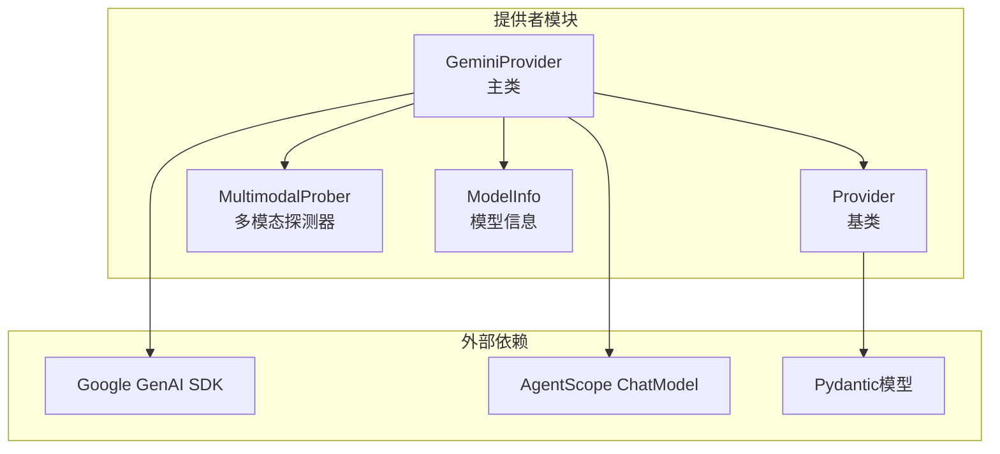
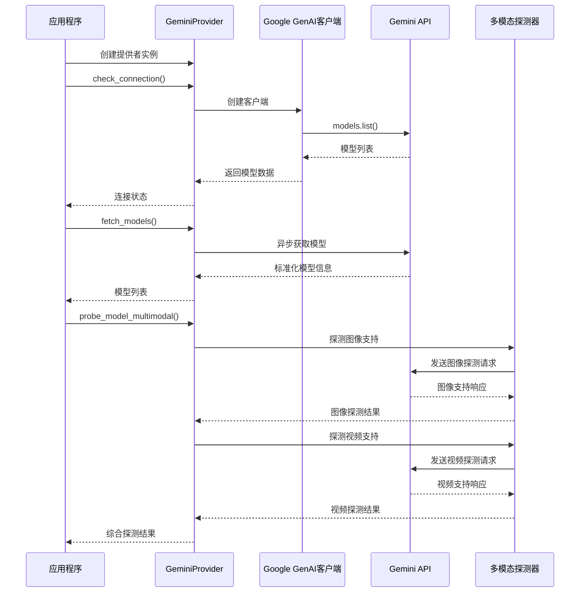
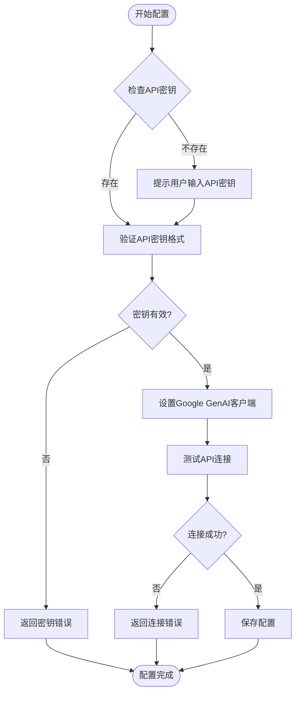
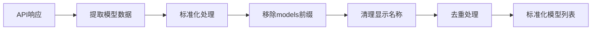
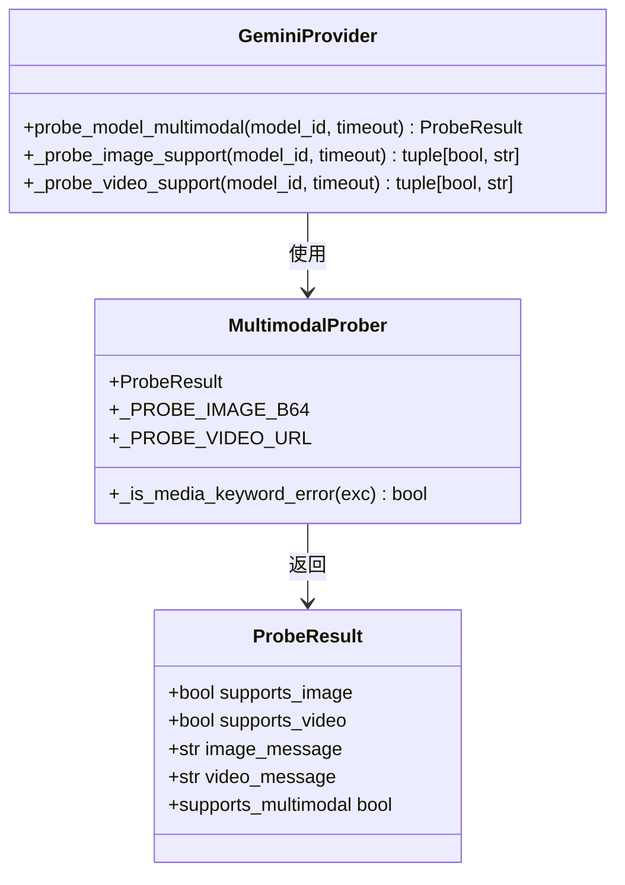
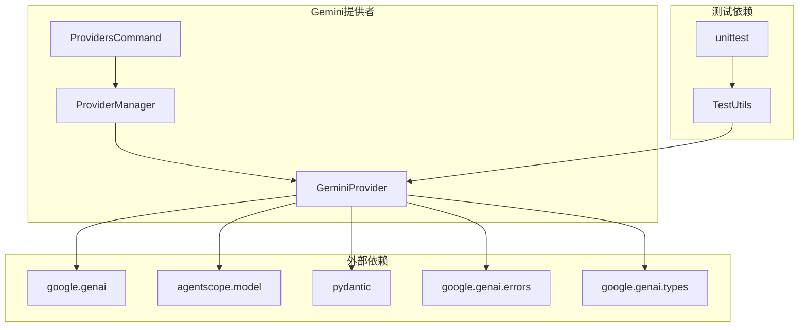

# Google Gemini提供者

<cite>
**本文档引用的文件**
- [gemini_provider.py](file://src/qwenpaw/providers/gemini_provider.py)
- [provider.py](file://src/qwenpaw/providers/provider.py)
- [multimodal_prober.py](file://src/qwenpaw/providers/multimodal_prober.py)
- [test_gemini_provider.py](file://tests/unit/providers/test_gemini_provider.py)
- [provider_manager.py](file://src/qwenpaw/providers/provider_manager.py)
- [providers_cmd.py](file://src/qwenpaw/cli/providers_cmd.py)
- [README.md](file://README.md)
- [SECURITY.md](file://SECURITY.md)
</cite>

## 目录
1. [简介](#简介)
2. [项目结构](#项目结构)
3. [核心组件](#核心组件)
4. [架构概览](#架构概览)
5. [详细组件分析](#详细组件分析)
6. [依赖关系分析](#依赖关系分析)
7. [性能考量](#性能考量)
8. [故障排除指南](#故障排除指南)
9. [结论](#结论)
10. [附录](#附录)

## 简介

Google Gemini提供者是QwenPaw项目中的一个关键组件，负责集成Google AI Studio的Gemini API服务。该提供者实现了完整的模型发现、连接测试、健康状态检查以及多模态能力支持检测功能。

本提供者基于AgentScope的原生GeminiChatModel，通过Google GenAI SDK与Google Cloud平台进行交互。它支持异步操作、错误处理、模型配置管理以及安全的API密钥存储。

## 项目结构

Gemini提供者位于QwenPaw项目的提供者模块中，采用清晰的分层架构设计：



**图表来源**
- [gemini_provider.py:27-332](file://src/qwenpaw/providers/gemini_provider.py#L27-L332)
- [provider.py:111-314](file://src/qwenpaw/providers/provider.py#L111-L314)
- [multimodal_prober.py:1-102](file://src/qwenpaw/providers/multimodal_prober.py#L1-L102)

**章节来源**
- [gemini_provider.py:1-332](file://src/qwenpaw/providers/gemini_provider.py#L1-L332)
- [provider.py:1-314](file://src/qwenpaw/providers/provider.py#L1-L314)

## 核心组件

### GeminiProvider类

GeminiProvider是提供者的核心实现，继承自Provider基类，专门用于Google Gemini API的集成。

#### 主要特性
- **异步客户端管理**：使用Google GenAI SDK的异步客户端
- **模型发现**：自动获取可用的Gemini模型列表
- **连接测试**：验证API连通性和认证有效性
- **多模态支持检测**：独立探测图像和视频处理能力
- **安全配置**：支持API密钥加密存储

#### 关键方法
- `_client(timeout)`：创建Google GenAI客户端实例
- `check_connection(timeout)`：检查API连通性
- `fetch_models(timeout)`：获取可用模型列表
- `probe_model_multimodal(model_id, timeout)`：探测多模态支持

**章节来源**
- [gemini_provider.py:27-332](file://src/qwenpaw/providers/gemini_provider.py#L27-L332)

### Provider基类体系

Provider基类提供了统一的提供者接口定义，确保所有提供者实现一致的功能。

#### 核心数据结构
- **ModelInfo**：模型信息数据类，包含ID、名称和多模态支持状态
- **ProviderInfo**：提供者配置信息，包含基础URL、API密钥等
- **ProbeResult**：多模态探测结果

#### 抽象方法
- `check_connection()`：连接性检查
- `fetch_models()`：模型列表获取
- `check_model_connection()`：单个模型连接检查
- `get_chat_model_instance()`：聊天模型实例创建

**章节来源**
- [provider.py:17-314](file://src/qwenpaw/providers/provider.py#L17-L314)

## 架构概览

Gemini提供者的整体架构采用分层设计，确保了良好的可扩展性和维护性：



**图表来源**
- [gemini_provider.py:68-160](file://src/qwenpaw/providers/gemini_provider.py#L68-L160)
- [multimodal_prober.py:75-102](file://src/qwenpaw/providers/multimodal_prober.py#L75-L102)

## 详细组件分析

### 认证与配置管理

Gemini提供者实现了完整的Google Cloud认证配置流程：

#### API密钥管理
- **加密存储**：使用provider_manager.py中的加密机制
- **安全传输**：通过HTTP选项传递API密钥
- **配置更新**：支持动态更新API密钥和基础URL

#### Google Cloud集成
- **项目ID设置**：通过API密钥关联Google Cloud项目
- **区域配置**：支持不同地区的API端点
- **配额管理**：集成Google Cloud的配额和限制



**图表来源**
- [provider_manager.py:1142-1173](file://src/qwenpaw/providers/provider_manager.py#L1142-L1173)
- [providers_cmd.py:157-205](file://src/qwenpaw/cli/providers_cmd.py#L157-L205)

**章节来源**
- [gemini_provider.py:30-34](file://src/qwenpaw/providers/gemini_provider.py#L30-L34)
- [provider_manager.py:1142-1173](file://src/qwenpaw/providers/provider_manager.py#L1142-L1173)

### 模型发现机制

Gemini提供者实现了智能的模型发现和标准化流程：

#### 模型发现流程
1. **API调用**：使用异步models.list()获取模型列表
2. **数据提取**：从响应中提取模型元数据
3. **标准化处理**：清理模型ID和显示名称
4. **去重优化**：移除重复的模型条目

#### 标准化规则
- 移除"models/"前缀，保持简洁的模型ID
- 使用显示名称或回退到模型ID
- 去除空白字符和无效条目



**图表来源**
- [gemini_provider.py:36-66](file://src/qwenpaw/providers/gemini_provider.py#L36-L66)

**章节来源**
- [gemini_provider.py:88-101](file://src/qwenpaw/providers/gemini_provider.py#L88-L101)
- [gemini_provider.py:36-66](file://src/qwenpaw/providers/gemini_provider.py#L36-L66)

### 连接测试与健康检查

提供者实现了多层次的连接测试机制：

#### 连接测试流程
1. **客户端创建**：使用提供的API密钥创建GenAI客户端
2. **异步模型列表**：调用models.list()验证API可达性
3. **异常处理**：捕获并分类不同的错误类型
4. **状态报告**：返回详细的连接状态信息

#### 错误分类处理
- **API错误**：认证失败、权限不足
- **网络错误**：连接超时、DNS解析失败
- **未知错误**：其他未预期的异常情况

**章节来源**
- [gemini_provider.py:68-86](file://src/qwenpaw/providers/gemini_provider.py#L68-L86)

### 多模态能力支持检测

Gemini提供者实现了独立的多模态能力探测机制：

#### 图像支持探测
- **探测策略**：发送16x16红色PNG图像
- **验证方法**：要求模型识别图像的主要颜色
- **阈值判断**：检查回答中是否包含"red"或"红"关键词

#### 视频支持探测
- **探测策略**：使用外部视频URL进行测试
- **验证方法**：询问视频是否包含运动内容
- **阈值判断**：检查回答中是否包含"yes"



**图表来源**
- [gemini_provider.py:142-332](file://src/qwenpaw/providers/gemini_provider.py#L142-L332)
- [multimodal_prober.py:75-102](file://src/qwenpaw/providers/multimodal_prober.py#L75-L102)

**章节来源**
- [gemini_provider.py:142-332](file://src/qwenpaw/providers/gemini_provider.py#L142-L332)
- [multimodal_prober.py:13-72](file://src/qwenpaw/providers/multimodal_prober.py#L13-L72)

### 聊天模型集成

Gemini提供者通过AgentScope的GeminiChatModel实现聊天功能：

#### 集成特性
- **流式响应**：支持实时流式输出
- **参数配置**：支持生成参数的深度合并
- **错误处理**：统一的异常处理机制

#### 参数管理
- **提供者级别**：全局默认生成参数
- **模型级别**：特定模型的覆盖参数
- **深度合并**：递归合并嵌套字典配置

**章节来源**
- [gemini_provider.py:132-140](file://src/qwenpaw/providers/gemini_provider.py#L132-L140)
- [provider.py:230-244](file://src/qwenpaw/providers/provider.py#L230-L244)

## 依赖关系分析

Gemini提供者的依赖关系相对简洁，主要依赖于外部SDK和内部框架：



**图表来源**
- [gemini_provider.py:11-22](file://src/qwenpaw/providers/gemini_provider.py#L11-L22)
- [provider_manager.py:1142-1173](file://src/qwenpaw/providers/provider_manager.py#L1142-L1173)
- [providers_cmd.py:157-205](file://src/qwenpaw/cli/providers_cmd.py#L157-L205)

**章节来源**
- [gemini_provider.py:11-22](file://src/qwenpaw/providers/gemini_provider.py#L11-L22)
- [test_gemini_provider.py:1-341](file://tests/unit/providers/test_gemini_provider.py#L1-L341)

## 性能考量

### 异步操作优化
- **异步模型列表**：使用异步API减少阻塞
- **超时控制**：合理的超时设置避免长时间等待
- **连接复用**：客户端实例的合理管理

### 内存管理
- **数据去重**：自动去除重复的模型条目
- **资源清理**：及时释放临时资源和连接
- **缓存策略**：避免重复的API调用

### 错误恢复
- **重试机制**：在网络不稳定时的自动重试
- **降级策略**：在部分功能不可用时的降级处理
- **监控告警**：异常情况下的及时通知

## 故障排除指南

### 常见问题诊断

#### API密钥相关问题
- **401未授权**：检查API密钥的有效性和格式
- **403禁止访问**：确认项目已启用Gemini API
- **400错误**：验证请求格式和参数完整性

#### 连接问题
- **DNS解析失败**：检查网络连接和代理设置
- **超时错误**：调整超时参数或检查网络延迟
- **SSL证书问题**：验证系统时间和证书配置

#### 模型支持问题
- **模型不可用**：确认模型ID正确且已启用
- **多模态不支持**：检查模型版本和功能限制
- **配额不足**：查看Google Cloud配额使用情况

**章节来源**
- [gemini_provider.py:76-86](file://src/qwenpaw/providers/gemini_provider.py#L76-L86)
- [gemini_provider.py:121-130](file://src/qwenpaw/providers/gemini_provider.py#L121-L130)

### 安全最佳实践

#### 密钥管理
- **加密存储**：使用provider_manager的加密机制
- **最小权限**：为API密钥设置必要的权限范围
- **定期轮换**：建立API密钥的定期更换流程

#### 网络安全
- **HTTPS强制**：确保所有API通信使用HTTPS
- **防火墙配置**：允许必要的出站连接
- **代理安全**：在企业网络环境中配置安全代理

**章节来源**
- [SECURITY.md:57-158](file://SECURITY.md#L57-L158)
- [provider_manager.py:1142-1173](file://src/qwenpaw/providers/provider_manager.py#L1142-L1173)

## 结论

Google Gemini提供者为QwenPaw项目提供了完整、可靠的Google AI Studio集成解决方案。通过精心设计的架构和全面的功能实现，该提供者不仅满足了基本的API集成需求，还提供了高级的多模态能力检测和安全配置管理。

### 主要优势
- **完整的功能覆盖**：从认证到模型管理的全流程支持
- **优秀的错误处理**：完善的异常分类和恢复机制
- **安全的设计理念**：加密存储和最小权限原则
- **良好的扩展性**：基于抽象基类的可扩展架构

### 技术亮点
- **异步编程模式**：提升系统的响应性和吞吐量
- **智能探测机制**：自动检测和验证多模态能力
- **配置管理系统**：灵活的参数管理和动态更新
- **测试驱动开发**：全面的单元测试确保代码质量

该提供者为开发者和用户提供了一个稳定、安全、易用的Google Gemini API集成接口，是构建智能应用的理想选择。

## 附录

### 配置示例

#### 基础配置
```json
{
  "id": "gemini",
  "name": "Google Gemini",
  "base_url": "https://generativelanguage.googleapis.com",
  "api_key": "YOUR_API_KEY",
  "chat_model": "GeminiChatModel",
  "require_api_key": true,
  "support_model_discovery": true,
  "support_connection_check": true
}
```

#### 高级配置
```json
{
  "generate_kwargs": {
    "temperature": 0.7,
    "max_output_tokens": 1024,
    "top_p": 0.9,
    "top_k": 40
  },
  "extra_models": [
    {
      "id": "gemini-pro-vision",
      "name": "Gemini Pro Vision",
      "supports_multimodal": true,
      "generate_kwargs": {
        "temperature": 0.4
      }
    }
  ]
}
```

### 错误码参考

| 错误码 | 类型 | 描述 | 解决方案 |
|--------|------|------|----------|
| 400 | 请求错误 | API请求格式错误 | 检查请求参数和格式 |
| 401 | 未授权 | API密钥无效或缺失 | 验证API密钥配置 |
| 403 | 禁止访问 | 项目未启用或权限不足 | 启用项目API并检查权限 |
| 429 | 请求过多 | 超出配额限制 | 等待配额重置或升级计划 |
| 500 | 服务器错误 | 服务器内部错误 | 稍后重试或联系支持 |

### 性能优化建议

#### 网络优化
- **连接池**：复用HTTP连接减少建立开销
- **超时设置**：根据网络环境调整超时参数
- **重试策略**：实现指数退避的重试机制

#### 缓存策略
- **模型列表缓存**：缓存模型信息减少API调用
- **探测结果缓存**：缓存多模态支持检测结果
- **配置缓存**：缓存提供者配置信息

#### 监控指标
- **响应时间**：监控API调用的平均响应时间
- **错误率**：跟踪各类错误的发生频率
- **配额使用**：监控API配额的使用情况