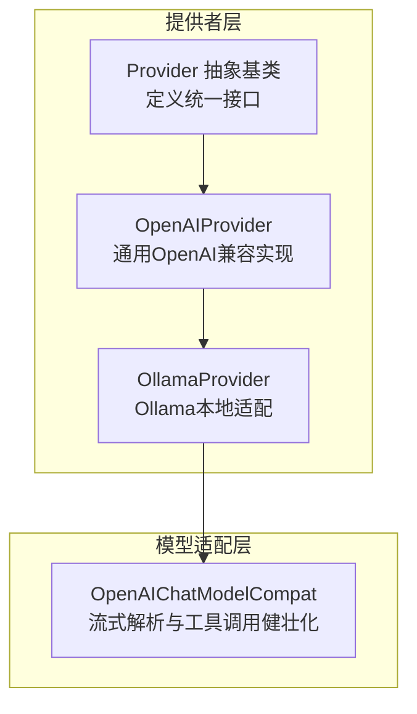
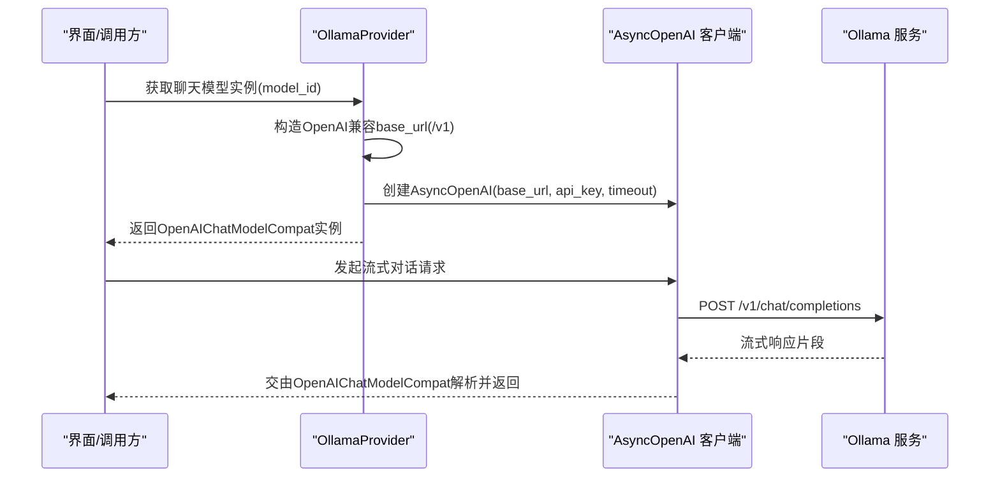
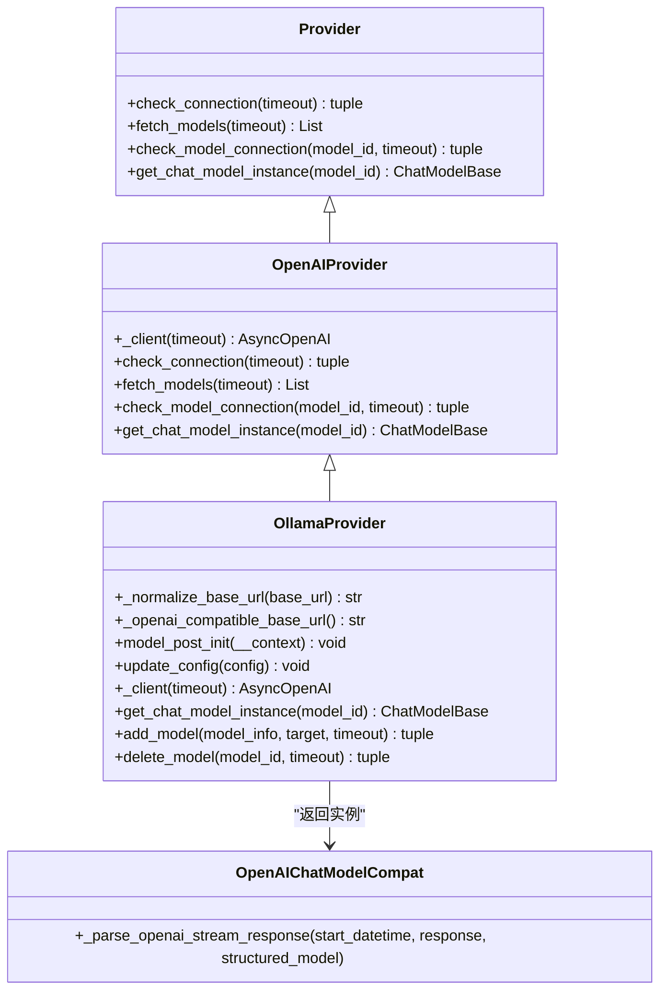
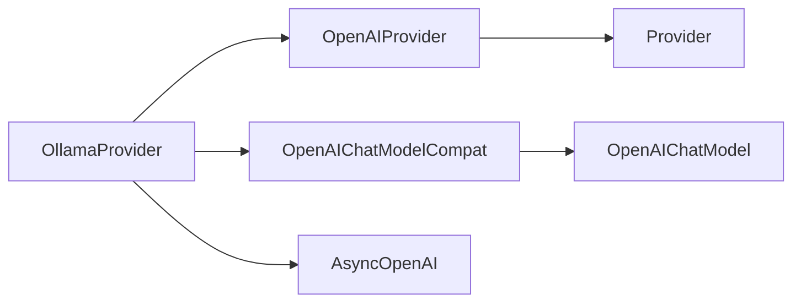

# Ollama提供者

<cite>
**本文引用的文件**
- [ollama_provider.py](file://src/qwenpaw/providers/ollama_provider.py)
- [openai_provider.py](file://src/qwenpaw/providers/openai_provider.py)
- [provider.py](file://src/qwenpaw/providers/provider.py)
- [openai_chat_model_compat.py](file://src/qwenpaw/providers/openai_chat_model_compat.py)
- [test_ollama_provider.py](file://tests/unit/providers/test_ollama_provider.py)
- [README.md](file://README.md)
- [README_zh.md](file://README_zh.md)
- [models.en.md](file://website/public/docs/models.en.md)
- [capability_baseline.py](file://src/qwenpaw/providers/capability_baseline.py)
- [providers_cmd.py](file://src/qwenpaw/cli/providers_cmd.py)
- [llamacpp.py](file://src/qwenpaw/local_models/llamacpp.py)
- [local_models.py](file://src/qwenpaw/app/routers/local_models.py)
</cite>

## 目录
1. [简介](#简介)
2. [项目结构](#项目结构)
3. [核心组件](#核心组件)
4. [架构总览](#架构总览)
5. [详细组件分析](#详细组件分析)
6. [依赖关系分析](#依赖关系分析)
7. [性能考虑](#性能考虑)
8. [故障排除指南](#故障排除指南)
9. [结论](#结论)
10. [附录](#附录)

## 简介
本文件面向Ollama提供者的技术文档，围绕OllamaProvider类的实现进行系统化说明，涵盖以下主题：
- OllamaProvider的类结构、基址URL归一化策略与HTTP客户端构造
- 与OpenAI兼容的端点适配与模型名称映射
- 连接状态检测与模型可用性探测
- 本地模型服务的部署配置、网络与防火墙注意事项
- 性能优化、内存管理与并发处理最佳实践
- 故障排除方法与常见问题诊断

## 项目结构
Ollama提供者位于提供者体系中，继承自OpenAI兼容提供者，并通过OpenAI兼容的聊天模型包装器对接具体模型实例。

图表来源
- [provider.py:111-314](file://src/qwenpaw/providers/provider.py#L111-L314)
- [openai_provider.py:25-163](file://src/qwenpaw/providers/openai_provider.py#L25-L163)
- [ollama_provider.py:16-85](file://src/qwenpaw/providers/ollama_provider.py#L16-L85)
- [openai_chat_model_compat.py:191-313](file://src/qwenpaw/providers/openai_chat_model_compat.py#L191-L313)

章节来源
- [provider.py:111-314](file://src/qwenpaw/providers/provider.py#L111-L314)
- [openai_provider.py:25-163](file://src/qwenpaw/providers/openai_provider.py#L25-L163)
- [ollama_provider.py:16-85](file://src/qwenpaw/providers/ollama_provider.py#L16-L85)

## 核心组件
- OllamaProvider：针对Ollama本地LLM服务的提供者实现，负责：
  - 基址URL归一化（去除末尾斜杠与多余的/v1后缀）
  - 构造OpenAI兼容的base_url（追加单个/v1后缀）
  - 从环境变量或默认值初始化base_url
  - 生成OpenAI兼容的异步客户端
  - 返回OpenAIChatModelCompat实例用于对话生成
  - 不支持动态添加/删除模型（由Ollama侧管理）

- OpenAIProvider：提供通用的连接检查、模型列表获取、模型连通性探测与多模态探测能力，作为OllamaProvider的父类。

- OpenAIChatModelCompat：对OpenAI风格的流式响应进行健壮化解析，处理工具调用标签提取与额外内容透传。

章节来源
- [ollama_provider.py:16-85](file://src/qwenpaw/providers/ollama_provider.py#L16-L85)
- [openai_provider.py:25-163](file://src/qwenpaw/providers/openai_provider.py#L25-L163)
- [openai_chat_model_compat.py:191-313](file://src/qwenpaw/providers/openai_chat_model_compat.py#L191-L313)

## 架构总览
OllamaProvider通过OpenAI兼容模式与Ollama服务交互，内部使用OpenAI异步客户端访问/v1端点；模型实例由OpenAIChatModelCompat封装，以保证流式解析与工具调用的稳定性。

图表来源
- [ollama_provider.py:47-85](file://src/qwenpaw/providers/ollama_provider.py#L47-L85)
- [openai_chat_model_compat.py:191-313](file://src/qwenpaw/providers/openai_chat_model_compat.py#L191-L313)

## 详细组件分析

### OllamaProvider 类分析
- 基址URL归一化
  - 移除末尾多余斜杠与/v1后缀，确保与OpenAI兼容端点拼接时仅保留一个/v1。
  - 初始化时可从环境变量读取OLLAMA_HOST，否则回退至默认地址。
- OpenAI兼容端点
  - 在base_url后追加单个/v1，形成OpenAI兼容的完整端点。
- 异步客户端
  - 使用AsyncOpenAI构造客户端，传入base_url、api_key与超时时间。
- 模型实例
  - 返回OpenAIChatModelCompat实例，传入模型名、流式开关、API密钥、客户端参数与生成参数。
- 动态模型管理
  - 不支持add_model/delete_model，模型生命周期由Ollama侧管理。

图表来源
- [provider.py:111-314](file://src/qwenpaw/providers/provider.py#L111-L314)
- [openai_provider.py:25-163](file://src/qwenpaw/providers/openai_provider.py#L25-L163)
- [ollama_provider.py:16-85](file://src/qwenpaw/providers/ollama_provider.py#L16-L85)
- [openai_chat_model_compat.py:191-313](file://src/qwenpaw/providers/openai_chat_model_compat.py#L191-L313)

章节来源
- [ollama_provider.py:16-85](file://src/qwenpaw/providers/ollama_provider.py#L16-L85)
- [openai_provider.py:25-163](file://src/qwenpaw/providers/openai_provider.py#L25-L163)
- [provider.py:111-314](file://src/qwenpaw/providers/provider.py#L111-L314)

### 服务发现与模型列表获取
- OllamaProvider不支持动态模型发现与添加，模型列表由Ollama侧维护。
- 文档与界面提供了“发现模型”的操作流程，实际通过Ollama命令行导入模型后，在QwenPaw中进行连接测试与使用。

章节来源
- [ollama_provider.py:54-73](file://src/qwenpaw/providers/ollama_provider.py#L54-L73)
- [models.en.md:96-98](file://website/public/docs/models.en.md#L96-L98)

### 连接状态检测
- OllamaProvider复用OpenAIProvider的连接检查逻辑，通过调用/v1/models验证服务可达性。
- 单独模型连通性测试通过发送极短文本并消费首个流式片段来确认模型可用。

章节来源
- [openai_provider.py:57-124](file://src/qwenpaw/providers/openai_provider.py#L57-L124)

### 与本地模型的兼容性适配
- 模型名称映射
  - OllamaProvider直接使用传入的model_id作为模型标识，无需额外映射。
- 参数传递
  - 生成参数通过Provider.get_effective_generate_kwargs合并提供者级与模型级配置。
- 流式解析健壮化
  - OpenAIChatModelCompat对工具调用标签与异常流式片段进行清洗与补全，提升跨模型稳定性。

章节来源
- [openai_chat_model_compat.py:191-313](file://src/qwenpaw/providers/openai_chat_model_compat.py#L191-L313)
- [provider.py:230-244](file://src/qwenpaw/providers/provider.py#L230-L244)

### 部署配置、网络与防火墙
- 默认地址与环境变量
  - 若未显式配置，OllamaProvider会尝试从环境变量读取OLLAMA_HOST，否则使用默认地址。
- Docker容器访问宿主服务
  - 容器内localhost指向容器自身，需通过--add-host或host.docker.internal访问宿主Ollama服务。
  - 可选host网络模式（Linux）直接共享宿主网络。
- 端口与路径
  - Ollama默认端口为11434；容器访问时需将Base URL设为http://host.docker.internal:11434。

章节来源
- [ollama_provider.py:36-41](file://src/qwenpaw/providers/ollama_provider.py#L36-L41)
- [README.md:245-274](file://README.md#L245-L274)
- [README_zh.md:355-384](file://README_zh.md#L355-L384)

### 本地模型性能优化与并发处理
- llama.cpp服务器
  - 提供安装性检查、服务器状态查询与就绪检测，避免重复启动与无效等待。
- 并发与资源
  - 通过进程上下文与下载控制器管理本地模型生命周期，减少资源竞争。
- 生成参数
  - 通过Provider级别的generate_kwargs统一配置温度、采样等参数，便于按模型精细调优。

章节来源
- [llamacpp.py:89-123](file://src/qwenpaw/local_models/llamacpp.py#L89-L123)
- [local_models.py:182-210](file://src/qwenpaw/app/routers/local_models.py#L182-L210)
- [provider.py:100-103](file://src/qwenpaw/providers/provider.py#L100-L103)

## 依赖关系分析
- 继承关系
  - OllamaProvider继承Provider与OpenAIProvider，复用其连接检查、模型探测与多模态探测能力。
- 组件耦合
  - OllamaProvider与OpenAIChatModelCompat解耦，通过参数传递完成客户端与生成参数注入。
- 外部依赖
  - AsyncOpenAI客户端用于与Ollama的OpenAI兼容端点通信。
  - Ollama服务本身负责模型加载与推理。

图表来源
- [ollama_provider.py:16-85](file://src/qwenpaw/providers/ollama_provider.py#L16-L85)
- [openai_provider.py:25-33](file://src/qwenpaw/providers/openai_provider.py#L25-L33)
- [openai_chat_model_compat.py:11-13](file://src/qwenpaw/providers/openai_chat_model_compat.py#L11-L13)

章节来源
- [ollama_provider.py:16-85](file://src/qwenpaw/providers/ollama_provider.py#L16-L85)
- [openai_provider.py:25-33](file://src/qwenpaw/providers/openai_provider.py#L25-L33)
- [provider.py:111-163](file://src/qwenpaw/providers/provider.py#L111-L163)

## 性能考虑
- 端点拼接与URL归一化
  - 仅保留单个/v1后缀，避免重复拼接导致的错误端点与额外重试开销。
- 超时控制
  - 客户端与模型连通性测试均支持超时参数，建议根据网络状况与模型大小调整。
- 流式解析健壮化
  - 对工具调用标签与异常片段进行清洗，减少因模型输出不规范导致的解析失败与重试。
- 本地模型管理
  - 通过状态检查与就绪检测避免不必要的重启与资源浪费。

章节来源
- [ollama_provider.py:19-34](file://src/qwenpaw/providers/ollama_provider.py#L19-L34)
- [openai_provider.py:57-124](file://src/qwenpaw/providers/openai_provider.py#L57-L124)
- [openai_chat_model_compat.py:191-313](file://src/qwenpaw/providers/openai_chat_model_compat.py#L191-L313)

## 故障排除指南
- 服务状态检查
  - 使用Provider的连接检查与模型连通性测试定位服务不可达或模型不可用问题。
- 模型加载失败
  - 确认Ollama已正确导入模型并通过命令行可用；在QwenPaw中执行“发现模型”与“测试连接”。
- 网络连接问题
  - 容器内访问宿主Ollama时，确保Base URL为host.docker.internal:11434，并正确添加--add-host。
- 环境变量与默认地址
  - 如未显式配置，检查OLLAMA_HOST是否正确，或使用默认地址http://127.0.0.1:11434。

章节来源
- [openai_provider.py:57-124](file://src/qwenpaw/providers/openai_provider.py#L57-L124)
- [models.en.md:49-98](file://website/public/docs/models.en.md#L49-L98)
- [README.md:245-274](file://README.md#L245-L274)
- [README_zh.md:355-384](file://README_zh.md#L355-L384)

## 结论
OllamaProvider通过OpenAI兼容模式与Ollama服务无缝集成，具备简洁的URL归一化、稳定的流式解析与完善的连接检测能力。结合文档与CLI工具，用户可在本地或容器环境中快速完成Ollama服务的部署与配置，并通过统一的Provider接口进行模型管理与调用。

## 附录
- 关键实现路径参考
  - URL归一化与端点拼接：[ollama_provider.py:19-34](file://src/qwenpaw/providers/ollama_provider.py#L19-L34)
  - 客户端构造与模型实例返回：[ollama_provider.py:47-85](file://src/qwenpaw/providers/ollama_provider.py#L47-L85)
  - 连接检查与模型连通性测试：[openai_provider.py:57-124](file://src/qwenpaw/providers/openai_provider.py#L57-L124)
  - 流式解析健壮化：[openai_chat_model_compat.py:191-313](file://src/qwenpaw/providers/openai_chat_model_compat.py#L191-L313)
  - Docker容器访问宿主Ollama：[README.md:245-274](file://README.md#L245-L274)、[README_zh.md:355-384](file://README_zh.md#L355-L384)
  - 本地模型管理与就绪检测：[llamacpp.py:89-123](file://src/qwenpaw/local_models/llamacpp.py#L89-L123)、[local_models.py:182-210](file://src/qwenpaw/app/routers/local_models.py#L182-L210)