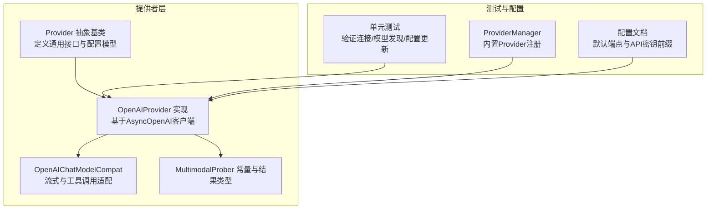
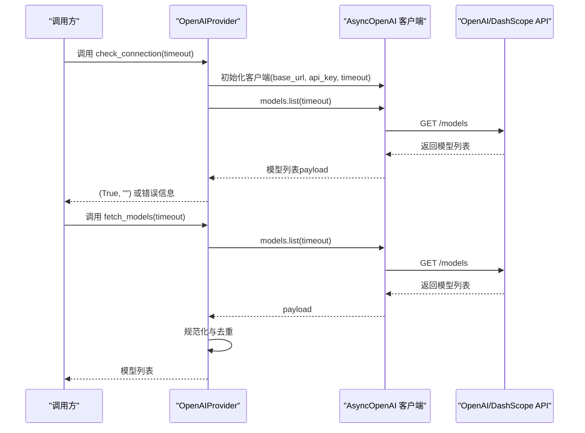
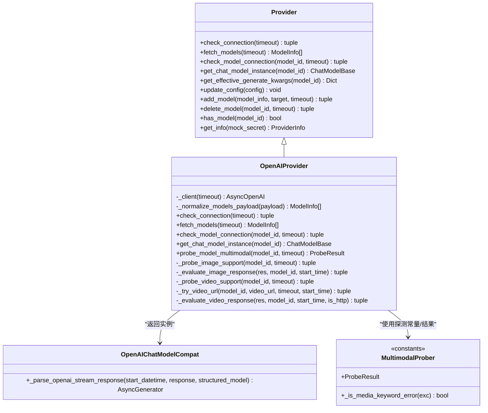
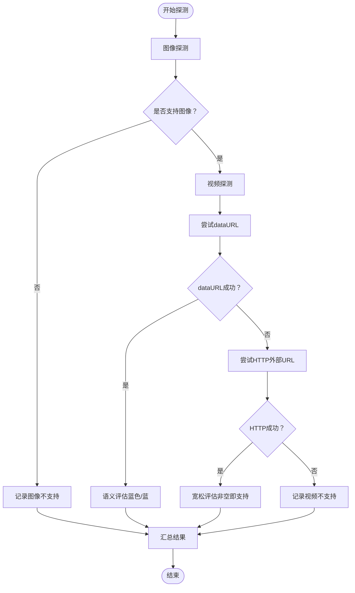

# OpenAI提供者

<cite>
**本文引用的文件列表**
- [openai_provider.py](file://src/qwenpaw/providers/openai_provider.py)
- [openai_chat_model_compat.py](file://src/qwenpaw/providers/openai_chat_model_compat.py)
- [multimodal_prober.py](file://src/qwenpaw/providers/multimodal_prober.py)
- [provider.py](file://src/qwenpaw/providers/provider.py)
- [tag_parser.py](file://src/qwenpaw/local_models/tag_parser.py)
- [test_openai_provider.py](file://tests/unit/providers/test_openai_provider.py)
- [provider_manager.py](file://src/qwenpaw/providers/provider_manager.py)
- [config.en.md](file://website/public/docs/config.en.md)
</cite>

## 目录
1. [简介](#简介)
2. [项目结构](#项目结构)
3. [核心组件](#核心组件)
4. [架构总览](#架构总览)
5. [详细组件分析](#详细组件分析)
6. [依赖关系分析](#依赖关系分析)
7. [性能考量](#性能考量)
8. [故障排查指南](#故障排查指南)
9. [结论](#结论)
10. [附录：配置与示例](#附录配置与示例)

## 简介
本文件面向OpenAI提供者（OpenAIProvider）的实现进行系统化技术文档化，覆盖以下关键主题：
- AsyncOpenAI客户端配置与基础URL设置
- API密钥管理与前缀校验
- 模型发现机制（models.list）
- 连接测试与健康检查策略
- 多模态探测（图像/视频）实现原理
- 兼容性适配层OpenAIChatModelCompat的作用与参数
- DashScope阿里云等兼容端点的支持说明
- 错误处理策略与性能优化建议
- 配置示例与最佳实践

## 项目结构
OpenAI提供者位于providers子模块中，围绕Provider抽象基类构建，具体实现集中在openai_provider.py，并通过openai_chat_model_compat.py提供流式响应与工具调用解析的兼容适配。多模态探测逻辑在multimodal_prober.py中共享常量与数据类型，测试用例位于tests目录。

图表来源
- [provider.py:111-314](file://src/qwenpaw/providers/provider.py#L111-L314)
- [openai_provider.py:25-550](file://src/qwenpaw/providers/openai_provider.py#L25-L550)
- [openai_chat_model_compat.py:191-313](file://src/qwenpaw/providers/openai_chat_model_compat.py#L191-L313)
- [multimodal_prober.py:75-102](file://src/qwenpaw/providers/multimodal_prober.py#L75-L102)
- [provider_manager.py:472-490](file://src/qwenpaw/providers/provider_manager.py#L472-L490)
- [config.en.md:530-553](file://website/public/docs/config.en.md#L530-L553)

章节来源
- [provider.py:111-314](file://src/qwenpaw/providers/provider.py#L111-L314)
- [openai_provider.py:25-550](file://src/qwenpaw/providers/openai_provider.py#L25-L550)
- [openai_chat_model_compat.py:191-313](file://src/qwenpaw/providers/openai_chat_model_compat.py#L191-L313)
- [multimodal_prober.py:75-102](file://src/qwenpaw/providers/multimodal_prober.py#L75-L102)
- [provider_manager.py:472-490](file://src/qwenpaw/providers/provider_manager.py#L472-L490)
- [config.en.md:530-553](file://website/public/docs/config.en.md#L530-L553)

## 核心组件
- Provider抽象基类：定义ProviderInfo配置模型、通用方法（如check_connection、fetch_models、check_model_connection、get_chat_model_instance、get_effective_generate_kwargs等），以及模型增删与配置更新能力。
- OpenAIProvider：继承Provider，实现基于AsyncOpenAI的客户端封装、模型发现、连接测试、单模型可用性检查、多模态探测、以及返回OpenAIChatModelCompat实例。
- OpenAIChatModelCompat：在AgentScope的OpenAIChatModel基础上，增强对流式响应中工具调用块的健壮解析与extra_content透传，提升跨模型兼容性。
- MultimodalProber：提供图像/视频探测所需的共享常量（探测图片/视频编码）、探测结果数据结构ProbeResult及媒体关键词判断辅助函数。
- ProviderManager：内置Provider注册（含DashScope、阿里云Coding Plan等），并设置freeze_url、support_connection_check等属性。
- 单元测试：覆盖连接检查、模型发现、单模型连接检查、配置更新等行为。

章节来源
- [provider.py:17-47](file://src/qwenpaw/providers/provider.py#L17-L47)
- [openai_provider.py:25-163](file://src/qwenpaw/providers/openai_provider.py#L25-L163)
- [openai_chat_model_compat.py:191-313](file://src/qwenpaw/providers/openai_chat_model_compat.py#L191-L313)
- [multimodal_prober.py:75-102](file://src/qwenpaw/providers/multimodal_prober.py#L75-L102)
- [provider_manager.py:472-490](file://src/qwenpaw/providers/provider_manager.py#L472-L490)
- [test_openai_provider.py:21-269](file://tests/unit/providers/test_openai_provider.py#L21-L269)

## 架构总览
OpenAIProvider以Provider为抽象基座，向上提供统一的提供者接口；向下使用AsyncOpenAI客户端访问OpenAI或兼容端点（如DashScope）。多模态探测通过专用探测器与语义验证避免“静默接受”造成的误判；兼容适配层负责流式解析与工具调用的健壮性。

图表来源
- [openai_provider.py:57-83](file://src/qwenpaw/providers/openai_provider.py#L57-L83)
- [openai_provider.py:73-83](file://src/qwenpaw/providers/openai_provider.py#L73-L83)

章节来源
- [openai_provider.py:28-33](file://src/qwenpaw/providers/openai_provider.py#L28-L33)
- [openai_provider.py:57-83](file://src/qwenpaw/providers/openai_provider.py#L57-L83)

## 详细组件分析

### OpenAIProvider类实现
- AsyncOpenAI客户端配置
  - 通过私有方法构造AsyncOpenAI实例，接收base_url、api_key、timeout参数，用于后续所有API调用。
  - 在get_chat_model_instance中，根据base_url注入client_kwargs，同时针对DashScope兼容端点设置默认请求头（x-dashscope-agentapp或X-DashScope-Cdpl）。
- API密钥管理
  - 支持api_key_prefix前缀校验；Provider.update_config按字段更新，且自定义Provider允许更新chat_model。
- 模型发现机制
  - fetch_models调用client.models.list，将返回payload标准化为ModelInfo列表，执行去重与名称回填。
  - 对异常进行捕获并返回空列表，保证健壮性。
- 连接测试与健康检查
  - check_connection直接调用models.list，对APIError与未知异常分别返回False与错误信息。
  - check_model_connection发送最小文本消息并开启流式输出，消费首个分片以确认可用性。
- 多模态探测
  - probe_model_multimodal先探测图像，再在图像通过后探测视频；若图像失败则跳过视频探测。
  - 图像探测：发送16x16纯红色PNG的dataURL，要求模型回答“红色”或“红”，否则判定不支持。
  - 视频探测：优先尝试dataURL，再尝试HTTP外部URL；对400错误采用格式回退策略；对HTTP探测采用宽松阈值（非空即视为支持）。
  - 语义验证：同时检查message.content与reasoning_content，避免某些模型仅接受payload但忽略内容。
- 兼容适配层
  - get_chat_model_instance返回OpenAIChatModelCompat实例，启用流式与禁用流式工具解析，传递client_kwargs与生成参数。
- DashScope兼容端点
  - 内置DASHSCOPE_BASE_URL与CODING_DASHSCOPE_BASE_URL常量；ProviderManager注册内置Provider时冻结URL并设置support_connection_check。

图表来源
- [provider.py:111-314](file://src/qwenpaw/providers/provider.py#L111-L314)
- [openai_provider.py:25-550](file://src/qwenpaw/providers/openai_provider.py#L25-L550)
- [openai_chat_model_compat.py:191-313](file://src/qwenpaw/providers/openai_chat_model_compat.py#L191-L313)
- [multimodal_prober.py:75-102](file://src/qwenpaw/providers/multimodal_prober.py#L75-L102)

章节来源
- [openai_provider.py:28-33](file://src/qwenpaw/providers/openai_provider.py#L28-L33)
- [openai_provider.py:57-83](file://src/qwenpaw/providers/openai_provider.py#L57-L83)
- [openai_provider.py:85-124](file://src/qwenpaw/providers/openai_provider.py#L85-L124)
- [openai_provider.py:126-163](file://src/qwenpaw/providers/openai_provider.py#L126-L163)
- [openai_provider.py:165-197](file://src/qwenpaw/providers/openai_provider.py#L165-L197)
- [openai_provider.py:199-350](file://src/qwenpaw/providers/openai_provider.py#L199-L350)
- [openai_provider.py:352-549](file://src/qwenpaw/providers/openai_provider.py#L352-L549)

### 多模态探测流程（图像/视频）
- 图像探测
  - 发送16x16纯红色PNG的dataURL，要求模型回答“红色/红”关键词；若API返回400或媒体关键词错误，则直接判定不支持；否则进行语义验证。
- 视频探测
  - 优先尝试dataURL（带H.264 MP4），失败时回退到HTTP外部URL；对400错误表示该格式不被接受，继续尝试下一个；对HTTP探测采用宽松阈值（非空即支持）。
- 语义验证
  - 同时检查content与reasoning_content，避免“静默接受”模型忽略媒体内容的情况。

图表来源
- [openai_provider.py:165-197](file://src/qwenpaw/providers/openai_provider.py#L165-L197)
- [openai_provider.py:199-350](file://src/qwenpaw/providers/openai_provider.py#L199-L350)
- [openai_provider.py:352-549](file://src/qwenpaw/providers/openai_provider.py#L352-L549)
- [multimodal_prober.py:13-72](file://src/qwenpaw/providers/multimodal_prober.py#L13-L72)

章节来源
- [openai_provider.py:165-197](file://src/qwenpaw/providers/openai_provider.py#L165-L197)
- [openai_provider.py:199-350](file://src/qwenpaw/providers/openai_provider.py#L199-L350)
- [openai_provider.py:352-549](file://src/qwenpaw/providers/openai_provider.py#L352-L549)
- [multimodal_prober.py:75-102](file://src/qwenpaw/providers/multimodal_prober.py#L75-L102)

### 兼容性适配层OpenAIChatModelCompat
- 流式响应清洗
  - 对tool_calls进行归一化与过滤，丢弃不可用项，确保下游解析稳定。
- extra_content透传
  - 从工具调用块中提取extra_content（如Gemini thought_signature），并附加到对应的tool_use块上。
- 思维/文本块中的工具调用解析
  - 提取<thinking>与