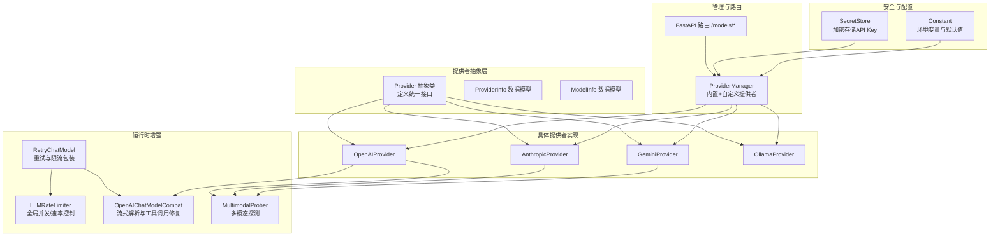
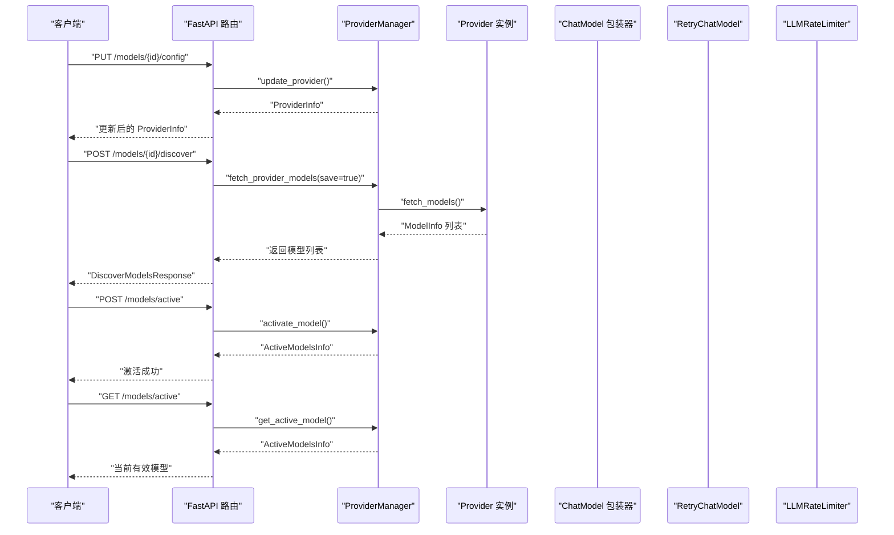
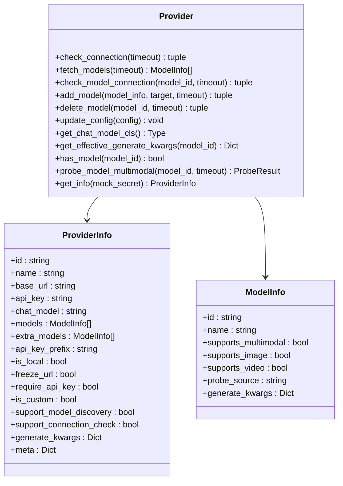
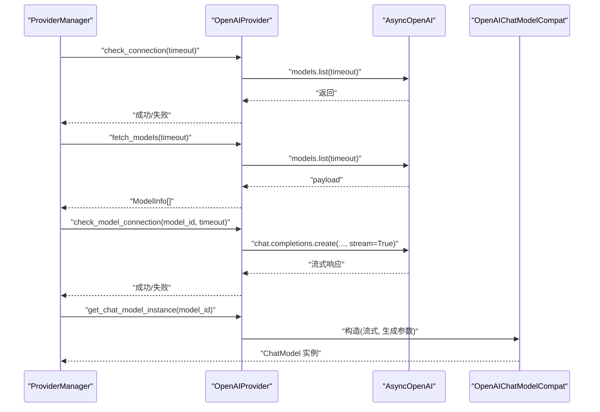
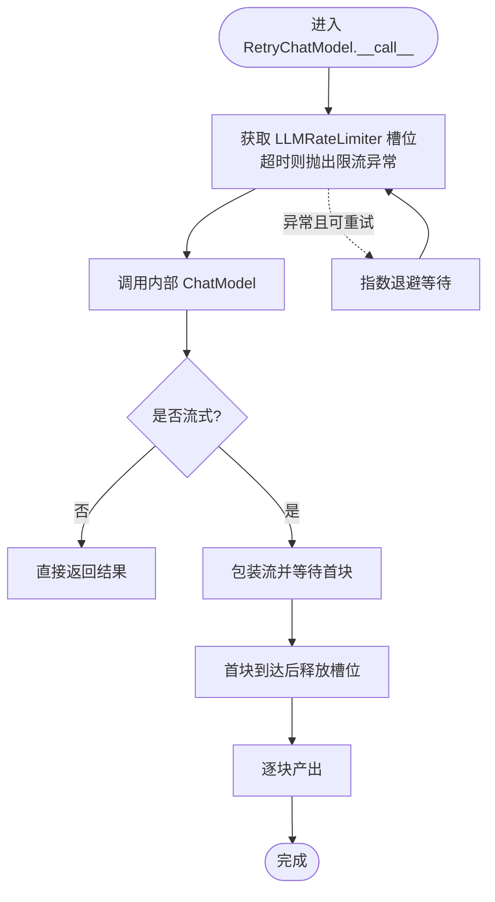
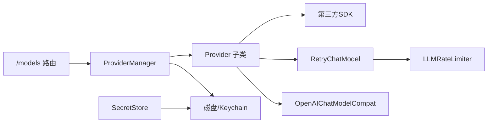

# 云模型集成

<cite>
**本文引用的文件**
- [provider.py](file://src/qwenpaw/providers/provider.py)
- [provider_manager.py](file://src/qwenpaw/providers/provider_manager.py)
- [openai_provider.py](file://src/qwenpaw/providers/openai_provider.py)
- [anthropic_provider.py](file://src/qwenpaw/providers/anthropic_provider.py)
- [gemini_provider.py](file://src/qwenpaw/providers/gemini_provider.py)
- [ollama_provider.py](file://src/qwenpaw/providers/ollama_provider.py)
- [multimodal_prober.py](file://src/qwenpaw/providers/multimodal_prober.py)
- [openai_chat_model_compat.py](file://src/qwenpaw/providers/openai_chat_model_compat.py)
- [retry_chat_model.py](file://src/qwenpaw/providers/retry_chat_model.py)
- [providers.py](file://src/qwenpaw/app/routers/providers.py)
- [secret_store.py](file://src/qwenpaw/security/secret_store.py)
- [constant.py](file://src/qwenpaw/constant.py)
- [models.py](file://src/qwenpaw/providers/models.py)
- [rate_limiter.py](file://src/qwenpaw/providers/rate_limiter.py)
</cite>

## 目录
1. [简介](#简介)
2. [项目结构](#项目结构)
3. [核心组件](#核心组件)
4. [架构总览](#架构总览)
5. [详细组件分析](#详细组件分析)
6. [依赖分析](#依赖分析)
7. [性能考虑](#性能考虑)
8. [故障排查指南](#故障排查指南)
9. [结论](#结论)
10. [附录](#附录)

## 简介
本文件面向QwenPaw的云模型集成，系统性阐述多提供商（OpenAI、Anthropic、Google Gemini、Ollama等）的实现与适配方式，覆盖API适配层、认证机制、配置参数、模型发现、连接测试与健康检查、错误处理策略、性能优化与速率限制、故障转移与自定义提供者开发流程。文档以代码为依据，辅以图示帮助不同技术背景的读者理解与落地。

## 项目结构
云模型集成相关的核心代码集中在src/qwenpaw/providers目录，配合应用路由层（src/qwenpaw/app/routers）与安全存储（src/qwenpaw/security）、常量配置（src/qwenpaw/constant.py）共同构成完整的模型提供者体系。

**图表来源**
- [provider.py:111-314](file://src/qwenpaw/providers/provider.py#L111-L314)
- [openai_provider.py:25-550](file://src/qwenpaw/providers/openai_provider.py#L25-L550)
- [anthropic_provider.py:27-256](file://src/qwenpaw/providers/anthropic_provider.py#L27-L256)
- [gemini_provider.py:27-332](file://src/qwenpaw/providers/gemini_provider.py#L27-L332)
- [ollama_provider.py:16-86](file://src/qwenpaw/providers/ollama_provider.py#L16-L86)
- [provider_manager.py:670-800](file://src/qwenpaw/providers/provider_manager.py#L670-L800)
- [providers.py:1-634](file://src/qwenpaw/app/routers/providers.py#L1-L634)
- [retry_chat_model.py:204-477](file://src/qwenpaw/providers/retry_chat_model.py#L204-L477)
- [rate_limiter.py:30-279](file://src/qwenpaw/providers/rate_limiter.py#L30-L279)
- [openai_chat_model_compat.py:191-313](file://src/qwenpaw/providers/openai_chat_model_compat.py#L191-L313)
- [multimodal_prober.py:75-102](file://src/qwenpaw/providers/multimodal_prober.py#L75-L102)
- [secret_store.py:1-291](file://src/qwenpaw/security/secret_store.py#L1-L291)
- [constant.py:168-282](file://src/qwenpaw/constant.py#L168-L282)

**章节来源**
- [provider.py:1-314](file://src/qwenpaw/providers/provider.py#L1-L314)
- [provider_manager.py:1-800](file://src/qwenpaw/providers/provider_manager.py#L1-L800)
- [providers.py:1-634](file://src/qwenpaw/app/routers/providers.py#L1-L634)

## 核心组件
- Provider/ProviderInfo/ModelInfo：定义提供者元数据、能力开关与生成参数合并策略；提供统一的连接检查、模型发现、单模型连通性测试、实例化聊天模型等接口。
- 具体提供者实现：OpenAIProvider、AnthropicProvider、GeminiProvider、OllamaProvider分别封装各自SDK与协议差异，实现上述接口。
- ProviderManager：内置与自定义提供者注册、持久化、迁移、激活模型槽位、批量任务（如模型发现、多模态探测）调度。
- 运行时增强：RetryChatModel对任意ChatModelBase进行透明重试与限流；LLMRateLimiter提供并发、QPM滑动窗口与429全局暂停；OpenAIChatModelCompat修复流式响应与工具调用解析。
- 安全与配置：SecretStore加密存储敏感字段；constant集中管理超时、重试、并发、QPM等运行时参数。

**章节来源**
- [provider.py:17-314](file://src/qwenpaw/providers/provider.py#L17-L314)
- [models.py:9-16](file://src/qwenpaw/providers/models.py#L9-L16)
- [provider_manager.py:670-800](file://src/qwenpaw/providers/provider_manager.py#L670-L800)
- [retry_chat_model.py:204-477](file://src/qwenpaw/providers/retry_chat_model.py#L204-L477)
- [rate_limiter.py:30-279](file://src/qwenpaw/providers/rate_limiter.py#L30-L279)
- [openai_chat_model_compat.py:191-313](file://src/qwenpaw/providers/openai_chat_model_compat.py#L191-L313)
- [secret_store.py:253-291](file://src/qwenpaw/security/secret_store.py#L253-L291)
- [constant.py:220-282](file://src/qwenpaw/constant.py#L220-L282)

## 架构总览
下图展示从HTTP路由到提供者实例化、运行时重试与限流的整体调用链路。

**图表来源**
- [providers.py:152-634](file://src/qwenpaw/app/routers/providers.py#L152-L634)
- [provider_manager.py:736-800](file://src/qwenpaw/providers/provider_manager.py#L736-L800)

## 详细组件分析

### Provider 抽象与数据模型
- ModelInfo：模型标识、名称、多模态支持标记、探测来源、每模型生成参数覆盖。
- ProviderInfo：提供者标识、名称、基础URL、API Key、聊天模型类名、内置/用户添加模型列表、API Key前缀、是否本地/冻结URL/是否需要API Key、是否自定义、是否支持模型发现/连接检查、生成参数、元信息。
- Provider：抽象类，定义check_connection/fetch_models/check_model_connection/add_model/delete_model/update_config/get_chat_model_cls/get_effective_generate_kwargs/has_model/probe_model_multimodal/get_info等方法，并提供深度合并生成参数与错误处理。

**图表来源**
- [provider.py:17-314](file://src/qwenpaw/providers/provider.py#L17-L314)

**章节来源**
- [provider.py:17-314](file://src/qwenpaw/providers/provider.py#L17-L314)
- [models.py:9-16](file://src/qwenpaw/providers/models.py#L9-L16)

### OpenAI 提供者（兼容多家）
- 连接检查：通过models.list验证可用性。
- 模型发现：调用models.list并去重归一化。
- 单模型连通性：发送极短消息并消费首个流块确认可用。
- 多模态探测：图像/视频探测，含语义校验避免静默忽略媒体输入。
- 聊天模型实例化：使用OpenAIChatModelCompat，注入流式解析与工具调用修复逻辑。
- 特殊头：针对DashScope兼容端点注入特定头部。

**图表来源**
- [openai_provider.py:57-163](file://src/qwenpaw/providers/openai_provider.py#L57-L163)
- [openai_chat_model_compat.py:191-313](file://src/qwenpaw/providers/openai_chat_model_compat.py#L191-L313)

**章节来源**
- [openai_provider.py:25-550](file://src/qwenpaw/providers/openai_provider.py#L25-L550)
- [openai_chat_model_compat.py:1-313](file://src/qwenpaw/providers/openai_chat_model_compat.py#L1-L313)

### Anthropic 提供者
- 连接检查：调用models.list。
- 模型发现：归一化payload中的显示名。
- 单模型连通性：messages.create并消费首个流块。
- 多模态探测：仅图像探测（不支持视频），基于base64图片源格式。
- 聊天模型实例化：使用AnthropicChatModel。

**章节来源**
- [anthropic_provider.py:27-256](file://src/qwenpaw/providers/anthropic_provider.py#L27-L256)

### Google Gemini 提供者
- 连接检查：异步遍历models.list。
- 模型发现：去除“models/”前缀，规范化显示名。
- 单模型连通性：generate_content_stream并消费首个响应。
- 多模态探测：图像与视频均支持，使用inline_data与file_data。
- 聊天模型实例化：使用GeminiChatModel。

**章节来源**
- [gemini_provider.py:27-332](file://src/qwenpaw/providers/gemini_provider.py#L27-L332)

### Ollama 提供者（本地）
- 基于OpenAI兼容端点适配，自动将URL标准化为不含/v1的形式，并在内部拼接/v1。
- 不支持手动增删模型（需通过Ollama CLI操作），否则抛出异常提示。
- 聊天模型实例化：复用OpenAI兼容包装。

**章节来源**
- [ollama_provider.py:16-86](file://src/qwenpaw/providers/ollama_provider.py#L16-L86)

### 多模态探测器
- 统一探测结果数据结构：supports_image/supports_video/image_message/video_message。
- 探测关键词判断：当异常消息包含image/video/vision等关键词时判定为明确拒绝。
- 图像/视频探测采用最小样本（固定尺寸PNG/固定时长MP4），减少误报。

**章节来源**
- [multimodal_prober.py:75-102](file://src/qwenpaw/providers/multimodal_prober.py#L75-L102)

### 运行时重试与限流
- RetryChatModel：对非流式与流式调用分别处理，确保首次块到达后释放并发槽；指数退避重试；识别429并上报全局暂停。
- LLMRateLimiter：并发信号量、60秒滑动窗口QPM、全局429暂停与抖动、统计指标。
- 配置项：最大重试次数、基础/上限退避时间、并发数、QPM、默认暂停秒数、抖动范围、获取槽位超时。

**图表来源**
- [retry_chat_model.py:269-354](file://src/qwenpaw/providers/retry_chat_model.py#L269-L354)
- [rate_limiter.py:70-151](file://src/qwenpaw/providers/rate_limiter.py#L70-L151)

**章节来源**
- [retry_chat_model.py:204-477](file://src/qwenpaw/providers/retry_chat_model.py#L204-L477)
- [rate_limiter.py:30-279](file://src/qwenpaw/providers/rate_limiter.py#L30-L279)
- [constant.py:220-282](file://src/qwenpaw/constant.py#L220-L282)

### API 适配层与认证机制
- 认证：所有提供者均通过构造函数注入api_key/base_url；部分兼容端点（如DashScope）额外注入请求头。
- 安全存储：SecretStore对api_key等敏感字段进行透明加解密，支持OS keychain与文件两种后端。
- 路由接口：提供配置更新、连接测试、模型发现、单模型测试、多模态探测、设置/获取当前有效模型等REST接口。

**章节来源**
- [openai_provider.py:28-163](file://src/qwenpaw/providers/openai_provider.py#L28-L163)
- [anthropic_provider.py:30-164](file://src/qwenpaw/providers/anthropic_provider.py#L30-L164)
- [gemini_provider.py:30-140](file://src/qwenpaw/providers/gemini_provider.py#L30-L140)
- [secret_store.py:213-291](file://src/qwenpaw/security/secret_store.py#L213-L291)
- [providers.py:152-634](file://src/qwenpaw/app/routers/providers.py#L152-L634)

### 模型发现机制与连接测试
- 模型发现：ProviderManager根据provider_id调用对应Provider.fetch_models，再将结果持久化到extra_models或覆盖models。
- 连接测试：Provider.check_connection用于整体连通性；Provider.check_model_connection用于单模型可用性；路由层提供/test与/discover端点。
- 健康检查：结合LLMRateLimiter的全局暂停与统计，避免雪崩式重试。

**章节来源**
- [provider_manager.py:736-800](file://src/qwenpaw/providers/provider_manager.py#L736-L800)
- [providers.py:274-344](file://src/qwenpaw/app/routers/providers.py#L274-L344)

### 错误处理策略
- 可重试错误：OpenAI/Anthropic的RateLimitError、APITimeoutError、APIConnectionError；通用HTTP状态码集合。
- 429处理：记录Retry-After或默认暂停，全局等待，抖动分散唤醒。
- 解析与兼容：OpenAIChatModelCompat对流式响应中的工具调用进行清洗与补全，保留“思考”块与文本块中的工具调用。

**章节来源**
- [retry_chat_model.py:124-161](file://src/qwenpaw/providers/retry_chat_model.py#L124-L161)
- [openai_chat_model_compat.py:191-313](file://src/qwenpaw/providers/openai_chat_model_compat.py#L191-L313)

### 自定义云模型提供者开发流程与最佳实践
- 新建子类继承Provider，实现check_connection/fetch_models/check_model_connection/get_chat_model_instance等方法。
- 若提供者支持模型发现与连接检查，设置support_model_discovery/support_connection_check为True。
- 对于OpenAI兼容端点，优先复用OpenAIProvider并按需覆写客户端初始化与特殊头注入。
- 使用Provider.update_config统一更新base_url/api_key/chat_model/generate_kwargs/extra_models。
- 通过路由层的/custom-providers端点注册自定义提供者，或在ProviderManager中动态添加。
- 最佳实践：为新提供者实现probe_model_multimodal；严格区分400/媒体关键词错误与瞬时异常；为流式响应提供健壮的解析与工具调用提取。

**章节来源**
- [provider.py:111-314](file://src/qwenpaw/providers/provider.py#L111-L314)
- [openai_provider.py:25-550](file://src/qwenpaw/providers/openai_provider.py#L25-L550)
- [providers.py:192-216](file://src/qwenpaw/app/routers/providers.py#L192-L216)
- [provider_manager.py:736-800](file://src/qwenpaw/providers/provider_manager.py#L736-L800)

## 依赖分析
- ProviderManager聚合内置与自定义提供者，负责持久化、迁移与激活模型槽位。
- 路由层依赖ProviderManager执行配置更新、模型发现、连通性测试与多模态探测。
- 运行时包装器依赖LLMRateLimiter进行并发与QPM控制，依赖RetryChatModel进行透明重试。
- SecretStore贯穿提供者配置持久化过程，保证API Key安全。

**图表来源**
- [providers.py:1-634](file://src/qwenpaw/app/routers/providers.py#L1-L634)
- [provider_manager.py:670-800](file://src/qwenpaw/providers/provider_manager.py#L670-L800)
- [retry_chat_model.py:204-477](file://src/qwenpaw/providers/retry_chat_model.py#L204-L477)
- [rate_limiter.py:30-279](file://src/qwenpaw/providers/rate_limiter.py#L30-L279)
- [secret_store.py:1-291](file://src/qwenpaw/security/secret_store.py#L1-L291)

**章节来源**
- [providers.py:1-634](file://src/qwenpaw/app/routers/providers.py#L1-L634)
- [provider_manager.py:670-800](file://src/qwenpaw/providers/provider_manager.py#L670-L800)

## 性能考虑
- 并发与QPM：通过LLMRateLimiter的信号量与60秒滑动窗口QPM，避免触发上游429；合理设置LLM_MAX_CONCURRENT与LLM_MAX_QPM。
- 退避策略：指数退避（基础/上限）与随机抖动，降低同时重试引发的再次429概率。
- 流式优化：首块到达即释放并发槽，缩短队列等待；对流式响应进行工具调用清洗，减少解析成本。
- 超时与兜底：MODEL_PROVIDER_CHECK_TIMEOUT等环境变量控制检查超时；获取槽位超时防止无限阻塞。

**章节来源**
- [rate_limiter.py:30-279](file://src/qwenpaw/providers/rate_limiter.py#L30-L279)
- [retry_chat_model.py:204-477](file://src/qwenpaw/providers/retry_chat_model.py#L204-L477)
- [constant.py:168-282](file://src/qwenpaw/constant.py#L168-L282)

## 故障排查指南
- 连接失败：检查base_url与网络可达性；若为自定义提供者且未开启连接检查，get_info会屏蔽该能力。
- 429频繁：提高LLM_RATE_LIMIT_PAUSE与LLM_RATE_LIMIT_JITTER；降低LLM_MAX_CONCURRENT或启用LLM_MAX_QPM；关注Retry-After头。
- 模型不可用：使用/models/{id}/models/test验证单模型连通性；查看Provider.check_model_connection返回的具体错误。
- 多模态探测异常：确认探测样本（PNG/MP4）满足最小尺寸要求；注意某些文本模型可能静默忽略媒体输入。
- API Key问题：确认api_key前缀匹配；通过SecretStore加密存储与读取；必要时临时替换测试。

**章节来源**
- [providers.py:274-372](file://src/qwenpaw/app/routers/providers.py#L274-L372)
- [openai_provider.py:85-124](file://src/qwenpaw/providers/openai_provider.py#L85-L124)
- [anthropic_provider.py:87-126](file://src/qwenpaw/providers/anthropic_provider.py#L87-L126)
- [gemini_provider.py:102-130](file://src/qwenpaw/providers/gemini_provider.py#L102-L130)
- [secret_store.py:213-291](file://src/qwenpaw/security/secret_store.py#L213-L291)

## 结论
QwenPaw的云模型集成以Provider抽象为核心，统一了多提供商的适配与生命周期管理；通过ProviderManager实现内置/自定义提供者的注册与持久化；借助RetryChatModel与LLMRateLimiter在运行时提供稳健的重试与限流；配合SecretStore保障API Key安全。该体系既满足OpenAI、Anthropic、Google Gemini、Ollama等主流提供者接入，也为自定义提供者提供了清晰的扩展路径与最佳实践。

## 附录
- 配置参数参考（来自constant.py）：
  - LLM_MAX_RETRIES、LLM_BACKOFF_BASE、LLM_BACKOFF_CAP
  - LLM_MAX_CONCURRENT、LLM_MAX_QPM、LLM_RATE_LIMIT_PAUSE、LLM_RATE_LIMIT_JITTER、LLM_ACQUIRE_TIMEOUT
  - MODEL_PROVIDER_CHECK_TIMEOUT
- 路由端点概览（来自routers/providers.py）：
  - GET /models、PUT /models/{id}/config、POST /models/custom-providers、DELETE /models/custom-providers/{id}
  - POST /models/{id}/test、POST /models/{id}/discover、POST /models/{id}/models/test
  - POST /models/{id}/models、DELETE /models/{id}/models/{model_id}
  - POST /models/{id}/models/{model_id}/probe-multimodal
  - GET /models/active、PUT /models/active

**章节来源**
- [constant.py:220-282](file://src/qwenpaw/constant.py#L220-L282)
- [providers.py:147-634](file://src/qwenpaw/app/routers/providers.py#L147-L634)