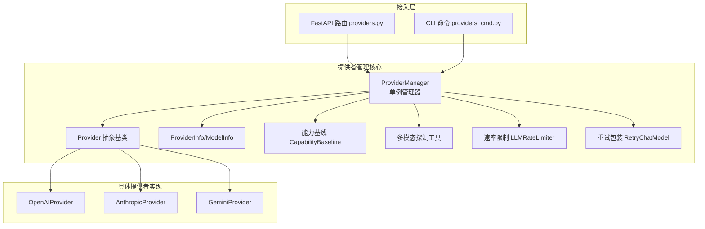
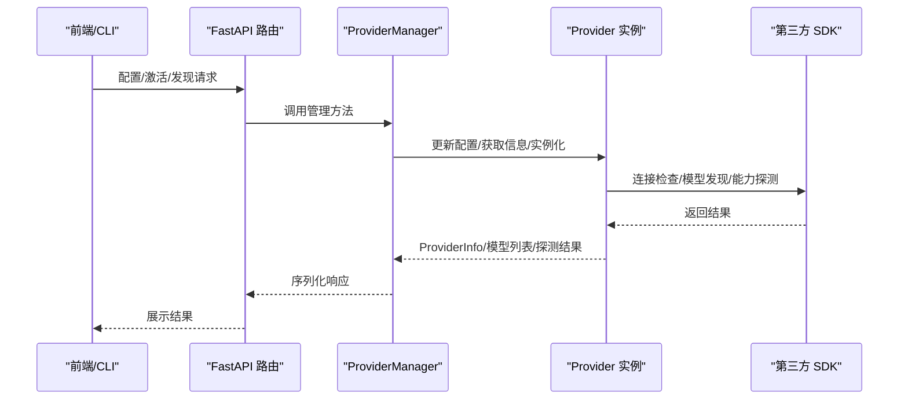
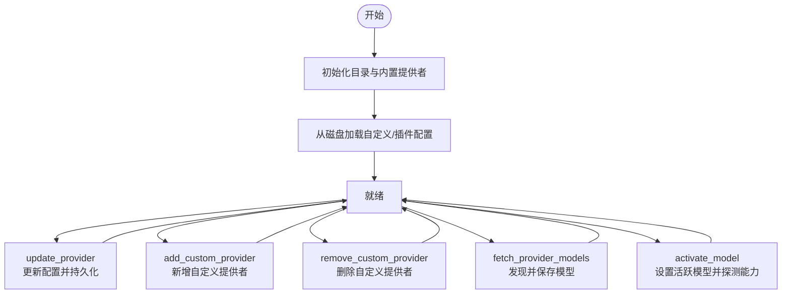
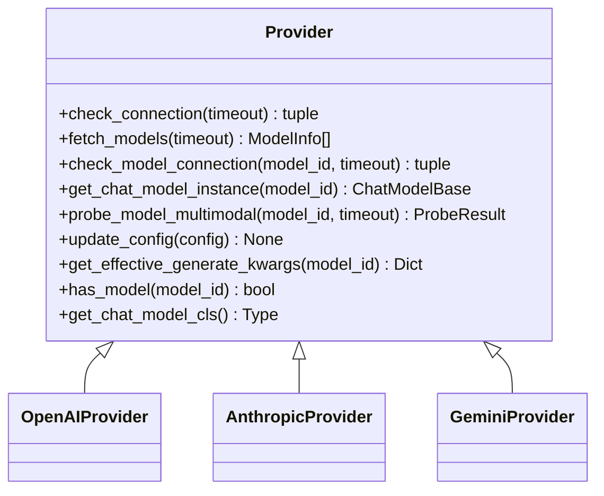
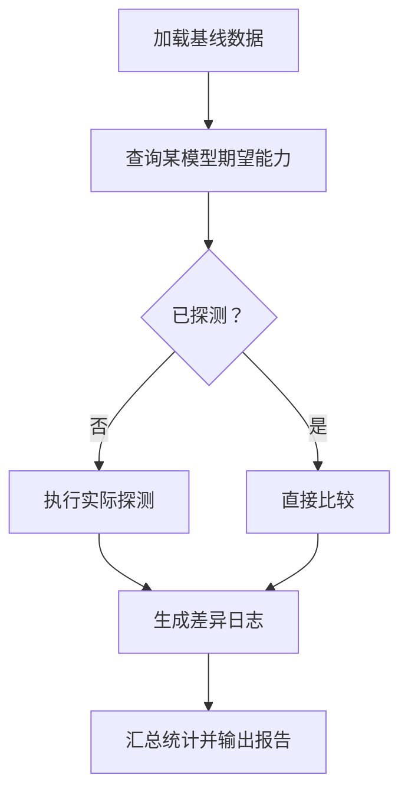
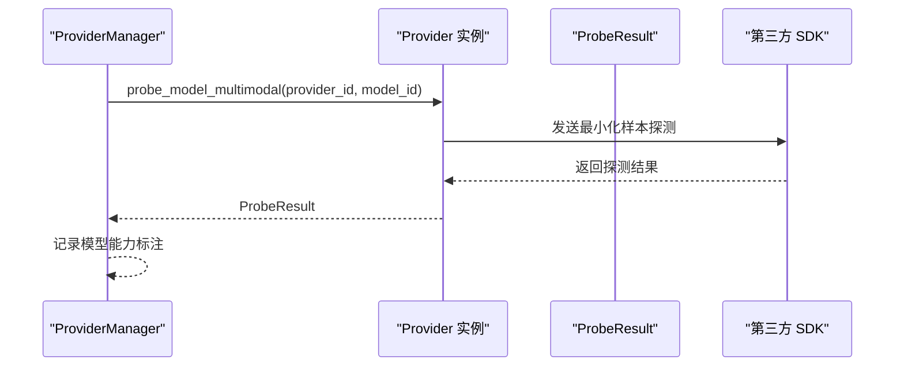
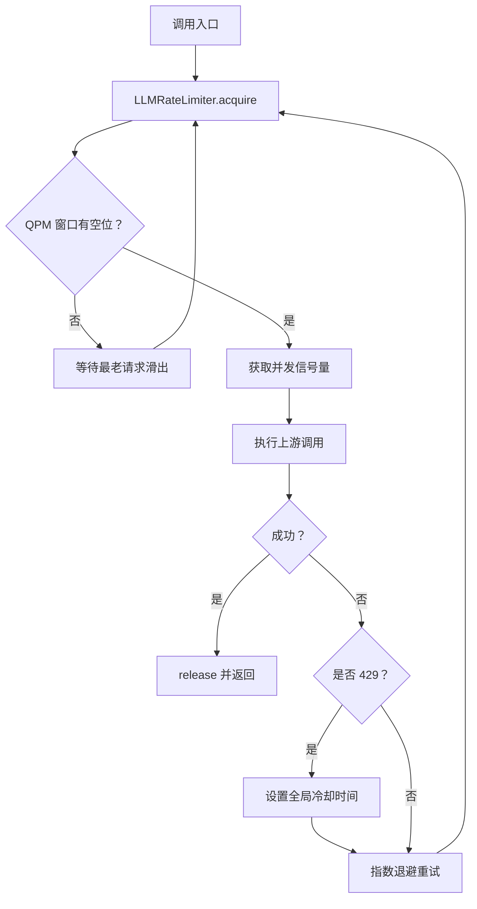
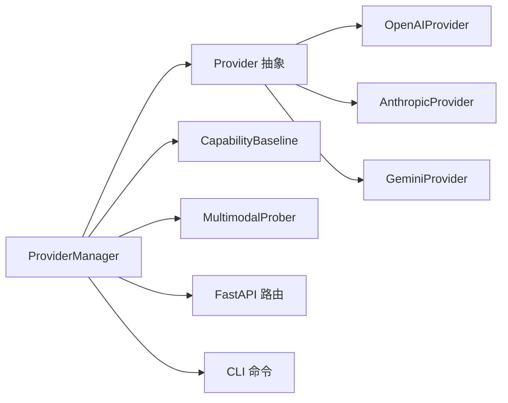

# 提供者管理

<cite>
**本文引用的文件**
- [provider_manager.py](file://src/qwenpaw/providers/provider_manager.py)
- [provider.py](file://src/qwenpaw/providers/provider.py)
- [capability_baseline.py](file://src/qwenpaw/providers/capability_baseline.py)
- [models.py](file://src/qwenpaw/providers/models.py)
- [multimodal_prober.py](file://src/qwenpaw/providers/multimodal_prober.py)
- [rate_limiter.py](file://src/qwenpaw/providers/rate_limiter.py)
- [retry_chat_model.py](file://src/qwenpaw/providers/retry_chat_model.py)
- [openai_provider.py](file://src/qwenpaw/providers/openai_provider.py)
- [anthropic_provider.py](file://src/qwenpaw/providers/anthropic_provider.py)
- [gemini_provider.py](file://src/qwenpaw/providers/gemini_provider.py)
- [providers.py](file://src/qwenpaw/app/routers/providers.py)
- [providers_cmd.py](file://src/qwenpaw/cli/providers_cmd.py)
</cite>

## 目录
1. [简介](#简介)
2. [项目结构](#项目结构)
3. [核心组件](#核心组件)
4. [架构总览](#架构总览)
5. [详细组件分析](#详细组件分析)
6. [依赖分析](#依赖分析)
7. [性能考虑](#性能考虑)
8. [故障排查指南](#故障排查指南)
9. [结论](#结论)
10. [附录](#附录)

## 简介
本文件面向模型提供者管理系统，系统性阐述 ProviderManager 的架构与管理机制，覆盖提供者注册、配置管理、生命周期控制；解析 Provider 基类的设计模式与抽象接口；详解能力基线（CapabilityBaseline）的实现原理与兼容性评估；给出提供者配置模板、动态加载与持久化、热更新策略；并提供多提供者并行管理、负载均衡与故障转移的实现思路，以及扩展开发流程、自定义提供者集成与最佳实践。

## 项目结构
围绕“提供者管理”的核心代码位于 src/qwenpaw/providers 目录，配合应用层路由与 CLI 命令完成对外暴露与运维支持。关键模块职责如下：
- provider.py：定义 Provider 抽象基类、ProviderInfo/ModelInfo 数据模型与通用接口
- provider_manager.py：ProviderManager 单例，负责内置/自定义/插件提供者注册、持久化、动态加载、激活模型、能力探测等
- capability_baseline.py：能力基线与差异报告生成
- multimodal_prober.py：多模态探测常量与结果数据结构
- rate_limiter.py / retry_chat_model.py：并发与重试控制，保障调用稳定性
- 各具体提供者实现：openai_provider.py、anthropic_provider.py、gemini_provider.py 等
- app/routers/providers.py：FastAPI 路由，提供者列表、配置、模型发现、激活等 API
- cli/providers_cmd.py：CLI 命令，交互式配置与本地模型联动

图表来源
- [provider_manager.py:670-751](file://src/qwenpaw/providers/provider_manager.py#L670-L751)
- [provider.py:111-314](file://src/qwenpaw/providers/provider.py#L111-L314)
- [capability_baseline.py:55-98](file://src/qwenpaw/providers/capability_baseline.py#L55-L98)
- [multimodal_prober.py:75-87](file://src/qwenpaw/providers/multimodal_prober.py#L75-L87)
- [rate_limiter.py:30-69](file://src/qwenpaw/providers/rate_limiter.py#L30-L69)
- [retry_chat_model.py:204-228](file://src/qwenpaw/providers/retry_chat_model.py#L204-L228)
- [openai_provider.py:25-34](file://src/qwenpaw/providers/openai_provider.py#L25-L34)
- [anthropic_provider.py:27-36](file://src/qwenpaw/providers/anthropic_provider.py#L27-L36)
- [gemini_provider.py:27-35](file://src/qwenpaw/providers/gemini_provider.py#L27-L35)
- [providers.py:50-59](file://src/qwenpaw/app/routers/providers.py#L50-L59)
- [providers_cmd.py:78-79](file://src/qwenpaw/cli/providers_cmd.py#L78-L79)

章节来源
- [provider_manager.py:670-751](file://src/qwenpaw/providers/provider_manager.py#L670-L751)
- [providers.py:50-59](file://src/qwenpaw/app/routers/providers.py#L50-L59)
- [providers_cmd.py:78-79](file://src/qwenpaw/cli/providers_cmd.py#L78-L79)

## 核心组件
- Provider 抽象基类与数据模型
  - ProviderInfo/ModelInfo 定义提供者与模型元数据，支持预置模型、用户自增模型、生成参数覆盖、连接检查能力开关等
  - Provider 抽象方法：check_connection/fetch_models/check_model_connection/get_chat_model_instance/probe_model_multimodal
  - 通用能力：update_config、get_effective_generate_kwargs、has_model、get_chat_model_cls
- ProviderManager 单例
  - 内置/自定义/插件提供者注册与持久化
  - 提供者配置更新、模型发现、激活模型、能力探测调度
  - 活跃模型槽位 ActiveModelsInfo/ModelSlotConfig
- 具体提供者实现
  - OpenAIProvider/AnthropicProvider/GeminiProvider 等基于各自 SDK 实现连接检查、模型发现、能力探测与聊天模型实例化
- 接入层
  - FastAPI 路由提供者列表、配置、模型发现、激活等
  - CLI 命令支持交互式配置与本地模型联动

章节来源
- [provider.py:17-314](file://src/qwenpaw/providers/provider.py#L17-L314)
- [provider_manager.py:670-1019](file://src/qwenpaw/providers/provider_manager.py#L670-L1019)
- [models.py:9-16](file://src/qwenpaw/providers/models.py#L9-L16)
- [openai_provider.py:25-163](file://src/qwenpaw/providers/openai_provider.py#L25-L163)
- [anthropic_provider.py:27-164](file://src/qwenpaw/providers/anthropic_provider.py#L27-L164)
- [gemini_provider.py:27-140](file://src/qwenpaw/providers/gemini_provider.py#L27-L140)
- [providers.py:147-200](file://src/qwenpaw/app/routers/providers.py#L147-L200)
- [providers_cmd.py:157-200](file://src/qwenpaw/cli/providers_cmd.py#L157-L200)

## 架构总览
ProviderManager 作为统一入口，协调 Provider 抽象与具体实现，结合能力基线与探测工具，形成“配置—发现—激活—探测—稳定执行”的闭环。接入层通过 API/CLI 将用户操作转化为 ProviderManager 的状态变更与持久化。

图表来源
- [providers.py:152-190](file://src/qwenpaw/app/routers/providers.py#L152-L190)
- [provider_manager.py:788-822](file://src/qwenpaw/providers/provider_manager.py#L788-L822)
- [provider.py:114-129](file://src/qwenpaw/providers/provider.py#L114-L129)
- [openai_provider.py:57-84](file://src/qwenpaw/providers/openai_provider.py#L57-L84)
- [anthropic_provider.py:66-86](file://src/qwenpaw/providers/anthropic_provider.py#L66-L86)
- [gemini_provider.py:68-101](file://src/qwenpaw/providers/gemini_provider.py#L68-L101)

## 详细组件分析

### ProviderManager：统一管理与生命周期
- 初始化与注册
  - 准备磁盘目录（内置/自定义/插件），初始化内置提供者集合
  - 支持从磁盘恢复自定义/插件提供者配置
- 提供者管理
  - 列表：聚合内置/自定义/插件提供者信息
  - 获取：按 ID 返回 Provider 实例或插件信息
  - 更新：update_provider 将配置变更写回磁盘（内置/自定义/插件路径）
  - 添加/删除：add_custom_provider/remove_custom_provider
  - 模型发现：fetch_provider_models 并可持久化到 extra_models
  - 激活模型：activate_model 设置活跃模型槽位，触发能力探测
- 存储与安全
  - _save_provider/_save_plugin_provider：敏感字段加密写入
  - load_provider：透明解密与迁移
- 异步与后台任务
  - maybe_probe_multimodal 触发后台自动探测
  - start_local_model_resume 后台恢复本地模型服务

图表来源
- [provider_manager.py:696-751](file://src/qwenpaw/providers/provider_manager.py#L696-L751)
- [provider_manager.py:796-822](file://src/qwenpaw/providers/provider_manager.py#L796-L822)
- [provider_manager.py:898-925](file://src/qwenpaw/providers/provider_manager.py#L898-L925)
- [provider_manager.py:847-881](file://src/qwenpaw/providers/provider_manager.py#L847-L881)
- [provider_manager.py:927-950](file://src/qwenpaw/providers/provider_manager.py#L927-L950)

章节来源
- [provider_manager.py:670-1019](file://src/qwenpaw/providers/provider_manager.py#L670-L1019)

### Provider 基类：抽象接口与通用能力
- 抽象方法
  - check_connection：校验提供者连通性
  - fetch_models：拉取可用模型列表
  - check_model_connection：校验指定模型可用性
  - get_chat_model_instance：返回对应聊天模型实例
  - probe_model_multimodal：探测多模态能力（默认返回空结果）
- 通用能力
  - update_config：按字段更新配置（含 generate_kwargs 合并）
  - get_effective_generate_kwargs：提供者级+模型级深度合并
  - has_model/add_model/delete_model：模型清单维护
  - get_chat_model_cls：根据 chat_model 名称反射获取模型类

图表来源
- [provider.py:111-314](file://src/qwenpaw/providers/provider.py#L111-L314)
- [openai_provider.py:25-163](file://src/qwenpaw/providers/openai_provider.py#L25-L163)
- [anthropic_provider.py:27-164](file://src/qwenpaw/providers/anthropic_provider.py#L27-L164)
- [gemini_provider.py:27-140](file://src/qwenpaw/providers/gemini_provider.py#L27-L140)

章节来源
- [provider.py:111-314](file://src/qwenpaw/providers/provider.py#L111-L314)

### 能力基线（CapabilityBaseline）：模型能力评估与兼容性检查
- 预置期望能力
  - ExpectedCapabilityRegistry：以 (provider_id, model_id) 为键，记录各内置提供者的官方文档期望能力（图像/视频）
- 差异检测
  - compare_probe_result：对比探测结果与期望，输出差异日志
  - generate_summary：汇总通过/差异/失败数量与详情
- 使用场景
  - 在 ProviderManager 激活模型后，若能力未知则异步探测并更新模型标注

图表来源
- [capability_baseline.py:55-98](file://src/qwenpaw/providers/capability_baseline.py#L55-L98)
- [capability_baseline.py:604-641](file://src/qwenpaw/providers/capability_baseline.py#L604-L641)
- [capability_baseline.py:643-679](file://src/qwenpaw/providers/capability_baseline.py#L643-L679)

章节来源
- [capability_baseline.py:1-679](file://src/qwenpaw/providers/capability_baseline.py#L1-L679)

### 多模态探测工具与具体提供者实现
- 探测工具
  - ProbeResult：记录 supports_image/supports_video 及消息
  - _PROBE_IMAGE_B64/_PROBE_VIDEO_URL：最小化探测样本
  - _is_media_keyword_error：识别媒体相关错误关键词
- 具体提供者
  - OpenAIProvider：使用 models.list 与 chat.completions 流式探测
  - AnthropicProvider：messages.list 与 messages.create 探测，明确不支持视频
  - GeminiProvider：generateContent inline_data 探测图像/视频

图表来源
- [provider_manager.py:949-979](file://src/qwenpaw/providers/provider_manager.py#L949-L979)
- [multimodal_prober.py:75-102](file://src/qwenpaw/providers/multimodal_prober.py#L75-L102)
- [openai_provider.py:165-197](file://src/qwenpaw/providers/openai_provider.py#L165-L197)
- [anthropic_provider.py:166-186](file://src/qwenpaw/providers/anthropic_provider.py#L166-L186)
- [gemini_provider.py:142-159](file://src/qwenpaw/providers/gemini_provider.py#L142-L159)

章节来源
- [multimodal_prober.py:1-102](file://src/qwenpaw/providers/multimodal_prober.py#L1-L102)
- [openai_provider.py:165-197](file://src/qwenpaw/providers/openai_provider.py#L165-L197)
- [anthropic_provider.py:166-186](file://src/qwenpaw/providers/anthropic_provider.py#L166-L186)
- [gemini_provider.py:142-159](file://src/qwenpaw/providers/gemini_provider.py#L142-L159)

### 配置模板、动态加载与热更新策略
- 配置模板
  - ProviderInfo/ModelInfo 字段涵盖：id/name/base_url/api_key/chat_model/models/extra_models/api_key_prefix/is_local/freeze_url/require_api_key/support_model_discovery/support_connection_check/generate_kwargs/meta
- 动态加载
  - _init_from_storage：启动时从磁盘加载自定义/插件提供者
  - load_provider：透明解密与迁移，支持旧明文自动加密
- 热更新
  - update_provider：内存更新+持久化，区分内置/自定义/插件路径
  - 插件提供者：内存中转换为 ProviderInfo 并单独保存
- 存储安全
  - 敏感字段（如 api_key）加密写入，权限严格限制

章节来源
- [provider.py:49-109](file://src/qwenpaw/providers/provider.py#L49-L109)
- [provider_manager.py:696-751](file://src/qwenpaw/providers/provider_manager.py#L696-L751)
- [provider_manager.py:1135-1173](file://src/qwenpaw/providers/provider_manager.py#L1135-L1173)
- [provider_manager.py:1108-1133](file://src/qwenpaw/providers/provider_manager.py#L1108-L1133)

### 多提供者并行管理、负载均衡与故障转移
- 并发与限流
  - LLMRateLimiter：滑动窗口 QPM + 信号量并发上限 + 全局 429 冷却 + 抖动
- 重试策略
  - RetryChatModel：指数退避 + 对 429/超时/连接错误透明重试，支持非流式与流式
- 负载均衡与故障转移建议
  - 基于 LLMRateLimiter 的全局配额与冷却，避免上游瞬时拥塞引发级联失败
  - 结合 ProviderManager 的多提供者并存，按权重/健康度选择活跃提供者
  - 对特定提供者启用独立限流参数，隔离不同供应商的配额与延迟特性

图表来源
- [rate_limiter.py:70-145](file://src/qwenpaw/providers/rate_limiter.py#L70-L145)
- [retry_chat_model.py:269-354](file://src/qwenpaw/providers/retry_chat_model.py#L269-L354)

章节来源
- [rate_limiter.py:30-279](file://src/qwenpaw/providers/rate_limiter.py#L30-L279)
- [retry_chat_model.py:204-477](file://src/qwenpaw/providers/retry_chat_model.py#L204-L477)

### 扩展开发流程与自定义提供者集成
- 开发步骤
  - 继承 Provider，实现 check_connection/fetch_models/check_model_connection/get_chat_model_instance/probe_model_multimodal
  - 在 ProviderManager 中注册（内置/自定义/插件）
  - 通过 API/CLI 进行配置、模型发现、激活与能力探测
- 集成要点
  - 正确处理 generate_kwargs 合并与 chat_model 类映射
  - 提供可靠的连接检查与模型可用性检查
  - 若支持动态模型发现，确保去重与规范化
- 最佳实践
  - 明确 is_local/require_api_key/freeze_url 等属性，提升用户体验
  - 对外部 SDK 错误进行语义化归类与提示
  - 保持 ProviderInfo 的 meta 字段用于引导用户配置

章节来源
- [provider.py:111-314](file://src/qwenpaw/providers/provider.py#L111-L314)
- [provider_manager.py:710-732](file://src/qwenpaw/providers/provider_manager.py#L710-L732)
- [providers.py:192-200](file://src/qwenpaw/app/routers/providers.py#L192-L200)
- [providers_cmd.py:157-200](file://src/qwenpaw/cli/providers_cmd.py#L157-L200)

## 依赖分析
- ProviderManager 依赖 Provider 抽象与具体实现，同时依赖能力基线与探测工具
- 具体提供者实现依赖对应 SDK，并通过 Provider.get_chat_model_cls 与 AgentScope 模型对接
- 接入层（API/CLI）通过 ProviderManager 调用提供者管理能力

图表来源
- [provider_manager.py:670-751](file://src/qwenpaw/providers/provider_manager.py#L670-L751)
- [provider.py:111-314](file://src/qwenpaw/providers/provider.py#L111-L314)
- [openai_provider.py:25-34](file://src/qwenpaw/providers/openai_provider.py#L25-L34)
- [anthropic_provider.py:27-36](file://src/qwenpaw/providers/anthropic_provider.py#L27-L36)
- [gemini_provider.py:27-35](file://src/qwenpaw/providers/gemini_provider.py#L27-L35)
- [capability_baseline.py:55-98](file://src/qwenpaw/providers/capability_baseline.py#L55-L98)
- [multimodal_prober.py:75-87](file://src/qwenpaw/providers/multimodal_prober.py#L75-L87)
- [providers.py:50-59](file://src/qwenpaw/app/routers/providers.py#L50-L59)
- [providers_cmd.py:78-79](file://src/qwenpaw/cli/providers_cmd.py#L78-L79)

章节来源
- [provider_manager.py:670-751](file://src/qwenpaw/providers/provider_manager.py#L670-L751)
- [provider.py:111-314](file://src/qwenpaw/providers/provider.py#L111-L314)

## 性能考虑
- 并发控制与 QPM 限制：通过 LLMRateLimiter 控制每分钟请求数与并发数，降低 429 风险
- 抖动与冷却：对 429 设置全局冷却与抖动，避免惊群效应
- 重试策略：指数退避与可配置最大重试次数，平衡可靠性与资源占用
- 探测开销：仅在能力未知时异步探测，避免阻塞主流程
- 模型发现：支持增量发现并持久化到 extra_models，减少重复网络请求

## 故障排查指南
- 连接失败
  - 检查 base_url 与 api_key 是否正确配置
  - 使用 check_connection 与 check_model_connection 快速定位问题
- 429 限流
  - 查看 LLMRateLimiter 统计，调整 max_concurrent/max_qpm/pause_seconds/jitter_range
  - 关注 RetryChatModel 的重试日志
- 能力探测异常
  - 检查 ProbeResult 的 image_message/video_message
  - 对于文本模型，探测可能返回“跳过”或“不支持”
- 配置持久化问题
  - 确认磁盘权限与加密字段是否正确写入
  - 如遇旧明文，系统会自动迁移加密

章节来源
- [openai_provider.py:57-124](file://src/qwenpaw/providers/openai_provider.py#L57-L124)
- [anthropic_provider.py:66-126](file://src/qwenpaw/providers/anthropic_provider.py#L66-L126)
- [gemini_provider.py:68-130](file://src/qwenpaw/providers/gemini_provider.py#L68-L130)
- [rate_limiter.py:152-196](file://src/qwenpaw/providers/rate_limiter.py#L152-L196)
- [retry_chat_model.py:137-161](file://src/qwenpaw/providers/retry_chat_model.py#L137-L161)
- [provider_manager.py:1108-1173](file://src/qwenpaw/providers/provider_manager.py#L1108-L1173)

## 结论
ProviderManager 通过 Provider 抽象与具体实现的解耦、能力基线与探测工具的协同、接入层的统一 API/CLI 支撑，构建了可扩展、可观测、可治理的提供者管理体系。结合 LLMRateLimiter 与 RetryChatModel，系统在高并发与不稳定网络环境下仍能保持稳定与高效。建议在生产环境中合理配置限流参数、完善能力基线与探测策略，并通过插件机制扩展新的提供者实现。

## 附录
- API/CLI 能力概览
  - 列表提供者、配置提供者、创建自定义提供者、添加/删除模型、激活模型、模型发现
- 常用配置项参考
  - base_url/api_key/chat_model/generate_kwargs/api_key_prefix/is_local/freeze_url/require_api_key/support_model_discovery/support_connection_check

章节来源
- [providers.py:147-200](file://src/qwenpaw/app/routers/providers.py#L147-L200)
- [providers_cmd.py:157-200](file://src/qwenpaw/cli/providers_cmd.py#L157-L200)
- [provider.py:49-109](file://src/qwenpaw/providers/provider.py#L49-L109)