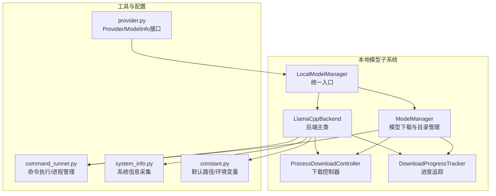
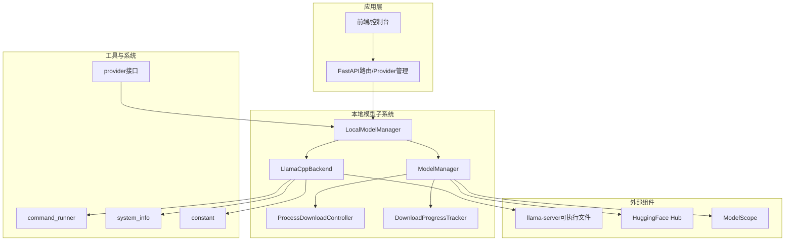
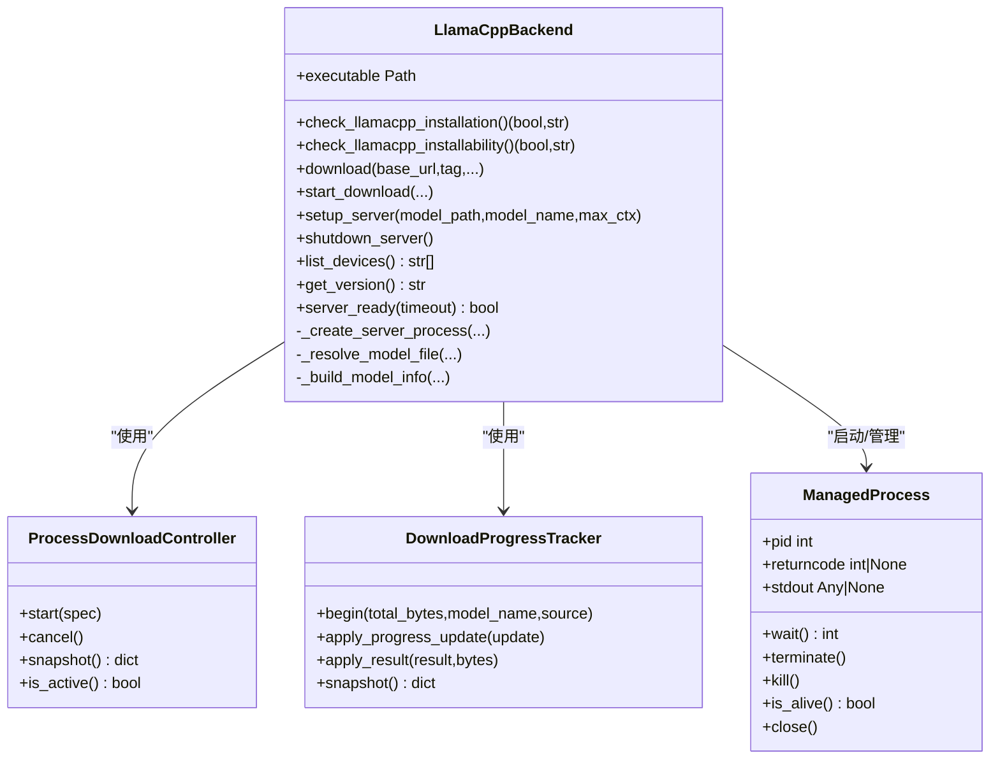
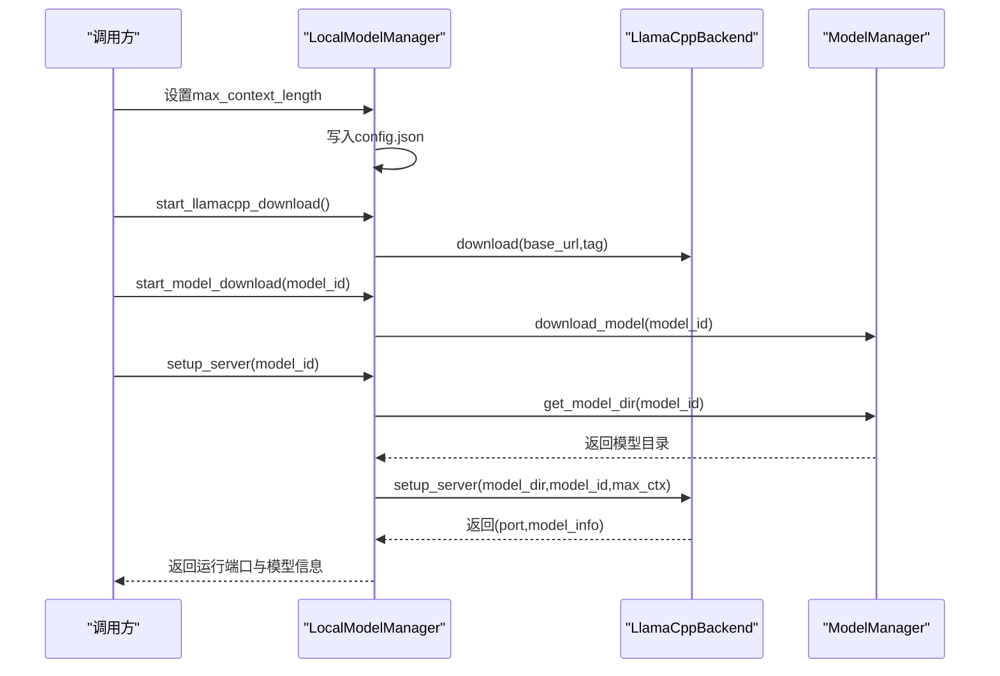
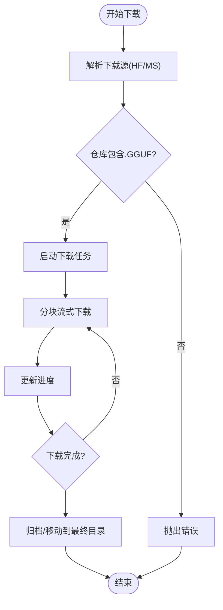
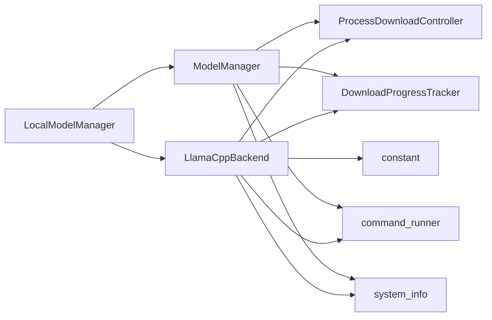

# llama.cpp后端

<cite>
**本文档引用的文件**
- [llamacpp.py](file://src/qwenpaw/local_models/llamacpp.py)
- [manager.py](file://src/qwenpaw/local_models/manager.py)
- [model_manager.py](file://src/qwenpaw/local_models/model_manager.py)
- [download_manager.py](file://src/qwenpaw/local_models/download_manager.py)
- [provider.py](file://src/qwenpaw/providers/provider.py)
- [command_runner.py](file://src/qwenpaw/utils/command_runner.py)
- [system_info.py](file://src/qwenpaw/utils/system_info.py)
- [constant.py](file://src/qwenpaw/constant.py)
- [test_llamacpp_backend.py](file://tests/unit/local_models/test_llamacpp_backend.py)
</cite>

## 目录
1. [简介](#简介)
2. [项目结构](#项目结构)
3. [核心组件](#核心组件)
4. [架构总览](#架构总览)
5. [详细组件分析](#详细组件分析)
6. [依赖关系分析](#依赖关系分析)
7. [性能考虑](#性能考虑)
8. [故障排查指南](#故障排查指南)
9. [结论](#结论)
10. [附录](#附录)

## 简介
本文件面向QwenPaw的llama.cpp后端集成，系统性阐述llama.cpp推理引擎在QwenPaw中的实现与使用方式，覆盖后端初始化、模型下载与解析、推理服务启动与健康检查、资源管理与生命周期控制、配置参数与性能调优、内存与GPU策略、以及与AgentScope框架的集成要点。文档同时提供安装步骤、配置示例、性能基准建议与常见问题诊断方法，帮助开发者与运维人员快速上手并稳定运行本地GGUF模型推理服务。

## 项目结构
llama.cpp后端相关代码集中在本地模型子系统中，主要文件如下：
- 后端主类：负责llama.cpp二进制下载、安装、进程管理、健康检查与设备查询
- 管理器：对外统一入口，协调下载与服务器生命周期
- 模型管理器：负责GGUF模型仓库的下载、校验与目录管理
- 下载控制器：基于多进程的任务控制器，封装进度追踪与结果归档
- 工具模块：命令执行、进程管理、系统信息采集
- Provider接口：定义模型能力与生成参数的抽象，便于与AgentScope对接

图表来源
- [llamacpp.py:51-420](file://src/qwenpaw/local_models/llamacpp.py#L51-L420)
- [manager.py:33-228](file://src/qwenpaw/local_models/manager.py#L33-L228)
- [model_manager.py:63-250](file://src/qwenpaw/local_models/model_manager.py#L63-L250)
- [download_manager.py:368-599](file://src/qwenpaw/local_models/download_manager.py#L368-L599)
- [command_runner.py:127-491](file://src/qwenpaw/utils/command_runner.py#L127-L491)
- [system_info.py:20-120](file://src/qwenpaw/utils/system_info.py#L20-L120)
- [constant.py:118-119](file://src/qwenpaw/constant.py#L118-L119)
- [provider.py:17-47](file://src/qwenpaw/providers/provider.py#L17-L47)

章节来源
- [llamacpp.py:1-887](file://src/qwenpaw/local_models/llamacpp.py#L1-L887)
- [manager.py:1-229](file://src/qwenpaw/local_models/manager.py#L1-L229)
- [model_manager.py:1-654](file://src/qwenpaw/local_models/model_manager.py#L1-L654)
- [download_manager.py:1-599](file://src/qwenpaw/local_models/download_manager.py#L1-L599)
- [command_runner.py:1-578](file://src/qwenpaw/utils/command_runner.py#L1-L578)
- [system_info.py:1-229](file://src/qwenpaw/utils/system_info.py#L1-L229)
- [constant.py:1-307](file://src/qwenpaw/constant.py#L1-L307)
- [provider.py:1-314](file://src/qwenpaw/providers/provider.py#L1-L314)

## 核心组件
- LlamaCppBackend：负责llama.cpp二进制下载与安装、模型文件解析（GGUF/mmproj）、推理服务进程启动/停止、健康检查、设备列表查询、版本查询等。
- LocalModelManager：对外统一入口，提供下载与服务器生命周期控制、配置持久化、推荐模型查询等。
- ModelManager：负责从HuggingFace或ModelScope下载GGUF模型仓库，校验.GGUF文件存在性，维护下载进度与最终目录。
- ProcessDownloadController/DownloadProgressTracker：多进程下载任务控制器与进度追踪器，支持取消、完成归档、错误映射。
- command_runner：统一的命令执行与进程管理，支持异步/线程化启动、优雅关闭、超时等待、进程组信号处理。
- system_info：系统信息采集，用于判断macOS版本、CUDA可用性、内存与显存大小，辅助下载与安装决策。
- constant：默认本地模型目录、工作目录、日志级别等全局常量与环境变量读取。
- provider：Provider/ModelInfo接口，定义模型能力与生成参数，便于AgentScope框架识别与调用。

章节来源
- [llamacpp.py:51-420](file://src/qwenpaw/local_models/llamacpp.py#L51-L420)
- [manager.py:33-228](file://src/qwenpaw/local_models/manager.py#L33-L228)
- [model_manager.py:63-250](file://src/qwenpaw/local_models/model_manager.py#L63-L250)
- [download_manager.py:368-599](file://src/qwenpaw/local_models/download_manager.py#L368-L599)
- [command_runner.py:127-491](file://src/qwenpaw/utils/command_runner.py#L127-L491)
- [system_info.py:20-120](file://src/qwenpaw/utils/system_info.py#L20-L120)
- [constant.py:118-119](file://src/qwenpaw/constant.py#L118-L119)
- [provider.py:17-47](file://src/qwenpaw/providers/provider.py#L17-L47)

## 架构总览
下图展示llama.cpp后端在QwenPaw中的整体架构与交互关系。

图表来源
- [manager.py:33-228](file://src/qwenpaw/local_models/manager.py#L33-L228)
- [llamacpp.py:51-420](file://src/qwenpaw/local_models/llamacpp.py#L51-L420)
- [model_manager.py:63-250](file://src/qwenpaw/local_models/model_manager.py#L63-L250)
- [download_manager.py:368-599](file://src/qwenpaw/local_models/download_manager.py#L368-L599)
- [command_runner.py:127-491](file://src/qwenpaw/utils/command_runner.py#L127-L491)
- [system_info.py:20-120](file://src/qwenpaw/utils/system_info.py#L20-L120)
- [constant.py:118-119](file://src/qwenpaw/constant.py#L118-L119)
- [provider.py:111-210](file://src/qwenpaw/providers/provider.py#L111-L210)

## 详细组件分析

### LlamaCppBackend：后端初始化与推理服务
- 初始化与环境检测
  - 解析操作系统、架构、CUDA版本、后端类型，并确定目标安装目录
  - macOS版本要求（最低13.3），CUDA版本映射
- 二进制下载与安装
  - 通过ProcessDownloadController启动后台下载任务，支持断点续传、进度上报、错误映射
  - 支持Windows/Linux/macOS不同命名的可执行文件
- 模型文件解析
  - 支持直接指定GGUF文件或模型仓库目录；自动扫描.GGUF文件，识别mmproj文件用于多模态
- 推理服务启动
  - 通过command_runner启动llama-server进程，绑定127.0.0.1与随机端口
  - 默认参数：--gpu-layers auto、--alias模型名、可选--ctx-size上下文长度、可选--mmproj多模态投影
- 健康检查与日志
  - 周期性访问/health端点，超时等待服务就绪
  - 异步读取子进程标准输出，记录调试日志
- 设备与版本查询
  - 调用llama-server --list-devices与--version，过滤无关输出
- 生命周期管理
  - 支持优雅关闭与强制终止，进程组信号处理，退出清理

图表来源
- [llamacpp.py:51-420](file://src/qwenpaw/local_models/llamacpp.py#L51-L420)
- [download_manager.py:368-599](file://src/qwenpaw/local_models/download_manager.py#L368-L599)
- [command_runner.py:127-491](file://src/qwenpaw/utils/command_runner.py#L127-L491)

章节来源
- [llamacpp.py:51-420](file://src/qwenpaw/local_models/llamacpp.py#L51-L420)
- [download_manager.py:368-599](file://src/qwenpaw/local_models/download_manager.py#L368-L599)
- [command_runner.py:127-491](file://src/qwenpaw/utils/command_runner.py#L127-L491)

### LocalModelManager：统一入口与配置持久化
- 提供对外统一入口，协调llama.cpp下载与服务器生命周期
- 配置持久化：max_context_length等运行时参数写入config.json
- 推荐模型：根据系统内存/GPU显存选择合适的GGUF模型
- 与ModelManager协作：下载模型仓库、查询下载进度、删除模型

图表来源
- [manager.py:101-210](file://src/qwenpaw/local_models/manager.py#L101-L210)
- [llamacpp.py:216-307](file://src/qwenpaw/local_models/llamacpp.py#L216-L307)
- [model_manager.py:245-250](file://src/qwenpaw/local_models/model_manager.py#L245-L250)

章节来源
- [manager.py:33-228](file://src/qwenpaw/local_models/manager.py#L33-L228)
- [model_manager.py:63-250](file://src/qwenpaw/local_models/model_manager.py#L63-L250)

### ModelManager：GGUF模型下载与目录管理
- 下载源选择：优先HuggingFace，不可达时回退到ModelScope
- GGUF校验：确保仓库包含至少一个.GGUF文件
- 目录结构：按仓库ID组织，支持临时下载目录清理
- 进度追踪：通过DownloadProgressTracker与队列消息上报
- 归档与移动：完成后将临时目录提升至最终位置

图表来源
- [model_manager.py:181-250](file://src/qwenpaw/local_models/model_manager.py#L181-L250)
- [download_manager.py:368-599](file://src/qwenpaw/local_models/download_manager.py#L368-L599)

章节来源
- [model_manager.py:63-250](file://src/qwenpaw/local_models/model_manager.py#L63-L250)
- [download_manager.py:198-599](file://src/qwenpaw/local_models/download_manager.py#L198-L599)

### 下载控制器与进度追踪
- 多进程下载：使用ProcessDownloadTaskSpec与ProcessDownloadTask封装下载逻辑
- 进度追踪：DownloadProgressTracker线程安全地维护状态、速度、错误信息
- 结果归档：完成或失败后进行清理或移动操作
- 取消与监控：支持取消、监控线程、异常处理与资源释放

章节来源
- [download_manager.py:198-599](file://src/qwenpaw/local_models/download_manager.py#L198-L599)

### 命令执行与进程管理
- 统一接口：run_command/run_command_async、start_command_async、shutdown_process
- 平台兼容：Windows事件循环不支持asyncio子进程时，回退到线程化启动
- 进程组：Unix平台支持进程组信号，Windows使用tasklist检测进程
- 超时与优雅关闭：支持graceful_timeout与kill_timeout

章节来源
- [command_runner.py:127-491](file://src/qwenpaw/utils/command_runner.py#L127-L491)

### 系统信息采集
- 操作系统与架构：区分windows/macos/linux与x64/arm64
- macOS版本：用于安装前的版本校验
- CUDA版本：用于下载包选择与GPU加速判断
- 内存与显存：用于推荐模型与容量评估

章节来源
- [system_info.py:20-120](file://src/qwenpaw/utils/system_info.py#L20-L120)

## 依赖关系分析
- LlamaCppBackend依赖
  - ProcessDownloadController/DownloadProgressTracker：下载与进度
  - command_runner：命令执行与进程管理
  - system_info：系统信息采集
  - constant：默认目录与环境变量
- LocalModelManager依赖
  - LlamaCppBackend：下载与服务器控制
  - ModelManager：模型仓库下载
  - provider：模型能力描述
- ModelManager依赖
  - ProcessDownloadController/DownloadProgressTracker：下载
  - system_info：网络可达性探测
  - huggingface_hub/modelscope：下载SDK

图表来源
- [llamacpp.py:51-420](file://src/qwenpaw/local_models/llamacpp.py#L51-L420)
- [manager.py:33-228](file://src/qwenpaw/local_models/manager.py#L33-L228)
- [model_manager.py:63-250](file://src/qwenpaw/local_models/model_manager.py#L63-L250)
- [download_manager.py:368-599](file://src/qwenpaw/local_models/download_manager.py#L368-L599)
- [command_runner.py:127-491](file://src/qwenpaw/utils/command_runner.py#L127-L491)
- [system_info.py:20-120](file://src/qwenpaw/utils/system_info.py#L20-L120)
- [constant.py:118-119](file://src/qwenpaw/constant.py#L118-L119)

章节来源
- [llamacpp.py:51-420](file://src/qwenpaw/local_models/llamacpp.py#L51-L420)
- [manager.py:33-228](file://src/qwenpaw/local_models/manager.py#L33-L228)
- [model_manager.py:63-250](file://src/qwenpaw/local_models/model_manager.py#L63-L250)
- [download_manager.py:368-599](file://src/qwenpaw/local_models/download_manager.py#L368-L599)
- [command_runner.py:127-491](file://src/qwenpaw/utils/command_runner.py#L127-L491)
- [system_info.py:20-120](file://src/qwenpaw/utils/system_info.py#L20-L120)
- [constant.py:118-119](file://src/qwenpaw/constant.py#L118-L119)

## 性能考虑
- 上下文窗口与显存占用
  - max_context_length越大，显存占用越高；建议结合GPU显存与模型大小合理设置
  - 可通过LocalModelManager.set_max_context_length持久化配置
- GPU加速与层数
  - 默认--gpu-layers auto，自动选择GPU加速层数
  - 若显存不足，可降低上下文或减少GPU层数
- 端口与并发
  - 服务监听127.0.0.1与随机端口，避免冲突
  - 多模型并行需多个独立进程与端口
- 下载与解压
  - 分块下载与进度追踪，断点续传减少网络波动影响
  - 解压合并仅复制顶层文件，避免深层目录结构复杂化
- 健康检查与日志
  - 启动后定期健康检查，超时即判定失败并清理
  - 日志异步读取，避免阻塞主流程

章节来源
- [manager.py:105-109](file://src/qwenpaw/local_models/manager.py#L105-L109)
- [llamacpp.py:349-396](file://src/qwenpaw/local_models/llamacpp.py#L349-L396)
- [test_llamacpp_backend.py:296-361](file://tests/unit/local_models/test_llamacpp_backend.py#L296-L361)

## 故障排查指南
- 无法安装llama.cpp
  - 检查macOS版本是否满足13.3以上
  - 检查CUDA版本映射与下载包匹配
  - 查看下载错误映射：HTTP 403/404/5xx、连接失败等
- 服务器启动失败
  - 检查模型路径是否存在.GGUF文件
  - 查看健康检查返回码，确认端口未被占用
  - 查看子进程日志，定位具体错误
- 内存不足
  - 降低max_context_length或减少GPU层数
  - 使用更小的模型或降低批处理大小
- 推理速度慢
  - 确认GPU加速已启用（--gpu-layers auto）
  - 减少上下文长度，优化提示词结构
  - 检查磁盘IO与网络带宽
- 下载中断或失败
  - 使用cancel_llamacpp_download或cancel_model_download取消任务
  - 重新发起下载，利用断点续传
- 与AgentScope集成问题
  - 确保Provider/ModelInfo正确声明模型能力
  - 检查生成参数与模型配置一致性

章节来源
- [llamacpp.py:89-108](file://src/qwenpaw/local_models/llamacpp.py#L89-L108)
- [llamacpp.py:614-647](file://src/qwenpaw/local_models/llamacpp.py#L614-L647)
- [llamacpp.py:656-691](file://src/qwenpaw/local_models/llamacpp.py#L656-L691)
- [model_manager.py:474-517](file://src/qwenpaw/local_models/model_manager.py#L474-L517)
- [test_llamacpp_backend.py:446-460](file://tests/unit/local_models/test_llamacpp_backend.py#L446-L460)

## 结论
QwenPaw对llama.cpp后端的集成实现了从二进制下载、模型仓库管理到推理服务启动与健康检查的完整闭环。通过LocalModelManager统一入口与多进程下载控制器，系统具备良好的可扩展性与稳定性。结合AgentScope的Provider/ModelInfo接口，能够平滑接入多模型与多模态场景。建议在生产环境中合理设置上下文长度与GPU层数，关注内存与显存占用，并通过健康检查与日志持续监控服务状态。

## 附录

### 安装步骤
- 确认系统满足要求：macOS 13.3+ 或其他受支持平台；CUDA可用时优先GPU加速
- 通过LocalModelManager.start_llamacpp_download()下载llama.cpp二进制
- 通过LocalModelManager.start_model_download()下载GGUF模型仓库
- 通过LocalModelManager.setup_server()启动推理服务，获取端口与模型信息

章节来源
- [manager.py:119-135](file://src/qwenpaw/local_models/manager.py#L119-L135)
- [manager.py:180-186](file://src/qwenpaw/local_models/manager.py#L180-L186)
- [manager.py:200-210](file://src/qwenpaw/local_models/manager.py#L200-L210)

### 配置示例
- 最大上下文长度：通过LocalModelManager.set_max_context_length持久化保存
- 本地模型目录：DEFAULT_LOCAL_PROVIDER_DIR，默认位于工作目录下的local_models
- 环境变量：可通过.env文件设置日志级别、容器运行标记等

章节来源
- [manager.py:105-109](file://src/qwenpaw/local_models/manager.py#L105-L109)
- [constant.py:118-119](file://src/qwenpaw/constant.py#L118-L119)
- [constant.py:163-181](file://src/qwenpaw/constant.py#L163-L181)

### 与AgentScope集成最佳实践
- 使用Provider/ModelInfo描述模型能力与生成参数
- 将llama.cpp模型注册为本地Provider，设置is_local=True
- 在Agent配置中选择对应模型槽位，必要时覆盖generate_kwargs
- 通过ProviderManager统一管理全局/代理级模型切换

章节来源
- [provider.py:17-47](file://src/qwenpaw/providers/provider.py#L17-L47)
- [provider.py:111-210](file://src/qwenpaw/providers/provider.py#L111-L210)