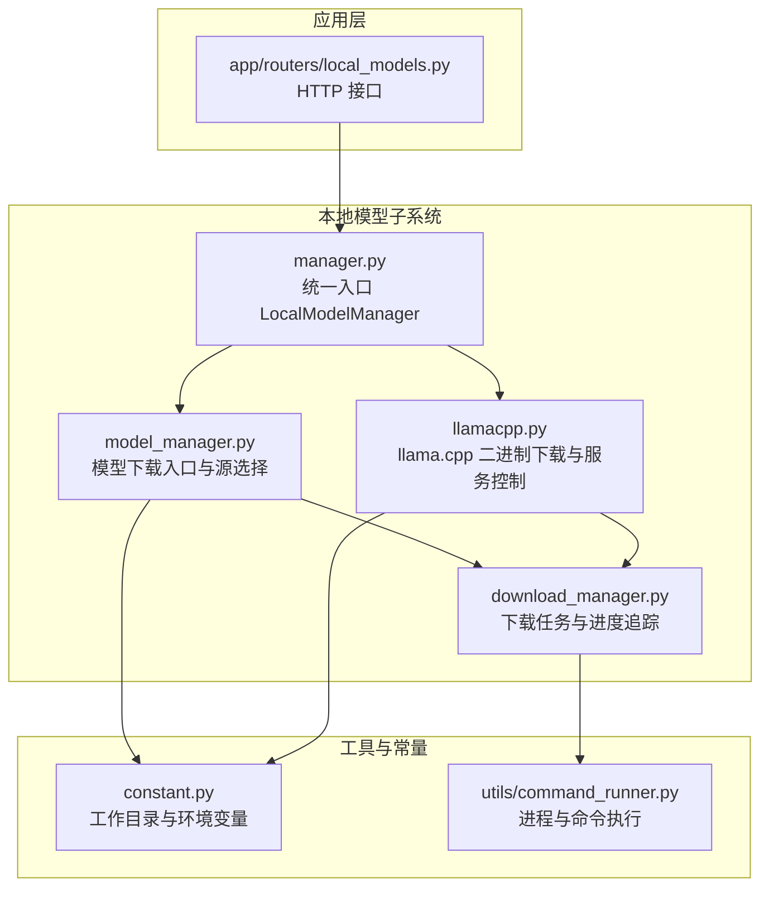
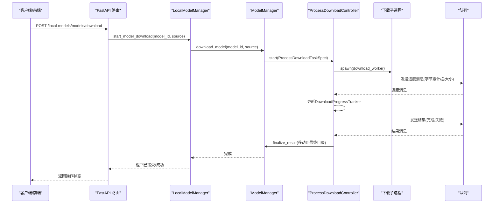
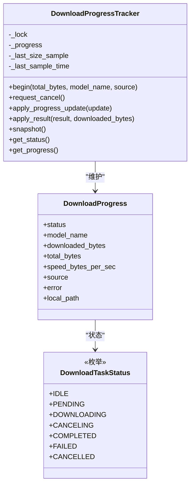
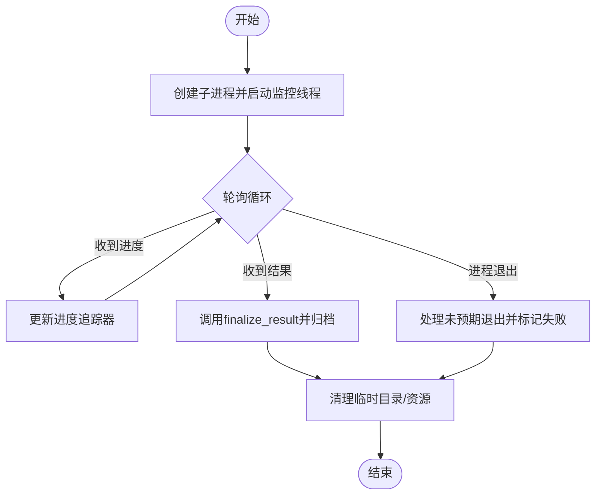
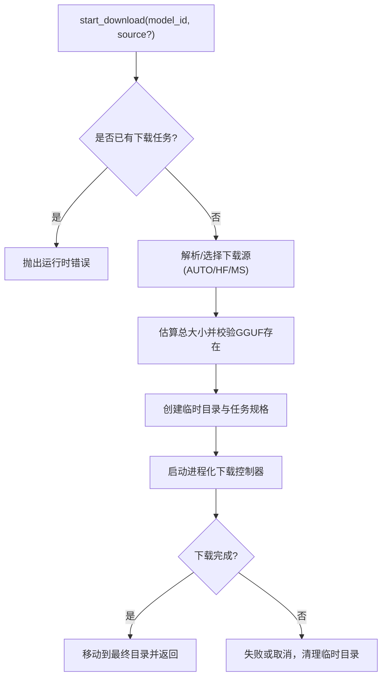
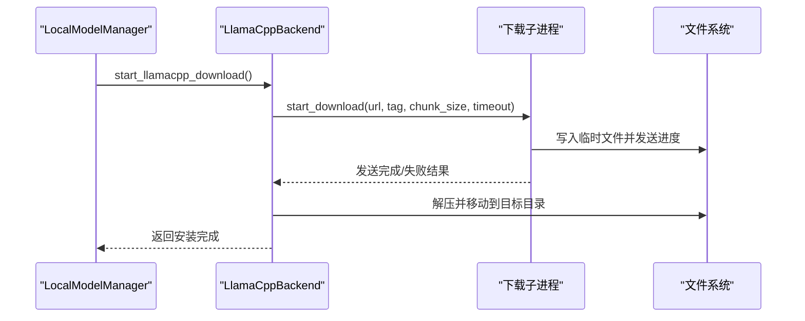
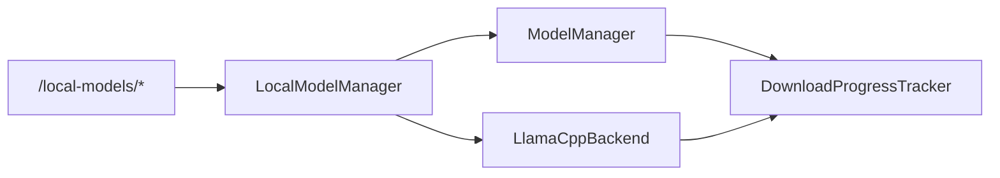
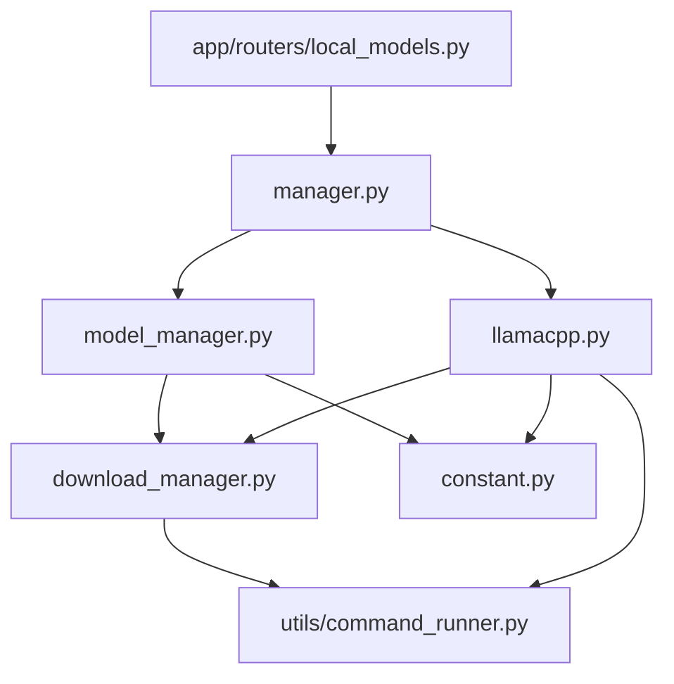

# 下载管理器

<cite>
**本文引用的文件列表**
- [download_manager.py](file://src/qwenpaw/local_models/download_manager.py)
- [model_manager.py](file://src/qwenpaw/local_models/model_manager.py)
- [llamacpp.py](file://src/qwenpaw/local_models/llamacpp.py)
- [manager.py](file://src/qwenpaw/local_models/manager.py)
- [local_models.py](file://src/qwenpaw/app/routers/local_models.py)
- [constant.py](file://src/qwenpaw/constant.py)
- [command_runner.py](file://src/qwenpaw/utils/command_runner.py)
- [test_download_manager.py](file://tests/unit/local_models/test_download_manager.py)
</cite>

## 目录
1. [简介](#简介)
2. [项目结构](#项目结构)
3. [核心组件](#核心组件)
4. [架构总览](#架构总览)
5. [详细组件分析](#详细组件分析)
6. [依赖关系分析](#依赖关系分析)
7. [性能与并发特性](#性能与并发特性)
8. [故障排查指南](#故障排查指南)
9. [结论](#结论)
10. [附录：配置与使用示例](#附录配置与使用示例)

## 简介
本技术文档面向 QwenPaw 的本地模型下载管理器，系统性阐述其设计架构、实现机制与运行流程。重点覆盖：
- 多源下载（Hugging Face、ModelScope）与自动回退策略
- 进程隔离的下载执行与断点续传能力
- 实时进度跟踪、速度计算与结果归档
- 错误重试、取消与清理机制
- 模型标签解析（非下载相关，但与本地模型生态有关）
- 镜像站点管理与网络优化策略
- 下载队列管理、并发控制与资源限制
- 下载进度监控、完整性校验与缓存策略
- 网络异常处理、超时重试与带宽限制最佳实践

## 项目结构
下载管理器位于本地模型子系统中，围绕“进程隔离 + 进度追踪 + 结果归档”的模式构建，并通过 FastAPI 路由对外暴露下载与服务器控制接口。

图表来源
- [download_manager.py:1-599](file://src/qwenpaw/local_models/download_manager.py#L1-L599)
- [model_manager.py:1-654](file://src/qwenpaw/local_models/model_manager.py#L1-L654)
- [llamacpp.py:1-887](file://src/qwenpaw/local_models/llamacpp.py#L1-L887)
- [manager.py:1-229](file://src/qwenpaw/local_models/manager.py#L1-L229)
- [local_models.py:1-454](file://src/qwenpaw/app/routers/local_models.py#L1-L454)
- [constant.py:1-307](file://src/qwenpaw/constant.py#L1-L307)
- [command_runner.py:1-578](file://src/qwenpaw/utils/command_runner.py#L1-L578)

章节来源
- [download_manager.py:1-599](file://src/qwenpaw/local_models/download_manager.py#L1-L599)
- [model_manager.py:1-654](file://src/qwenpaw/local_models/model_manager.py#L1-L654)
- [llamacpp.py:1-887](file://src/qwenpaw/local_models/llamacpp.py#L1-L887)
- [manager.py:1-229](file://src/qwenpaw/local_models/manager.py#L1-L229)
- [local_models.py:1-454](file://src/qwenpaw/app/routers/local_models.py#L1-L454)
- [constant.py:1-307](file://src/qwenpaw/constant.py#L1-L307)
- [command_runner.py:1-578](file://src/qwenpaw/utils/command_runner.py#L1-L578)

## 核心组件
- 下载任务与进度追踪：负责生命周期状态、进度更新、速度计算与结果归档。
- 进程化下载控制器：以独立进程执行下载，通过队列传递进度与结果，支持取消与清理。
- 模型下载管理器：封装模型下载入口、源探测与回退、大小估算、GGUF 校验等。
- llama.cpp 后端：负责二进制下载、解压、安装与服务启动/停止。
- 统一入口 LocalModelManager：聚合模型下载与 llama.cpp 服务控制，持久化配置。
- HTTP 路由：对外提供下载与服务器控制的 REST 接口。

章节来源
- [download_manager.py:198-599](file://src/qwenpaw/local_models/download_manager.py#L198-L599)
- [model_manager.py:63-654](file://src/qwenpaw/local_models/model_manager.py#L63-L654)
- [llamacpp.py:51-887](file://src/qwenpaw/local_models/llamacpp.py#L51-L887)
- [manager.py:33-229](file://src/qwenpaw/local_models/manager.py#L33-L229)
- [local_models.py:1-454](file://src/qwenpaw/app/routers/local_models.py#L1-L454)

## 架构总览
下载管理器采用“主进程 + 子进程 + 队列通信 + 进度追踪器”的架构，确保下载过程与 UI/服务线程解耦，避免阻塞。

图表来源
- [local_models.py:362-413](file://src/qwenpaw/app/routers/local_models.py#L362-L413)
- [manager.py:180-194](file://src/qwenpaw/local_models/manager.py#L180-L194)
- [model_manager.py:181-243](file://src/qwenpaw/local_models/model_manager.py#L181-L243)
- [download_manager.py:368-599](file://src/qwenpaw/local_models/download_manager.py#L368-L599)

## 详细组件分析

### 下载任务与进度追踪器
- 生命周期状态：空闲、待定、下载中、取消中、已完成、失败、已取消。
- 进度更新：累计下载字节、总大小、速度（基于采样时间差）、来源、错误信息、本地路径。
- 速度计算：基于最近一次采样窗口内的增量字节除以时间差。
- 结果归档：根据状态更新最终状态与本地路径；失败时记录错误。

图表来源
- [download_manager.py:25-128](file://src/qwenpaw/local_models/download_manager.py#L25-L128)
- [download_manager.py:198-366](file://src/qwenpaw/local_models/download_manager.py#L198-L366)

章节来源
- [download_manager.py:198-366](file://src/qwenpaw/local_models/download_manager.py#L198-L366)

### 进程化下载控制器
- 任务规格：包含进程名、命令、任务对象、模型名、来源、总大小、轮询间隔。
- 任务对象：包含目标函数、负载、进度探针、结果终态化回调、清理回调。
- 监控线程：周期性从队列读取进度与结果消息，更新进度追踪器；进程退出后处理未预期退出场景。
- 取消流程：请求取消状态、同步终止子进程、等待监控线程结束、清理资源并标记取消结果。

图表来源
- [download_manager.py:368-599](file://src/qwenpaw/local_models/download_manager.py#L368-L599)

章节来源
- [download_manager.py:368-599](file://src/qwenpaw/local_models/download_manager.py#L368-L599)

### 模型下载管理器（多源下载与回退）
- 源选择：优先 Hugging Face，不可达则回退 ModelScope。
- 大小估算：分别调用对应仓库 API 获取文件列表与总大小。
- GGUF 校验：检查仓库是否包含至少一个 .gguf 文件，否则拒绝下载。
- 下载执行：在子进程中调用对应 SDK 执行快照下载，完成后移动到最终目录。
- 推荐模型：按内存容量推荐不同规模的模型集合。

图表来源
- [model_manager.py:181-243](file://src/qwenpaw/local_models/model_manager.py#L181-L243)
- [model_manager.py:287-320](file://src/qwenpaw/local_models/model_manager.py#L287-L320)
- [model_manager.py:321-412](file://src/qwenpaw/local_models/model_manager.py#L321-L412)

章节来源
- [model_manager.py:63-654](file://src/qwenpaw/local_models/model_manager.py#L63-L654)

### llama.cpp 后端（二进制下载与服务控制）
- 二进制下载：构造下载 URL、创建临时目录、分块流式下载、实时进度上报、解压合并、安装到目标目录。
- 服务控制：检测安装、启动/停止服务、健康检查、日志采集、端口分配。
- 版本与更新：比较版本号、检查更新可用性。
- 错误格式化：针对不同 HTTP 状态码给出明确提示。

图表来源
- [manager.py:119-135](file://src/qwenpaw/local_models/manager.py#L119-L135)
- [llamacpp.py:145-214](file://src/qwenpaw/local_models/llamacpp.py#L145-L214)
- [llamacpp.py:539-611](file://src/qwenpaw/local_models/llamacpp.py#L539-L611)

章节来源
- [llamacpp.py:51-887](file://src/qwenpaw/local_models/llamacpp.py#L51-L887)
- [manager.py:33-229](file://src/qwenpaw/local_models/manager.py#L33-L229)

### HTTP 路由与统一入口
- 路由：提供服务器状态查询、更新检查、下载启动/取消、模型下载启动/取消、配置读写等接口。
- 统一入口：LocalModelManager 将模型下载与 llama.cpp 控制整合，持久化配置并协调 Provider 状态。

图表来源
- [local_models.py:1-454](file://src/qwenpaw/app/routers/local_models.py#L1-L454)
- [manager.py:33-229](file://src/qwenpaw/local_models/manager.py#L33-L229)

章节来源
- [local_models.py:1-454](file://src/qwenpaw/app/routers/local_models.py#L1-L454)
- [manager.py:33-229](file://src/qwenpaw/local_models/manager.py#L33-L229)

## 依赖关系分析
- 下载管理器依赖进程与队列进行异步通信，避免阻塞主线程。
- 模型下载管理器依赖外部仓库 SDK（Hugging Face、ModelScope）进行实际下载。
- llama.cpp 后端依赖 httpx 流式下载与系统命令执行工具。
- 常量模块提供默认工作目录与环境变量解析，影响下载路径与行为。

图表来源
- [download_manager.py:1-599](file://src/qwenpaw/local_models/download_manager.py#L1-L599)
- [model_manager.py:1-654](file://src/qwenpaw/local_models/model_manager.py#L1-L654)
- [llamacpp.py:1-887](file://src/qwenpaw/local_models/llamacpp.py#L1-L887)
- [manager.py:1-229](file://src/qwenpaw/local_models/manager.py#L1-L229)
- [local_models.py:1-454](file://src/qwenpaw/app/routers/local_models.py#L1-L454)
- [constant.py:1-307](file://src/qwenpaw/constant.py#L1-L307)
- [command_runner.py:1-578](file://src/qwenpaw/utils/command_runner.py#L1-L578)

章节来源
- [download_manager.py:1-599](file://src/qwenpaw/local_models/download_manager.py#L1-L599)
- [model_manager.py:1-654](file://src/qwenpaw/local_models/model_manager.py#L1-L654)
- [llamacpp.py:1-887](file://src/qwenpaw/local_models/llamacpp.py#L1-L887)
- [manager.py:1-229](file://src/qwenpaw/local_models/manager.py#L1-L229)
- [local_models.py:1-454](file://src/qwenpaw/app/routers/local_models.py#L1-L454)
- [constant.py:1-307](file://src/qwenpaw/constant.py#L1-L307)
- [command_runner.py:1-578](file://src/qwenpaw/utils/command_runner.py#L1-L578)

## 性能与并发特性
- 并发控制：下载任务以独立进程执行，避免阻塞主线程；单实例仅允许一个活跃下载任务。
- 轮询间隔：下载控制器可配置轮询间隔，平衡响应性与开销。
- 进度采样：速度基于时间窗口内的增量字节计算，避免抖动。
- 资源释放：进程结束后主动关闭队列与进程句柄，防止资源泄漏。
- 磁盘 IO：分块写入与临时目录策略减少磁盘碎片与中断风险。

章节来源
- [download_manager.py:368-599](file://src/qwenpaw/local_models/download_manager.py#L368-L599)
- [model_manager.py:181-243](file://src/qwenpaw/local_models/model_manager.py#L181-L243)
- [llamacpp.py:159-214](file://src/qwenpaw/local_models/llamacpp.py#L159-L214)

## 故障排查指南
- 下载失败：检查错误消息中的 HTTP 状态码与 URL，确认网络可达性与权限。
- 取消无效：确认当前状态不是取消中/已取消；必要时强制终止进程。
- 进度停滞：检查轮询间隔与网络状况；确认队列未被意外关闭。
- 资源清理：失败或取消后会清理临时目录，若仍残留需手动清理。
- 服务器启动失败：检查端口占用、GPU/CUDA 支持与模型文件完整性。

章节来源
- [download_manager.py:417-440](file://src/qwenpaw/local_models/download_manager.py#L417-L440)
- [llamacpp.py:614-647](file://src/qwenpaw/local_models/llamacpp.py#L614-L647)
- [test_download_manager.py:1-260](file://tests/unit/local_models/test_download_manager.py#L1-L260)

## 结论
该下载管理器通过“进程隔离 + 队列通信 + 进度追踪 + 结果归档”的设计，实现了稳定、可观测且可取消的本地模型下载能力。结合多源下载与自动回退、大小估算与 GGUF 校验、以及 llama.cpp 的二进制下载与服务控制，形成了完整的本地模型运行链路。建议在生产环境中配合合理的超时与重试策略、带宽限制与缓存策略，以获得更佳的用户体验与稳定性。

## 附录：配置与使用示例

### 下载源配置与镜像站点管理
- 源选择：AUTO 优先 Hugging Face，不可达回退 ModelScope。
- 自定义镜像：可通过修改默认下载地址与头信息实现镜像站访问（注意遵循仓库许可与合规要求）。

章节来源
- [model_manager.py:287-292](file://src/qwenpaw/local_models/model_manager.py#L287-L292)
- [llamacpp.py:796-800](file://src/qwenpaw/local_models/llamacpp.py#L796-L800)

### 网络优化策略与超时重试
- 超时参数：llama.cpp 下载支持自定义超时与分块大小，降低弱网环境下的失败率。
- 重试策略：建议在上层业务中对失败的下载任务进行指数退避重试（可参考 LLM 重试配置思路）。
- 带宽限制：通过调整分块大小与轮询间隔间接控制带宽占用。

章节来源
- [llamacpp.py:159-165](file://src/qwenpaw/local_models/llamacpp.py#L159-L165)
- [constant.py:220-282](file://src/qwenpaw/constant.py#L220-L282)

### 下载进度监控与结果获取
- 进度接口：通过 GET /local-models/models/download 获取当前进度快照。
- 结果接口：通过 GET /local-models/server/download 获取 llama.cpp 下载进度。

章节来源
- [local_models.py:388-397](file://src/qwenpaw/app/routers/local_models.py#L388-L397)
- [local_models.py:255-264](file://src/qwenpaw/app/routers/local_models.py#L255-L264)

### 代理设置与认证方法
- 代理：llama.cpp 下载使用 httpx 客户端，可在运行环境中配置 HTTP/HTTPS 代理（如 http_proxy/https_proxy），或在下载前注入代理头。
- 认证：当前下载实现未内置认证头注入逻辑，如需认证请在上游镜像站或 CDN 层面处理。

章节来源
- [llamacpp.py:552-560](file://src/qwenpaw/local_models/llamacpp.py#L552-L560)
- [llamacpp.py:796-800](file://src/qwenpaw/local_models/llamacpp.py#L796-L800)

### 完整性校验与缓存策略
- 完整性：下载完成后通过移动临时目录到最终位置保证原子性；建议在上层业务中增加哈希校验（如 SHA-256）以确保文件完整。
- 缓存：下载完成后保留最终目录，避免重复下载；可通过删除最终目录触发重新下载。

章节来源
- [model_manager.py:582-595](file://src/qwenpaw/local_models/model_manager.py#L582-L595)
- [llamacpp.py:497-536](file://src/qwenpaw/local_models/llamacpp.py#L497-L536)

### 下载队列管理与并发控制
- 单任务并发：同一时间仅允许一个下载任务；重复启动会抛出运行时错误。
- 取消与清理：取消时会终止子进程并清理临时资源，确保系统干净。

章节来源
- [model_manager.py:188-189](file://src/qwenpaw/local_models/model_manager.py#L188-L189)
- [download_manager.py:417-440](file://src/qwenpaw/local_models/download_manager.py#L417-L440)

### 模型标签解析（补充说明）
- 该功能用于解析模型输出中的特殊标签（推理与工具调用），与下载管理器无直接关联，但属于本地模型生态的一部分。

章节来源
- [tag_parser.py:1-367](file://src/qwenpaw/local_models/tag_parser.py#L1-L367)