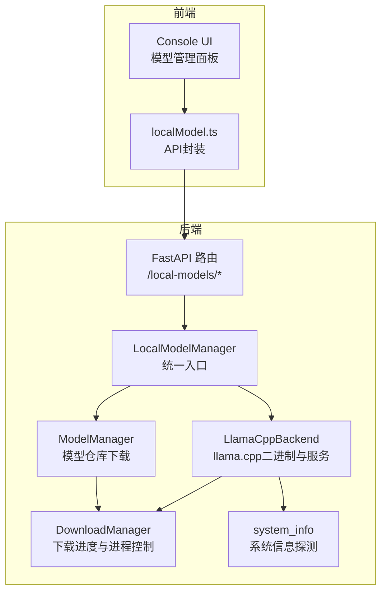
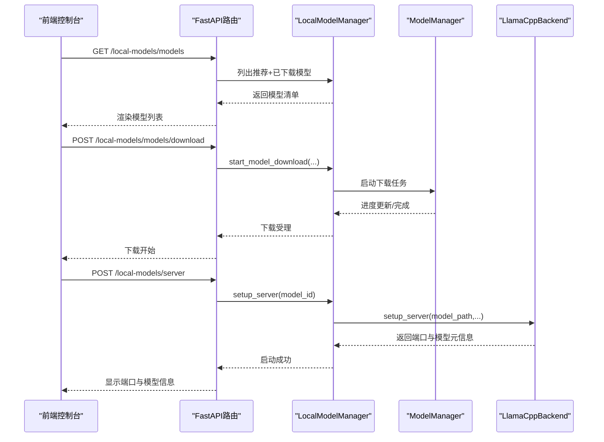
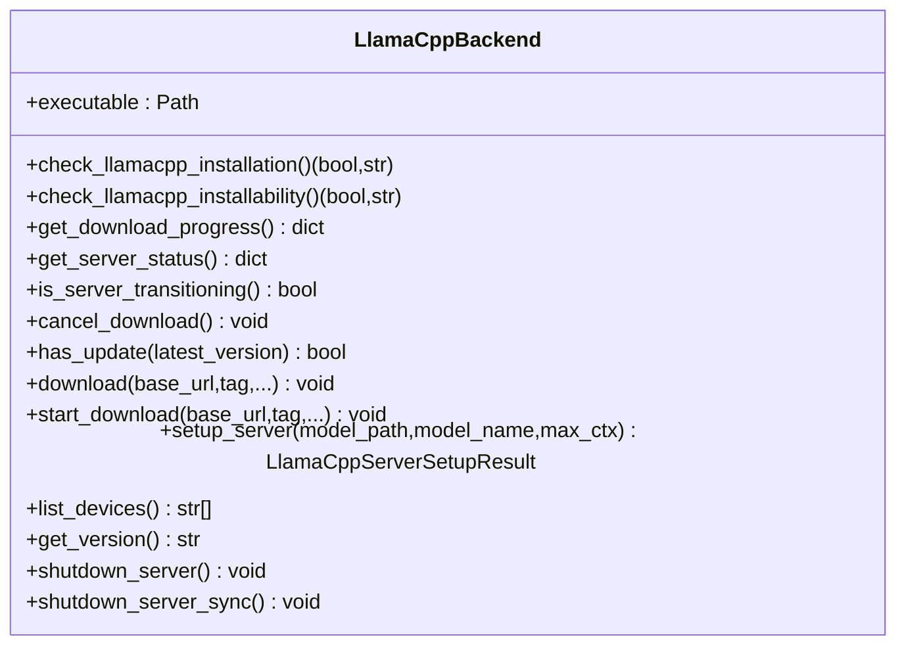
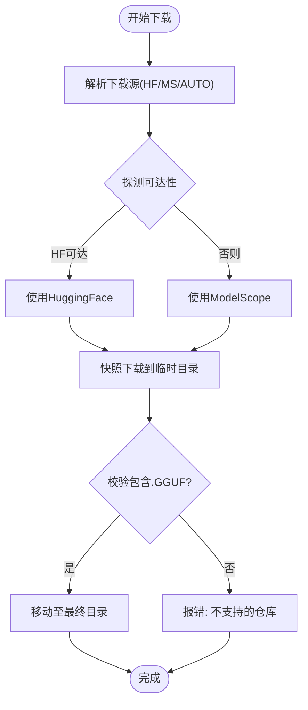
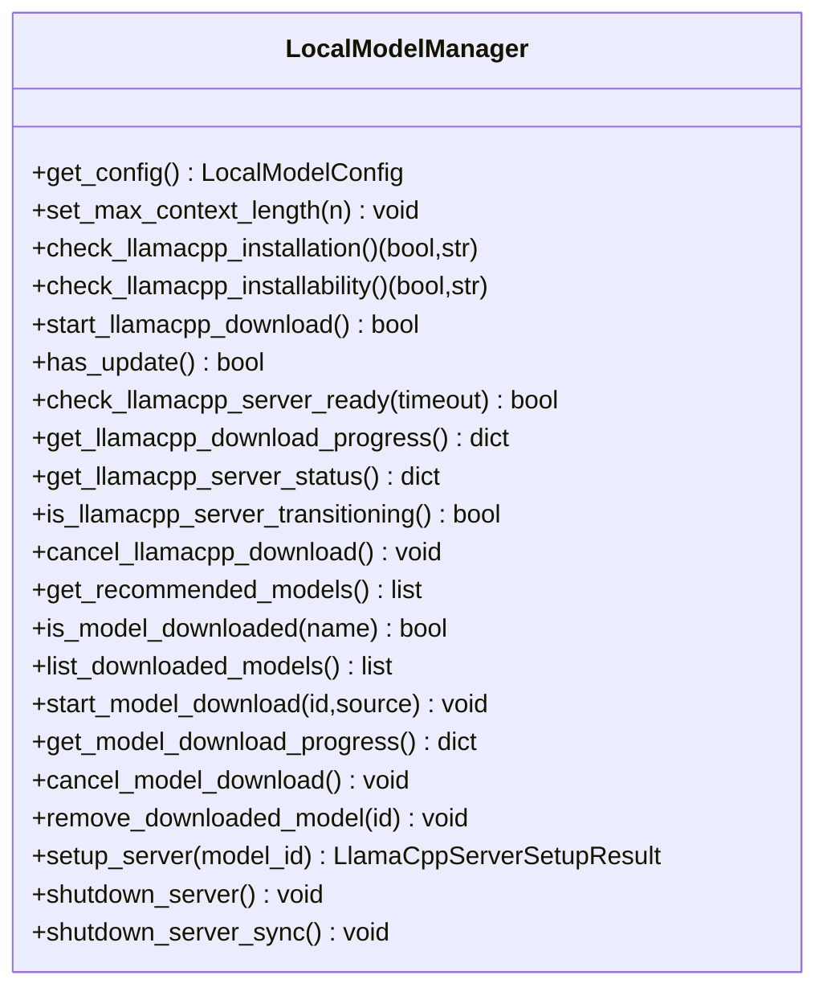
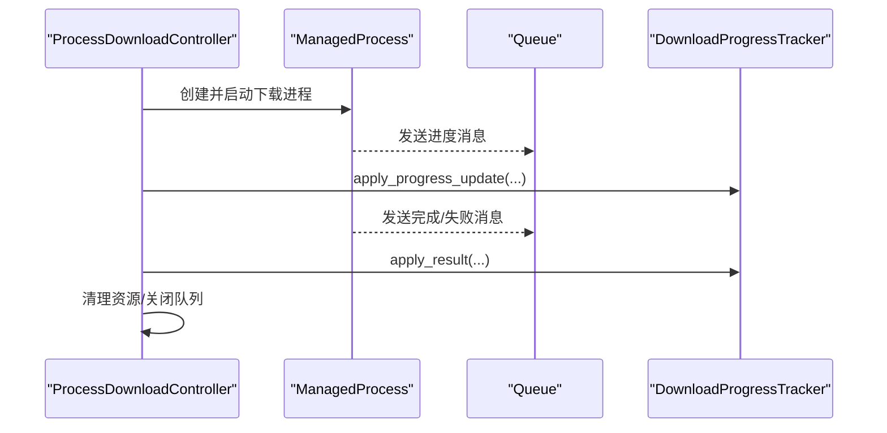
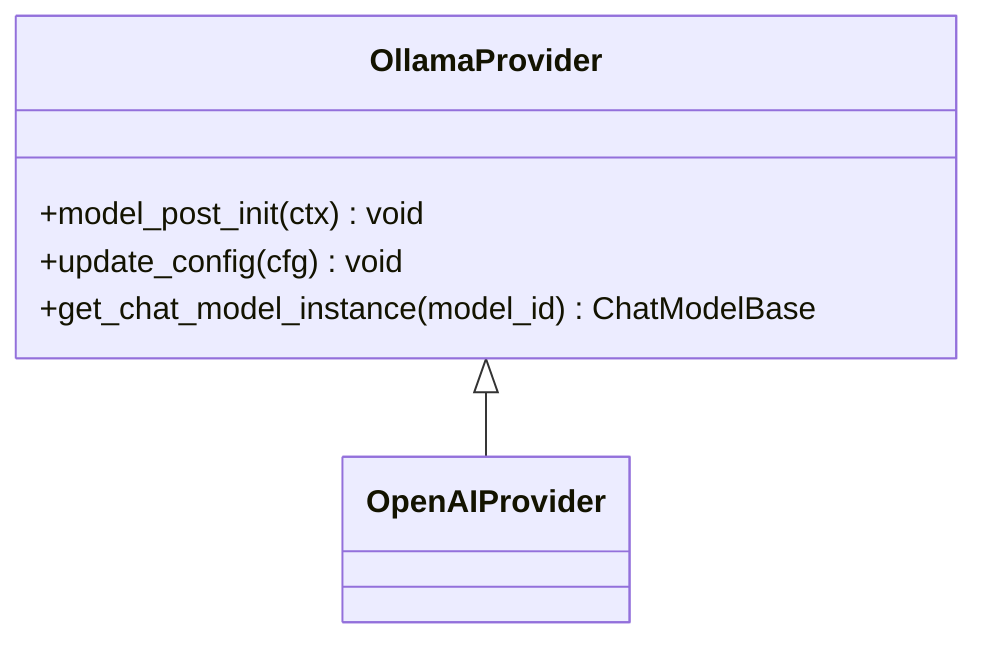
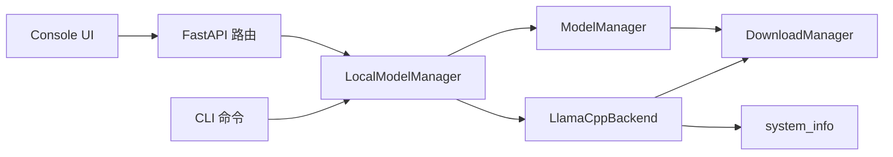
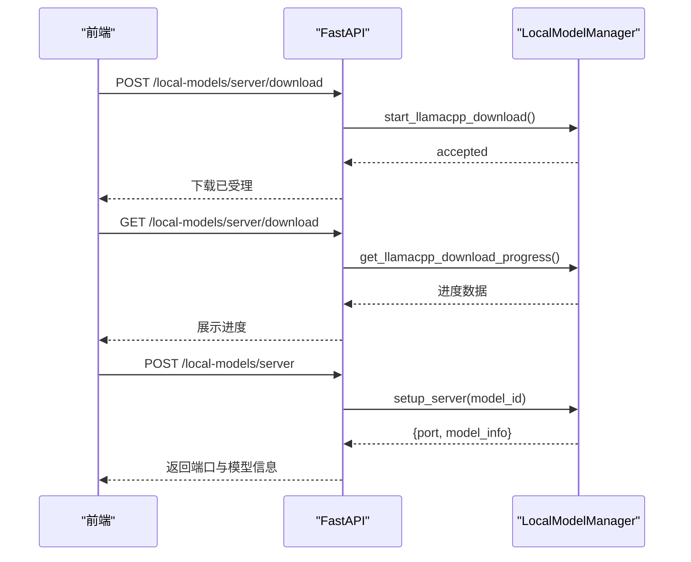

# 本地模型支持

<cite>
**本文引用的文件**
- [src\qwenpaw\local_models\__init__.py](file://src\qwenpaw\local_models\__init__.py)
- [src\qwenpaw\local_models\download_manager.py](file://src\qwenpaw\local_models\download_manager.py)
- [src\qwenpaw\local_models\llamacpp.py](file://src\qwenpaw\local_models\llamacpp.py)
- [src\qwenpaw\local_models\manager.py](file://src\qwenpaw\local_models\manager.py)
- [src\qwenpaw\local_models\model_manager.py](file://src\qwenpaw\local_models\model_manager.py)
- [src\qwenpaw\providers\ollama_provider.py](file://src\qwenpaw\providers\ollama_provider.py)
- [src\qwenpaw\app\routers\local_models.py](file://src\qwenpaw\app\routers\local_models.py)
- [src\qwenpaw\cli\providers_cmd.py](file://src\qwenpaw\cli\providers_cmd.py)
- [src\qwenpaw\utils\system_info.py](file://src\qwenpaw\utils\system_info.py)
- [console\src\api\modules\localModel.ts](file://console\src\api\modules\localModel.ts)
- [console\src\pages\Settings\Models\components\modals\LocalModelManageModal.tsx](file://console\src\pages\Settings\Models\components\modals\LocalModelManageModal.tsx)
- [console\src\pages\Settings\Models\components\modals\local-models\LocalModelRow.tsx](file://console\src\pages\Settings\Models\components\modals\local-models\LocalModelRow.tsx)
- [console\src\pages\Settings\Models\components\cards\LocalProviderCard.tsx](file://console\src\pages\Settings\Models\components\cards\LocalProviderCard.tsx)
- [src\qwenpaw\exceptions.py](file://src\qwenpaw\exceptions.py)
- [website\public\docs\security.en.md](file://website\public\docs\security.en.md)
- [SECURITY.md](file://SECURITY.md)
</cite>

## 目录
1. [简介](#简介)
2. [项目结构](#项目结构)
3. [核心组件](#核心组件)
4. [架构总览](#架构总览)
5. [组件详解](#组件详解)
6. [依赖关系分析](#依赖关系分析)
7. [性能与资源优化](#性能与资源优化)
8. [安装与配置指南](#安装与配置指南)
9. [使用流程与API](#使用流程与api)
10. [故障排除](#故障排除)
11. [安全与隐私](#安全与隐私)
12. [本地模型与云端模型对比](#本地模型与云端模型对比)
13. [结论](#结论)

## 简介
本文件面向QwenPaw的本地模型支持能力，系统性阐述其架构设计、实现机制与运维实践，覆盖llama.cpp、Ollama等本地推理引擎的集成方式；涵盖下载、安装、配置、启动与停止的完整生命周期；提供性能优化、内存管理与GPU加速要点；给出安装与配置步骤、API调用序列、常见问题排查与安全隐私建议，并对本地与云端模型进行对比与选型建议。

## 项目结构
本地模型支持由后端Python模块与前端控制台两部分组成：
- 后端：负责本地模型下载、llama.cpp二进制管理、本地服务启停、与Provider体系对接
- 前端：提供模型推荐、下载进度、服务器状态查看与启停操作的可视化界面

**图表来源**
- [src\qwenpaw\local_models\manager.py:33-229](file://src\qwenpaw\local_models\manager.py#L33-L229)
- [src\qwenpaw\local_models\model_manager.py:63-136](file://src\qwenpaw\local_models\model_manager.py#L63-L136)
- [src\qwenpaw\local_models\llamacpp.py:51-128](file://src\qwenpaw\local_models\llamacpp.py#L51-L128)
- [src\qwenpaw\local_models\download_manager.py:198-367](file://src\qwenpaw\local_models\download_manager.py#L198-L367)
- [src\qwenpaw\utils\system_info.py:111-121](file://src\qwenpaw\utils\system_info.py#L111-L121)
- [src\qwenpaw\app\routers\local_models.py:23-48](file://src\qwenpaw\app\routers\local_models.py#L23-L48)

**章节来源**
- [src\qwenpaw\local_models\__init__.py:1-17](file://src\qwenpaw\local_models\__init__.py#L1-L17)
- [src\qwenpaw\app\routers\local_models.py:23-48](file://src\qwenpaw\app\routers\local_models.py#L23-L48)

## 核心组件
- LocalModelManager：本地模型统一入口，聚合下载器与llama.cpp后端，持久化本地运行参数（如最大上下文长度），协调Provider更新
- ModelManager：负责从HuggingFace或ModelScope拉取GGUF仓库到本地，支持进度追踪、估算大小、校验.GGUF存在性、清理临时目录
- LlamaCppBackend：封装llama.cpp二进制下载、解压、安装路径、服务进程启动/停止、健康检查、设备枚举、版本查询、日志流处理
- DownloadManager：多进程下载控制器，提供进度追踪、结果归并、取消、清理、跨线程/进程消息传递
- FastAPI路由：对外暴露本地模型管理REST接口，供前端与CLI调用
- CLI命令：提供models子命令，支持下载、列出、删除本地模型，交互式配置Provider与模型槽位
- 前端控制台：提供模型推荐列表、下载进度、服务器状态、启停按钮与配置项

**章节来源**
- [src\qwenpaw\local_models\manager.py:33-229](file://src\qwenpaw\local_models\manager.py#L33-L229)
- [src\qwenpaw\local_models\model_manager.py:63-136](file://src\qwenpaw\local_models\model_manager.py#L63-L136)
- [src\qwenpaw\local_models\llamacpp.py:51-128](file://src\qwenpaw\local_models\llamacpp.py#L51-L128)
- [src\qwenpaw\local_models\download_manager.py:198-367](file://src\qwenpaw\local_models\download_manager.py#L198-L367)
- [src\qwenpaw\app\routers\local_models.py:145-338](file://src\qwenpaw\app\routers\local_models.py#L145-L338)
- [src\qwenpaw\cli\providers_cmd.py:698-800](file://src\qwenpaw\cli\providers_cmd.py#L698-L800)
- [console\src\api\modules\localModel.ts:1-59](file://console\src\api\modules\localModel.ts#L1-L59)

## 架构总览
本地模型支持采用“后端服务 + 前端控制台 + CLI”的分层架构：
- 后端通过FastAPI路由暴露管理接口，内部以LocalModelManager为核心协调者
- 下载采用多进程+队列的消息模式，保证UI与服务端不阻塞
- llama.cpp服务作为独立进程运行，通过健康检查与日志流保障可观测性
- Provider体系将本地模型注册为可选的“本地”提供方，便于统一切换与激活

**图表来源**
- [src\qwenpaw\app\routers\local_models.py:345-386](file://src\qwenpaw\app\routers\local_models.py#L345-L386)
- [src\qwenpaw\local_models\manager.py:180-211](file://src\qwenpaw\local_models\manager.py#L180-L211)
- [src\qwenpaw\local_models\llamacpp.py:216-308](file://src\qwenpaw\local_models\llamacpp.py#L216-L308)

## 组件详解

### LlamaCppBackend：本地推理引擎封装
- 负责llama.cpp二进制下载与安装路径管理，支持Windows/macOS/Linux与不同架构
- 提供服务进程启动/停止、健康检查、版本查询、设备枚举示例
- 支持多模态模型（通过mmproj文件识别）
- 使用多进程+队列进行下载与日志流处理，避免阻塞

**图表来源**
- [src\qwenpaw\local_models\llamacpp.py:51-128](file://src\qwenpaw\local_models\llamacpp.py#L51-L128)
- [src\qwenpaw\local_models\llamacpp.py:216-308](file://src\qwenpaw\local_models\llamacpp.py#L216-L308)

**章节来源**
- [src\qwenpaw\local_models\llamacpp.py:51-128](file://src\qwenpaw\local_models\llamacpp.py#L51-L128)
- [src\qwenpaw\local_models\llamacpp.py:145-215](file://src\qwenpaw\local_models\llamacpp.py#L145-L215)
- [src\qwenpaw\local_models\llamacpp.py:216-308](file://src\qwenpaw\local_models\llamacpp.py#L216-L308)
- [src\qwenpaw\local_models\llamacpp.py:309-344](file://src\qwenpaw\local_models\llamacpp.py#L309-L344)
- [src\qwenpaw\local_models\llamacpp.py:398-421](file://src\qwenpaw\local_models\llamacpp.py#L398-L421)

### ModelManager：本地模型仓库下载
- 自动探测可用内存/显存，推荐适合的模型规模
- 从HuggingFace或ModelScope拉取GGUF仓库快照，支持进度估算与.GGUF存在性校验
- 使用多进程隔离下载逻辑，失败时清理临时目录
- 支持列出、删除已下载模型，计算已下载字节数

**图表来源**
- [src\qwenpaw\local_models\model_manager.py:287-292](file://src\qwenpaw\local_models\model_manager.py#L287-L292)
- [src\qwenpaw\local_models\model_manager.py:321-356](file://src\qwenpaw\local_models\model_manager.py#L321-L356)
- [src\qwenpaw\local_models\model_manager.py:474-517](file://src\qwenpaw\local_models\model_manager.py#L474-L517)

**章节来源**
- [src\qwenpaw\local_models\model_manager.py:63-136](file://src\qwenpaw\local_models\model_manager.py#L63-L136)
- [src\qwenpaw\local_models\model_manager.py:181-250](file://src\qwenpaw\local_models\model_manager.py#L181-L250)
- [src\qwenpaw\local_models\model_manager.py:287-320](file://src\qwenpaw\local_models\model_manager.py#L287-L320)

### LocalModelManager：统一入口与配置持久化
- 持久化本地运行参数（如最大上下文长度），写入安全权限的配置文件
- 协调llama.cpp下载与服务启停，必要时清空Provider状态
- 对外暴露下载进度、服务器状态、更新检查等查询接口

**图表来源**
- [src\qwenpaw\local_models\manager.py:23-110](file://src\qwenpaw\local_models\manager.py#L23-L110)
- [src\qwenpaw\local_models\manager.py:119-229](file://src\qwenpaw\local_models\manager.py#L119-L229)

**章节来源**
- [src\qwenpaw\local_models\manager.py:23-110](file://src\qwenpaw\local_models\manager.py#L23-L110)
- [src\qwenpaw\local_models\manager.py:119-229](file://src\qwenpaw\local_models\manager.py#L119-L229)

### DownloadManager：下载控制器与进度追踪
- 提供DownloadProgressTracker与ProcessDownloadController，支持多进程下载、进度上报、取消与清理
- 将下载过程中的进度与结果通过队列消息传递，避免阻塞主线程

**图表来源**
- [src\qwenpaw\local_models\download_manager.py:368-538](file://src\qwenpaw\local_models\download_manager.py#L368-L538)
- [src\qwenpaw\local_models\download_manager.py:198-367](file://src\qwenpaw\local_models\download_manager.py#L198-L367)

**章节来源**
- [src\qwenpaw\local_models\download_manager.py:198-367](file://src\qwenpaw\local_models\download_manager.py#L198-L367)
- [src\qwenpaw\local_models\download_manager.py:368-599](file://src\qwenpaw\local_models\download_manager.py#L368-L599)

### OllamaProvider：本地推理引擎对接
- 针对Ollama平台提供OpenAI兼容的客户端封装，自动规范化URL，支持在本地直接使用Ollama托管的模型
- 通过Provider体系将本地模型注册为可选槽位，便于统一配置与切换

**图表来源**
- [src\qwenpaw\providers\ollama_provider.py:16-86](file://src\qwenpaw\providers\ollama_provider.py#L16-L86)

**章节来源**
- [src\qwenpaw\providers\ollama_provider.py:16-86](file://src\qwenpaw\providers\ollama_provider.py#L16-L86)

## 依赖关系分析
- LocalModelManager聚合ModelManager与LlamaCppBackend，作为后端统一入口
- ModelManager与LlamaCppBackend均依赖DownloadManager进行后台下载
- LlamaCppBackend依赖system_info进行系统信息探测（OS/架构/CUDA/内存/显存）
- FastAPI路由依赖LocalModelManager提供REST接口
- CLI命令依赖LocalModelManager执行下载与配置
- 前端通过localModel.ts封装API调用，驱动控制台交互

**图表来源**
- [src\qwenpaw\local_models\manager.py:45-55](file://src\qwenpaw\local_models\manager.py#L45-L55)
- [src\qwenpaw\local_models\model_manager.py:66-76](file://src\qwenpaw\local_models\model_manager.py#L66-L76)
- [src\qwenpaw\local_models\llamacpp.py:64-76](file://src\qwenpaw\local_models\llamacpp.py#L64-L76)
- [src\qwenpaw\utils\system_info.py:111-121](file://src\qwenpaw\utils\system_info.py#L111-L121)
- [src\qwenpaw\app\routers\local_models.py:26-34](file://src\qwenpaw\app\routers\local_models.py#L26-L34)
- [src\qwenpaw\cli\providers_cmd.py:20-34](file://src\qwenpaw\cli\providers_cmd.py#L20-L34)
- [console\src\api\modules\localModel.ts:1-59](file://console\src\api\modules\localModel.ts#L1-L59)

**章节来源**
- [src\qwenpaw\local_models\manager.py:45-55](file://src\qwenpaw\local_models\manager.py#L45-L55)
- [src\qwenpaw\local_models\model_manager.py:66-76](file://src\qwenpaw\local_models\model_manager.py#L66-L76)
- [src\qwenpaw\local_models\llamacpp.py:64-76](file://src\qwenpaw\local_models\llamacpp.py#L64-L76)
- [src\qwenpaw\utils\system_info.py:111-121](file://src\qwenpaw\utils\system_info.py#L111-L121)
- [src\qwenpaw\app\routers\local_models.py:26-34](file://src\qwenpaw\app\routers\local_models.py#L26-L34)
- [src\qwenpaw\cli\providers_cmd.py:20-34](file://src\qwenpaw\cli\providers_cmd.py#L20-L34)
- [console\src\api\modules\localModel.ts:1-59](file://console\src\api\modules\localModel.ts#L1-L59)

## 性能与资源优化
- 上下文长度设置：通过LocalModelConfig持久化max_context_length，影响llama.cpp启动参数，合理设置可平衡吞吐与延迟
- 内存与显存优先级：ModelManager优先使用VRAM容量，其次使用系统内存，自动推荐适配当前硬件的模型规模
- GPU加速：llama.cpp通过--gpu-layers auto启用GPU推理；list_devices可枚举可用设备
- 多进程下载：避免阻塞主线程，提升并发下载体验
- 日志与健康检查：异步读取服务日志，定期健康检查确保服务可用

**章节来源**
- [src\qwenpaw\local_models\manager.py:23-31](file://src\qwenpaw\local_models\manager.py#L23-L31)
- [src\qwenpaw\local_models\model_manager.py:519-525](file://src\qwenpaw\local_models\model_manager.py#L519-L525)
- [src\qwenpaw\local_models\llamacpp.py:368-379](file://src\qwenpaw\local_models\llamacpp.py#L368-L379)
- [src\qwenpaw\local_models\download_manager.py:368-448](file://src\qwenpaw\local_models\download_manager.py#L368-L448)

## 安装与配置指南
- 安装依赖
  - 后端：pip安装qwenpaw，若需本地模型功能，按需安装本地依赖
  - 前端：使用npm/pnpm安装依赖后运行
- 启动后端服务：启动FastAPI应用，加载LocalModelManager实例
- 配置Provider
  - 通过CLI命令交互式配置Provider与模型槽位
  - 或在Console中选择“本地嵌入式”提供方，下载并启动模型
- llama.cpp下载与启动
  - 在Console中点击“开始下载llama.cpp”，等待进度完成
  - 选择已下载模型，点击“启动服务器”，获取端口与模型信息
- Ollama集成
  - 若已有Ollama服务，可在Console中配置OllamaProvider，或通过CLI设置OLLAMA_HOST环境变量

**章节来源**
- [src\qwenpaw\cli\providers_cmd.py:433-467](file://src\qwenpaw\cli\providers_cmd.py#L433-L467)
- [src\qwenpaw\app\routers\local_models.py:233-338](file://src\qwenpaw\app\routers\local_models.py#L233-L338)
- [src\qwenpaw\providers\ollama_provider.py:36-46](file://src\qwenpaw\providers\ollama_provider.py#L36-L46)

## 使用流程与API
- 前端API封装
  - 本地模型相关API：获取服务器状态、检查更新、下载llama.cpp、下载模型、启动/停止本地服务器、获取/设置本地配置
- 后端路由
  - /local-models/server：查询服务器可用性、下载llama.cpp、启动/停止服务器
  - /local-models/models：列出推荐与已下载模型、开始/取消下载模型
  - /local-models/config：获取/设置本地模型配置

**图表来源**
- [console\src\api\modules\localModel.ts:19-59](file://console\src\api\modules\localModel.ts#L19-L59)
- [src\qwenpaw\app\routers\local_models.py:233-338](file://src\qwenpaw\app\routers\local_models.py#L233-L338)
- [src\qwenpaw\local_models\manager.py:119-165](file://src\qwenpaw\local_models\manager.py#L119-L165)

**章节来源**
- [console\src\api\modules\localModel.ts:1-59](file://console\src\api\modules\localModel.ts#L1-L59)
- [src\qwenpaw\app\routers\local_models.py:145-338](file://src\qwenpaw\app\routers\local_models.py#L145-L338)
- [src\qwenpaw\local_models\manager.py:119-211](file://src\qwenpaw\local_models\manager.py#L119-L211)

## 故障排除
- llama.cpp下载失败
  - 检查网络连通性与目标URL可达性；根据错误提示判断是否为HTTP 401/403/404或服务器异常
  - 取消并重试下载，确认磁盘空间充足
- 服务器无法启动/健康检查失败
  - 查看服务日志输出，确认端口占用与权限
  - 检查模型路径与.GGUF文件是否存在
- 模型下载失败
  - 确认仓库包含.GGUF文件；若不可用，更换下载源或选择其他模型
- 异常转换与诊断
  - 运行时异常会被转换为统一的模型异常类型，便于前端展示与定位

**章节来源**
- [src\qwenpaw\local_models\llamacpp.py:614-647](file://src\qwenpaw\local_models\llamacpp.py#L614-L647)
- [src\qwenpaw\local_models\llamacpp.py:656-692](file://src\qwenpaw\local_models\llamacpp.py#L656-L692)
- [src\qwenpaw\local_models\model_manager.py:474-517](file://src\qwenpaw\local_models\model_manager.py#L474-L517)
- [src\qwenpaw\exceptions.py:165-253](file://src\qwenpaw\exceptions.py#L165-L253)

## 安全与隐私
- 安全架构
  - 工具守卫（Tool Guard）：实时扫描工具调用参数，阻止危险模式
  - 文件守卫（File Guard）：限制对敏感文件与目录的访问
  - 技能扫描（Skill Scanner）：启用前扫描技能代码与潜在威胁
- 隐私与边界
  - 本地模型运行于本地，避免将对话内容上传至第三方
  - 建议在受信边界内部署，避免共享多用户实例带来的风险
- Console访问控制
  - 可选的Web认证用于保护控制台界面

**章节来源**
- [website\public\docs\security.en.md:1-36](file://website\public\docs\security.en.md#L1-L36)
- [SECURITY.md:53-118](file://SECURITY.md#L53-L118)

## 本地模型与云端模型对比
- 本地模型优势
  - 数据隐私：模型与数据不出本地，满足高合规要求
  - 稳定性：不受第三方服务波动影响
  - 成本：长期使用成本可控
- 本地模型劣势
  - 硬件门槛：需要足够的内存/显存支撑合适规模的模型
  - 维护成本：需自行维护下载、更新与服务启停
- 云端模型优势
  - 部署简单、扩展性强
  - 无需本地资源投入
- 选择建议
  - 对隐私与合规要求高、具备硬件条件：优先本地
  - 快速验证、小规模使用：可考虑云端
  - 混合策略：关键业务本地，日常测试云端

## 结论
QwenPaw的本地模型支持以LocalModelManager为核心，结合ModelManager与LlamaCppBackend，提供了从下载、安装、配置到服务启停的完整闭环；通过Provider体系与Console/CLI双入口，兼顾易用性与可运维性。配合安全与隐私策略，可在满足合规与性能的前提下，灵活选择本地或云端模型方案。