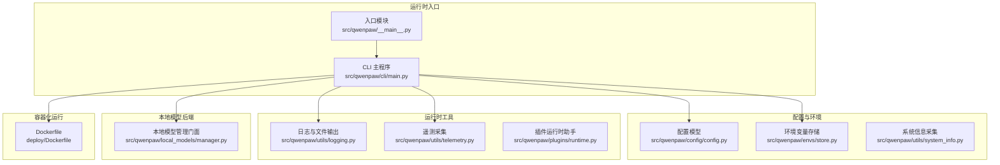
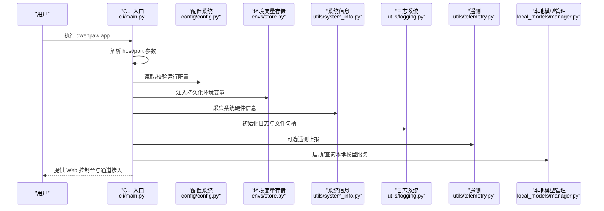
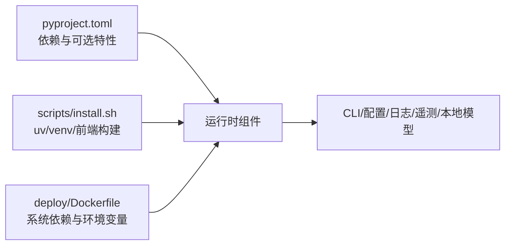

# 本地运行时

<cite>
**本文引用的文件**   
- [README.md](file://README.md)
- [pyproject.toml](file://pyproject.toml)
- [setup.py](file://setup.py)
- [src/qwenpaw/__main__.py](file://src/qwenpaw/__main__.py)
- [src/qwenpaw/cli/main.py](file://src/qwenpaw/cli/main.py)
- [src/qwenpaw/config/config.py](file://src/qwenpaw/config/config.py)
- [src/qwenpaw/envs/store.py](file://src/qwenpaw/envs/store.py)
- [src/qwenpaw/utils/system_info.py](file://src/qwenpaw/utils/system_info.py)
- [src/qwenpaw/local_models/manager.py](file://src/qwenpaw/local_models/manager.py)
- [src/qwenpaw/utils/logging.py](file://src/qwenpaw/utils/logging.py)
- [src/qwenpaw/utils/telemetry.py](file://src/qwenpaw/utils/telemetry.py)
- [src/qwenpaw/plugins/runtime.py](file://src/qwenpaw/plugins/runtime.py)
- [deploy/Dockerfile](file://deploy/Dockerfile)
- [scripts/install.sh](file://scripts/install.sh)
</cite>

## 目录
1. [简介](#简介)
2. [项目结构](#项目结构)
3. [核心组件](#核心组件)
4. [架构总览](#架构总览)
5. [详细组件分析](#详细组件分析)
6. [依赖关系分析](#依赖关系分析)
7. [性能考虑](#性能考虑)
8. [故障排查指南](#故障排查指南)
9. [结论](#结论)
10. [附录](#附录)

## 简介
本文件面向在本地部署与运行 QwenPaw 的工程师与运维人员，聚焦“本地运行时环境”的配置与管理，覆盖以下主题：
- 运行时依赖与系统要求
- 环境变量与持久化存储
- 不同操作系统的安装与差异
- 性能监控、资源统计与瓶颈定位
- 环境搭建步骤、依赖安装与配置验证
- 性能调优（含内存与 GPU 加速）
- 日志分析、错误诊断与故障排除
- 安全配置、权限与隔离最佳实践

## 项目结构
从运行时视角，QwenPaw 的本地运行由“命令行入口 + 配置与环境 + 运行时工具集 + 可选本地模型后端 + 容器化运行”构成。

图示来源
- [src/qwenpaw/cli/main.py:1-171](file://src/qwenpaw/cli/main.py#L1-L171)
- [src/qwenpaw/__main__.py:1-7](file://src/qwenpaw/__main__.py#L1-L7)
- [src/qwenpaw/config/config.py:1-800](file://src/qwenpaw/config/config.py#L1-L800)
- [src/qwenpaw/envs/store.py:1-263](file://src/qwenpaw/envs/store.py#L1-L263)
- [src/qwenpaw/utils/system_info.py:1-229](file://src/qwenpaw/utils/system_info.py#L1-L229)
- [src/qwenpaw/utils/logging.py:1-202](file://src/qwenpaw/utils/logging.py#L1-L202)
- [src/qwenpaw/utils/telemetry.py:1-305](file://src/qwenpaw/utils/telemetry.py#L1-L305)
- [src/qwenpaw/local_models/manager.py:1-229](file://src/qwenpaw/local_models/manager.py#L1-L229)
- [deploy/Dockerfile:1-103](file://deploy/Dockerfile#L1-L103)

章节来源
- [src/qwenpaw/cli/main.py:1-171](file://src/qwenpaw/cli/main.py#L1-L171)
- [src/qwenpaw/__main__.py:1-7](file://src/qwenpaw/__main__.py#L1-L7)
- [deploy/Dockerfile:1-103](file://deploy/Dockerfile#L1-L103)

## 核心组件
- 命令行入口与启动流程：负责解析主机/端口参数、延迟加载子命令、记录初始化耗时，以及在 Windows 上确保标准流编码正确。
- 配置与运行参数：集中定义通道、心跳、上下文压缩、工具结果压缩、记忆摘要、嵌入等运行期行为参数。
- 环境变量与密钥存储：以加密方式持久化敏感变量，支持注入到当前进程环境，避免明文泄露。
- 系统信息采集：跨平台获取 OS、架构、内存、显存与 CUDA 版本，用于本地模型能力判断与性能评估。
- 日志系统：统一命名空间、彩色终端输出、可选文件轮转、访问日志过滤，便于生产排障。
- 遥测采集：匿名收集安装方法、系统版本、CPU 架构、GPU 检测等，支持永久拒绝。
- 本地模型管理：封装 llama.cpp 下载、服务生命周期、模型下载进度与服务器状态查询。
- 插件运行时助手：为插件提供 Provider 查询、日志接口等能力。
- 容器镜像：预装 Python、Chromium、Supervisor，内置工作目录与密钥目录，支持容器内无沙箱模式与浏览器驱动。

章节来源
- [src/qwenpaw/cli/main.py:1-171](file://src/qwenpaw/cli/main.py#L1-L171)
- [src/qwenpaw/config/config.py:1-800](file://src/qwenpaw/config/config.py#L1-L800)
- [src/qwenpaw/envs/store.py:1-263](file://src/qwenpaw/envs/store.py#L1-L263)
- [src/qwenpaw/utils/system_info.py:1-229](file://src/qwenpaw/utils/system_info.py#L1-L229)
- [src/qwenpaw/utils/logging.py:1-202](file://src/qwenpaw/utils/logging.py#L1-L202)
- [src/qwenpaw/utils/telemetry.py:1-305](file://src/qwenpaw/utils/telemetry.py#L1-L305)
- [src/qwenpaw/local_models/manager.py:1-229](file://src/qwenpaw/local_models/manager.py#L1-L229)
- [src/qwenpaw/plugins/runtime.py:1-68](file://src/qwenpaw/plugins/runtime.py#L1-L68)
- [deploy/Dockerfile:1-103](file://deploy/Dockerfile#L1-L103)

## 架构总览
下图展示本地运行时的关键交互路径：CLI 启动、配置加载、环境变量注入、日志与遥测初始化、本地模型后端控制、以及容器化运行时的进程编排。

图示来源
- [src/qwenpaw/cli/main.py:146-171](file://src/qwenpaw/cli/main.py#L146-L171)
- [src/qwenpaw/config/config.py:1-800](file://src/qwenpaw/config/config.py#L1-L800)
- [src/qwenpaw/envs/store.py:242-263](file://src/qwenpaw/envs/store.py#L242-L263)
- [src/qwenpaw/utils/system_info.py:111-121](file://src/qwenpaw/utils/system_info.py#L111-L121)
- [src/qwenpaw/utils/logging.py:121-158](file://src/qwenpaw/utils/logging.py#L121-L158)
- [src/qwenpaw/utils/telemetry.py:286-305](file://src/qwenpaw/utils/telemetry.py#L286-L305)
- [src/qwenpaw/local_models/manager.py:200-229](file://src/qwenpaw/local_models/manager.py#L200-L229)

## 详细组件分析

### 组件一：命令行与启动流程
- 功能要点
  - 支持通过 --host/--port 覆盖默认监听地址与端口；若未指定则回退到上次运行记录或 127.0.0.1:8088。
  - Windows 平台强制 UTF-8 标准流，保证中文与非 ASCII 输出正常。
  - 使用延迟加载分组，按需导入子命令模块，降低冷启动时间。
  - 记录关键模块导入耗时，便于定位启动慢点。
- 关键实现位置
  - 参数解析与默认值回退：[src/qwenpaw/cli/main.py:155-171](file://src/qwenpaw/cli/main.py#L155-L171)
  - 延迟加载与计时：[src/qwenpaw/cli/main.py:58-93](file://src/qwenpaw/cli/main.py#L58-L93)
  - Windows 编码处理：[src/qwenpaw/cli/main.py:12-20](file://src/qwenpaw/cli/main.py#L12-L20)

章节来源
- [src/qwenpaw/cli/main.py:1-171](file://src/qwenpaw/cli/main.py#L1-L171)

### 组件二：配置与运行参数
- 功能要点
  - 定义通道配置（如 Discord、钉钉、飞书、Telegram、MQTT 等）与开关策略。
  - 心跳任务配置（周期、目标、活跃时段）。
  - 上下文压缩、工具结果压缩、记忆摘要与嵌入配置。
  - 代理运行参数（最大并发、重试次数、指数退避、QPM 限制、获取锁超时）。
- 关键实现位置
  - 通道与心跳配置模型：[src/qwenpaw/config/config.py:226-272](file://src/qwenpaw/config/config.py#L226-L272)
  - 上下文/工具/记忆压缩配置：[src/qwenpaw/config/config.py:313-470](file://src/qwenpaw/config/config.py#L313-L470)
  - 代理运行参数与校验：[src/qwenpaw/config/config.py:471-624](file://src/qwenpaw/config/config.py#L471-L624)

章节来源
- [src/qwenpaw/config/config.py:1-800](file://src/qwenpaw/config/config.py#L1-L800)

### 组件三：环境变量与密钥存储
- 功能要点
  - 两层持久化：envs.json（磁盘持久，加密保存）与 os.environ（进程注入）。
  - 启动时仅注入非受保护键，避免覆盖系统/进程已有环境变量。
  - 支持单键增删改查与批量同步。
- 关键实现位置
  - 加载/保存/迁移与权限控制：[src/qwenpaw/envs/store.py:142-221](file://src/qwenpaw/envs/store.py#L142-L221)
  - 注入与保留策略：[src/qwenpaw/envs/store.py:242-263](file://src/qwenpaw/envs/store.py#L242-L263)

章节来源
- [src/qwenpaw/envs/store.py:1-263](file://src/qwenpaw/envs/store.py#L1-L263)

### 组件四：系统信息采集
- 功能要点
  - 归一化返回：os/arch/cuda_version/memory_gb/vram_gb。
  - 多平台探测：nvidia-smi/nvcc、sysconf/sysctl/proc_meminfo/windows API。
- 关键实现位置
  - 采集与归一化：[src/qwenpaw/utils/system_info.py:111-121](file://src/qwenpaw/utils/system_info.py#L111-L121)
  - 内存探测多实现：[src/qwenpaw/utils/system_info.py:142-229](file://src/qwenpaw/utils/system_info.py#L142-L229)

章节来源
- [src/qwenpaw/utils/system_info.py:1-229](file://src/qwenpaw/utils/system_info.py#L1-L229)

### 组件五：日志系统
- 功能要点
  - 命名空间隔离：仅输出项目日志，避免第三方库噪声。
  - 终端彩色输出与相对路径显示；文件输出在 macOS 使用轮转。
  - 可选抑制特定访问日志路径片段，降低噪音。
- 关键实现位置
  - 初始化与格式化：[src/qwenpaw/utils/logging.py:121-158](file://src/qwenpaw/utils/logging.py#L121-L158)
  - 文件处理器与轮转：[src/qwenpaw/utils/logging.py:160-202](file://src/qwenpaw/utils/logging.py#L160-L202)

章节来源
- [src/qwenpaw/utils/logging.py:1-202](file://src/qwenpaw/utils/logging.py#L1-L202)

### 组件六：遥测采集
- 功能要点
  - 匿名采集：安装方法、OS/版本、Python 架构、GPU 检测。
  - 永久拒绝机制：写入标记文件后不再采集。
  - 升级/降级场景自动重新触发提示。
- 关键实现位置
  - 系统信息采集：[src/qwenpaw/utils/telemetry.py:42-69](file://src/qwenpaw/utils/telemetry.py#L42-L69)
  - GPU 检测与上传：[src/qwenpaw/utils/telemetry.py:72-155](file://src/qwenpaw/utils/telemetry.py#L72-L155)
  - 标记与上传流程：[src/qwenpaw/utils/telemetry.py:188-305](file://src/qwenpaw/utils/telemetry.py#L188-L305)

章节来源
- [src/qwenpaw/utils/telemetry.py:1-305](file://src/qwenpaw/utils/telemetry.py#L1-L305)

### 组件七：本地模型管理（llama.cpp）
- 功能要点
  - 下载与更新检测、进度查询、服务器状态查询。
  - 服务生命周期控制（启动/停止/过渡中判断）。
  - 推荐模型列表与模型下载进度。
- 关键实现位置
  - 门面类与配置持久化：[src/qwenpaw/local_models/manager.py:23-110](file://src/qwenpaw/local_models/manager.py#L23-L110)
  - 服务器控制与锁：[src/qwenpaw/local_models/manager.py:200-229](file://src/qwenpaw/local_models/manager.py#L200-L229)

章节来源
- [src/qwenpaw/local_models/manager.py:1-229](file://src/qwenpaw/local_models/manager.py#L1-L229)

### 组件八：插件运行时助手
- 功能要点
  - Provider 查询与列表。
  - 日志桥接（info/error/debug）。
- 关键实现位置
  - [src/qwenpaw/plugins/runtime.py:1-68](file://src/qwenpaw/plugins/runtime.py#L1-L68)

章节来源
- [src/qwenpaw/plugins/runtime.py:1-68](file://src/qwenpaw/plugins/runtime.py#L1-L68)

### 组件九：容器化运行时
- 功能要点
  - 分阶段构建：前端构建与应用镜像。
  - 系统依赖：Python、Chromium、XVFB、Supervisor。
  - 环境变量：工作目录、密钥目录、端口、通道白名单/黑名单。
  - 运行模式：容器内无沙箱、Playwright 使用系统 Chromium。
- 关键实现位置
  - [deploy/Dockerfile:1-103](file://deploy/Dockerfile#L1-L103)

章节来源
- [deploy/Dockerfile:1-103](file://deploy/Dockerfile#L1-L103)

## 依赖关系分析
- Python 运行时与包管理
  - Python 版本范围与核心依赖见 [pyproject.toml:6-46](file://pyproject.toml#L6-L46)。
  - 可选特性（llama.cpp、Ollama、Whisper、full）见 [pyproject.toml:75-103](file://pyproject.toml#L75-L103)。
  - 安装入口脚本与虚拟环境管理见 [scripts/install.sh:1-340](file://scripts/install.sh#L1-L340)。
- 运行时依赖与系统要求
  - 依赖项涵盖 HTTP、调度、浏览器自动化、矩阵、MQTT、Twilio、加密、YAML、ONNX 等，详见 [pyproject.toml:7-46](file://pyproject.toml#L7-L46)。
  - README 中声明 Python 版本范围与推荐安装方式，见 [README.md:8-116](file://README.md#L8-L116)。
- 容器镜像依赖
  - Dockerfile 显式安装 Chromium、XVFB、Supervisor 等，见 [deploy/Dockerfile:29-78](file://deploy/Dockerfile#L29-L78)。

图示来源
- [pyproject.toml:1-111](file://pyproject.toml#L1-L111)
- [scripts/install.sh:1-340](file://scripts/install.sh#L1-L340)
- [deploy/Dockerfile:1-103](file://deploy/Dockerfile#L1-L103)

章节来源
- [pyproject.toml:1-111](file://pyproject.toml#L1-L111)
- [scripts/install.sh:1-340](file://scripts/install.sh#L1-L340)
- [deploy/Dockerfile:1-103](file://deploy/Dockerfile#L1-L103)

## 性能考虑
- 启动性能
  - 利用延迟加载减少冷启动时间，参考 [src/qwenpaw/cli/main.py:58-93](file://src/qwenpaw/cli/main.py#L58-L93)。
  - 启动阶段计时输出，便于定位耗时模块，参考 [src/qwenpaw/cli/main.py:31-56](file://src/qwenpaw/cli/main.py#L31-L56)。
- 代理与并发
  - 通过配置项控制最大并发、重试次数、指数退避上限、每分钟请求数与获取锁超时，参考 [src/qwenpaw/config/config.py:471-624](file://src/qwenpaw/config/config.py#L471-L624)。
- 本地模型性能
  - llama.cpp 服务器生命周期与状态查询，参考 [src/qwenpaw/local_models/manager.py:200-229](file://src/qwenpaw/local_models/manager.py#L200-L229)。
  - 系统信息采集用于判断是否具备 GPU/V-RAM，参考 [src/qwenpaw/utils/system_info.py:111-121](file://src/qwenpaw/utils/system_info.py#L111-L121)。
- 日志与 IO
  - 文件日志在 macOS 使用轮转，在 Windows/Linux 使用简单文件句柄，参考 [src/qwenpaw/utils/logging.py:181-194](file://src/qwenpaw/utils/logging.py#L181-L194)。

章节来源
- [src/qwenpaw/cli/main.py:31-93](file://src/qwenpaw/cli/main.py#L31-L93)
- [src/qwenpaw/config/config.py:471-624](file://src/qwenpaw/config/config.py#L471-L624)
- [src/qwenpaw/local_models/manager.py:200-229](file://src/qwenpaw/local_models/manager.py#L200-L229)
- [src/qwenpaw/utils/system_info.py:111-121](file://src/qwenpaw/utils/system_info.py#L111-L121)
- [src/qwenpaw/utils/logging.py:181-194](file://src/qwenpaw/utils/logging.py#L181-L194)

## 故障排查指南
- 启动失败与端口占用
  - 若端口被占用，可通过 --host/--port 或环境变量调整；参考 [src/qwenpaw/cli/main.py:155-171](file://src/qwenpaw/cli/main.py#L155-L171)。
- Windows 中文输出乱码
  - CLI 已强制 UTF-8 标准流；若仍异常，检查终端与字体支持，参考 [src/qwenpaw/cli/main.py:12-20](file://src/qwenpaw/cli/main.py#L12-L20)。
- 环境变量未生效
  - 确认已调用注入流程并检查受保护键未被覆盖，参考 [src/qwenpaw/envs/store.py:242-263](file://src/qwenpaw/envs/store.py#L242-L263)。
- 日志无法落盘或重复
  - 检查日志处理器是否已存在同一文件路径，参考 [src/qwenpaw/utils/logging.py:173-179](file://src/qwenpaw/utils/logging.py#L173-L179)。
- 本地模型服务不可用
  - 使用状态查询与就绪检测，必要时重启服务，参考 [src/qwenpaw/local_models/manager.py:143-160](file://src/qwenpaw/local_models/manager.py#L143-L160)。
- 容器内浏览器问题
  - 确认已设置 PLAYWRIGHT_CHROMIUM_EXECUTABLE_PATH 且禁用自动下载，参考 [deploy/Dockerfile:74-78](file://deploy/Dockerfile#L74-L78)。

章节来源
- [src/qwenpaw/cli/main.py:12-20](file://src/qwenpaw/cli/main.py#L12-L20)
- [src/qwenpaw/envs/store.py:242-263](file://src/qwenpaw/envs/store.py#L242-L263)
- [src/qwenpaw/utils/logging.py:173-179](file://src/qwenpaw/utils/logging.py#L173-L179)
- [src/qwenpaw/local_models/manager.py:143-160](file://src/qwenpaw/local_models/manager.py#L143-L160)
- [deploy/Dockerfile:74-78](file://deploy/Dockerfile#L74-L78)

## 结论
QwenPaw 的本地运行时围绕“可配置、可观测、可扩展”设计：通过 CLI 延迟加载与启动计时、集中化的配置模型、加密持久化的环境变量、跨平台系统信息采集、完善的日志与遥测、以及对本地模型后端的统一管理，形成一套稳定可靠的本地运行体验。结合容器化镜像与安装脚本，可在多平台上快速完成部署与升级。

## 附录

### A. 环境搭建步骤（通用）
- 使用安装脚本（uv 管理虚拟环境，自动构建前端资产）
  - 参考 [scripts/install.sh:104-134](file://scripts/install.sh#L104-L134)、[scripts/install.sh:136-147](file://scripts/install.sh#L136-L147)、[scripts/install.sh:149-241](file://scripts/install.sh#L149-L241)。
- 使用 pip 安装（适用于已有 Python 环境）
  - 参考 [README.md:106-116](file://README.md#L106-L116)。
- 容器运行（Docker）
  - 参考 [deploy/Dockerfile:1-103](file://deploy/Dockerfile#L1-L103) 与 [README.md:230-272](file://README.md#L230-L272)。

章节来源
- [scripts/install.sh:104-241](file://scripts/install.sh#L104-L241)
- [README.md:106-116](file://README.md#L106-L116)
- [deploy/Dockerfile:1-103](file://deploy/Dockerfile#L1-L103)

### B. 环境变量与安全
- 受保护键（不注入到进程环境）
  - 参考 [src/qwenpaw/envs/store.py:84-91](file://src/qwenpaw/envs/store.py#L84-L91)。
- 密钥存储与权限
  - envs.json 使用 0600 权限，参考 [src/qwenpaw/envs/store.py:190-196](file://src/qwenpaw/envs/store.py#L190-L196)。
- Web 认证开关（可选）
  - 参考 [README.md:382-392](file://README.md#L382-L392)。

章节来源
- [src/qwenpaw/envs/store.py:84-91](file://src/qwenpaw/envs/store.py#L84-L91)
- [src/qwenpaw/envs/store.py:190-196](file://src/qwenpaw/envs/store.py#L190-L196)
- [README.md:382-392](file://README.md#L382-L392)

### C. 性能调优与 GPU 加速
- 代理并发与速率限制
  - 调整最大并发、重试、QPM 与锁等待超时，参考 [src/qwenpaw/config/config.py:471-624](file://src/qwenpaw/config/config.py#L471-L624)。
- 本地模型上下文长度
  - 通过本地模型配置持久化 max_context_length，参考 [src/qwenpaw/local_models/manager.py:23-31](file://src/qwenpaw/local_models/manager.py#L23-L31)。
- GPU 检测与显存
  - 使用系统信息采集判断 CUDA 与 VRAM，参考 [src/qwenpaw/utils/system_info.py:60-121](file://src/qwenpaw/utils/system_info.py#L60-L121)。

章节来源
- [src/qwenpaw/config/config.py:471-624](file://src/qwenpaw/config/config.py#L471-L624)
- [src/qwenpaw/local_models/manager.py:23-31](file://src/qwenpaw/local_models/manager.py#L23-L31)
- [src/qwenpaw/utils/system_info.py:60-121](file://src/qwenpaw/utils/system_info.py#L60-L121)

### D. 日志分析与遥测
- 日志级别与输出
  - 初始化日志系统与文件处理器，参考 [src/qwenpaw/utils/logging.py:121-158](file://src/qwenpaw/utils/logging.py#L121-L158)、[src/qwenpaw/utils/logging.py:160-202](file://src/qwenpaw/utils/logging.py#L160-L202)。
- 遥测数据与隐私
  - 匿名采集与永久拒绝机制，参考 [src/qwenpaw/utils/telemetry.py:188-305](file://src/qwenpaw/utils/telemetry.py#L188-L305)。

章节来源
- [src/qwenpaw/utils/logging.py:121-202](file://src/qwenpaw/utils/logging.py#L121-L202)
- [src/qwenpaw/utils/telemetry.py:188-305](file://src/qwenpaw/utils/telemetry.py#L188-L305)