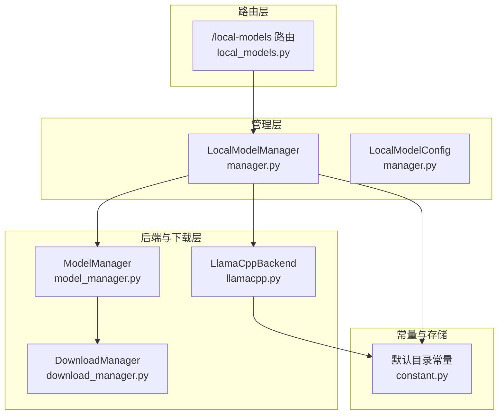
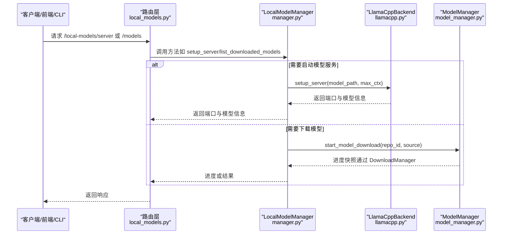
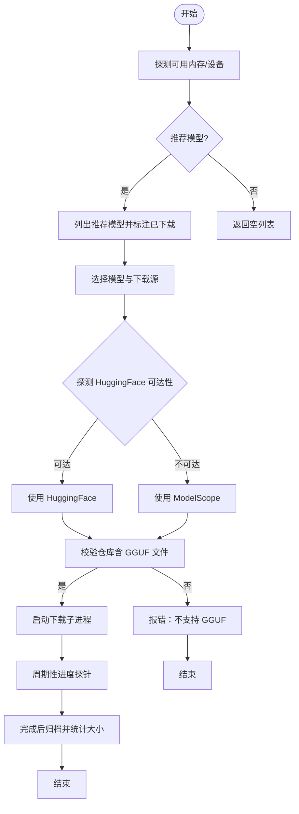
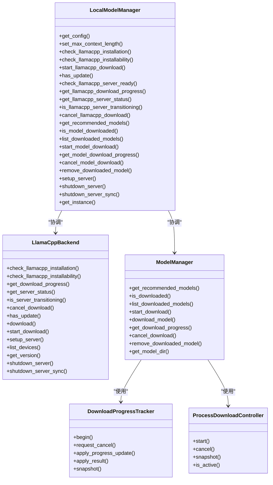

# 模型管理器

<cite>
**本文引用的文件**
- [src/qwenpaw/local_models/__init__.py](file://src/qwenpaw/local_models/__init__.py)
- [src/qwenpaw/local_models/manager.py](file://src/qwenpaw/local_models/manager.py)
- [src/qwenpaw/local_models/model_manager.py](file://src/qwenpaw/local_models/model_manager.py)
- [src/qwenpaw/local_models/download_manager.py](file://src/qwenpaw/local_models/download_manager.py)
- [src/qwenpaw/local_models/llamacpp.py](file://src/qwenpaw/local_models/llamacpp.py)
- [src/qwenpaw/app/routers/local_models.py](file://src/qwenpaw/app/routers/local_models.py)
- [src/qwenpaw/cli/providers_cmd.py](file://src/qwenpaw/cli/providers_cmd.py)
- [src/qwenpaw/constant.py](file://src/qwenpaw/constant.py)
- [tests/unit/local_models/test_local_model_manager.py](file://tests/unit/local_models/test_local_model_manager.py)
- [console/src/pages/Settings/Models/components/modals/LocalModelManageModal.tsx](file://console/src/pages/Settings/Models/components/modals/LocalModelManageModal.tsx)
</cite>

## 目录
1. [简介](#简介)
2. [项目结构](#项目结构)
3. [核心组件](#核心组件)
4. [架构总览](#架构总览)
5. [详细组件分析](#详细组件分析)
6. [依赖关系分析](#依赖关系分析)
7. [性能考虑](#性能考虑)
8. [故障排除指南](#故障排除指南)
9. [结论](#结论)
10. [附录](#附录)

## 简介
本文件面向 QwenPaw 的本地模型管理器，系统性阐述其架构与实现细节，覆盖模型注册、配置管理、生命周期控制、状态监控、数据结构与验证规则、版本管理、下载/安装/更新/卸载流程、元数据与依赖处理、冲突解决策略、API 使用示例、配置模板、管理命令、缓存与磁盘空间管理、性能优化以及运维排障建议。目标是帮助开发者与运维人员快速理解并高效使用本地模型能力。

## 项目结构
本地模型管理器由三层组成：
- 路由层（FastAPI）：对外暴露 HTTP 接口，统一入口为 /local-models 前缀。
- 管理层（LocalModelManager）：协调 llama.cpp 后端与模型下载器，负责配置持久化、状态聚合与生命周期锁。
- 后端与下载层（LlamaCppBackend、ModelManager、DownloadManager）：分别负责二进制下载与安装、模型仓库下载与进度跟踪、跨进程任务编排与结果归档。

图示来源
- [src/qwenpaw/app/routers/local_models.py:23-34](file://src/qwenpaw/app/routers/local_models.py#L23-L34)
- [src/qwenpaw/local_models/manager.py:33-56](file://src/qwenpaw/local_models/manager.py#L33-L56)
- [src/qwenpaw/local_models/llamacpp.py:51-77](file://src/qwenpaw/local_models/llamacpp.py#L51-L77)
- [src/qwenpaw/local_models/model_manager.py:63-77](file://src/qwenpaw/local_models/model_manager.py#L63-L77)
- [src/qwenpaw/local_models/download_manager.py:368-599](file://src/qwenpaw/local_models/download_manager.py#L368-L599)
- [src/qwenpaw/constant.py:118-119](file://src/qwenpaw/constant.py#L118-L119)

章节来源
- [src/qwenpaw/app/routers/local_models.py:23-34](file://src/qwenpaw/app/routers/local_models.py#L23-L34)
- [src/qwenpaw/local_models/manager.py:33-56](file://src/qwenpaw/local_models/manager.py#L33-L56)
- [src/qwenpaw/local_models/llamacpp.py:51-77](file://src/qwenpaw/local_models/llamacpp.py#L51-L77)
- [src/qwenpaw/local_models/model_manager.py:63-77](file://src/qwenpaw/local_models/model_manager.py#L63-L77)
- [src/qwenpaw/local_models/download_manager.py:368-599](file://src/qwenpaw/local_models/download_manager.py#L368-L599)
- [src/qwenpaw/constant.py:118-119](file://src/qwenpaw/constant.py#L118-L119)

## 核心组件
- LocalModelManager：单例入口，封装 llama.cpp 下载与安装、服务器启动/停止、模型下载与进度、配置持久化与读取、最大上下文长度设置等。
- LlamaCppBackend：负责 llama.cpp 可用性检测、二进制下载与解压、服务器进程启动/健康检查/日志流、版本查询、设备列表查询、服务器关闭等。
- ModelManager：负责推荐模型、模型仓库下载、进度追踪、取消、清理、大小统计、GGUF 文件校验、源探测与回退、临时目录清理等。
- DownloadManager：定义下载任务状态、进度消息、结果消息、进度追踪器、进程下载控制器、队列与监控线程、结果归档与资源释放等。
- 路由层：提供 /local-models 下的 HTTP 接口，对接 LocalModelManager 与 ProviderManager，支持服务器状态、下载、启动/停止、模型列表、配置读写等。
- CLI 命令：提供 qwenpaw models 子命令，支持下载、列出、删除本地模型，等待下载完成并输出进度与结果。
- 前端管理面板：提供本地模型下载进度、服务器状态、更新检查、配置修改等交互。

章节来源
- [src/qwenpaw/local_models/manager.py:33-229](file://src/qwenpaw/local_models/manager.py#L33-L229)
- [src/qwenpaw/local_models/llamacpp.py:51-887](file://src/qwenpaw/local_models/llamacpp.py#L51-L887)
- [src/qwenpaw/local_models/model_manager.py:63-654](file://src/qwenpaw/local_models/model_manager.py#L63-L654)
- [src/qwenpaw/local_models/download_manager.py:25-599](file://src/qwenpaw/local_models/download_manager.py#L25-L599)
- [src/qwenpaw/app/routers/local_models.py:145-454](file://src/qwenpaw/app/routers/local_models.py#L145-L454)
- [src/qwenpaw/cli/providers_cmd.py:698-812](file://src/qwenpaw/cli/providers_cmd.py#L698-L812)
- [console/src/pages/Settings/Models/components/modals/LocalModelManageModal.tsx:43-297](file://console/src/pages/Settings/Models/components/modals/LocalModelManageModal.tsx#L43-L297)

## 架构总览
本地模型管理器采用“路由层-管理层-后端与下载层”的分层设计，通过 LocalModelManager 协调 LlamaCppBackend 与 ModelManager，统一对外提供 HTTP 接口与 CLI 命令。配置持久化在本地运行时生效，服务器状态与下载进度通过快照接口返回，支持并发安全与优雅关闭。

图示来源
- [src/qwenpaw/app/routers/local_models.py:283-318](file://src/qwenpaw/app/routers/local_models.py#L283-L318)
- [src/qwenpaw/local_models/manager.py:200-216](file://src/qwenpaw/local_models/manager.py#L200-L216)
- [src/qwenpaw/local_models/llamacpp.py:216-307](file://src/qwenpaw/local_models/llamacpp.py#L216-L307)
- [src/qwenpaw/local_models/model_manager.py:245-250](file://src/qwenpaw/local_models/model_manager.py#L245-L250)

## 详细组件分析

### 数据结构与配置验证
- LocalModelConfig：本地运行时配置，包含最大上下文长度字段，使用 Pydantic 校验最小值约束。
- LocalModelInfo：继承自通用 ModelInfo，新增 size_bytes、downloaded、source 字段，用于推荐与已下载模型展示。
- DownloadSource：枚举类型，支持 huggingface、modelscope、auto（自动探测）。
- DownloadProgress/DownloadTaskResult：标准化下载进度与结果，支持序列化与跨进程传递。
- ServerStatus/StartServerResponse/LocalModelConfigRequest 等：路由层请求/响应模型，确保前后端契约一致。

章节来源
- [src/qwenpaw/local_models/manager.py:23-31](file://src/qwenpaw/local_models/manager.py#L23-L31)
- [src/qwenpaw/local_models/model_manager.py:46-61](file://src/qwenpaw/local_models/model_manager.py#L46-L61)
- [src/qwenpaw/local_models/download_manager.py:42-90](file://src/qwenpaw/local_models/download_manager.py#L42-L90)
- [src/qwenpaw/app/routers/local_models.py:50-135](file://src/qwenpaw/app/routers/local_models.py#L50-L135)

### 生命周期与状态监控
- 服务器生命周期：安装检测、下载、启动、健康检查、日志流、关闭；支持过渡状态标记与优雅关闭。
- 下载生命周期：Pending → Downloading → Completed/Failed/Cancelled；支持取消、进度探针、结果归档与资源清理。
- 配置持久化：异步写入配置文件，设置权限，失败时记录告警并回退到默认配置。
- 并发控制：服务器启停使用互斥锁，避免竞态；下载控制器保证单任务执行。

章节来源
- [src/qwenpaw/local_models/llamacpp.py:398-421](file://src/qwenpaw/local_models/llamacpp.py#L398-L421)
- [src/qwenpaw/local_models/download_manager.py:368-599](file://src/qwenpaw/local_models/download_manager.py#L368-L599)
- [src/qwenpaw/local_models/manager.py:93-109](file://src/qwenpaw/local_models/manager.py#L93-L109)

### 模型下载与安装流程
- 推荐模型：根据内存容量选择不同规模的模型，检查本地是否已下载并标注。
- 源探测：优先 HuggingFace，若不可达则回退至 ModelScope；同时校验仓库内是否存在 GGUF 文件。
- 下载执行：在子进程中执行 SDK 下载，实时计算已下载字节数，通过队列上报进度；完成后移动到最终目录。
- 大小统计：遍历目录统计实际落地字节，支持断点续传与临时目录清理。
- 取消与错误：支持取消下载，异常时生成可读错误信息并归档结果。

图示来源
- [src/qwenpaw/local_models/model_manager.py:78-135](file://src/qwenpaw/local_models/model_manager.py#L78-L135)
- [src/qwenpaw/local_models/model_manager.py:287-291](file://src/qwenpaw/local_models/model_manager.py#L287-L291)
- [src/qwenpaw/local_models/model_manager.py:321-372](file://src/qwenpaw/local_models/model_manager.py#L321-L372)
- [src/qwenpaw/local_models/model_manager.py:519-536](file://src/qwenpaw/local_models/model_manager.py#L519-L536)

章节来源
- [src/qwenpaw/local_models/model_manager.py:78-135](file://src/qwenpaw/local_models/model_manager.py#L78-L135)
- [src/qwenpaw/local_models/model_manager.py:287-372](file://src/qwenpaw/local_models/model_manager.py#L287-L372)
- [src/qwenpaw/local_models/model_manager.py:519-536](file://src/qwenpaw/local_models/model_manager.py#L519-L536)

### 服务器安装与更新
- 安装检测：校验操作系统、架构、CUDA 版本与环境兼容性。
- 下载与解压：从镜像地址下载压缩包，流式写入，边下边上报进度，解压后合并内容到目标目录。
- 更新检查：比较当前版本与最新版本标签，判断是否有更新。
- 设备与版本：支持列出可用设备、查询版本号，便于诊断与运维。

章节来源
- [src/qwenpaw/local_models/llamacpp.py:89-143](file://src/qwenpaw/local_models/llamacpp.py#L89-L143)
- [src/qwenpaw/local_models/llamacpp.py:145-214](file://src/qwenpaw/local_models/llamacpp.py#L145-L214)
- [src/qwenpaw/local_models/llamacpp.py:309-343](file://src/qwenpaw/local_models/llamacpp.py#L309-L343)

### API 使用示例与管理命令
- 路由接口（示例）：
  - GET /local-models/server：检查服务器可用性与状态。
  - POST /local-models/server：启动服务器并激活本地 Provider。
  - DELETE /local-models/server：停止服务器并清空本地 Provider 状态。
  - POST /local-models/models/download：开始下载推荐模型。
  - GET /local-models/models/download：获取下载进度。
  - PUT /local-models/config：更新最大上下文长度与生成参数。
- CLI 命令（示例）：
  - qwenpaw models download <repo_id> [--source huggingface|modelscope]
  - qwenpaw models list
  - qwenpaw models remove-local <model_id>

章节来源
- [src/qwenpaw/app/routers/local_models.py:145-454](file://src/qwenpaw/app/routers/local_models.py#L145-L454)
- [src/qwenpaw/cli/providers_cmd.py:698-812](file://src/qwenpaw/cli/providers_cmd.py#L698-L812)

### 元数据管理、依赖与冲突
- 元数据：LocalModelInfo 扩展了 size_bytes、downloaded、source；LlamaCppBackend 构造 ModelInfo 以声明多模态能力。
- 依赖：ModelManager 依赖 huggingface_hub 与 modelscope SDK；LlamaCppBackend 依赖 httpx 与系统命令行工具。
- 冲突处理：当前模型管理器未见通用“技能/工具”层面的冲突重命名逻辑，但存在针对内置升级与冲突的策略（参考其他模块）。模型下载与安装流程中通过目录结构与 GGUF 文件存在性进行基本校验，避免无效安装。

章节来源
- [src/qwenpaw/local_models/model_manager.py:46-61](file://src/qwenpaw/local_models/model_manager.py#L46-L61)
- [src/qwenpaw/local_models/llamacpp.py:482-495](file://src/qwenpaw/local_models/llamacpp.py#L482-L495)

### 缓存策略与磁盘空间管理
- 进度缓存：DownloadProgressTracker 维护最近一次采样时间与速度，避免频繁 IO。
- 临时目录：下载阶段使用临时目录，完成后移动到最终位置，并清理空父目录。
- 磁盘占用：提供已下载大小统计函数，便于 UI 展示与空间规划。
- 清理策略：下载失败或取消时清理临时文件与目录；卸载模型时递归删除模型目录并清理空父目录。

章节来源
- [src/qwenpaw/local_models/download_manager.py:198-366](file://src/qwenpaw/local_models/download_manager.py#L198-L366)
- [src/qwenpaw/local_models/model_manager.py:568-599](file://src/qwenpaw/local_models/model_manager.py#L568-L599)
- [src/qwenpaw/local_models/model_manager.py:648-654](file://src/qwenpaw/local_models/model_manager.py#L648-L654)

## 依赖关系分析

图示来源
- [src/qwenpaw/local_models/manager.py:33-229](file://src/qwenpaw/local_models/manager.py#L33-L229)
- [src/qwenpaw/local_models/llamacpp.py:51-887](file://src/qwenpaw/local_models/llamacpp.py#L51-L887)
- [src/qwenpaw/local_models/model_manager.py:63-77](file://src/qwenpaw/local_models/model_manager.py#L63-L77)
- [src/qwenpaw/local_models/download_manager.py:198-599](file://src/qwenpaw/local_models/download_manager.py#L198-L599)

章节来源
- [src/qwenpaw/local_models/manager.py:33-229](file://src/qwenpaw/local_models/manager.py#L33-L229)
- [src/qwenpaw/local_models/llamacpp.py:51-887](file://src/qwenpaw/local_models/llamacpp.py#L51-L887)
- [src/qwenpaw/local_models/model_manager.py:63-77](file://src/qwenpaw/local_models/model_manager.py#L63-L77)
- [src/qwenpaw/local_models/download_manager.py:198-599](file://src/qwenpaw/local_models/download_manager.py#L198-L599)

## 性能考虑
- 进度采样与带宽估计：基于最近两次采样间隔计算瞬时速度，避免高频 IO。
- 流式下载：llama.cpp 下载使用流式写入与分块上报，降低内存峰值。
- 进程隔离：下载与服务器启动均在独立子进程执行，避免阻塞主线程。
- 并发安全：服务器启停加锁，下载控制器保证单任务执行，防止资源竞争。
- 磁盘 I/O：批量移动与清理临时目录，减少碎片与多次重命名开销。

[本节为通用指导，无需特定文件引用]

## 故障排除指南
- 服务器无法启动
  - 检查安装检测与环境兼容性（操作系统、架构、CUDA 版本）。
  - 查看健康检查超时与日志流，确认端口占用与进程状态。
  - 尝试关闭旧进程后重启。
- 下载失败
  - 检查网络连通性与镜像地址有效性；查看 HTTP 错误码与格式化错误信息。
  - 确认目标目录权限与磁盘空间充足。
  - 若 GGUF 校验失败，确认仓库包含有效 GGUF 文件。
- 配置读取异常
  - 配置文件损坏或权限问题会导致回退到默认配置；检查文件权限与 JSON 格式。
- CLI/前端卡住
  - 使用 CLI 的等待与取消逻辑；前端轮询进度并在超时或中断时触发取消。

章节来源
- [src/qwenpaw/local_models/llamacpp.py:613-647](file://src/qwenpaw/local_models/llamacpp.py#L613-L647)
- [src/qwenpaw/local_models/model_manager.py:474-517](file://src/qwenpaw/local_models/model_manager.py#L474-L517)
- [src/qwenpaw/local_models/manager.py:57-72](file://src/qwenpaw/local_models/manager.py#L57-L72)
- [src/qwenpaw/cli/providers_cmd.py:36-76](file://src/qwenpaw/cli/providers_cmd.py#L36-L76)

## 结论
本地模型管理器通过清晰的分层设计与严格的生命周期控制，提供了稳定可靠的本地推理能力。其配置持久化、进度追踪、错误处理与资源清理机制，配合丰富的 API 与 CLI 工具，能够满足开发与生产场景下的模型管理需求。建议在部署时关注磁盘空间、网络连通性与进程权限，并结合健康检查与日志流进行持续监控。

[本节为总结性内容，无需特定文件引用]

## 附录

### 关键类与职责速览
- LocalModelManager：统一入口，协调服务器与下载，持久化配置，提供推荐模型与下载进度。
- LlamaCppBackend：二进制下载与安装、服务器进程管理、健康检查、设备与版本查询。
- ModelManager：模型仓库下载、进度追踪、源探测、GGUF 校验、目录清理。
- DownloadManager：下载状态机、进度与结果消息、进程控制器、资源回收。

章节来源
- [src/qwenpaw/local_models/manager.py:33-229](file://src/qwenpaw/local_models/manager.py#L33-L229)
- [src/qwenpaw/local_models/llamacpp.py:51-887](file://src/qwenpaw/local_models/llamacpp.py#L51-L887)
- [src/qwenpaw/local_models/model_manager.py:63-654](file://src/qwenpaw/local_models/model_manager.py#L63-L654)
- [src/qwenpaw/local_models/download_manager.py:25-599](file://src/qwenpaw/local_models/download_manager.py#L25-L599)

### 默认路径与环境变量
- 默认本地模型目录：由常量 DEFAULT_LOCAL_PROVIDER_DIR 提供，默认位于工作目录下的 local_models。
- 其他相关目录：媒体、插件、自定义通道等路径同样由常量模块统一管理。

章节来源
- [src/qwenpaw/constant.py:118-119](file://src/qwenpaw/constant.py#L118-L119)
- [src/qwenpaw/constant.py:193-194](file://src/qwenpaw/constant.py#L193-L194)

### 前端状态与进度对比
- 前端通过本地状态与后端快照对比，避免重复渲染；支持服务器更新状态、下载进度、错误信息等字段的展示与刷新。

章节来源
- [console/src/pages/Settings/Models/components/modals/LocalModelManageModal.tsx:43-297](file://console/src/pages/Settings/Models/components/modals/LocalModelManageModal.tsx#L43-L297)

### 单元测试要点
- 覆盖 LocalModelManager 对底层 ModelManager 与 LlamaCppBackend 的转发行为，包括下载进度、取消、推荐模型、下载状态等。
- 验证配置加载与保存、服务器启停与过渡状态、下载控制器的活跃状态与取消流程。

章节来源
- [tests/unit/local_models/test_local_model_manager.py:124-155](file://tests/unit/local_models/test_local_model_manager.py#L124-L155)