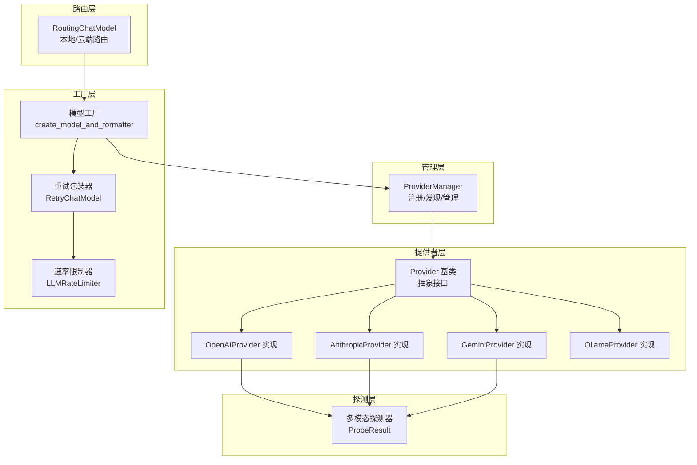
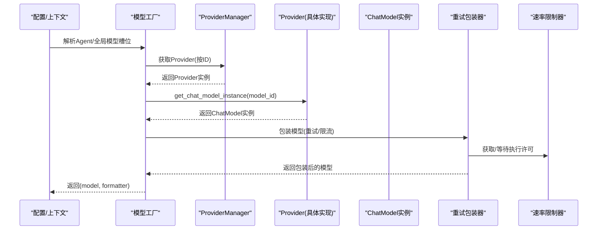
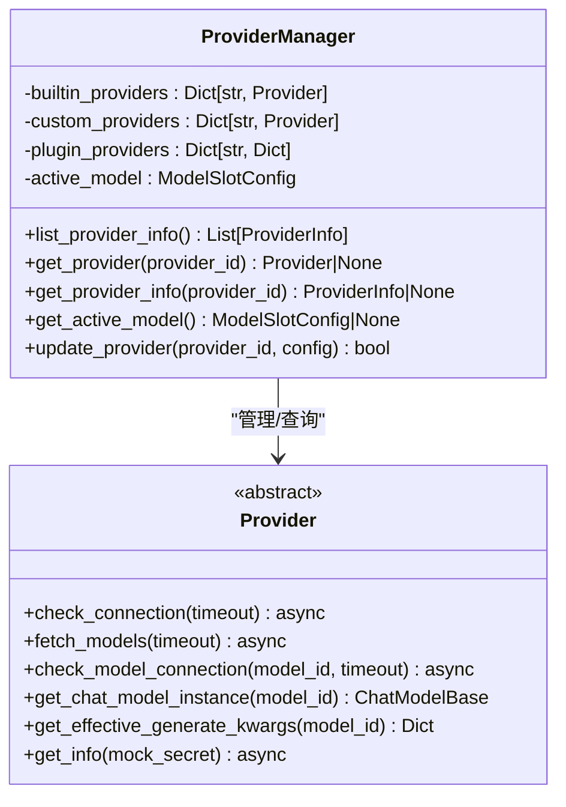
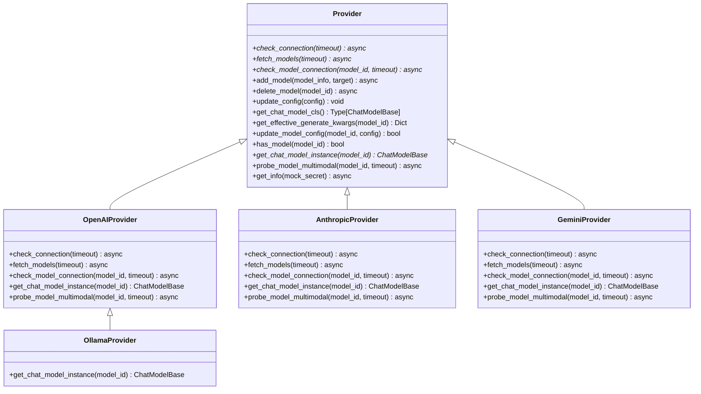
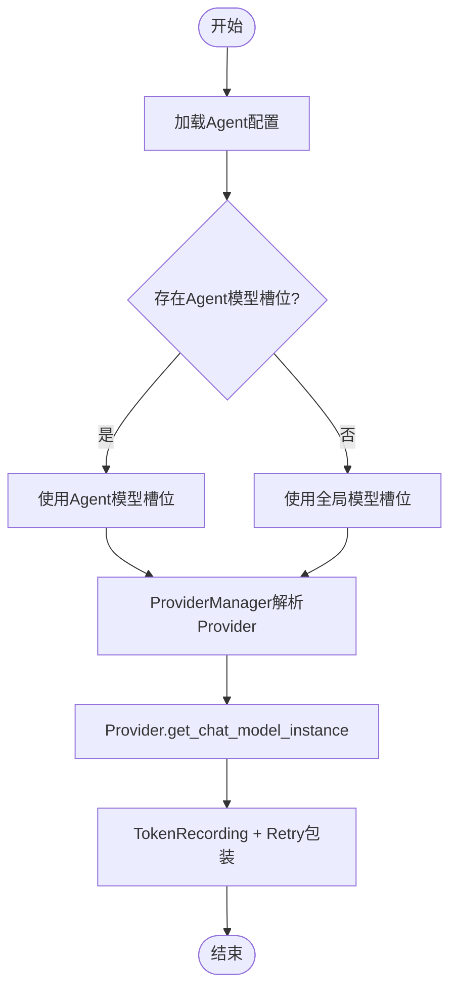
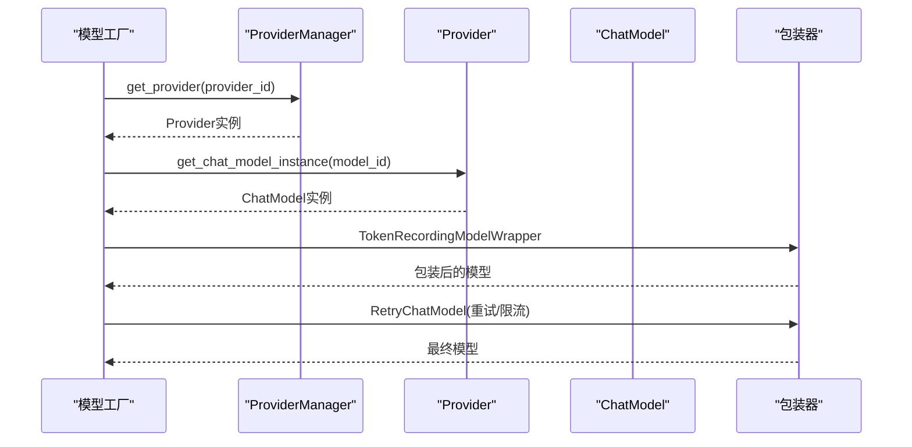
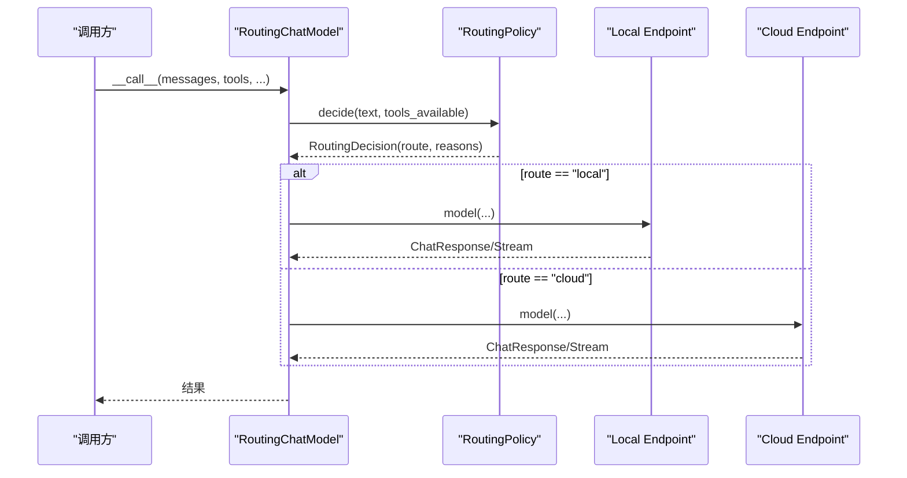
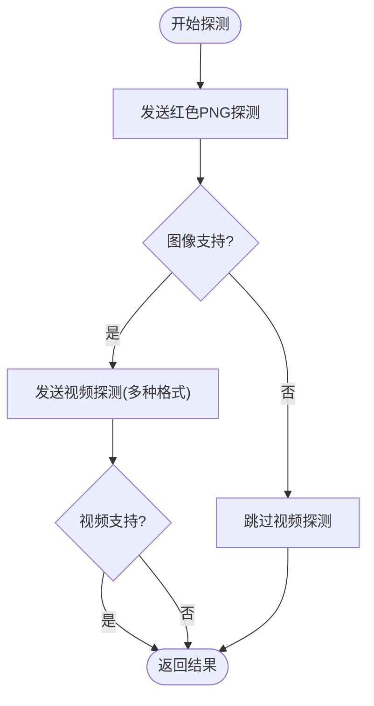
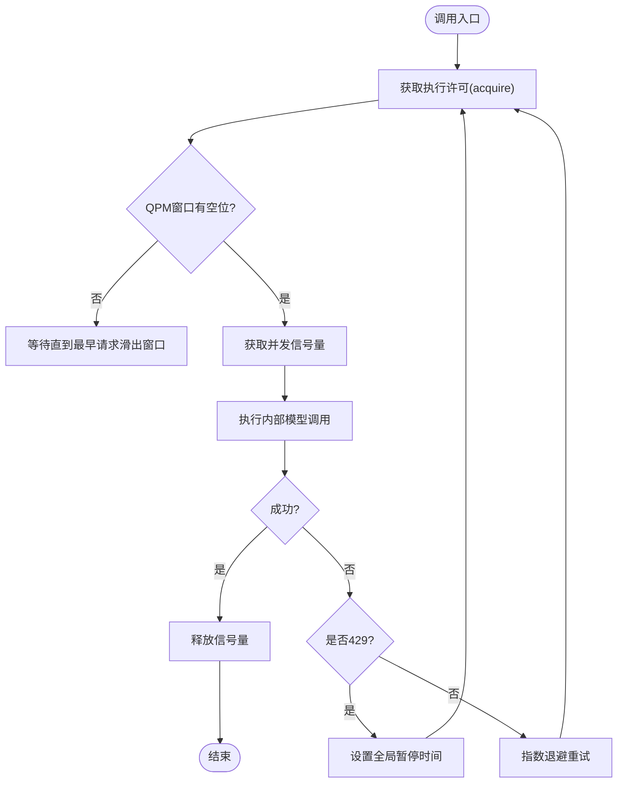
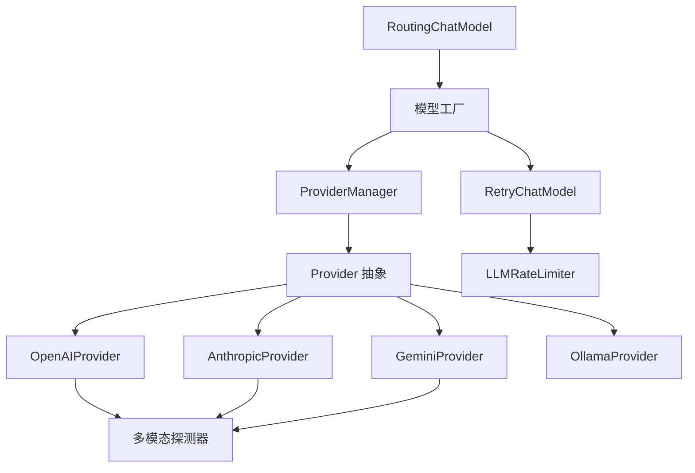

# 模型架构设计

<cite>
**本文档引用的文件**
- [provider_manager.py](file://src/qwenpaw/providers/provider_manager.py)
- [provider.py](file://src/qwenpaw/providers/provider.py)
- [models.py](file://src/qwenpaw/providers/models.py)
- [model_factory.py](file://src/qwenpaw/agents/model_factory.py)
- [routing_chat_model.py](file://src/qwenpaw/agents/routing_chat_model.py)
- [openai_provider.py](file://src/qwenpaw/providers/openai_provider.py)
- [anthropic_provider.py](file://src/qwenpaw/providers/anthropic_provider.py)
- [gemini_provider.py](file://src/qwenpaw/providers/gemini_provider.py)
- [ollama_provider.py](file://src/qwenpaw/providers/ollama_provider.py)
- [multimodal_prober.py](file://src/qwenpaw/providers/multimodal_prober.py)
- [rate_limiter.py](file://src/qwenpaw/providers/rate_limiter.py)
- [retry_chat_model.py](file://src/qwenpaw/providers/retry_chat_model.py)
</cite>

## 目录
1. [简介](#简介)
2. [项目结构](#项目结构)
3. [核心组件](#核心组件)
4. [架构总览](#架构总览)
5. [详细组件分析](#详细组件分析)
6. [依赖关系分析](#依赖关系分析)
7. [性能考量](#性能考量)
8. [故障排查指南](#故障排查指南)
9. [结论](#结论)

## 简介
本文件面向QwenPaw的模型系统，系统性阐述ProviderManager的设计模式、Provider基类的抽象层次与路由机制；详解模型提供者的注册、发现与管理流程；文档化模型槽位配置（ModelSlotConfig）的作用与生命周期管理；解释模型实例的创建、缓存与销毁策略；并提供架构图与组件交互关系图，展示模块间的依赖关系与数据流向。同时给出架构决策的技术背景与设计权衡。

## 项目结构
QwenPaw的模型系统主要由以下层次构成：
- 提供者层：Provider抽象与具体实现（OpenAI、Anthropic、Gemini、Ollama等）
- 管理层：ProviderManager统一管理内置/自定义/插件提供者
- 工厂层：模型工厂负责根据配置创建模型与格式化器，并封装重试与限流
- 路由层：RoutingChatModel在本地与云端之间进行路由选择
- 探测层：多模态探测器用于检测模型对图像/视频的支持能力
- 限流与重试：全局速率限制器与重试包装器保障稳定性

图表来源
- [provider_manager.py](file://src/qwenpaw/providers/provider_manager.py)
- [provider.py](file://src/qwenpaw/providers/provider.py)
- [openai_provider.py](file://src/qwenpaw/providers/openai_provider.py)
- [anthropic_provider.py](file://src/qwenpaw/providers/anthropic_provider.py)
- [gemini_provider.py](file://src/qwenpaw/providers/gemini_provider.py)
- [ollama_provider.py](file://src/qwenpaw/providers/ollama_provider.py)
- [model_factory.py](file://src/qwenpaw/agents/model_factory.py)
- [routing_chat_model.py](file://src/qwenpaw/agents/routing_chat_model.py)
- [multimodal_prober.py](file://src/qwenpaw/providers/multimodal_prober.py)
- [rate_limiter.py](file://src/qwenpaw/providers/rate_limiter.py)
- [retry_chat_model.py](file://src/qwenpaw/providers/retry_chat_model.py)

章节来源
- [provider_manager.py](file://src/qwenpaw/providers/provider_manager.py)
- [provider.py](file://src/qwenpaw/providers/provider.py)
- [model_factory.py](file://src/qwenpaw/agents/model_factory.py)
- [routing_chat_model.py](file://src/qwenpaw/agents/routing_chat_model.py)

## 核心组件
- ProviderManager：单例管理器，负责内置/自定义/插件提供者的注册、持久化存储、迁移与默认注解应用；提供列表、查询、更新与活跃模型管理能力。
- Provider基类：定义统一的抽象接口（连接检查、模型拉取、模型连通性检查、模型添加/删除、配置更新、生成参数合并、格式化器映射等），并提供多模态探测的默认实现。
- 具体Provider实现：OpenAIProvider、AnthropicProvider、GeminiProvider、OllamaProvider等，覆盖不同API生态与本地推理平台。
- 模型工厂：根据Agent或全局配置解析模型槽位，调用Provider创建ChatModel实例，注入Token统计与重试包装。
- 路由模型：基于配置在本地与云端之间动态选择端点，支持策略化路由决策。
- 多模态探测器：提供图像/视频探测常量与结果结构，辅助判断模型能力。
- 限流与重试：全局LLMRateLimiter与RetryChatModel，保障并发、QPM与429处理的一致性。

章节来源
- [provider_manager.py](file://src/qwenpaw/providers/provider_manager.py)
- [provider.py](file://src/qwenpaw/providers/provider.py)
- [openai_provider.py](file://src/qwenpaw/providers/openai_provider.py)
- [anthropic_provider.py](file://src/qwenpaw/providers/anthropic_provider.py)
- [gemini_provider.py](file://src/qwenpaw/providers/gemini_provider.py)
- [ollama_provider.py](file://src/qwenpaw/providers/ollama_provider.py)
- [model_factory.py](file://src/qwenpaw/agents/model_factory.py)
- [routing_chat_model.py](file://src/qwenpaw/agents/routing_chat_model.py)
- [multimodal_prober.py](file://src/qwenpaw/providers/multimodal_prober.py)
- [rate_limiter.py](file://src/qwenpaw/providers/rate_limiter.py)
- [retry_chat_model.py](file://src/qwenpaw/providers/retry_chat_model.py)

## 架构总览
下图展示了从配置到模型实例的完整调用链路，以及ProviderManager与各Provider之间的协作关系：

图表来源
- [model_factory.py](file://src/qwenpaw/agents/model_factory.py)
- [provider_manager.py](file://src/qwenpaw/providers/provider_manager.py)
- [openai_provider.py](file://src/qwenpaw/providers/openai_provider.py)
- [anthropic_provider.py](file://src/qwenpaw/providers/anthropic_provider.py)
- [gemini_provider.py](file://src/qwenpaw/providers/gemini_provider.py)
- [ollama_provider.py](file://src/qwenpaw/providers/ollama_provider.py)
- [retry_chat_model.py](file://src/qwenpaw/providers/retry_chat_model.py)
- [rate_limiter.py](file://src/qwenpaw/providers/rate_limiter.py)

## 详细组件分析

### ProviderManager 设计与职责
- 单例模式：通过类变量维护唯一实例，避免重复初始化。
- 存储与迁移：准备磁盘目录结构，加载内置提供者，尝试迁移旧配置，从持久化存储恢复，应用默认注解。
- 注册与发现：内置提供者在初始化时集中注册；自定义与插件提供者通过独立字典维护；查询优先级为插件 > 内置 > 自定义。
- 列表与信息：异步批量获取ProviderInfo，支持插件提供者直接返回信息。
- 活跃模型：维护当前激活的模型槽位，支持更新与读取。

图表来源
- [provider_manager.py](file://src/qwenpaw/providers/provider_manager.py)
- [provider.py](file://src/qwenpaw/providers/provider.py)

章节来源
- [provider_manager.py](file://src/qwenpaw/providers/provider_manager.py)

### Provider 抽象层次与多模态探测
- 抽象接口：统一定义连接检查、模型列表获取、模型连通性检查、模型增删、配置更新、生成参数合并、格式化器映射、多模态探测等。
- 默认实现：多模态探测返回空结果，子类可覆盖以对接具体API。
- 生成参数合并：提供者级参数作为基础，模型级参数深合并覆盖，保证不污染状态。
- 格式化器映射：通过反射获取对应ChatModel类，若不存在抛出ProviderError。

图表来源
- [provider.py](file://src/qwenpaw/providers/provider.py)
- [openai_provider.py](file://src/qwenpaw/providers/openai_provider.py)
- [anthropic_provider.py](file://src/qwenpaw/providers/anthropic_provider.py)
- [gemini_provider.py](file://src/qwenpaw/providers/gemini_provider.py)
- [ollama_provider.py](file://src/qwenpaw/providers/ollama_provider.py)

章节来源
- [provider.py](file://src/qwenpaw/providers/provider.py)
- [openai_provider.py](file://src/qwenpaw/providers/openai_provider.py)
- [anthropic_provider.py](file://src/qwenpaw/providers/anthropic_provider.py)
- [gemini_provider.py](file://src/qwenpaw/providers/gemini_provider.py)
- [ollama_provider.py](file://src/qwenpaw/providers/ollama_provider.py)

### 模型槽位配置（ModelSlotConfig）与生命周期
- 定义：ModelSlotConfig包含provider_id与model字段，用于描述“哪个提供者上的哪个模型”。
- 生命周期：
  - Agent特定：在Agent配置中指定active_model，优先于全局配置。
  - 全局配置：ProviderManager.get_active_model()返回当前全局激活槽位。
  - 工厂解析：模型工厂优先使用Agent特定槽位，否则回退到全局槽位。
  - 运行期包装：工厂创建模型后，进一步被TokenRecordingModelWrapper与RetryChatModel包装。

图表来源
- [models.py](file://src/qwenpaw/providers/models.py)
- [model_factory.py](file://src/qwenpaw/agents/model_factory.py)
- [provider_manager.py](file://src/qwenpaw/providers/provider_manager.py)

章节来源
- [models.py](file://src/qwenpaw/providers/models.py)
- [model_factory.py](file://src/qwenpaw/agents/model_factory.py)
- [provider_manager.py](file://src/qwenpaw/providers/provider_manager.py)

### 模型实例创建、缓存与销毁策略
- 创建流程：模型工厂根据Agent/全局槽位获取Provider，调用其get_chat_model_instance创建ChatModel实例，随后进行Token统计包装与重试包装。
- 缓存策略：ProviderManager内部持有Provider实例字典，避免重复创建；模型实例未做额外缓存，每次请求均通过工厂重新构建。
- 销毁策略：未见显式销毁逻辑；模型实例随事件循环生命周期自然释放；ProviderManager的Provider字典在进程生命周期内保持。

图表来源
- [model_factory.py](file://src/qwenpaw/agents/model_factory.py)
- [provider_manager.py](file://src/qwenpaw/providers/provider_manager.py)
- [retry_chat_model.py](file://src/qwenpaw/providers/retry_chat_model.py)
- [rate_limiter.py](file://src/qwenpaw/providers/rate_limiter.py)

章节来源
- [model_factory.py](file://src/qwenpaw/agents/model_factory.py)
- [retry_chat_model.py](file://src/qwenpaw/providers/retry_chat_model.py)
- [rate_limiter.py](file://src/qwenpaw/providers/rate_limiter.py)

### 路由机制（本地/云端）
- 策略：基于配置决定优先本地还是云端；当前实现为简单策略，后续可扩展为更复杂的规则。
- 端点：RoutingEndpoint封装provider_id、model_name、模型实例、格式化器及其类型。
- 调用：RoutingChatModel根据策略选择端点并转发调用，记录路由原因便于调试。

图表来源
- [routing_chat_model.py](file://src/qwenpaw/agents/routing_chat_model.py)

章节来源
- [routing_chat_model.py](file://src/qwenpaw/agents/routing_chat_model.py)

### 多模态探测与能力评估
- 探测目标：图像与视频支持能力；部分Provider明确不支持视频（如Anthropic）。
- 探测策略：
  - 图像：发送最小红色PNG，询问主色调；若模型能识别则判定支持。
  - 视频：尝试base64与HTTP URL两种方式；HTTP URL采用宽松判定以避免误判。
- 结果：ProbeResult包含supports_image/supports_video及消息说明，便于UI展示与日志追踪。

图表来源
- [multimodal_prober.py](file://src/qwenpaw/providers/multimodal_prober.py)
- [openai_provider.py](file://src/qwenpaw/providers/openai_provider.py)
- [anthropic_provider.py](file://src/qwenpaw/providers/anthropic_provider.py)
- [gemini_provider.py](file://src/qwenpaw/providers/gemini_provider.py)

章节来源
- [multimodal_prober.py](file://src/qwenpaw/providers/multimodal_prober.py)
- [openai_provider.py](file://src/qwenpaw/providers/openai_provider.py)
- [anthropic_provider.py](file://src/qwenpaw/providers/anthropic_provider.py)
- [gemini_provider.py](file://src/qwenpaw/providers/gemini_provider.py)

### 限流与重试策略
- 全局限流：LLMRateLimiter提供滑动窗口QPM、并发信号量、429全局暂停与抖动，避免惊群效应。
- 重试包装：RetryChatModel在非流式与流式场景分别处理，指数退避、超时控制与429重试后暂停。
- 配置来源：支持从Agent配置与全局常量读取，确保运行期一致性。

图表来源
- [rate_limiter.py](file://src/qwenpaw/providers/rate_limiter.py)
- [retry_chat_model.py](file://src/qwenpaw/providers/retry_chat_model.py)

章节来源
- [rate_limiter.py](file://src/qwenpaw/providers/rate_limiter.py)
- [retry_chat_model.py](file://src/qwenpaw/providers/retry_chat_model.py)

## 依赖关系分析
- ProviderManager依赖Provider抽象与具体实现，以及安全存储与异常模块。
- 模型工厂依赖ProviderManager、重试包装器与令牌统计包装器。
- 路由模型依赖配置与两个端点（本地/云端）。
- 各Provider实现依赖对应SDK与多模态探测器。
- 限流与重试相互配合，共同保障稳定性。

图表来源
- [provider_manager.py](file://src/qwenpaw/providers/provider_manager.py)
- [provider.py](file://src/qwenpaw/providers/provider.py)
- [openai_provider.py](file://src/qwenpaw/providers/openai_provider.py)
- [anthropic_provider.py](file://src/qwenpaw/providers/anthropic_provider.py)
- [gemini_provider.py](file://src/qwenpaw/providers/gemini_provider.py)
- [ollama_provider.py](file://src/qwenpaw/providers/ollama_provider.py)
- [model_factory.py](file://src/qwenpaw/agents/model_factory.py)
- [routing_chat_model.py](file://src/qwenpaw/agents/routing_chat_model.py)
- [multimodal_prober.py](file://src/qwenpaw/providers/multimodal_prober.py)
- [rate_limiter.py](file://src/qwenpaw/providers/rate_limiter.py)
- [retry_chat_model.py](file://src/qwenpaw/providers/retry_chat_model.py)

章节来源
- [provider_manager.py](file://src/qwenpaw/providers/provider_manager.py)
- [provider.py](file://src/qwenpaw/providers/provider.py)
- [model_factory.py](file://src/qwenpaw/agents/model_factory.py)
- [routing_chat_model.py](file://src/qwenpaw/agents/routing_chat_model.py)
- [rate_limiter.py](file://src/qwenpaw/providers/rate_limiter.py)
- [retry_chat_model.py](file://src/qwenpaw/providers/retry_chat_model.py)

## 性能考量
- 并发控制：通过全局信号量限制并发请求数，避免上游限流与拥塞。
- QPM滑动窗口：60秒窗口内严格控制每分钟请求数，减少突发流量。
- 429协同暂停：收到429后统一延长暂停时间，配合抖动分散唤醒时刻，避免惊群。
- 指数退避：对瞬时错误进行指数退避重试，降低对上游压力。
- 流式传输优化：在首个响应块到达后释放信号量，缩短长尾阻塞。
- 多模态探测：探测失败时尽早短路，避免无效请求；HTTP视频探测采用宽松策略减少误判。

## 故障排查指南
- Provider连接失败：检查base_url、api_key与网络连通性；部分Provider支持连接检查开关。
- 模型不可用：使用check_model_connection验证模型ID与权限；确认模型是否在Provider支持列表。
- 多模态探测异常：查看探测器返回的消息；对于文本-only模型可能出现误报，需结合语义校验。
- 429频繁：调整全局暂停时间、并发上限与QPM；必要时启用更保守的退避策略。
- 重试超时：检查acquire_timeout与backoff配置；确认下游服务健康状况。
- 路由问题：核对RoutingPolicy配置与端点可用性；查看路由决策原因日志。

章节来源
- [provider.py](file://src/qwenpaw/providers/provider.py)
- [openai_provider.py](file://src/qwenpaw/providers/openai_provider.py)
- [anthropic_provider.py](file://src/qwenpaw/providers/anthropic_provider.py)
- [gemini_provider.py](file://src/qwenpaw/providers/gemini_provider.py)
- [multimodal_prober.py](file://src/qwenpaw/providers/multimodal_prober.py)
- [rate_limiter.py](file://src/qwenpaw/providers/rate_limiter.py)
- [retry_chat_model.py](file://src/qwenpaw/providers/retry_chat_model.py)
- [routing_chat_model.py](file://src/qwenpaw/agents/routing_chat_model.py)

## 结论
QwenPaw的模型架构以ProviderManager为核心，围绕Provider抽象实现了跨Provider与跨平台（本地/云端）的统一管理；模型工厂与包装器提供了稳定的创建、限流与重试能力；路由模型为混合部署提供了灵活的路径选择。通过多模态探测与详尽的错误处理，系统在易用性与可靠性之间取得良好平衡。未来可在路由策略、模型缓存与配置热更新等方面进一步增强。