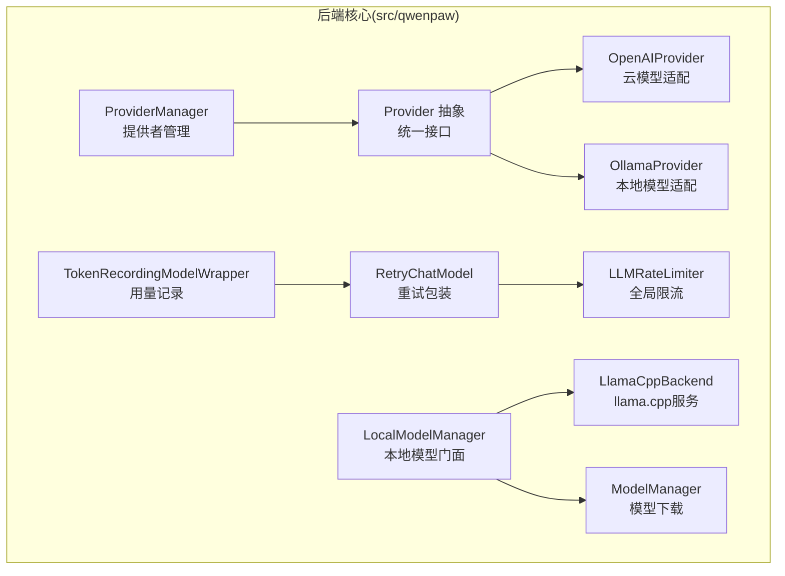
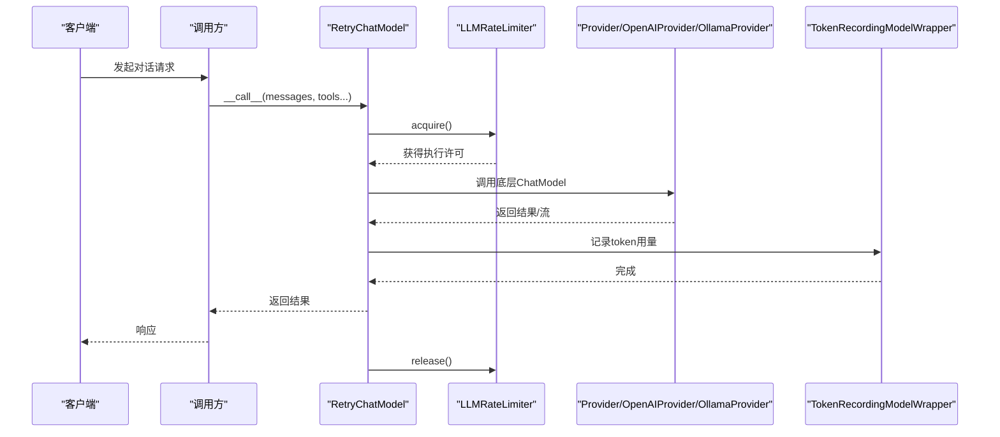
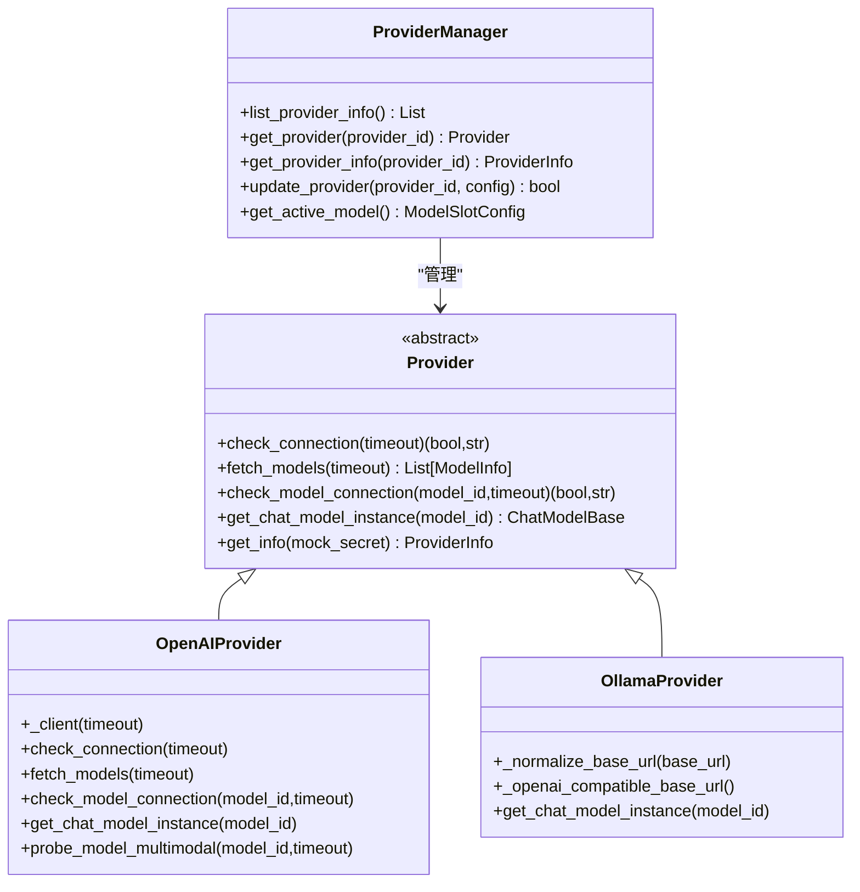
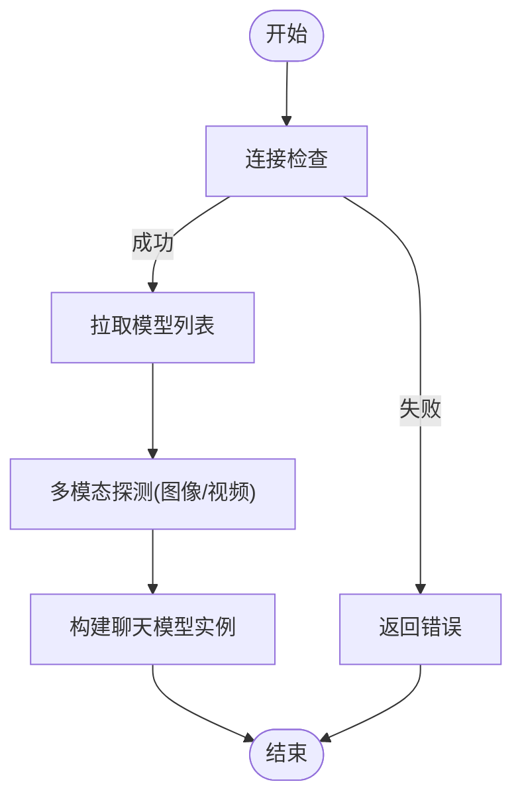
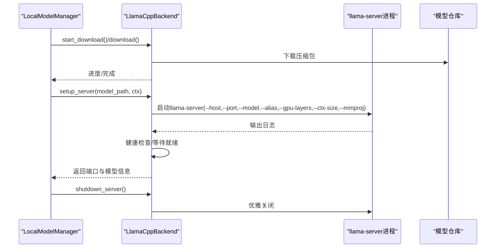
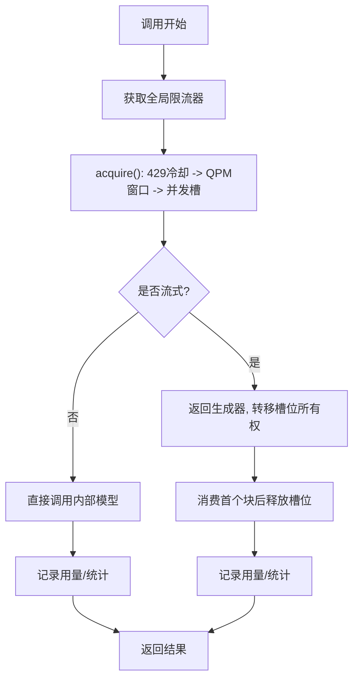
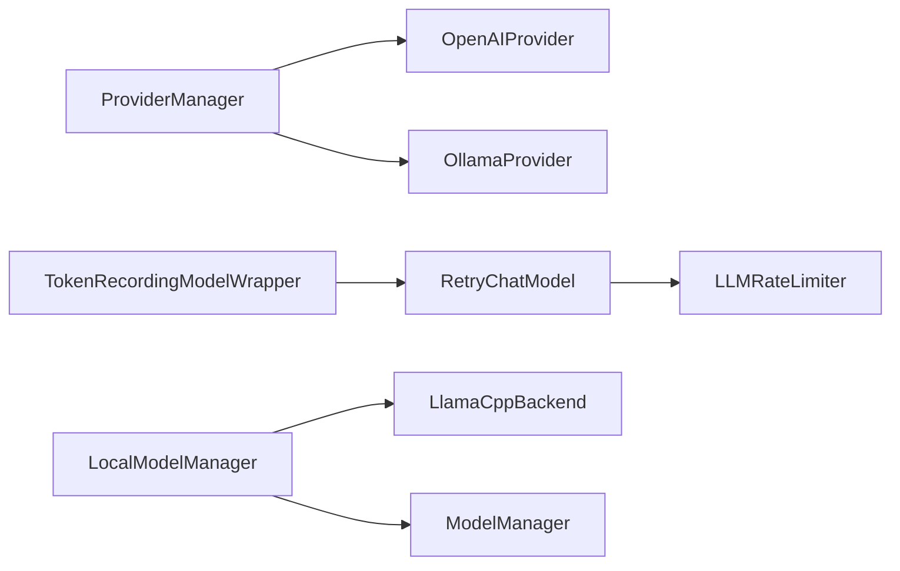

# 模型系统

<cite>
**本文引用的文件**
- [src/qwenpaw/providers/provider_manager.py](file://src/qwenpaw/providers/provider_manager.py)
- [src/qwenpaw/providers/provider.py](file://src/qwenpaw/providers/provider.py)
- [src/qwenpaw/providers/openai_provider.py](file://src/qwenpaw/providers/openai_provider.py)
- [src/qwenpaw/providers/ollama_provider.py](file://src/qwenpaw/providers/ollama_provider.py)
- [src/qwenpaw/local_models/manager.py](file://src/qwenpaw/local_models/manager.py)
- [src/qwenpaw/local_models/llamacpp.py](file://src/qwenpaw/local_models/llamacpp.py)
- [src/qwenpaw/local_models/model_manager.py](file://src/qwenpaw/local_models/model_manager.py)
- [src/qwenpaw/providers/rate_limiter.py](file://src/qwenpaw/providers/rate_limiter.py)
- [src/qwenpaw/providers/retry_chat_model.py](file://src/qwenpaw/providers/retry_chat_model.py)
- [src/qwenpaw/token_usage/model_wrapper.py](file://src/qwenpaw/token_usage/model_wrapper.py)
- [src/qwenpaw/__init__.py](file://src/qwenpaw/__init__.py)
</cite>

## 目录
1. [简介](#简介)
2. [项目结构](#项目结构)
3. [核心组件](#核心组件)
4. [架构总览](#架构总览)
5. [详细组件分析](#详细组件分析)
6. [依赖分析](#依赖分析)
7. [性能考虑](#性能考虑)
8. [故障排查指南](#故障排查指南)
9. [结论](#结论)
10. [附录](#附录)

## 简介
本文件面向QwenPaw模型系统，系统性阐述模型架构设计、云模型与本地模型的统一接入、模型提供者管理器、模型路由与重试/限流机制、错误处理策略，并提供本地模型（llama.cpp、Ollama、LM Studio）的安装与使用指引、性能优化与资源管理建议，以及自定义模型提供者的开发与集成流程。

## 项目结构
- 后端核心位于 src/qwenpaw，按职责划分为：
  - providers：模型提供者抽象与实现（OpenAI、Ollama、Gemini、Anthropic等），以及统一的ProviderManager。
  - local_models：本地模型下载与llama.cpp服务生命周期管理。
  - token_usage：令牌用量记录与会话维度统计。
  - 其他模块：路由、重试、限流、安全、通道、工作区等支撑能力。
- 前端控制台位于 console，提供模型与提供者配置界面。

图表来源
- [src/qwenpaw/providers/provider_manager.py](file://src/qwenpaw/providers/provider_manager.py)
- [src/qwenpaw/providers/provider.py](file://src/qwenpaw/providers/provider.py)
- [src/qwenpaw/providers/openai_provider.py](file://src/qwenpaw/providers/openai_provider.py)
- [src/qwenpaw/providers/ollama_provider.py](file://src/qwenpaw/providers/ollama_provider.py)
- [src/qwenpaw/providers/rate_limiter.py](file://src/qwenpaw/providers/rate_limiter.py)
- [src/qwenpaw/providers/retry_chat_model.py](file://src/qwenpaw/providers/retry_chat_model.py)
- [src/qwenpaw/token_usage/model_wrapper.py](file://src/qwenpaw/token_usage/model_wrapper.py)
- [src/qwenpaw/local_models/manager.py](file://src/qwenpaw/local_models/manager.py)
- [src/qwenpaw/local_models/llamacpp.py](file://src/qwenpaw/local_models/llamacpp.py)
- [src/qwenpaw/local_models/model_manager.py](file://src/qwenpaw/local_models/model_manager.py)

章节来源
- [src/qwenpaw/__init__.py](file://src/qwenpaw/__init__.py)

## 核心组件
- ProviderManager：统一管理内置与自定义提供者，持久化存储、迁移与默认注解，提供查询、更新、信息导出等能力。
- Provider 抽象：定义连接检查、模型发现、单模型连通性检查、模型增删、配置更新、聊天模型实例化、多模态探测、信息导出等接口。
- OpenAIProvider：通用云模型适配器，兼容多种厂商OpenAI兼容端点，支持多模态探测、模型发现、连接检查、单模型连通性验证。
- OllamaProvider：本地Ollama平台适配，自动规范化URL，基于OpenAI兼容端点对接。
- LLMRateLimiter：全局并发与QPM滑动窗口限流，配合429重试等待与抖动，避免惊群效应。
- RetryChatModel：对任意ChatModelBase进行透明重试包装，指数回退、并发与限流协同、流式重试。
- LocalModelManager：本地模型门面，封装llama.cpp下载、服务器生命周期、推荐模型选择、模型下载进度与取消。
- LlamaCppBackend：llama.cpp二进制下载、版本校验、服务器启动/健康检查/关闭、日志采集、设备枚举、版本查询。
- ModelManager：本地模型仓库管理，HuggingFace/ModelScope/GGUF校验、大小估算、下载进度、临时目录清理、已下载模型枚举。
- TokenRecordingModelWrapper：在调用前后记录prompt/completion/总token用量，支持会话维度聚合与持久化。

章节来源
- [src/qwenpaw/providers/provider_manager.py](file://src/qwenpaw/providers/provider_manager.py)
- [src/qwenpaw/providers/provider.py](file://src/qwenpaw/providers/provider.py)
- [src/qwenpaw/providers/openai_provider.py](file://src/qwenpaw/providers/openai_provider.py)
- [src/qwenpaw/providers/ollama_provider.py](file://src/qwenpaw/providers/ollama_provider.py)
- [src/qwenpaw/providers/rate_limiter.py](file://src/qwenpaw/providers/rate_limiter.py)
- [src/qwenpaw/providers/retry_chat_model.py](file://src/qwenpaw/providers/retry_chat_model.py)
- [src/qwenpaw/local_models/manager.py](file://src/qwenpaw/local_models/manager.py)
- [src/qwenpaw/local_models/llamacpp.py](file://src/qwenpaw/local_models/llamacpp.py)
- [src/qwenpaw/local_models/model_manager.py](file://src/qwenpaw/local_models/model_manager.py)
- [src/qwenpaw/token_usage/model_wrapper.py](file://src/qwenpaw/token_usage/model_wrapper.py)

## 架构总览
系统通过ProviderManager集中管理提供者，OpenAIProvider/OllamaProvider等具体实现负责与云端或本地服务交互；RetryChatModel与LLMRateLimiter在调用层提供稳定性和可靠性保障；LocalModelManager/LlamaCppBackend/ModelManager构成本地模型生态；TokenRecordingModelWrapper贯穿调用链路进行用量统计。

图表来源
- [src/qwenpaw/providers/retry_chat_model.py](file://src/qwenpaw/providers/retry_chat_model.py)
- [src/qwenpaw/providers/rate_limiter.py](file://src/qwenpaw/providers/rate_limiter.py)
- [src/qwenpaw/providers/openai_provider.py](file://src/qwenpaw/providers/openai_provider.py)
- [src/qwenpaw/providers/ollama_provider.py](file://src/qwenpaw/providers/ollama_provider.py)
- [src/qwenpaw/token_usage/model_wrapper.py](file://src/qwenpaw/token_usage/model_wrapper.py)

## 详细组件分析

### 模型提供者管理器（ProviderManager）
- 职责
  - 注册内置提供者（含本地与云模型）、加载/持久化配置、迁移旧配置、应用默认注解。
  - 提供列表、查询、更新、信息导出等统一接口。
  - 支持插件提供者直接注入。
- 关键行为
  - 初始化时准备磁盘目录、加载内置提供者、尝试迁移历史配置、从存储恢复状态、应用默认注解。
  - 列表与查询：异步收集所有提供者信息，支持插件提供者直返。
  - 获取提供者：优先插件，再内置，最后自定义。
  - 配置更新：更新内存实例并持久化到providers.json。
  - 旧ID兼容：如“copaw-local”映射为“qwenpaw-local”。

图表来源
- [src/qwenpaw/providers/provider_manager.py](file://src/qwenpaw/providers/provider_manager.py)
- [src/qwenpaw/providers/provider.py](file://src/qwenpaw/providers/provider.py)
- [src/qwenpaw/providers/openai_provider.py](file://src/qwenpaw/providers/openai_provider.py)
- [src/qwenpaw/providers/ollama_provider.py](file://src/qwenpaw/providers/ollama_provider.py)

章节来源
- [src/qwenpaw/providers/provider_manager.py](file://src/qwenpaw/providers/provider_manager.py)
- [src/qwenpaw/providers/provider.py](file://src/qwenpaw/providers/provider.py)

### 云模型适配（OpenAIProvider）
- 连接检查：对兼容端点调用模型列表接口；对特定端点（如DashScope）采用特殊路径。
- 模型发现：解析返回payload，去重生成ModelInfo列表。
- 单模型连通性：以极短max_tokens与流式预消费方式快速验证可用性。
- 多模态探测：图像/视频探测采用两阶段策略（拒绝性检测+语义验证），避免静默忽略媒体输入。
- 聊天模型实例化：根据base_url与头部参数（如AgentApp）构造兼容客户端，传入有效生成参数。

图表来源
- [src/qwenpaw/providers/openai_provider.py](file://src/qwenpaw/providers/openai_provider.py)

章节来源
- [src/qwenpaw/providers/openai_provider.py](file://src/qwenpaw/providers/openai_provider.py)

### 本地模型适配（OllamaProvider）
- URL规范化：去除末尾“/v1”，兼容旧版配置。
- OpenAI兼容端点：自动拼接“/v1”作为兼容层。
- 聊天模型实例化：以兼容客户端发起请求，传递生成参数。
- 模型增删：不支持通过UI直接增删，需在Ollama侧操作。

章节来源
- [src/qwenpaw/providers/ollama_provider.py](file://src/qwenpaw/providers/ollama_provider.py)

### 本地模型门面（LocalModelManager）
- 统一入口：封装llama.cpp下载、服务器生命周期、推荐模型、模型下载进度与取消、删除模型、上下文长度配置持久化。
- 并发与原子性：通过锁保护服务器启停过程，避免竞态。
- 配置持久化：将最大上下文长度写入本地配置文件，确保下次启动生效。

章节来源
- [src/qwenpaw/local_models/manager.py](file://src/qwenpaw/local_models/manager.py)

### llama.cpp服务后端（LlamaCppBackend）
- 下载与安装：校验环境、构建文件名、下载/解压、最终落盘；支持取消与进度上报。
- 服务器生命周期：查找空闲端口、创建进程、守护日志、健康检查、优雅关闭。
- 设备与版本：列出GPU设备、查询版本；用于诊断与容量规划。
- 模型文件解析：支持GGUF与可选mmproj多模态投影文件。

图表来源
- [src/qwenpaw/local_models/llamacpp.py](file://src/qwenpaw/local_models/llamacpp.py)

章节来源
- [src/qwenpaw/local_models/llamacpp.py](file://src/qwenpaw/local_models/llamacpp.py)

### 本地模型下载（ModelManager）
- 推荐模型：依据显存/内存容量推荐合适规模的模型。
- 下载源：优先HuggingFace，不可达则回退ModelScope；自动校验GGUF存在性。
- 进度与估算：基于仓库元数据估算总字节数，实时计算已下载字节。
- 清理与枚举：清理临时目录、空父目录；枚举已下载模型仓库。

章节来源
- [src/qwenpaw/local_models/model_manager.py](file://src/qwenpaw/local_models/model_manager.py)

### 重试与限流（RetryChatModel + LLMRateLimiter）
- RetryChatModel
  - 对非流式与流式调用分别处理，流式在首个块到达后释放并发槽位，避免长时间占用。
  - 指数回退、最大重试次数、可配置超时。
  - 识别429与常见SDK异常，提取Retry-After头，联动全局限流暂停。
- LLMRateLimiter
  - 60秒滑动窗口QPM限制、并发信号量、全局429暂停与抖动，防止惊群。

图表来源
- [src/qwenpaw/providers/retry_chat_model.py](file://src/qwenpaw/providers/retry_chat_model.py)
- [src/qwenpaw/providers/rate_limiter.py](file://src/qwenpaw/providers/rate_limiter.py)
- [src/qwenpaw/token_usage/model_wrapper.py](file://src/qwenpaw/token_usage/model_wrapper.py)

章节来源
- [src/qwenpaw/providers/retry_chat_model.py](file://src/qwenpaw/providers/retry_chat_model.py)
- [src/qwenpaw/providers/rate_limiter.py](file://src/qwenpaw/providers/rate_limiter.py)
- [src/qwenpaw/token_usage/model_wrapper.py](file://src/qwenpaw/token_usage/model_wrapper.py)

## 依赖分析
- ProviderManager依赖各Provider实现（OpenAIProvider、OllamaProvider等），并通过持久化目录维护配置。
- RetryChatModel依赖LLMRateLimiter，二者共同保证调用稳定性与公平性。
- LocalModelManager组合LlamaCppBackend与ModelManager，形成本地模型全生命周期管理。
- TokenRecordingModelWrapper包裹任意ChatModelBase，无侵入地记录用量。

图表来源
- [src/qwenpaw/providers/provider_manager.py](file://src/qwenpaw/providers/provider_manager.py)
- [src/qwenpaw/providers/openai_provider.py](file://src/qwenpaw/providers/openai_provider.py)
- [src/qwenpaw/providers/ollama_provider.py](file://src/qwenpaw/providers/ollama_provider.py)
- [src/qwenpaw/providers/retry_chat_model.py](file://src/qwenpaw/providers/retry_chat_model.py)
- [src/qwenpaw/providers/rate_limiter.py](file://src/qwenpaw/providers/rate_limiter.py)
- [src/qwenpaw/token_usage/model_wrapper.py](file://src/qwenpaw/token_usage/model_wrapper.py)
- [src/qwenpaw/local_models/manager.py](file://src/qwenpaw/local_models/manager.py)
- [src/qwenpaw/local_models/llamacpp.py](file://src/qwenpaw/local_models/llamacpp.py)
- [src/qwenpaw/local_models/model_manager.py](file://src/qwenpaw/local_models/model_manager.py)

章节来源
- [src/qwenpaw/providers/provider_manager.py](file://src/qwenpaw/providers/provider_manager.py)
- [src/qwenpaw/providers/retry_chat_model.py](file://src/qwenpaw/providers/retry_chat_model.py)
- [src/qwenpaw/providers/rate_limiter.py](file://src/qwenpaw/providers/rate_limiter.py)
- [src/qwenpaw/local_models/manager.py](file://src/qwenpaw/local_models/manager.py)

## 性能考虑
- 限流与并发
  - 使用LLMRateLimiter设置最大并发与QPM，避免上游限流与拥塞。
  - 流式响应在首个块到达后释放并发槽位，提升吞吐。
- 重试策略
  - 指数回退与最大重试次数，结合Retry-After头精准等待。
- 本地模型
  - llama.cpp自动GPU分层与上下文长度参数，结合推荐模型策略平衡性能与资源。
  - 下载与服务器生命周期加锁，避免重复启动与资源竞争。
- 用量统计
  - 会话维度聚合，便于成本归集与优化。

[本节为通用指导，无需列出章节来源]

## 故障排查指南
- 连接与模型连通性
  - 云模型：通过Provider的连接检查与单模型连通性检查定位问题；OpenAIProvider的多模态探测可识别媒体支持情况。
  - 本地模型：检查llama.cpp下载进度与服务器健康检查；确认端口占用与日志输出。
- 重试与限流
  - 观察限流统计（暂停剩余时间、QPM窗口占用、在途请求数）；调整并发与QPM参数。
  - 若频繁429，检查Retry-After头解析与全局暂停时间。
- 本地模型下载
  - 下载源可达性与GGUF存在性校验；必要时切换下载源或清理临时目录。
- 用量记录
  - 确认会话ID正确传递，用量记录在流式场景于最后一个块时汇总。

章节来源
- [src/qwenpaw/providers/openai_provider.py](file://src/qwenpaw/providers/openai_provider.py)
- [src/qwenpaw/local_models/llamacpp.py](file://src/qwenpaw/local_models/llamacpp.py)
- [src/qwenpaw/providers/rate_limiter.py](file://src/qwenpaw/providers/rate_limiter.py)
- [src/qwenpaw/providers/retry_chat_model.py](file://src/qwenpaw/providers/retry_chat_model.py)
- [src/qwenpaw/local_models/model_manager.py](file://src/qwenpaw/local_models/model_manager.py)
- [src/qwenpaw/token_usage/model_wrapper.py](file://src/qwenpaw/token_usage/model_wrapper.py)

## 结论
QwenPaw通过ProviderManager实现云/本地模型的统一接入与管理，结合RetryChatModel与LLMRateLimiter在调用层提供高可靠与高效率；LocalModelManager/LlamaCppBackend/ModelManager构成完整的本地模型生态；TokenRecordingModelWrapper贯穿调用链路实现可观测与成本控制。该架构既满足多云与多本地平台的灵活性，又具备完善的错误处理、重试与限流能力，适合在生产环境中稳定运行。

[本节为总结性内容，无需列出章节来源]

## 附录

### 本地模型（llama.cpp、Ollama、LM Studio）安装与使用
- llama.cpp
  - 下载与安装：通过LocalModelManager触发下载，支持取消与进度查询；安装完成后进行健康检查。
  - 服务器启动：指定模型路径、别名、上下文长度、可选mmproj；等待健康检查通过。
  - 服务器关闭：优雅关闭，必要时同步清理。
- Ollama
  - 通过OllamaProvider对接，自动规范化URL并使用OpenAI兼容端点；模型增删需在Ollama侧执行。
- LM Studio
  - 通过OpenAI兼容端点对接，本地默认地址可配置；支持模型发现与生成参数透传。

章节来源
- [src/qwenpaw/local_models/manager.py](file://src/qwenpaw/local_models/manager.py)
- [src/qwenpaw/local_models/llamacpp.py](file://src/qwenpaw/local_models/llamacpp.py)
- [src/qwenpaw/providers/ollama_provider.py](file://src/qwenpaw/providers/ollama_provider.py)

### 自定义模型提供者开发指南
- 实现步骤
  - 继承Provider，实现连接检查、模型发现、单模型连通性检查、聊天模型实例化、信息导出等方法。
  - 如需多模态探测，可参考OpenAIProvider的图像/视频探测逻辑。
  - 在ProviderManager中注册提供者（内置或自定义），并提供持久化配置与迁移逻辑。
- 集成要点
  - 生成参数合并：支持Provider级与Model级参数叠加（深合并）。
  - 本地/云标识：is_local、require_api_key、freeze_url等字段影响UI与行为。
  - 插件提供者：可通过插件路径直接注入ProviderInfo实例，无需实例化。

章节来源
- [src/qwenpaw/providers/provider.py](file://src/qwenpaw/providers/provider.py)
- [src/qwenpaw/providers/openai_provider.py](file://src/qwenpaw/providers/openai_provider.py)
- [src/qwenpaw/providers/provider_manager.py](file://src/qwenpaw/providers/provider_manager.py)