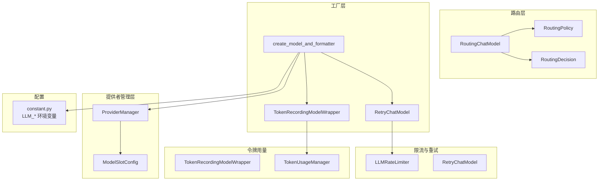
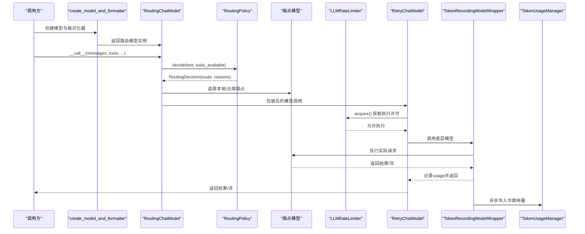
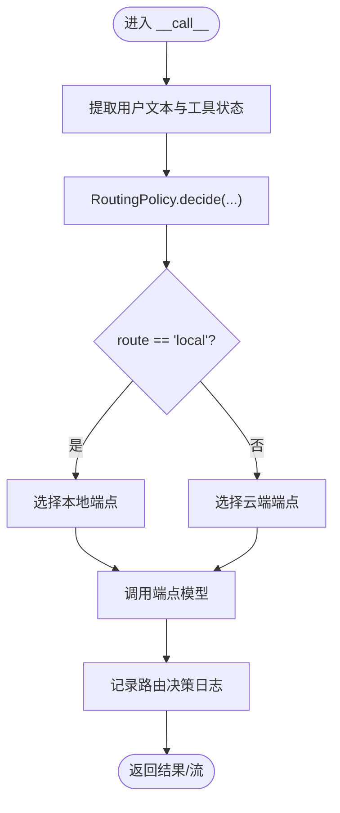
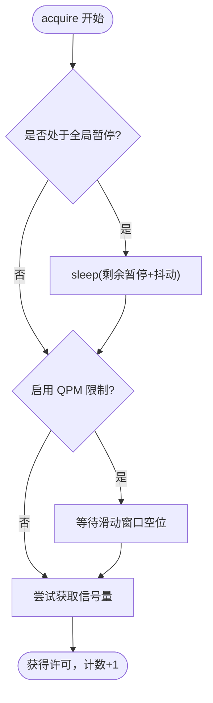
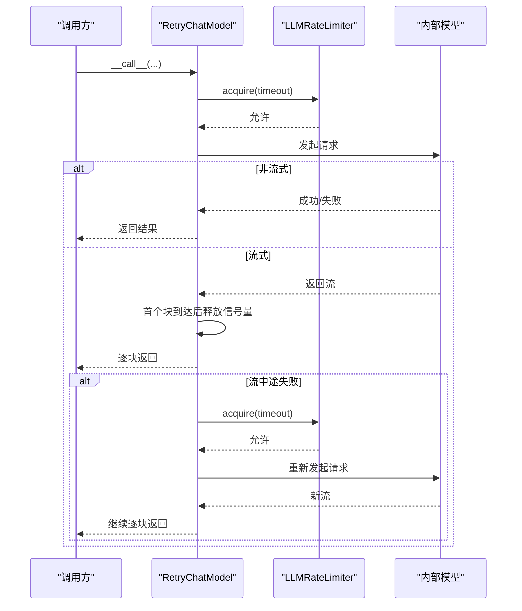
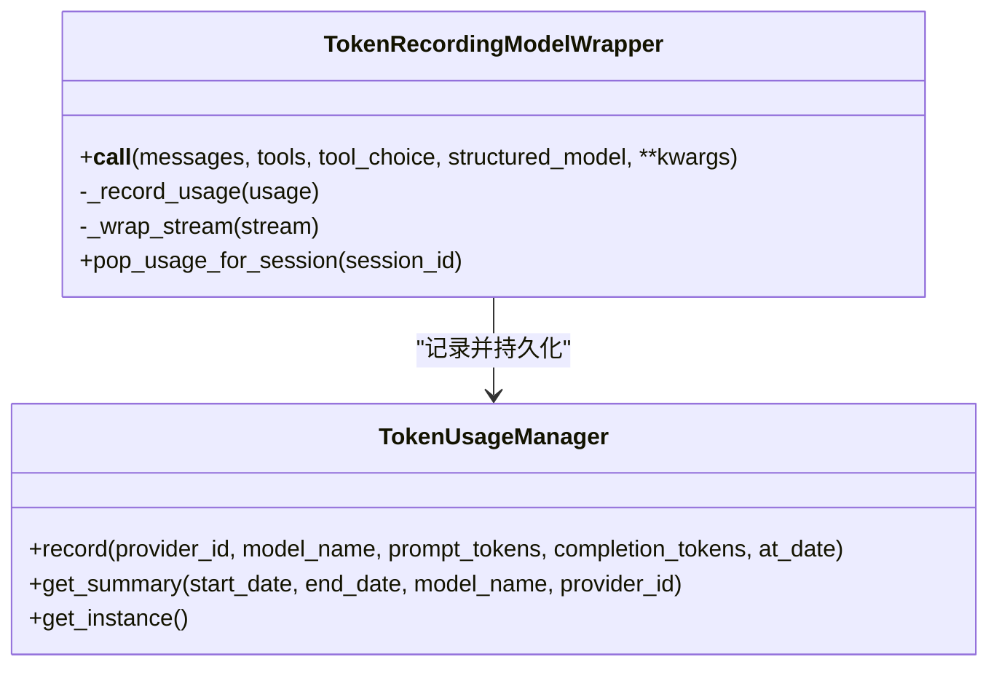
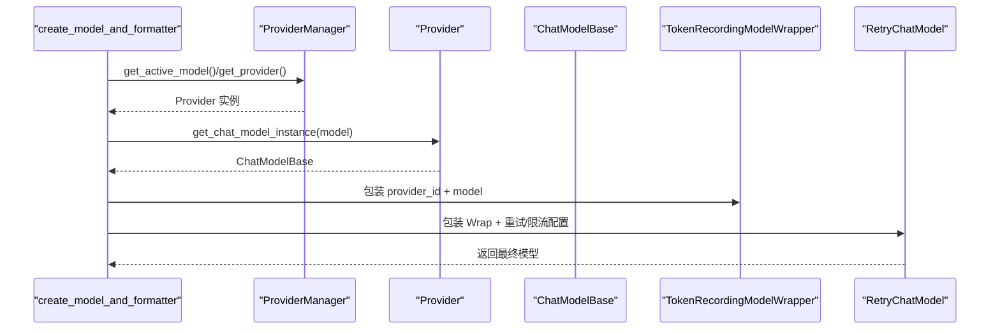
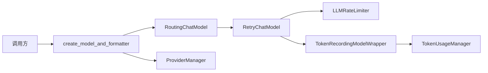

# 模型路由机制

<cite>
**本文引用的文件**
- [routing_chat_model.py](file://src/qwenpaw/agents/routing_chat_model.py)
- [model_factory.py](file://src/qwenpaw/agents/model_factory.py)
- [rate_limiter.py](file://src/qwenpaw/providers/rate_limiter.py)
- [retry_chat_model.py](file://src/qwenpaw/providers/retry_chat_model.py)
- [provider_manager.py](file://src/qwenpaw/providers/provider_manager.py)
- [models.py](file://src/qwenpaw/providers/models.py)
- [constant.py](file://src/qwenpaw/constant.py)
- [model_wrapper.py](file://src/qwenpaw/token_usage/model_wrapper.py)
- [manager.py](file://src/qwenpaw/token_usage/manager.py)
</cite>

## 目录
1. [简介](#简介)
2. [项目结构](#项目结构)
3. [核心组件](#核心组件)
4. [架构总览](#架构总览)
5. [详细组件分析](#详细组件分析)
6. [依赖分析](#依赖分析)
7. [性能考量](#性能考量)
8. [故障排除指南](#故障排除指南)
9. [结论](#结论)
10. [附录](#附录)

## 简介
本文件系统性阐述 QwenPaw 的“模型路由机制”，聚焦以下方面：
- 路由算法设计与实现：本地/云端双通道选择策略、路由决策上下文与原因记录。
- 负载均衡与限流：基于并发信号量与 QPM 滑动窗口的全局速率控制，以及 429 全局暂停与抖动防风暴。
- 故障转移与重试：针对瞬时错误（含 429）的指数退避重试，支持非流式与流式请求的完整重试。
- 性能优化：令牌桶思想在 QPM 限制中的应用、获取许可的超时保护、流式响应的“到达即放”策略。
- 动态槽位与资源管理：通过 ProviderManager 统一管理内置/自定义/插件提供者，结合模型槽位配置进行动态选择。
- 实时监控与指标：令牌用量统计、限流器运行统计、路由决策日志。
- 最佳实践与排障：参数调优建议、常见问题定位与修复。

## 项目结构
围绕模型路由的关键模块分布如下：
- 路由层：RoutingChatModel、RoutingPolicy、RoutingDecision
- 工厂层：create_model_and_formatter，负责装配模型与格式化器，并注入重试与限流包装
- 提供者管理层：ProviderManager，统一加载与管理内置/自定义/插件提供者
- 限流与重试：LLMRateLimiter、RetryChatModel
- 令牌用量：TokenRecordingModelWrapper、TokenUsageManager
- 配置常量：constant.py 中的 LLM_* 环境变量与默认值

**图表来源**
- [routing_chat_model.py:65-123](file://src/qwenpaw/agents/routing_chat_model.py#L65-L123)
- [model_factory.py:698-788](file://src/qwenpaw/agents/model_factory.py#L698-L788)
- [provider_manager.py:670-800](file://src/qwenpaw/providers/provider_manager.py#L670-L800)
- [models.py:9-16](file://src/qwenpaw/providers/models.py#L9-L16)
- [rate_limiter.py:30-279](file://src/qwenpaw/providers/rate_limiter.py#L30-L279)
- [retry_chat_model.py:204-477](file://src/qwenpaw/providers/retry_chat_model.py#L204-L477)
- [model_wrapper.py:15-92](file://src/qwenpaw/token_usage/model_wrapper.py#L15-L92)
- [manager.py:62-309](file://src/qwenpaw/token_usage/manager.py#L62-L309)
- [constant.py:220-282](file://src/qwenpaw/constant.py#L220-L282)

**章节来源**
- [routing_chat_model.py:1-123](file://src/qwenpaw/agents/routing_chat_model.py#L1-L123)
- [model_factory.py:1-820](file://src/qwenpaw/agents/model_factory.py#L1-L820)
- [provider_manager.py:1-800](file://src/qwenpaw/providers/provider_manager.py#L1-L800)
- [models.py:1-16](file://src/qwenpaw/providers/models.py#L1-L16)
- [rate_limiter.py:1-279](file://src/qwenpaw/providers/rate_limiter.py#L1-L279)
- [retry_chat_model.py:1-477](file://src/qwenpaw/providers/retry_chat_model.py#L1-L477)
- [model_wrapper.py:1-92](file://src/qwenpaw/token_usage/model_wrapper.py#L1-L92)
- [manager.py:1-309](file://src/qwenpaw/token_usage/manager.py#L1-L309)
- [constant.py:1-307](file://src/qwenpaw/constant.py#L1-L307)

## 核心组件
- 路由策略与决策
  - RoutingPolicy 基于配置决定优先路由（本地或云端）
  - RoutingDecision 记录路由结果与原因
  - RoutingChatModel 在调用时根据策略选择端点并转发请求
- 工厂装配
  - create_model_and_formatter 依据代理配置或全局配置选择 Provider 与模型，生成 ChatModelBase 与 FormatterBase，并包裹 TokenRecordingModelWrapper 与 RetryChatModel
- 限流与重试
  - LLMRateLimiter 提供并发信号量、QPM 滑动窗口、429 全局暂停与抖动
  - RetryChatModel 对瞬时错误（含 429）进行指数退避重试，支持非流式与流式完整重试
- 令牌用量
  - TokenRecordingModelWrapper 记录每次调用的 prompt/completion tokens，并汇总到 TokenUsageManager
- 提供者与槽位
  - ProviderManager 统一管理内置/自定义/插件提供者；ModelSlotConfig 描述 provider_id 与 model 名称

**章节来源**
- [routing_chat_model.py:29-123](file://src/qwenpaw/agents/routing_chat_model.py#L29-L123)
- [model_factory.py:698-788](file://src/qwenpaw/agents/model_factory.py#L698-L788)
- [rate_limiter.py:30-279](file://src/qwenpaw/providers/rate_limiter.py#L30-L279)
- [retry_chat_model.py:204-477](file://src/qwenpaw/providers/retry_chat_model.py#L204-L477)
- [model_wrapper.py:15-92](file://src/qwenpaw/token_usage/model_wrapper.py#L15-L92)
- [manager.py:62-309](file://src/qwenpaw/token_usage/manager.py#L62-L309)
- [provider_manager.py:670-800](file://src/qwenpaw/providers/provider_manager.py#L670-L800)
- [models.py:9-16](file://src/qwenpaw/providers/models.py#L9-L16)

## 架构总览
下图展示从调用入口到实际模型调用的完整链路，以及限流、重试、令牌用量与路由决策的交互。

**图表来源**
- [model_factory.py:698-788](file://src/qwenpaw/agents/model_factory.py#L698-L788)
- [routing_chat_model.py:84-123](file://src/qwenpaw/agents/routing_chat_model.py#L84-L123)
- [retry_chat_model.py:269-354](file://src/qwenpaw/providers/retry_chat_model.py#L269-L354)
- [rate_limiter.py:70-151](file://src/qwenpaw/providers/rate_limiter.py#L70-L151)
- [model_wrapper.py:61-92](file://src/qwenpaw/token_usage/model_wrapper.py#L61-L92)
- [manager.py:110-156](file://src/qwenpaw/token_usage/manager.py#L110-L156)

## 详细组件分析

### 路由策略与决策
- 决策输入
  - 文本内容（用户消息拼接）
  - 工具可用性（是否传入 tools）
  - 配置项（默认本地优先或云端优先）
- 决策输出
  - route: "local" 或 "cloud"
  - reasons: 决策原因列表（如 mode:local_first / mode:cloud_first）
- 执行流程
  - 路由模型在 __call__ 中提取文本与工具状态
  - 调用 RoutingPolicy.decide 得到 RoutingDecision
  - 选择对应端点的 ChatModelBase 并透传调用

**图表来源**
- [routing_chat_model.py:84-123](file://src/qwenpaw/agents/routing_chat_model.py#L84-L123)
- [routing_chat_model.py:35-53](file://src/qwenpaw/agents/routing_chat_model.py#L35-L53)

**章节来源**
- [routing_chat_model.py:29-123](file://src/qwenpaw/agents/routing_chat_model.py#L29-L123)

### 限流器（令牌桶思想与滑动窗口）
- 设计要点
  - 并发信号量：限制同时在途的 LLM 调用数量，避免突发洪峰
  - QPM 滑动窗口：维护最近 60 秒的请求时间戳，按需等待腾出配额
  - 全局 429 暂停：收到 429 后设置统一暂停时间，所有等待者按剩余时间+抖动唤醒，避免惊群
  - 抖动：每个等待者额外叠加随机抖动，分散唤醒时刻
  - 获取许可超时：wait_for 保护，超时抛出明确异常
- acquire 执行顺序
  - 等待 429 冷却（含抖动）
  - 等待 QPM 窗口空位
  - 获取并发信号量
- 统计指标
  - 当前在途、可用并发、QPM 近期请求数、是否处于暂停、暂停剩余时间等

**图表来源**
- [rate_limiter.py:70-151](file://src/qwenpaw/providers/rate_limiter.py#L70-L151)
- [rate_limiter.py:112-144](file://src/qwenpaw/providers/rate_limiter.py#L112-L144)

**章节来源**
- [rate_limiter.py:30-279](file://src/qwenpaw/providers/rate_limiter.py#L30-L279)

### 重试机制与指数退避
- 可重试条件
  - SDK 特定的 RateLimitError/APITimeoutError/APIConnectionError
  - HTTP 状态码在 {429, 500, 502, 503, 504, 529}
- 429 处理
  - 解析 Retry-After 头部，若无则使用默认暂停时长
  - 通知全局限流器设置暂停时间
- 指数退避
  - base * 2^(attempt-1)，上限受 backoff_cap 控制
- 流式与非流式
  - 非流式：失败即整体重试
  - 流式：到达首个块后释放信号量，后续失败再重试整流

**图表来源**
- [retry_chat_model.py:269-354](file://src/qwenpaw/providers/retry_chat_model.py#L269-L354)
- [retry_chat_model.py:357-477](file://src/qwenpaw/providers/retry_chat_model.py#L357-L477)
- [rate_limiter.py:70-151](file://src/qwenpaw/providers/rate_limiter.py#L70-L151)

**章节来源**
- [retry_chat_model.py:124-202](file://src/qwenpaw/providers/retry_chat_model.py#L124-L202)
- [retry_chat_model.py:204-477](file://src/qwenpaw/providers/retry_chat_model.py#L204-L477)

### 令牌用量与统计
- TokenRecordingModelWrapper
  - 包装任意 ChatModelBase，在同步与异步两种路径上记录 usage
  - 将本次会话的 usage 存储在会话级字典中，便于查询
- TokenUsageManager
  - 单例，异步读写磁盘 JSON 文件
  - 支持按日期范围、模型名、提供者 ID 查询与聚合
  - 输出 total_prompt_tokens、total_completion_tokens、total_calls 与分组统计

**图表来源**
- [model_wrapper.py:15-92](file://src/qwenpaw/token_usage/model_wrapper.py#L15-L92)
- [manager.py:62-309](file://src/qwenpaw/token_usage/manager.py#L62-L309)

**章节来源**
- [model_wrapper.py:15-92](file://src/qwenpaw/token_usage/model_wrapper.py#L15-L92)
- [manager.py:62-309](file://src/qwenpaw/token_usage/manager.py#L62-L309)

### 工厂装配与模型槽位
- create_model_and_formatter
  - 优先读取代理特定配置（active_model、重试与限流配置）
  - 若无代理配置，则回退到全局 active_model
  - 通过 ProviderManager 获取 Provider 实例并创建 ChatModelBase
  - 使用 _create_formatter_instance 生成格式化器
  - 包裹 TokenRecordingModelWrapper 与 RetryChatModel
- ProviderManager
  - 维护内置/自定义/插件提供者集合
  - 提供 get_provider、get_active_model 等能力
- ModelSlotConfig
  - 描述 provider_id 与 model 名称，作为“槽位”标识

**图表来源**
- [model_factory.py:698-788](file://src/qwenpaw/agents/model_factory.py#L698-L788)
- [provider_manager.py:770-800](file://src/qwenpaw/providers/provider_manager.py#L770-L800)
- [models.py:9-16](file://src/qwenpaw/providers/models.py#L9-L16)

**章节来源**
- [model_factory.py:698-788](file://src/qwenpaw/agents/model_factory.py#L698-L788)
- [provider_manager.py:670-800](file://src/qwenpaw/providers/provider_manager.py#L670-L800)
- [models.py:9-16](file://src/qwenpaw/providers/models.py#L9-L16)

## 依赖分析
- 组件耦合
  - RoutingChatModel 仅依赖 RoutingPolicy 与端点模型，低耦合高内聚
  - 工厂层通过 ProviderManager 解耦具体提供者类型
  - 限流与重试通过全局单例 LLMRateLimiter 协调，避免重复实例化
- 关键依赖链
  - 调用方 → create_model_and_formatter → RoutingChatModel/ProviderManager → RetryChatModel → LLMRateLimiter → 底层模型
  - TokenRecordingModelWrapper → TokenUsageManager（异步文件 IO）

**图表来源**
- [model_factory.py:698-788](file://src/qwenpaw/agents/model_factory.py#L698-L788)
- [routing_chat_model.py:65-123](file://src/qwenpaw/agents/routing_chat_model.py#L65-L123)
- [retry_chat_model.py:204-477](file://src/qwenpaw/providers/retry_chat_model.py#L204-L477)
- [rate_limiter.py:30-279](file://src/qwenpaw/providers/rate_limiter.py#L30-L279)
- [model_wrapper.py:15-92](file://src/qwenpaw/token_usage/model_wrapper.py#L15-L92)
- [manager.py:62-309](file://src/qwenpaw/token_usage/manager.py#L62-L309)

**章节来源**
- [model_factory.py:698-788](file://src/qwenpaw/agents/model_factory.py#L698-L788)
- [routing_chat_model.py:65-123](file://src/qwenpaw/agents/routing_chat_model.py#L65-L123)
- [retry_chat_model.py:204-477](file://src/qwenpaw/providers/retry_chat_model.py#L204-L477)
- [rate_limiter.py:30-279](file://src/qwenpaw/providers/rate_limiter.py#L30-L279)
- [model_wrapper.py:15-92](file://src/qwenpaw/token_usage/model_wrapper.py#L15-L92)
- [manager.py:62-309](file://src/qwenpaw/token_usage/manager.py#L62-L309)

## 性能考量
- QPM 滑动窗口
  - 以 60 秒为窗口，按需等待最早请求出窗后再入队，主动预防 429
  - 时间复杂度：入窗 append 与清理 popleft 均摊 O(1)
- 并发信号量
  - 严格限制在途请求数，避免上游 API 被打爆
- 流式“到达即放”
  - 首个块到达后立即释放信号量，减少对其他并发请求的阻塞
- 抖动与冷却
  - 429 后统一暂停并叠加抖动，避免大量等待者同时唤醒引发二次拥塞
- 超时保护
  - 获取许可的 wait_for 超时，防止无限阻塞导致线程池耗尽

[本节为通用性能讨论，不直接分析具体文件]

## 故障排除指南
- 429 频繁
  - 检查 LLM_MAX_QPM 是否过低；适当提高 QPM 或降低并发
  - 观察 LLM_RATE_LIMIT_PAUSE 与 LLM_RATE_LIMIT_JITTER 设置
  - 查看限流器 stats 中 is_paused 与 pause_remaining_s
- 获取许可超时
  - 提升 LLM_ACQUIRE_TIMEOUT，或降低 LLM_MAX_CONCURRENT
  - 检查上游 API 是否长期不可用导致排队
- 重试无效或过度
  - 调整 LLM_MAX_RETRIES、LLM_BACKOFF_BASE、LLM_BACKOFF_CAP
  - 确认可重试状态码集合是否覆盖目标错误
- 令牌用量缺失
  - 确认 TokenRecordingModelWrapper 是否被正确包裹
  - 检查 TokenUsageManager 文件路径与权限（WORKING_DIR/TOKEN_USAGE_FILE）
- 路由决策不符合预期
  - 检查 AgentsLLMRoutingConfig.mode（local_first/cloud_first）
  - 查看路由日志中的 reasons 字段

**章节来源**
- [rate_limiter.py:152-196](file://src/qwenpaw/providers/rate_limiter.py#L152-L196)
- [retry_chat_model.py:124-202](file://src/qwenpaw/providers/retry_chat_model.py#L124-L202)
- [constant.py:220-282](file://src/qwenpaw/constant.py#L220-L282)
- [manager.py:62-109](file://src/qwenpaw/token_usage/manager.py#L62-L109)
- [routing_chat_model.py:84-123](file://src/qwenpaw/agents/routing_chat_model.py#L84-L123)

## 结论
QwenPaw 的模型路由机制通过“策略化路由 + 工厂装配 + 全局限流 + 指数退避 + 令牌用量统计”的组合，实现了：
- 明确的本地/云端路由策略与可观测的决策原因
- 主动式 QPM 防御与全局 429 冷却，配合抖动避免惊群
- 面向瞬时错误的透明重试，兼顾非流式与流式的完整性
- 会话级令牌用量记录与聚合统计，支撑成本与性能分析
- 基于 ProviderManager 的动态槽位管理，便于扩展与运维

[本节为总结性内容，不直接分析具体文件]

## 附录

### 路由配置最佳实践
- 路由模式
  - 本地优先：适合低延迟、隐私敏感场景
  - 云端优先：适合高算力、大模型推理需求
- 并发与 QPM
  - 从保守值起步（如 MAX_CONCURRENT=3~5），结合上游配额逐步提升
  - QPM 与并发协同：QPM 为 60 秒窗口内的最大请求数，用于主动防 429
- 重试策略
  - 适度的 MAX_RETRIES 与合理的 backoff_base/cap，避免雪崩
- 限流超时
  - ACQUIRE_TIMEOUT 需要足够长以应对突发排队，但不宜过大以免资源占用

**章节来源**
- [constant.py:220-282](file://src/qwenpaw/constant.py#L220-L282)
- [routing_chat_model.py:44-53](file://src/qwenpaw/agents/routing_chat_model.py#L44-L53)

### 多模型并发与资源隔离
- 并发隔离
  - LLMRateLimiter 全局单例，统一控制并发与 QPM，避免不同代理互相影响
- 资源隔离
  - ProviderManager 将不同提供者（OpenAI、Anthropic、Gemini、本地等）隔离管理
  - 每个代理可独立配置 active_model、重试与限流参数，互不影响
- 流式隔离
  - 流式响应在首个块到达后释放信号量，降低对其他并发请求的影响

**章节来源**
- [rate_limiter.py:30-70](file://src/qwenpaw/providers/rate_limiter.py#L30-L70)
- [provider_manager.py:670-800](file://src/qwenpaw/providers/provider_manager.py#L670-L800)
- [retry_chat_model.py:235-268](file://src/qwenpaw/providers/retry_chat_model.py#L235-L268)