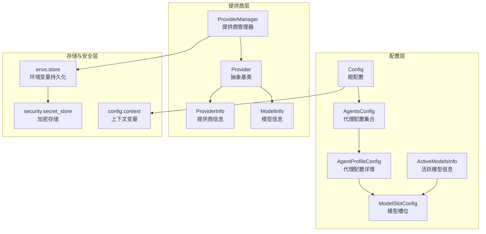
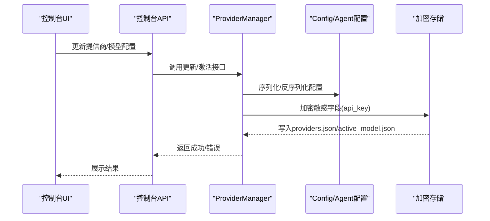
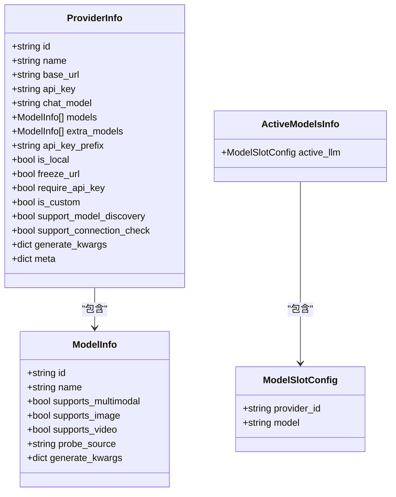
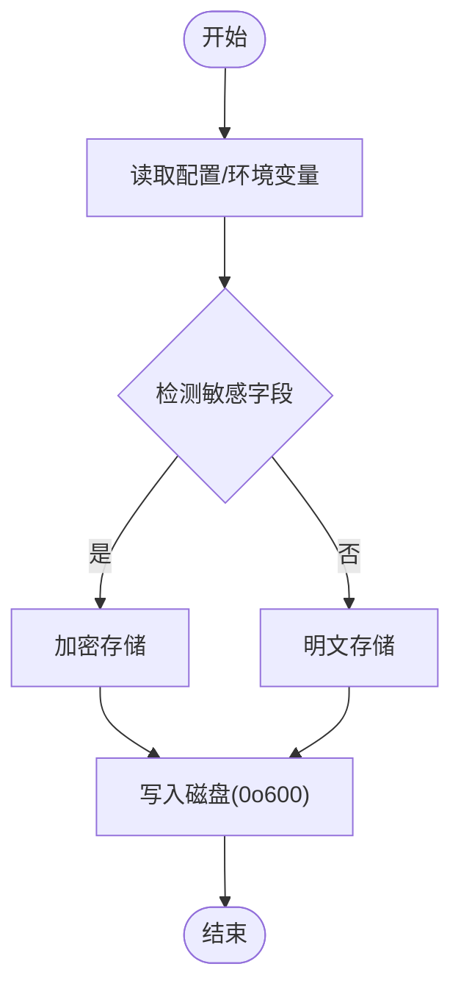
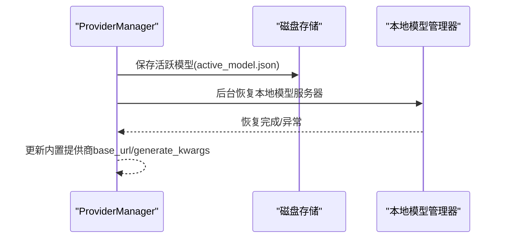
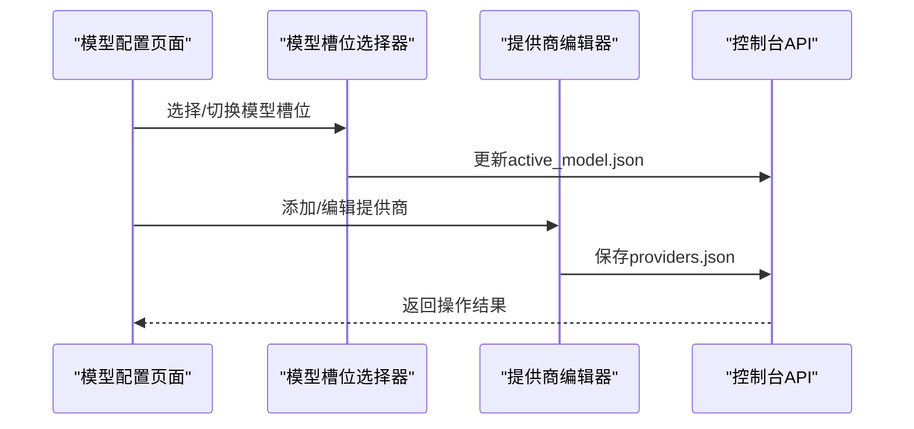
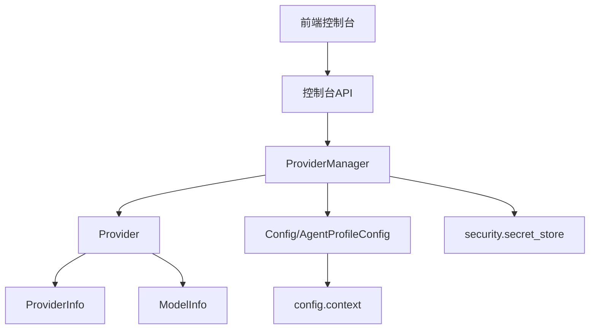

# 模型配置管理

<cite>
**本文档引用的文件**
- [src\qwenpaw\config\config.py](file://src\qwenpaw\config\config.py)
- [src\qwenpaw\config\utils.py](file://src\qwenpaw\config\utils.py)
- [src\qwenpaw\providers\models.py](file://src\qwenpaw\providers\models.py)
- [src\qwenpaw\providers\provider.py](file://src\qwenpaw\providers\provider.py)
- [src\qwenpaw\providers\provider_manager.py](file://src\qwenpaw\providers\provider_manager.py)
- [src\qwenpaw\envs\store.py](file://src\qwenpaw\envs\store.py)
- [src\qwenpaw\security\secret_store.py](file://src\qwenpaw\security\secret_store.py)
- [src\qwenpaw\config\context.py](file://src\qwenpaw\config\context.py)
- [src\qwenpaw\app\migration.py](file://src\qwenpaw\app\migration.py)
- [console\src\pages\Settings\Models\index.tsx](file://console\src\pages\Settings\Models\index.tsx)
- [console\src\pages\Settings\Models\components\ModelSlotSelector\index.tsx](file://console\src\pages\Settings\Models\components\ModelSlotSelector\index.tsx)
- [console\src\pages\Settings\Models\components\ModelSlotSelector\useModelSlotSelector.ts](file://console\src\pages\Settings\Models\components\ModelSlotSelector\useModelSlotSelector.ts)
- [console\src\pages\Settings\Models\components\ProviderEditor\index.tsx](file://console\src\pages\Settings\Models\components\ProviderEditor\index.tsx)
- [console\src\pages\Settings\Models\components\ProviderEditor\useProviderEditor.ts](file://console\src\pages\Settings\Models\components\ProviderEditor\useProviderEditor.ts)
- [console\src\api\modules\env.ts](file://console\src\api\modules\env.ts)
- [console\src\pages\Settings\Environments\index.tsx](file://console\src\pages\Settings\Environments\index.tsx)
- [console\src\pages\Settings\Environments\useEnvVars.ts](file://console\src\pages\Settings\Environments\useEnvVars.ts)
</cite>

## 目录
1. [简介](#简介)
2. [项目结构](#项目结构)
3. [核心组件](#核心组件)
4. [架构总览](#架构总览)
5. [详细组件分析](#详细组件分析)
6. [依赖关系分析](#依赖关系分析)
7. [性能考虑](#性能考虑)
8. [故障排除指南](#故障排除指南)
9. [结论](#结论)
10. [附录](#附录)

## 简介
本文件面向QwenPaw的模型配置管理，系统性阐述模型配置的数据结构与验证机制，涵盖ModelInfo、ProviderInfo与ModelSlotConfig的定义与用途；文档化配置文件的存储格式、加密机制与安全策略；解释配置的动态更新、热重载与版本兼容性处理；提供配置模板、默认值设置与配置迁移策略；并给出配置最佳实践、性能调优建议与常见配置错误排查方法，同时覆盖备份、恢复与多环境部署策略。

## 项目结构
QwenPaw的模型配置管理由三层协同构成：
- 配置层：以Pydantic模型定义配置数据结构，负责校验与序列化，位于config模块。
- 提供商层：抽象Provider接口，统一管理提供商信息与模型能力，位于providers模块。
- 存储与安全层：提供磁盘持久化、敏感字段加密、密钥管理与环境变量注入，位于envs与security模块。

**图表来源**
- [src\qwenpaw\config\config.py](file://src\qwenpaw\config\config.py)
- [src\qwenpaw\providers\provider_manager.py](file://src\qwenpaw\providers\provider_manager.py)
- [src\qwenpaw\envs\store.py](file://src\qwenpaw\envs\store.py)
- [src\qwenpaw\security\secret_store.py](file://src\qwenpaw\security\secret_store.py)
- [src\qwenpaw\config\context.py](file://src\qwenpaw\config\context.py)

**章节来源**
- [src\qwenpaw\config\config.py](file://src\qwenpaw\config\config.py)
- [src\qwenpaw\providers\provider_manager.py](file://src\qwenpaw\providers\provider_manager.py)
- [src\qwenpaw\envs\store.py](file://src\qwenpaw\envs\store.py)
- [src\qwenpaw\security\secret_store.py](file://src\qwenpaw\security\secret_store.py)
- [src\qwenpaw\config\context.py](file://src\qwenpaw\config\context.py)

## 核心组件
- ModelSlotConfig：描述“提供商ID+模型名”的最小可用配置单元，用于路由与激活。
- ModelInfo：描述单个模型的能力与参数，支持多模态探测与生成参数覆盖。
- ProviderInfo：描述提供商的元信息与能力，如是否本地、是否需要API Key等。
- ActiveModelsInfo：聚合活跃模型槽位，便于全局状态管理。
- ProviderManager：统一管理内置/自定义/插件提供商，负责持久化、迁移与能力探测。
- Config/AgentsConfig/AgentProfileConfig：根配置、代理集合与代理详情，承载渠道、工具、安全等配置。

**章节来源**
- [src\qwenpaw\providers\models.py](file://src\qwenpaw\providers\models.py)
- [src\qwenpaw\providers\provider.py](file://src\qwenpaw\providers\provider.py)
- [src\qwenpaw\providers\provider_manager.py](file://src\qwenpaw\providers\provider_manager.py)
- [src\qwenpaw\config\config.py](file://src\qwenpaw\config\config.py)

## 架构总览
模型配置管理采用“声明式配置 + 动态提供商管理 + 加密持久化”的架构。前端通过控制台API修改配置，后端通过ProviderManager与配置模型进行交互，并将敏感信息加密存储到磁盘。

**图表来源**
- [console\src\pages\Settings\Models\components\ProviderEditor\useProviderEditor.ts](file://console\src\pages\Settings\Models\components\ProviderEditor\useProviderEditor.ts)
- [src\qwenpaw\providers\provider_manager.py](file://src\qwenpaw\providers\provider_manager.py)
- [src\qwenpaw\security\secret_store.py](file://src\qwenpaw\security\secret_store.py)

## 详细组件分析

### 数据模型与验证机制
- ModelSlotConfig：包含provider_id与model两个字段，作为模型路由的基础。
- ModelInfo：包含id/name/supports_multimodal等字段，支持探测与覆盖生成参数。
- ProviderInfo：包含id/name/base_url/api_key/chat_model/models等字段，描述提供商能力与元信息。
- ActiveModelsInfo：聚合活跃模型槽位，便于全局状态管理。
- 配置验证：Config/AgentProfileConfig等均基于Pydantic，具备字段类型校验、别名映射与模型级校验逻辑。

**图表来源**
- [src\qwenpaw\providers\models.py](file://src\qwenpaw\providers\models.py)
- [src\qwenpaw\providers\provider.py](file://src\qwenpaw\providers\provider.py)

**章节来源**
- [src\qwenpaw\providers\models.py](file://src\qwenpaw\providers\models.py)
- [src\qwenpaw\providers\provider.py](file://src\qwenpaw\providers\provider.py)
- [src\qwenpaw\config\config.py](file://src\qwenpaw\config\config.py)

### 配置存储格式与加密机制
- 配置文件位置：config.json位于工作目录，代理配置位于各工作空间的agent.json。
- 敏感字段：api_key等敏感字段在写入磁盘前通过加密存储层进行加密，读取时透明解密。
- 环境变量：环境变量持久化于envs.json，同样采用加密存储与权限控制（0o600）。
- 密钥管理：主密钥优先存储于操作系统钥匙串，失败时回退至SECRET_DIR/.master_key文件。

**图表来源**
- [src\qwenpaw\security\secret_store.py](file://src\qwenpaw\security\secret_store.py)
- [src\qwenpaw\envs\store.py](file://src\qwenpaw\envs\store.py)

**章节来源**
- [src\qwenpaw\security\secret_store.py](file://src\qwenpaw\security\secret_store.py)
- [src\qwenpaw\envs\store.py](file://src\qwenpaw\envs\store.py)

### 动态更新、热重载与版本兼容
- 动态更新：ProviderManager支持在线更新提供商配置、模型列表与活跃模型，并持久化到磁盘。
- 热重载：通过后台任务恢复本地模型服务器，避免重启导致的服务中断。
- 版本兼容：迁移逻辑保留旧版字段以便降级，同时对新旧结构进行双向兼容处理。

**图表来源**
- [src\qwenpaw\providers\provider_manager.py](file://src\qwenpaw\providers\provider_manager.py)

**章节来源**
- [src\qwenpaw\providers\provider_manager.py](file://src\qwenpaw\providers\provider_manager.py)
- [src\qwenpaw\app\migration.py](file://src\qwenpaw\app\migration.py)

### 配置模板、默认值与迁移策略
- 默认值：Config/AgentProfileConfig等均提供合理的默认值，确保首次运行可用。
- 迁移策略：提供从旧版providers.json到新版结构的迁移，以及从旧版单代理结构迁移到多代理结构。
- 兼容策略：保留旧版字段以支持降级，避免破坏历史配置。

**章节来源**
- [src\qwenpaw\config\config.py](file://src\qwenpaw\config\config.py)
- [src\qwenpaw\config\utils.py](file://src\qwenpaw\config\utils.py)
- [src\qwenpaw\app\migration.py](file://src\qwenpaw\app\migration.py)

### 前端配置界面与交互
- 模型槽位选择器：提供模型槽位编辑与切换，支持本地/云端双槽位模式。
- 提供商编辑器：支持添加/删除/更新提供商，包括连接检查与模型发现。
- 环境变量管理：支持批量保存、删除与校验，确保键名规范与去重。

**图表来源**
- [console\src\pages\Settings\Models\components\ModelSlotSelector\useModelSlotSelector.ts](file://console\src\pages\Settings\Models\components\ModelSlotSelector\useModelSlotSelector.ts)
- [console\src\pages\Settings\Models\components\ProviderEditor\useProviderEditor.ts](file://console\src\pages\Settings\Models\components\ProviderEditor\useProviderEditor.ts)
- [console\src\api\modules\env.ts](file://console\src\api\modules\env.ts)

**章节来源**
- [console\src\pages\Settings\Models\index.tsx](file://console\src\pages\Settings\Models\index.tsx)
- [console\src\pages\Settings\Models\components\ModelSlotSelector\index.tsx](file://console\src\pages\Settings\Models\components\ModelSlotSelector\index.tsx)
- [console\src\pages\Settings\Models\components\ProviderEditor\index.tsx](file://console\src\pages\Settings\Models\components\ProviderEditor\index.tsx)
- [console\src\api\modules\env.ts](file://console\src\api\modules\env.ts)

## 依赖关系分析
- ProviderManager依赖Provider抽象类与具体提供商实现，负责统一管理与持久化。
- 配置层依赖Pydantic模型进行数据校验与序列化。
- 存储层依赖加密存储模块与环境变量模块，确保敏感信息的安全性与可移植性。
- 前端通过API与后端交互，实现配置的可视化编辑与即时生效。

**图表来源**
- [src\qwenpaw\providers\provider_manager.py](file://src\qwenpaw\providers\provider_manager.py)
- [src\qwenpaw\providers\provider.py](file://src\qwenpaw\providers\provider.py)
- [src\qwenpaw\config\config.py](file://src\qwenpaw\config\config.py)
- [src\qwenpaw\security\secret_store.py](file://src\qwenpaw\security\secret_store.py)
- [src\qwenpaw\config\context.py](file://src\qwenpaw\config\context.py)

**章节来源**
- [src\qwenpaw\providers\provider_manager.py](file://src\qwenpaw\providers\provider_manager.py)
- [src\qwenpaw\providers\provider.py](file://src\qwenpaw\providers\provider.py)
- [src\qwenpaw\config\config.py](file://src\qwenpaw\config\config.py)
- [src\qwenpaw\security\secret_store.py](file://src\qwenpaw\security\secret_store.py)
- [src\qwenpaw\config\context.py](file://src\qwenpaw\config\context.py)

## 性能考虑
- 并发与限流：AgentsRunningConfig提供最大并发、QPM限制与指数退避重试策略，避免上游限流与抖动。
- 上下文压缩：ContextCompactConfig与MemorySummaryConfig支持上下文压缩与摘要，减少Token占用。
- 工具结果压缩：ToolResultCompactConfig控制近期/旧有工具输出的字节阈值，降低存储与传输开销。
- 本地模型恢复：ProviderManager后台恢复本地模型服务器，减少冷启动时间。

**章节来源**
- [src\qwenpaw\config\config.py](file://src\qwenpaw\config\config.py)
- [src\qwenpaw\providers\provider_manager.py](file://src\qwenpaw\providers\provider_manager.py)

## 故障排除指南
- 配置损坏：配置加载器会尝试修复JSON语法问题并备份不可修复文件，必要时回退到默认配置。
- 加密失败：加密存储层对密钥变更或数据损坏进行优雅降级，返回原始密文而非崩溃。
- 环境变量冲突：环境变量持久化时会跳过受保护键并避免覆盖系统/进程环境变量。
- 多代理迁移：若迁移失败，保留旧版字段以支持降级；必要时手动清理legacy文件。

**章节来源**
- [src\qwenpaw\config\utils.py](file://src\qwenpaw\config\utils.py)
- [src\qwenpaw\security\secret_store.py](file://src\qwenpaw\security\secret_store.py)
- [src\qwenpaw\envs\store.py](file://src\qwenpaw\envs\store.py)
- [src\qwenpaw\app\migration.py](file://src\qwenpaw\app\migration.py)

## 结论
QwenPaw的模型配置管理通过清晰的数据模型、严格的验证机制、完善的加密存储与灵活的迁移策略，实现了高可用、可维护与可扩展的配置体系。结合前端可视化编辑与后端动态持久化，用户可以安全、高效地管理多提供商、多模型的复杂配置场景。

## 附录

### 配置最佳实践
- 使用ModelSlotConfig明确区分本地与云端模型，避免硬编码提供商ID。
- 对敏感字段（如api_key）仅在需要时暴露，优先使用环境变量注入。
- 启用上下文压缩与工具结果压缩，平衡性能与信息完整性。
- 定期备份config.json与providers目录，确保可快速恢复。

### 性能调优建议
- 合理设置AgentsRunningConfig的并发数与QPM上限，避免触发上游限流。
- 根据业务场景调整上下文压缩阈值，减少Token消耗。
- 使用本地模型时，提前下载并固定端口，缩短恢复时间。

### 常见配置错误排查
- 配置无法加载：检查JSON语法与字段类型，确认是否被自动修复或回退。
- 加密字段显示异常：确认主密钥存在且未被篡改，必要时重新生成密钥。
- 环境变量未生效：检查是否为受保护键，确认是否被系统/进程环境覆盖。

### 备份、恢复与多环境部署策略
- 备份：定期复制config.json、providers目录与envs.json到安全位置。
- 恢复：在新环境中先恢复envs.json（含加密），再恢复providers与config，最后启动应用。
- 多环境：通过环境变量隔离工作目录与密钥目录，避免跨环境污染。