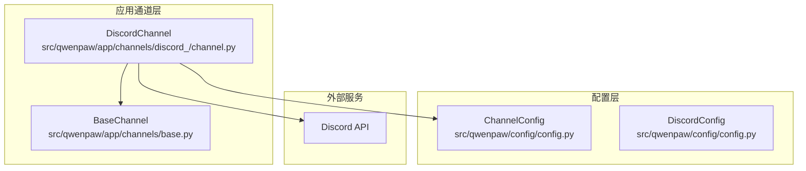
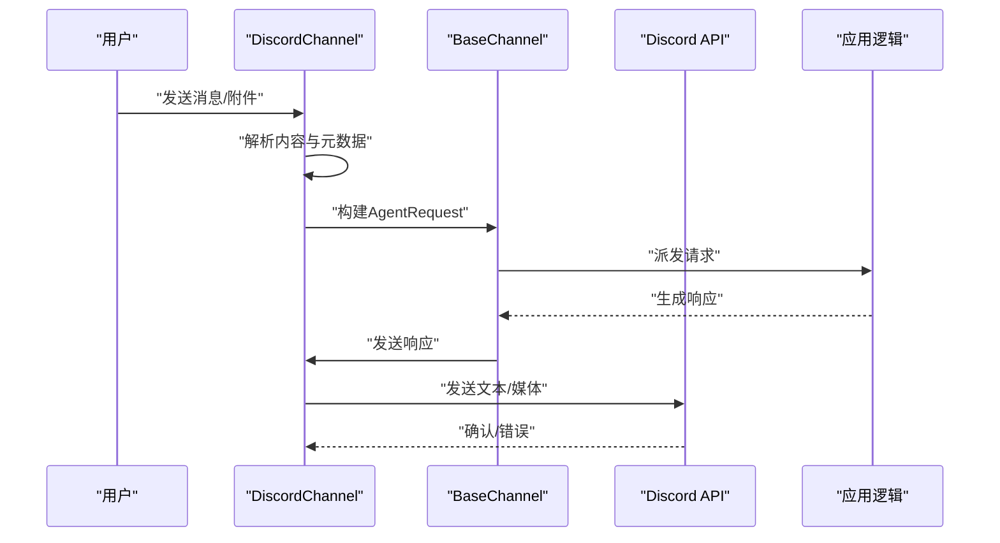
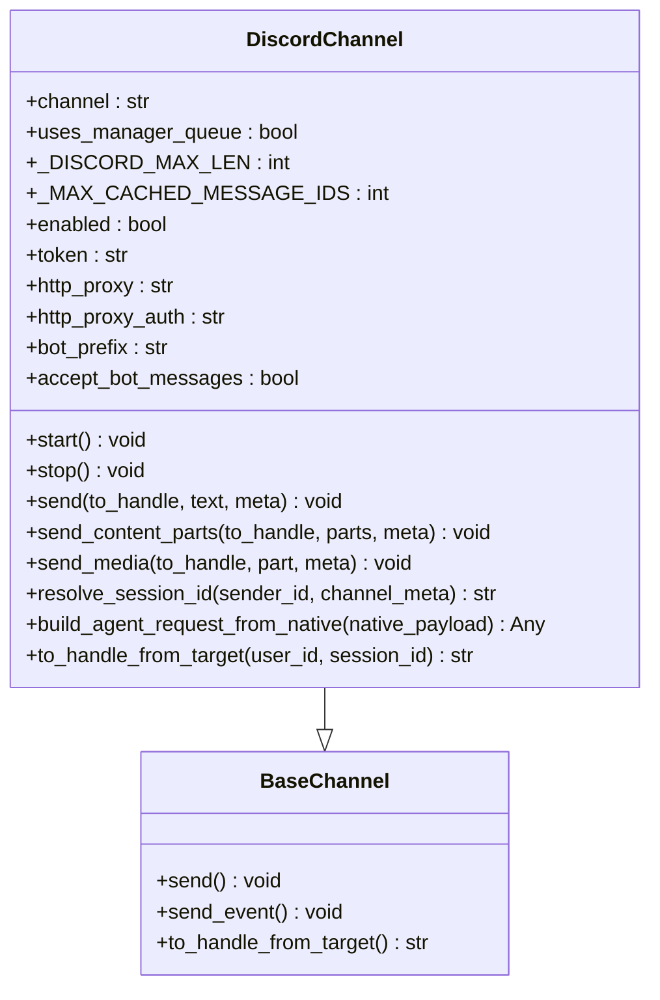
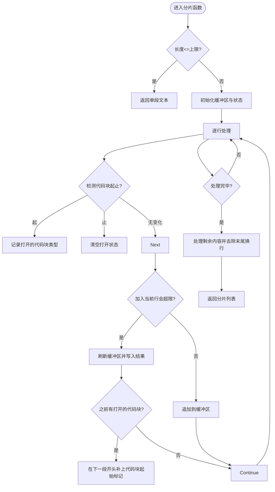
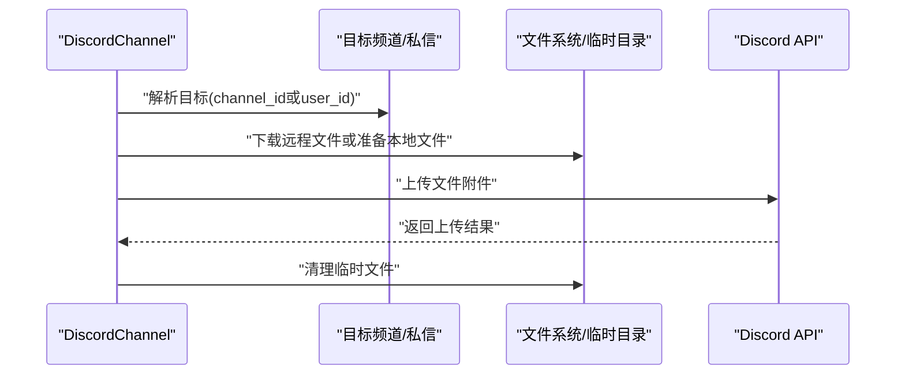
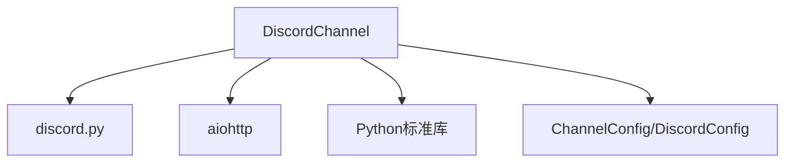

# Discord平台集成

<cite>
**本文档引用的文件**
- [channel.py](file://src/qwenpaw/app/channels/discord_/channel.py)
- [config.py](file://src/qwenpaw/config/config.py)
- [base.py](file://src/qwenpaw/app/channels/base.py)
- [channels.en.md](file://website/public/docs/channels.en.md)
- [rate_limiter.py](file://src/qwenpaw/providers/rate_limiter.py)
</cite>

## 目录
1. [简介](#简介)
2. [项目结构](#项目结构)
3. [核心组件](#核心组件)
4. [架构总览](#架构总览)
5. [详细组件分析](#详细组件分析)
6. [依赖关系分析](#依赖关系分析)
7. [性能考虑](#性能考虑)
8. [故障排除指南](#故障排除指南)
9. [结论](#结论)
10. [附录](#附录)

## 简介
本文件面向在Discord平台上集成QwenPaw的开发者与运维人员，系统性说明从应用创建、机器人账户设置到权限配置的完整流程；文档化Discord特有消息格式、嵌入式消息与富文本渲染机制；解释Discord Webhook配置、消息发送与频道权限管理；提供完整的配置参数说明（如bot_token、guild_id、channel_id等）与安全配置要求；详述Discord消息类型的转换规则与多媒体内容支持；给出Discord平台的API限制与速率控制策略；并总结服务器集成与频道管理的最佳实践。

## 项目结构
本项目的Discord集成位于应用通道层，采用模块化设计，核心类为DiscordChannel，负责接收与发送消息、解析元数据、处理媒体附件以及会话路由。配置通过ChannelConfig中的DiscordConfig进行集中管理，并支持环境变量与配置文件两种注入方式。

**图表来源**
- [channel.py:42-108](file://src/qwenpaw/app/channels/discord_/channel.py#L42-L108)
- [base.py:1130-1171](file://src/qwenpaw/app/channels/base.py#L1130-L1171)
- [config.py:62-67](file://src/qwenpaw/config/config.py#L62-L67)

**章节来源**
- [channel.py:42-108](file://src/qwenpaw/app/channels/discord_/channel.py#L42-L108)
- [config.py:226-245](file://src/qwenpaw/config/config.py#L226-L245)

## 核心组件
- DiscordChannel：Discord通道实现，负责事件监听、消息解析、会话路由、文本分片与媒体发送。
- DiscordConfig：Discord通道配置模型，包含bot_token、http_proxy、http_proxy_auth等字段。
- BaseChannel：通道基类，提供通用的发送接口、会话ID解析与目标路由能力。

关键特性
- 文本分片：自动按Discord字符上限拆分长文本，保留代码块闭合标签，避免破坏Markdown渲染。
- 媒体支持：支持图片、视频、音频与文件作为附件上传，本地文件与远程URL均受支持。
- 会话路由：基于DM或群组频道区分会话ID，确保上下文隔离。
- 安全控制：支持白名单/黑名单、@提及要求、忽略机器人消息等策略。

**章节来源**
- [channel.py:44-47](file://src/qwenpaw/app/channels/discord_/channel.py#L44-L47)
- [channel.py:359-431](file://src/qwenpaw/app/channels/discord_/channel.py#L359-L431)
- [channel.py:475-572](file://src/qwenpaw/app/channels/discord_/channel.py#L475-L572)
- [channel.py:595-616](file://src/qwenpaw/app/channels/discord_/channel.py#L595-L616)
- [config.py:62-67](file://src/qwenpaw/config/config.py#L62-L67)

## 架构总览
下图展示Discord通道在整体系统中的位置与交互关系：

**图表来源**
- [channel.py:110-274](file://src/qwenpaw/app/channels/discord_/channel.py#L110-L274)
- [channel.py:432-474](file://src/qwenpaw/app/channels/discord_/channel.py#L432-L474)
- [base.py:1130-1171](file://src/qwenpaw/app/channels/base.py#L1130-L1171)

## 详细组件分析

### DiscordChannel类分析
- 初始化与客户端
  - 动态导入discord库，启用Intents以接收消息内容、私信与服务器信息。
  - 支持HTTP代理与代理认证，便于国内网络访问。
- 消息接收与解析
  - 过滤自身与非允许的机器人消息，去重缓存（维护最大ID队列）。
  - 解析@提及与角色提及，移除提及标记后提取纯文本。
  - 识别附件类型（图片/视频/音频/文件），构造多内容部件。
  - 构建元数据（用户ID、频道ID、服务器ID、消息ID、是否DM/群组、是否被@）。
  - 访问控制：根据allow_from与策略（开放/白名单）决定是否处理。
- 发送流程
  - 解析目标：优先使用meta中的channel_id，否则解析user_id并获取/创建DM。
  - 文本分片：按Discord字符上限拆分，保留代码块闭合标签。
  - 媒体发送：支持file://与http(s)://，下载到临时文件后上传。
- 会话与路由
  - 会话ID：DM使用discord:dm:<user_id>，群组使用discord:ch:<channel_id>。
  - 目标路由：从session_id解析出channel_id或user_id。

**图表来源**
- [channel.py:42-108](file://src/qwenpaw/app/channels/discord_/channel.py#L42-L108)
- [channel.py:339-356](file://src/qwenpaw/app/channels/discord_/channel.py#L339-L356)
- [channel.py:432-572](file://src/qwenpaw/app/channels/discord_/channel.py#L432-L572)
- [base.py:1130-1171](file://src/qwenpaw/app/channels/base.py#L1130-L1171)

**章节来源**
- [channel.py:42-108](file://src/qwenpaw/app/channels/discord_/channel.py#L42-L108)
- [channel.py:110-274](file://src/qwenpaw/app/channels/discord_/channel.py#L110-L274)
- [channel.py:339-356](file://src/qwenpaw/app/channels/discord_/channel.py#L339-L356)
- [channel.py:432-572](file://src/qwenpaw/app/channels/discord_/channel.py#L432-L572)
- [channel.py:595-616](file://src/qwenpaw/app/channels/discord_/channel.py#L595-L616)

### 文本分片与Markdown处理
- 分片策略
  - 以换行符为边界拆分，优先保持格式。
  - 单行超过上限时硬切，避免溢出。
  - 跟踪代码块起止标记，跨段落自动补全闭合标签。
- Markdown渲染
  - 保留代码块、列表、链接等基础Markdown语法。
  - 通过分片策略保证跨消息片段的渲染一致性。

**图表来源**
- [channel.py:359-431](file://src/qwenpaw/app/channels/discord_/channel.py#L359-L431)

**章节来源**
- [channel.py:359-431](file://src/qwenpaw/app/channels/discord_/channel.py#L359-L431)

### 媒体发送流程
- 支持类型：图片、视频、音频、文件。
- 下载与上传：对http(s)链接先下载到临时文件再上传；对本地file://路径直接上传。
- 错误处理：下载失败或目标不可解析时记录警告并跳过。

**图表来源**
- [channel.py:504-572](file://src/qwenpaw/app/channels/discord_/channel.py#L504-L572)

**章节来源**
- [channel.py:504-572](file://src/qwenpaw/app/channels/discord_/channel.py#L504-L572)

### 配置参数与安全设置
- 环境变量与配置文件
  - DISCORD_CHANNEL_ENABLED：启用/禁用Discord通道。
  - DISCORD_BOT_TOKEN：Discord机器人令牌。
  - DISCORD_HTTP_PROXY / DISCORD_HTTP_PROXY_AUTH：HTTP代理与认证。
  - DISCORD_DM_POLICY / DISCORD_GROUP_POLICY：私信与群组访问策略（开放/白名单）。
  - DISCORD_ALLOW_FROM：白名单用户ID列表。
  - DISCORD_DENY_MESSAGE：拒绝消息提示。
  - DISCORD_REQUIRE_MENTION：是否必须@提及。
  - DISCORD_ACCEPT_BOT_MESSAGES：是否接受其他机器人的消息。
  - DISCORD_BOT_PREFIX：前缀标记。
- 配置模型
  - DiscordConfig：包含bot_token、http_proxy、http_proxy_auth、accept_bot_messages等字段。
  - ChannelConfig：统一管理各通道配置，默认包含discord键。

**章节来源**
- [channel.py:276-308](file://src/qwenpaw/app/channels/discord_/channel.py#L276-L308)
- [channel.py:310-337](file://src/qwenpaw/app/channels/discord_/channel.py#L310-L337)
- [config.py:62-67](file://src/qwenpaw/config/config.py#L62-L67)
- [config.py:226-245](file://src/qwenpaw/config/config.py#L226-L245)

### 应用创建与权限配置流程
- 创建应用与机器人
  - 在Discord开发者门户创建应用，添加Bot并复制Token。
  - 启用“消息内容意图”与“发送消息”权限。
  - 使用OAuth2生成邀请链接，将机器人添加到服务器。
- 配置渠道
  - 通过控制台或编辑agent.json填写bot_token等字段。
  - 可选配置HTTP代理以改善网络访问。

**章节来源**
- [channels.en.md:337-409](file://website/public/docs/channels.en.md#L337-L409)

## 依赖关系分析
- 组件耦合
  - DiscordChannel强依赖discord.py库与Discord API。
  - 与BaseChannel共享发送接口与会话路由约定。
  - 通过ChannelConfig注入配置，支持运行时热更新。
- 外部依赖
  - discord.py：事件驱动客户端与消息发送。
  - aiohttp：远程资源下载与代理支持。
  - Python标准库：正则表达式、临时文件、异步任务等。

**图表来源**
- [channel.py:90-108](file://src/qwenpaw/app/channels/discord_/channel.py#L90-L108)
- [channel.py:542-564](file://src/qwenpaw/app/channels/discord_/channel.py#L542-L564)
- [config.py:62-67](file://src/qwenpaw/config/config.py#L62-L67)

**章节来源**
- [channel.py:90-108](file://src/qwenpaw/app/channels/discord_/channel.py#L90-L108)
- [channel.py:542-564](file://src/qwenpaw/app/channels/discord_/channel.py#L542-L564)
- [config.py:62-67](file://src/qwenpaw/config/config.py#L62-L67)

## 性能考虑
- 文本分片
  - 按换行拆分减少内存峰值，避免一次性处理超长字符串。
  - 代码块闭合标签自动补齐降低渲染错误风险。
- 并发与速率控制
  - Discord通道本身不内置全局速率限制器；可结合应用级LLM速率限制策略使用。
  - 对于外部API调用（如下载媒体），建议复用全局速率限制器以避免触发429。
- 资源管理
  - 远程文件下载后及时清理临时文件，防止磁盘占用。
  - 会话去重缓存限制最大条目数，避免内存膨胀。

**章节来源**
- [channel.py:359-431](file://src/qwenpaw/app/channels/discord_/channel.py#L359-L431)
- [channel.py:567-572](file://src/qwenpaw/app/channels/discord_/channel.py#L567-L572)
- [rate_limiter.py:30-196](file://src/qwenpaw/providers/rate_limiter.py#L30-L196)

## 故障排除指南
- 无法接收消息
  - 检查机器人是否具备“消息内容意图”与“发送消息”权限。
  - 确认代理配置正确，必要时开启HTTP代理。
- 重复消息或消息丢失
  - 核对去重缓存是否正常工作，检查processed_message_ids集合大小。
- 媒体发送失败
  - 检查URL可达性与状态码；确认本地文件路径有效。
  - 关注下载失败日志并重试。
- 会话ID异常
  - 确认meta中channel_id或user_id是否正确传入。
  - DM与群组会话ID格式不同，注意区分。

**章节来源**
- [channel.py:110-134](file://src/qwenpaw/app/channels/discord_/channel.py#L110-L134)
- [channel.py:504-572](file://src/qwenpaw/app/channels/discord_/channel.py#L504-L572)
- [channel.py:640-650](file://src/qwenpaw/app/channels/discord_/channel.py#L640-L650)

## 结论
本方案提供了完整的Discord平台集成能力：从应用与机器人创建、权限配置，到消息接收与发送、媒体支持与会话管理。通过文本分片与媒体下载上传机制，兼顾了格式完整性与用户体验。配合白名单/黑名单与@提及策略，可满足企业级安全与合规需求。建议在生产环境中结合全局速率限制策略与代理配置，确保稳定性与可靠性。

## 附录

### Discord消息类型与转换规则
- 文本消息：按换行拆分，保留Markdown语法。
- 媒体消息：自动识别图片/视频/音频/文件，分别映射为对应内容部件。
- 元数据：包含用户ID、频道ID、服务器ID、消息ID、是否DM/群组、是否被@等。

**章节来源**
- [channel.py:168-242](file://src/qwenpaw/app/channels/discord_/channel.py#L168-L242)

### 多媒体内容支持
- 图片：image_url或file_url，支持远程与本地。
- 视频/音频/文件：data或file_url，支持远程下载与本地上传。
- 传输协议：http/https与file协议。

**章节来源**
- [channel.py:504-572](file://src/qwenpaw/app/channels/discord_/channel.py#L504-L572)

### API限制与速率控制
- Discord通道未内置速率限制器；建议结合全局LLM速率限制策略使用。
- 全局速率限制器提供并发控制、QPM滑动窗口与429冷却机制，适用于外部API调用场景。

**章节来源**
- [rate_limiter.py:30-196](file://src/qwenpaw/providers/rate_limiter.py#L30-L196)

### 最佳实践
- 服务器集成
  - 使用OAuth2邀请链接添加机器人，避免手动授权风险。
  - 将机器人置于独立服务器或专用频道，减少干扰。
- 频道管理
  - 私信与群组采用不同策略（开放/白名单），严格控制访问。
  - 启用@提及要求，降低噪音与误触发。
- 安全配置
  - 仅授予最小权限集，避免过度授权。
  - 使用HTTP代理与代理认证，保障网络访问安全。
  - 定期轮换bot_token，限制在受控环境中存储。

**章节来源**
- [channels.en.md:337-409](file://website/public/docs/channels.en.md#L337-L409)
- [channel.py:276-308](file://src/qwenpaw/app/channels/discord_/channel.py#L276-L308)