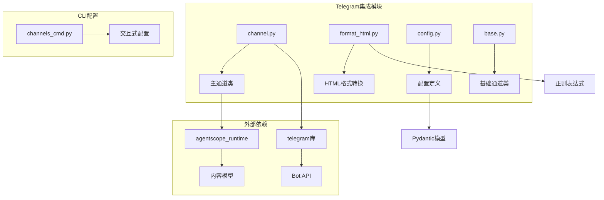
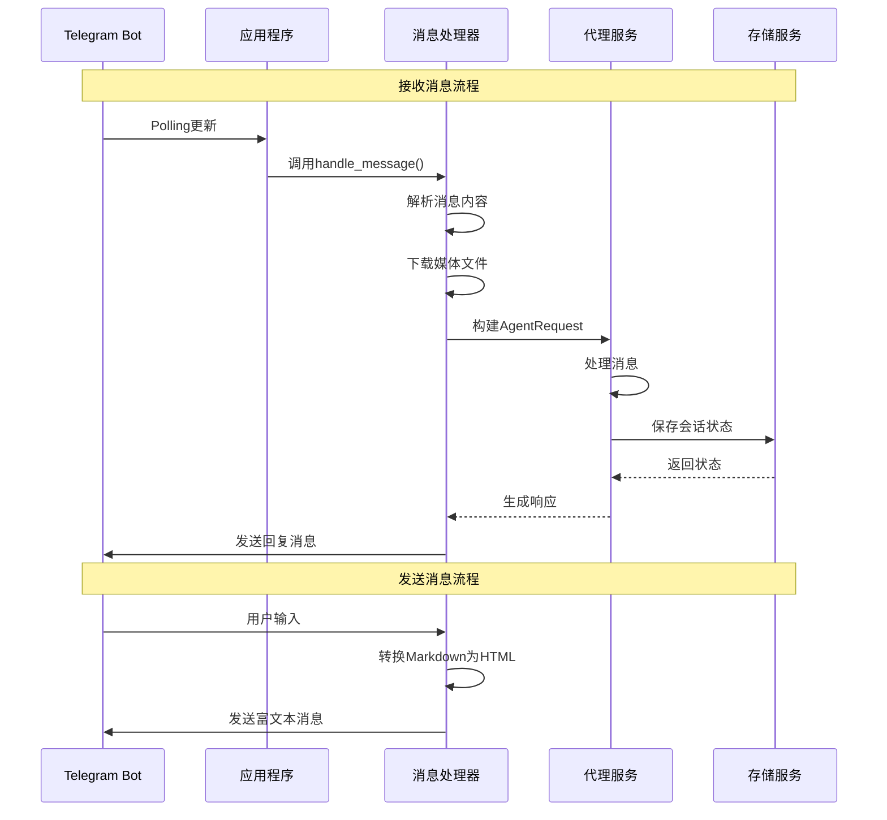
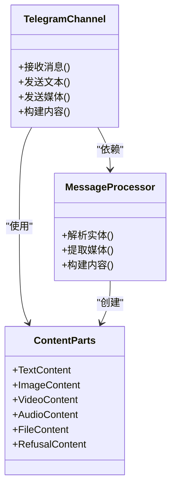
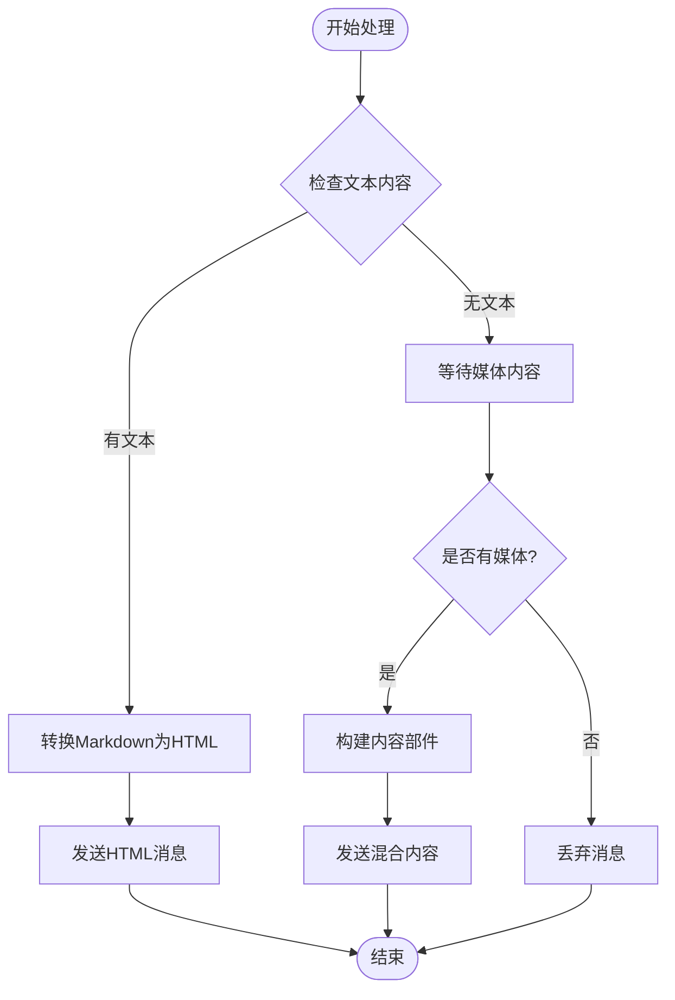
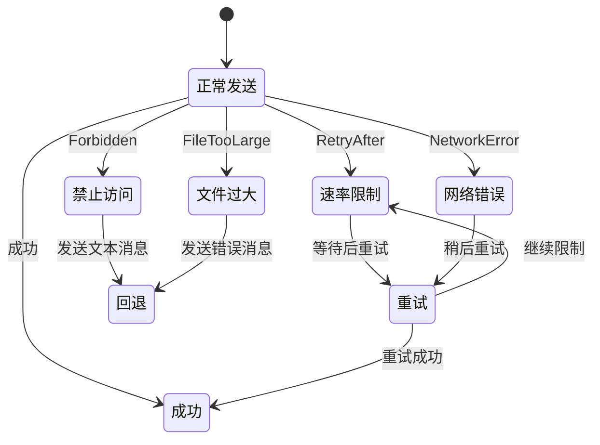
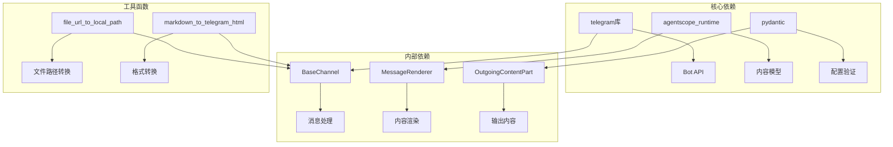

# Telegram平台集成

<cite>
**本文档引用的文件**
- [channel.py](file://src/qwenpaw/app/channels/telegram/channel.py)
- [format_html.py](file://src/qwenpaw/app/channels/telegram/format_html.py)
- [config.py](file://src/qwenpaw/config/config.py)
- [base.py](file://src/qwenpaw/app/channels/base.py)
- [channels_cmd.py](file://src/qwenpaw/cli/channels_cmd.py)
</cite>

## 目录
1. [简介](#简介)
2. [项目结构](#项目结构)
3. [核心组件](#核心组件)
4. [架构概览](#架构概览)
5. [详细组件分析](#详细组件分析)
6. [依赖关系分析](#依赖关系分析)
7. [性能考虑](#性能考虑)
8. [故障排除指南](#故障排除指南)
9. [结论](#结论)
10. [附录](#附录)

## 简介

Telegram平台集成为QwenPaw系统提供了与Telegram Bot API的完整集成能力。该集成支持通过Bot API进行消息收发，支持多种消息类型处理，包括文本、图片、视频、音频和文件，并提供了富文本格式转换和安全配置功能。

本技术文档详细说明了Telegram Bot的创建、Token获取和机器人设置流程，文档化了Telegram特有的消息格式、HTML解析和Markdown渲染机制，详细说明了Telegram消息类型处理、Inline键盘和交互式按钮支持，包含了完整的配置参数说明和安全配置要求，解释了Telegram消息格式转换和富文本处理规则，并提供了Telegram平台的API调用限制和消息发送策略，以及私聊、群组和频道的不同集成方式和权限管理。

## 项目结构

Telegram集成位于应用通道模块中，采用模块化设计：

**图表来源**
- [channel.py:1-50](file://src/qwenpaw/app/channels/telegram/channel.py#L1-L50)
- [format_html.py:1-20](file://src/qwenpaw/app/channels/telegram/format_html.py#L1-L20)
- [config.py:110-115](file://src/qwenpaw/config/config.py#L110-L115)

**章节来源**
- [channel.py:1-100](file://src/qwenpaw/app/channels/telegram/channel.py#L1-L100)
- [config.py:110-115](file://src/qwenpaw/config/config.py#L110-L115)

## 核心组件

### TelegramChannel类

TelegramChannel是主要的集成类，继承自BaseChannel，实现了Telegram Bot的所有核心功能：

- **Bot连接管理**：使用Polling模式监听消息更新
- **消息处理**：支持文本、媒体文件等多种消息类型
- **富文本渲染**：将Markdown转换为Telegram兼容的HTML
- **权限控制**：支持私聊和群组的访问控制
- **错误处理**：完善的异常捕获和重试机制

### 消息格式转换器

format_html模块提供了标准Markdown到Telegram HTML的转换功能：

- 支持代码块、内联代码、链接、标题等格式
- 处理粗体、斜体、删除线等文本样式
- 支持Spoiler效果和块引用
- 提供回退机制确保消息可读性

**章节来源**
- [channel.py:264-334](file://src/qwenpaw/app/channels/telegram/channel.py#L264-L334)
- [format_html.py:22-162](file://src/qwenpaw/app/channels/telegram/format_html.py#L22-L162)

## 架构概览

Telegram集成采用事件驱动架构，通过Bot API进行双向通信：

**图表来源**
- [channel.py:363-436](file://src/qwenpaw/app/channels/telegram/channel.py#L363-L436)
- [channel.py:599-652](file://src/qwenpaw/app/channels/telegram/channel.py#L599-L652)

## 详细组件分析

### Bot创建和Token管理

#### Bot创建流程

1. **通过BotFather创建Bot**
   - 在Telegram中搜索@BotFather
   - 使用/newbot命令创建新Bot
   - 设置Bot名称和用户名
   - 获取Bot Token

2. **Token配置选项**
   - 环境变量配置：TELEGRAM_BOT_TOKEN
   - CLI交互配置：通过channels_cmd.py进行配置
   - 配置文件：TelegramConfig模型

#### Token安全要求

- **最小权限原则**：Bot应仅授予必要的权限
- **Token存储**：建议使用环境变量而非硬编码
- **访问控制**：结合allow_from列表限制访问
- **定期轮换**：建议定期更换Bot Token

**章节来源**
- [channels_cmd.py:457-469](file://src/qwenpaw/cli/channels_cmd.py#L457-L469)
- [config.py:110-115](file://src/qwenpaw/config/config.py#L110-L115)

### 消息格式处理

#### 支持的消息类型

TelegramChannel支持以下消息类型：

**图表来源**
- [channel.py:140-237](file://src/qwenpaw/app/channels/telegram/channel.py#L140-L237)
- [base.py:24-34](file://src/qwenpaw/app/channels/base.py#L24-L34)

#### 富文本处理机制

**图表来源**
- [format_html.py:22-162](file://src/qwenpaw/app/channels/telegram/format_html.py#L22-L162)
- [channel.py:528-548](file://src/qwenpaw/app/channels/telegram/channel.py#L528-L548)

### 权限管理和安全控制

#### 访问控制策略

TelegramChannel实现了多层次的权限控制：

1. **全局策略**
   - dm_policy：私聊策略（open/allowlist）
   - group_policy：群组策略（open/allowlist）
   - require_mention：是否需要提及

2. **用户白名单**
   - allow_from：允许的用户ID列表
   - deny_message：拒绝消息内容

3. **会话隔离**
   - 基于chat_id的会话管理
   - 每个聊天一个独立会话

**章节来源**
- [base.py:80-102](file://src/qwenpaw/app/channels/base.py#L80-L102)
- [channel.py:399-422](file://src/qwenpaw/app/channels/telegram/channel.py#L399-L422)

### API调用限制和消息发送策略

#### 速率限制处理

Telegram API存在严格的速率限制：

**图表来源**
- [channel.py:739-769](file://src/qwenpaw/app/channels/telegram/channel.py#L739-L769)

#### 消息大小限制

- **文本消息**：最大4096字符（自动分片发送）
- **媒体文件**：最大50MB
- **重连策略**：指数退避重连（最大30秒）

**章节来源**
- [channel.py:48-52](file://src/qwenpaw/app/channels/telegram/channel.py#L48-L52)
- [channel.py:945-967](file://src/qwenpaw/app/channels/telegram/channel.py#L945-L967)

### 不同聊天类型的集成方式

#### 私聊集成

私聊是最简单的集成方式：

- 直接基于user_id进行消息路由
- 无需提及即可触发Bot响应
- 支持完整的对话历史管理

#### 群组集成

群组需要额外的配置：

- require_mention：需要@Bot用户名提及
- group_policy：群组访问策略
- allow_from：群组白名单用户

#### 频道集成

频道支持有限：

- 主要用于广播消息
- Bot无法主动发起对话
- 适合单向消息推送

**章节来源**
- [channel.py:240-261](file://src/qwenpaw/app/channels/telegram/channel.py#L240-L261)
- [channel.py:421](file://src/qwenpaw/app/channels/telegram/channel.py#L421)

## 依赖关系分析

### 外部依赖

Telegram集成依赖以下关键组件：

**图表来源**
- [channel.py:15-44](file://src/qwenpaw/app/channels/telegram/channel.py#L15-L44)
- [base.py:24-67](file://src/qwenpaw/app/channels/base.py#L24-L67)

### 内部耦合度

TelegramChannel与基类的耦合度适中：

- **高内聚**：所有Telegram特定功能集中在单一类中
- **低耦合**：通过接口与基类交互
- **扩展性**：易于添加新的消息类型支持

**章节来源**
- [channel.py:335-437](file://src/qwenpaw/app/channels/telegram/channel.py#L335-L437)
- [base.py:70-127](file://src/qwenpaw/app/channels/base.py#L70-L127)

## 性能考虑

### 连接管理

- **Polling模式**：使用长轮询减少服务器负载
- **自动重连**：指数退避算法避免过度请求
- **超时配置**：合理的读取和连接超时设置

### 内存优化

- **媒体文件缓存**：临时文件下载到本地目录
- **会话状态管理**：基于chat_id的轻量级会话跟踪
- **内容分片**：大文本自动分片发送

### 并发处理

- **异步I/O**：完全基于asyncio的非阻塞操作
- **任务管理**：独立的typing指示器任务
- **队列处理**：通过ChannelManager统一调度

## 故障排除指南

### 常见问题诊断

#### 连接问题

| 问题症状 | 可能原因 | 解决方案 |
|---------|---------|---------|
| 无法接收消息 | Bot Token无效 | 检查TELEGRAM_BOT_TOKEN配置 |
| 连接频繁断开 | 网络不稳定 | 检查防火墙设置，使用代理 |
| 代理认证失败 | 代理凭据错误 | 验证TELEGRAM_HTTP_PROXY_AUTH |

#### 消息发送问题

| 问题症状 | 可能原因 | 解决方案 |
|---------|---------|---------|
| 文本被截断 | 超过4096字符限制 | 启用自动分片发送 |
| 媒体发送失败 | 文件过大(>50MB) | 分割文件或压缩 |
| 格式丢失 | HTML标签不兼容 | 使用format_html模块转换 |

#### 权限问题

| 问题症状 | 可能原因 | 解决方案 |
|---------|---------|---------|
| Bot被拒绝 | 缺少必要权限 | 检查Bot权限设置 |
| 消息被忽略 | require_mention启用 | 在群组中@Bot用户名 |
| 访问被阻止 | 白名单限制 | 添加用户到allow_from列表 |

**章节来源**
- [channel.py:945-967](file://src/qwenpaw/app/channels/telegram/channel.py#L945-L967)
- [channel.py:739-769](file://src/qwenpaw/app/channels/telegram/channel.py#L739-L769)

### 调试技巧

1. **启用详细日志**：查看telegram模块的日志输出
2. **检查环境变量**：确认所有必需的环境变量已设置
3. **测试Bot连接**：使用简单的echo测试验证连接
4. **监控API限制**：关注速率限制警告信息

## 结论

Telegram平台集成为QwenPaw提供了完整、可靠的即时通讯集成解决方案。通过精心设计的架构和完善的错误处理机制，该集成能够稳定地处理各种消息类型和复杂的权限管理需求。

关键优势包括：
- **全面的消息支持**：从纯文本到富文本和多媒体内容
- **灵活的权限控制**：支持私聊、群组和频道的不同集成方式
- **健壮的错误处理**：完善的异常捕获和恢复机制
- **高性能设计**：基于异步I/O的高效消息处理

建议在生产环境中：
- 使用环境变量管理敏感配置
- 实施适当的日志记录和监控
- 定期审查和更新Bot权限
- 准备应急预案以应对API限制

## 附录

### 配置参数完整说明

#### TelegramConfig配置项

| 参数名 | 类型 | 默认值 | 描述 |
|-------|------|--------|------|
| enabled | bool | False | 是否启用Telegram通道 |
| bot_token | str | "" | Telegram Bot Token |
| http_proxy | str | "" | HTTP代理地址 |
| http_proxy_auth | str | "" | 代理认证信息 |
| bot_prefix | str | "" | Bot前缀标识 |
| show_typing | Optional[bool] | None | 是否显示打字指示 |
| dm_policy | str | "open" | 私聊策略(open/allowlist) |
| group_policy | str | "open" | 群组策略(open/allowlist) |
| allow_from | List[str] | [] | 允许的用户ID列表 |
| deny_message | str | "" | 拒绝消息内容 |
| require_mention | bool | False | 是否需要提及 |

#### 环境变量

| 环境变量名 | 用途 | 示例值 |
|-----------|------|--------|
| TELEGRAM_CHANNEL_ENABLED | 启用开关 | "1" |
| TELEGRAM_BOT_TOKEN | Bot Token | "123456789:ABC-DEF1234ghIkl-mnopQR567STUV89wxyZ" |
| TELEGRAM_HTTP_PROXY | HTTP代理 | "http://127.0.0.1:7890" |
| TELEGRAM_HTTP_PROXY_AUTH | 代理认证 | "username:password" |
| TELEGRAM_BOT_PREFIX | Bot前缀 | "@mybot" |
| TELEGRAM_SHOW_TYPING | 打字指示 | "1" |
| TELEGRAM_DM_POLICY | 私聊策略 | "open" |
| TELEGRAM_GROUP_POLICY | 群组策略 | "allowlist" |
| TELEGRAM_ALLOW_FROM | 允许用户 | "123456789,987654321" |
| TELEGRAM_DENY_MESSAGE | 拒绝消息 | "您没有权限使用此Bot" |
| TELEGRAM_REQUIRE_MENTION | 需要提及 | "1" |

### API限制参考

#### 速率限制

- **消息发送频率**：每分钟最多20条消息
- **媒体上传频率**：每小时最多50次
- **文件大小限制**：50MB以内
- **消息长度限制**：4096字符

#### 错误码处理

- **BadRequest**：参数错误，检查消息格式
- **Forbidden**：权限不足，检查Bot权限
- **RetryAfter**：临时限制，等待指定时间后重试
- **TimedOut**：网络超时，检查网络连接
- **InvalidToken**：Token无效，重新获取